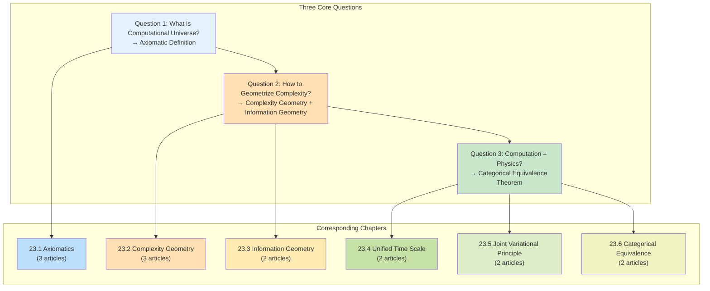
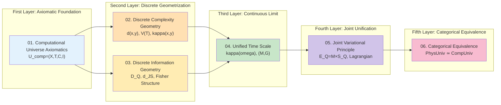
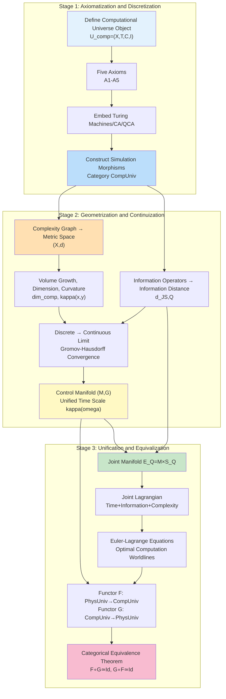
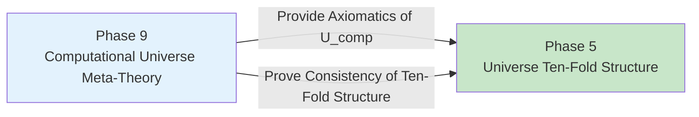
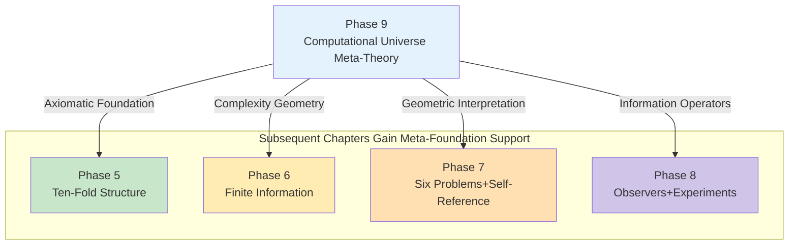

# 23.0 Computational Universe Meta-Theory Overview: Strict Mathematical Foundation of Universe as Computation

**Source Theory**:
- docs/euler-gls-info/01-computational-universe-axiomatics.md
- docs/euler-gls-info/02-discrete-complexity-geometry.md
- docs/euler-gls-info/03-discrete-information-geometry.md
- docs/euler-gls-info/04-unified-time-scale-continuous-complexity-geometry.md
- docs/euler-gls-info/05-time-information-complexity-variational-principle.md
- docs/euler-gls-info/06-categorical-equivalence-computational-physical-universes.md

This chapter is the **meta-foundation** of the entire GLS unified theory, answering a most fundamental question: **Why can the universe be viewed as a computational system?** This is not a popular science metaphor, but a strict mathematical construction—starting from axiomatic definitions, through geometrization, ultimately proving that the "computational universe category" and "physical universe category" are mathematically completely equivalent.

---

## 1. Why Do We Need Meta-Foundations?

### 1.1 The "Missing Foundation" Problem in Current Tutorial

In previous chapters, we have completed a rich theoretical system:

- **Phase 5** (Chapter 15): Universe's ten-fold structure $\mathfrak{U}=(U_{\text{evt}},U_{\text{geo}},\dots,U_{\text{comp}})$
- **Phase 6** (Chapter 16): Finite information parameter universe QCA
- **Phase 7-8** (Chapters 17-22): Six major physical problems, self-referential topology, observer consciousness, experimental verification, time crystals

But there is a key problem: **These theories all assume "universe can be viewed as some computational system", but never strictly prove this assumption.**

**Everyday Analogy**: Like building a skyscraper—Phase 5-8 have built a 50-story building, but the foundation (why can building materials bear weight? Why does reinforced concrete have such mechanical properties?) has not been strictly argued. Phase 9 is to **fill in this foundation**.

### 1.2 Three Core Questions

This chapter will answer three progressive questions:

**Question 1**: What is the strict mathematical definition of "computational universe"?
- Not a metaphor ("universe is like a computer")
- But an axiomatic object: $U_{\mathrm{comp}}=(X,\mathsf{T},\mathsf{C},\mathsf{I})$
- Includes all computational models: Turing machines, cellular automata, quantum cellular automata, etc.

**Question 2**: How to geometrize "computational complexity"?
- Traditional complexity theory: Complexity classes like $P$, $NP$, $BQP$
- Geometrization: Characterize using geometric invariants like "curvature", "volume growth", "dimension"
- Why are some problems "hard"? The answer lies in the geometry of complexity space

**Question 3**: Why "Computational Universe = Physical Universe"?
- Not an analogy, but **categorical equivalence**: $\mathbf{PhysUniv}^{\mathrm{QCA}} \simeq \mathbf{CompUniv}^{\mathrm{phys}}$
- There exist bidirectional functors $F,G$ such that $F\circ G\simeq \mathrm{Id}$, $G\circ F\simeq \mathrm{Id}$
- This means they are **completely the same** in mathematical structure, just different "languages"

---

## 2. Dependency Relations of Six Source Theories

This chapter is based on 6 core theoretical files under euler-gls-info/ directory, forming a complete theoretical chain:

### 2.1 Theoretical Chain Overview

### 2.2 Brief Introduction to Six Theories

#### Theory 01: Axiomatic Structure of Computational Universe

**Core Object**: $U_{\mathrm{comp}}=(X,\mathsf{T},\mathsf{C},\mathsf{I})$

- $X$: Configuration set (e.g., tape states of Turing machines, lattice states of cellular automata)
- $\mathsf{T}\subset X\times X$: One-step update relation (which states can jump to which states)
- $\mathsf{C}:X\times X\to[0,\infty]$: Single-step cost (how much "time" needed to execute one update)
- $\mathsf{I}:X\to\mathbb{R}$: Information quality function (how far current state is from "target")

**Five Axioms**:
1. **A1** (Finite Information Density): Each local region can only store finite bits
2. **A2** (Local Update): Each step update only affects finite range
3. **A3** (Generalized Reversibility): Time can be "reversed" (in physically relevant subspace)
4. **A4** (Cost Additivity): Cost of two steps = first step + second step
5. **A5** (Information Monotonicity): Information quality does not decrease during computation

**Everyday Analogy**: Like "board game"—$X$ is all possible game positions, $\mathsf{T}$ is legal moves, $\mathsf{C}$ is thinking time needed per move, $\mathsf{I}$ is "advantage score" of current position. Five axioms guarantee this game is "physically realizable".

#### Theory 02: Discrete Complexity Geometry of Computational Universe

**Core Construction**: Turn configuration space $X$ into "metric space"

- **Complexity Graph**: $G_{\mathrm{comp}}=(X,E,w)$, edge weight $w(x,y)=\mathsf{C}(x,y)$
- **Complexity Distance**: $d(x,y)=\inf_{\gamma:x\to y}\mathsf{C}(\gamma)$ (most resource-efficient path from $x$ to $y$)
- **Reachable Domain**: $B_T(x_0)=\{x:d(x_0,x)\le T\}$ (states reachable within resource budget $T$)
- **Volume Growth**: $V_{x_0}(T)=|B_T(x_0)|$ (number of reachable states)

**Key Discoveries**:
- **Complexity Dimension**: $\dim_{\mathrm{comp}}=\lim(\log V/\log T)$
  - $P$ class problems: $\dim_{\mathrm{comp}}=O(1)$ (polynomial growth)
  - $NP$-hard problems: $\dim_{\mathrm{comp}}=\infty$ (exponential growth)

- **Discrete Ricci Curvature**: $\kappa(x,y)=1-W_1(m_x,m_y)/d(x,y)$
  - Non-negative curvature ($\kappa\ge 0$) → Polynomial complexity
  - Negative curvature ($\kappa<0$) → Exponential complexity

**Everyday Analogy**: Like "city traffic network"—$X$ is all locations, $d(x,y)$ is shortest travel time, $B_T(x_0)$ is "places reachable in $T$ hours". $\dim_{\mathrm{comp}}$ measures "how big this city is", $\kappa(x,y)$ measures "how congested this road is".

#### Theory 03: Discrete Information Geometry of Computational Universe

**Core Idea**: Besides "complexity" (resource consumption), there is also "information" (task completion)

- **Observation Operator Family**: $\mathcal{O}=\{O_j:X\to\Delta(Y_j)\}$ (execute observation $O_j$ at state $x$, get probability distribution)
- **Task-Aware Relative Entropy**: $D_Q(x\|y)=\sum_z p_x^{(Q)}(z)\log(p_x^{(Q)}/p_y^{(Q)})$ (distinguishability of states $x,y$ for task $Q$)
- **Information Distance**: $d_{\mathrm{JS},Q}(x,y)=\sqrt{2\mathrm{JS}_Q(x,y)}$ (distance between two states in information space)

**Key Theorem**:
- **Information-Complexity Inequality**: $\dim_{\mathrm{info},Q}\le\dim_{\mathrm{comp}}$
  - Dimension of information space cannot exceed complexity space
  - Intuition: "What you can see cannot exceed what you can compute"

- **Fisher Structure**: Locally, $d_{\mathrm{JS},Q}\approx\sqrt{\theta^\top g_Q\theta}$ (quadratic form)
  - Information space is locally a Riemann manifold

**Everyday Analogy**: Like "treasure hunt game"—$X$ is all possible locations, $D_Q(x\|y)$ is "how different clues seen at $x$ are from those at $y$". Information geometry tells you "logical distance of these clues", not physical distance.

#### Theory 04: Unified Time Scale and Continuous Complexity Geometry

**Core Bridge**: From discrete computation to continuous physical spacetime

- **Unified Time Scale Density**:
$$
\kappa(\omega)=\frac{\varphi'(\omega)}{\pi}=\rho_{\mathrm{rel}}(\omega)=\frac{1}{2\pi}\mathrm{tr}Q(\omega)
$$
  - This is the trinity of "scattering phase derivative" = "spectral shift density" = "group delay trace"
  - Single-step cost can be written as: $\mathsf{C}(x,y)=\int\kappa(\omega)d\mu_{x,y}(\omega)$

- **Control Manifold**: $(\mathcal{M},G)$
  - $\mathcal{M}$: Control parameter space (e.g., parameters of scattering matrix family)
  - $G_{ab}(\theta)=\int w(\omega)\mathrm{tr}(\partial_aQ\partial_bQ)d\omega$: Metric
  - This metric is the Riemann version of "complexity distance" in continuous limit

- **Gromov-Hausdorff Convergence**: $(X^{(h)},d^{(h)})\xrightarrow{GH}(\mathcal{M},d_G)$
  - When discrete step size $h\to 0$, discrete complexity graph converges to continuous manifold

**Everyday Analogy**: Like "pixels to continuous image"—discrete pixel grid $(X,d)$ gradually becomes continuous canvas $(\mathcal{M},G)$ as resolution increases. $\kappa(\omega)$ is "time density corresponding to each frequency", like "brightness corresponding to each color".

#### Theory 05: Time–Information–Complexity Joint Variational Principle

**Core Unification**: Unify "time", "information", "complexity" with one Lagrangian

- **Joint Manifold**: $\mathcal{E}_Q=\mathcal{M}\times\mathcal{S}_Q$
  - $\mathcal{M}$: Control manifold (complexity geometry)
  - $\mathcal{S}_Q$: Information manifold (information geometry)

- **Lagrangian**:
$$
L(\theta,\dot\theta;\phi,\dot\phi)=\frac{1}{2}\alpha^2G_{ab}\dot\theta^a\dot\theta^b+\frac{1}{2}\beta^2g_{ij}\dot\phi^i\dot\phi^j-\gamma U_Q(\phi)
$$
  - First term: Kinetic energy of control part (complexity cost)
  - Second term: Kinetic energy of information part (information flow)
  - Third term: Information potential energy (task objective)

- **Euler-Lagrange Equations**:
  - Control part: $\ddot\theta^a+\Gamma^a_{bc}\dot\theta^b\dot\theta^c=0$ (geodesic)
  - Information part: $\ddot\phi^i+\Gamma^i_{jk}\dot\phi^j\dot\phi^k=-(\gamma/\beta^2)g^{ij}\partial_jU_Q$ (potential-driven)

**Key Insight**: **Optimal computation path = geodesic on joint manifold** (under potential field)

**Everyday Analogy**: Like "mountain climbing route"—$\theta$ is geographic location (complexity), $\phi$ is altitude (information). Optimal route must consider both "walking fast" (minimize complexity) and "climbing high" (maximize information), also constrained by "terrain" (potential field $U_Q$). Euler-Lagrange equations are "most energy-efficient climbing path".

#### Theory 06: Categorical Equivalence of Computational and Physical Universes

**Ultimate Theorem**: $\mathbf{PhysUniv}^{\mathrm{QCA}}\simeq\mathbf{CompUniv}^{\mathrm{phys}}$

- **Physical Universe Object**: $U_{\mathrm{phys}}=(M,g,\mathcal{F},\kappa,\mathsf{S})$
  - $(M,g)$: Spacetime manifold and metric
  - $\mathcal{F}$: Matter field content (electromagnetic fields, fermions, etc.)
  - $\kappa(\omega)$: Unified time scale density
  - $\mathsf{S}(\omega)$: Scattering data

- **Functor $F$**: From physical universe to computational universe
  - Discretize QCA evolution operator $U$ into $(X,\mathsf{T},\mathsf{C},\mathsf{I})$
  - $X$=QCA basis state set, $\mathsf{T}=\{(x,y):\langle y|U|x\rangle\ne 0\}$
  - $\mathsf{C}$ given by $\kappa(\omega)$

- **Functor $G$**: From computational universe to physical universe
  - Reconstruct discrete configuration graph $(X,d)$ as manifold $(M,g)$ through Gromov-Hausdorff convergence
  - Reconstruct causal structure through Lieb-Robinson light cone

- **Equivalence**: $F\circ G\simeq\mathrm{Id}$, $G\circ F\simeq\mathrm{Id}$
  - There exist natural isomorphisms $\eta,\epsilon$ such that going around once "almost returns to origin"
  - Invariants: Complexity geometry ($d_G$), information geometry ($g_Q$), unified time scale ($\kappa(\omega)$)

**Everyday Analogy**: Like "perfect translation between Chinese and English"—if there exist two functors $F$ (Chinese→English) and $G$ (English→Chinese), such that $F\circ G$ (Chinese→English→Chinese) = "identity map", $G\circ F$ (English→Chinese→English) = "identity map", then Chinese and English are completely equivalent in "information structure", just different "expressions".

---

## 3. Overall Roadmap: From Axioms to Equivalence

### 3.1 Three Major Stages

The entire theory is divided into three progressive stages:

### 3.2 Key Milestones

| Stage | Milestone | Significance | Corresponding Chapters |
|-------|-----------|--------------|----------------------|
| **Stage 1** | Axiomatic definition $U_{\mathrm{comp}}$ | Strict definition of "universe as computation" | 23.01-02 |
| | Category $\mathbf{CompUniv}$ | Equivalence of different computational models | 23.02 |
| **Stage 2** | Complexity geometry $(X,d,V,\dim,\kappa)$ | Geometric characterization of complexity classes | 23.03-05 |
| | Information geometry $(\mathcal{S}_Q,d_{\mathrm{JS}},g_Q)$ | Task-aware information structure | 23.06-07 |
| | Gromov-Hausdorff convergence | Strict bridge from discrete→continuous | 23.08-09 |
| | Unified time scale $\kappa(\omega)$ | Computation time = physical time | 23.08 |
| **Stage 3** | Joint manifold $\mathcal{E}_Q$ | Unification of time/information/complexity | 23.10 |
| | Euler-Lagrange equations | Optimal computation = geodesic | 23.11 |
| | Categorical equivalence $\mathbf{PhysUniv}\simeq\mathbf{CompUniv}$ | Strict statement of "universe is computation" | 23.12 |

---

## 4. Interface with Completed Chapters

### 4.1 Meta-Foundation of Phase 5 (Universe's Ten-Fold Structure)

**Phase 5 Construction**: $\mathfrak{U}=(U_{\text{evt}},U_{\text{geo}},\dots,U_{\text{comp}})$

**Phase 9 Supplement**:
- Axiomatic definition of $U_{\text{comp}}=(X,\mathsf{T},\mathsf{C},\mathsf{I})$ (23.01)
- Why can $U_{\text{comp}}$ serve as the 10th component of universe? (23.12 categorical equivalence)
- How to derive compatibility conditions of ten-fold structure from axioms? (23.06 information-complexity inequality)

### 4.2 Complexity Foundation of Phase 6 (Finite Information Universe)

**Phase 6 Core**: $I_{\text{param}}(\Theta)+S_{\max}(\Theta)\le I_{\max}$

**Phase 9 Supplement**:
- How to estimate information capacity $I_{\max}$ from volume growth of configuration space $X$? (23.04 complexity dimension)
- What is the complexity geometry of parameter vector $\Theta$? (23.05 Ricci curvature)
- Why does finite information imply locality? (23.01 axiom A1)

### 4.3 Computational Interpretation of Phase 7-8 (Physical Problems and Experiments)

**Phase 7.1 (Six Major Physical Problems)**:
- Relationship between black hole entropy $S_{\mathrm{BH}}$ and cell number $d_{\text{eff}}$ → 23.04 volume growth
- Cosmological constant $\Lambda$ and spectral shift density $\rho_{\mathrm{rel}}$ → 23.08 unified time scale
- Neutrino mass and parameter complexity → 23.06 information geometry

**Phase 7.2 (Self-Referential Topology)**:
- $\pi$-step quantization → 23.05 discrete version of Ricci curvature
- $\mathbb{Z}_2$ parity → 23.02 symmetry of simulation morphisms

**Phase 8 (Observers, Experiments, Time Crystals)**:
- Observer's attention operators → 23.06 observation operator family $\mathcal{O}$
- DPSS windowed readout → 23.07 Fisher structure
- Floquet-QCA time crystals → 23.01 QCA embedding

---

## 5. Core Formula Quick Reference

### 5.1 Axiomatics and Categories

| Object/Concept | Formula | Meaning |
|----------------|---------|---------|
| Computational Universe Object | $U_{\mathrm{comp}}=(X,\mathsf{T},\mathsf{C},\mathsf{I})$ | Configuration+Update+Cost+Information |
| Complexity Distance | $d(x,y)=\inf_{\gamma:x\to y}\mathsf{C}(\gamma)$ | Cost of optimal path |
| Reachable Domain | $B_T(x_0)=\{x:d(x_0,x)\le T\}$ | States reachable within budget $T$ |
| Simulation Map | $f:X\to X'$ satisfies $\mathsf{C}'(\gamma')\le\alpha\mathsf{C}(\gamma)+\beta$ | Cost-controlled morphism |
| Computational Universe Category | $\mathbf{CompUniv}$ | Objects=Computational universes, Morphisms=Simulations |

### 5.2 Complexity Geometry

| Object/Concept | Formula | Meaning |
|----------------|---------|---------|
| Volume Function | $V_{x_0}(T)=\|B_T(x_0)\|$ | Number of reachable states |
| Complexity Dimension | $\dim_{\mathrm{comp}}=\limsup(\log V/\log T)$ | "Dimension" of space |
| Discrete Ricci Curvature | $\kappa(x,y)=1-W_1(m_x,m_y)/d(x,y)$ | "Curvature" of space |
| Non-Negative Curvature Implies | $\kappa\ge 0\Rightarrow V(T)\le CT^{d_*}$ | Polynomial growth (P class) |
| Negative Curvature Implies | $\kappa<0\Rightarrow V(nT_0)\ge c\lambda^n$ | Exponential growth (NP-hard) |

### 5.3 Information Geometry

| Object/Concept | Formula | Meaning |
|----------------|---------|---------|
| Observation Operator | $O_j:X\to\Delta(Y_j)$ | Configuration→Probability distribution |
| Task Relative Entropy | $D_Q(x\|y)=\sum_z p_x^{(Q)}(z)\log(p_x^{(Q)}/p_y^{(Q)})$ | Information distinguishability |
| JS Distance | $d_{\mathrm{JS},Q}(x,y)=\sqrt{2\mathrm{JS}_Q(x,y)}$ | Information metric |
| Fisher Matrix | $g_{ij}^{(Q)}(\theta)=\sum_z p(\theta,z)\partial_i\log p\partial_j\log p$ | Metric of information manifold |
| Information-Complexity Inequality | $\dim_{\mathrm{info},Q}\le\dim_{\mathrm{comp}}$ | Information cannot exceed computation |

### 5.4 Unified Time Scale and Joint Principle

| Object/Concept | Formula | Meaning |
|----------------|---------|---------|
| Unified Time Scale | $\kappa(\omega)=\varphi'(\omega)/\pi=\rho_{\mathrm{rel}}(\omega)=(2\pi)^{-1}\mathrm{tr}Q(\omega)$ | Trinity master ruler |
| Control Manifold Metric | $G_{ab}(\theta)=\int w(\omega)\mathrm{tr}(\partial_aQ\partial_bQ)d\omega$ | Riemann version of complexity |
| Gromov-Hausdorff Convergence | $(X^{(h)},d^{(h)})\xrightarrow{GH}(\mathcal{M},d_G)$ | Discrete→Continuous |
| Joint Manifold | $\mathcal{E}_Q=\mathcal{M}\times\mathcal{S}_Q$ | Control×Information |
| Lagrangian | $L=\frac{1}{2}\alpha^2G_{ab}\dot\theta^a\dot\theta^b+\frac{1}{2}\beta^2g_{ij}\dot\phi^i\dot\phi^j-\gamma U_Q(\phi)$ | Time+Information+Complexity |

### 5.5 Categorical Equivalence

| Object/Concept | Formula | Meaning |
|----------------|---------|---------|
| Physical Universe Object | $U_{\mathrm{phys}}=(M,g,\mathcal{F},\kappa,\mathsf{S})$ | Spacetime+Fields+Time Scale+Scattering |
| Functor $F$ | $F:\mathbf{PhysUniv}^{\mathrm{QCA}}\to\mathbf{CompUniv}^{\mathrm{phys}}$ | QCA discretization |
| Functor $G$ | $G:\mathbf{CompUniv}^{\mathrm{phys}}\to\mathbf{PhysUniv}^{\mathrm{QCA}}$ | Continuous limit reconstruction |
| Categorical Equivalence | $F\circ G\simeq\mathrm{Id}$, $G\circ F\simeq\mathrm{Id}$ | Bidirectionally reversible |

---

## 6. Everyday Analogy Overview

To help understand these abstract concepts, we provide a "parallel universe analogy system":

| Mathematical Concept | Everyday Analogy | Key Mapping |
|---------------------|------------------|-------------|
| Configuration Set $X$ | All possible chess positions on board | Each position = one configuration |
| Update Relation $\mathsf{T}$ | Legal move rules | $(x,y)\in\mathsf{T}$ = can move from position $x$ to $y$ |
| Cost Function $\mathsf{C}$ | Thinking time needed per move | $\mathsf{C}(x,y)$ = seconds to think this move |
| Information Quality $\mathsf{I}$ | Advantage score of current position | $\mathsf{I}(x)$ = position quality |
| Complexity Distance $d(x,y)$ | Shortest number of moves from position $x$ to $y$ (weighted) | $d(x,y)$ = total thinking time of optimal moves |
| Reachable Domain $B_T(x_0)$ | All positions reachable in time $T$ | $B_T$ = search space within time budget |
| Volume Growth $V(T)$ | Growth rate of search space with time | Go: exponential growth; Tic-tac-toe: polynomial growth |
| Ricci Curvature $\kappa$ | "Crowdedness" of position space | Opening: negative curvature (choice explosion); Endgame: non-negative curvature (choice convergence) |
| Observation Operator $O_j$ | Observe some feature of position (e.g., "number of black pieces") | $O_j(x)$ = probability distribution of feature |
| Information Distance $d_{\mathrm{JS}}$ | Distance between two positions in "feature space" | Even if physical boards similar, features may differ greatly |
| Unified Time Scale $\kappa(\omega)$ | Time density corresponding to different "thinking frequencies" | Fast play (high frequency): $\kappa$ large; Slow play (low frequency): $\kappa$ small |
| Control Manifold $(\mathcal{M},G)$ | Space of all possible "playing strategies" | $\theta\in\mathcal{M}$ = one strategy, $G$ = "distance" between strategies |
| Joint Lagrangian $L$ | "Energy function" of optimal strategy | Balance "fast moves" (complexity) + "accurate judgment" (information) |
| Categorical Equivalence | Go rules ≃ Chess rules (under some translation) | Essentially same, just different "expressions" |

**Overall Analogy**: The entire computational universe meta-theory is like "studying unified mathematical structure of all board games"—whether Go, Chess, or Tic-tac-toe, they all satisfy certain axioms (finite information, local update, reversibility, etc.), can all be geometrized (complexity space, information space), and ultimately can all be described by the same mathematical framework (categorical equivalence).

---

## 7. Chapter Guide

This chapter consists of 14 articles, recommended reading order:

### Quick Browse Path (~2 hours)

Suitable for readers wanting quick framework overview:

1. **23.00** (This article) - Overview and roadmap
2. **23.01** - Computational universe axiomatics (focus on four-tuple definition and five axioms)
3. **23.03** - Complexity graph and metric (focus on distance and reachable domain)
4. **23.08** - Unified time scale (focus on trinity of $\kappa(\omega)$)
5. **23.12** - Categorical equivalence (focus on functors $F,G$ and equivalence theorem)
6. **23.13** - Summary and open problems

### Deep Learning Path (~8-10 hours)

Suitable for readers wanting systematic mastery:

**Part 1: Axiomatic Foundation** (3 articles, ~3 hours)
- 23.01 - Universe as computation: Four-tuple axiomatics
- 23.02 - Simulation morphisms and computational universe category

**Part 2: Geometrization** (5 articles, ~4 hours)
- 23.03 - Complexity graph and metric
- 23.04 - Volume growth and complexity dimension
- 23.05 - Discrete Ricci curvature
- 23.06 - Task-aware information geometry
- 23.07 - Fisher structure and information-complexity inequality

**Part 3: Continuization and Unification** (4 articles, ~3 hours)
- 23.08 - Unified time scale and scattering master ruler
- 23.09 - Control manifold and Gromov-Hausdorff convergence
- 23.10 - Joint manifold and time-information-complexity action
- 23.11 - Euler-Lagrange equations and computation worldlines

**Part 4: Equivalence Theorem** (2 articles, ~2 hours)
- 23.12 - Physical Universe↔Computational Universe: Categorical equivalence theorem
- 23.13 - Computational universe meta-theory summary

### Research Deepening Path (~20-30 hours)

Suitable for readers wanting original research:

1. Complete reading of all 14 articles
2. Comparative reading of euler-gls-info/01-06 original theory files
3. Study detailed proofs in appendices
4. Try applying theory to specific problems (e.g., quantum computation complexity, AI interpretability, black hole information paradox, etc.)
5. Explore open problems (see 23.13)

---

## 8. Key Insights Preview

Before diving into chapters, here preview several most important insights as "lighthouses" during reading:

### Insight 1: Computational Universe is Not a Metaphor, But a Mathematical Object

**Traditional View**: "Universe is like a computer" is a popular science analogy

**This Chapter's View**: Universe $U_{\mathrm{phys}}$ and computational system $U_{\mathrm{comp}}$ are **strictly equivalent** in categorical sense, i.e., there exist bidirectional reversible mappings preserving all structures

**Key**: Unified time scale $\kappa(\omega)$ is the bridge, it is simultaneously:
- Physical side: Scattering phase derivative $\varphi'(\omega)/\pi$
- Computational side: Frequency domain representation of single-step cost

### Insight 2: Complexity Classes Have Geometric Meaning

**Traditional View**: Complexity classes like $P$, $NP$ are classifications of "how long algorithms run"

**This Chapter's View**: Complexity classes correspond to **geometric invariants** of complexity space:
- $P$ class ↔ Non-negative Ricci curvature ↔ Polynomial volume growth
- $NP$-hard ↔ Strictly negative Ricci curvature ↔ Exponential volume growth
- $BQP$ ↔ Special upper bound of quantum Ricci curvature

**Key**: Answer to "why are problems hard?" lies in geometry—negative curvature causes explosive growth of reachable domain

### Insight 3: Information Dimension Constrained by Complexity Dimension

**Theorem**: $\dim_{\mathrm{info},Q}\le\dim_{\mathrm{comp}}$

**Intuition**: What you can "observe" cannot exceed what you can "compute"

**Deep**: This reveals **computational boundary of knowledge**—even with infinite observation ability, if computational resources are finite, learnable pattern space is also finite

**Applications**: AI interpretability, black hole information paradox, quantum measurement theory

### Insight 4: Time is Not a Parameter, But a Geometric Structure

**Traditional View**: Time $t$ is externally given parameter, appears in Schrödinger equation, etc.

**This Chapter's View**: Time is an **intrinsic geometric object**—unified time scale $\kappa(\omega)$ is a differential geometric structure on control manifold $(\mathcal{M},G)$

**Key**: Physical time = geodesic distance of complexity geometry, this explains:
- Why time has "arrow" (complexity monotonically increases)
- Why time "flows uniformly" ($\kappa(\omega)$ approximately constant in typical frequency bands)
- Why spacetime can "curve" (curvature of control manifold)

### Insight 5: Optimal Computation = Geodesic

**Euler-Lagrange Equations**:
$$
\ddot\theta^a+\Gamma^a_{bc}\dot\theta^b\dot\theta^c=0 \quad(\text{control part})
$$
$$
\ddot\phi^i+\Gamma^i_{jk}\dot\phi^j\dot\phi^k=-\frac{\gamma}{\beta^2}g^{ij}\partial_jU_Q(\phi) \quad(\text{information part})
$$

**Meaning**: Optimal computation path is a **geodesic** on joint manifold $\mathcal{E}_Q=\mathcal{M}\times\mathcal{S}_Q$ (under potential field $U_Q$)

**Analogy**: Like light following geodesic in curved spacetime (Fermat's principle), computation also follows geodesic on joint manifold (principle of least action)

**Applications**: Quantum algorithm optimization, neural network training, natural language processing

### Insight 6: Categorical Equivalence Reveals Essential Sameness

**Categorical Equivalence**: $\mathbf{PhysUniv}^{\mathrm{QCA}}\simeq\mathbf{CompUniv}^{\mathrm{phys}}$

**Not**: Physical universe "can be simulated by computation" (this is only one-way approximation)

**But**: Physical universe and computational universe are **completely the same** in mathematical structure, just different "languages"

**Analogy**: Like "algebraic form $a+bi$ of complex numbers" and "polar form $re^{i\theta}$ of complex numbers"—essentially same, different expressions

**Philosophy**: This overturns traditional view of "physics first, computation second", revealing **equal status of physics and computation**

---

## 9. Open Problems Preview

Although this chapter constructs a complete meta-theoretical framework, there are still many open problems (details in 23.13):

1. **Fine Classification of Complexity Geometry**:
   - Can Ricci curvature precisely characterize intermediate complexity classes like $\mathbf{NP}\cap\mathbf{coNP}$?
   - Is definition of quantum Ricci curvature unique?

2. **Optimal Constant of Information-Complexity Inequality**:
   - What is the smallest $C$ in $\dim_{\mathrm{info},Q}\le C\dim_{\mathrm{comp}}$?
   - Can we construct examples achieving equality?

3. **Rate of Gromov-Hausdorff Convergence**:
   - Is convergence speed from discrete to continuous $O(h)$ or $O(h^2)$?
   - Can we give explicit error bounds?

4. **Quantum Version of Joint Variational Principle**:
   - How to generalize to quantum information geometry (pure state manifolds, mixed state convex sets)?
   - Relationship between quantum Fisher information and classical Fisher information?

5. **Physical Verification of Categorical Equivalence**:
   - Can we design experiments distinguishing "equivalence" from "approximation"?
   - Do black hole interiors provide counterexamples?

---

## 10. Relationship with Possible Future Extensions

If continuing to expand this tutorial series, Phase 9 will become foundation for following possible chapters:

**Phase 10** (Geometric Complexity Hierarchy and AI Safety):
- Based on complexity dimension and curvature theory of 23.04-05
- Geometric characterization of P/NP/BQP
- Undecidability theorem of catastrophic safety

**Phase 11** (Terminal Object Theory):
- Based on categorical framework of 23.02
- Complete construction of unified computational universe terminal object $\mathfrak{U}_{\mathrm{comp}}^{\mathrm{term}}$
- Connection with categorical equivalence of 23.12

**Phase 12** (Advanced Topics in Causal Structure):
- Based on Gromov-Hausdorff convergence of 23.09
- Geometrization of causal structure: spacetime as minimum lossless compression
- Deepening of 21-causal-diamond-chain

---

## Summary

This chapter (Chapter 23) supplements the **meta-foundation** of the entire GLS theoretical system—from the intuitive idea that "universe can be viewed as computational system", to strict axiomatic definitions, geometric constructions, categorical equivalence proofs, forming a complete mathematical framework.

**Core Achievements**:
1. Axiomatics of computational universe object $U_{\mathrm{comp}}=(X,\mathsf{T},\mathsf{C},\mathsf{I})$
2. Construction of complexity geometry $(X,d,V,\dim,\kappa)$ and information geometry $(\mathcal{S}_Q,d_{\mathrm{JS}},g_Q)$
3. Unified time scale $\kappa(\omega)$ as discrete-continuous bridge
4. Joint variational principle: Lagrangian unification of time+information+complexity
5. Categorical equivalence theorem: $\mathbf{PhysUniv}^{\mathrm{QCA}}\simeq\mathbf{CompUniv}^{\mathrm{phys}}$

**Significance**:
- Provides strict mathematical foundation for all theories in Phase 5-8
- Reveals "universe is computation" is not a metaphor, but mathematical fact
- Paves way for possible future extensions (geometric complexity classes, terminal object theory, causal geometry)

**Next Chapter** (**23.01 Universe as Computation: Four-Tuple Axiomatics**) will officially begin this exciting journey, starting from the most basic definition $U_{\mathrm{comp}}=(X,\mathsf{T},\mathsf{C},\mathsf{I})$, gradually building the entire meta-theoretical edifice.

Ready? Let's begin!

$$
\boxed{\text{Universe is Computation, Computation is Geometry, Geometry is Equivalence}}
$$

