# 23.1 宇宙作为计算:四元组公理化

**源理论**: docs/euler-gls-info/01-computational-universe-axiomatics.md

本篇正式开始计算宇宙元理论的构建,回答第一个核心问题:**什么是"计算宇宙"的严格数学定义?** 我们将给出四元组公理化定义$U_{\mathrm{comp}}=(X,\mathsf{T},\mathsf{C},\mathsf{I})$,并通过五大公理约束其结构,最后证明图灵机、元胞自动机、量子细胞自动机(QCA)都是这一框架的特例。

---

## 1. 从直觉到公理:为什么需要四元组?

### 1.1 传统计算模型的"碎片化"问题

在计算机科学中,我们有多种计算模型:

- **图灵机**: 纸带+读写头+状态转移
- **元胞自动机**(CA): 格点+局域规则+同步更新
- **量子细胞自动机**(QCA): 量子比特格点+酉演化+局域性

它们各有表达方式,各有优势,但从未在**一个统一的公理体系**中被定义过。这就像:
- 图灵机是"螺丝刀语言"
- 元胞自动机是"扳手语言"
- QCA是"电钻语言"

三者都是工具,但缺少一个"工具箱的公理化定义"——什么东西算是"工具"?

**日常类比**: 就像建筑行业有"锤子、钉子、螺丝、胶水"等各种工具,但建筑学需要定义"什么是连接方式"的公理——无论具体用哪种工具,都必须满足"牢固性、可拆卸性、局域性"等基本要求。

### 1.2 计算的四个核心要素

无论哪种计算模型,都包含四个核心要素:

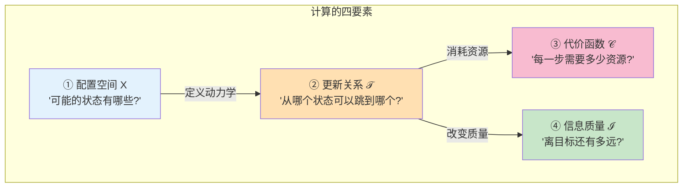

**日常类比**:
- **配置空间$X$**: 就像"棋盘上所有可能的棋局"
- **更新关系$\mathsf{T}$**: "合法的走棋规则"(从棋局$x$可以走到棋局$y$)
- **代价函数$\mathsf{C}$**: "每步棋需要的思考时间"
- **信息质量$\mathsf{I}$**: "当前局面的优势评分"(离赢棋还有多远)

### 1.3 为什么是这四个?

**为什么不是三个?** 没有$\mathsf{I}$(信息质量),我们无法定义"计算朝着目标进行",只是"盲目的状态转移"。

**为什么不是五个?** 这四个已经足够刻画"目标导向的资源受限动力学",添加更多只会冗余。

**关键洞察**: $(\mathsf{T},\mathsf{C},\mathsf{I})$分别对应"动力学"、"资源"、"信息",三者结合在配置空间$X$上,构成完整的计算图景。

---

## 2. 计算宇宙对象:严格定义

### 2.1 四元组的数学表述

**定义2.1 (计算宇宙对象)**

一个**计算宇宙对象**是四元组:
$$
U_{\mathrm{comp}} = (X,\mathsf{T},\mathsf{C},\mathsf{I})
$$

其中:

1. **$X$**: 可数集合,称为**配置空间**
   - 每个$x\in X$是"宇宙的一个完整状态"
   - 例如:图灵机的"纸带内容+读头位置+内部状态"

2. **$\mathsf{T}\subset X\times X$**: **一步更新关系**
   - $(x,y)\in\mathsf{T}$表示"从配置$x$可以一步跳到配置$y$"
   - 形成有向图$(X,\mathsf{T})$,边表示允许的转移

3. **$\mathsf{C}:X\times X\to[0,\infty]$**: **代价函数**
   - $\mathsf{C}(x,y)$是"从$x$跳到$y$需要的资源(时间、能量、门数)"
   - 若$(x,y)\notin\mathsf{T}$,约定$\mathsf{C}(x,y)=\infty$(不可达)

4. **$\mathsf{I}:X\to\mathbb{R}$**: **信息质量函数**
   - $\mathsf{I}(x)$衡量"配置$x$对任务$Q$的信息质量"
   - 例如:"与目标输出的相似度"或"判定正确性的置信度"

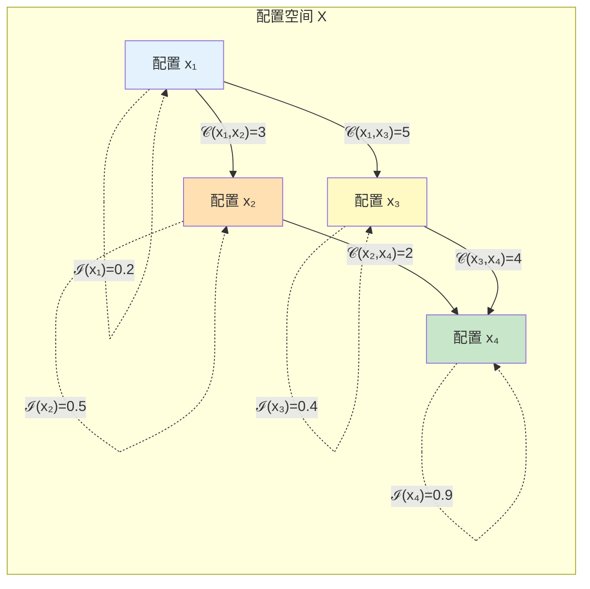

**日常类比**: 把$U_{\mathrm{comp}}$想象成"一个巨大的迷宫":
- $X$: 所有房间
- $\mathsf{T}$: 房间之间的门(哪些房间相连)
- $\mathsf{C}(x,y)$: 穿过这扇门需要的时间
- $\mathsf{I}(x)$: 房间$x$离出口的"直线距离"(信息提示)

### 2.2 路径、代价与复杂性距离

有了四元组,我们可以定义"计算路径":

**定义2.2 (路径与路径代价)**

从配置$x$到配置$y$的一条**路径**是有限序列:
$$
\gamma = (x_0,x_1,\dots,x_n), \quad x_0=x, x_n=y
$$
满足$(x_k,x_{k+1})\in\mathsf{T}$对所有$0\le k<n$成立。

路径的**代价**为:
$$
\mathsf{C}(\gamma) = \sum_{k=0}^{n-1} \mathsf{C}(x_k,x_{k+1})
$$

**定义2.3 (复杂性距离)**

从$x$到$y$的**复杂性距离**定义为:
$$
d(x,y) = \inf_{\gamma:x\to y} \mathsf{C}(\gamma)
$$
即所有路径中代价最小的那条。

**日常类比**:
- 路径$\gamma$: 从家到公司的一条具体走法(地铁3站→公交2站→步行500米)
- 路径代价$\mathsf{C}(\gamma)$: 这条路线的总时间(15分钟+10分钟+5分钟=30分钟)
- 复杂性距离$d(x,y)$: 所有可能路线中的**最短时间**(也许有条路只需25分钟)

### 2.3 可达域与复杂性视界

**定义2.4 (可达域)**

给定初始配置$x_0$和资源预算$T>0$,**可达域**定义为:
$$
B_T(x_0) = \{ x\in X : d(x_0,x)\le T \}
$$

即"在预算$T$内能到达的所有配置"。

**日常类比**:
- 如果你有2小时空闲时间,可达域$B_{120\text{分钟}}(\text{家})$就是"2小时内能去的所有地方"
- 如果只有30分钟,$B_{30\text{分钟}}(\text{家})$就小得多
- 可达域随着时间$T$增长,就像"水波纹不断扩散"

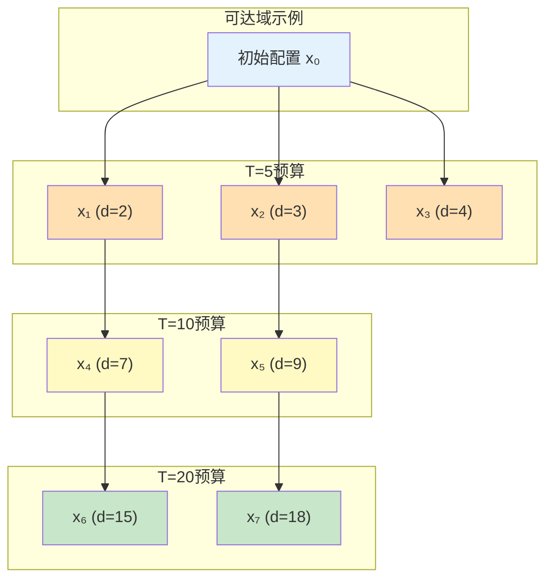

**复杂性视界**: 如果某个特殊配置$x^*$满足:
- 对所有$T<T^*$,都有$x^*\notin B_T(x_0)$(预算不够,到不了)
- 对所有$T>T^*$,都有$x^*\in B_T(x_0)$(预算够了,能到达)

那么$T^*=d(x_0,x^*)$称为**复杂性门槛**,就像"光的视界"一样——$T$小于门槛看不到,$T$大于门槛才能看到。

---

## 3. 五大公理:物理可实现性的约束

光有四元组定义还不够,我们需要确保这个"计算宇宙"是**物理可实现的**。这就是五大公理的作用——它们不是随意添加的限制,而是"物理宇宙的基本性质"在计算宇宙中的体现。

### 3.1 公理A1:有限信息密度

**公理A1 (有限信息密度)**

存在一个局域结构$G_X=(X,E_X)$(有限度有向图),使得对任意有限顶点集$R\subset X$,与$R$相邻的配置集合:
$$
N(R) = \{ x\in X : \exists y\in R, (x,y)\in E_X \text{ 或 } (y,x)\in E_X \}
$$
满足$|N(R)|<\infty$(有限个邻居)。

此外,对每个$x\in X$,与$x$局域相关的"内部状态"集合同样有限。

**直观理解**: 任何有限区域只能存储**有限比特信息**。

**日常类比**:
- 一个1立方米的盒子,无论怎么塞,最多只能装有限个乒乓球
- 不能在有限空间内塞无限个东西
- 对应物理:Bekenstein界限——有限体积最多编码有限熵

**为什么需要?**
- 如果允许单个格点存储无限信息,就可以用"一个格点"编码整个图灵机的纸带,这不符合物理实际
- 有限信息密度保证了"局域性有意义"

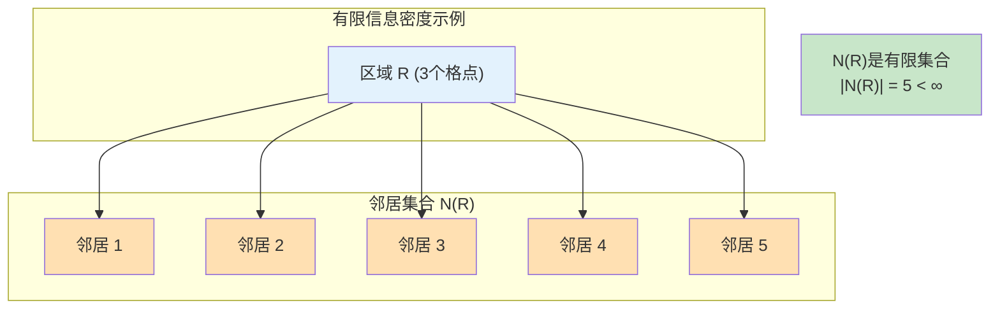

### 3.2 公理A2:局域更新

**公理A2 (局域更新)**

对任意$x\in X$,一步可达集合:
$$
\mathsf{T}(x) = \{ y\in X : (x,y)\in\mathsf{T} \}
$$
是**有限的**,并且存在有限半径$r$(与$x$无关),使得$\mathsf{T}(x)$的确定仅依赖于$x$在图$G_X$中某个半径为$r$的**局部邻域信息**。

**直观理解**: 每一步更新只影响**有限范围**,不能"超距作用"。

**日常类比**:
- 下围棋时,落一颗子只影响周围几个交叉点,不可能瞬间改变对面角落的局势
- 物理类比:信息传播不能超过光速,局域操作只影响局域

**为什么需要?**
- 如果允许"一步更新改变整个宇宙",就违背了相对论的因果性
- 局域更新保证了计算是"物理可实现的"(不需要无限能量瞬间传播信息)

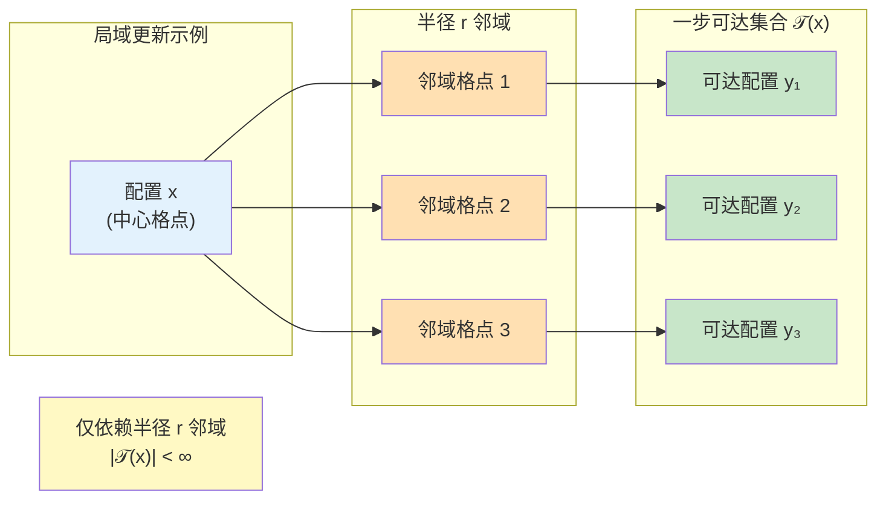

### 3.3 公理A3:广义可逆性

**公理A3 (广义可逆性)**

存在一个关系$\mathsf{T}^{-1}\subset X\times X$,使得对任意$x\in X$:
$$
\mathsf{T}^{-1}(x) = \{ y : (y,x)\in\mathsf{T} \}
$$
有限,且对"物理相关"的配置子集$X_{\mathrm{phys}}\subset X$限制后,$\mathsf{T}$与$\mathsf{T}^{-1}$在$X_{\mathrm{phys}}$上互为函数图的逆(即**时间演化是双射**)。

**直观理解**: 时间可以"倒放"(在物理相关的状态中)。

**日常类比**:
- 量子力学的幺正演化是可逆的(给定现在,可以推出过去)
- 经典力学也是可逆的(牛顿方程关于时间对称)
- 不可逆性(如熵增)是统计层面的,微观动力学仍是可逆的

**为什么需要?**
- 物理定律(薛定谔方程、Hamilton方程)都是时间可逆的
- 可逆性是"信息守恒"的体现——过去的信息不会凭空消失

**注意**: "广义"指的是:
- 在全部配置$X$上可能不可逆(例如:包含"辅助比特"的扩展空间)
- 但在物理相关子集$X_{\mathrm{phys}}$上必须可逆

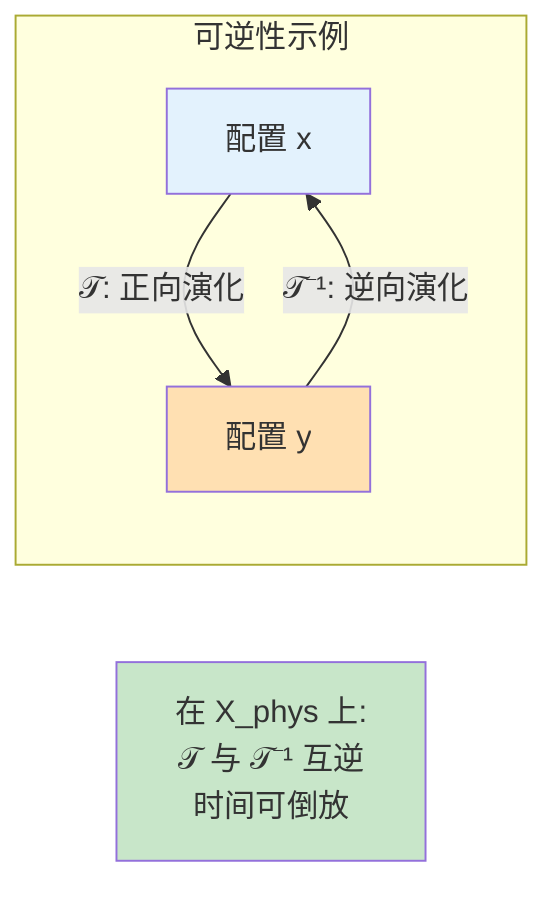

### 3.4 公理A4:代价的加性与正性

**公理A4 (代价加性与正性)**

1. **正性**: 对任意$(x,y)\in\mathsf{T}$,有$\mathsf{C}(x,y)\in(0,\infty)$(严格为正)
2. **加性**: 对任意有限路径$\gamma=(x_0,x_1,\dots,x_n)$,路径代价满足:
$$
\mathsf{C}(\gamma) = \sum_{k=0}^{n-1} \mathsf{C}(x_k,x_{k+1})
$$
3. **三角不等式**: $d(x,z)\le d(x,y)+d(y,z)$

**直观理解**:
- 做事情总是要花时间的(正性)
- 做两件事的时间=第一件+第二件(加性)
- 绕路不会更快(三角不等式)

**日常类比**:
- 从北京到上海再到广州,至少要比直接从北京到广州远(三角不等式)
- 任何路径都需要非零时间(正性)
- 总时间=各段时间之和(加性)

**为什么需要?**
- 正性保证"计算不是免费的"
- 加性保证代价函数定义良好
- 三角不等式保证$d(x,y)$是真正的度量(距离函数)

### 3.5 公理A5:信息质量的单调性

**公理A5 (信息单调性)**

存在一个任务族$\mathcal{Q}$(例如判定问题、函数计算或测量任务),使得对每个任务$Q\in\mathcal{Q}$,存在信息质量函数$\mathsf{I}_Q:X\to\mathbb{R}$,满足:

若路径$\gamma$支持对任务$Q$的计算,则沿$\gamma$的期望信息质量是**非减的**:
$$
\mathbb{E}[\mathsf{I}_Q(x_{k+1})] \ge \mathbb{E}[\mathsf{I}_Q(x_k)]
$$

**直观理解**: 计算过程中,"对目标的了解"不会倒退。

**日常类比**:
- 解数学题时,每一步推导要么让你更接近答案,要么维持现状,但不会让你"更不知道答案"
- 登山时,每一步要么更接近山顶,要么原地踏步,但不会越爬越低(平均而言)

**为什么需要?**
- 如果信息质量可以随意减少,计算就可能"陷入死循环"永远不到达目标
- 单调性保证了"计算是朝着目标进行的",而非盲目转移

**注意**: "期望"的含义:
- 对确定性系统:就是普通的函数值
- 对随机/量子系统:是统计平均

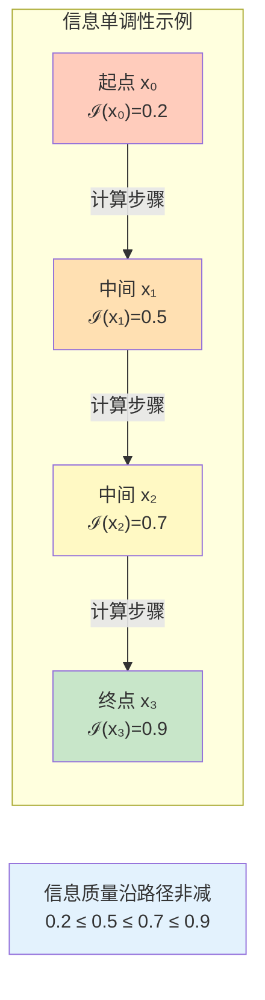

---

## 4. 五大公理的统一图景

这五大公理不是孤立的,而是共同保证计算宇宙的"物理可实现性":

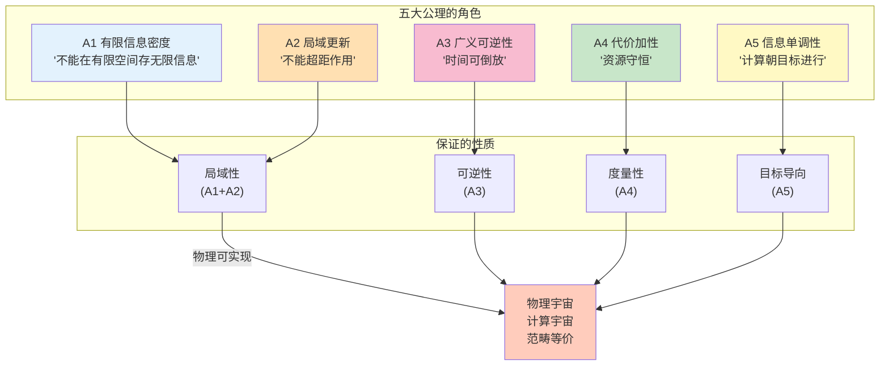

**关键洞察**:
- **A1+A2** → 局域性(信息和因果都局域)
- **A3** → 可逆性(微观动力学时间对称)
- **A4** → 度量性(代价函数定义良好的距离)
- **A5** → 目标导向(计算不是随机游走)

这五条公理将"计算"从"抽象的状态转移"变成"物理可实现的、目标导向的、资源受限的动力学过程"。

---

## 5. 经典模型的嵌入:图灵机

现在我们证明:图灵机可以被视为满足五大公理的计算宇宙对象。

### 5.1 图灵机的快速回顾

**定义5.1 (确定性图灵机)**

一个单带确定性图灵机是五元组$M=(Q,\Sigma,\Gamma,\delta,q_0)$:
- $Q$: 有限状态集合
- $\Sigma\subset\Gamma$: 输入字母表,$\Gamma$是带上符号表(含空白符)
- $\delta:Q\times\Gamma\to Q\times\Gamma\times\{-1,0,+1\}$: 转移函数
- $q_0\in Q$: 初始状态

**日常类比**: 图灵机就像"一个人+一条无限长的纸带+一支笔":
- 人有有限种"心情"(状态$Q$)
- 纸带上每个格子写着有限种符号(字母表$\Gamma$)
- 人根据"当前心情+当前格子的符号"决定"下一步心情+改写符号+移动方向"(转移函数$\delta$)

### 5.2 图灵机宇宙的四元组构造

**配置空间$X_M$**:
$$
X_M = Q \times \Gamma^{\mathbb{Z}} \times \mathbb{Z}
$$

一个配置$x=(q,(a_i)_{i\in\mathbb{Z}},p)$表示:
- 机器处于状态$q\in Q$
- 带上位置$i$的符号为$a_i\in\Gamma$
- 读头位于位置$p\in\mathbb{Z}$

**更新关系$\mathsf{T}_M$**:
$(x,y)\in\mathsf{T}_M$当且仅当$y$是在配置$x$下应用一次$\delta$后得到的配置。

**代价函数$\mathsf{C}_M$**:
$$
\mathsf{C}_M(x,y) = \begin{cases}
1, & \text{if } (x,y)\in\mathsf{T}_M \\
\infty, & \text{otherwise}
\end{cases}
$$

(每一步代价都是1,不允许的转移代价为$\infty$)

**信息质量$\mathsf{I}_M$**:
设任务是"判定输入是否属于语言$L$",则:
$$
\mathsf{I}_M(x) = \begin{cases}
1, & \text{if } x \text{ 是接受状态} \\
-1, & \text{if } x \text{ 是拒绝状态} \\
0, & \text{otherwise}
\end{cases}
$$

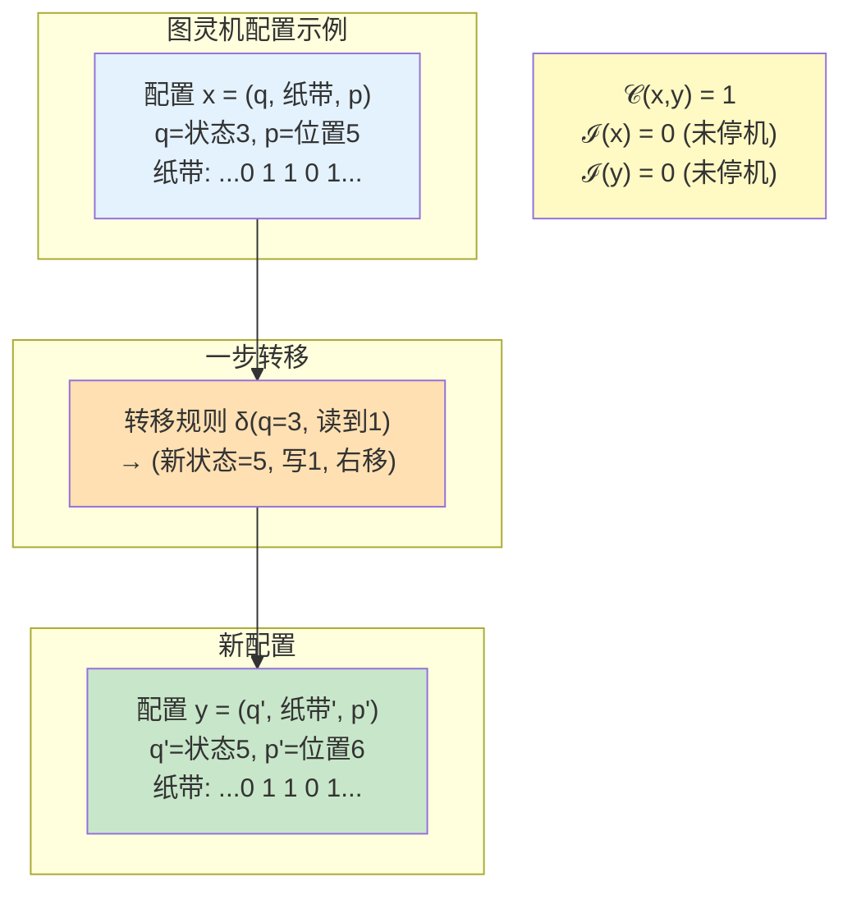

### 5.3 图灵机满足五大公理

**命题5.2**: 对任意图灵机$M$,四元组$U_{\mathrm{comp}}(M)=(X_M,\mathsf{T}_M,\mathsf{C}_M,\mathsf{I}_M)$满足公理A1-A5。

**证明思路**:

**A1 (有限信息密度)**:
- 局域结构$G_X$: 配置$x$和$x'$相邻,当且仅当它们的纸带内容在有限区间外一致,且状态/读头位置相近
- 对任意有限区域$R$,邻居集$N(R)$有限(因为$Q$有限,$\Gamma$有限)

**A2 (局域更新)**:
- $\mathsf{T}_M(x)$有限: 给定配置$x=(q,(a_i),p)$,下一步由$\delta(q,a_p)$唯一确定,所以$|\mathsf{T}_M(x)|=1$(确定性图灵机)或有限个(非确定性)
- 局域性: 一步转移只改变读头位置$p$处的符号和状态$q$,不影响其他位置

**A3 (广义可逆性)**:
- 物理相关子集$X_{\mathrm{phys}}$: 图灵机"实际运行到的配置"(从初始配置可达)
- 可以通过"添加历史记录比特"使转移可逆(例如:Bennett的可逆模拟构造)
- 在扩展配置空间上,$\mathsf{T}$是双射

**A4 (代价加性)**:
- $\mathsf{C}_M\equiv 1$显然正且有限
- 路径代价$\mathsf{C}(\gamma)=\sum_{k=0}^{n-1}1=n$(步数)
- 三角不等式自动满足(最短路步数的性质)

**A5 (信息单调性)**:
- 对判定问题:机器要么停机(到达接受/拒绝状态,$\mathsf{I}=\pm 1$),要么继续运行($\mathsf{I}=0$)
- 一旦停机,状态不再改变,所以$\mathsf{I}$非减

**结论**: 图灵机是计算宇宙的一个特例! ✓

---

## 6. 经典模型的嵌入:元胞自动机

### 6.1 元胞自动机的快速回顾

**定义6.1 (经典元胞自动机)**

设$\Lambda$为可数格点集合(例如$\mathbb{Z}^d$),$S$为有限状态集合。一个元胞自动机是一个局域更新规则$F:S^{\Lambda}\to S^{\Lambda}$,存在有限邻域$\mathcal{N}\subset\Lambda$和局部规则$f:S^{\mathcal{N}}\to S$,使得:
$$
(F(c))_i = f((c)_{i+\mathcal{N}}), \quad \forall i\in\Lambda
$$

**日常类比**:
- 想象一个无限大的围棋棋盘$\Lambda$
- 每个位置$i$有有限种状态$S=\{\text{黑,白,空}\}$
- 每一步,所有位置**同时**根据"自己+邻居"的状态更新(例如:"如果我是空且邻居有3个黑子,我就变成黑子")

### 6.2 元胞自动机宇宙的四元组构造

**配置空间$X_{\mathrm{CA}}$**:
$$
X_{\mathrm{CA}} = S^{\Lambda}
$$

一个配置$c=(c_i)_{i\in\Lambda}$就是"整个格点上的状态分布"。

**更新关系$\mathsf{T}_{\mathrm{CA}}$**:
$$
\mathsf{T}_{\mathrm{CA}} = \{ (c,F(c)) : c\in X_{\mathrm{CA}} \}
$$

(每个配置有唯一的后继)

**代价函数$\mathsf{C}_{\mathrm{CA}}$**:
$$
\mathsf{C}_{\mathrm{CA}}(c,F(c)) = 1
$$

**信息质量$\mathsf{I}_{\mathrm{CA}}$**:
根据任务定义(例如:"某种花纹的出现频率")。

### 6.3 元胞自动机满足五大公理

**命题6.3**: 对任意元胞自动机$F$,四元组$U_{\mathrm{comp}}(F)=(X_{\mathrm{CA}},\mathsf{T}_{\mathrm{CA}},\mathsf{C}_{\mathrm{CA}},\mathsf{I}_{\mathrm{CA}})$满足公理A1-A5。

**证明要点**:

**A1-A2**: 局域性与有限度直接来自$F$的局域规则定义

**A3**: 对**可逆元胞自动机**(存在$F^{-1}$使得$F^{-1}\circ F=\mathrm{id}$),显然可逆。对非可逆CA,可以通过"扩展状态空间+历史记录"使其可逆。

**A4-A5**: 与图灵机类似

**结论**: 元胞自动机也是计算宇宙的特例! ✓

---

## 7. 量子模型的嵌入:QCA

### 7.1 可逆量子元胞自动机(QCA)

**定义7.1 (可逆QCA)**

设$\Lambda$为可数格点集合,对每个$i\in\Lambda$,赋予有限维局域Hilbert空间$\mathcal{H}_i$,全局Hilbert空间:
$$
\mathcal{H} = \bigotimes_{i\in\Lambda} \mathcal{H}_i
$$

一个可逆QCA是一个满足以下条件的酉算子$U:\mathcal{H}\to\mathcal{H}$:
1. **局域性**: 对任意有界区域$R\subset\Lambda$,存在有限膨胀$R'\supset R$,使得$U^{\dagger}\mathcal{A}(R)U\subset\mathcal{A}(R')$(局域算子代数被有限范围传播)
2. **平移对称性**(可选)

**日常类比**:
- 量子版的围棋棋盘,每个位置不是"黑/白/空",而是量子比特$|\psi\rangle=\alpha|0\rangle+\beta|1\rangle$(可以"既黑又白")
- 更新规则$U$是酉算子(量子门的组合),保持总概率=1

### 7.2 QCA宇宙的四元组构造

**关键**: 选定每个$\mathcal{H}_i$的正交基$\{|s\rangle:s\in S_i\}$,令:
$$
X_{\mathrm{QCA}} = \prod_{i\in\Lambda} S_i
$$
为基态标签的全体集合。

**更新关系$\mathsf{T}_{\mathrm{QCA}}$**:
$$
(x,y)\in\mathsf{T}_{\mathrm{QCA}} \text{ 当且仅当 } \langle y|U|x\rangle \ne 0
$$

(量子振幅非零的转移)

**代价函数$\mathsf{C}_{\mathrm{QCA}}$**:
取为与$U$的单步物理实现时间相对应的常数或依赖频率的加权值。

**信息质量$\mathsf{I}_{\mathrm{QCA}}$**:
依据观测任务(例如测量结果的后处理)定义。

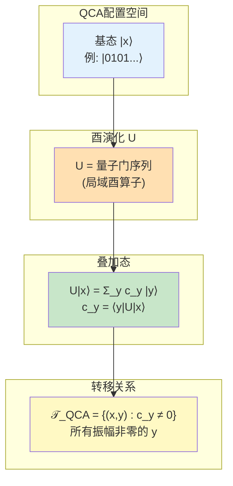

### 7.3 QCA满足五大公理

**命题7.3**: 在局域性与有限维Hilbert空间的假设下,$U_{\mathrm{comp}}(U)=(X_{\mathrm{QCA}},\mathsf{T}_{\mathrm{QCA}},\mathsf{C}_{\mathrm{QCA}},\mathsf{I}_{\mathrm{QCA}})$满足公理A1-A5。

**证明要点**:

**A1**: 有限维$\mathcal{H}_i$保证每个格点只能存储有限信息

**A2**: $U$的局域性保证一步可达集有限,且仅依赖局部邻域

**A3**: 酉算子$U$天然可逆($U^{\dagger}U=\mathrm{id}$),所以$\mathsf{T}_{\mathrm{QCA}}$可逆

**A4**: 代价正性由物理实现时间的正性保证

**A5**: 信息质量单调性可通过Heisenberg图像下的相对熵函数证明

**结论**: QCA也是计算宇宙的特例! ✓

---

## 8. 三大经典模型的统一

现在我们已经证明:

| 计算模型 | 配置空间$X$ | 更新关系$\mathsf{T}$ | 代价$\mathsf{C}$ | 满足公理? |
|---------|-----------|---------------------|--------------|----------|
| **图灵机** | $Q\times\Gamma^{\mathbb{Z}}\times\mathbb{Z}$ | 由$\delta$确定 | 步数计数 | ✓ A1-A5 |
| **元胞自动机** | $S^{\Lambda}$ | 由$F$确定 | 步数计数 | ✓ A1-A5 |
| **QCA** | $\prod_i S_i$(基态标签) | 由$U$确定 | 物理时间 | ✓ A1-A5 |

**关键洞察**: 虽然它们"长得不一样",但本质上都是:
- 离散的配置空间$X$(A1有限信息)
- 局域的更新规则$\mathsf{T}$(A2局域更新)
- 可逆的动力学(A3广义可逆)
- 资源受限的演化$\mathsf{C}$(A4代价加性)
- 目标导向的计算$\mathsf{I}$(A5信息单调)

**日常类比**: 就像"汽车、火车、飞机"虽然结构不同,但都满足"交通工具的公理"(能载人、能移动、需要能源、有方向)。

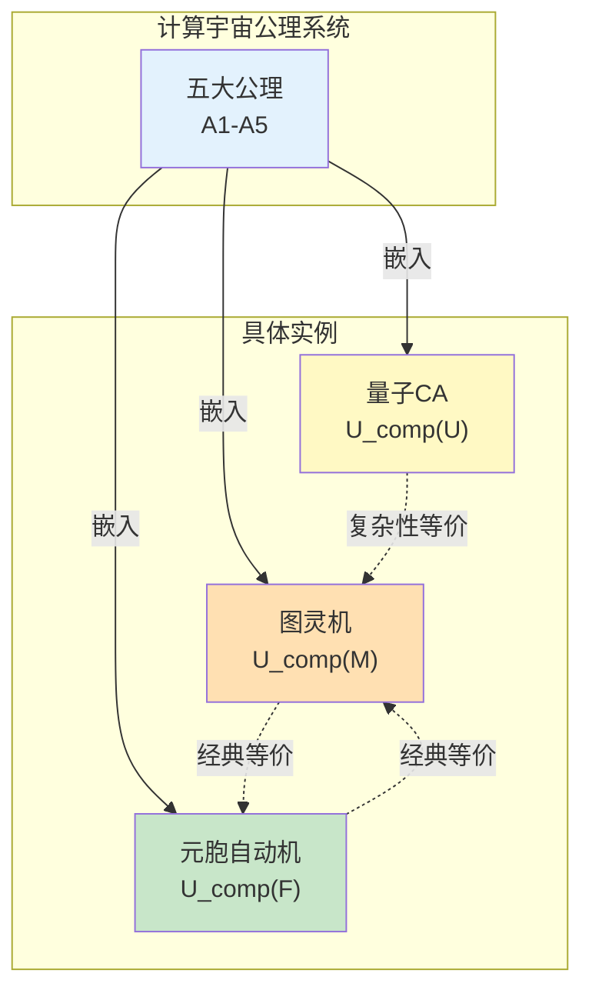

---

## 9. 关键定理:复杂性距离的度量性质

我们已经定义了复杂性距离$d(x,y)=\inf_{\gamma:x\to y}\mathsf{C}(\gamma)$,现在证明它确实是一个"度量"(满足距离公理)。

**定理9.1 (复杂性距离是广义度量)**

在公理A2与A4下,若对任意$x,y\in X$存在至少一条有限路径连接,则$d(x,y)$在$X$上定义了一个**广义度量**,满足:

1. **非负性**: $d(x,y)\ge 0$,且$d(x,x)=0$
2. **对称性**(可逆情形): 若$\mathsf{T}$在$X_{\mathrm{phys}}$上是双射,则$d(x,y)=d(y,x)$对$x,y\in X_{\mathrm{phys}}$成立
3. **三角不等式**: $d(x,z)\le d(x,y)+d(y,z)$

**证明**:

**(1) 非负性**:
- 对任意$x$,取零长度路径$\gamma=(x)$,约定$\mathsf{C}(\gamma)=0$,故$d(x,x)\le 0$
- 另一方面,A4保证任何非平凡路径代价为正,故$d(x,x)=0$ ✓

**(2) 对称性**:
- 在$X_{\mathrm{phys}}$上,$\mathsf{T}$是双射(A3)
- 若路径$\gamma:x\to y$达到$d(x,y)$的下确界,则存在逆路径$\gamma^{-1}:y\to x$
- 由A4的对称性(在物理子集上单步代价对称),$\mathsf{C}(\gamma^{-1})=\mathsf{C}(\gamma)$
- 故$d(y,x)\le\mathsf{C}(\gamma^{-1})=\mathsf{C}(\gamma)=d(x,y)$
- 反向不等式同理,得$d(x,y)=d(y,x)$ ✓

**(3) 三角不等式**:
- 给定$\varepsilon>0$,存在路径$\gamma_1:x\to y$,$\gamma_2:y\to z$使得:
  $$\mathsf{C}(\gamma_1)\le d(x,y)+\frac{\varepsilon}{2}, \quad \mathsf{C}(\gamma_2)\le d(y,z)+\frac{\varepsilon}{2}$$
- 串接路径$\gamma=\gamma_1\cdot\gamma_2$满足:
  $$\mathsf{C}(\gamma)=\mathsf{C}(\gamma_1)+\mathsf{C}(\gamma_2) \le d(x,y)+d(y,z)+\varepsilon$$
- 由$d(x,z)$的定义,$d(x,z)\le\mathsf{C}(\gamma)$
- 令$\varepsilon\to 0$得$d(x,z)\le d(x,y)+d(y,z)$ ✓

**日常类比**:
- 非负性: "距离不能是负数"
- 对称性: "从家到公司的距离=从公司到家的距离"(可逆世界)
- 三角不等式: "从家到公司再到超市,至少和直接从家到超市一样远"

---

## 10. 本篇总结与展望

### 10.1 核心成果

本篇建立了计算宇宙的**元基础**:

1. **四元组定义**: $U_{\mathrm{comp}}=(X,\mathsf{T},\mathsf{C},\mathsf{I})$
   - 配置空间、更新关系、代价函数、信息质量

2. **五大公理**: A1(有限信息)、A2(局域更新)、A3(可逆性)、A4(代价加性)、A5(信息单调)
   - 保证"物理可实现性"

3. **经典模型嵌入**: 图灵机、元胞自动机、QCA都满足五大公理
   - 证明了框架的**普适性**

4. **复杂性距离**: $d(x,y)=\inf_{\gamma}\mathsf{C}(\gamma)$是广义度量
   - 为后续几何化奠定基础

### 10.2 关键洞察

**洞察1**: 计算的本质是"目标导向的、资源受限的、局域可逆的状态转移"

**洞察2**: 图灵机/CA/QCA的差异只是"表面语言",本质都是$U_{\mathrm{comp}}$

**洞察3**: 复杂性距离$d(x,y)$将"算法步数"变成"几何距离",为几何化铺平道路

### 10.3 与其他章节的对接

**与Phase 5(宇宙十重结构)**:
- 第10个组成部分$U_{\text{comp}}$现在有了严格定义
- 五大公理保证了$U_{\text{comp}}$与其他九重结构的兼容性

**与Phase 6(有限信息宇宙)**:
- 公理A1(有限信息密度)是Phase 6的基础假设
- 信息容量$I_{\max}$可由配置空间$X$的体积增长估计

**与Phase 8(时间晶体)**:
- Floquet-QCA是QCA的特例,现在有了公理化基础

### 10.4 下一章预告

**23.02 模拟态射与计算宇宙范畴**将构造:
- 模拟映射$f:U_{\mathrm{comp}}\to U'_{\mathrm{comp}}$(保持步进、代价控制、信息保真)
- 计算宇宙范畴$\mathbf{CompUniv}$(对象=计算宇宙,态射=模拟)
- 经典模型的范畴等价定理

**关键问题**: 如何在范畴论框架下证明"图灵机≃元胞自动机≃QCA"?

---

**日常类比总结**: 本篇就像"定义什么是'交通工具'的公理系统"——无论是汽车(图灵机)、火车(CA)还是飞机(QCA),只要满足"能载人、能移动、需能源、有方向、局域控制"五大公理,就是合格的交通工具。下一篇将研究"不同交通工具之间的转换"(模拟态射),并证明"在复杂性意义下,它们本质相同"(范畴等价)。

$$
\boxed{U_{\mathrm{comp}}=(X,\mathsf{T},\mathsf{C},\mathsf{I}) + \text{A1-A5} = \text{计算宇宙的完整定义}}
$$
