# 23.1 Universe as Computation: Four-Tuple Axiomatics

**Source Theory**: docs/euler-gls-info/01-computational-universe-axiomatics.md

This article officially begins the construction of computational universe meta-theory, answering the first core question: **What is the strict mathematical definition of "computational universe"?** We will give the four-tuple axiomatic definition $U_{\mathrm{comp}}=(X,\mathsf{T},\mathsf{C},\mathsf{I})$, constrain its structure through five axioms, and finally prove that Turing machines, cellular automata, and quantum cellular automata (QCA) are all special cases of this framework.

---

## 1. From Intuition to Axioms: Why Four-Tuple?

### 1.1 The "Fragmentation" Problem of Traditional Computational Models

In computer science, we have various computational models:

- **Turing Machines**: Tape + read/write head + state transitions
- **Cellular Automata** (CA): Lattice sites + local rules + synchronous updates
- **Quantum Cellular Automata** (QCA): Qubit lattice sites + unitary evolution + locality

They each have their own expressions and advantages, but have never been defined in **a unified axiomatic system**. This is like:
- Turing machines are "screwdriver language"
- Cellular automata are "wrench language"
- QCA is "drill language"

All three are tools, but lack an "axiomatic definition of toolbox"—what counts as a "tool"?

**Everyday Analogy**: Like construction industry having various tools like "hammers, nails, screws, glue", but architecture needs axioms defining "what is connection method"—regardless of which specific tool, must satisfy basic requirements like "sturdiness, removability, locality".

### 1.2 Four Core Elements of Computation

Regardless of computational model, all contain four core elements:

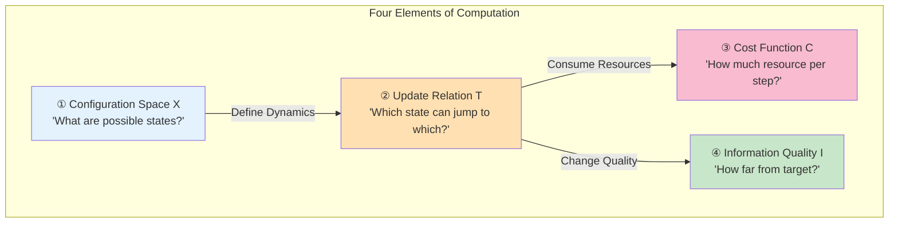

**Everyday Analogy**:
- **Configuration Space $X$**: Like "all possible chess positions on board"
- **Update Relation $\mathsf{T}$**: "Legal move rules" (can move from position $x$ to position $y$)
- **Cost Function $\mathsf{C}$**: "Thinking time needed per move"
- **Information Quality $\mathsf{I}$**: "Advantage score of current position" (how far from winning)

### 1.3 Why These Four?

**Why not three?** Without $\mathsf{I}$ (information quality), we cannot define "computation proceeds toward goal", just "blind state transitions".

**Why not five?** These four are sufficient to characterize "goal-oriented resource-constrained dynamics", adding more would only be redundant.

**Key Insight**: $(\mathsf{T},\mathsf{C},\mathsf{I})$ correspond to "dynamics", "resources", "information" respectively, combined on configuration space $X$, forming complete computational picture.

---

## 2. Computational Universe Object: Strict Definition

### 2.1 Mathematical Formulation of Four-Tuple

**Definition 2.1 (Computational Universe Object)**

A **computational universe object** is a four-tuple:
$$
U_{\mathrm{comp}} = (X,\mathsf{T},\mathsf{C},\mathsf{I})
$$

where:

1. **$X$**: Countable set, called **configuration space**
   - Each $x\in X$ is "a complete state of universe"
   - Example: Turing machine's "tape content + head position + internal state"

2. **$\mathsf{T}\subset X\times X$**: **One-step update relation**
   - $(x,y)\in\mathsf{T}$ means "can jump from configuration $x$ to configuration $y$ in one step"
   - Forms directed graph $(X,\mathsf{T})$, edges represent allowed transitions

3. **$\mathsf{C}:X\times X\to[0,\infty]$**: **Cost function**
   - $\mathsf{C}(x,y)$ is "resources needed (time, energy, gate count) to jump from $x$ to $y$"
   - If $(x,y)\notin\mathsf{T}$, convention $\mathsf{C}(x,y)=\infty$ (unreachable)

4. **$\mathsf{I}:X\to\mathbb{R}$**: **Information quality function**
   - $\mathsf{I}(x)$ measures "information quality of configuration $x$ for task $Q$"
   - Example: "similarity to target output" or "confidence in correctness"

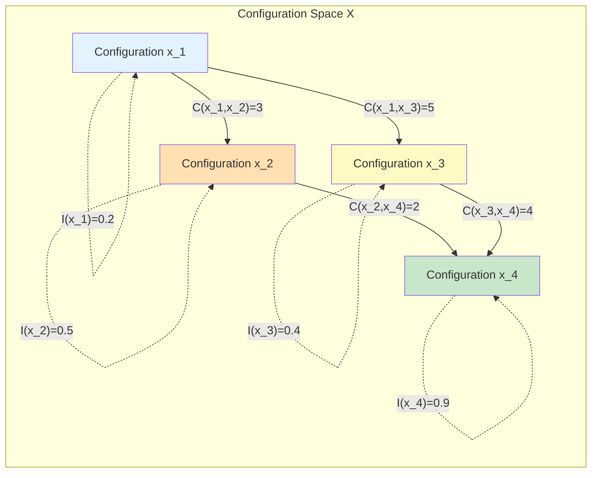

**Everyday Analogy**: Think of $U_{\mathrm{comp}}$ as "a huge maze":
- $X$: All rooms
- $\mathsf{T}$: Doors between rooms (which rooms are connected)
- $\mathsf{C}(x,y)$: Time needed to pass through this door
- $\mathsf{I}(x)$: "Straight-line distance" from room $x$ to exit (information hint)

### 2.2 Paths, Costs, and Complexity Distance

With four-tuple, we can define "computation paths":

**Definition 2.2 (Path and Path Cost)**

A **path** from configuration $x$ to configuration $y$ is a finite sequence:
$$
\gamma = (x_0,x_1,\dots,x_n), \quad x_0=x, x_n=y
$$
satisfying $(x_k,x_{k+1})\in\mathsf{T}$ for all $0\le k<n$.

**Cost** of path is:
$$
\mathsf{C}(\gamma) = \sum_{k=0}^{n-1} \mathsf{C}(x_k,x_{k+1})
$$

**Definition 2.3 (Complexity Distance)**

**Complexity distance** from $x$ to $y$ is defined as:
$$
d(x,y) = \inf_{\gamma:x\to y} \mathsf{C}(\gamma)
$$
i.e., the path with smallest cost among all paths.

**Everyday Analogy**:
- Path $\gamma$: A specific route from home to company (subway 3 stops → bus 2 stops → walk 500m)
- Path cost $\mathsf{C}(\gamma)$: Total time of this route (15 min + 10 min + 5 min = 30 min)
- Complexity distance $d(x,y)$: **Shortest time** among all possible routes (maybe there's a route taking only 25 min)

### 2.3 Reachable Domain and Complexity Horizon

**Definition 2.4 (Reachable Domain)**

Given initial configuration $x_0$ and resource budget $T>0$, **reachable domain** is defined as:
$$
B_T(x_0) = \{ x\in X : d(x_0,x)\le T \}
$$

i.e., "all configurations reachable within budget $T$".

**Everyday Analogy**:
- If you have 2 hours free time, reachable domain $B_{120\text{min}}(\text{home})$ is "all places reachable in 2 hours"
- If only 30 minutes, $B_{30\text{min}}(\text{home})$ is much smaller
- Reachable domain grows with time $T$, like "water ripples continuously expanding"

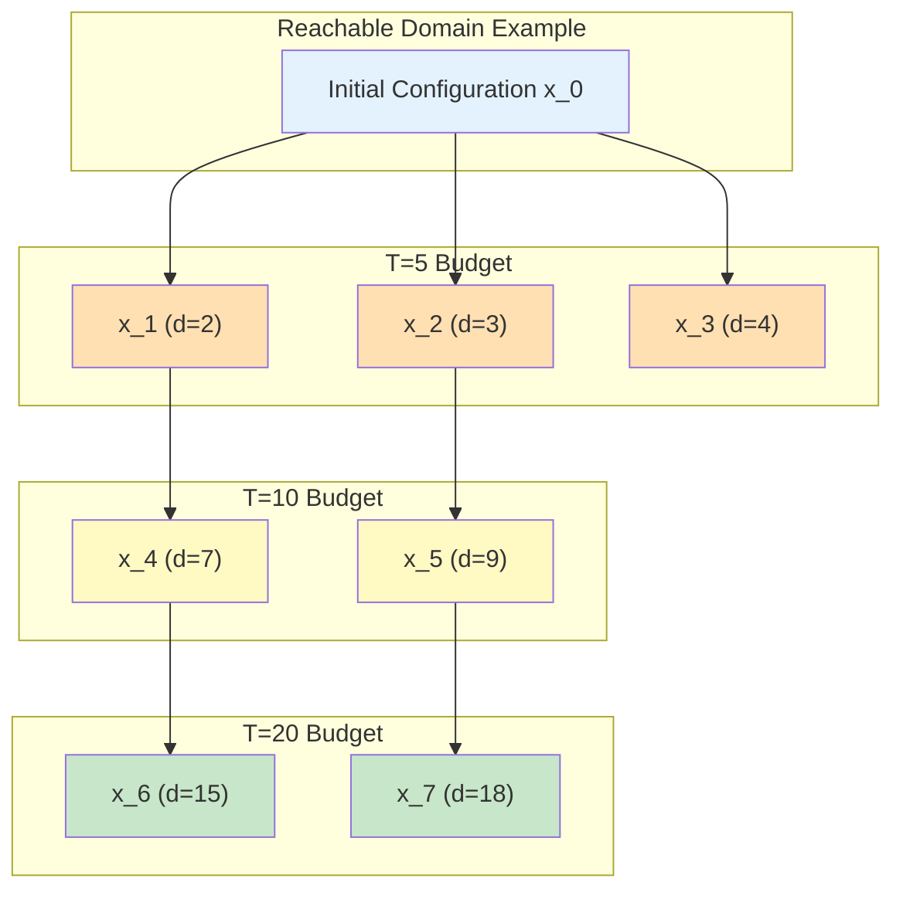

**Complexity Horizon**: If some special configuration $x^*$ satisfies:
- For all $T<T^*$, have $x^*\notin B_T(x_0)$ (budget insufficient, unreachable)
- For all $T>T^*$, have $x^*\in B_T(x_0)$ (budget sufficient, reachable)

Then $T^*=d(x_0,x^*)$ is called **complexity threshold**, like "light horizon"—cannot see when $T$ below threshold, can see when $T$ above threshold.

---

## 3. Five Axioms: Constraints of Physical Realizability

Just having four-tuple definition is not enough, we need to ensure this "computational universe" is **physically realizable**. This is the role of five axioms—they are not arbitrary restrictions, but manifestations of "basic properties of physical universe" in computational universe.

### 3.1 Axiom A1: Finite Information Density

**Axiom A1 (Finite Information Density)**

There exists a local structure $G_X=(X,E_X)$ (finite-degree directed graph), such that for any finite vertex set $R\subset X$, the configuration set adjacent to $R$:
$$
N(R) = \{ x\in X : \exists y\in R, (x,y)\in E_X \text{ or } (y,x)\in E_X \}
$$
satisfies $|N(R)|<\infty$ (finite neighbors).

Furthermore, for each $x\in X$, the "internal state" set locally related to $x$ is also finite.

**Intuitive Understanding**: Any finite region can only store **finite bits of information**.

**Everyday Analogy**:
- A 1 cubic meter box, no matter how packed, can hold at most finite ping-pong balls
- Cannot pack infinite things in finite space
- Physical correspondence: Bekenstein bound—finite volume can encode at most finite entropy

**Why Needed?**
- If allowing single lattice site to store infinite information, could encode entire Turing machine tape with "one lattice site", inconsistent with physical reality
- Finite information density guarantees "locality is meaningful"

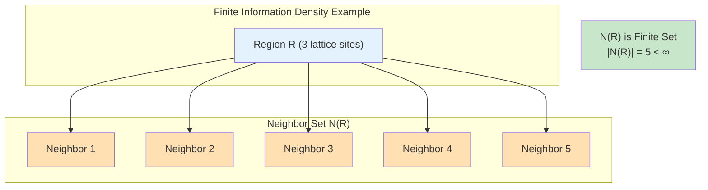

### 3.2 Axiom A2: Local Update

**Axiom A2 (Local Update)**

For any $x\in X$, one-step reachable set:
$$
\mathsf{T}(x) = \{ y\in X : (x,y)\in\mathsf{T} \}
$$
is **finite**, and there exists finite radius $r$ (independent of $x$), such that determination of $\mathsf{T}(x)$ depends only on **local neighborhood information** of radius $r$ around $x$ in graph $G_X$.

**Intuitive Understanding**: Each step update only affects **finite range**, cannot "act at distance".

**Everyday Analogy**:
- In Go, placing one stone only affects surrounding intersections, cannot instantly change situation in opposite corner
- Physical analogy: Information propagation cannot exceed light speed, local operations only affect local

**Why Needed?**
- If allowing "one-step update changes entire universe", violates relativity's causality
- Local update guarantees computation is "physically realizable" (doesn't need infinite energy to instantly propagate information)

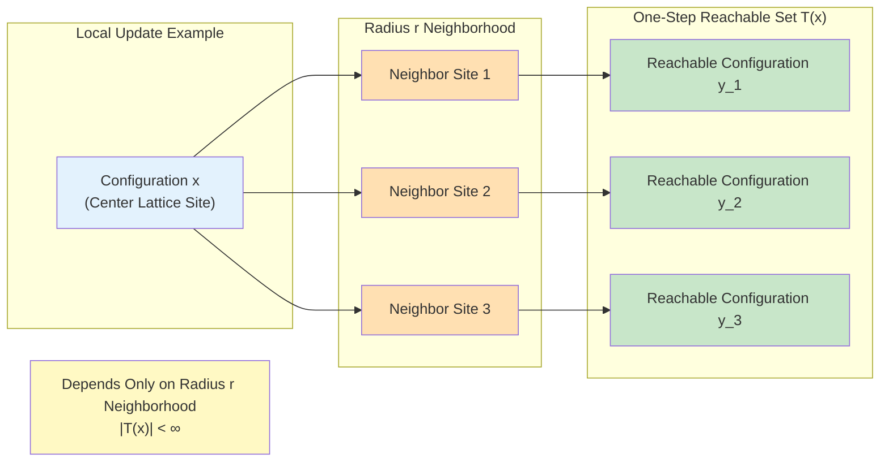

### 3.3 Axiom A3: Generalized Reversibility

**Axiom A3 (Generalized Reversibility)**

There exists a relation $\mathsf{T}^{-1}\subset X\times X$, such that for any $x\in X$:
$$
\mathsf{T}^{-1}(x) = \{ y : (y,x)\in\mathsf{T} \}
$$
is finite, and after restricting to "physically relevant" configuration subset $X_{\mathrm{phys}}\subset X$, $\mathsf{T}$ and $\mathsf{T}^{-1}$ are mutual function graph inverses on $X_{\mathrm{phys}}$ (i.e., **time evolution is bijection**).

**Intuitive Understanding**: Time can be "reversed" (in physically relevant states).

**Everyday Analogy**:
- Quantum mechanics unitary evolution is reversible (given present, can deduce past)
- Classical mechanics is also reversible (Newton equations symmetric in time)
- Irreversibility (like entropy increase) is statistical level, microscopic dynamics still reversible

**Why Needed?**
- Physical laws (Schrödinger equation, Hamilton equations) are all time-reversible
- Reversibility is manifestation of "information conservation"—past information doesn't disappear

**Note**: "Generalized" means:
- May not be reversible on entire configuration $X$ (e.g., extended space containing "auxiliary bits")
- But must be reversible on physically relevant subset $X_{\mathrm{phys}}$

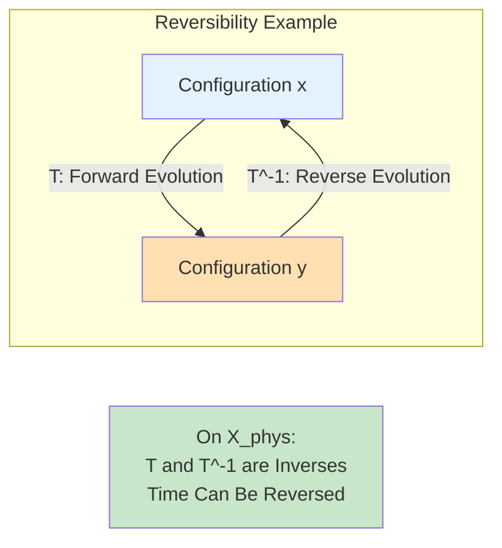

### 3.4 Axiom A4: Additivity and Positivity of Cost

**Axiom A4 (Cost Additivity and Positivity)**

1. **Positivity**: For any $(x,y)\in\mathsf{T}$, have $\mathsf{C}(x,y)\in(0,\infty)$ (strictly positive)
2. **Additivity**: For any finite path $\gamma=(x_0,x_1,\dots,x_n)$, path cost satisfies:
$$
\mathsf{C}(\gamma) = \sum_{k=0}^{n-1} \mathsf{C}(x_k,x_{k+1})
$$
3. **Triangle Inequality**: $d(x,z)\le d(x,y)+d(y,z)$

**Intuitive Understanding**:
- Doing things always takes time (positivity)
- Time for two things = first + second (additivity)
- Detours won't be faster (triangle inequality)

**Everyday Analogy**:
- From Beijing to Shanghai to Guangzhou, at least as far as directly from Beijing to Guangzhou (triangle inequality)
- Any path requires non-zero time (positivity)
- Total time = sum of segment times (additivity)

**Why Needed?**
- Positivity guarantees "computation is not free"
- Additivity guarantees cost function is well-defined
- Triangle inequality guarantees $d(x,y)$ is true metric (distance function)

### 3.5 Axiom A5: Monotonicity of Information Quality

**Axiom A5 (Information Monotonicity)**

There exists a task family $\mathcal{Q}$ (e.g., decision problems, function computation, or measurement tasks), such that for each task $Q\in\mathcal{Q}$, there exists information quality function $\mathsf{I}_Q:X\to\mathbb{R}$, satisfying:

If path $\gamma$ supports computation for task $Q$, then expected information quality along $\gamma$ is **non-decreasing**:
$$
\mathbb{E}[\mathsf{I}_Q(x_{k+1})] \ge \mathbb{E}[\mathsf{I}_Q(x_k)]
$$

**Intuitive Understanding**: During computation, "understanding of goal" does not regress.

**Everyday Analogy**:
- When solving math problems, each derivation step either brings you closer to answer or maintains status quo, but won't make you "less know answer"
- When climbing mountain, each step either closer to summit or stays put, but won't climb lower (on average)

**Why Needed?**
- If information quality can arbitrarily decrease, computation may "fall into infinite loop" never reaching goal
- Monotonicity guarantees "computation proceeds toward goal", not blind transitions

**Note**: Meaning of "expectation":
- For deterministic systems: Just ordinary function value
- For stochastic/quantum systems: Statistical average

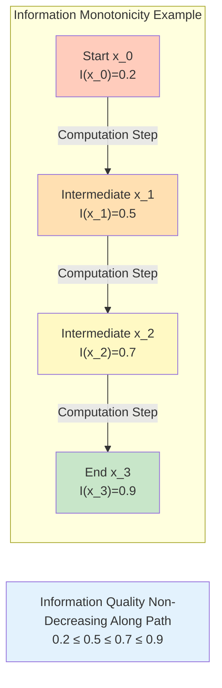

---

## 4. Unified Picture of Five Axioms

These five axioms are not isolated, but together guarantee "physical realizability" of computational universe:

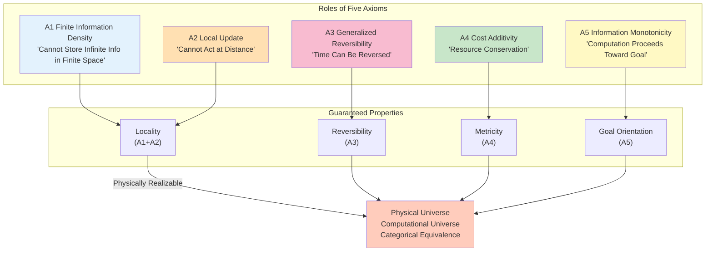

**Key Insights**:
- **A1+A2** → Locality (both information and causality local)
- **A3** → Reversibility (microscopic dynamics time-symmetric)
- **A4** → Metricity (cost function defines good distance)
- **A5** → Goal orientation (computation is not random walk)

These five axioms turn "computation" from "abstract state transitions" into "physically realizable, goal-oriented, resource-constrained dynamical process".

---

## 5. Embedding Classical Models: Turing Machines

Now we prove: Turing machines can be viewed as computational universe objects satisfying five axioms.

### 5.1 Quick Review of Turing Machines

**Definition 5.1 (Deterministic Turing Machine)**

A single-tape deterministic Turing machine is five-tuple $M=(Q,\Sigma,\Gamma,\delta,q_0)$:
- $Q$: Finite state set
- $\Sigma\subset\Gamma$: Input alphabet, $\Gamma$ is tape symbol set (including blank)
- $\delta:Q\times\Gamma\to Q\times\Gamma\times\{-1,0,+1\}$: Transition function
- $q_0\in Q$: Initial state

**Everyday Analogy**: Turing machine is like "a person + an infinitely long tape + a pen":
- Person has finite "moods" (states $Q$)
- Each cell on tape writes finite symbols (alphabet $\Gamma$)
- Person decides "next mood + rewrite symbol + move direction" based on "current mood + current cell symbol" (transition function $\delta$)

### 5.2 Four-Tuple Construction of Turing Machine Universe

**Configuration Space $X_M$**:
$$
X_M = Q \times \Gamma^{\mathbb{Z}} \times \mathbb{Z}
$$

A configuration $x=(q,(a_i)_{i\in\mathbb{Z}},p)$ represents:
- Machine in state $q\in Q$
- Symbol at tape position $i$ is $a_i\in\Gamma$
- Read head at position $p\in\mathbb{Z}$

**Update Relation $\mathsf{T}_M$**:
$(x,y)\in\mathsf{T}_M$ if and only if $y$ is configuration obtained after applying $\delta$ once to configuration $x$.

**Cost Function $\mathsf{C}_M$**:
$$
\mathsf{C}_M(x,y) = \begin{cases}
1, & \text{if } (x,y)\in\mathsf{T}_M \\
\infty, & \text{otherwise}
\end{cases}
$$

(Each step cost is 1, disallowed transitions cost $\infty$)

**Information Quality $\mathsf{I}_M$**:
Let task be "decide if input belongs to language $L$", then:
$$
\mathsf{I}_M(x) = \begin{cases}
1, & \text{if } x \text{ is accepting state} \\
-1, & \text{if } x \text{ is rejecting state} \\
0, & \text{otherwise}
\end{cases}
$$

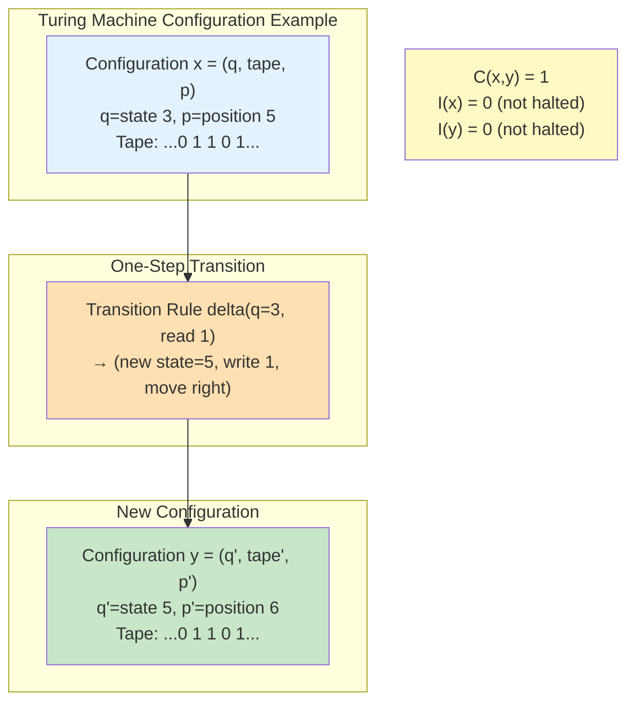

### 5.3 Turing Machines Satisfy Five Axioms

**Proposition 5.2**: For any Turing machine $M$, four-tuple $U_{\mathrm{comp}}(M)=(X_M,\mathsf{T}_M,\mathsf{C}_M,\mathsf{I}_M)$ satisfies axioms A1-A5.

**Proof Strategy**:

**A1 (Finite Information Density)**:
- Local structure $G_X$: Configurations $x$ and $x'$ are adjacent if and only if their tape contents agree outside finite interval, and state/head position are close
- For any finite region $R$, neighbor set $N(R)$ is finite (because $Q$ finite, $\Gamma$ finite)

**A2 (Local Update)**:
- $\mathsf{T}_M(x)$ finite: Given configuration $x=(q,(a_i),p)$, next step uniquely determined by $\delta(q,a_p)$, so $|\mathsf{T}_M(x)|=1$ (deterministic Turing machine) or finite (non-deterministic)
- Locality: One-step transition only changes symbol at head position $p$ and state $q$, doesn't affect other positions

**A3 (Generalized Reversibility)**:
- Physically relevant subset $X_{\mathrm{phys}}$: Configurations "actually reached" by Turing machine (reachable from initial configuration)
- Can make transitions reversible by "adding history record bits" (e.g., Bennett's reversible simulation construction)
- On extended configuration space, $\mathsf{T}$ is bijection

**A4 (Cost Additivity)**:
- $\mathsf{C}_M\equiv 1$ obviously positive and finite
- Path cost $\mathsf{C}(\gamma)=\sum_{k=0}^{n-1}1=n$ (number of steps)
- Triangle inequality automatically satisfied (property of shortest path steps)

**A5 (Information Monotonicity)**:
- For decision problems: Machine either halts (reaches accepting/rejecting state, $\mathsf{I}=\pm 1$), or continues running ($\mathsf{I}=0$)
- Once halted, state no longer changes, so $\mathsf{I}$ non-decreasing

**Conclusion**: Turing machines are a special case of computational universe! ✓

---

## 6. Embedding Classical Models: Cellular Automata

### 6.1 Quick Review of Cellular Automata

**Definition 6.1 (Classical Cellular Automaton)**

Let $\Lambda$ be countable lattice site set (e.g., $\mathbb{Z}^d$), $S$ be finite state set. A cellular automaton is a local update rule $F:S^{\Lambda}\to S^{\Lambda}$, there exists finite neighborhood $\mathcal{N}\subset\Lambda$ and local rule $f:S^{\mathcal{N}}\to S$, such that:
$$
(F(c))_i = f((c)_{i+\mathcal{N}}), \quad \forall i\in\Lambda
$$

**Everyday Analogy**:
- Imagine an infinitely large Go board $\Lambda$
- Each position $i$ has finite states $S=\{\text{black, white, empty}\}$
- Each step, all positions **simultaneously** update according to "self + neighbors" states (e.g., "if I'm empty and neighbors have 3 black stones, I become black")

### 6.2 Four-Tuple Construction of Cellular Automaton Universe

**Configuration Space $X_{\mathrm{CA}}$**:
$$
X_{\mathrm{CA}} = S^{\Lambda}
$$

A configuration $c=(c_i)_{i\in\Lambda}$ is "state distribution on entire lattice".

**Update Relation $\mathsf{T}_{\mathrm{CA}}$**:
$$
\mathsf{T}_{\mathrm{CA}} = \{ (c,F(c)) : c\in X_{\mathrm{CA}} \}
$$

(Each configuration has unique successor)

**Cost Function $\mathsf{C}_{\mathrm{CA}}$**:
$$
\mathsf{C}_{\mathrm{CA}}(c,F(c)) = 1
$$

**Information Quality $\mathsf{I}_{\mathrm{CA}}$**:
Defined according to task (e.g., "frequency of some pattern").

### 6.3 Cellular Automata Satisfy Five Axioms

**Proposition 6.3**: For any cellular automaton $F$, four-tuple $U_{\mathrm{comp}}(F)=(X_{\mathrm{CA}},\mathsf{T}_{\mathrm{CA}},\mathsf{C}_{\mathrm{CA}},\mathsf{I}_{\mathrm{CA}})$ satisfies axioms A1-A5.

**Proof Points**:

**A1-A2**: Locality and finite degree directly from $F$'s local rule definition

**A3**: For **reversible cellular automata** (exists $F^{-1}$ such that $F^{-1}\circ F=\mathrm{id}$), obviously reversible. For non-reversible CA, can make reversible by "extending state space + history record".

**A4-A5**: Similar to Turing machines

**Conclusion**: Cellular automata are also special cases of computational universe! ✓

---

## 7. Embedding Quantum Models: QCA

### 7.1 Reversible Quantum Cellular Automata (QCA)

**Definition 7.1 (Reversible QCA)**

Let $\Lambda$ be countable lattice site set, assign finite-dimensional local Hilbert space $\mathcal{H}_i$ to each $i\in\Lambda$, global Hilbert space:
$$
\mathcal{H} = \bigotimes_{i\in\Lambda} \mathcal{H}_i
$$

A reversible QCA is a unitary operator $U:\mathcal{H}\to\mathcal{H}$ satisfying:
1. **Locality**: For any bounded region $R\subset\Lambda$, exists finite expansion $R'\supset R$, such that $U^{\dagger}\mathcal{A}(R)U\subset\mathcal{A}(R')$ (local operator algebra propagated finite range)
2. **Translation Symmetry** (optional)

**Everyday Analogy**:
- Quantum version of Go board, each position not "black/white/empty", but qubit $|\psi\rangle=\alpha|0\rangle+\beta|1\rangle$ (can be "both black and white")
- Update rule $U$ is unitary operator (combination of quantum gates), preserves total probability = 1

### 7.2 Four-Tuple Construction of QCA Universe

**Key**: Choose orthogonal basis $\{|s\rangle:s\in S_i\}$ for each $\mathcal{H}_i$, let:
$$
X_{\mathrm{QCA}} = \prod_{i\in\Lambda} S_i
$$
be set of all basis state labels.

**Update Relation $\mathsf{T}_{\mathrm{QCA}}$**:
$$
(x,y)\in\mathsf{T}_{\mathrm{QCA}} \text{ if and only if } \langle y|U|x\rangle \ne 0
$$

(Transitions with non-zero quantum amplitude)

**Cost Function $\mathsf{C}_{\mathrm{QCA}}$**:
Take as constant or frequency-dependent weighted value corresponding to single-step physical realization time of $U$.

**Information Quality $\mathsf{I}_{\mathrm{QCA}}$**:
Defined according to observation task (e.g., post-processing of measurement results).

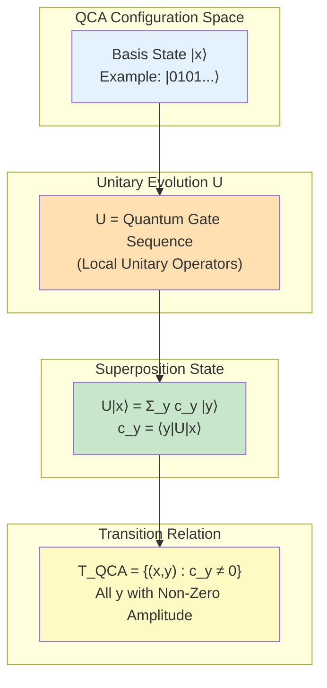

### 7.3 QCA Satisfies Five Axioms

**Proposition 7.3**: Under assumptions of locality and finite-dimensional Hilbert spaces, $U_{\mathrm{comp}}(U)=(X_{\mathrm{QCA}},\mathsf{T}_{\mathrm{QCA}},\mathsf{C}_{\mathrm{QCA}},\mathsf{I}_{\mathrm{QCA}})$ satisfies axioms A1-A5.

**Proof Points**:

**A1**: Finite-dimensional $\mathcal{H}_i$ guarantees each lattice site can only store finite information

**A2**: Locality of $U$ guarantees one-step reachable set finite, and depends only on local neighborhood

**A3**: Unitary operator $U$ naturally reversible ($U^{\dagger}U=\mathrm{id}$), so $\mathsf{T}_{\mathrm{QCA}}$ reversible

**A4**: Cost positivity guaranteed by positivity of physical realization time

**A5**: Information quality monotonicity can be proved through relative entropy function in Heisenberg picture

**Conclusion**: QCA is also a special case of computational universe! ✓

---

## 8. Unification of Three Classical Models

Now we have proved:

| Computational Model | Configuration Space $X$ | Update Relation $\mathsf{T}$ | Cost $\mathsf{C}$ | Satisfies Axioms? |
|---------------------|------------------------|------------------------------|-------------------|-------------------|
| **Turing Machine** | $Q\times\Gamma^{\mathbb{Z}}\times\mathbb{Z}$ | Determined by $\delta$ | Step count | ✓ A1-A5 |
| **Cellular Automaton** | $S^{\Lambda}$ | Determined by $F$ | Step count | ✓ A1-A5 |
| **QCA** | $\prod_i S_i$ (basis state labels) | Determined by $U$ | Physical time | ✓ A1-A5 |

**Key Insight**: Although they "look different", essentially all are:
- Discrete configuration space $X$ (A1 finite information)
- Local update rules $\mathsf{T}$ (A2 local update)
- Reversible dynamics (A3 generalized reversibility)
- Resource-constrained evolution $\mathsf{C}$ (A4 cost additivity)
- Goal-oriented computation $\mathsf{I}$ (A5 information monotonicity)

**Everyday Analogy**: Like "cars, trains, airplanes" though structurally different, all satisfy "axioms of transportation" (can carry people, can move, need energy, have direction).

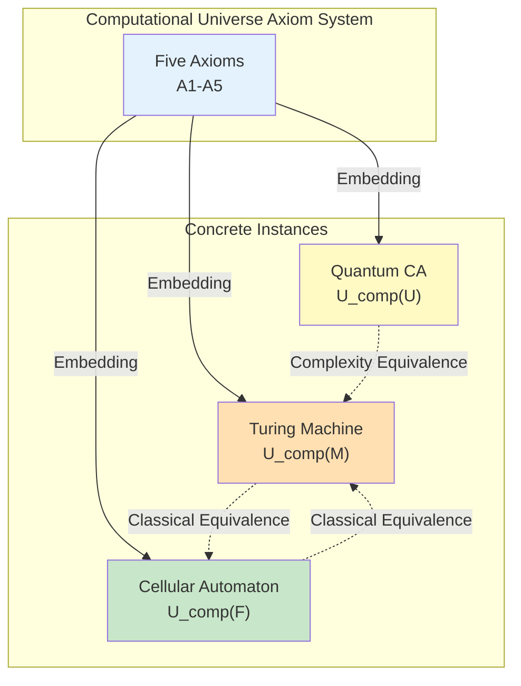

---

## 9. Key Theorem: Metric Properties of Complexity Distance

We have defined complexity distance $d(x,y)=\inf_{\gamma:x\to y}\mathsf{C}(\gamma)$, now prove it is indeed a "metric" (satisfies distance axioms).

**Theorem 9.1 (Complexity Distance is Generalized Metric)**

Under axioms A2 and A4, if for any $x,y\in X$ there exists at least one finite path connecting them, then $d(x,y)$ defines a **generalized metric** on $X$, satisfying:

1. **Non-Negativity**: $d(x,y)\ge 0$, and $d(x,x)=0$
2. **Symmetry** (reversible case): If $\mathsf{T}$ is bijection on $X_{\mathrm{phys}}$, then $d(x,y)=d(y,x)$ holds for $x,y\in X_{\mathrm{phys}}$
3. **Triangle Inequality**: $d(x,z)\le d(x,y)+d(y,z)$

**Proof**:

**(1) Non-Negativity**:
- For any $x$, take zero-length path $\gamma=(x)$, convention $\mathsf{C}(\gamma)=0$, so $d(x,x)\le 0$
- On the other hand, A4 guarantees any non-trivial path cost positive, so $d(x,x)=0$ ✓

**(2) Symmetry**:
- On $X_{\mathrm{phys}}$, $\mathsf{T}$ is bijection (A3)
- If path $\gamma:x\to y$ achieves infimum of $d(x,y)$, then exists inverse path $\gamma^{-1}:y\to x$
- By symmetry of A4 (single-step cost symmetric on physical subset), $\mathsf{C}(\gamma^{-1})=\mathsf{C}(\gamma)$
- So $d(y,x)\le\mathsf{C}(\gamma^{-1})=\mathsf{C}(\gamma)=d(x,y)$
- Reverse inequality similarly, get $d(x,y)=d(y,x)$ ✓

**(3) Triangle Inequality**:
- Given $\varepsilon>0$, exist paths $\gamma_1:x\to y$, $\gamma_2:y\to z$ such that:
  $$\mathsf{C}(\gamma_1)\le d(x,y)+\frac{\varepsilon}{2}, \quad \mathsf{C}(\gamma_2)\le d(y,z)+\frac{\varepsilon}{2}$$
- Concatenated path $\gamma=\gamma_1\cdot\gamma_2$ satisfies:
  $$\mathsf{C}(\gamma)=\mathsf{C}(\gamma_1)+\mathsf{C}(\gamma_2) \le d(x,y)+d(y,z)+\varepsilon$$
- By definition of $d(x,z)$, $d(x,z)\le\mathsf{C}(\gamma)$
- Let $\varepsilon\to 0$ get $d(x,z)\le d(x,y)+d(y,z)$ ✓

**Everyday Analogy**:
- Non-negativity: "Distance cannot be negative"
- Symmetry: "Distance from home to company = distance from company to home" (reversible world)
- Triangle inequality: "From home to company to supermarket, at least as far as directly from home to supermarket"

---

## 10. Summary and Outlook

### 10.1 Core Achievements

This article establishes **meta-foundation** of computational universe:

1. **Four-Tuple Definition**: $U_{\mathrm{comp}}=(X,\mathsf{T},\mathsf{C},\mathsf{I})$
   - Configuration space, update relation, cost function, information quality

2. **Five Axioms**: A1 (finite information), A2 (local update), A3 (reversibility), A4 (cost additivity), A5 (information monotonicity)
   - Guarantee "physical realizability"

3. **Classical Model Embedding**: Turing machines, cellular automata, QCA all satisfy five axioms
   - Proves **universality** of framework

4. **Complexity Distance**: $d(x,y)=\inf_{\gamma}\mathsf{C}(\gamma)$ is generalized metric
   - Lays foundation for subsequent geometrization

### 10.2 Key Insights

**Insight 1**: Essence of computation is "goal-oriented, resource-constrained, locally reversible state transitions"

**Insight 2**: Differences between Turing machines/CA/QCA are just "surface language", essence is all $U_{\mathrm{comp}}$

**Insight 3**: Complexity distance $d(x,y)$ turns "algorithm steps" into "geometric distance", paving way for geometrization

### 10.3 Interface with Other Chapters

**With Phase 5 (Universe Ten-Fold Structure)**:
- 10th component $U_{\text{comp}}$ now has strict definition
- Five axioms guarantee compatibility of $U_{\text{comp}}$ with other nine structures

**With Phase 6 (Finite Information Universe)**:
- Axiom A1 (finite information density) is basic assumption of Phase 6
- Information capacity $I_{\max}$ can be estimated from volume growth of configuration space $X$

**With Phase 8 (Time Crystals)**:
- Floquet-QCA is special case of QCA, now has axiomatic foundation

### 10.4 Preview of Next Chapter

**23.02 Simulation Morphisms and Computational Universe Category** will construct:
- Simulation maps $f:U_{\mathrm{comp}}\to U'_{\mathrm{comp}}$ (preserve stepping, cost control, information fidelity)
- Computational universe category $\mathbf{CompUniv}$ (objects=computational universes, morphisms=simulations)
- Categorical equivalence theorem of classical models

**Key Question**: How to prove "Turing machine ≃ cellular automaton ≃ QCA" in categorical framework?

---

**Everyday Analogy Summary**: This article is like "axiom system defining what is 'transportation vehicle'"—whether car (Turing machine), train (CA), or airplane (QCA), as long as satisfying five axioms of "can carry people, can move, need energy, have direction, local control", is qualified transportation vehicle. Next article will study "conversion between different vehicles" (simulation morphisms), and prove "in complexity sense, they are essentially same" (categorical equivalence).

$$
\boxed{U_{\mathrm{comp}}=(X,\mathsf{T},\mathsf{C},\mathsf{I}) + \text{A1-A5} = \text{Complete Definition of Computational Universe}}
$$

