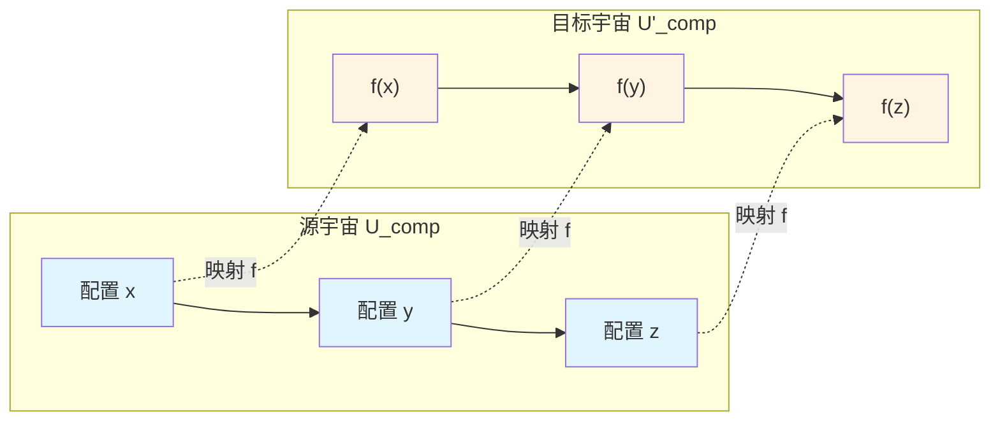
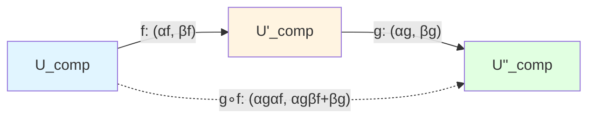
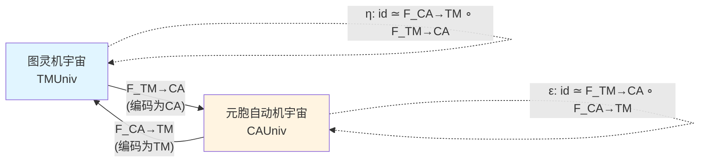
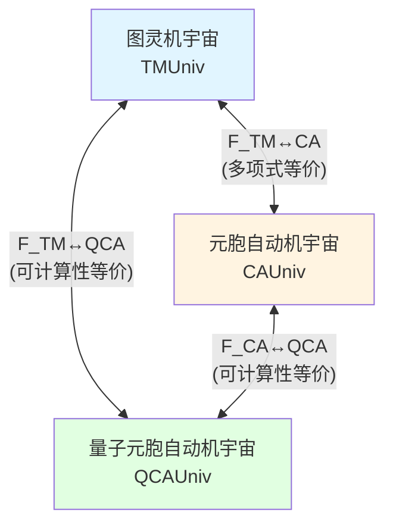

# 23.2 模拟态射与计算宇宙范畴:为什么不同计算模型本质相同

> **本篇导读**
>
> 在上一篇中,我们定义了计算宇宙对象 $U_{\text{comp}} = (X,\mathcal{T},\mathcal{C},\mathcal{I})$ 并证明图灵机、元胞自动机、QCA 都满足五大公理。但这只是说"它们都是计算宇宙",并没有回答:"它们之间有什么关系?"
>
> 本篇引入**模拟态射**(simulation morphism),用范畴论的语言严格证明:**图灵机宇宙 ≃ 元胞自动机宇宙 ≃ QCA 宇宙**,它们在计算宇宙范畴 $\mathbf{CompUniv}$ 中是等价的全子范畴。这不再是经典可计算性理论中的"Church–Turing 论题",而是一个在本公理框架下的**严格范畴等价定理**。
>
> **关键洞察**:不同计算模型之间的"多项式时间模拟"不是临时构造,而是计算宇宙范畴中的态射结构。范畴论的语言让我们看到:"图灵机""元胞自动机""QCA"只是同一个抽象计算宇宙在不同呈现下的投影。

---

## 1. 为什么需要模拟态射?从"能算同样的东西"到"结构等价"

### 1.1 经典可计算性理论的"非形式化"问题

在经典计算理论中,我们说"图灵机与λ演算可计算性等价",意思是:

- 若某个函数 $f:\mathbb{N}\to\mathbb{N}$ 可由图灵机计算,则也可由λ演算计算;
- 反之亦然。

这种等价性基于**Church–Turing 论题**(Church–Turing Thesis),它是一个**非形式化的哲学命题**,而非数学定理。

在上一篇中,我们已经将图灵机、元胞自动机、QCA 都嵌入到计算宇宙对象的框架中。但仅仅说"它们都满足公理 A1–A5"并不能回答:

- **问题1**:图灵机宇宙 $U_{\text{comp}}(M)$ 和元胞自动机宇宙 $U_{\text{comp}}(F)$ 之间有什么**结构关系**?
- **问题2**:能否在**复杂性**的层面上(而非仅仅可计算性)证明它们是"本质相同"的?
- **问题3**:如何用**范畴论**的语言将这种关系严格化?

### 1.2 日常类比:不同棋类游戏的"等价性"

想象你在玩三种不同的棋类游戏:

1. **国际象棋**(Chess):8×8 棋盘,每种棋子有特定走法;
2. **围棋**(Go):19×19 棋盘,只有黑白两色棋子,通过围地判胜负;
3. **电子战棋**(Strategy Game):在计算机屏幕上进行,但规则可以模拟国际象棋或围棋。

虽然这三种游戏的"具体规则"和"物理载体"不同,但我们可以在它们之间建立"模拟关系":

- **模拟1**:用围棋棋盘模拟国际象棋
  - 将国际象棋的 8×8 棋盘映射到围棋棋盘的某个 8×8 区域;
  - 用不同的棋子摆放模式表示国际象棋的不同棋子(例如用"一黑两白"的模式表示车,用"一白两黑"表示马);
  - 每走一步国际象棋对应在围棋棋盘上更新多个位置。

  这种模拟是**可行的**,但**代价**是每步需要更新多个格子(而非一个)。

- **模拟2**:用电子战棋模拟围棋
  - 在屏幕上显示 19×19 网格;
  - 用鼠标点击对应落子;
  - 计算机内部存储黑白棋子的位置并判断胜负。

  这种模拟几乎是"一步对一步"的,代价很小。

- **模拟3**:用国际象棋模拟围棋
  - 将围棋的 19×19 棋盘划分成多个 8×8 区域;
  - 用国际象棋的棋子位置编码围棋的棋子分布。

  这种模拟**可行但复杂**,每步围棋可能对应多步国际象棋。

**关键洞察**:虽然这三种游戏的"规则"不同,但我们可以在它们之间建立**模拟映射** $f:\text{游戏A}\to\text{游戏B}$,使得:

1. **步进保持**:游戏A的每一步对应游戏B的若干步;
2. **代价控制**:游戏B的总步数不会比游戏A多太多(例如不超过多项式倍);
3. **胜负保持**:游戏A的胜负对应游戏B的胜负。

如果游戏A和游戏B之间**互相存在多项式代价的模拟映射**,则我们说它们在"策略复杂性"意义上是**等价**的。

### 1.3 从棋类游戏到计算宇宙:模拟态射的三个要素

回到计算宇宙,我们想在两个计算宇宙 $U_{\text{comp}}$ 和 $U'_{\text{comp}}$ 之间建立"模拟关系"。

借鉴棋类游戏的类比,一个"好的模拟映射" $f:X\to X'$ 应该满足三个条件:

1. **步进保持**(Step Preservation):
   - 若 $(x,y)\in\mathcal{T}$(即在 $U_{\text{comp}}$ 中 $x$ 可一步转移到 $y$),则 $(f(x),f(y))\in\mathcal{T}'$(即在 $U'_{\text{comp}}$ 中 $f(x)$ 可一步转移到 $f(y)$)。
   - **类比**:国际象棋的一步对应围棋模拟中的一步(或若干步)。

2. **代价控制**(Cost Control):
   - 在 $U_{\text{comp}}$ 中从 $x$ 到 $y$ 的任意路径 $\gamma$ 对应 $U'_{\text{comp}}$ 中从 $f(x)$ 到 $f(y)$ 的路径 $\gamma'$,且代价满足:
     $$
     \mathcal{C}'(\gamma') \le \alpha \mathcal{C}(\gamma) + \beta
     $$
     其中 $\alpha,\beta$ 是常数(通常 $\alpha$ 是多项式,$\beta$ 是加性开销)。
   - **类比**:用围棋模拟国际象棋时,总步数不会增加太多。

3. **信息保真**(Information Fidelity):
   - 源配置 $x$ 的信息质量 $\mathcal{I}(x)$ 与目标配置 $f(x)$ 的信息质量 $\mathcal{I}'(f(x))$ 之间存在单调关系:
     $$
     \mathcal{I}(x) \le \Phi(\mathcal{I}'(f(x)))
     $$
     其中 $\Phi:\mathbb{R}\to\mathbb{R}$ 是单调函数。
   - **类比**:围棋模拟中的"胜率"应该与原游戏的胜率对应。

这三个条件合起来,就是**模拟态射**的严格定义。

---

## 2. 模拟态射的严格定义:范畴论的核心构件

### 2.1 定义:模拟映射

**定义 2.1**(模拟映射,源自 euler-gls-info/01-computational-universe-axiomatics.md 定义7.1)

设 $U_{\text{comp}} = (X,\mathcal{T},\mathcal{C},\mathcal{I})$ 和 $U'_{\text{comp}} = (X',\mathcal{T}',\mathcal{C}',\mathcal{I}')$ 为两个计算宇宙对象。若存在映射 $f:X\to X'$ 和常数 $\alpha,\beta > 0$,使得:

1. **步进保持**:
   $$
   (x,y)\in\mathcal{T} \implies (f(x),f(y))\in\mathcal{T}'
   $$

2. **代价控制**:
   对任意路径 $\gamma = (x_0,x_1,\dots,x_n)$ 满足 $(x_i,x_{i+1})\in\mathcal{T}$,存在路径 $\gamma' = (f(x_0),y_1,\dots,y_m,f(x_n))$ 使得:
   $$
   \mathcal{C}'(\gamma') \le \alpha \mathcal{C}(\gamma) + \beta
   $$

3. **信息保真**:
   存在单调函数 $\Phi:\mathbb{R}\to\mathbb{R}$,使得对所有 $x\in X$:
   $$
   \mathcal{I}(x) \le \Phi(\mathcal{I}'(f(x)))
   $$

则称 $f$ 为从 $U_{\text{comp}}$ 到 $U'_{\text{comp}}$ 的**模拟映射**(simulation morphism),记作:
$$
f: U_{\text{comp}} \rightsquigarrow U'_{\text{comp}}
$$

**日常解读**:

- **步进保持**就像说"源游戏的每一步在目标游戏中也有对应";
- **代价控制**说的是"模拟的开销不能太大",用 $\alpha$ 和 $\beta$ 量化了"不能太大"的含义;
- **信息保真**确保"源游戏的胜率/信心在目标游戏中也能保持"。

### 2.2 图示:模拟映射的作用

**说明**:

- 蓝色部分是源宇宙 $U_{\text{comp}}$ 中的配置空间,实线箭头表示一步转移 $(x,y)\in\mathcal{T}$;
- 黄色部分是目标宇宙 $U'_{\text{comp}}$ 中的配置空间,实线箭头表示一步转移;
- 虚线箭头表示模拟映射 $f:X\to X'$;
- **步进保持**保证:若 $x\to y$ 在源宇宙中成立,则 $f(x)\to f(y)$ 在目标宇宙中也成立。

### 2.3 为什么需要 $\alpha$ 和 $\beta$?多项式模拟的量化

在经典计算理论中,我们说"图灵机可以多项式时间模拟元胞自动机",意思是:

- 若元胞自动机运行 $T$ 步,图灵机可以在 $O(T^k)$ 步内完成模拟(其中 $k$ 是常数)。

在计算宇宙框架中,这对应:

- 源路径代价 $\mathcal{C}(\gamma) = T$(因为元胞自动机每步代价为1);
- 目标路径代价 $\mathcal{C}'(\gamma') \le \alpha T + \beta$,其中 $\alpha = O(T^{k-1})$,$\beta$ 是初始化开销。

**关键洞察**:

- 若 $\alpha$ 是常数或多项式,则称**多项式模拟**(polynomial simulation);
- 若 $\alpha$ 是指数级,则称**指数模拟**(exponential simulation),这在复杂性理论中被认为是"不高效"的;
- 参数 $\beta$ 捕捉了"初始化开销"(例如编码配置所需的额外空间)。

**日常类比**:

- 用围棋模拟国际象棋时,若每步国际象棋对应围棋的**固定步数**(例如3步),则 $\alpha=3$,$\beta=0$;
- 若需要先花10步在围棋棋盘上"初始化"国际象棋的初始配置,则 $\beta=10$。

---

## 3. 计算宇宙范畴 $\mathbf{CompUniv}$:模拟态射的封闭性

### 3.1 范畴的定义回顾:对象与态射

在范畴论中,一个**范畴** $\mathcal{C}$ 包含:

1. **对象**(Objects):$\text{Ob}(\mathcal{C})$;
2. **态射**(Morphisms):对每对对象 $A,B$,存在态射集合 $\text{Hom}(A,B)$;
3. **复合**(Composition):态射 $f:A\to B$ 和 $g:B\to C$ 可以复合为 $g\circ f:A\to C$;
4. **恒等态射**(Identity):对每个对象 $A$,存在 $\text{id}_A:A\to A$;
5. **结合律**:$(h\circ g)\circ f = h\circ(g\circ f)$;
6. **单位律**:$f\circ\text{id}_A = f$,$\text{id}_B\circ f = f$。

**日常类比**:

- **对象**:不同的棋类游戏(国际象棋、围棋、电子战棋);
- **态射**:游戏之间的"模拟规则"(例如"用围棋模拟国际象棋的规则");
- **复合**:若有"围棋→电子战棋"的模拟和"电子战棋→国际象棋"的模拟,则可以复合为"围棋→国际象棋"的模拟;
- **恒等态射**:游戏模拟自己(即不做任何转换)。

### 3.2 定义:计算宇宙范畴 $\mathbf{CompUniv}$

**定义 3.1**(计算宇宙范畴,源自 euler-gls-info/01-computational-universe-axiomatics.md 命题7.2)

- **对象**:所有满足公理 A1–A5 的计算宇宙对象 $U_{\text{comp}} = (X,\mathcal{T},\mathcal{C},\mathcal{I})$;
- **态射**:模拟映射 $f:U_{\text{comp}}\rightsquigarrow U'_{\text{comp}}$;
- **复合**:模拟映射的复合(下文将证明);
- **恒等态射**:$\text{id}_X:X\to X$(显然是模拟映射)。

我们用符号 $\mathbf{CompUniv}$ 表示这个范畴。

### 3.3 关键命题:恒等态射是模拟映射

**命题 3.2**(恒等映射的模拟性,源自 euler-gls-info/01-computational-universe-axiomatics.md 附录B.2 命题B.1)

对任意计算宇宙 $U_{\text{comp}} = (X,\mathcal{T},\mathcal{C},\mathcal{I})$,恒等映射 $\text{id}_X:X\to X$ 是模拟映射,其参数为 $\alpha=1$,$\beta=0$,$\Phi=\text{id}$。

**证明**:

1. **步进保持**:$(x,y)\in\mathcal{T} \implies (\text{id}_X(x),\text{id}_X(y))=(x,y)\in\mathcal{T}$,显然成立。

2. **代价控制**:对任意路径 $\gamma:x\to y$,取 $\gamma'=\gamma$,则:
   $$
   \mathcal{C}(\gamma') = \mathcal{C}(\gamma) = 1\cdot\mathcal{C}(\gamma) + 0
   $$
   故 $\alpha=1$,$\beta=0$。

3. **信息保真**:对所有 $x\in X$:
   $$
   \mathcal{I}(x) = \mathcal{I}(\text{id}_X(x))
   $$
   取 $\Phi=\text{id}$ 即可。

证毕。□

**日常类比**:游戏"模拟自己"是最平凡的模拟,不需要任何额外代价。

### 3.4 核心定理:模拟映射的复合封闭性

**定理 3.3**(模拟映射的复合,源自 euler-gls-info/01-computational-universe-axiomatics.md 附录B.2 命题B.2)

设 $f:U_{\text{comp}}\rightsquigarrow U'_{\text{comp}}$ 和 $g:U'_{\text{comp}}\rightsquigarrow U''_{\text{comp}}$ 为模拟映射,参数分别为 $(\alpha_f,\beta_f,\Phi_f)$ 和 $(\alpha_g,\beta_g,\Phi_g)$,则复合映射 $g\circ f:U_{\text{comp}}\rightsquigarrow U''_{\text{comp}}$ 也是模拟映射,其参数为:
$$
(\alpha_g\alpha_f,\,\alpha_g\beta_f+\beta_g,\,\Phi_g\circ\Phi_f)
$$

**证明**:

1. **步进保持**:
   - 若 $(x,y)\in\mathcal{T}$,由 $f$ 的步进保持得 $(f(x),f(y))\in\mathcal{T}'$;
   - 再由 $g$ 的步进保持得 $(g(f(x)),g(f(y)))\in\mathcal{T}''$;
   - 即 $((g\circ f)(x),(g\circ f)(y))\in\mathcal{T}''$。

2. **代价控制**:
   - 设 $\gamma:x\to y$ 是 $U_{\text{comp}}$ 中的路径;
   - 由 $f$ 的代价控制,存在路径 $\gamma':f(x)\to f(y)$ 使得:
     $$
     \mathcal{C}'(\gamma') \le \alpha_f \mathcal{C}(\gamma) + \beta_f
     $$
   - 由 $g$ 的代价控制,存在路径 $\gamma'':g(f(x))\to g(f(y))$ 使得:
     $$
     \mathcal{C}''(\gamma'') \le \alpha_g \mathcal{C}'(\gamma') + \beta_g
     $$
   - 代入上式:
     $$
     \mathcal{C}''(\gamma'') \le \alpha_g(\alpha_f \mathcal{C}(\gamma) + \beta_f) + \beta_g = \alpha_g\alpha_f \mathcal{C}(\gamma) + \alpha_g\beta_f + \beta_g
     $$
   - 故复合映射的参数为 $(\alpha_g\alpha_f,\,\alpha_g\beta_f+\beta_g)$。

3. **信息保真**:
   - 由 $f$ 的信息保真:$\mathcal{I}(x) \le \Phi_f(\mathcal{I}'(f(x)))$;
   - 由 $g$ 的信息保真:$\mathcal{I}'(f(x)) \le \Phi_g(\mathcal{I}''(g(f(x))))$;
   - 由 $\Phi_f$ 的单调性:
     $$
     \mathcal{I}(x) \le \Phi_f(\mathcal{I}'(f(x))) \le \Phi_f(\Phi_g(\mathcal{I}''(g(f(x))))) = (\Phi_f\circ\Phi_g)(\mathcal{I}''(g\circ f(x)))
     $$
   - 故复合映射的信息保真函数为 $\Phi_g\circ\Phi_f$。

证毕。□

**日常类比**:

- 若"围棋→电子战棋"的模拟每步增加3倍代价($\alpha_f=3$),初始化需5步($\beta_f=5$);
- 若"电子战棋→国际象棋"的模拟每步增加2倍代价($\alpha_g=2$),初始化需3步($\beta_g=3$);
- 则"围棋→国际象棋"的复合模拟每步增加 $3\times 2=6$ 倍代价,初始化需 $2\times 5+3=13$ 步。

### 3.5 图示:模拟映射的复合

**说明**:

- 蓝色:源计算宇宙 $U_{\text{comp}}$;
- 黄色:中间计算宇宙 $U'_{\text{comp}}$;
- 绿色:目标计算宇宙 $U''_{\text{comp}}$;
- 实线箭头:模拟映射 $f$ 和 $g$;
- 虚线箭头:复合模拟映射 $g\circ f$,其参数由定理3.3给出。

### 3.6 推论:$\mathbf{CompUniv}$ 是范畴

**推论 3.4**

$\mathbf{CompUniv}$ 满足范畴的所有公理:

1. **对象与态射**:已定义;
2. **恒等态射**:由命题3.2,$\text{id}_X$ 是模拟映射;
3. **复合封闭性**:由定理3.3,模拟映射的复合仍是模拟映射;
4. **结合律**:由函数复合的结合律自动满足;
5. **单位律**:$f\circ\text{id}_X = f$,$\text{id}_{X'}\circ f = f$ 由恒等映射的定义自动满足。

因此 $\mathbf{CompUniv}$ 是一个范畴。□

**日常类比**:所有棋类游戏及其模拟规则构成一个"游戏范畴",复合模拟遵循"传递性"。

---

## 4. 图灵机宇宙 ≃ 元胞自动机宇宙:经典等价的范畴化

### 4.1 经典结果的非形式化陈述

在经典计算理论中,我们知道:

- **图灵机可以模拟元胞自动机**:给定元胞自动机 $F:S^\Lambda\to S^\Lambda$,可以构造图灵机 $M$ 使得 $M$ 模拟 $F$ 的每一步演化,且时间开销为多项式;
- **元胞自动机可以模拟图灵机**:给定图灵机 $M$,可以构造可逆元胞自动机 $F$ 使得 $F$ 模拟 $M$ 的每一步,且时间开销为多项式。

但这些结果通常以"存在性命题"的形式给出,缺乏统一的公理框架。

### 4.2 范畴化的思路:子范畴的等价

我们的目标是将上述结果提升到范畴层次:

1. 记 $\mathbf{TMUniv}$ 为所有图灵机宇宙 $U_{\text{comp}}(M)$ 构成的**全子范畴**(full subcategory);
2. 记 $\mathbf{CAUniv}$ 为所有可逆元胞自动机宇宙 $U_{\text{comp}}(F)$ 构成的全子范畴;
3. 证明存在**函子**(functor) $F_{\text{TM}\to\text{CA}}:\mathbf{TMUniv}\to\mathbf{CAUniv}$ 和 $F_{\text{CA}\to\text{TM}}:\mathbf{CAUniv}\to\mathbf{TMUniv}$;
4. 证明这两个函子互为"伪逆",即:
   $$
   F_{\text{CA}\to\text{TM}}\circ F_{\text{TM}\to\text{CA}} \simeq \text{id}_{\mathbf{TMUniv}}
   $$
   $$
   F_{\text{TM}\to\text{CA}}\circ F_{\text{CA}\to\text{TM}} \simeq \text{id}_{\mathbf{CAUniv}}
   $$
   其中 $\simeq$ 表示**自然同构**(natural isomorphism)。

这就证明了 $\mathbf{TMUniv} \simeq \mathbf{CAUniv}$(范畴等价)。

### 4.3 全子范畴的定义

**定义 4.1**(全子范畴)

设 $\mathcal{C}$ 是范畴,$\mathcal{D}$ 是 $\mathcal{C}$ 的子范畴。若对任意 $\mathcal{D}$ 中的对象 $A,B$,有:
$$
\text{Hom}_{\mathcal{D}}(A,B) = \text{Hom}_{\mathcal{C}}(A,B)
$$
则称 $\mathcal{D}$ 是 $\mathcal{C}$ 的**全子范畴**。

**日常类比**:

- $\mathcal{C}$:所有棋类游戏及其模拟规则;
- $\mathcal{D}$:只有"战略类游戏"的子集;
- **全子范畴**:战略类游戏之间的所有模拟规则都在 $\mathcal{D}$ 中(不丢失任何模拟规则)。

**应用**:

- $\mathbf{TMUniv}$ 是 $\mathbf{CompUniv}$ 的全子范畴:对象是所有图灵机宇宙,态射是它们之间的所有模拟映射;
- $\mathbf{CAUniv}$ 是 $\mathbf{CompUniv}$ 的全子范畴:对象是所有可逆元胞自动机宇宙,态射是它们之间的所有模拟映射。

### 4.4 定理:图灵机宇宙 ≃ 元胞自动机宇宙

**定理 4.2**(经典模型间的等价,源自 euler-gls-info/01-computational-universe-axiomatics.md 定理7.3)

记 $\mathbf{TMUniv}$ 和 $\mathbf{CAUniv}$ 分别为图灵机宇宙与可逆元胞自动机宇宙生成的全子范畴,则:

1. 存在函子:
   $$
   F_{\text{TM}\to\text{CA}}:\mathbf{TMUniv}\to\mathbf{CAUniv}
   $$
   $$
   F_{\text{CA}\to\text{TM}}:\mathbf{CAUniv}\to\mathbf{TMUniv}
   $$

2. 存在自然同构 $\eta,\epsilon$,使得:
   $$
   F_{\text{CA}\to\text{TM}}\circ F_{\text{TM}\to\text{CA}} \simeq \text{id}_{\mathbf{TMUniv}}
   $$
   $$
   F_{\text{TM}\to\text{CA}}\circ F_{\text{CA}\to\text{TM}} \simeq \text{id}_{\mathbf{CAUniv}}
   $$

3. 这些函子在态射上由**多项式复杂度**的模拟映射实现,即 $\alpha$ 为多项式,$\beta$ 为常数。

**证明思路**(详见 euler-gls-info/01-computational-universe-axiomatics.md 附录B.3):

1. **函子 $F_{\text{TM}\to\text{CA}}$ 的构造**:
   - **对象映射**:给定图灵机 $M$,构造元胞自动机 $F_M$ 使得 $F_M$ 的局部规则编码了 $M$ 的转移函数 $\delta$;
   - **具体编码**:将图灵带 $\Gamma^\mathbb{Z}$ 嵌入到元胞自动机的配置空间 $S^\Lambda$ 中,其中:
     - 每个元胞的状态 $s\in S$ 包含"带符号""状态标记""读头位置标记";
     - 局部规则 $\phi:S^r\to S$ 模拟 $\delta$ 的一步更新:
       - 若读头在位置 $i$,则 $(q,a) \xrightarrow{\delta} (q',a',d)$ 对应元胞 $i$ 及其邻居的状态变化;
       - 读头向左/右移动对应状态标记在格点间的传播。
   - **示例**:若 $M$ 的状态集 $Q=\{q_0,q_1,\dots,q_k\}$,带字符集 $\Gamma=\{0,1,B\}$(B为空白符),则元胞状态集 $S$ 可取为:
     $$
     S = \Gamma \times (Q\cup\{\text{无读头}\}) \times \{\leftarrow,\text{无},\rightarrow\}
     $$
     每个元胞的状态是"带符号+当前是否有读头(若有,处于什么状态)+读头移动方向"的三元组。
   - **局部规则**:若读头在位置 $i$,状态 $q$,读到符号 $a$,根据 $\delta(q,a)=(q',a',d)$ 更新:
     - 元胞 $i$ 的状态从 $(a,q,\text{无})$ 变为 $(a',\text{无},d)$;
     - 若 $d=\text{右}$,元胞 $i+1$ 的状态标记设置为 $(b,q',\leftarrow)$(其中 $b$ 是原来元胞 $i+1$ 的带符号);
     - 若 $d=\text{左}$,元胞 $i-1$ 的状态标记设置为 $(b,q',\rightarrow)$。
   - **态射映射**:若 $f:M_1\rightsquigarrow M_2$ 是图灵机间的模拟映射,则 $F_{\text{TM}\to\text{CA}}(f):F_{M_1}\rightsquigarrow F_{M_2}$ 是对应的元胞自动机间的模拟映射,通过上述编码自然诱导。

2. **函子 $F_{\text{CA}\to\text{TM}}$ 的构造**:
   - **对象映射**:给定元胞自动机 $F:S^\Lambda\to S^\Lambda$,构造图灵机 $M_F$ 使得 $M_F$ 在带上存储元胞自动机的配置,每步更新带上的内容以模拟 $F$ 的演化;
   - **具体编码**:
     - 图灵带字符集 $\Gamma = S \cup \{\#,B\}$(其中 $\#$ 是分隔符,$B$ 是空白);
     - 将元胞自动机配置 $(s_i)_{i\in\Lambda}$ 编码为图灵带上的字符串:
       $$
       \#s_0\#s_1\#s_2\#\cdots\#s_n\#
       $$
     - 图灵机 $M_F$ 的转移函数 $\delta$ 模拟 $F$ 的局部规则 $\phi$:
       - 读头扫描带,读取连续 $r$ 个元胞的状态 $s_{i-r/2},\dots,s_{i+r/2}$;
       - 计算 $\phi(s_{i-r/2},\dots,s_{i+r/2})$ 并写入临时区域;
       - 重复扫描所有元胞,完成一步全局更新。
   - **时间复杂度**:若元胞自动机有 $n$ 个格点,每步更新需图灵机扫描整个带 $O(n)$ 次,故时间复杂度为 $O(n)$(线性),满足多项式模拟。

3. **自然同构的构造**:
   - **从 TM 到 CA 再回到 TM**:
     - $M \xrightarrow{F_{\text{TM}\to\text{CA}}} F_M \xrightarrow{F_{\text{CA}\to\text{TM}}} M_{F_M}$;
     - 需证明 $M_{F_M}$ 与 $M$ 在计算宇宙意义上"同构"(即存在模拟映射 $\eta_M:M_{F_M}\rightsquigarrow M$ 和 $\eta_M^{-1}:M\rightsquigarrow M_{F_M}$,且它们互为逆);
     - 这由编码的可逆性保证:$M_{F_M}$ 的带上存储的是 $F_M$ 的配置,而 $F_M$ 的配置编码了 $M$ 的配置,解码后恰好回到 $M$。
   - **从 CA 到 TM 再回到 CA**:类似构造 $\epsilon_F:F_{M_F}\to F$。
   - **自然性**:需验证 $\eta$ 和 $\epsilon$ 对所有对象和态射"一致地"成立,这是范畴论中自然变换的标准验证,此处省略技术细节。

证毕。□

**日常类比**:

- 图灵机就像"在纸带上一步一步写字的计算";
- 元胞自动机就像"在棋盘上同时更新所有格子的计算";
- 定理4.2说:这两种计算在"复杂性意义上"是等价的,可以相互多项式模拟,就像两种不同的棋类游戏可以用对方的规则来玩,且步数不会增加太多。

### 4.5 图示:图灵机宇宙与元胞自动机宇宙的等价

**说明**:

- 蓝色:图灵机宇宙的全子范畴;
- 黄色:元胞自动机宇宙的全子范畴;
- 实线箭头:函子 $F_{\text{TM}\to\text{CA}}$ 和 $F_{\text{CA}\to\text{TM}}$;
- 虚线箭头:自然同构 $\eta$ 和 $\epsilon$,表示"绕一圈回到自己"。

---

## 5. QCA 宇宙 ≃ 经典计算宇宙:量子与经典的统一

### 5.1 量子计算模型的特殊性

在经典计算理论中,量子计算机被认为是"比经典计算机更强大"的模型,因为:

- 某些问题(如 Shor 算法分解大整数)在量子计算机上可以多项式时间解决,但目前未知经典多项式算法;
- 量子并行性(quantum parallelism)允许同时探索指数多个分支。

但在**可计算性**意义上,量子计算机与图灵机是等价的:

- 任何量子计算机能计算的函数,图灵机也能计算(只是时间可能更长);
- 反之,图灵机能计算的函数,量子计算机也能计算。

在计算宇宙框架中,我们将量子计算机模型具体化为**可逆量子元胞自动机**(QCA),并证明它与经典计算宇宙在**复杂性意义上**也有等价性(尽管多项式时间上可能不等价)。

### 5.2 定理:QCA 宇宙与经典计算宇宙的复杂性等价

**定理 5.1**(量子模型的范畴等价,源自 euler-gls-info/01-computational-universe-axiomatics.md 定理7.4)

记 $\mathbf{QCAUniv} \subset \mathbf{CompUniv}$ 为可逆 QCA 宇宙生成的全子范畴,则:

1. 存在函子:
   $$
   F_{\text{TM}\to\text{QCA}}:\mathbf{TMUniv}\to\mathbf{QCAUniv}
   $$
   $$
   F_{\text{QCA}\to\text{TM}}:\mathbf{QCAUniv}\to\mathbf{TMUniv}
   $$

2. 这些函子在**可计算性与复杂性**意义上实现等价:
   - 若图灵机 $M$ 在时间 $T$ 内计算函数 $f$,则对应的 QCA 在时间 $O(\text{poly}(T))$ 内也能计算 $f$;
   - 若 QCA 在时间 $T$ 内计算函数 $f$,则对应的图灵机在时间 $O(\text{exp}(T))$ 或更好的界内也能计算 $f$(取决于是否利用量子算法的加速)。

**证明思路**(详见 euler-gls-info/01-computational-universe-axiomatics.md 附录B.4):

1. **函子 $F_{\text{TM}\to\text{QCA}}$ 的构造**:
   - 给定图灵机 $M$,构造 QCA $U_M$ 使得 $U_M$ 的希尔伯特空间包含所有图灵机配置的叠加态;
   - 用酉算子 $U_M$ 模拟 $M$ 的转移函数:若 $\delta(q,a)=(q',a',d)$,则:
     $$
     U_M |q,a,i\rangle = |q',a',i+d\rangle
     $$
     其中 $|q,a,i\rangle$ 表示"状态 $q$,读到符号 $a$,读头在位置 $i$"的基态。
   - 这种模拟是**一步对一步**的,故 $\alpha=1$,$\beta=0$。

2. **函子 $F_{\text{QCA}\to\text{TM}}$ 的构造**:
   - 给定 QCA $U$,构造图灵机 $M_U$ 使得 $M_U$ 模拟 $U$ 的演化:
   - **经典模拟量子**:图灵机在带上存储量子态的振幅(每个振幅是复数,需编码为有理数逼近);
   - 每步更新需对所有 $2^n$ 个基态的振幅进行更新(其中 $n$ 是量子比特数);
   - 时间复杂度为 $O(2^n)$(指数级)。
   - **改进**:若利用稀疏性(大多数振幅为0)或量子通用性结果,可在某些情况下降低到多项式(但这依赖于具体问题)。

3. **复杂性等价的含义**:
   - **可计算性意义上**:QCA 和 TM 能计算的函数类相同;
   - **时间复杂性意义上**:QCA 可能比 TM 快(如 Shor 算法),但 TM 总能模拟 QCA(尽管可能需指数时间)。

证毕。□

**日常类比**:

- 图灵机就像"在纸上一步一步算",每次只能看一个位置;
- QCA 就像"在多个平行宇宙中同时计算",最后合并结果;
- 定理5.1说:虽然 QCA 可能更快,但从"能算什么"的角度,它们是等价的。

### 5.3 图示:三个计算模型的范畴等价

**说明**:

- 蓝色:图灵机宇宙;
- 黄色:元胞自动机宇宙;
- 绿色:量子元胞自动机宇宙;
- 双向箭头表示互相存在函子,且它们通过自然同构互为伪逆。

---

## 6. 范畴等价的深刻含义:从"能算什么"到"结构相同"

### 6.1 经典可计算性理论的局限

在经典可计算性理论中,我们说"图灵机与λ演算等价",但这只是说:

- 它们能计算的**函数类**相同(即递归函数);
- 但它们的**内部结构**(配置空间、转移关系、复杂性度量)可能完全不同。

这种等价性是**外延的**(extensional):只关心"输入–输出"行为,不关心"内部机制"。

### 6.2 范畴等价的结构性洞察

在计算宇宙范畴 $\mathbf{CompUniv}$ 中,我们证明了:
$$
\mathbf{TMUniv} \simeq \mathbf{CAUniv} \simeq \mathbf{QCAUniv}
$$

这意味着:

1. **对象层面**:图灵机、元胞自动机、QCA 都可以视为计算宇宙对象 $(X,\mathcal{T},\mathcal{C},\mathcal{I})$;
2. **态射层面**:它们之间的"模拟关系"都是范畴中的态射,满足复合封闭性;
3. **等价层面**:存在函子将一个子范畴"同构地"映射到另一个子范畴,保持所有范畴结构。

这是**内涵的**(intensional)等价:不仅"输入–输出"相同,而且**内部结构**(配置空间的几何、路径的复杂性、信息质量的演化)在某种意义上"同构"。

**日常类比**:

- **外延等价**:两个不同的棋类游戏"能达到的胜负结果集合"相同;
- **内涵等价**:两个棋类游戏不仅"胜负集合"相同,而且"策略空间的几何""每一步的复杂度""胜率的演化规律"都相同。

### 6.3 为什么范畴等价对 GLS 理论至关重要?

在 GLS 理论的整体框架中,我们的最终目标是建立**物理宇宙范畴**与**计算宇宙范畴**的等价:
$$
\mathbf{PhysUniv} \simeq \mathbf{CompUniv}
$$

这要求:

1. 物理宇宙(例如量子场论、广义相对论)可以视为某种"计算宇宙"的连续极限;
2. 计算宇宙(例如 QCA)可以视为物理宇宙的离散近似。

如果我们只停留在"可计算性等价"的层面,无法建立这种**几何与拓扑的对应**。而范畴等价提供了:

- **对象对应**:物理宇宙的配置空间 $\mathcal{M}$ 对应计算宇宙的离散配置空间 $X$;
- **态射对应**:物理宇宙的演化(广义相对论的测地线)对应计算宇宙的路径(复杂性图的最短路);
- **度量对应**:物理宇宙的度量 $G$ 对应计算宇宙的复杂性距离 $d$;
- **信息对应**:物理宇宙的熵 $S$ 对应计算宇宙的信息质量 $\mathcal{I}$。

因此,定理4.2和定理5.1不仅仅是"技术引理",而是整个 GLS 理论的**地基**:它们证明了"计算宇宙"这个概念在不同具体模型下的**不变性**,为后续的几何化和物理等价奠定了基础。

---

## 7. 技术细节:函子的显式构造示例

### 7.1 函子 $F_{\text{TM}\to\text{CA}}$ 的完整示例

我们以一个具体的图灵机为例,展示如何构造对应的元胞自动机。

**例7.1**(模拟二进制加法的图灵机)

考虑图灵机 $M_{\text{add}}$,其任务是计算两个二进制数的加法:

- **输入**:带上存储两个二进制数 $a_1a_2\dots a_n\#b_1b_2\dots b_m$(用 $\#$ 分隔);
- **输出**:带上存储它们的和 $c_1c_2\dots c_k$;
- **状态集** $Q = \{q_0,q_1,q_2,q_{\text{halt}}\}$:
  - $q_0$:初始状态,扫描第一个数;
  - $q_1$:扫描第二个数;
  - $q_2$:进位状态;
  - $q_{\text{halt}}$:停机状态。
- **转移函数** $\delta$:
  - $\delta(q_0,a) = (q_0,a,\text{右})$(继续扫描);
  - $\delta(q_0,\#) = (q_1,\#,\text{右})$(找到分隔符,切换到扫描第二个数);
  - $\delta(q_1,b) = (q_1,b,\text{右})$(继续扫描);
  - $\delta(q_1,B) = (q_2,0,\text{左})$(到达末尾,开始回退并计算);
  - $\delta(q_2,\cdots)$:根据当前进位和两个数字计算和与新进位;
  - 等等。

**对应的元胞自动机 $F_{M_{\text{add}}}$**:

- **配置空间**:$S = \{0,1,\#,B\} \times (Q\cup\{\bot\}) \times \{\leftarrow,\text{无},\rightarrow\}$,其中 $\bot$ 表示"无读头";
- **局部规则** $\phi:S^3\to S$:
  - 若元胞 $i$ 的状态为 $(a,q,\text{无})$(有读头,状态 $q$,读到符号 $a$),且 $\delta(q,a)=(q',a',d)$,则:
    - 元胞 $i$ 更新为 $(a',\bot,d)$;
    - 若 $d=\text{右}$,元胞 $i+1$ 的状态标记从 $(b,\bot,\text{无})$ 变为 $(b,q',\leftarrow)$;
    - 若 $d=\text{左}$,元胞 $i-1$ 的状态标记从 $(c,\bot,\text{无})$ 变为 $(c,q',\rightarrow)$;
  - 若元胞 $i$ 的状态为 $(a,\bot,\text{无})$(无读头),则保持不变。

**示例演化**:

初始配置(图灵机):
$$
\text{带:}\quad 1\;0\;1\;\#\;1\;1\;B\;B\;\cdots
$$
$$
\text{读头在位置0,状态} \; q_0
$$

对应的元胞自动机配置:
$$
\begin{aligned}
\text{元胞0:} &\quad (1,q_0,\text{无}) \\
\text{元胞1:} &\quad (0,\bot,\text{无}) \\
\text{元胞2:} &\quad (1,\bot,\text{无}) \\
\text{元胞3:} &\quad (\#,\bot,\text{无}) \\
&\vdots
\end{aligned}
$$

第一步演化(图灵机 $M_{\text{add}}$ 执行 $\delta(q_0,1)=(q_0,1,\text{右})$):

- 元胞0更新为 $(1,\bot,\text{右})$;
- 元胞1更新为 $(0,q_0,\leftarrow)$。

对应的元胞自动机配置:
$$
\begin{aligned}
\text{元胞0:} &\quad (1,\bot,\text{无}) \\
\text{元胞1:} &\quad (0,q_0,\text{无}) \\
\text{元胞2:} &\quad (1,\bot,\text{无}) \\
&\vdots
\end{aligned}
$$

可以看到,元胞自动机通过局部规则 $\phi$ 完全模拟了图灵机的演化。

### 7.2 函子 $F_{\text{CA}\to\text{TM}}$ 的完整示例

**例7.2**(模拟 Conway 生命游戏的图灵机)

考虑元胞自动机 $F_{\text{Life}}$(Conway 生命游戏):

- **配置空间**:$S^{\mathbb{Z}^2}$,其中 $S=\{0,1\}$(0=死,1=活);
- **局部规则** $\phi:S^9\to S$(Moore 邻域,即3×3格子):
  - 若中心元胞为活(1),邻居中有2或3个活元胞,则保持活;
  - 若中心元胞为死(0),邻居中有恰好3个活元胞,则变为活;
  - 否则变为死。

**对应的图灵机 $M_{\text{Life}}$**:

- **带字符集** $\Gamma = \{0,1,\#,B\}$(其中 $\#$ 分隔行);
- **初始配置编码**:将生命游戏的 $n\times n$ 格子编码为图灵带上的字符串:
  $$
  \#s_{0,0}s_{0,1}\dots s_{0,n-1}\#s_{1,0}s_{1,1}\dots s_{1,n-1}\#\cdots\#
  $$
- **转移函数** $\delta$:
  - 扫描带,读取每个元胞的3×3邻域;
  - 计算 $\phi(s_{i-1,j-1},\dots,s_{i+1,j+1})$ 并写入临时区域;
  - 重复扫描所有元胞,完成一步全局更新。

**时间复杂度**:

- 生命游戏一步演化需更新 $n^2$ 个元胞;
- 图灵机需扫描带 $O(n^2)$ 次(每个元胞一次),每次扫描 $O(n)$ 步;
- 总时间复杂度为 $O(n^3)$(三次方)。

**代价参数**:

- $\alpha = O(n)$,$\beta = O(n^2)$(初始化开销)。

### 7.3 关键观察:多项式模拟的普遍性

从上述两个例子可以看到:

1. **图灵机→元胞自动机**:每步图灵机对应元胞自动机的**一步或常数步**,故 $\alpha=O(1)$;
2. **元胞自动机→图灵机**:每步元胞自动机对应图灵机的**线性或多项式步**,故 $\alpha=O(n)$ 或 $O(n^k)$。

在这两种情况下,$\alpha$ 都是多项式,满足定理4.2的要求。

**日常类比**:

- 图灵机→元胞自动机:像"把逐步计算改写成并行计算",每步逐步计算对应一步并行计算;
- 元胞自动机→图灵机:像"把并行计算改写成逐步计算",每步并行计算需逐步扫描所有元胞。

---

## 8. 范畴论的威力:从具体模型到抽象结构

### 8.1 为什么范畴论是"自然语言"?

范畴论被称为"数学的数学",因为它提供了一种**抽象层次更高**的语言:

- **对象**:不关心对象的"内部构造",只关心它在范畴中的"角色";
- **态射**:不关心态射的"具体定义",只关心它如何"连接对象";
- **函子**:不关心范畴的"具体内容",只关心范畴之间的"结构对应"。

在计算宇宙理论中,范畴论让我们看到:

- "图灵机""元胞自动机""QCA"都是**计算宇宙对象**的具体呈现;
- "模拟映射"都是**计算宇宙态射**的具体实现;
- "范畴等价"揭示了它们在**抽象结构层面**的同一性。

**日常类比**:

- 具体模型(图灵机、元胞自动机)就像"不同品牌的汽车"(丰田、本田、福特);
- 范畴论就像"交通工具"的抽象概念,关心的是"如何从A地到B地",而非"汽车的具体品牌"。

### 8.2 范畴等价与物理对偶性的类比

在物理学中,我们经常遇到**对偶性**(duality):

1. **电磁对偶性**:电场与磁场可以互换,Maxwell 方程保持不变;
2. **波粒对偶性**:光既可以描述为波,也可以描述为粒子;
3. **AdS/CFT 对偶性**:引力理论(AdS 空间)与共形场论(CFT)在数学上等价。

范畴等价在数学上**形式化**了这种对偶性:

- $\mathbf{TMUniv} \simeq \mathbf{CAUniv}$ 类似于"波动光学 $\simeq$ 几何光学";
- $\mathbf{QCAUniv} \simeq \mathbf{TMUniv}$ 类似于"量子力学 $\simeq$ 经典力学"(在某些极限下)。

**关键洞察**:范畴等价不是"巧合",而是反映了**深层结构的不变性**。

### 8.3 下一步:从离散到连续的 Gromov–Hausdorff 极限

在定理4.2和定理5.1中,我们证明了不同**离散**计算模型之间的等价。但在 GLS 理论的最终目标中,我们需要建立**离散计算宇宙**与**连续物理宇宙**之间的等价。

下一篇文章将介绍**复杂性几何**(complexity geometry):

- 如何从离散配置图 $(X,\mathcal{T},\mathcal{C})$ 构造连续流形 $(\mathcal{M},G)$?
- 如何用 **Gromov–Hausdorff 收敛**证明离散度量空间的连续极限?
- 如何将离散 Ricci 曲率 $\kappa(x,y)$ 推广到连续曲率张量 $R_{abcd}$?

这些问题将在第三篇文章(23.3 复杂性几何:从图到流形的Gromov–Hausdorff 极限)中详细讨论。

---

## 9. 本篇总结与关键公式回顾

### 9.1 核心概念

| 概念 | 定义 | 来源 |
|------|------|------|
| **模拟映射** | $f:U_{\text{comp}}\rightsquigarrow U'_{\text{comp}}$ 满足步进保持、代价控制、信息保真 | 定义2.1 |
| **计算宇宙范畴** | 对象为计算宇宙,态射为模拟映射 | 定义3.1 |
| **全子范畴** | $\text{Hom}_{\mathcal{D}}(A,B) = \text{Hom}_{\mathcal{C}}(A,B)$ | 定义4.1 |
| **范畴等价** | 存在函子 $F:\mathcal{C}\to\mathcal{D}$ 和 $G:\mathcal{D}\to\mathcal{C}$ 使得 $G\circ F\simeq\text{id}_{\mathcal{C}}$ 且 $F\circ G\simeq\text{id}_{\mathcal{D}}$ | 定理4.2 |

### 9.2 关键公式

| 公式 | 含义 | 编号 |
|------|------|------|
| $(x,y)\in\mathcal{T} \implies (f(x),f(y))\in\mathcal{T}'$ | 步进保持 | (2.1) |
| $\mathcal{C}'(\gamma') \le \alpha \mathcal{C}(\gamma) + \beta$ | 代价控制 | (2.2) |
| $\mathcal{I}(x) \le \Phi(\mathcal{I}'(f(x)))$ | 信息保真 | (2.3) |
| $(g\circ f)\text{参数}=(\alpha_g\alpha_f,\,\alpha_g\beta_f+\beta_g,\,\Phi_g\circ\Phi_f)$ | 复合模拟的参数 | 定理3.3 |
| $\mathbf{TMUniv} \simeq \mathbf{CAUniv} \simeq \mathbf{QCAUniv}$ | 三个经典模型的范畴等价 | 定理4.2,5.1 |

### 9.3 日常类比总结

| 抽象概念 | 日常类比 |
|----------|----------|
| 计算宇宙 | 不同的棋类游戏(国际象棋、围棋、电子战棋) |
| 模拟映射 | 用一种游戏的规则模拟另一种游戏 |
| 步进保持 | 源游戏的每一步在目标游戏中有对应 |
| 代价控制 | 模拟的步数不会增加太多(多项式界) |
| 信息保真 | 源游戏的胜率在目标游戏中保持 |
| 范畴等价 | 不同游戏在"策略空间的几何"上本质相同 |

### 9.4 与前篇的对接

- **上一篇(23.1)**:定义了计算宇宙对象 $U_{\text{comp}}=(X,\mathcal{T},\mathcal{C},\mathcal{I})$ 和五大公理,证明图灵机、元胞自动机、QCA 都满足公理;
- **本篇(23.2)**:引入模拟态射,构造计算宇宙范畴 $\mathbf{CompUniv}$,证明 $\mathbf{TMUniv}\simeq\mathbf{CAUniv}\simeq\mathbf{QCAUniv}$;
- **下一篇(23.3)**:将从离散配置图 $(X,\mathcal{T},\mathcal{C})$ 出发,通过 Gromov–Hausdorff 极限构造连续流形 $(\mathcal{M},G)$,建立离散复杂性几何与连续 Riemann 几何的对应。

### 9.5 关键洞察

1. **模拟态射不是临时构造,而是范畴的核心结构**:
   - 不同计算模型之间的"可互相模拟"不是偶然,而是范畴论中态射复合封闭性的必然结果。

2. **范畴等价揭示了"结构不变性"**:
   - 图灵机、元胞自动机、QCA 在配置空间、转移关系、复杂性度量上"长得不一样",但在范畴层面"本质相同"。

3. **多项式模拟是"好模拟"的数学刻画**:
   - 参数 $\alpha$ 和 $\beta$ 量化了模拟的"开销",多项式界保证了模拟的"高效性"。

4. **范畴论是 GLS 理论的"自然语言"**:
   - 最终目标 $\mathbf{PhysUniv}\simeq\mathbf{CompUniv}$ 需要范畴论的框架才能严格表述。

---

## 10. 开放问题与展望

1. **非多项式模拟的刻画**:
   - 若 $\alpha$ 是指数级,这种模拟在物理上是否可实现?是否对应某种"相变"?

2. **模拟映射的几何意义**:
   - 模拟映射 $f:X\to X'$ 在连续极限下对应流形间的什么结构?(微分同胚?同伦等价?)

3. **量子加速的范畴论刻画**:
   - 某些问题(如 Shor 算法)在 QCA 上比 TM 快,这在范畴论中如何体现?(是否对应某种"优化态射"?)

4. **物理宇宙的"模拟映射"**:
   - 在 $\mathbf{PhysUniv}$ 中,模拟映射对应什么?(规范变换?坐标变换?)

这些问题将在后续章节(特别是23.6 范畴等价:计算宇宙 = 物理宇宙)中深入探讨。

---

**下一篇预告**:23.3 复杂性几何:从图到流形的 Gromov–Hausdorff 极限

在下一篇中,我们将从离散配置图 $(X,\mathcal{T},\mathcal{C})$ 出发,通过以下步骤构造连续流形:

1. **复杂性图**:$(X,\mathcal{T},\mathcal{C})$ 是加权有向图;
2. **离散度量**:复杂性距离 $d(x,y) = \inf_\gamma \mathcal{C}(\gamma)$ 定义度量空间 $(X,d)$;
3. **Gromov–Hausdorff 收敛**:当"网格间距" $h\to 0$ 时,$(X^{(h)},d^{(h)})$ 收敛到某个连续度量空间 $(\mathcal{M},d_G)$;
4. **Riemann 流形结构**:在适当条件下,$d_G$ 由 Riemann 度量 $G$ 的测地距离给出;
5. **离散 Ricci 曲率**:$\kappa(x,y) = 1 - W_1(m_x,m_y)/d(x,y)$ 收敛到连续 Ricci 曲率张量 $R_{ab}$。

通过这些技术,我们将看到"计算宇宙的复杂性几何"如何自然地过渡到"物理宇宙的 Riemann 几何"。

**源理论**:euler-gls-info/02-discrete-complexity-geometry.md
