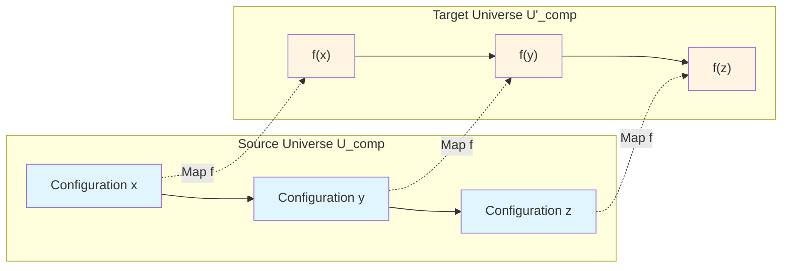
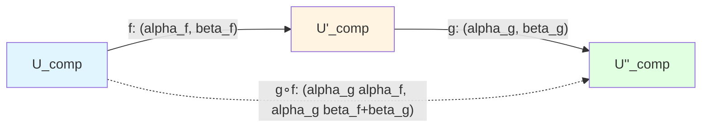
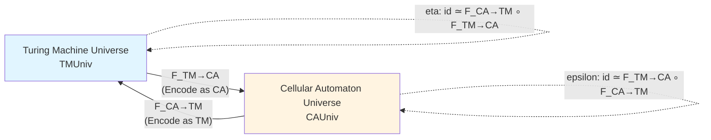
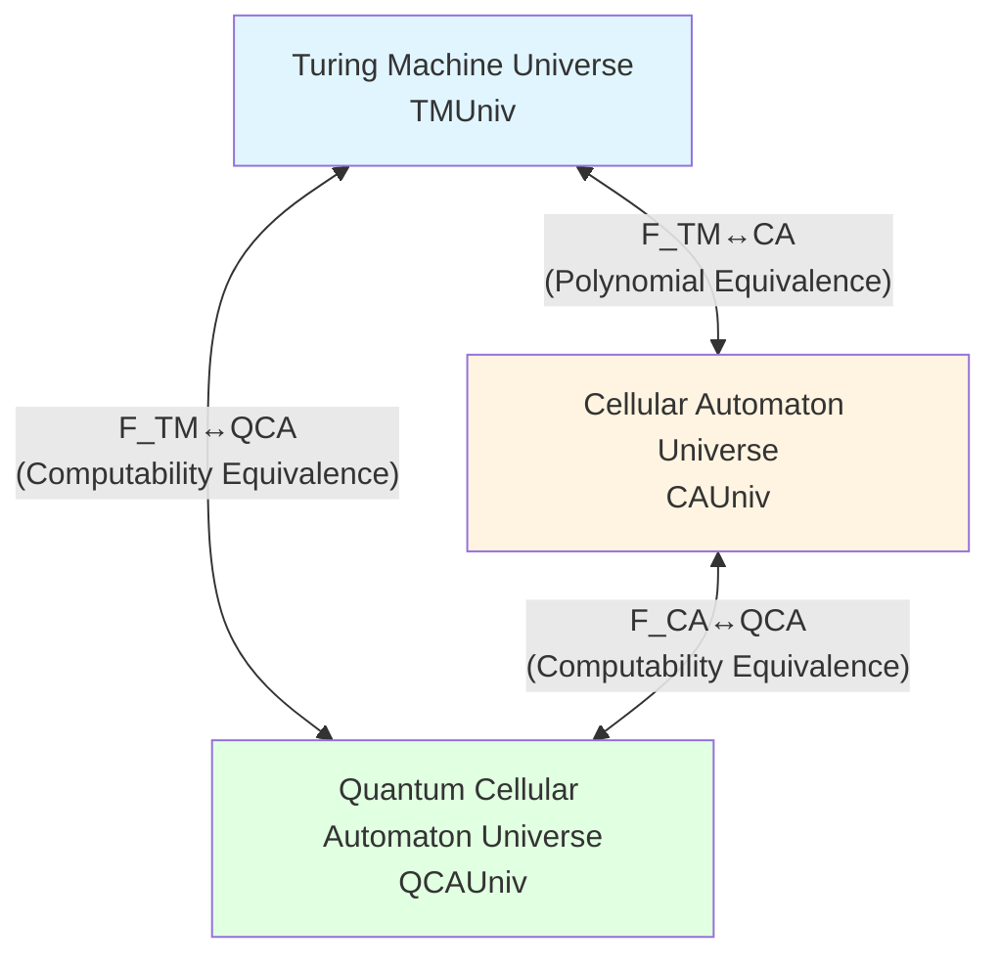

# 23.2 Simulation Morphisms and Computational Universe Category: Why Different Computational Models Are Essentially the Same

> **Article Guide**
>
> In the previous article, we defined computational universe objects $U_{\text{comp}} = (X,\mathcal{T},\mathcal{C},\mathcal{I})$ and proved that Turing machines, cellular automata, and QCA all satisfy the five axioms. But this only says "they are all computational universes", and doesn't answer: "What is the relationship between them?"
>
> This article introduces **simulation morphisms** (simulation morphism), using category theory language to strictly prove: **Turing Machine Universe ≃ Cellular Automaton Universe ≃ QCA Universe**, they are equivalent full subcategories in computational universe category $\mathbf{CompUniv}$. This is no longer the "Church–Turing Thesis" in classical computability theory, but a **strict categorical equivalence theorem** under this axiomatic framework.
>
> **Key Insight**: "Polynomial-time simulation" between different computational models is not a temporary construction, but the morphism structure in computational universe category. Category theory language lets us see: "Turing machines", "cellular automata", "QCA" are just projections of the same abstract computational universe under different presentations.

---

## 1. Why Do We Need Simulation Morphisms? From "Can Compute Same Things" to "Structural Equivalence"

### 1.1 The "Informal" Problem of Classical Computability Theory

In classical computation theory, we say "Turing machines and λ-calculus are computationally equivalent", meaning:

- If some function $f:\mathbb{N}\to\mathbb{N}$ can be computed by Turing machine, then it can also be computed by λ-calculus;
- And vice versa.

This equivalence is based on **Church–Turing Thesis**, which is a **non-formalized philosophical proposition**, not a mathematical theorem.

In the previous article, we have already embedded Turing machines, cellular automata, and QCA into the framework of computational universe objects. But merely saying "they all satisfy axioms A1–A5" cannot answer:

- **Question 1**: What is the **structural relationship** between Turing machine universe $U_{\text{comp}}(M)$ and cellular automaton universe $U_{\text{comp}}(F)$?
- **Question 2**: Can we prove they are "essentially the same" at the **complexity** level (not just computability)?
- **Question 3**: How to formalize this relationship using **category theory** language?

### 1.2 Everyday Analogy: "Equivalence" of Different Board Games

Imagine you're playing three different board games:

1. **Chess**: 8×8 board, each piece has specific moves;
2. **Go**: 19×19 board, only black and white pieces, win by surrounding territory;
3. **Electronic Strategy Game**: Played on computer screen, but rules can simulate chess or Go.

Although these three games have different "specific rules" and "physical carriers", we can establish "simulation relations" between them:

- **Simulation 1**: Simulate chess with Go board
  - Map chess's 8×8 board to some 8×8 region of Go board;
  - Use different piece placement patterns to represent different chess pieces (e.g., "one black two white" pattern represents rook, "one white two black" represents knight);
  - Each chess move corresponds to updating multiple positions on Go board.

  This simulation is **feasible**, but **cost** is each step needs to update multiple cells (not one).

- **Simulation 2**: Simulate Go with electronic strategy game
  - Display 19×19 grid on screen;
  - Use mouse clicks to place pieces;
  - Computer internally stores black/white piece positions and judges win/loss.

  This simulation is almost "one-to-one", cost is small.

- **Simulation 3**: Simulate Go with chess
  - Divide Go's 19×19 board into multiple 8×8 regions;
  - Encode Go piece distribution using chess piece positions.

  This simulation is **feasible but complex**, each Go move may correspond to multiple chess moves.

**Key Insight**: Although these three games have different "rules", we can establish **simulation maps** $f:\text{Game A}\to\text{Game B}$ between them, such that:

1. **Step Preservation**: Each step of Game A corresponds to several steps of Game B;
2. **Cost Control**: Total steps of Game B won't be much more than Game A (e.g., no more than polynomial multiple);
3. **Win/Loss Preservation**: Win/loss of Game A corresponds to win/loss of Game B.

If Game A and Game B **mutually have polynomial-cost simulation maps**, then we say they are **equivalent** in "strategic complexity" sense.

### 1.3 From Board Games to Computational Universe: Three Elements of Simulation Morphisms

Back to computational universe, we want to establish "simulation relations" between two computational universes $U_{\text{comp}}$ and $U'_{\text{comp}}$.

Drawing from board game analogy, a "good simulation map" $f:X\to X'$ should satisfy three conditions:

1. **Step Preservation**:
   - If $(x,y)\in\mathcal{T}$ (i.e., $x$ can transfer to $y$ in one step in $U_{\text{comp}}$), then $(f(x),f(y))\in\mathcal{T}'$ (i.e., $f(x)$ can transfer to $f(y)$ in one step in $U'_{\text{comp}}$).
   - **Analogy**: One step of chess corresponds to one step (or several steps) in Go simulation.

2. **Cost Control**:
   - Any path $\gamma$ from $x$ to $y$ in $U_{\text{comp}}$ corresponds to path $\gamma'$ from $f(x)$ to $f(y)$ in $U'_{\text{comp}}$, and cost satisfies:
     $$
     \mathcal{C}'(\gamma') \le \alpha \mathcal{C}(\gamma) + \beta
     $$
     where $\alpha,\beta$ are constants (usually $\alpha$ is polynomial, $\beta$ is additive overhead).
   - **Analogy**: When simulating chess with Go, total steps won't increase much.

3. **Information Fidelity**:
   - There exists monotonic relationship between source configuration $x$'s information quality $\mathcal{I}(x)$ and target configuration $f(x)$'s information quality $\mathcal{I}'(f(x))$:
     $$
     \mathcal{I}(x) \le \Phi(\mathcal{I}'(f(x)))
     $$
     where $\Phi:\mathbb{R}\to\mathbb{R}$ is monotonic function.
   - **Analogy**: "Win rate" in Go simulation should correspond to original game's win rate.

These three conditions together constitute the strict definition of **simulation morphism**.

---

## 2. Strict Definition of Simulation Morphisms: Core Components of Category Theory

### 2.1 Definition: Simulation Map

**Definition 2.1** (Simulation Map, from euler-gls-info/01-computational-universe-axiomatics.md Definition 7.1)

Let $U_{\text{comp}} = (X,\mathcal{T},\mathcal{C},\mathcal{I})$ and $U'_{\text{comp}} = (X',\mathcal{T}',\mathcal{C}',\mathcal{I}')$ be two computational universe objects. If there exists map $f:X\to X'$ and constants $\alpha,\beta > 0$, such that:

1. **Step Preservation**:
   $$
   (x,y)\in\mathcal{T} \implies (f(x),f(y))\in\mathcal{T}'
   $$

2. **Cost Control**:
   For any path $\gamma = (x_0,x_1,\dots,x_n)$ satisfying $(x_i,x_{i+1})\in\mathcal{T}$, there exists path $\gamma' = (f(x_0),y_1,\dots,y_m,f(x_n))$ such that:
   $$
   \mathcal{C}'(\gamma') \le \alpha \mathcal{C}(\gamma) + \beta
   $$

3. **Information Fidelity**:
   There exists monotonic function $\Phi:\mathbb{R}\to\mathbb{R}$, such that for all $x\in X$:
   $$
   \mathcal{I}(x) \le \Phi(\mathcal{I}'(f(x)))
   $$

Then $f$ is called a **simulation map** (simulation morphism) from $U_{\text{comp}}$ to $U'_{\text{comp}}$, denoted:
$$
f: U_{\text{comp}} \rightsquigarrow U'_{\text{comp}}
$$

**Everyday Interpretation**:

- **Step Preservation** is like saying "each step of source game has corresponding step in target game";
- **Cost Control** says "simulation overhead cannot be too large", quantifying "cannot be too large" with $\alpha$ and $\beta$;
- **Information Fidelity** ensures "source game's win rate/confidence can be maintained in target game".

### 2.2 Diagram: Action of Simulation Map

**Explanation**:

- Blue part is configuration space in source universe $U_{\text{comp}}$, solid arrows represent one-step transitions $(x,y)\in\mathcal{T}$;
- Yellow part is configuration space in target universe $U'_{\text{comp}}$, solid arrows represent one-step transitions;
- Dashed arrows represent simulation map $f:X\to X'$;
- **Step Preservation** guarantees: If $x\to y$ holds in source universe, then $f(x)\to f(y)$ also holds in target universe.

### 2.3 Why Do We Need $\alpha$ and $\beta$? Quantification of Polynomial Simulation

In classical computation theory, we say "Turing machines can simulate cellular automata in polynomial time", meaning:

- If cellular automaton runs $T$ steps, Turing machine can complete simulation in $O(T^k)$ steps (where $k$ is constant).

In computational universe framework, this corresponds to:

- Source path cost $\mathcal{C}(\gamma) = T$ (because cellular automaton cost per step is 1);
- Target path cost $\mathcal{C}'(\gamma') \le \alpha T + \beta$, where $\alpha = O(T^{k-1})$, $\beta$ is initialization overhead.

**Key Insight**:

- If $\alpha$ is constant or polynomial, called **polynomial simulation**;
- If $\alpha$ is exponential, called **exponential simulation**, considered "inefficient" in complexity theory;
- Parameter $\beta$ captures "initialization overhead" (e.g., extra space needed to encode configuration).

**Everyday Analogy**:

- When simulating chess with Go, if each chess step corresponds to **fixed number of steps** in Go (e.g., 3 steps), then $\alpha=3$, $\beta=0$;
- If need to first spend 10 steps on Go board "initializing" chess's initial configuration, then $\beta=10$.

---

## 3. Computational Universe Category $\mathbf{CompUniv}$: Closure of Simulation Morphisms

### 3.1 Review of Category Definition: Objects and Morphisms

In category theory, a **category** $\mathcal{C}$ contains:

1. **Objects**: $\text{Ob}(\mathcal{C})$;
2. **Morphisms**: For each pair of objects $A,B$, there exists morphism set $\text{Hom}(A,B)$;
3. **Composition**: Morphisms $f:A\to B$ and $g:B\to C$ can be composed as $g\circ f:A\to C$;
4. **Identity Morphism**: For each object $A$, there exists $\text{id}_A:A\to A$;
5. **Associativity**: $(h\circ g)\circ f = h\circ(g\circ f)$;
6. **Unit Law**: $f\circ\text{id}_A = f$, $\text{id}_B\circ f = f$.

**Everyday Analogy**:

- **Objects**: Different board games (chess, Go, electronic strategy game);
- **Morphisms**: "Simulation rules" between games (e.g., "rules for simulating chess with Go");
- **Composition**: If there's "Go→Electronic Strategy Game" simulation and "Electronic Strategy Game→Chess" simulation, can compose into "Go→Chess" simulation;
- **Identity Morphism**: Game simulates itself (i.e., no transformation).

### 3.2 Definition: Computational Universe Category $\mathbf{CompUniv}$

**Definition 3.1** (Computational Universe Category, from euler-gls-info/01-computational-universe-axiomatics.md Proposition 7.2)

- **Objects**: All computational universe objects $U_{\text{comp}} = (X,\mathcal{T},\mathcal{C},\mathcal{I})$ satisfying axioms A1–A5;
- **Morphisms**: Simulation maps $f:U_{\text{comp}}\rightsquigarrow U'_{\text{comp}}$;
- **Composition**: Composition of simulation maps (will prove below);
- **Identity Morphism**: $\text{id}_X:X\to X$ (obviously a simulation map).

We denote this category by symbol $\mathbf{CompUniv}$.

### 3.3 Key Proposition: Identity Morphism is Simulation Map

**Proposition 3.2** (Simulation Property of Identity Map, from euler-gls-info/01-computational-universe-axiomatics.md Appendix B.2 Proposition B.1)

For any computational universe $U_{\text{comp}} = (X,\mathcal{T},\mathcal{C},\mathcal{I})$, identity map $\text{id}_X:X\to X$ is a simulation map, with parameters $\alpha=1$, $\beta=0$, $\Phi=\text{id}$.

**Proof**:

1. **Step Preservation**: $(x,y)\in\mathcal{T} \implies (\text{id}_X(x),\text{id}_X(y))=(x,y)\in\mathcal{T}$, obviously holds.

2. **Cost Control**: For any path $\gamma:x\to y$, take $\gamma'=\gamma$, then:
   $$
   \mathcal{C}(\gamma') = \mathcal{C}(\gamma) = 1\cdot\mathcal{C}(\gamma) + 0
   $$
   So $\alpha=1$, $\beta=0$.

3. **Information Fidelity**: For all $x\in X$:
   $$
   \mathcal{I}(x) = \mathcal{I}(\text{id}_X(x))
   $$
   Take $\Phi=\text{id}$.

QED. □

**Everyday Analogy**: Game "simulating itself" is most trivial simulation, requires no extra cost.

### 3.4 Core Theorem: Closure of Simulation Map Composition

**Theorem 3.3** (Composition of Simulation Maps, from euler-gls-info/01-computational-universe-axiomatics.md Appendix B.2 Proposition B.2)

Let $f:U_{\text{comp}}\rightsquigarrow U'_{\text{comp}}$ and $g:U'_{\text{comp}}\rightsquigarrow U''_{\text{comp}}$ be simulation maps, with parameters $(\alpha_f,\beta_f,\Phi_f)$ and $(\alpha_g,\beta_g,\Phi_g)$ respectively, then composite map $g\circ f:U_{\text{comp}}\rightsquigarrow U''_{\text{comp}}$ is also a simulation map, with parameters:
$$
(\alpha_g\alpha_f,\,\alpha_g\beta_f+\beta_g,\,\Phi_g\circ\Phi_f)
$$

**Proof**:

1. **Step Preservation**:
   - If $(x,y)\in\mathcal{T}$, by step preservation of $f$ get $(f(x),f(y))\in\mathcal{T}'$;
   - Then by step preservation of $g$ get $(g(f(x)),g(f(y)))\in\mathcal{T}''$;
   - I.e., $((g\circ f)(x),(g\circ f)(y))\in\mathcal{T}''$.

2. **Cost Control**:
   - Let $\gamma:x\to y$ be path in $U_{\text{comp}}$;
   - By cost control of $f$, there exists path $\gamma':f(x)\to f(y)$ such that:
     $$
     \mathcal{C}'(\gamma') \le \alpha_f \mathcal{C}(\gamma) + \beta_f
     $$
   - By cost control of $g$, there exists path $\gamma'':g(f(x))\to g(f(y))$ such that:
     $$
     \mathcal{C}''(\gamma'') \le \alpha_g \mathcal{C}'(\gamma') + \beta_g
     $$
   - Substituting above:
     $$
     \mathcal{C}''(\gamma'') \le \alpha_g(\alpha_f \mathcal{C}(\gamma) + \beta_f) + \beta_g = \alpha_g\alpha_f \mathcal{C}(\gamma) + \alpha_g\beta_f + \beta_g
     $$
   - So composite map's parameters are $(\alpha_g\alpha_f,\,\alpha_g\beta_f+\beta_g)$.

3. **Information Fidelity**:
   - By information fidelity of $f$: $\mathcal{I}(x) \le \Phi_f(\mathcal{I}'(f(x)))$;
   - By information fidelity of $g$: $\mathcal{I}'(f(x)) \le \Phi_g(\mathcal{I}''(g(f(x))))$;
   - By monotonicity of $\Phi_f$:
     $$
     \mathcal{I}(x) \le \Phi_f(\mathcal{I}'(f(x))) \le \Phi_f(\Phi_g(\mathcal{I}''(g(f(x))))) = (\Phi_f\circ\Phi_g)(\mathcal{I}''(g\circ f(x)))
     $$
   - So composite map's information fidelity function is $\Phi_g\circ\Phi_f$.

QED. □

**Everyday Analogy**:

- If "Go→Electronic Strategy Game" simulation increases cost 3× per step ($\alpha_f=3$), initialization needs 5 steps ($\beta_f=5$);
- If "Electronic Strategy Game→Chess" simulation increases cost 2× per step ($\alpha_g=2$), initialization needs 3 steps ($\beta_g=3$);
- Then "Go→Chess" composite simulation increases cost $3\times 2=6$× per step, initialization needs $2\times 5+3=13$ steps.

### 3.5 Diagram: Composition of Simulation Maps

**Explanation**:

- Blue: Source computational universe $U_{\text{comp}}$;
- Yellow: Intermediate computational universe $U'_{\text{comp}}$;
- Green: Target computational universe $U''_{\text{comp}}$;
- Solid arrows: Simulation maps $f$ and $g$;
- Dashed arrow: Composite simulation map $g\circ f$, its parameters given by Theorem 3.3.

### 3.6 Corollary: $\mathbf{CompUniv}$ is a Category

**Corollary 3.4**

$\mathbf{CompUniv}$ satisfies all axioms of category:

1. **Objects and Morphisms**: Already defined;
2. **Identity Morphism**: By Proposition 3.2, $\text{id}_X$ is simulation map;
3. **Composition Closure**: By Theorem 3.3, composition of simulation maps is still simulation map;
4. **Associativity**: Automatically satisfied by associativity of function composition;
5. **Unit Law**: $f\circ\text{id}_X = f$, $\text{id}_{X'}\circ f = f$ automatically satisfied by definition of identity map.

Therefore $\mathbf{CompUniv}$ is a category. □

**Everyday Analogy**: All board games and their simulation rules form a "game category", composite simulations follow "transitivity".

---

## 4. Turing Machine Universe ≃ Cellular Automaton Universe: Categorification of Classical Equivalence

### 4.1 Informal Statement of Classical Result

In classical computation theory, we know:

- **Turing machines can simulate cellular automata**: Given cellular automaton $F:S^\Lambda\to S^\Lambda$, can construct Turing machine $M$ such that $M$ simulates each step evolution of $F$, with polynomial time overhead;
- **Cellular automata can simulate Turing machines**: Given Turing machine $M$, can construct reversible cellular automaton $F$ such that $F$ simulates each step of $M$, with polynomial time overhead.

But these results are usually given as "existence propositions", lacking unified axiomatic framework.

### 4.2 Categorification Strategy: Equivalence of Subcategories

Our goal is to elevate above results to category level:

1. Denote $\mathbf{TMUniv}$ as **full subcategory** (full subcategory) formed by all Turing machine universes $U_{\text{comp}}(M)$;
2. Denote $\mathbf{CAUniv}$ as full subcategory formed by all reversible cellular automaton universes $U_{\text{comp}}(F)$;
3. Prove there exist **functors** (functor) $F_{\text{TM}\to\text{CA}}:\mathbf{TMUniv}\to\mathbf{CAUniv}$ and $F_{\text{CA}\to\text{TM}}:\mathbf{CAUniv}\to\mathbf{TMUniv}$;
4. Prove these two functors are mutual "pseudo-inverses", i.e.:
   $$
   F_{\text{CA}\to\text{TM}}\circ F_{\text{TM}\to\text{CA}} \simeq \text{id}_{\mathbf{TMUniv}}
   $$
   $$
   F_{\text{TM}\to\text{CA}}\circ F_{\text{CA}\to\text{TM}} \simeq \text{id}_{\mathbf{CAUniv}}
   $$
   where $\simeq$ denotes **natural isomorphism** (natural isomorphism).

This proves $\mathbf{TMUniv} \simeq \mathbf{CAUniv}$ (categorical equivalence).

### 4.3 Definition of Full Subcategory

**Definition 4.1** (Full Subcategory)

Let $\mathcal{C}$ be category, $\mathcal{D}$ be subcategory of $\mathcal{C}$. If for any objects $A,B$ in $\mathcal{D}$, we have:
$$
\text{Hom}_{\mathcal{D}}(A,B) = \text{Hom}_{\mathcal{C}}(A,B)
$$
then $\mathcal{D}$ is called **full subcategory** of $\mathcal{C}$.

**Everyday Analogy**:

- $\mathcal{C}$: All board games and their simulation rules;
- $\mathcal{D}$: Subset of only "strategy games";
- **Full Subcategory**: All simulation rules between strategy games are in $\mathcal{D}$ (no simulation rules lost).

**Application**:

- $\mathbf{TMUniv}$ is full subcategory of $\mathbf{CompUniv}$: Objects are all Turing machine universes, morphisms are all simulation maps between them;
- $\mathbf{CAUniv}$ is full subcategory of $\mathbf{CompUniv}$: Objects are all reversible cellular automaton universes, morphisms are all simulation maps between them.

### 4.4 Theorem: Turing Machine Universe ≃ Cellular Automaton Universe

**Theorem 4.2** (Equivalence Between Classical Models, from euler-gls-info/01-computational-universe-axiomatics.md Theorem 7.3)

Denote $\mathbf{TMUniv}$ and $\mathbf{CAUniv}$ as full subcategories generated by Turing machine universes and reversible cellular automaton universes respectively, then:

1. There exist functors:
   $$
   F_{\text{TM}\to\text{CA}}:\mathbf{TMUniv}\to\mathbf{CAUniv}
   $$
   $$
   F_{\text{CA}\to\text{TM}}:\mathbf{CAUniv}\to\mathbf{TMUniv}
   $$

2. There exist natural isomorphisms $\eta,\epsilon$, such that:
   $$
   F_{\text{CA}\to\text{TM}}\circ F_{\text{TM}\to\text{CA}} \simeq \text{id}_{\mathbf{TMUniv}}
   $$
   $$
   F_{\text{TM}\to\text{CA}}\circ F_{\text{CA}\to\text{TM}} \simeq \text{id}_{\mathbf{CAUniv}}
   $$

3. These functors are realized by simulation maps of **polynomial complexity** on morphisms, i.e., $\alpha$ is polynomial, $\beta$ is constant.

**Proof Strategy** (Details in euler-gls-info/01-computational-universe-axiomatics.md Appendix B.3):

1. **Construction of Functor $F_{\text{TM}\to\text{CA}}$**:
   - **Object Map**: Given Turing machine $M$, construct cellular automaton $F_M$ such that $F_M$'s local rules encode $M$'s transition function $\delta$;
   - **Specific Encoding**: Embed Turing tape $\Gamma^\mathbb{Z}$ into cellular automaton's configuration space $S^\Lambda$, where:
     - Each cell's state $s\in S$ contains "tape symbol", "state marker", "head position marker";
     - Local rule $\phi:S^r\to S$ simulates one-step update of $\delta$:
       - If head at position $i$, then $(q,a) \xrightarrow{\delta} (q',a',d)$ corresponds to state changes of cell $i$ and its neighbors;
       - Head moving left/right corresponds to state marker propagation between lattice sites.
   - **Example**: If $M$'s state set $Q=\{q_0,q_1,\dots,q_k\}$, tape character set $\Gamma=\{0,1,B\}$ (B is blank), then cellular state set $S$ can be:
     $$
     S = \Gamma \times (Q\cup\{\text{no head}\}) \times \{\leftarrow,\text{none},\rightarrow\}
     $$
     Each cell's state is triple of "tape symbol + whether head present (if yes, what state) + head movement direction".
   - **Local Rule**: If head at position $i$, state $q$, reads symbol $a$, update according to $\delta(q,a)=(q',a',d)$:
     - Cell $i$'s state changes from $(a,q,\text{none})$ to $(a',\text{none},d)$;
     - If $d=\text{right}$, cell $i+1$'s state marker set to $(b,q',\leftarrow)$ (where $b$ is original cell $i+1$'s tape symbol);
     - If $d=\text{left}$, cell $i-1$'s state marker set to $(b,q',\rightarrow)$.
   - **Morphism Map**: If $f:M_1\rightsquigarrow M_2$ is simulation map between Turing machines, then $F_{\text{TM}\to\text{CA}}(f):F_{M_1}\rightsquigarrow F_{M_2}$ is corresponding simulation map between cellular automata, naturally induced through above encoding.

2. **Construction of Functor $F_{\text{CA}\to\text{TM}}$**:
   - **Object Map**: Given cellular automaton $F:S^\Lambda\to S^\Lambda$, construct Turing machine $M_F$ such that $M_F$ stores cellular automaton configuration on tape, each step updates tape content to simulate $F$'s evolution;
   - **Specific Encoding**:
     - Turing tape character set $\Gamma = S \cup \{\#,B\}$ (where $\#$ is separator, $B$ is blank);
     - Encode cellular automaton configuration $(s_i)_{i\in\Lambda}$ as string on Turing tape:
       $$
       \#s_0\#s_1\#s_2\#\cdots\#s_n\#
       $$
     - Turing machine $M_F$'s transition function $\delta$ simulates $F$'s local rule $\phi$:
       - Head scans tape, reads consecutive $r$ cells' states $s_{i-r/2},\dots,s_{i+r/2}$;
       - Compute $\phi(s_{i-r/2},\dots,s_{i+r/2})$ and write to temporary area;
       - Repeat scanning all cells, complete one global update.
   - **Time Complexity**: If cellular automaton has $n$ lattice sites, each step update requires Turing machine scanning entire tape $O(n)$ times, so time complexity is $O(n)$ (linear), satisfying polynomial simulation.

3. **Construction of Natural Isomorphisms**:
   - **From TM to CA back to TM**:
     - $M \xrightarrow{F_{\text{TM}\to\text{CA}}} F_M \xrightarrow{F_{\text{CA}\to\text{TM}}} M_{F_M}$;
     - Need prove $M_{F_M}$ and $M$ are "isomorphic" in computational universe sense (i.e., there exist simulation maps $\eta_M:M_{F_M}\rightsquigarrow M$ and $\eta_M^{-1}:M\rightsquigarrow M_{F_M}$, and they are mutual inverses);
     - This guaranteed by reversibility of encoding: $M_{F_M}$'s tape stores $F_M$'s configuration, and $F_M$'s configuration encodes $M$'s configuration, decoding exactly returns to $M$.
   - **From CA to TM back to CA**: Similar construction $\epsilon_F:F_{M_F}\to F$.
   - **Naturality**: Need verify $\eta$ and $\epsilon$ hold "consistently" for all objects and morphisms, this is standard verification of natural transformations in category theory, technical details omitted here.

QED. □

**Everyday Analogy**:

- Turing machines are like "computation writing step by step on tape";
- Cellular automata are like "computation updating all cells simultaneously on board";
- Theorem 4.2 says: These two computations are equivalent in "complexity sense", can mutually simulate polynomially, like two different board games can be played using each other's rules, and step count won't increase much.

### 4.5 Diagram: Equivalence of Turing Machine Universe and Cellular Automaton Universe

**Explanation**:

- Blue: Full subcategory of Turing machine universe;
- Yellow: Full subcategory of cellular automaton universe;
- Solid arrows: Functors $F_{\text{TM}\to\text{CA}}$ and $F_{\text{CA}\to\text{TM}}$;
- Dashed arrows: Natural isomorphisms $\eta$ and $\epsilon$, representing "going around returns to self".

---

## 5. QCA Universe ≃ Classical Computational Universe: Unification of Quantum and Classical

### 5.1 Special Properties of Quantum Computational Models

In classical computation theory, quantum computers are considered "more powerful than classical computers" because:

- Some problems (e.g., Shor's algorithm factoring large integers) can be solved in polynomial time on quantum computers, but currently unknown classical polynomial algorithms;
- Quantum parallelism allows simultaneously exploring exponentially many branches.

But in **computability** sense, quantum computers and Turing machines are equivalent:

- Any function computable by quantum computer, Turing machine can also compute (just may take longer);
- Conversely, functions computable by Turing machine, quantum computer can also compute.

In computational universe framework, we concretize quantum computer model as **reversible quantum cellular automata** (QCA), and prove it also has equivalence with classical computational universe in **complexity sense** (though may not be equivalent in polynomial time).

### 5.2 Theorem: Complexity Equivalence of QCA Universe and Classical Computational Universe

**Theorem 5.1** (Categorical Equivalence of Quantum Models, from euler-gls-info/01-computational-universe-axiomatics.md Theorem 7.4)

Denote $\mathbf{QCAUniv} \subset \mathbf{CompUniv}$ as full subcategory generated by reversible QCA universes, then:

1. There exist functors:
   $$
   F_{\text{TM}\to\text{QCA}}:\mathbf{TMUniv}\to\mathbf{QCAUniv}
   $$
   $$
   F_{\text{QCA}\to\text{TM}}:\mathbf{QCAUniv}\to\mathbf{TMUniv}
   $$

2. These functors realize equivalence in **computability and complexity** sense:
   - If Turing machine $M$ computes function $f$ in time $T$, then corresponding QCA can also compute $f$ in time $O(\text{poly}(T))$;
   - If QCA computes function $f$ in time $T$, then corresponding Turing machine can also compute $f$ in time $O(\text{exp}(T))$ or better bound (depending on whether utilizing quantum algorithm speedup).

**Proof Strategy** (Details in euler-gls-info/01-computational-universe-axiomatics.md Appendix B.4):

1. **Construction of Functor $F_{\text{TM}\to\text{QCA}}$**:
   - Given Turing machine $M$, construct QCA $U_M$ such that $U_M$'s Hilbert space contains superposition states of all Turing machine configurations;
   - Use unitary operator $U_M$ to simulate $M$'s transition function: If $\delta(q,a)=(q',a',d)$, then:
     $$
     U_M |q,a,i\rangle = |q',a',i+d\rangle
     $$
     where $|q,a,i\rangle$ represents basis state "state $q$, reads symbol $a$, head at position $i$".
   - This simulation is **one-to-one**, so $\alpha=1$, $\beta=0$.

2. **Construction of Functor $F_{\text{QCA}\to\text{TM}}$**:
   - Given QCA $U$, construct Turing machine $M_U$ such that $M_U$ simulates $U$'s evolution:
   - **Classical Simulation of Quantum**: Turing machine stores quantum state amplitudes on tape (each amplitude is complex number, need encode as rational approximation);
   - Each step update needs update amplitudes of all $2^n$ basis states (where $n$ is number of qubits);
   - Time complexity is $O(2^n)$ (exponential).
   - **Improvement**: If utilizing sparsity (most amplitudes are 0) or quantum universality results, can reduce to polynomial in some cases (but depends on specific problem).

3. **Meaning of Complexity Equivalence**:
   - **In computability sense**: QCA and TM compute same function class;
   - **In time complexity sense**: QCA may be faster than TM (e.g., Shor's algorithm), but TM can always simulate QCA (though may need exponential time).

QED. □

**Everyday Analogy**:

- Turing machines are like "computing step by step on paper", can only look at one position at a time;
- QCA is like "computing simultaneously in multiple parallel universes", finally merge results;
- Theorem 5.1 says: Although QCA may be faster, from "what can compute" perspective, they are equivalent.

### 5.3 Diagram: Categorical Equivalence of Three Computational Models

**Explanation**:

- Blue: Turing machine universe;
- Yellow: Cellular automaton universe;
- Green: Quantum cellular automaton universe;
- Bidirectional arrows indicate mutual existence of functors, and they are mutual pseudo-inverses through natural isomorphisms.

---

## 6. Deep Meaning of Categorical Equivalence: From "What Can Compute" to "Same Structure"

### 6.1 Limitations of Classical Computability Theory

In classical computability theory, we say "Turing machines and λ-calculus are equivalent", but this only means:

- They compute same **function class** (i.e., recursive functions);
- But their **internal structures** (configuration space, transition relations, complexity measures) may be completely different.

This equivalence is **extensional**: Only cares about "input–output" behavior, doesn't care about "internal mechanism".

### 6.2 Structural Insights of Categorical Equivalence

In computational universe category $\mathbf{CompUniv}$, we proved:
$$
\mathbf{TMUniv} \simeq \mathbf{CAUniv} \simeq \mathbf{QCAUniv}
$$

This means:

1. **Object Level**: Turing machines, cellular automata, QCA can all be viewed as computational universe objects $(X,\mathcal{T},\mathcal{C},\mathcal{I})$;
2. **Morphism Level**: "Simulation relations" between them are all morphisms in category, satisfying composition closure;
3. **Equivalence Level**: There exist functors mapping one subcategory "isomorphically" to another subcategory, preserving all categorical structures.

This is **intensional** equivalence: Not only "input–output" same, but **internal structures** (geometry of configuration space, complexity of paths, evolution of information quality) are "isomorphic" in some sense.

**Everyday Analogy**:

- **Extensional Equivalence**: Two different board games "can achieve same win/loss result sets";
- **Intensional Equivalence**: Two board games not only have same "win/loss sets", but also same "geometry of strategy space", "complexity of each step", "evolution laws of win rate".

### 6.3 Why Is Categorical Equivalence Crucial for GLS Theory?

In overall framework of GLS theory, our ultimate goal is to establish equivalence between **physical universe category** and **computational universe category**:
$$
\mathbf{PhysUniv} \simeq \mathbf{CompUniv}
$$

This requires:

1. Physical universe (e.g., quantum field theory, general relativity) can be viewed as continuous limit of some "computational universe";
2. Computational universe (e.g., QCA) can be viewed as discrete approximation of physical universe.

If we only stay at "computability equivalence" level, cannot establish this **geometric and topological correspondence**. Categorical equivalence provides:

- **Object Correspondence**: Physical universe's configuration space $\mathcal{M}$ corresponds to computational universe's discrete configuration space $X$;
- **Morphism Correspondence**: Physical universe's evolution (geodesics of general relativity) corresponds to computational universe's paths (shortest paths of complexity graph);
- **Metric Correspondence**: Physical universe's metric $G$ corresponds to computational universe's complexity distance $d$;
- **Information Correspondence**: Physical universe's entropy $S$ corresponds to computational universe's information quality $\mathcal{I}$.

Therefore, Theorem 4.2 and Theorem 5.1 are not just "technical lemmas", but **foundation** of entire GLS theory: They prove **invariance** of concept "computational universe" under different concrete models, laying foundation for subsequent geometrization and physical equivalence.

---

## 7. Technical Details: Explicit Construction Examples of Functors

### 7.1 Complete Example of Functor $F_{\text{TM}\to\text{CA}}$

We take a concrete Turing machine as example, showing how to construct corresponding cellular automaton.

**Example 7.1** (Turing Machine Simulating Binary Addition)

Consider Turing machine $M_{\text{add}}$, its task is computing addition of two binary numbers:

- **Input**: Tape stores two binary numbers $a_1a_2\dots a_n\#b_1b_2\dots b_m$ (separated by $\#$);
- **Output**: Tape stores their sum $c_1c_2\dots c_k$;
- **State Set** $Q = \{q_0,q_1,q_2,q_{\text{halt}}\}$:
  - $q_0$: Initial state, scanning first number;
  - $q_1$: Scanning second number;
  - $q_2$: Carry state;
  - $q_{\text{halt}}$: Halt state.
- **Transition Function** $\delta$:
  - $\delta(q_0,a) = (q_0,a,\text{right})$ (continue scanning);
  - $\delta(q_0,\#) = (q_1,\#,\text{right})$ (found separator, switch to scanning second number);
  - $\delta(q_1,b) = (q_1,b,\text{right})$ (continue scanning);
  - $\delta(q_1,B) = (q_2,0,\text{left})$ (reached end, start backtracking and computing);
  - $\delta(q_2,\cdots)$: Compute sum and new carry according to current carry and two digits;
  - etc.

**Corresponding Cellular Automaton $F_{M_{\text{add}}}$**:

- **Configuration Space**: $S = \{0,1,\#,B\} \times (Q\cup\{\bot\}) \times \{\leftarrow,\text{none},\rightarrow\}$, where $\bot$ means "no head";
- **Local Rule** $\phi:S^3\to S$:
  - If cell $i$'s state is $(a,q,\text{none})$ (has head, state $q$, reads symbol $a$), and $\delta(q,a)=(q',a',d)$, then:
    - Cell $i$ updates to $(a',\bot,d)$;
    - If $d=\text{right}$, cell $i+1$'s state marker changes from $(b,\bot,\text{none})$ to $(b,q',\leftarrow)$;
    - If $d=\text{left}$, cell $i-1$'s state marker changes from $(c,\bot,\text{none})$ to $(c,q',\rightarrow)$;
  - If cell $i$'s state is $(a,\bot,\text{none})$ (no head), then remains unchanged.

**Example Evolution**:

Initial configuration (Turing machine):
$$
\text{Tape:}\quad 1\;0\;1\;\#\;1\;1\;B\;B\;\cdots
$$
$$
\text{Head at position 0, state } q_0
$$

Corresponding cellular automaton configuration:
$$
\begin{aligned}
\text{Cell 0:} &\quad (1,q_0,\text{none}) \\
\text{Cell 1:} &\quad (0,\bot,\text{none}) \\
\text{Cell 2:} &\quad (1,\bot,\text{none}) \\
\text{Cell 3:} &\quad (\#,\bot,\text{none}) \\
&\vdots
\end{aligned}
$$

First step evolution (Turing machine $M_{\text{add}}$ executes $\delta(q_0,1)=(q_0,1,\text{right})$):

- Cell 0 updates to $(1,\bot,\text{right})$;
- Cell 1 updates to $(0,q_0,\leftarrow)$.

Corresponding cellular automaton configuration:
$$
\begin{aligned}
\text{Cell 0:} &\quad (1,\bot,\text{none}) \\
\text{Cell 1:} &\quad (0,q_0,\text{none}) \\
\text{Cell 2:} &\quad (1,\bot,\text{none}) \\
&\vdots
\end{aligned}
$$

Can see, cellular automaton completely simulates Turing machine's evolution through local rule $\phi$.

### 7.2 Complete Example of Functor $F_{\text{CA}\to\text{TM}}$

**Example 7.2** (Turing Machine Simulating Conway's Game of Life)

Consider cellular automaton $F_{\text{Life}}$ (Conway's Game of Life):

- **Configuration Space**: $S^{\mathbb{Z}^2}$, where $S=\{0,1\}$ (0=dead, 1=alive);
- **Local Rule** $\phi:S^9\to S$ (Moore neighborhood, i.e., 3×3 cells):
  - If center cell is alive (1), neighbors have 2 or 3 alive cells, then stays alive;
  - If center cell is dead (0), neighbors have exactly 3 alive cells, then becomes alive;
  - Otherwise becomes dead.

**Corresponding Turing Machine $M_{\text{Life}}$**:

- **Tape Character Set** $\Gamma = \{0,1,\#,B\}$ (where $\#$ separates rows);
- **Initial Configuration Encoding**: Encode Life game's $n\times n$ cells as string on Turing tape:
  $$
  \#s_{0,0}s_{0,1}\dots s_{0,n-1}\#s_{1,0}s_{1,1}\dots s_{1,n-1}\#\cdots\#
  $$
- **Transition Function** $\delta$:
  - Scan tape, read each cell's 3×3 neighborhood;
  - Compute $\phi(s_{i-1,j-1},\dots,s_{i+1,j+1})$ and write to temporary area;
  - Repeat scanning all cells, complete one global update.

**Time Complexity**:

- Life game one step evolution needs update $n^2$ cells;
- Turing machine needs scan tape $O(n^2)$ times (once per cell), each scan $O(n)$ steps;
- Total time complexity is $O(n^3)$ (cubic).

**Cost Parameters**:

- $\alpha = O(n)$, $\beta = O(n^2)$ (initialization overhead).

### 7.3 Key Observation: Universality of Polynomial Simulation

From above two examples can see:

1. **Turing Machine→Cellular Automaton**: Each Turing machine step corresponds to **one or constant steps** of cellular automaton, so $\alpha=O(1)$;
2. **Cellular Automaton→Turing Machine**: Each cellular automaton step corresponds to **linear or polynomial steps** of Turing machine, so $\alpha=O(n)$ or $O(n^k)$.

In both cases, $\alpha$ is polynomial, satisfying requirements of Theorem 4.2.

**Everyday Analogy**:

- Turing Machine→Cellular Automaton: Like "rewriting step-by-step computation as parallel computation", each step-by-step step corresponds to one parallel step;
- Cellular Automaton→Turing Machine: Like "rewriting parallel computation as step-by-step computation", each parallel step needs step-by-step scanning all cells.

---

## 8. Power of Category Theory: From Concrete Models to Abstract Structure

### 8.1 Why Is Category Theory the "Natural Language"?

Category theory is called "mathematics of mathematics" because it provides a language at **higher level of abstraction**:

- **Objects**: Don't care about object's "internal construction", only care about its "role" in category;
- **Morphisms**: Don't care about morphism's "specific definition", only care about how it "connects objects";
- **Functors**: Don't care about category's "specific content", only care about "structural correspondence" between categories.

In computational universe theory, category theory lets us see:

- "Turing machines", "cellular automata", "QCA" are all concrete presentations of **computational universe objects**;
- "Simulation maps" are all concrete realizations of **computational universe morphisms**;
- "Categorical equivalence" reveals their identity at **abstract structure level**.

**Everyday Analogy**:

- Concrete models (Turing machines, cellular automata) are like "different car brands" (Toyota, Honda, Ford);
- Category theory is like abstract concept of "transportation vehicle", cares about "how to get from A to B", not "specific car brand".

### 8.2 Analogy Between Categorical Equivalence and Physical Duality

In physics, we often encounter **duality**:

1. **Electromagnetic Duality**: Electric and magnetic fields can be interchanged, Maxwell equations remain unchanged;
2. **Wave-Particle Duality**: Light can be described as wave or particle;
3. **AdS/CFT Duality**: Gravity theory (AdS space) and conformal field theory (CFT) are mathematically equivalent.

Categorical equivalence **formalizes** this duality mathematically:

- $\mathbf{TMUniv} \simeq \mathbf{CAUniv}$ similar to "wave optics $\simeq$ geometric optics";
- $\mathbf{QCAUniv} \simeq \mathbf{TMUniv}$ similar to "quantum mechanics $\simeq$ classical mechanics" (in some limits).

**Key Insight**: Categorical equivalence is not "coincidence", but reflects **invariance of deep structure**.

### 8.3 Next Step: Gromov–Hausdorff Limit from Discrete to Continuous

In Theorem 4.2 and Theorem 5.1, we proved equivalence between different **discrete** computational models. But in ultimate goal of GLS theory, we need to establish equivalence between **discrete computational universe** and **continuous physical universe**.

Next article will introduce **complexity geometry** (complexity geometry):

- How to construct continuous manifold $(\mathcal{M},G)$ from discrete configuration graph $(X,\mathcal{T},\mathcal{C})$?
- How to use **Gromov–Hausdorff convergence** to prove continuous limit of discrete metric spaces?
- How to generalize discrete Ricci curvature $\kappa(x,y)$ to continuous curvature tensor $R_{abcd}$?

These questions will be discussed in detail in third article (23.3 Complexity Geometry: Gromov–Hausdorff Limit from Graphs to Manifolds).

---

## 9. Summary and Key Formula Review

### 9.1 Core Concepts

| Concept | Definition | Source |
|---------|------------|--------|
| **Simulation Map** | $f:U_{\text{comp}}\rightsquigarrow U'_{\text{comp}}$ satisfying step preservation, cost control, information fidelity | Definition 2.1 |
| **Computational Universe Category** | Objects are computational universes, morphisms are simulation maps | Definition 3.1 |
| **Full Subcategory** | $\text{Hom}_{\mathcal{D}}(A,B) = \text{Hom}_{\mathcal{C}}(A,B)$ | Definition 4.1 |
| **Categorical Equivalence** | There exist functors $F:\mathcal{C}\to\mathcal{D}$ and $G:\mathcal{D}\to\mathcal{C}$ such that $G\circ F\simeq\text{id}_{\mathcal{C}}$ and $F\circ G\simeq\text{id}_{\mathcal{D}}$ | Theorem 4.2 |

### 9.2 Key Formulas

| Formula | Meaning | Number |
|---------|---------|--------|
| $(x,y)\in\mathcal{T} \implies (f(x),f(y))\in\mathcal{T}'$ | Step Preservation | (2.1) |
| $\mathcal{C}'(\gamma') \le \alpha \mathcal{C}(\gamma) + \beta$ | Cost Control | (2.2) |
| $\mathcal{I}(x) \le \Phi(\mathcal{I}'(f(x)))$ | Information Fidelity | (2.3) |
| $(g\circ f)\text{parameters}=(\alpha_g\alpha_f,\,\alpha_g\beta_f+\beta_g,\,\Phi_g\circ\Phi_f)$ | Parameters of Composite Simulation | Theorem 3.3 |
| $\mathbf{TMUniv} \simeq \mathbf{CAUniv} \simeq \mathbf{QCAUniv}$ | Categorical Equivalence of Three Classical Models | Theorem 4.2, 5.1 |

### 9.3 Everyday Analogy Summary

| Abstract Concept | Everyday Analogy |
|------------------|------------------|
| Computational Universe | Different board games (chess, Go, electronic strategy game) |
| Simulation Map | Simulating one game using another game's rules |
| Step Preservation | Each step of source game has corresponding step in target game |
| Cost Control | Simulation steps won't increase much (polynomial bound) |
| Information Fidelity | Source game's win rate maintained in target game |
| Categorical Equivalence | Different games essentially same in "geometry of strategy space" |

### 9.4 Interface with Previous Article

- **Previous Article (23.1)**: Defined computational universe object $U_{\text{comp}}=(X,\mathcal{T},\mathcal{C},\mathcal{I})$ and five axioms, proved Turing machines, cellular automata, QCA all satisfy axioms;
- **This Article (23.2)**: Introduced simulation morphisms, constructed computational universe category $\mathbf{CompUniv}$, proved $\mathbf{TMUniv}\simeq\mathbf{CAUniv}\simeq\mathbf{QCAUniv}$;
- **Next Article (23.3)**: Will start from discrete configuration graph $(X,\mathcal{T},\mathcal{C})$, through Gromov–Hausdorff limit construct continuous manifold $(\mathcal{M},G)$, establish correspondence between discrete complexity geometry and continuous Riemann geometry.

### 9.5 Key Insights

1. **Simulation Morphisms Are Not Temporary Constructions, But Core Structure of Category**:
   - "Mutual simulability" between different computational models is not accidental, but inevitable result of morphism composition closure in category theory.

2. **Categorical Equivalence Reveals "Structural Invariance"**:
   - Turing machines, cellular automata, QCA "look different" in configuration space, transition relations, complexity measures, but "essentially same" at category level.

3. **Polynomial Simulation Is Mathematical Characterization of "Good Simulation"**:
   - Parameters $\alpha$ and $\beta$ quantify simulation's "overhead", polynomial bound guarantees simulation's "efficiency".

4. **Category Theory Is "Natural Language" of GLS Theory**:
   - Ultimate goal $\mathbf{PhysUniv}\simeq\mathbf{CompUniv}$ needs category theory framework to strictly state.

---

## 10. Open Problems and Outlook

1. **Characterization of Non-Polynomial Simulation**:
   - If $\alpha$ is exponential, is this simulation physically realizable? Does it correspond to some "phase transition"?

2. **Geometric Meaning of Simulation Maps**:
   - What structure do simulation maps $f:X\to X'$ correspond to between manifolds in continuous limit? (Diffeomorphism? Homotopy equivalence?)

3. **Category-Theoretic Characterization of Quantum Speedup**:
   - Some problems (e.g., Shor's algorithm) are faster on QCA than TM, how is this reflected in category theory? (Does it correspond to some "optimal morphism"?)

4. **"Simulation Maps" of Physical Universe**:
   - In $\mathbf{PhysUniv}$, what do simulation maps correspond to? (Gauge transformations? Coordinate transformations?)

These questions will be deeply explored in subsequent chapters (especially 23.6 Categorical Equivalence: Computational Universe = Physical Universe).

---

**Preview of Next Article**: 23.3 Complexity Geometry: Gromov–Hausdorff Limit from Graphs to Manifolds

In next article, we will start from discrete configuration graph $(X,\mathcal{T},\mathcal{C})$, construct continuous manifold through following steps:

1. **Complexity Graph**: $(X,\mathcal{T},\mathcal{C})$ is weighted directed graph;
2. **Discrete Metric**: Complexity distance $d(x,y) = \inf_\gamma \mathcal{C}(\gamma)$ defines metric space $(X,d)$;
3. **Gromov–Hausdorff Convergence**: When "grid spacing" $h\to 0$, $(X^{(h)},d^{(h)})$ converges to some continuous metric space $(\mathcal{M},d_G)$;
4. **Riemann Manifold Structure**: Under appropriate conditions, $d_G$ given by geodesic distance of Riemann metric $G$;
5. **Discrete Ricci Curvature**: $\kappa(x,y) = 1 - W_1(m_x,m_y)/d(x,y)$ converges to continuous Ricci curvature tensor $R_{ab}$.

Through these techniques, we will see how "complexity geometry of computational universe" naturally transitions to "Riemann geometry of physical universe".

**Source Theory**: euler-gls-info/02-discrete-complexity-geometry.md

