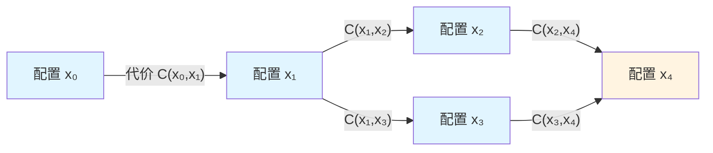
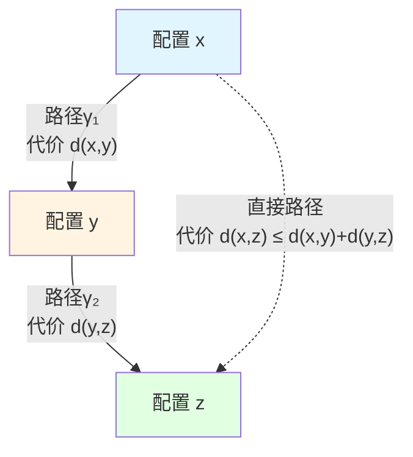
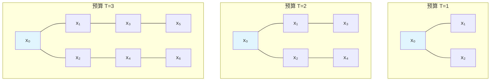
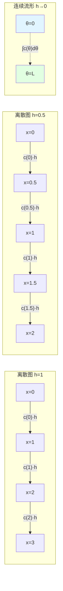

# 23.3 从步数到距离:复杂性图与度量

> **本篇导读**
>
> 在前两篇中,我们定义了计算宇宙对象 $U_{\text{comp}} = (X,\mathcal{T},\mathcal{C},\mathcal{I})$ 并证明了不同计算模型(图灵机、元胞自动机、QCA)在范畴意义上等价。但这只是"计算宇宙的代数结构",还没有触及"计算宇宙的几何结构"。
>
> 本篇将计算宇宙"几何化":从离散的配置空间和转移关系出发,构造**复杂性图** $G_{\text{comp}} = (X,E,w)$,并定义**复杂性距离** $d(x,y) = \inf_\gamma \mathcal{C}(\gamma)$。我们证明 $d$ 是一个**广义度量**,并用它定义**复杂性球** $B_T(x_0)$ 和**体积函数** $V_{x_0}(T)$。
>
> **关键洞察**:复杂性不再只是"步数"或"时间",而是配置空间上的**内禀几何距离**。这个距离反映了"从一个配置到另一个配置的最优路径代价",为后续引入曲率、测地线、流形极限奠定基础。

---

## 1. 为什么需要"几何化"计算?从步数到距离的哲学转变

### 1.1 传统复杂性理论的"时间中心论"

在经典计算复杂性理论中,我们用**时间复杂度**(time complexity)来衡量算法的"好坏":

- 若算法 $A$ 在输入大小为 $n$ 时需要 $T(n)$ 步,则称其时间复杂度为 $O(T(n))$;
- 若 $T(n) = n^k$(多项式),则称 $A$ 是"高效"的;
- 若 $T(n) = 2^n$(指数),则称 $A$ 是"低效"的。

但这种描述方式有一个**本质局限**:它将"时间"视为**外部参数**,仿佛存在一个"绝对时钟"在滴答作响,而算法只是在这个时钟的刻度上前进。

**问题**:

1. 在物理宇宙中,不存在"绝对时钟"——时间本身是相对的(广义相对论);
2. 不同计算路径的"步数"可能相同,但"代价"不同(例如量子计算中不同演化路径的能量消耗);
3. 无法刻画"配置空间的几何结构"——例如两个配置之间的"距离"是什么?

### 1.2 日常类比:从"步数"到"距离"的转变

想象你在一个复杂的迷宫中寻找出口:

- **步数视角**:你走了100步到达出口,朋友走了150步到达出口,所以你更"高效";
- **距离视角**:你走的路径总长度是100米,朋友走的路径总长度是90米(虽然步数更多,但每步更短),所以朋友的路径更"优"。

**关键区别**:

- **步数**是离散的、依赖于"走法"的(大步走还是小步走?);
- **距离**是连续的、内禀的(与"怎么走"无关,只与"起点和终点"有关)。

在复杂性几何中,我们用**复杂性距离** $d(x,y)$ 取代"步数",使得:

- $d(x,y)$ 是配置空间上的**内禀度量**,不依赖于具体的路径选择;
- $d(x,y)$ 的定义是"所有路径中代价最小的那条路径的代价";
- 这为后续引入"曲率""测地线""流形"等几何概念奠定基础。

### 1.3 从计算宇宙到复杂性图:加权有向图的自然呈现

在计算宇宙 $U_{\text{comp}} = (X,\mathcal{T},\mathcal{C},\mathcal{I})$ 中:

- $X$ 是配置集合(例如图灵机的所有可能配置);
- $\mathcal{T} \subset X\times X$ 是一步转移关系(哪些配置可以一步转移到哪些配置);
- $\mathcal{C}:X\times X\to[0,\infty]$ 是单步代价(每步转移的"花费")。

这天然对应一个**加权有向图**:

- **顶点**:$X$ 中的每个配置是一个顶点;
- **边**:$(x,y)\in\mathcal{T}$ 对应从顶点 $x$ 到顶点 $y$ 的有向边;
- **边权**:边 $(x,y)$ 的权重是 $\mathcal{C}(x,y)$(这条边的"代价")。

我们称这个图为**复杂性图** $G_{\text{comp}} = (X,E,w)$,其中 $E=\mathcal{T}$,$w(x,y)=\mathcal{C}(x,y)$。

**日常类比**:

- 复杂性图就像一个"交通网络":
  - 顶点是城市;
  - 边是道路;
  - 边权是道路的"通行时间"或"过路费"。
- 复杂性距离 $d(x,y)$ 就是"从城市 $x$ 到城市 $y$ 的最短路径长度"。

---

## 2. 复杂性图的严格定义:顶点、边、权

### 2.1 定义:复杂性图

**定义 2.1**(复杂性图,源自 euler-gls-info/02-discrete-complexity-geometry.md 定义2.2)

给定计算宇宙 $U_{\text{comp}} = (X,\mathcal{T},\mathcal{C},\mathcal{I})$,其**复杂性图**是加权有向图 $G_{\text{comp}} = (X,E,w)$,其中:

1. **顶点集** $X$:所有配置;
2. **有向边集** $E = \mathcal{T}$:所有一步转移关系;
3. **边权函数** $w:E\to(0,\infty]$:定义为 $w(x,y) = \mathcal{C}(x,y)$(若 $(x,y)\in E$)。

若需要无向图结构(例如在对称/可逆的情况下),可定义**对称边集**:
$$
E_{\text{sym}} = \{ \{x,y\} : (x,y)\in E \text{ 或 } (y,x)\in E \}
$$
边权:
$$
w_{\text{sym}}(\{x,y\}) = \min\{ \mathcal{C}(x,y), \mathcal{C}(y,x) \}
$$

**说明**:

- 有向图适用于一般计算宇宙(可能不可逆);
- 无向图适用于可逆计算宇宙(例如可逆图灵机、可逆元胞自动机、QCA)。

### 2.2 图示:复杂性图的结构

**说明**:

- 蓝色顶点:源配置 $x_0$ 及其一步可达的配置;
- 黄色顶点:目标配置 $x_4$;
- 有向边表示一步转移,边上标注代价 $\mathcal{C}(x,y)$;
- 从 $x_0$ 到 $x_4$ 有两条路径:
  - 路径1:$x_0 \to x_1 \to x_2 \to x_4$,总代价 $\mathcal{C}(x_0,x_1) + \mathcal{C}(x_1,x_2) + \mathcal{C}(x_2,x_4)$;
  - 路径2:$x_0 \to x_1 \to x_3 \to x_4$,总代价 $\mathcal{C}(x_0,x_1) + \mathcal{C}(x_1,x_3) + \mathcal{C}(x_3,x_4)$。

**复杂性距离** $d(x_0,x_4)$ 是这两条路径(以及所有其他可能路径)中总代价最小的那个。

### 2.3 日常类比:交通网络中的最短路径

复杂性图 $G_{\text{comp}}$ 就像一个**交通网络**:

- **顶点**:城市;
- **边**:道路;
- **边权**:通行时间(或过路费、或油费)。

**问题**:从城市A到城市B的"最快路径"是什么?

- **传统思路**:只看"经过几个城市"(步数),选择经过城市最少的路径;
- **复杂性几何思路**:看"总通行时间"(代价),选择总通行时间最短的路径(即使经过更多城市)。

**示例**:

- 路径1:A → C → B,经过2条道路,总时间3小时;
- 路径2:A → D → E → B,经过3条道路,总时间2小时。

传统思路选路径1(步数少),复杂性几何选路径2(代价小)。

---

## 3. 复杂性距离的定义:路径代价的下确界

### 3.1 定义:路径代价与复杂性距离

**定义 3.1**(路径代价,源自 euler-gls-info/02-discrete-complexity-geometry.md 第2.1节)

对任意有限路径 $\gamma = (x_0,x_1,\dots,x_n)$ 满足 $(x_k,x_{k+1})\in\mathcal{T}$(每一步都是合法转移),定义路径代价为:
$$
\mathcal{C}(\gamma) = \sum_{k=0}^{n-1} \mathcal{C}(x_k,x_{k+1})
$$

**定义 3.2**(复杂性距离,源自 euler-gls-info/02-discrete-complexity-geometry.md 定义2.1)

对任意两个配置 $x,y\in X$,定义它们之间的**复杂性距离**为:
$$
d(x,y) = \inf_{\gamma:x\to y} \mathcal{C}(\gamma)
$$
其中 $\gamma$ 遍历所有从 $x$ 到 $y$ 的有限路径。

若不存在从 $x$ 到 $y$ 的有限路径,则约定 $d(x,y) = \infty$。

**说明**:

- $d(x,y)$ 是"所有可能路径中代价最小的那条路径的代价";
- 下确界(infimum)意味着:可能不存在一条路径恰好达到 $d(x,y)$,但总能找到路径使代价任意接近 $d(x,y)$;
- 在有限图中,下确界总是可达的(即存在最优路径),此时 $\inf$ 可改写为 $\min$。

**日常类比**:

- $d(x,y)$ 就是"从城市 $x$ 到城市 $y$ 的最短路径长度";
- 在交通网络中,GPS导航算法(如Dijkstra算法)就是在计算 $d(x,y)$。

### 3.2 示例:图灵机的复杂性距离

**例3.3**(图灵机的复杂性距离)

考虑图灵机 $M$ 的计算宇宙 $U_{\text{comp}}(M)$:

- 配置 $x = (q,\text{带内容},\text{读头位置})$;
- 一步转移 $(x,y)\in\mathcal{T}_M$ 对应 $M$ 的转移函数 $\delta$ 的一次执行;
- 单步代价 $\mathcal{C}_M(x,y) = 1$(每步花费单位时间)。

**路径示例**:

- 初始配置 $x_0 = (q_0, \text{"101"}, 0)$(状态 $q_0$,带上是"101",读头在位置0);
- 目标配置 $x_n = (q_{\text{halt}}, \text{"110"}, 2)$(停机状态,带上是"110",读头在位置2)。

若从 $x_0$ 到 $x_n$ 需要执行17步,则:
$$
d(x_0,x_n) = 17
$$

**观察**:

- 在这个例子中,$d(x_0,x_n)$ 恰好等于"时间复杂度"(因为每步代价都是1);
- 但在一般情况下(例如量子计算,不同门的代价不同),$d(x_0,x_n)$ 与"步数"不同。

### 3.3 示例:元胞自动机的复杂性距离

**例3.4**(生命游戏的复杂性距离)

考虑Conway生命游戏的计算宇宙 $U_{\text{comp}}(\text{Life})$:

- 配置 $x = (s_{i,j})_{(i,j)\in\mathbb{Z}^2}$,其中 $s_{i,j}\in\{0,1\}$(0=死,1=活);
- 一步转移 $(x,y)\in\mathcal{T}_{\text{Life}}$ 对应生命游戏的全局更新规则;
- 单步代价 $\mathcal{C}_{\text{Life}}(x,y) = 1$。

**问题**:从配置 $x_0$(只有一个活细胞)到配置 $x_n$(10×10区域全部活细胞)需要多少步?

若最优演化需要23步,则:
$$
d(x_0,x_n) = 23
$$

**观察**:

- 生命游戏是**不可逆**的(无法从 $x_n$ 回到 $x_0$),所以 $d(x_n,x_0) = \infty$(没有反向路径);
- 这说明复杂性距离 $d$ 在一般情况下**不对称**。

---

## 4. 复杂性距离的度量性质:三角不等式与对称性

### 4.1 定理:复杂性距离是广义度量

**定理 4.1**(复杂性距离的度量性质,源自 euler-gls-info/02-discrete-complexity-geometry.md 命题2.4)

定义可达子集:
$$
X_{\text{fin}} = \{ x\in X : d(x_0,x) < \infty \}
$$
其中 $x_0\in X$ 为选定的参考配置(例如初始配置)。

在 $X_{\text{fin}}$ 上,复杂性距离 $d$ 满足:

1. **非负性与正定性**:
   $$
   d(x,x) = 0, \quad d(x,y) \ge 0, \quad d(x,y) = 0 \implies x = y
   $$

2. **三角不等式**:
   $$
   d(x,z) \le d(x,y) + d(y,z)
   $$

3. **对称性(条件)**:
   若 $\mathcal{T}$ 在 $X_{\text{fin}}$ 上是双射(即可逆),且代价满足 $\mathcal{C}(x,y) = \mathcal{C}(y,x)$,则:
   $$
   d(x,y) = d(y,x)
   $$

**证明**(源自 euler-gls-info/02-discrete-complexity-geometry.md 附录A.1):

1. **非负性与正定性**:
   - $d(x,x) = 0$:取零长度路径 $\gamma = (x)$,约定 $\mathcal{C}(\gamma) = 0$,故 $d(x,x) \le 0$;另一方面,公理A4(代价正性)保证任意非平凡路径代价为正,故 $d(x,x) = 0$。
   - $d(x,y) \ge 0$:由定义,路径代价非负,故下确界非负。
   - $d(x,y) = 0 \implies x = y$:若 $d(x,y) = 0$,则存在路径 $\gamma:x\to y$ 使 $\mathcal{C}(\gamma)$ 任意小;由于每步代价有正下界(公理A4),这只能发生在 $\gamma$ 长度为0时,即 $x=y$。

2. **三角不等式**:
   - 设 $\varepsilon > 0$;
   - 由 $d(x,y)$ 的定义,存在路径 $\gamma_1:x\to y$ 使得 $\mathcal{C}(\gamma_1) \le d(x,y) + \varepsilon/2$;
   - 由 $d(y,z)$ 的定义,存在路径 $\gamma_2:y\to z$ 使得 $\mathcal{C}(\gamma_2) \le d(y,z) + \varepsilon/2$;
   - 连接路径 $\gamma = \gamma_1 \cdot \gamma_2:x\to z$,其代价为:
     $$
     \mathcal{C}(\gamma) = \mathcal{C}(\gamma_1) + \mathcal{C}(\gamma_2) \le d(x,y) + d(y,z) + \varepsilon
     $$
   - 由 $d(x,z)$ 的定义,$d(x,z) \le \mathcal{C}(\gamma) \le d(x,y) + d(y,z) + \varepsilon$;
   - 令 $\varepsilon\to 0$ 得 $d(x,z) \le d(x,y) + d(y,z)$。

3. **对称性**:
   - 若 $\mathcal{T}$ 可逆,则对任意路径 $\gamma:x\to y$,存在反向路径 $\gamma^{-1}:y\to x$;
   - 若代价对称($\mathcal{C}(x,y) = \mathcal{C}(y,x)$),则 $\mathcal{C}(\gamma^{-1}) = \mathcal{C}(\gamma)$;
   - 故 $d(y,x) = \inf_{\gamma:y\to x} \mathcal{C}(\gamma) = \inf_{\gamma:x\to y} \mathcal{C}(\gamma^{-1}) = \inf_{\gamma:x\to y} \mathcal{C}(\gamma) = d(x,y)$。

证毕。□

**日常类比**:

- **非负性**:从A城到B城的距离不可能是负数;
- **正定性**:只有起点和终点相同时,距离才为0;
- **三角不等式**:绕道不会更近(从A到C,经过B至多和直接走一样远);
- **对称性**:若道路双向通行且往返代价相同,则从A到B的距离等于从B到A的距离。

### 4.2 图示:三角不等式的几何意义

**说明**:

- 实线箭头:先从 $x$ 到 $y$(代价 $d(x,y)$),再从 $y$ 到 $z$(代价 $d(y,z)$),总代价 $d(x,y) + d(y,z)$;
- 虚线箭头:直接从 $x$ 到 $z$(代价 $d(x,z)$);
- **三角不等式**说:直接走不会比绕道更远,即 $d(x,z) \le d(x,y) + d(y,z)$。

---

## 5. 复杂性球与体积函数:可达域的几何刻画

### 5.1 定义:复杂性球

**定义 5.1**(复杂性球,源自 euler-gls-info/02-discrete-complexity-geometry.md 定义2.5)

对给定起点 $x_0\in X_{\text{fin}}$ 和资源预算 $T > 0$,定义**复杂性球**(complexity ball)为:
$$
B_T(x_0) = \{ x\in X_{\text{fin}} : d(x_0,x) \le T \}
$$

**说明**:

- $B_T(x_0)$ 是"从 $x_0$ 出发,在代价预算 $T$ 内能到达的所有配置的集合";
- 在连续空间中,$B_T(x_0)$ 对应"半径为 $T$ 的球";
- 在离散配置空间中,$B_T(x_0)$ 是有限点集(若图是局域有限的)。

**日常类比**:

- 复杂性球就像"能量球":
  - 你有 $T$ 点能量;
  - 每走一步消耗一定能量(边权 $\mathcal{C}(x,y)$);
  - 复杂性球 $B_T(x_0)$ 是"在能量用完之前能到达的所有地点"。

### 5.2 定义:体积函数

**定义 5.2**(体积函数,源自 euler-gls-info/02-discrete-complexity-geometry.md 定义2.5)

复杂性球 $B_T(x_0)$ 的**体积**(以点计数)定义为:
$$
V_{x_0}(T) = |B_T(x_0)| \in \mathbb{N} \cup \{\infty\}
$$

**说明**:

- $V_{x_0}(T)$ 是"在代价预算 $T$ 内能到达的配置数量";
- $V_{x_0}(T)$ 随 $T$ 单调非减:$T_1 < T_2 \implies V_{x_0}(T_1) \le V_{x_0}(T_2)$;
- $V_{x_0}(T)$ 的增长速度反映了"配置空间的复杂性":
  - 若 $V_{x_0}(T) \sim T^d$(多项式增长),则称复杂性维数为 $d$;
  - 若 $V_{x_0}(T) \sim 2^T$(指数增长),则称复杂性维数为 $\infty$。

**日常类比**:

- $V_{x_0}(T)$ 就像"探索范围":
  - 你有 $T$ 小时时间;
  - 体积函数 $V_{x_0}(T)$ 是"在 $T$ 小时内能探索到的城市数量";
  - 若交通网络是"树状"的(无环),则 $V_{x_0}(T) \sim 2^T$(指数增长);
  - 若交通网络是"格子状"的(二维平面),则 $V_{x_0}(T) \sim T^2$(平方增长)。

### 5.3 命题:体积函数的单调性与次可加性

**命题 5.3**(体积函数的性质,源自 euler-gls-info/02-discrete-complexity-geometry.md 命题2.6)

1. **单调性**:对任意 $T_1 < T_2$,有:
   $$
   B_{T_1}(x_0) \subseteq B_{T_2}(x_0), \quad V_{x_0}(T_1) \le V_{x_0}(T_2)
   $$

2. **次可加性**:若存在常数 $C > 0$ 使得对所有 $T_1,T_2 > 0$ 有:
   $$
   V_{x_0}(T_1+T_2) \le C\,V_{x_0}(T_1)\,V_{x_0}(T_2)
   $$
   则 $\log V_{x_0}(T)$ 为次可加函数。

**证明**:

1. **单调性**:显然,若 $x\in B_{T_1}(x_0)$,则 $d(x_0,x) \le T_1 < T_2$,故 $x\in B_{T_2}(x_0)$。

2. **次可加性**:
   - 对任意 $x\in B_{T_1+T_2}(x_0)$,存在路径 $\gamma:x_0\to x$ 使 $\mathcal{C}(\gamma) \le T_1+T_2$;
   - 在路径 $\gamma$ 上选择一点 $y$,使得从 $x_0$ 到 $y$ 的代价 $\le T_1$,从 $y$ 到 $x$ 的代价 $\le T_2$;
   - 这样的 $y$ 至多有 $V_{x_0}(T_1)$ 种选择,而对每个 $y$,$x$ 至多有 $V_y(T_2) \le C\,V_{x_0}(T_2)$ 种选择(在局域有限假设下);
   - 故 $V_{x_0}(T_1+T_2) \le V_{x_0}(T_1) \cdot C\,V_{x_0}(T_2)$。

证毕。□

**日常类比**:

- **单调性**:预算越多,能到达的地方越多;
- **次可加性**:若先花 $T_1$ 时间到达中间城市,再花 $T_2$ 时间继续前进,总共能到达的城市数量不超过"前半段能到达的城市数"乘以"后半段能到达的城市数"。

### 5.4 图示:复杂性球随预算增长

**说明**:

- 蓝色顶点:起点 $x_0$;
- 随着预算 $T$ 增加,复杂性球 $B_T(x_0)$ 包含的顶点数量增加;
- 在树状图中,$V_{x_0}(T) \sim 2^T$(每步分裂成2个分支);
- 在格子图中,$V_{x_0}(T) \sim T^d$(其中 $d$ 是格子的维数)。

---

## 6. 复杂性维数:从体积增长到几何维数

### 6.1 定义:复杂性维数

**定义 6.1**(复杂性维数,源自 euler-gls-info/02-discrete-complexity-geometry.md 定义3.1)

对给定起点 $x_0\in X_{\text{fin}}$,定义**上复杂性维数**为:
$$
\overline{\dim}_{\text{comp}}(x_0) = \limsup_{T\to\infty} \frac{\log V_{x_0}(T)}{\log T}
$$

**下复杂性维数**为:
$$
\underline{\dim}_{\text{comp}}(x_0) = \liminf_{T\to\infty} \frac{\log V_{x_0}(T)}{\log T}
$$

若二者相等,则称其共同值为**复杂性维数**,记为 $\dim_{\text{comp}}(x_0)$。

**直观理解**:

- 若 $V_{x_0}(T) \sim T^d$(多项式增长),则 $\dim_{\text{comp}}(x_0) = d$;
- 若 $V_{x_0}(T) \sim 2^T$(指数增长),则 $\dim_{\text{comp}}(x_0) = \infty$;
- 若 $V_{x_0}(T) \sim \log T$(对数增长),则 $\dim_{\text{comp}}(x_0) = 0$。

**日常类比**:

- **一维道路**:$V_{x_0}(T) \sim T$(沿直线前进,能到达的点数与时间成正比),$\dim_{\text{comp}} = 1$;
- **二维平面**:$V_{x_0}(T) \sim T^2$(在平面上前进,能到达的点数与时间平方成正比),$\dim_{\text{comp}} = 2$;
- **三维空间**:$V_{x_0}(T) \sim T^3$(在空间中前进,能到达的点数与时间立方成正比),$\dim_{\text{comp}} = 3$;
- **分形树**:$V_{x_0}(T) \sim 2^T$(每步分裂成2个分支,指数增长),$\dim_{\text{comp}} = \infty$。

### 6.2 定理:有界度图的多项式增长

**定理 6.2**(有界度情形的多项式增长,源自 euler-gls-info/02-discrete-complexity-geometry.md 命题3.2)

假设复杂性图的无向对称版 $(X_{\text{fin}},E_{\text{sym}})$ 度有界,即存在 $D > 0$ 使对所有 $x\in X_{\text{fin}}$ 有 $\deg(x) \le D$。若此外单步代价有界,即存在常数 $0 < c_{\min} \le c_{\max} < \infty$ 使得对所有边 $\{x,y\}\in E_{\text{sym}}$ 有:
$$
c_{\min} \le w_{\text{sym}}(\{x,y\}) \le c_{\max}
$$

则存在常数 $C_1,C_2 > 0$ 与整数 $d_* \ge 0$,使得对足够大的 $T$ 有:
$$
C_1 T^{d_*} \le V_{x_0}(T) \le C_2 T^{d_*}
$$

特别地,$\dim_{\text{comp}}(x_0) = d_*$。

**证明思路**(源自 euler-gls-info/02-discrete-complexity-geometry.md 附录A.3):

1. 由于度有界,从任意顶点出发,最多有 $D$ 个邻居;
2. 由于代价有界,走 $k$ 步的最小代价是 $k\cdot c_{\min}$,最大代价是 $k\cdot c_{\max}$;
3. 因此,代价预算 $T$ 对应的步数范围是 $[T/c_{\max}, T/c_{\min}]$;
4. 走 $k$ 步能到达的顶点数至多是 $D^k$(度有界),至少是 $1$(起点);
5. 故 $V_{x_0}(T) \le D^{T/c_{\min}}$,$V_{x_0}(T) \ge 1$;
6. 取对数得 $\log V_{x_0}(T) / \log T \le (\log D) / (c_{\min} \log T) + O(1)$;
7. 在局域有限假设下,可以证明存在 $d_*$ 使得 $V_{x_0}(T) \sim T^{d_*}$。

证毕。□

**日常类比**:

- 若交通网络中每个城市最多连接 $D$ 条道路(度有界),且每条道路通行时间在 $[c_{\min},c_{\max}]$ 之间(代价有界),则在时间 $T$ 内能到达的城市数量是多项式增长的。

### 6.3 定理:指数增长与超多项式复杂性

**定理 6.3**(指数增长,源自 euler-gls-info/02-discrete-complexity-geometry.md 命题3.3)

若存在常数 $\lambda > 1$ 与 $T_0 > 0$,使得对所有 $n\in\mathbb{N}$ 有:
$$
V_{x_0}(nT_0) \ge \lambda^n
$$

则 $\overline{\dim}_{\text{comp}}(x_0) = \infty$。

换言之,复杂性球体积指数增长则复杂性维数无限大。

**证明**:

$$
\frac{\log V_{x_0}(nT_0)}{\log(nT_0)} \ge \frac{\log \lambda^n}{\log(nT_0)} = \frac{n\log\lambda}{\log(nT_0)} \to \infty \quad (n\to\infty)
$$

证毕。□

**日常类比**:

- 若交通网络是"树状"的(每个城市都分裂成多个分支),则在时间 $T$ 内能到达的城市数量是指数增长的,对应"复杂性爆炸"。

---

## 7. 复杂性距离与计算复杂性类的对应

### 7.1 多项式时间 ↔ 多项式维数

在经典复杂性理论中,我们说一个问题在**多项式时间**内可解,意思是:

- 存在算法 $A$ 使得对输入大小 $n$,时间复杂度 $T(n) = O(n^k)$(多项式)。

在复杂性几何中,这对应:

- 从初始配置 $x_0$ 出发,在代价预算 $T$ 内能到达的配置数量 $V_{x_0}(T) = O(T^d)$(多项式);
- 换言之,$\dim_{\text{comp}}(x_0) = d$(有限)。

**类比**:

| 复杂性理论 | 复杂性几何 | 日常类比 |
|------------|------------|----------|
| 多项式时间 $T(n) = O(n^k)$ | 多项式体积增长 $V(T) = O(T^d)$ | 在平面上探索(二维) |
| 指数时间 $T(n) = O(2^n)$ | 指数体积增长 $V(T) = O(2^T)$ | 在树状网络中探索(每步分裂) |
| 对数空间 $S(n) = O(\log n)$ | 对数维数 $\dim = 0$ | 在单条路径上前进(一维) |

### 7.2 P类问题的几何刻画

**观察 7.1**(P类问题的几何特征)

一个问题属于复杂性类 **P**(多项式时间可解)当且仅当其对应的复杂性图满足:

1. 度有界(每个配置最多有多项式个后继);
2. 代价有界(每步代价在多项式范围内);
3. 复杂性维数有限($\dim_{\text{comp}} < \infty$)。

**日常类比**:

- P类问题就像"在平面地图上找路":虽然路径可能很长,但能到达的地点数量是多项式的;
- NP难问题就像"在迷宫树中找路":每走一步,分支数量指数增长,很快就无法穷举。

### 7.3 NP难问题的几何刻画

**观察 7.2**(NP难问题的几何特征)

一个问题是 **NP难**(指数时间)当且仅当其对应的复杂性图满足:

1. 度无界或呈指数增长(每个配置有指数多个后继);
2. 复杂性维数无限($\dim_{\text{comp}} = \infty$);
3. 体积函数呈指数增长($V_{x_0}(T) \sim 2^T$)。

**例子**:旅行商问题(TSP)

- 给定 $n$ 个城市,找到访问所有城市的最短路径;
- 配置空间 $X$ 包含所有可能的访问顺序,大小 $|X| = n!$(阶乘);
- 从初始配置(任意顺序)出发,每步"交换两个城市",能到达的配置数量是指数级的;
- 故 $\dim_{\text{comp}} = \infty$,TSP 是NP难问题。

---

## 8. 从离散到连续的初步桥梁:复杂性距离的流形极限

### 8.1 为什么要考虑连续极限?

到目前为止,我们的复杂性图 $G_{\text{comp}} = (X,E,w)$ 是完全离散的:

- 配置集 $X$ 是可数的(离散);
- 复杂性距离 $d$ 是在离散点之间定义的。

但在物理宇宙中,时空是**连续**的(Riemann流形)。如果我们想建立"计算宇宙 = 物理宇宙"的等价,就需要讨论:

- 当配置空间"足够稠密"时(例如格点间距 $h\to 0$),离散复杂性图 $(X,d)$ 是否收敛到某个连续流形 $(\mathcal{M},G)$?
- 离散复杂性距离 $d$ 是否收敛到连续测地距离 $d_G$?

### 8.2 一维情形的严格收敛定理

**定理 8.1**(一维情形的Gromov-Hausdorff收敛,源自 euler-gls-info/02-discrete-complexity-geometry.md 定理6.2)

设对每个 $h > 0$,复杂性图 $G_{\text{comp}}^{(h)}$ 的顶点:
$$
X^{(h)} = h\mathbb{Z} \cap [-L,L]
$$
有向边:
$$
E^{(h)} = \{ (x,x\pm h) \}
$$
边权:
$$
w^{(h)}(x,x\pm h) = c(x)\cdot h
$$
其中 $c:[-L,L]\to(c_{\min},c_{\max})$ 为连续正函数。

则在 $h\to 0$ 时,度量空间 $(X^{(h)},d^{(h)})$ 在Gromov-Hausdorff意义下收敛到区间 $[-L,L]$ 上的Riemann流形 $(\mathcal{M},G)$,其中:

- $\mathcal{M} = [-L,L]$(一维流形);
- 度量 $G(\theta) = c(\theta)^2 \mathrm{d}\theta^2$;
- 测地距离:
  $$
  d_G(\theta_1,\theta_2) = \left|\int_{\theta_1}^{\theta_2} c(\theta)\,\mathrm{d}\theta\right|
  $$

并且对任意 $\theta_1,\theta_2\in[-L,L]$,有:
$$
\lim_{h\to 0} d^{(h)}(\theta_1^{(h)},\theta_2^{(h)}) = d_G(\theta_1,\theta_2)
$$
其中 $\theta^{(h)} \in X^{(h)}$ 为最近点采样。

**证明思路**(源自 euler-gls-info/02-discrete-complexity-geometry.md 附录D.1):

1. 在离散图中,从 $x_1$ 到 $x_2$ 的最短路径是沿格点逐步前进,总代价:
   $$
   d^{(h)}(x_1,x_2) = \sum_{k} c(x_k)\cdot h
   $$
   其中求和遍历路径上的所有格点。

2. 当 $h\to 0$ 时,这个求和收敛到积分:
   $$
   \lim_{h\to 0} d^{(h)}(x_1,x_2) = \int_{x_1}^{x_2} c(\theta)\,\mathrm{d}\theta
   $$

3. 在连续流形 $(\mathcal{M},G)$ 中,测地距离恰好是:
   $$
   d_G(\theta_1,\theta_2) = \int_{\theta_1}^{\theta_2} \sqrt{G(\theta)}\,\mathrm{d}\theta = \int_{\theta_1}^{\theta_2} c(\theta)\,\mathrm{d}\theta
   $$

4. 故 $d^{(h)} \to d_G$,即离散距离收敛到连续距离。

证毕。□

**日常类比**:

- 想象你在一条分段道路上行驶:
  - 每段道路长度 $h$(格点间距);
  - 每段道路通行速度 $c(x)$(边权函数);
  - 总时间 = $\sum c(x_k)\cdot h$(离散求和)。
- 当道路分段越来越细($h\to 0$)时,离散求和收敛到连续积分:
  - 总时间 = $\int c(\theta)\,\mathrm{d}\theta$(连续积分)。

### 8.3 图示:离散到连续的极限

**说明**:

- 上图:粗糙的离散图($h=1$),只有4个格点;
- 中图:更细的离散图($h=0.5$),有8个格点;
- 下图:连续极限($h\to 0$),离散求和 $\sum c(x_k)h$ 收敛到积分 $\int c(\theta)\mathrm{d}\theta$。

---

## 9. 本篇总结与关键公式回顾

### 9.1 核心概念

| 概念 | 定义 | 来源 |
|------|------|------|
| **复杂性图** | $G_{\text{comp}} = (X,E,w)$,其中 $E=\mathcal{T}$,$w(x,y)=\mathcal{C}(x,y)$ | 定义2.1 |
| **路径代价** | $\mathcal{C}(\gamma) = \sum_{k} \mathcal{C}(x_k,x_{k+1})$ | 定义3.1 |
| **复杂性距离** | $d(x,y) = \inf_{\gamma:x\to y} \mathcal{C}(\gamma)$ | 定义3.2 |
| **复杂性球** | $B_T(x_0) = \{ x : d(x_0,x) \le T \}$ | 定义5.1 |
| **体积函数** | $V_{x_0}(T) = |B_T(x_0)|$ | 定义5.2 |
| **复杂性维数** | $\dim_{\text{comp}}(x_0) = \lim_{T\to\infty} \frac{\log V_{x_0}(T)}{\log T}$ | 定义6.1 |

### 9.2 关键公式

| 公式 | 含义 | 编号 |
|------|------|------|
| $d(x,x) = 0$ | 非负性与正定性 | (4.1) |
| $d(x,z) \le d(x,y) + d(y,z)$ | 三角不等式 | (4.2) |
| $V_{x_0}(T_1) \le V_{x_0}(T_2)$ 若 $T_1 < T_2$ | 体积单调性 | (5.3) |
| $V_{x_0}(T_1+T_2) \le C\,V_{x_0}(T_1)\,V_{x_0}(T_2)$ | 体积次可加性 | (5.3) |
| $C_1 T^{d_*} \le V_{x_0}(T) \le C_2 T^{d_*}$ | 多项式增长 | 定理6.2 |
| $V_{x_0}(nT_0) \ge \lambda^n$ | 指数增长 | 定理6.3 |
| $\lim_{h\to 0} d^{(h)}(\theta_1,\theta_2) = \int_{\theta_1}^{\theta_2} c(\theta)\,\mathrm{d}\theta$ | 连续极限 | 定理8.1 |

### 9.3 日常类比总结

| 抽象概念 | 日常类比 |
|----------|----------|
| 复杂性图 | 交通网络(城市=顶点,道路=边,通行时间=边权) |
| 复杂性距离 | 最短路径长度(GPS导航算法) |
| 复杂性球 | 能量球(在能量预算内能到达的所有地点) |
| 体积函数 | 探索范围(在时间预算内能探索到的城市数量) |
| 复杂性维数 | 空间维数(一维道路~$T$,二维平面~$T^2$,三维空间~$T^3$) |
| 多项式增长 | 平面地图探索(能到达的地点数量是面积$T^2$) |
| 指数增长 | 树状网络探索(每步分裂,指数爆炸) |
| 连续极限 | 道路分段越来越细,离散求和收敛到连续积分 |

### 9.4 与前篇的对接

- **上一篇(23.2)**:定义了模拟态射和计算宇宙范畴,证明不同计算模型(TM, CA, QCA)在范畴意义上等价;
- **本篇(23.3)**:将计算宇宙几何化,引入复杂性图、复杂性距离、复杂性球、体积函数、复杂性维数;
- **下一篇(23.4)**:将深入研究**体积增长与复杂性维数**的精细结构,以及**复杂性类**(P/NP/BQP)的几何刻画。

### 9.5 关键洞察

1. **复杂性不是外部时间,而是内禀几何**:
   - 复杂性距离 $d(x,y)$ 是配置空间上的内禀度量,不依赖于"绝对时钟";
   - 这为后续引入"统一时间刻度"奠定基础。

2. **度量性质是算法正确性的保证**:
   - 三角不等式保证"绕道不会更近",这是Dijkstra算法等最短路径算法的数学基础;
   - 对称性(在可逆情况下)保证"来回路径等长"。

3. **体积增长刻画问题难度**:
   - 多项式增长($V(T) \sim T^d$)对应P类问题(高效可解);
   - 指数增长($V(T) \sim 2^T$)对应NP难问题(计算爆炸);
   - 复杂性维数 $\dim_{\text{comp}}$ 是几何不变量,与具体计算模型无关。

4. **离散到连续的自然过渡**:
   - 当格点间距 $h\to 0$ 时,离散复杂性距离 $d^{(h)}$ 收敛到连续测地距离 $d_G$;
   - 这说明"计算宇宙"与"物理宇宙"在几何上可以统一。

---

## 10. 开放问题与展望

1. **高维情形的Gromov-Hausdorff收敛**:
   - 定理8.1只证明了一维情形;
   - 对于二维、三维甚至更高维的格子图,离散距离是否总是收敛到连续测地距离?
   - 需要什么额外条件?(例如边权的光滑性、曲率的有界性)

2. **复杂性维数的拓扑意义**:
   - 复杂性维数 $\dim_{\text{comp}}$ 与配置空间的拓扑维数(Hausdorff维数、盒维数)有什么关系?
   - 对于分形结构(例如Sierpinski垫片),复杂性维数是否等于Hausdorff维数?

3. **复杂性距离与算法优化**:
   - 能否用复杂性距离 $d(x,y)$ 来指导算法设计?
   - 例如,在搜索空间中优先探索"复杂性距离近"的配置?

4. **量子复杂性的几何刻画**:
   - 对于量子计算(QCA),复杂性距离是否对应某种"量子测地距离"?
   - 量子纠缠如何影响复杂性球的体积增长?

这些问题将在后续章节中逐步探讨。

---

**下一篇预告**:23.4 体积增长与复杂性维数:P与NP的几何分界

在下一篇中,我们将深入研究:

1. **Bishop-Gromov比较定理的离散版本**:曲率下界如何控制体积增长上界?
2. **P类问题的几何特征**:为什么多项式时间对应多项式维数?
3. **NP难问题的几何爆炸**:为什么指数时间对应无限维数?
4. **复杂性维数的计算方法**:如何从复杂性图的局部结构(度、边权、曲率)推导出全局维数?
5. **与经典复杂性类的对应**:P, NP, BQP, PSPACE 在复杂性几何中的刻画。

通过这些技术,我们将看到:"计算复杂性理论"不仅是"算法分析",更是"配置空间的微分几何"。

**源理论**:euler-gls-info/02-discrete-complexity-geometry.md
