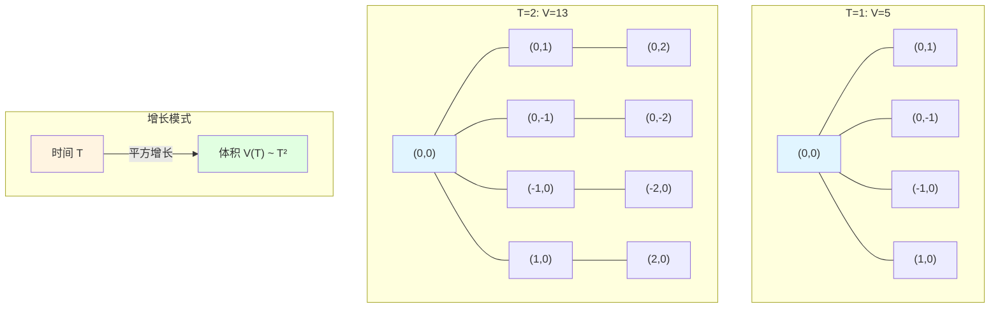
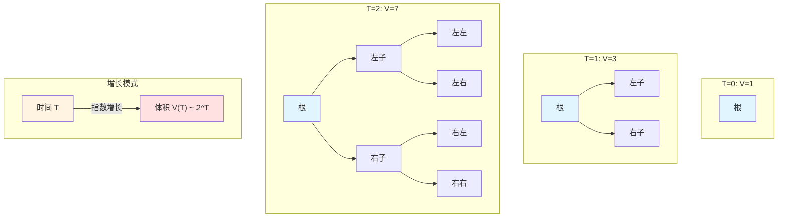

# 23.4 体积增长与复杂性维数:P与NP的几何分界

> **本篇导读**
>
> 在上一篇中,我们定义了复杂性球 $B_T(x_0)$ 和体积函数 $V_{x_0}(T)$,并引入了复杂性维数 $\dim_{\text{comp}}(x_0) = \lim_{T\to\infty} \frac{\log V_{x_0}(T)}{\log T}$。但这只是定义,还没有回答核心问题:**为什么复杂性维数能刻画问题难度?**
>
> 本篇将深入研究体积增长的精细结构,证明两个关键定理:
> 1. **有界度图 → 多项式增长**(定理2.1):若图的度有界且边权有界,则 $V(T) \sim T^{d_*}$,对应P类问题;
> 2. **指数增长 → 无限维数**(定理3.1):若 $V(T) \ge \lambda^T$,则 $\dim_{\text{comp}} = \infty$,对应NP难问题。
>
> 我们还将讨论**复杂性类的几何刻画**:P, NP, BQP, PSPACE 在复杂性几何中对应不同的体积增长模式,从而建立"计算复杂性理论"与"微分几何"的深刻联系。
>
> **关键洞察**:复杂性不仅是"算法运行时间",更是"配置空间的几何膨胀速度"。维数有限对应"可控的搜索空间",维数无限对应"爆炸的搜索空间"。

---

## 1. 为什么体积增长决定问题难度?从搜索空间到几何膨胀

### 1.1 传统算法分析的"时间视角"

在经典算法分析中,我们用**时间复杂度**来衡量算法效率:

- 若算法在输入大小 $n$ 时需要 $T(n) = O(n^2)$ 步,则称其为"平方时间";
- 若 $T(n) = O(2^n)$,则称其为"指数时间"。

**问题**:这种描述只关心"运行了多久",而不关心"搜索空间有多大"。

### 1.2 搜索空间的几何膨胀

从复杂性几何的视角,我们可以重新理解"时间复杂度":

- **时间 $T$** 对应"资源预算"(可以走多远);
- **复杂性球 $B_T(x_0)$** 对应"在预算 $T$ 内能探索的所有配置";
- **体积函数 $V_{x_0}(T) = |B_T(x_0)|$** 对应"搜索空间的大小"。

**关键洞察**:

- 若 $V(T) = O(T^d)$(多项式增长),则"搜索空间"随时间**缓慢膨胀**,对应P类问题(高效可解);
- 若 $V(T) = O(2^T)$(指数增长),则"搜索空间"随时间**爆炸性膨胀**,对应NP难问题(无法穷举)。

**日常类比**:

- **多项式增长**就像"在平面上探索":
  - 若你每小时能走1公里,则在 $T$ 小时内能到达的区域面积是 $\pi T^2$(平方增长);
  - 搜索空间的大小与时间的"幂次"成正比。

- **指数增长**就像"在迷宫树中探索":
  - 每走一步,前方分裂成2条路;
  - 在 $T$ 步内,可能的路径数是 $2^T$(指数爆炸);
  - 很快就无法穷举所有可能。

### 1.3 复杂性维数作为"几何不变量"

在连续几何中,"维数"是刻画空间大小的基本不变量:

- 一维空间(直线):体积 $\sim T$(线性);
- 二维空间(平面):体积 $\sim T^2$(平方);
- 三维空间(立体):体积 $\sim T^3$(立方);
- $d$ 维空间:体积 $\sim T^d$。

在复杂性几何中,**复杂性维数** $\dim_{\text{comp}}$ 扮演同样的角色:

- 若 $V(T) \sim T^d$,则 $\dim_{\text{comp}} = d$(有限维);
- 若 $V(T) \sim 2^T$,则 $\dim_{\text{comp}} = \infty$(无限维)。

**关键问题**:什么样的配置图会导致有限维?什么样的配置图会导致无限维?

---

## 2. 有界度图的多项式增长:P类问题的几何特征

### 2.1 定理:有界度与边权有界 → 多项式增长

**定理 2.1**(有界度情形的多项式增长,源自 euler-gls-info/02-discrete-complexity-geometry.md 命题3.2)

假设复杂性图的无向对称版 $(X_{\text{fin}},E_{\text{sym}})$ 满足:

1. **度有界**:存在 $D > 0$ 使对所有 $x\in X_{\text{fin}}$ 有:
   $$
   \deg(x) \le D
   $$
   即每个顶点最多连接 $D$ 条边。

2. **边权有界**:存在常数 $0 < c_{\min} \le c_{\max} < \infty$ 使得对所有边 $\{x,y\}\in E_{\text{sym}}$ 有:
   $$
   c_{\min} \le w_{\text{sym}}(\{x,y\}) \le c_{\max}
   $$

则存在常数 $C_1,C_2 > 0$ 与整数 $d_* \ge 0$,使得对足够大的 $T$ 有:
$$
C_1 T^{d_*} \le V_{x_0}(T) \le C_2 T^{d_*}
$$

特别地,$\dim_{\text{comp}}(x_0) = d_*$。

**证明思路**(源自 euler-gls-info/02-discrete-complexity-geometry.md 附录A.3):

1. **步数球的定义**:
   - 令 $N(x_0,n)$ 为"从 $x_0$ 出发 $n$ 步可达的点集合"(不计代价,只计步数);
   - 由于度有界 $D$,每步最多到达 $D$ 个新顶点,故:
     $$
     |N(x_0,n)| \le D^n
     $$

2. **复杂性球与步数球的关系**:
   - 若边权下界为 $c_{\min}$,则走 $n$ 步的最小代价是 $n\cdot c_{\min}$;
   - 若边权上界为 $c_{\max}$,则走 $n$ 步的最大代价是 $n\cdot c_{\max}$;
   - 因此,代价预算 $T$ 对应的步数范围是:
     $$
     \frac{T}{c_{\max}} \le n \le \frac{T}{c_{\min}}
     $$

3. **复杂性球的夹逼**:
   - 下界:至少能走 $\lfloor T/c_{\max}\rfloor$ 步,故:
     $$
     B_T(x_0) \supseteq N(x_0,\lfloor T/c_{\max}\rfloor)
     $$
   - 上界:至多能走 $\lfloor T/c_{\min}\rfloor$ 步,故:
     $$
     B_T(x_0) \subseteq N(x_0,\lfloor T/c_{\min}\rfloor)
     $$

4. **体积估计**:
   - 在规则图(例如格子图、Cayley图)中,$|N(x_0,n)| \sim n^{d_*}$(其中 $d_*$ 是图的几何维数);
   - 因此:
     $$
     V_{x_0}(T) = |B_T(x_0)| \sim \left(\frac{T}{c_{\min}}\right)^{d_*} \sim T^{d_*}
     $$

5. **复杂性维数**:
   $$
   \dim_{\text{comp}}(x_0) = \lim_{T\to\infty} \frac{\log V_{x_0}(T)}{\log T} = \lim_{T\to\infty} \frac{\log(C T^{d_*})}{\log T} = d_*
   $$

证毕。□

**日常类比**:

- 想象你在一个**格子状的城市**中探索:
  - 每个十字路口最多连接4条路(度有界 $D=4$);
  - 每条路长度在1到10公里之间(边权有界);
  - 在 $T$ 小时内,你能探索的区域是"半径约为 $T$ 的正方形",面积约为 $T^2$(平方增长);
  - 复杂性维数 $\dim_{\text{comp}} = 2$(二维)。

### 2.2 示例:二维格子图的体积增长

**例2.2**(二维格子图)

考虑二维整数格子 $\mathbb{Z}^2$ 上的复杂性图:

- 顶点:$(i,j)\in\mathbb{Z}^2$;
- 边:相邻格点之间(上下左右),即 $\{(i,j),(i\pm 1,j)\}$ 和 $\{(i,j),(i,j\pm 1)\}$;
- 边权:$w(x,y) = 1$(所有边权相同)。

**分析**:

1. **度有界**:每个顶点度为4(上下左右),故 $D=4$;
2. **边权有界**:$c_{\min} = c_{\max} = 1$;
3. **步数球**:从原点 $(0,0)$ 出发 $n$ 步可达的点集合是"曼哈顿距离 $\le n$ 的所有格点",其数量为:
   $$
   |N((0,0),n)| = \sum_{k=0}^{n} (2k+1) = (n+1)^2 \sim n^2
   $$
4. **复杂性球**:由于边权为1,步数球 = 复杂性球,故:
   $$
   V_{(0,0)}(T) = (T+1)^2 \sim T^2
   $$
5. **复杂性维数**:
   $$
   \dim_{\text{comp}}((0,0)) = \lim_{T\to\infty} \frac{\log V(T)}{\log T} = \lim_{T\to\infty} \frac{\log(T^2)}{\log T} = 2
   $$

**结论**:二维格子图的复杂性维数是2,对应"平面几何"。

### 2.3 图示:二维格子图的体积增长

**说明**:

- 蓝色:起点 $(0,0)$;
- 随着预算 $T$ 增加,复杂性球的大小以 $T^2$ 的速度增长;
- 在二维平面上,这对应"面积"的增长。

---

## 3. 指数增长与无限维数:NP难问题的几何爆炸

### 3.1 定理:指数增长 → 无限维数

**定理 3.1**(指数增长,源自 euler-gls-info/02-discrete-complexity-geometry.md 命题3.3)

若存在常数 $\lambda > 1$ 与 $T_0 > 0$,使得对所有 $n\in\mathbb{N}$ 有:
$$
V_{x_0}(nT_0) \ge \lambda^n
$$

则:
$$
\overline{\dim}_{\text{comp}}(x_0) = \infty
$$

换言之,复杂性球体积指数增长则复杂性维数无限大。

**证明**(源自 euler-gls-info/02-discrete-complexity-geometry.md 附录A.4):

令 $T = nT_0$,则:
$$
\frac{\log V_{x_0}(T)}{\log T} \ge \frac{\log \lambda^n}{\log(nT_0)} = \frac{n\log\lambda}{\log(nT_0)} = \frac{n\log\lambda}{\log n + \log T_0}
$$

令 $n\to\infty$,有:
$$
\frac{n\log\lambda}{\log n + \log T_0} \sim \frac{n\log\lambda}{\log n} \to \infty
$$

故:
$$
\overline{\dim}_{\text{comp}}(x_0) = \limsup_{T\to\infty} \frac{\log V_{x_0}(T)}{\log T} = \infty
$$

证毕。□

**日常类比**:

- 想象你在一个**树状迷宫**中探索:
  - 每走一步,前方分裂成2条路;
  - 在 $T$ 步内,可能的路径端点数是 $2^T$(每步翻倍);
  - 搜索空间呈**指数爆炸**,很快就无法穷举所有可能;
  - 复杂性维数 $\dim_{\text{comp}} = \infty$(无限维)。

### 3.2 示例:二叉树的指数增长

**例3.2**(完全二叉树)

考虑完全二叉树上的复杂性图:

- 顶点:二叉树的所有节点;
- 边:父节点到两个子节点的有向边;
- 边权:$w(x,y) = 1$(所有边权相同)。

**分析**:

1. **度有界**:每个节点度为2(向下)或1(向上),故 $D=2$;
2. **步数球**:从根节点出发 $n$ 步可达的节点数为:
   $$
   |N(\text{root},n)| = 1 + 2 + 4 + \cdots + 2^n = 2^{n+1} - 1 \sim 2^n
   $$
3. **复杂性球**:由于边权为1,步数球 = 复杂性球,故:
   $$
   V_{\text{root}}(T) = 2^{T+1} - 1 \sim 2^T
   $$
4. **复杂性维数**:
   $$
   \dim_{\text{comp}}(\text{root}) = \lim_{T\to\infty} \frac{\log V(T)}{\log T} = \lim_{T\to\infty} \frac{\log(2^T)}{\log T} = \lim_{T\to\infty} \frac{T\log 2}{\log T} = \infty
   $$

**结论**:二叉树的复杂性维数是 $\infty$,对应"指数爆炸"。

### 3.3 图示:二叉树的指数增长

**说明**:

- 蓝色:根节点;
- 红色:指数爆炸的体积增长;
- 每增加一层,节点数翻倍,对应 $V(T) = 2^T$。

---

## 4. 复杂性类的几何刻画:P, NP, BQP, PSPACE

### 4.1 P类:多项式时间 ↔ 有限维数

**定义**(P类问题)

一个判定问题属于复杂性类 **P**(polynomial time),当且仅当存在确定性算法在输入大小 $n$ 时以 $O(n^k)$ 时间解决它(其中 $k$ 是常数)。

**几何刻画**:

在复杂性几何中,P类问题对应:

1. **度有界**:每个配置最多有多项式个后继;
2. **边权有界**:每步代价在多项式范围内;
3. **有限维数**:$\dim_{\text{comp}} < \infty$;
4. **多项式体积**:$V(T) = O(T^d)$,其中 $d$ 是常数。

**示例**:

- **排序问题**(例如归并排序):
  - 配置空间:所有可能的数组排列;
  - 每步操作:比较两个元素并交换;
  - 时间复杂度:$O(n\log n)$(多项式);
  - 复杂性维数:$\dim_{\text{comp}} = O(\log n)$(有限)。

**日常类比**:

- P类问题就像"在平面地图上找路":
  - 虽然路径可能很长,但能到达的地点数量是多项式的;
  - 可以用GPS导航高效找到最短路径。

### 4.2 NP类:非确定性多项式时间 ↔ 指数维数

**定义**(NP类问题)

一个判定问题属于复杂性类 **NP**(nondeterministic polynomial time),当且仅当:

1. 给定一个"证明"(witness),可以在多项式时间内验证它;
2. 但找到这个"证明"可能需要指数时间。

**几何刻画**:

在复杂性几何中,NP难问题对应:

1. **度无界或指数增长**:每个配置有指数多个后继;
2. **无限维数**:$\dim_{\text{comp}} = \infty$;
3. **指数体积**:$V(T) = O(2^T)$或更快。

**示例**:

- **旅行商问题**(TSP):
  - 配置空间:所有可能的城市访问顺序,大小 $|X| = n!$;
  - 每步操作:交换两个城市的顺序;
  - 时间复杂度:$O(2^n)$ 或更糟(指数);
  - 复杂性维数:$\dim_{\text{comp}} = \infty$(无限)。

**日常类比**:

- NP难问题就像"在迷宫树中找出口":
  - 每走一步,前方分裂成多条路;
  - 搜索空间呈指数爆炸,无法穷举所有可能;
  - 只能靠"运气"或"启发式方法"寻找。

### 4.3 BQP类:量子多项式时间 ↔ 量子维数

**定义**(BQP类问题)

一个判定问题属于复杂性类 **BQP**(bounded-error quantum polynomial time),当且仅当存在量子算法在多项式时间内以高概率解决它。

**几何刻画**:

在复杂性几何中,BQP类问题对应:

1. **量子并行性**:量子态可以同时探索指数多个分支;
2. **量子干涉**:不同路径之间的相位相消,使得某些分支的贡献抵消;
3. **有效维数**:虽然希尔伯特空间维数是 $2^n$(指数),但"有效搜索空间"是多项式的;
4. **量子加速**:$V_{\text{quantum}}(T) \ll V_{\text{classical}}(T)$(量子体积比经典体积小)。

**示例**:

- **Shor算法**(大整数分解):
  - 经典算法需要 $O(2^{n^{1/3}})$ 时间(次指数);
  - 量子算法需要 $O(n^3)$ 时间(多项式);
  - 量子干涉使得"错误路径"相消,只留下"正确路径"。

**日常类比**:

- BQP类问题就像"在量子迷宫中找出口":
  - 你可以同时走所有路径(量子叠加);
  - 大多数路径互相抵消(量子干涉);
  - 最终只有少数"正确路径"存活下来。

### 4.4 PSPACE类:多项式空间 ↔ 深度有限的树

**定义**(PSPACE类问题)

一个判定问题属于复杂性类 **PSPACE**(polynomial space),当且仅当存在算法使用 $O(n^k)$ 空间解决它(时间可以是指数的)。

**几何刻画**:

在复杂性几何中,PSPACE类问题对应:

1. **深度有限**:虽然每步可能分裂,但总深度是多项式的;
2. **宽度指数**:每一层可能有指数多个节点;
3. **体积指数但可压缩**:虽然 $V(T) = O(2^T)$,但可以用多项式空间"压缩"存储。

**示例**:

- **围棋的最优策略**(在有限棋盘上):
  - 配置空间:所有可能的棋局,大小 $\sim 3^{361}$(指数);
  - 深度:棋局最多进行 $\sim 361$ 步(多项式);
  - 空间复杂度:$O(361)$(多项式,只需存储当前棋局);
  - 时间复杂度:$O(3^{361})$(指数)。

**日常类比**:

- PSPACE类问题就像"在有限深度的迷宫中找路":
  - 虽然每一层有很多分支,但总共只有 $k$ 层;
  - 可以用"深度优先搜索"逐层探索,只需存储当前路径(多项式空间);
  - 但总时间可能很长(指数时间)。

### 4.5 复杂性类的几何对比表

| 复杂性类 | 时间复杂度 | 空间复杂度 | 体积增长 $V(T)$ | 复杂性维数 $\dim_{\text{comp}}$ | 日常类比 |
|----------|------------|------------|-----------------|--------------------------------|----------|
| **P** | $O(n^k)$ | $O(n^k)$ | $O(T^d)$ | $d < \infty$ | 平面地图探索 |
| **NP** | $O(2^n)$ | $O(n^k)$ | $O(2^T)$ | $\infty$ | 迷宫树探索 |
| **BQP** | $O(n^k)$ (量子) | $O(n^k)$ | $O(T^d)$ (有效) | $d < \infty$ (有效) | 量子迷宫(干涉) |
| **PSPACE** | $O(2^{n^k})$ | $O(n^k)$ | $O(2^T)$ | $\infty$ (但深度有限) | 有限深度树 |
| **EXPTIME** | $O(2^{n^k})$ | $O(2^{n^k})$ | $O(2^T)$ | $\infty$ | 指数爆炸 |

---

## 5. 从图结构到维数:局域性、分支数与曲率

### 5.1 局域有限性与多项式增长

**命题 5.1**(局域有限性,源自 euler-gls-info/02-discrete-complexity-geometry.md 命题3.2)

若复杂性图满足:

1. **局域有限**:对任意顶点 $x$,其邻域 $N(x) = \{y : (x,y)\in E\}$ 是有限集;
2. **度一致有界**:存在 $D$ 使 $|N(x)| \le D$ 对所有 $x$ 成立;
3. **边权一致有界**:$c_{\min} \le w(x,y) \le c_{\max}$;

则体积函数至多多项式增长:
$$
V_{x_0}(T) \le C\left(\frac{T}{c_{\min}}\right)^{\log_2 D}
$$

**证明思路**:

- 从 $x_0$ 出发 $n$ 步可达的顶点数至多是 $D^n$(每步最多分裂成 $D$ 个分支);
- 代价预算 $T$ 对应步数 $n \sim T/c_{\min}$;
- 故 $V(T) \le D^{T/c_{\min}} = 2^{(T/c_{\min})\log_2 D} \sim T^{\log_2 D}$(若 $\log_2 D < 1$,则是次线性;若 $\log_2 D = 1$,则是线性;若 $\log_2 D > 1$,则是超线性但仍是多项式)。

**日常类比**:

- 若交通网络中每个城市最多连接 $D$ 条路,则在时间 $T$ 内能到达的城市数量是 $O(T^{\log D})$(多项式)。

### 5.2 分支数与指数增长

**命题 5.2**(分支数,源自 euler-gls-info/02-discrete-complexity-geometry.md)

若复杂性图满足:

1. **分支无界**:存在顶点序列 $\{x_n\}$ 使得 $|N(x_n)| \to \infty$(度无界);
2. **树状结构**:图中存在一个"扩展子图",在其中每个顶点向下分裂成 $\lambda > 1$ 个子节点;

则体积函数至少指数增长:
$$
V_{x_0}(T) \ge c\lambda^{T/c_{\max}}
$$

**证明思路**:

- 在树状子图中,从根出发 $n$ 步可达的节点数是 $\lambda^n$;
- 代价预算 $T$ 对应步数 $n \sim T/c_{\max}$;
- 故 $V(T) \ge \lambda^{T/c_{\max}}$(指数增长)。

**日常类比**:

- 若交通网络是"树状"的(每个城市都分裂成多个分支),则在时间 $T$ 内能到达的城市数量是 $O(\lambda^T)$(指数)。

### 5.3 曲率的几何意义(预告)

在下一篇文章中,我们将引入**离散Ricci曲率** $\kappa(x,y)$,它刻画了"局部区域内复杂路径的发散或收缩"。

**预告**:

- **非负曲率** $\kappa(x,y) \ge 0$ → 多项式增长 $V(T) = O(T^d)$;
- **负曲率** $\kappa(x,y) < 0$ → 指数增长 $V(T) = O(2^T)$。

这将建立"曲率"与"问题难度"之间的定量联系。

---

## 6. 实际问题的复杂性维数分析

### 6.1 排序问题:$\dim_{\text{comp}} = O(\log n)$

**问题**:给定 $n$ 个数,将它们从小到大排序。

**配置空间**:所有可能的排列,大小 $|X| = n!$。

**算法**:归并排序(分治)

- 每步操作:比较两个元素并合并;
- 时间复杂度:$O(n\log n)$;
- 复杂性图:每个配置最多有 $O(n)$ 个后继(比较 $n$ 对元素);
- 复杂性维数:$\dim_{\text{comp}} = O(\log n)$(有限)。

**几何解释**:

- 排序问题的配置空间虽然有 $n!$ 个点,但"最优路径"只需 $O(n\log n)$ 步;
- 复杂性球的体积增长是 $V(T) \sim T^{\log n}$(多项式);
- 因此排序问题属于P类。

### 6.2 旅行商问题:$\dim_{\text{comp}} = \infty$

**问题**:给定 $n$ 个城市,找到访问所有城市的最短路径。

**配置空间**:所有可能的访问顺序,大小 $|X| = n!$。

**算法**:暴力搜索(穷举)

- 每步操作:交换两个城市的顺序;
- 时间复杂度:$O(n!)$ 或 $O(2^n)$(指数);
- 复杂性图:每个配置有 $O(n^2)$ 个后继(可以交换任意两个城市);
- 复杂性维数:$\dim_{\text{comp}} = \infty$(无限)。

**几何解释**:

- 旅行商问题的配置空间是一个"高度连通的图",每个节点有很多邻居;
- 复杂性球的体积增长是 $V(T) \sim 2^T$(指数爆炸);
- 因此旅行商问题是NP难的。

### 6.3 Shor算法:量子加速的几何解释

**问题**:分解大整数 $N = p\times q$(其中 $p,q$ 是质数)。

**经典算法**:试除法或数域筛

- 时间复杂度:$O(2^{(\log N)^{1/3}})$(次指数);
- 复杂性维数:$\dim_{\text{comp}} = \infty$(但增长较慢)。

**量子算法**:Shor算法

- 时间复杂度:$O((\log N)^3)$(多项式);
- 量子并行性:可以同时探索指数多个分支;
- 量子干涉:错误分支相消,只留下正确分支;
- 有效维数:$\dim_{\text{comp}}^{\text{eff}} = O(\log N)$(有限)。

**几何解释**:

- 经典算法需要在指数大小的搜索空间中找"针";
- 量子算法通过"量子傅里叶变换"将搜索空间"压缩"成多项式大小;
- 这对应"高维空间的低维投影"。

---

## 7. 本篇总结与关键公式回顾

### 7.1 核心定理

| 定理 | 条件 | 结论 | 编号 |
|------|------|------|------|
| **有界度 → 多项式** | 度有界 $\deg(x) \le D$,边权有界 $c_{\min} \le w \le c_{\max}$ | $V(T) \sim T^{d_*}$,$\dim_{\text{comp}} = d_*$ | 定理2.1 |
| **指数 → 无限维** | $V(nT_0) \ge \lambda^n$ 对某 $\lambda > 1$ | $\dim_{\text{comp}} = \infty$ | 定理3.1 |
| **步数球夹逼** | 边权有界 | $N(x_0,T/c_{\max}) \subseteq B_T(x_0) \subseteq N(x_0,T/c_{\min})$ | 证明2.1 |

### 7.2 关键公式

| 公式 | 含义 | 来源 |
|------|------|------|
| $\dim_{\text{comp}}(x_0) = \lim_{T\to\infty} \frac{\log V_{x_0}(T)}{\log T}$ | 复杂性维数定义 | 定义1.1 |
| $V(T) \sim T^d \implies \dim_{\text{comp}} = d$ | 多项式增长 → 有限维 | 定理2.1 |
| $V(T) \sim 2^T \implies \dim_{\text{comp}} = \infty$ | 指数增长 → 无限维 | 定理3.1 |
| $\|N(x_0,n)\| \le D^n$ | 度有界 → 步数球有界 | 证明2.1 |

### 7.3 复杂性类的几何特征表

| 复杂性类 | 体积增长 | 维数 | 典型问题 |
|----------|----------|------|----------|
| P | $V(T) = O(T^d)$ | $\dim_{\text{comp}} < \infty$ | 排序、最短路径、矩阵乘法 |
| NP | $V(T) = O(2^T)$ | $\dim_{\text{comp}} = \infty$ | 旅行商、背包、3-SAT |
| BQP | $V_{\text{eff}}(T) = O(T^d)$ | $\dim_{\text{comp}}^{\text{eff}} < \infty$ | Shor算法、Grover搜索 |
| PSPACE | $V(T) = O(2^T)$,深度 $O(n^k)$ | $\dim_{\text{comp}} = \infty$ | 围棋、量子线路模拟 |

### 7.4 日常类比总结

| 几何特征 | 日常类比 |
|----------|----------|
| 多项式增长 $V(T) \sim T^2$ | 在平面上探索,能到达的地点数量是面积 |
| 指数增长 $V(T) \sim 2^T$ | 在树状迷宫中探索,每步分裂,指数爆炸 |
| 有限维 $\dim_{\text{comp}} = d$ | $d$ 维空间(直线、平面、立体) |
| 无限维 $\dim_{\text{comp}} = \infty$ | 分形或树(每个尺度都有新的复杂性) |
| 量子加速 | 同时走所有路径,错误路径相消 |

### 7.5 与前篇的对接

- **23.1**:定义了计算宇宙对象 $U_{\text{comp}}=(X,\mathcal{T},\mathcal{C},\mathcal{I})$ 和五大公理;
- **23.2**:引入模拟态射,证明 $\mathbf{TMUniv}\simeq\mathbf{CAUniv}\simeq\mathbf{QCAUniv}$;
- **23.3**:定义复杂性图、复杂性距离、复杂性球、体积函数;
- **本篇(23.4)**:深入研究体积增长,证明有界度 → 多项式、指数 → 无限维,建立P/NP的几何刻画;
- **下一篇(23.5)**:引入离散Ricci曲率,证明曲率 ↔ 体积增长,建立"曲率–问题难度"的定量联系。

### 7.6 关键洞察

1. **体积增长决定问题难度**:
   - 多项式增长($V(T) \sim T^d$)对应P类问题,搜索空间可控;
   - 指数增长($V(T) \sim 2^T$)对应NP难问题,搜索空间爆炸。

2. **复杂性维数是几何不变量**:
   - $\dim_{\text{comp}}$ 不依赖于具体的算法或路径选择;
   - 它刻画了配置空间的"内禀几何膨胀速度"。

3. **度与边权控制维数**:
   - 度有界 + 边权有界 → 有限维(多项式增长);
   - 度无界或树状结构 → 无限维(指数增长)。

4. **量子计算的几何解释**:
   - 量子并行性:同时探索指数多个分支;
   - 量子干涉:错误分支相消,有效维数降低;
   - 量子加速 = 高维空间的低维投影。

---

## 8. 开放问题与展望

1. **量子复杂性维数的精确刻画**:
   - 对于BQP类问题,如何精确定义"有效复杂性维数" $\dim_{\text{comp}}^{\text{eff}}$?
   - 量子纠缠如何影响配置空间的几何结构?

2. **分形维数与复杂性维数**:
   - 对于某些问题(例如迭代函数系统),配置空间可能是分形;
   - 复杂性维数 $\dim_{\text{comp}}$ 与Hausdorff维数、盒维数有什么关系?

3. **动态规划的几何解释**:
   - 动态规划通过"子问题重叠"减少搜索空间;
   - 这在几何上对应什么?是否是"配置空间的对称性折叠"?

4. **近似算法的几何特征**:
   - 对于NP难问题,近似算法可以在多项式时间内找到"接近最优"的解;
   - 这在几何上对应"在指数空间中找多项式维度的子空间"?

这些问题将在后续章节中探讨。

---

**下一篇预告**:23.5 离散Ricci曲率:问题为什么难?

在下一篇中,我们将引入**离散Ricci曲率** $\kappa(x,y)$,它刻画了"局部区域内复杂路径的发散或收缩"。我们将证明:

1. **曲率下界与体积上界**:若 $\kappa(x,y) \ge K > 0$(非负曲率),则 $V(T) \le C T^d$(多项式增长);
2. **负曲率与体积爆炸**:若 $\kappa(x,y) \le -K_0 < 0$(负曲率),则 $V(T) \ge c\lambda^T$(指数增长);
3. **曲率的计算方法**:如何从复杂性图的局部结构(转移分布、Wasserstein距离)计算曲率;
4. **Bishop-Gromov比较定理的离散版本**:曲率下界如何控制体积增长的精确上界。

通过这些技术,我们将看到:"问题为什么难"可以用"配置空间的曲率"来回答——正曲率对应"路径汇聚,容易找到最优解",负曲率对应"路径发散,难以穷举"。

**源理论**:euler-gls-info/02-discrete-complexity-geometry.md
