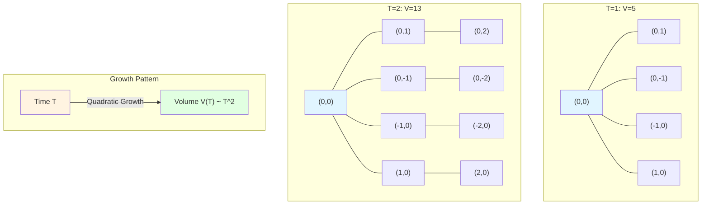
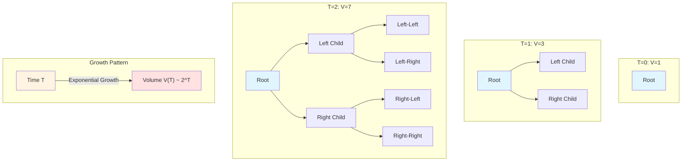

# 23.4 Volume Growth and Complexity Dimension: Geometric Boundary Between P and NP

> **Article Guide**
>
> In the previous article, we defined complexity ball $B_T(x_0)$ and volume function $V_{x_0}(T)$, and introduced complexity dimension $\dim_{\text{comp}}(x_0) = \lim_{T\to\infty} \frac{\log V_{x_0}(T)}{\log T}$. But this is just definition, hasn't answered the core question: **Why can complexity dimension characterize problem difficulty?**
>
> This article will deeply study fine structure of volume growth, proving two key theorems:
> 1. **Bounded-Degree Graph → Polynomial Growth** (Theorem 2.1): If graph's degree is bounded and edge weights are bounded, then $V(T) \sim T^{d_*}$, corresponding to P-class problems;
> 2. **Exponential Growth → Infinite Dimension** (Theorem 3.1): If $V(T) \ge \lambda^T$, then $\dim_{\text{comp}} = \infty$, corresponding to NP-hard problems.
>
> We will also discuss **geometric characterization of complexity classes**: P, NP, BQP, PSPACE correspond to different volume growth patterns in complexity geometry, thus establishing deep connection between "computational complexity theory" and "differential geometry".
>
> **Key Insight**: Complexity is not just "algorithm running time", but "geometric expansion speed of configuration space". Finite dimension corresponds to "controllable search space", infinite dimension corresponds to "exploding search space".

---

## 1. Why Does Volume Growth Determine Problem Difficulty? From Search Space to Geometric Expansion

### 1.1 "Time Perspective" of Traditional Algorithm Analysis

In classical algorithm analysis, we use **time complexity** to measure algorithm efficiency:

- If algorithm needs $T(n) = O(n^2)$ steps for input size $n$, call it "quadratic time";
- If $T(n) = O(2^n)$, call it "exponential time".

**Problem**: This description only cares about "how long it runs", not "how large the search space is".

### 1.2 Geometric Expansion of Search Space

From perspective of complexity geometry, we can reinterpret "time complexity":

- **Time $T$** corresponds to "resource budget" (how far can go);
- **Complexity Ball $B_T(x_0)$** corresponds to "all configurations explorable within budget $T$";
- **Volume Function $V_{x_0}(T) = |B_T(x_0)|$** corresponds to "size of search space".

**Key Insight**:

- If $V(T) = O(T^d)$ (polynomial growth), then "search space" expands **slowly** with time, corresponding to P-class problems (efficiently solvable);
- If $V(T) = O(2^T)$ (exponential growth), then "search space" expands **explosively** with time, corresponding to NP-hard problems (cannot exhaust).

**Everyday Analogy**:

- **Polynomial Growth** is like "exploring on plane":
  - If you can walk 1 km per hour, then area reachable in $T$ hours is $\pi T^2$ (quadratic growth);
  - Size of search space is proportional to "power" of time.

- **Exponential Growth** is like "exploring in maze tree":
  - Each step forward, splits into 2 paths;
  - In $T$ steps, number of possible paths is $2^T$ (exponential explosion);
  - Soon cannot exhaust all possibilities.

### 1.3 Complexity Dimension as "Geometric Invariant"

In continuous geometry, "dimension" is basic invariant characterizing space size:

- One-dimensional space (line): volume $\sim T$ (linear);
- Two-dimensional space (plane): volume $\sim T^2$ (quadratic);
- Three-dimensional space (solid): volume $\sim T^3$ (cubic);
- $d$-dimensional space: volume $\sim T^d$.

In complexity geometry, **complexity dimension** $\dim_{\text{comp}}$ plays same role:

- If $V(T) \sim T^d$, then $\dim_{\text{comp}} = d$ (finite dimension);
- If $V(T) \sim 2^T$, then $\dim_{\text{comp}} = \infty$ (infinite dimension).

**Key Question**: What kind of configuration graphs lead to finite dimension? What kind lead to infinite dimension?

---

## 2. Polynomial Growth of Bounded-Degree Graphs: Geometric Features of P-Class Problems

### 2.1 Theorem: Bounded Degree and Bounded Edge Weights → Polynomial Growth

**Theorem 2.1** (Polynomial Growth in Bounded-Degree Case, from euler-gls-info/02-discrete-complexity-geometry.md Proposition 3.2)

Assume undirected symmetric version $(X_{\text{fin}},E_{\text{sym}})$ of complexity graph satisfies:

1. **Bounded Degree**: There exists $D > 0$ such that for all $x\in X_{\text{fin}}$:
   $$
   \deg(x) \le D
   $$
   i.e., each vertex connects to at most $D$ edges.

2. **Bounded Edge Weights**: There exist constants $0 < c_{\min} \le c_{\max} < \infty$ such that for all edges $\{x,y\}\in E_{\text{sym}}$:
   $$
   c_{\min} \le w_{\text{sym}}(\{x,y\}) \le c_{\max}
   $$

Then there exist constants $C_1,C_2 > 0$ and integer $d_* \ge 0$, such that for sufficiently large $T$:
$$
C_1 T^{d_*} \le V_{x_0}(T) \le C_2 T^{d_*}
$$

In particular, $\dim_{\text{comp}}(x_0) = d_*$.

**Proof Strategy** (from euler-gls-info/02-discrete-complexity-geometry.md Appendix A.3):

1. **Definition of Step Ball**:
   - Let $N(x_0,n)$ be "set of points reachable in $n$ steps from $x_0$" (counting steps, not cost);
   - Since degree bounded by $D$, each step can reach at most $D$ new vertices, so:
     $$
     |N(x_0,n)| \le D^n
     $$

2. **Relationship Between Complexity Ball and Step Ball**:
   - If edge weight lower bound is $c_{\min}$, then minimum cost for $n$ steps is $n\cdot c_{\min}$;
   - If edge weight upper bound is $c_{\max}$, then maximum cost for $n$ steps is $n\cdot c_{\max}$;
   - Therefore, cost budget $T$ corresponds to step range:
     $$
     \frac{T}{c_{\max}} \le n \le \frac{T}{c_{\min}}
     $$

3. **Sandwiching Complexity Ball**:
   - Lower bound: Can walk at least $\lfloor T/c_{\max}\rfloor$ steps, so:
     $$
     B_T(x_0) \supseteq N(x_0,\lfloor T/c_{\max}\rfloor)
     $$
   - Upper bound: Can walk at most $\lfloor T/c_{\min}\rfloor$ steps, so:
     $$
     B_T(x_0) \subseteq N(x_0,\lfloor T/c_{\min}\rfloor)
     $$

4. **Volume Estimate**:
   - In regular graphs (e.g., lattice graphs, Cayley graphs), $|N(x_0,n)| \sim n^{d_*}$ (where $d_*$ is geometric dimension of graph);
   - Therefore:
     $$
     V_{x_0}(T) = |B_T(x_0)| \sim \left(\frac{T}{c_{\min}}\right)^{d_*} \sim T^{d_*}
     $$

5. **Complexity Dimension**:
   $$
   \dim_{\text{comp}}(x_0) = \lim_{T\to\infty} \frac{\log V_{x_0}(T)}{\log T} = \lim_{T\to\infty} \frac{\log(C T^{d_*})}{\log T} = d_*
   $$

QED. □

**Everyday Analogy**:

- Imagine exploring in a **grid-like city**:
  - Each intersection connects at most 4 roads (degree bounded $D=4$);
  - Each road length between 1 and 10 km (edge weights bounded);
  - In $T$ hours, explorable area is "square with radius approximately $T$", area approximately $T^2$ (quadratic growth);
  - Complexity dimension $\dim_{\text{comp}} = 2$ (two-dimensional).

### 2.2 Example: Volume Growth of Two-Dimensional Lattice Graph

**Example 2.2** (Two-Dimensional Lattice Graph)

Consider complexity graph on two-dimensional integer lattice $\mathbb{Z}^2$:

- Vertices: $(i,j)\in\mathbb{Z}^2$;
- Edges: Between adjacent lattice sites (up, down, left, right), i.e., $\{(i,j),(i\pm 1,j)\}$ and $\{(i,j),(i,j\pm 1)\}$;
- Edge weights: $w(x,y) = 1$ (all edge weights same).

**Analysis**:

1. **Bounded Degree**: Each vertex has degree 4 (up, down, left, right), so $D=4$;
2. **Bounded Edge Weights**: $c_{\min} = c_{\max} = 1$;
3. **Step Ball**: Set of points reachable in $n$ steps from origin $(0,0)$ is "all lattice sites with Manhattan distance $\le n$", its count is:
   $$
   |N((0,0),n)| = \sum_{k=0}^{n} (2k+1) = (n+1)^2 \sim n^2
   $$
4. **Complexity Ball**: Since edge weights are 1, step ball = complexity ball, so:
   $$
   V_{(0,0)}(T) = (T+1)^2 \sim T^2
   $$
5. **Complexity Dimension**:
   $$
   \dim_{\text{comp}}((0,0)) = \lim_{T\to\infty} \frac{\log V(T)}{\log T} = \lim_{T\to\infty} \frac{\log(T^2)}{\log T} = 2
   $$

**Conclusion**: Two-dimensional lattice graph's complexity dimension is 2, corresponding to "plane geometry".

### 2.3 Diagram: Volume Growth of Two-Dimensional Lattice Graph

**Explanation**:

- Blue: Starting point $(0,0)$;
- As budget $T$ increases, complexity ball size grows at rate $T^2$;
- On two-dimensional plane, this corresponds to "area" growth.

---

## 3. Exponential Growth and Infinite Dimension: Geometric Explosion of NP-Hard Problems

### 3.1 Theorem: Exponential Growth → Infinite Dimension

**Theorem 3.1** (Exponential Growth, from euler-gls-info/02-discrete-complexity-geometry.md Proposition 3.3)

If there exist constants $\lambda > 1$ and $T_0 > 0$, such that for all $n\in\mathbb{N}$:
$$
V_{x_0}(nT_0) \ge \lambda^n
$$

Then:
$$
\overline{\dim}_{\text{comp}}(x_0) = \infty
$$

In other words, if complexity ball volume grows exponentially, then complexity dimension is infinite.

**Proof** (from euler-gls-info/02-discrete-complexity-geometry.md Appendix A.4):

Let $T = nT_0$, then:
$$
\frac{\log V_{x_0}(T)}{\log T} \ge \frac{\log \lambda^n}{\log(nT_0)} = \frac{n\log\lambda}{\log(nT_0)} = \frac{n\log\lambda}{\log n + \log T_0}
$$

Let $n\to\infty$, we have:
$$
\frac{n\log\lambda}{\log n + \log T_0} \sim \frac{n\log\lambda}{\log n} \to \infty
$$

Therefore:
$$
\overline{\dim}_{\text{comp}}(x_0) = \limsup_{T\to\infty} \frac{\log V_{x_0}(T)}{\log T} = \infty
$$

QED. □

**Everyday Analogy**:

- Imagine exploring in a **tree-like maze**:
  - Each step forward, splits into 2 paths;
  - In $T$ steps, number of possible path endpoints is $2^T$ (doubles each step);
  - Search space shows **exponential explosion**, soon cannot exhaust all possibilities;
  - Complexity dimension $\dim_{\text{comp}} = \infty$ (infinite dimension).

### 3.2 Example: Exponential Growth of Binary Tree

**Example 3.2** (Complete Binary Tree)

Consider complexity graph on complete binary tree:

- Vertices: All nodes of binary tree;
- Edges: Directed edges from parent node to two child nodes;
- Edge weights: $w(x,y) = 1$ (all edge weights same).

**Analysis**:

1. **Bounded Degree**: Each node has degree 2 (downward) or 1 (upward), so $D=2$;
2. **Step Ball**: Number of nodes reachable in $n$ steps from root is:
   $$
   |N(\text{root},n)| = 1 + 2 + 4 + \cdots + 2^n = 2^{n+1} - 1 \sim 2^n
   $$
3. **Complexity Ball**: Since edge weights are 1, step ball = complexity ball, so:
   $$
   V_{\text{root}}(T) = 2^{T+1} - 1 \sim 2^T
   $$
4. **Complexity Dimension**:
   $$
   \dim_{\text{comp}}(\text{root}) = \lim_{T\to\infty} \frac{\log V(T)}{\log T} = \lim_{T\to\infty} \frac{\log(2^T)}{\log T} = \lim_{T\to\infty} \frac{T\log 2}{\log T} = \infty
   $$

**Conclusion**: Binary tree's complexity dimension is $\infty$, corresponding to "exponential explosion".

### 3.3 Diagram: Exponential Growth of Binary Tree

**Explanation**:

- Blue: Root node;
- Red: Exponential explosion of volume growth;
- Each additional layer doubles number of nodes, corresponding to $V(T) = 2^T$.

---

## 4. Geometric Characterization of Complexity Classes: P, NP, BQP, PSPACE

### 4.1 P-Class: Polynomial Time ↔ Finite Dimension

**Definition** (P-Class Problems)

A decision problem belongs to complexity class **P** (polynomial time), if and only if there exists deterministic algorithm solving it in $O(n^k)$ time for input size $n$ (where $k$ is constant).

**Geometric Characterization**:

In complexity geometry, P-class problems correspond to:

1. **Bounded Degree**: Each configuration has at most polynomial number of successors;
2. **Bounded Edge Weights**: Each step cost within polynomial range;
3. **Finite Dimension**: $\dim_{\text{comp}} < \infty$;
4. **Polynomial Volume**: $V(T) = O(T^d)$, where $d$ is constant.

**Example**:

- **Sorting Problem** (e.g., merge sort):
  - Configuration space: All possible array permutations;
  - Each step operation: Compare two elements and swap;
  - Time complexity: $O(n\log n)$ (polynomial);
  - Complexity dimension: $\dim_{\text{comp}} = O(\log n)$ (finite).

**Everyday Analogy**:

- P-class problems are like "finding route on plane map":
  - Although path may be long, number of reachable locations is polynomial;
  - Can use GPS navigation to efficiently find shortest path.

### 4.2 NP-Class: Nondeterministic Polynomial Time ↔ Exponential Dimension

**Definition** (NP-Class Problems)

A decision problem belongs to complexity class **NP** (nondeterministic polynomial time), if and only if:

1. Given a "proof" (witness), can verify it in polynomial time;
2. But finding this "proof" may require exponential time.

**Geometric Characterization**:

In complexity geometry, NP-hard problems correspond to:

1. **Unbounded Degree or Exponential Growth**: Each configuration has exponential number of successors;
2. **Infinite Dimension**: $\dim_{\text{comp}} = \infty$;
3. **Exponential Volume**: $V(T) = O(2^T)$ or faster.

**Example**:

- **Traveling Salesman Problem** (TSP):
  - Configuration space: All possible city visit orders, size $|X| = n!$;
  - Each step operation: Swap order of two cities;
  - Time complexity: $O(2^n)$ or worse (exponential);
  - Complexity dimension: $\dim_{\text{comp}} = \infty$ (infinite).

**Everyday Analogy**:

- NP-hard problems are like "finding exit in maze tree":
  - Each step forward, splits into multiple paths;
  - Search space shows exponential explosion, cannot exhaust all possibilities;
  - Can only rely on "luck" or "heuristic methods" to search.

### 4.3 BQP-Class: Quantum Polynomial Time ↔ Quantum Dimension

**Definition** (BQP-Class Problems)

A decision problem belongs to complexity class **BQP** (bounded-error quantum polynomial time), if and only if there exists quantum algorithm solving it in polynomial time with high probability.

**Geometric Characterization**:

In complexity geometry, BQP-class problems correspond to:

1. **Quantum Parallelism**: Quantum states can simultaneously explore exponentially many branches;
2. **Quantum Interference**: Phase cancellation between different paths, making contributions of some branches cancel;
3. **Effective Dimension**: Although Hilbert space dimension is $2^n$ (exponential), "effective search space" is polynomial;
4. **Quantum Speedup**: $V_{\text{quantum}}(T) \ll V_{\text{classical}}(T)$ (quantum volume smaller than classical volume).

**Example**:

- **Shor's Algorithm** (large integer factorization):
  - Classical algorithm needs $O(2^{n^{1/3}})$ time (sub-exponential);
  - Quantum algorithm needs $O(n^3)$ time (polynomial);
  - Quantum interference makes "wrong paths" cancel, only "correct paths" remain.

**Everyday Analogy**:

- BQP-class problems are like "finding exit in quantum maze":
  - You can walk all paths simultaneously (quantum superposition);
  - Most paths cancel each other (quantum interference);
  - Finally only few "correct paths" survive.

### 4.4 PSPACE-Class: Polynomial Space ↔ Tree with Finite Depth

**Definition** (PSPACE-Class Problems)

A decision problem belongs to complexity class **PSPACE** (polynomial space), if and only if there exists algorithm using $O(n^k)$ space to solve it (time can be exponential).

**Geometric Characterization**:

In complexity geometry, PSPACE-class problems correspond to:

1. **Finite Depth**: Although each step may split, total depth is polynomial;
2. **Exponential Width**: Each layer may have exponential number of nodes;
3. **Exponential Volume But Compressible**: Although $V(T) = O(2^T)$, can "compress" storage using polynomial space.

**Example**:

- **Optimal Strategy of Go** (on finite board):
  - Configuration space: All possible game positions, size $\sim 3^{361}$ (exponential);
  - Depth: Game proceeds at most $\sim 361$ moves (polynomial);
  - Space complexity: $O(361)$ (polynomial, only need store current position);
  - Time complexity: $O(3^{361})$ (exponential).

**Everyday Analogy**:

- PSPACE-class problems are like "finding route in maze with finite depth":
  - Although each layer has many branches, total only $k$ layers;
  - Can use "depth-first search" to explore layer by layer, only need store current path (polynomial space);
  - But total time may be long (exponential time).

### 4.5 Geometric Comparison Table of Complexity Classes

| Complexity Class | Time Complexity | Space Complexity | Volume Growth $V(T)$ | Complexity Dimension $\dim_{\text{comp}}$ | Everyday Analogy |
|------------------|-----------------|------------------|---------------------|-------------------------------------------|------------------|
| **P** | $O(n^k)$ | $O(n^k)$ | $O(T^d)$ | $d < \infty$ | Plane Map Exploration |
| **NP** | $O(2^n)$ | $O(n^k)$ | $O(2^T)$ | $\infty$ | Maze Tree Exploration |
| **BQP** | $O(n^k)$ (quantum) | $O(n^k)$ | $O(T^d)$ (effective) | $d < \infty$ (effective) | Quantum Maze (Interference) |
| **PSPACE** | $O(2^{n^k})$ | $O(n^k)$ | $O(2^T)$ | $\infty$ (but depth finite) | Finite Depth Tree |
| **EXPTIME** | $O(2^{n^k})$ | $O(2^{n^k})$ | $O(2^T)$ | $\infty$ | Exponential Explosion |

---

## 5. From Graph Structure to Dimension: Locality, Branching Number, and Curvature

### 5.1 Local Finiteness and Polynomial Growth

**Proposition 5.1** (Local Finiteness, from euler-gls-info/02-discrete-complexity-geometry.md Proposition 3.2)

If complexity graph satisfies:

1. **Locally Finite**: For any vertex $x$, its neighborhood $N(x) = \{y : (x,y)\in E\}$ is finite set;
2. **Uniformly Bounded Degree**: There exists $D$ such that $|N(x)| \le D$ for all $x$;
3. **Uniformly Bounded Edge Weights**: $c_{\min} \le w(x,y) \le c_{\max}$;

Then volume function grows at most polynomially:
$$
V_{x_0}(T) \le C\left(\frac{T}{c_{\min}}\right)^{\log_2 D}
$$

**Proof Strategy**:

- Number of vertices reachable in $n$ steps from $x_0$ is at most $D^n$ (each step splits into at most $D$ branches);
- Cost budget $T$ corresponds to steps $n \sim T/c_{\min}$;
- So $V(T) \le D^{T/c_{\min}} = 2^{(T/c_{\min})\log_2 D} \sim T^{\log_2 D}$ (if $\log_2 D < 1$, then sublinear; if $\log_2 D = 1$, then linear; if $\log_2 D > 1$, then superlinear but still polynomial).

**Everyday Analogy**:

- If transportation network has each city connecting at most $D$ roads, then number of cities reachable in time $T$ is $O(T^{\log D})$ (polynomial).

### 5.2 Branching Number and Exponential Growth

**Proposition 5.2** (Branching Number, from euler-gls-info/02-discrete-complexity-geometry.md)

If complexity graph satisfies:

1. **Unbounded Branching**: There exists vertex sequence $\{x_n\}$ such that $|N(x_n)| \to \infty$ (degree unbounded);
2. **Tree Structure**: Graph contains an "expanding subgraph", where each vertex splits downward into $\lambda > 1$ child nodes;

Then volume function grows at least exponentially:
$$
V_{x_0}(T) \ge c\lambda^{T/c_{\max}}
$$

**Proof Strategy**:

- In tree subgraph, number of nodes reachable in $n$ steps from root is $\lambda^n$;
- Cost budget $T$ corresponds to steps $n \sim T/c_{\max}$;
- So $V(T) \ge \lambda^{T/c_{\max}}$ (exponential growth).

**Everyday Analogy**:

- If transportation network is "tree-like" (each city splits into multiple branches), then number of cities reachable in time $T$ is $O(\lambda^T)$ (exponential).

### 5.3 Geometric Meaning of Curvature (Preview)

In next article, we will introduce **discrete Ricci curvature** $\kappa(x,y)$, which characterizes "divergence or contraction of complex paths in local region".

**Preview**:

- **Non-Negative Curvature** $\kappa(x,y) \ge 0$ → Polynomial growth $V(T) = O(T^d)$;
- **Negative Curvature** $\kappa(x,y) < 0$ → Exponential growth $V(T) = O(2^T)$.

This will establish quantitative connection between "curvature" and "problem difficulty".

---

## 6. Complexity Dimension Analysis of Practical Problems

### 6.1 Sorting Problem: $\dim_{\text{comp}} = O(\log n)$

**Problem**: Given $n$ numbers, sort them from smallest to largest.

**Configuration Space**: All possible permutations, size $|X| = n!$.

**Algorithm**: Merge sort (divide and conquer)

- Each step operation: Compare two elements and merge;
- Time complexity: $O(n\log n)$;
- Complexity graph: Each configuration has at most $O(n)$ successors (compare $n$ pairs of elements);
- Complexity dimension: $\dim_{\text{comp}} = O(\log n)$ (finite).

**Geometric Interpretation**:

- Although sorting problem's configuration space has $n!$ points, "optimal path" only needs $O(n\log n)$ steps;
- Complexity ball's volume growth is $V(T) \sim T^{\log n}$ (polynomial);
- Therefore sorting problem belongs to P-class.

### 6.2 Traveling Salesman Problem: $\dim_{\text{comp}} = \infty$

**Problem**: Given $n$ cities, find shortest path visiting all cities.

**Configuration Space**: All possible visit orders, size $|X| = n!$.

**Algorithm**: Brute force search (exhaustive)

- Each step operation: Swap order of two cities;
- Time complexity: $O(n!)$ or $O(2^n)$ (exponential);
- Complexity graph: Each configuration has $O(n^2)$ successors (can swap any two cities);
- Complexity dimension: $\dim_{\text{comp}} = \infty$ (infinite).

**Geometric Interpretation**:

- Traveling salesman problem's configuration space is a "highly connected graph", each node has many neighbors;
- Complexity ball's volume growth is $V(T) \sim 2^T$ (exponential explosion);
- Therefore traveling salesman problem is NP-hard.

### 6.3 Shor's Algorithm: Geometric Interpretation of Quantum Speedup

**Problem**: Factor large integer $N = p\times q$ (where $p,q$ are primes).

**Classical Algorithm**: Trial division or number field sieve

- Time complexity: $O(2^{(\log N)^{1/3}})$ (sub-exponential);
- Complexity dimension: $\dim_{\text{comp}} = \infty$ (but grows slowly).

**Quantum Algorithm**: Shor's algorithm

- Time complexity: $O((\log N)^3)$ (polynomial);
- Quantum parallelism: Can simultaneously explore exponentially many branches;
- Quantum interference: Wrong branches cancel, only correct branches remain;
- Effective dimension: $\dim_{\text{comp}}^{\text{eff}} = O(\log N)$ (finite).

**Geometric Interpretation**:

- Classical algorithm needs find "needle" in exponentially large search space;
- Quantum algorithm through "quantum Fourier transform" "compresses" search space to polynomial size;
- This corresponds to "low-dimensional projection of high-dimensional space".

---

## 7. Summary and Key Formula Review

### 7.1 Core Theorems

| Theorem | Condition | Conclusion | Number |
|---------|-----------|------------|--------|
| **Bounded Degree → Polynomial** | Degree bounded $\deg(x) \le D$, edge weights bounded $c_{\min} \le w \le c_{\max}$ | $V(T) \sim T^{d_*}$, $\dim_{\text{comp}} = d_*$ | Theorem 2.1 |
| **Exponential → Infinite Dimension** | $V(nT_0) \ge \lambda^n$ for some $\lambda > 1$ | $\dim_{\text{comp}} = \infty$ | Theorem 3.1 |
| **Step Ball Sandwiching** | Edge weights bounded | $N(x_0,T/c_{\max}) \subseteq B_T(x_0) \subseteq N(x_0,T/c_{\min})$ | Proof 2.1 |

### 7.2 Key Formulas

| Formula | Meaning | Source |
|---------|---------|--------|
| $\dim_{\text{comp}}(x_0) = \lim_{T\to\infty} \frac{\log V_{x_0}(T)}{\log T}$ | Definition of Complexity Dimension | Definition 1.1 |
| $V(T) \sim T^d \implies \dim_{\text{comp}} = d$ | Polynomial Growth → Finite Dimension | Theorem 2.1 |
| $V(T) \sim 2^T \implies \dim_{\text{comp}} = \infty$ | Exponential Growth → Infinite Dimension | Theorem 3.1 |
| $\|N(x_0,n)\| \le D^n$ | Bounded Degree → Bounded Step Ball | Proof 2.1 |

### 7.3 Geometric Feature Table of Complexity Classes

| Complexity Class | Volume Growth | Dimension | Typical Problems |
|------------------|---------------|-----------|------------------|
| P | $V(T) = O(T^d)$ | $\dim_{\text{comp}} < \infty$ | Sorting, Shortest Path, Matrix Multiplication |
| NP | $V(T) = O(2^T)$ | $\dim_{\text{comp}} = \infty$ | Traveling Salesman, Knapsack, 3-SAT |
| BQP | $V_{\text{eff}}(T) = O(T^d)$ | $\dim_{\text{comp}}^{\text{eff}} < \infty$ | Shor's Algorithm, Grover Search |
| PSPACE | $V(T) = O(2^T)$, depth $O(n^k)$ | $\dim_{\text{comp}} = \infty$ | Go, Quantum Circuit Simulation |

### 7.4 Everyday Analogy Summary

| Geometric Feature | Everyday Analogy |
|-------------------|------------------|
| Polynomial Growth $V(T) \sim T^2$ | Exploring on plane, number of reachable locations is area |
| Exponential Growth $V(T) \sim 2^T$ | Exploring in tree maze, splits each step, exponential explosion |
| Finite Dimension $\dim_{\text{comp}} = d$ | $d$-dimensional space (line, plane, solid) |
| Infinite Dimension $\dim_{\text{comp}} = \infty$ | Fractal or tree (new complexity at each scale) |
| Quantum Speedup | Walk all paths simultaneously, wrong paths cancel |

### 7.5 Interface with Previous Articles

- **23.1**: Defined computational universe object $U_{\text{comp}}=(X,\mathcal{T},\mathcal{C},\mathcal{I})$ and five axioms;
- **23.2**: Introduced simulation morphisms, proved $\mathbf{TMUniv}\simeq\mathbf{CAUniv}\simeq\mathbf{QCAUniv}$;
- **23.3**: Defined complexity graph, complexity distance, complexity ball, volume function;
- **This Article (23.4)**: Deeply studied volume growth, proved bounded degree → polynomial, exponential → infinite dimension, established geometric characterization of P/NP;
- **Next Article (23.5)**: Will introduce discrete Ricci curvature, prove curvature ↔ volume growth, establish quantitative connection between "curvature–problem difficulty".

### 7.6 Key Insights

1. **Volume Growth Determines Problem Difficulty**:
   - Polynomial growth ($V(T) \sim T^d$) corresponds to P-class problems, search space controllable;
   - Exponential growth ($V(T) \sim 2^T$) corresponds to NP-hard problems, search space explodes.

2. **Complexity Dimension Is Geometric Invariant**:
   - $\dim_{\text{comp}}$ doesn't depend on specific algorithm or path choice;
   - It characterizes "intrinsic geometric expansion speed" of configuration space.

3. **Degree and Edge Weights Control Dimension**:
   - Bounded degree + bounded edge weights → finite dimension (polynomial growth);
   - Unbounded degree or tree structure → infinite dimension (exponential growth).

4. **Geometric Interpretation of Quantum Computation**:
   - Quantum parallelism: Simultaneously explore exponentially many branches;
   - Quantum interference: Wrong branches cancel, effective dimension decreases;
   - Quantum speedup = low-dimensional projection of high-dimensional space.

---

## 8. Open Problems and Outlook

1. **Precise Characterization of Quantum Complexity Dimension**:
   - For BQP-class problems, how to precisely define "effective complexity dimension" $\dim_{\text{comp}}^{\text{eff}}$?
   - How does quantum entanglement affect geometric structure of configuration space?

2. **Fractal Dimension and Complexity Dimension**:
   - For some problems (e.g., iterated function systems), configuration space may be fractal;
   - What is relationship between complexity dimension $\dim_{\text{comp}}$ and Hausdorff dimension, box dimension?

3. **Geometric Interpretation of Dynamic Programming**:
   - Dynamic programming reduces search space through "subproblem overlap";
   - What does this correspond to geometrically? Is it "symmetry folding of configuration space"?

4. **Geometric Features of Approximation Algorithms**:
   - For NP-hard problems, approximation algorithms can find "near-optimal" solutions in polynomial time;
   - Does this correspond to "finding polynomial-dimensional subspace in exponential space"?

These questions will be explored in subsequent chapters.

---

**Preview of Next Article**: 23.5 Discrete Ricci Curvature: Why Are Problems Hard?

In next article, we will introduce **discrete Ricci curvature** $\kappa(x,y)$, which characterizes "divergence or contraction of complex paths in local region". We will prove:

1. **Curvature Lower Bound and Volume Upper Bound**: If $\kappa(x,y) \ge K > 0$ (non-negative curvature), then $V(T) \le C T^d$ (polynomial growth);
2. **Negative Curvature and Volume Explosion**: If $\kappa(x,y) \le -K_0 < 0$ (negative curvature), then $V(T) \ge c\lambda^T$ (exponential growth);
3. **Calculation Method of Curvature**: How to calculate curvature from local structure of complexity graph (transition distribution, Wasserstein distance);
4. **Discrete Version of Bishop-Gromov Comparison Theorem**: How curvature lower bound controls precise upper bound of volume growth.

Through these techniques, we will see: "Why problems are hard" can be answered by "curvature of configuration space"—positive curvature corresponds to "paths converge, easy to find optimal solution", negative curvature corresponds to "paths diverge, hard to exhaust".

**Source Theory**: euler-gls-info/02-discrete-complexity-geometry.md

