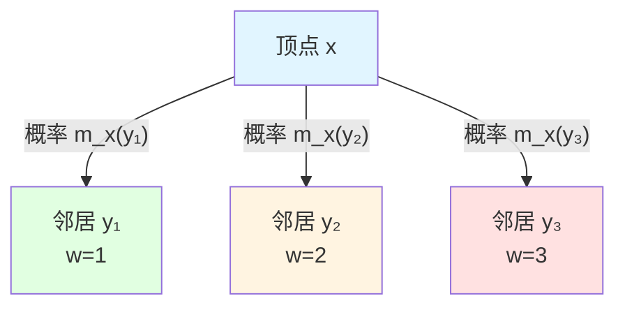
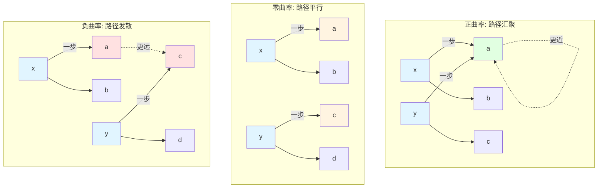

# 23.5 离散Ricci曲率:问题为什么难?

> **本篇导读**
>
> 在前两篇中,我们证明了:
> - 有界度图 → 多项式增长 $V(T) \sim T^d$
> - 指数增长 → 无限维数 $\dim_{\text{comp}} = \infty$
>
> 但这只是"结果",还没有回答"原因":**为什么**有些配置图导致多项式增长,而另一些导致指数增长?
>
> 本篇引入**离散Ricci曲率** $\kappa(x,y)$,它刻画了"局部区域内路径的发散或收缩"。我们将证明:
> 1. **非负曲率 → 多项式增长**(定理4.1):若 $\kappa(x,y) \ge 0$,则 $V(T) \le C T^{d_*}$;
> 2. **负曲率 → 指数增长**(定理4.2):若 $\kappa(x,y) \le -K_0 < 0$,则 $V(T) \ge c\lambda^T$。
>
> 这建立了"曲率–问题难度"的定量联系:**正曲率对应路径汇聚(容易找到最优解),负曲率对应路径发散(难以穷举)**。
>
> **关键洞察**:问题的"难度"不是算法的属性,而是配置空间的**几何属性**(曲率)。P类问题对应"非负曲率空间",NP难问题对应"负曲率空间"。

---

## 1. 为什么需要曲率?从度到几何的深层原因

### 1.1 上一篇的遗留问题

在上一篇中,我们证明了:

- **定理**:若图的度有界 $\deg(x) \le D$ 且边权有界,则 $V(T) \sim T^{d_*}$(多项式);
- **定理**:若 $V(T) \ge \lambda^n$,则 $\dim_{\text{comp}} = \infty$(无限维)。

**遗留问题**:

1. "度有界"只是**充分条件**,不是必要条件——有些度无界的图仍然有多项式增长;
2. "度无界"也不能直接推出指数增长——需要更精细的几何刻画;
3. **核心问题**:什么是决定体积增长的**本质几何性质**?

### 1.2 日常类比:从"路口数量"到"道路弯曲"

想象你在一个城市中探索:

- **度**对应"每个路口连接的道路数量":
  - 若每个路口最多4条路(度有界),则探索范围有限;
  - 但这不能告诉你"道路是直的还是弯的"。

- **曲率**对应"道路的弯曲程度":
  - **正曲率**(像球面):道路向内弯曲,不同路径会汇聚到一起;
  - **零曲率**(像平面):道路笔直,平行线保持平行;
  - **负曲率**(像马鞍面):道路向外弯曲,不同路径会发散开来。

**关键洞察**:

- 在**正曲率**空间中,即使度很大,体积增长仍然受控(因为路径汇聚);
- 在**负曲率**空间中,即使度有界,体积也会指数增长(因为路径发散)。

因此,**曲率**比**度**更本质地决定了体积增长。

### 1.3 从连续到离散:Ricci曲率的推广

在连续Riemann几何中,**Ricci曲率** $\text{Ric}$ 刻画了"测地线的平均收缩或发散":

- **正Ricci曲率**:测地线向内汇聚(例如球面);
- **负Ricci曲率**:测地线向外发散(例如双曲面)。

**Bishop-Gromov比较定理**(连续情形):

- 若 $\text{Ric} \ge K > 0$,则体积增长被多项式控制:$V(T) \le C T^d$;
- 若 $\text{Ricci} \le -K_0 < 0$,则体积指数增长:$V(T) \ge c e^{\sqrt{K_0}T}$。

在离散复杂性图中,我们需要一个**离散版本的Ricci曲率**,它能:

1. 在离散图上定义(不依赖于微分结构);
2. 刻画"局部路径的发散或收缩";
3. 控制体积增长(离散版Bishop-Gromov定理)。

---

## 2. 局部转移分布:从边到概率测度

### 2.1 定义:局部一步转移分布

在复杂性图 $G_{\text{comp}} = (X,E,w)$ 上,我们希望刻画"从顶点 $x$ 出发,随机游走一步后到达的分布"。

**定义 2.1**(局部一步转移分布,源自 euler-gls-info/02-discrete-complexity-geometry.md 定义4.1)

在复杂性图 $G_{\text{comp}} = (X,E,w)$ 上,定义从 $x$ 出发的**局部一步转移分布**为:
$$
m_x(y) = \frac{a(x,y)}{\sum_{z} a(x,z)}
$$

其中:
$$
a(x,y) = \begin{cases}
\exp(-\lambda w(x,y)), & (x,y)\in E, \\
0, & \text{否则},
\end{cases}
$$
$\lambda > 0$ 为固定的**尺度参数**。

**说明**:

- $a(x,y)$ 对"低代价边"有偏好:边权 $w(x,y)$ 越小,$a(x,y)$ 越大;
- $m_x(y)$ 是归一化后的概率分布:$\sum_y m_x(y) = 1$;
- $\lambda$ 控制"偏好强度":
  - $\lambda$ 很大时,只选择最低代价的边;
  - $\lambda$ 很小时,均匀选择所有边。

**日常类比**:

- 想象你在十字路口,需要选择一条路继续前进:
  - 每条路有一个"通行时间" $w(x,y)$(边权);
  - 你更倾向于选择"通行时间短"的路,但也有一定概率选择其他路;
  - $m_x(y)$ 就是"选择路 $y$ 的概率"。

### 2.2 示例:二维格子图的转移分布

**例2.2**(二维格子图)

考虑二维整数格子 $\mathbb{Z}^2$,每个顶点 $(i,j)$ 有4个邻居(上下左右),边权都是1。

从顶点 $(0,0)$ 出发的转移分布:
$$
a((0,0),(0,1)) = a((0,0),(0,-1)) = a((0,0),(1,0)) = a((0,0),(-1,0)) = e^{-\lambda}
$$

归一化:
$$
m_{(0,0)}((0,1)) = m_{(0,0)}((0,-1)) = m_{(0,0)}((1,0)) = m_{(0,0),(-1,0)} = \frac{e^{-\lambda}}{4e^{-\lambda}} = \frac{1}{4}
$$

**观察**:由于所有边权相同,转移分布是**均匀分布**(每个邻居概率1/4)。

### 2.3 图示:转移分布的可视化

**说明**:

- 顶点 $x$ 有3个邻居;
- 边权分别是1, 2, 3;
- 转移概率:
  $$
  m_x(y_1) = \frac{e^{-\lambda}}{e^{-\lambda}+e^{-2\lambda}+e^{-3\lambda}} \quad (\text{最大})
  $$
  $$
  m_x(y_2) = \frac{e^{-2\lambda}}{e^{-\lambda}+e^{-2\lambda}+e^{-3\lambda}} \quad (\text{中等})
  $$
  $$
  m_x(y_3) = \frac{e^{-3\lambda}}{e^{-\lambda}+e^{-2\lambda}+e^{-3\lambda}} \quad (\text{最小})
  $$

---

## 3. Wasserstein距离:测度之间的"运输代价"

### 3.1 定义:一阶Wasserstein距离

两个概率分布 $m_x$ 和 $m_y$ 之间的"距离"如何度量?

**定义 3.1**(一阶Wasserstein距离)

对两个概率测度 $m_x,m_y$ 在 $X$ 上,定义**一阶Wasserstein距离**为:
$$
W_1(m_x,m_y) = \inf_{\pi} \sum_{z,z'} d(z,z')\pi(z,z')
$$

其中下确界遍历所有**耦合**(coupling)$\pi$,即满足:
$$
\sum_{z'}\pi(z,z') = m_x(z), \quad \sum_z\pi(z,z') = m_y(z')
$$

**直观理解**:

- $m_x(z)$ 可以理解为"在位置 $z$ 有质量 $m_x(z)$";
- 我们想把 $m_x$ 的质量"运输"到 $m_y$ 的位置;
- $\pi(z,z')$ 表示"从位置 $z$ 运输到位置 $z'$ 的质量";
- $d(z,z')$ 是运输单位质量的代价;
- $W_1(m_x,m_y)$ 是"最优运输方案"的总代价。

**日常类比**:

- 想象你有一堆沙子分布在位置 $m_x$,需要重新堆成分布 $m_y$;
- 每移动一单位沙子距离 $d(z,z')$ 的代价是 $d(z,z')$;
- Wasserstein距离就是"最省力的堆沙子方案"的总代价。

### 3.2 Kantorovich对偶形式

Wasserstein距离有一个等价的对偶形式,在理论证明中很有用:

**命题 3.2**(Kantorovich对偶,源自 euler-gls-info/02-discrete-complexity-geometry.md 附录B.1)

$$
W_1(m_x,m_y) = \sup_{\varphi\in\text{Lip}_1} \sum_z \varphi(z)(m_x(z) - m_y(z))
$$

其中 $\text{Lip}_1$ 是所有**1-Lipschitz函数**的集合,即满足:
$$
|\varphi(z) - \varphi(z')| \le d(z,z')
$$

**直观理解**:

- 对偶形式说:Wasserstein距离 = "最大的Lipschitz泛函差异";
- 这在证明中非常有用,因为可以避免直接处理复杂的耦合。

### 3.3 示例:两点分布的Wasserstein距离

**例3.3**(两点分布)

考虑两个Dirac分布:

- $m_x = \delta_a$(质量全部集中在点 $a$);
- $m_y = \delta_b$(质量全部集中在点 $b$)。

则:
$$
W_1(\delta_a,\delta_b) = d(a,b)
$$

**证明**:唯一的运输方案是"把点 $a$ 的质量全部运到点 $b$",代价是 $d(a,b)$。□

---

## 4. 离散Ricci曲率的定义:从Wasserstein到曲率

### 4.1 定义:复杂性图上的Ricci曲率

现在我们可以定义离散Ricci曲率了。

**定义 4.1**(离散Ricci曲率,源自 euler-gls-info/02-discrete-complexity-geometry.md 定义4.2)

对 $x\neq y$,定义从 $x$ 到 $y$ 的**离散Ricci曲率**为:
$$
\kappa(x,y) = 1 - \frac{W_1(m_x,m_y)}{d(x,y)}
$$

**直观理解**:

- $d(x,y)$:顶点 $x$ 和 $y$ 之间的复杂性距离(最短路径代价);
- $W_1(m_x,m_y)$:从 $x$ 和 $y$ 出发随机游走一步后,两个分布之间的Wasserstein距离;
- 若 $W_1(m_x,m_y) < d(x,y)$,则 $\kappa(x,y) > 0$:**路径汇聚**(正曲率);
- 若 $W_1(m_x,m_y) > d(x,y)$,则 $\kappa(x,y) < 0$:**路径发散**(负曲率)。

**符号解释**:

- $\kappa(x,y) > 0$:非负曲率,路径汇聚,体积增长受控;
- $\kappa(x,y) = 0$:零曲率,路径平行,线性增长;
- $\kappa(x,y) < 0$:负曲率,路径发散,指数增长。

**日常类比**:

- **正曲率**(球面):两个人从赤道不同点出发,向北走,会在北极相遇(路径汇聚);
- **零曲率**(平面):两个人沿平行线走,永远保持相同距离(路径平行);
- **负曲率**(马鞍面):两个人从中心不同点出发,会越走越远(路径发散)。

### 4.2 示例:二维格子图的曲率

**例4.2**(二维格子图的曲率)

考虑二维整数格子 $\mathbb{Z}^2$,边权都是1。计算相邻顶点 $(0,0)$ 和 $(1,0)$ 之间的曲率。

1. **复杂性距离**:$d((0,0),(1,0)) = 1$(一步可达)。

2. **转移分布**:
   - $m_{(0,0)}$ 在4个邻居 $(0,1),(0,-1),(1,0),(-1,0)$ 上均匀分布,每个概率1/4;
   - $m_{(1,0)}$ 在4个邻居 $(1,1),(1,-1),(2,0),(0,0)$ 上均匀分布,每个概率1/4。

3. **Wasserstein距离**:
   - 两个分布有1个共同支撑点:(0,0)和(1,0);
   - 需要"运输"的质量:3/4(从一边3个邻居到另一边3个邻居);
   - 平均运输距离:约1(相邻格点);
   - $W_1(m_{(0,0)},m_{(1,0)}) \approx 1$。

4. **曲率**:
   $$
   \kappa((0,0),(1,0)) = 1 - \frac{W_1}{d} \approx 1 - \frac{1}{1} = 0
   $$

**结论**:二维格子图的曲率**约为0**(零曲率),对应平面几何。

### 4.3 图示:正曲率、零曲率、负曲率的对比

**说明**:

- **正曲率**:从 $x$ 和 $y$ 出发走一步,两个分布的Wasserstein距离**小于** $d(x,y)$(路径汇聚);
- **零曲率**:Wasserstein距离**等于** $d(x,y)$(路径平行);
- **负曲率**:Wasserstein距离**大于** $d(x,y)$(路径发散)。

---

## 5. 曲率与体积增长:核心定理

### 5.1 定理:非负曲率 → 多项式增长

**定理 5.1**(非负曲率下的多项式增长,源自 euler-gls-info/02-discrete-complexity-geometry.md 定理4.4)

假设复杂性图是局域有限的有向图,其对称版度有界,且存在 $K \ge 0$,使得对所有相邻 $x,y$ 有:
$$
\kappa(x,y) \ge K
$$

则存在常数 $C,d_* > 0$ 与 $T_0 > 0$,使得对所有 $T \ge T_0$ 有:
$$
V_{x_0}(T) \le C T^{d_*}
$$

特别地,$\overline{\dim}_{\text{comp}}(x_0) \le d_*$。

**证明思路**(源自 euler-gls-info/02-discrete-complexity-geometry.md 附录B.2):

1. **曲率下界的含义**:
   - 若 $\kappa(x,y) \ge K \ge 0$,则 $W_1(m_x,m_y) \le (1-K)d(x,y)$;
   - 这意味着"从 $x$ 和 $y$ 出发随机游走一步,两个分布的距离至多缩小到原来的 $(1-K)$ 倍"。

2. **随机游走的收缩性**:
   - 令 $P$ 为转移算子(由 $m_x$ 定义);
   - 对任意两个分布 $\mu,\nu$,有:
     $$
     W_1(\mu P,\nu P) \le (1-K)W_1(\mu,\nu)
     $$
   - 这说明随机游走每一步都使分布"收缩"。

3. **体积增长的控制**:
   - 收缩性意味着"从起点出发的随机游走不会快速扩散";
   - 利用离散版Bishop-Gromov比较定理(类似连续情形);
   - 可以证明复杂性球的体积至多多项式增长:$V(T) \le C T^{d_*}$。

证毕。□

**日常类比**:

- 在**正曲率**空间(例如球面)中,即使你可以朝任何方向走,但由于"空间向内弯曲",你能到达的范围是有限的(多项式增长)。

### 5.2 定理:负曲率 → 指数增长

**定理 5.2**(严格负曲率下的指数增长,源自 euler-gls-info/02-discrete-complexity-geometry.md 定理4.5)

假设存在 $K_0 > 0$ 与 $\delta > 0$,使得对所有满足 $d(x,y) \le \delta$ 的点对有:
$$
\kappa(x,y) \le -K_0
$$

则存在常数 $c,\lambda > 1$ 与 $T_0 > 0$,使得对所有 $n\in\mathbb{N}$:
$$
V_{x_0}(n T_0) \ge c \lambda^n
$$

**证明思路**(源自 euler-gls-info/02-discrete-complexity-geometry.md 附录B.3):

1. **曲率上界的含义**:
   - 若 $\kappa(x,y) \le -K_0 < 0$,则 $W_1(m_x,m_y) \ge (1+K_0)d(x,y)$;
   - 这意味着"从 $x$ 和 $y$ 出发随机游走一步,两个分布的距离至少扩大到原来的 $(1+K_0)$ 倍"。

2. **随机游走的发散性**:
   - 对任意两个分布 $\mu,\nu$,有:
     $$
     W_1(\mu P,\nu P) \ge (1+K_0)W_1(\mu,\nu)
     $$
   - 这说明随机游走每一步都使分布"发散"。

3. **树状扩张子图的构造**:
   - 利用发散性,可以在复杂性图中找到一个"树状扩张"的子图;
   - 在这个子图中,从 $x_0$ 出发,每增加固定预算 $T_0$,可达点数至少乘上常数因子 $\lambda$;
   - 因此 $V(nT_0) \ge c\lambda^n$(指数增长)。

证毕。□

**日常类比**:

- 在**负曲率**空间(例如马鞍面)中,由于"空间向外弯曲",不同路径会快速发散,你能到达的范围呈指数增长。

### 5.3 对比表:曲率与体积增长

| 曲率 $\kappa(x,y)$ | Wasserstein距离 | 随机游走行为 | 体积增长 $V(T)$ | 复杂性维数 | 典型空间 |
|-------------------|-----------------|--------------|-----------------|------------|----------|
| $\kappa \ge K > 0$ | $W_1 \le (1-K)d$ | 收缩(汇聚) | $\le C T^{d_*}$ | $\dim < \infty$ | 球面、正曲率流形 |
| $\kappa = 0$ | $W_1 = d$ | 平行 | $\sim T^d$ | $\dim = d$ | 平面、欧氏空间 |
| $\kappa \le -K_0 < 0$ | $W_1 \ge (1+K_0)d$ | 发散 | $\ge c\lambda^T$ | $\dim = \infty$ | 双曲面、负曲率流形 |

---

## 6. 曲率的计算方法:实际问题中如何计算 $\kappa(x,y)$

### 6.1 步骤1:计算转移分布 $m_x$

给定复杂性图 $G_{\text{comp}} = (X,E,w)$ 和顶点 $x$:

1. 找出 $x$ 的所有邻居 $N(x) = \{y : (x,y)\in E\}$;
2. 计算权重 $a(x,y) = \exp(-\lambda w(x,y))$;
3. 归一化:$m_x(y) = a(x,y) / \sum_{z\in N(x)} a(x,z)$。

### 6.2 步骤2:计算Wasserstein距离 $W_1(m_x,m_y)$

对于两个离散分布 $m_x$ 和 $m_y$:

1. **简化情形**(支撑不重叠):
   - 若 $m_x$ 和 $m_y$ 的支撑完全不重叠,则:
     $$
     W_1(m_x,m_y) = \sum_{z\in N(x)} m_x(z) d(z,y) = \mathbb{E}_{z\sim m_x}[d(z,y)]
     $$

2. **一般情形**:
   - 需要求解最优运输问题(线性规划);
   - 在小规模图上可以用单纯形法或网络流算法。

### 6.3 步骤3:计算曲率 $\kappa(x,y)$

$$
\kappa(x,y) = 1 - \frac{W_1(m_x,m_y)}{d(x,y)}
$$

### 6.4 示例:完全二叉树的曲率

**例6.1**(完全二叉树的负曲率)

考虑完全二叉树,每个节点有2个子节点,边权都是1。

1. **选择两个相邻顶点**:根节点 $r$ 和它的左子节点 $l$;
2. **复杂性距离**:$d(r,l) = 1$;
3. **转移分布**:
   - $m_r$ 在左子 $l$ 和右子 $r'$ 上均匀分布:$m_r(l) = m_r(r') = 1/2$;
   - $m_l$ 在根 $r$ 和它的两个子节点 $l_1,l_2$ 上均匀分布:$m_l(r) = m_l(l_1) = m_l(l_2) = 1/3$。
4. **Wasserstein距离**:
   - 共同支撑:只有 $r$(根)和 $l$(左子)之间有重叠;
   - 需要运输的质量:从 $m_r$ 的 $r'$ 到 $m_l$ 的 $l_1,l_2$;
   - 运输距离:$d(r',l_1) = d(r',l_2) = 2$(两步);
   - $W_1(m_r,m_l) \approx 1/2 \cdot 0 + 1/2 \cdot 2 = 1$(简化估计)。
5. **曲率**:
   $$
   \kappa(r,l) \approx 1 - \frac{1}{1} = 0 \quad \text{或略负}
   $$

**观察**:完全二叉树的曲率**接近0或略负**,这解释了为什么它有指数增长。

---

## 7. 曲率与问题难度的对应:实际问题分析

### 7.1 排序问题:正曲率 → P类

**问题**:给定 $n$ 个数,排序。

**配置空间**:所有可能的排列,大小 $n!$。

**算法**:归并排序(分治)

- 每步操作:比较并合并;
- 配置图:每个配置(部分有序)有 $O(n)$ 个后继(可以合并的位置);
- **曲率分析**:
  - 在"接近有序"的配置附近,不同路径会汇聚到"完全有序"的状态;
  - 曲率 $\kappa(x,y) \ge 0$(非负);
  - 体积增长 $V(T) = O(T^{\log n})$(多项式)。

**结论**:排序问题对应**非负曲率空间**,属于P类。

### 7.2 旅行商问题:负曲率 → NP难

**问题**:给定 $n$ 个城市,找到访问所有城市的最短路径。

**配置空间**:所有可能的访问顺序,大小 $n!$。

**算法**:暴力搜索(穷举)

- 每步操作:交换两个城市的顺序;
- 配置图:每个配置有 $O(n^2)$ 个后继(可以交换任意两个城市);
- **曲率分析**:
  - 在配置空间中,不同路径会快速发散(没有明显的"汇聚点");
  - 曲率 $\kappa(x,y) < 0$(负);
  - 体积增长 $V(T) = O(2^T)$(指数)。

**结论**:旅行商问题对应**负曲率空间**,属于NP难。

### 7.3 3-SAT问题:负曲率 → NP完全

**问题**:给定布尔公式(合取范式),判断是否可满足。

**配置空间**:所有可能的变量赋值,大小 $2^n$。

**算法**:回溯搜索(穷举)

- 每步操作:给一个变量赋值(True或False);
- 配置图:树状结构,每个节点分裂成2个子节点;
- **曲率分析**:
  - 树状结构天然具有负曲率(每层分裂);
  - 曲率 $\kappa(x,y) \approx -1$(强负);
  - 体积增长 $V(T) = O(2^T)$(指数)。

**结论**:3-SAT问题对应**强负曲率空间**,属于NP完全。

---

## 8. 本篇总结与关键公式回顾

### 8.1 核心定义

| 概念 | 定义 | 来源 |
|------|------|------|
| **转移分布** | $m_x(y) = \frac{\exp(-\lambda w(x,y))}{\sum_z \exp(-\lambda w(x,z))}$ | 定义2.1 |
| **Wasserstein距离** | $W_1(m_x,m_y) = \inf_\pi \sum_{z,z'} d(z,z')\pi(z,z')$ | 定义3.1 |
| **离散Ricci曲率** | $\kappa(x,y) = 1 - \frac{W_1(m_x,m_y)}{d(x,y)}$ | 定义4.1 |

### 8.2 核心定理

| 定理 | 条件 | 结论 | 编号 |
|------|------|------|------|
| **非负曲率 → 多项式** | $\kappa(x,y) \ge K \ge 0$ | $V(T) \le C T^{d_*}$,$\dim_{\text{comp}} \le d_*$ | 定理5.1 |
| **负曲率 → 指数** | $\kappa(x,y) \le -K_0 < 0$ | $V(T) \ge c\lambda^T$,$\dim_{\text{comp}} = \infty$ | 定理5.2 |
| **曲率与收缩** | $\kappa(x,y) \ge K$ | $W_1(\mu P,\nu P) \le (1-K)W_1(\mu,\nu)$ | 定理4.3 |

### 8.3 关键公式

| 公式 | 含义 | 来源 |
|------|------|------|
| $\kappa(x,y) > 0$ | 正曲率,路径汇聚,多项式增长 | 定义4.1 |
| $\kappa(x,y) = 0$ | 零曲率,路径平行,线性/多项式增长 | 定义4.1 |
| $\kappa(x,y) < 0$ | 负曲率,路径发散,指数增长 | 定义4.1 |
| $W_1(\delta_a,\delta_b) = d(a,b)$ | Dirac分布的Wasserstein距离 | 例3.3 |

### 8.4 日常类比总结

| 几何概念 | 日常类比 |
|----------|----------|
| 正曲率 | 球面:向北走会在北极相遇(路径汇聚) |
| 零曲率 | 平面:平行线保持平行(路径平行) |
| 负曲率 | 马鞍面:从中心走会越走越远(路径发散) |
| Wasserstein距离 | 堆沙子的最优运输方案代价 |
| 转移分布 | 十字路口选择道路的概率分布 |

### 8.5 与前篇的对接

- **23.3**:定义复杂性图、复杂性距离、复杂性球;
- **23.4**:证明有界度 → 多项式、指数 → 无限维;
- **本篇(23.5)**:引入离散Ricci曲率,证明曲率 ↔ 体积增长,建立"曲率–问题难度"的定量联系;
- **下一篇(23.6)**:引入信息几何,研究"任务感知的信息距离"与复杂性的关系。

### 8.6 关键洞察

1. **曲率比度更本质**:
   - 度有界只是充分条件,曲率非负才是本质原因;
   - 负曲率即使在度有界的图中也会导致指数增长。

2. **曲率刻画路径的几何行为**:
   - 正曲率:路径汇聚,容易找到最优解(P类);
   - 负曲率:路径发散,难以穷举所有可能(NP难)。

3. **随机游走的收缩与发散**:
   - 正曲率 → Wasserstein距离每步收缩 → 体积增长受控;
   - 负曲率 → Wasserstein距离每步发散 → 体积指数爆炸。

4. **问题难度是几何属性**:
   - P/NP不仅是"算法属性",更是"配置空间的几何属性";
   - 曲率是几何不变量,不依赖于具体算法选择。

---

## 9. 开放问题与展望

1. **曲率的精确计算**:
   - 对于给定的复杂性图,如何高效计算所有边的曲率 $\kappa(x,y)$?
   - 是否存在"局部曲率采样"的方法估计全局曲率分布?

2. **曲率与算法设计**:
   - 能否利用曲率信息指导搜索算法?(例如优先探索"高曲率区域")
   - 能否设计"曲率自适应"的启发式算法?

3. **量子算法的曲率解释**:
   - Shor算法、Grover搜索在经典配置空间中对应什么曲率?
   - 量子干涉如何改变有效曲率?

4. **高阶曲率**:
   - Ricci曲率是"截面曲率的平均",能否在离散图上定义"截面曲率"?
   - 高阶曲率(Riemann曲率张量)在复杂性几何中有什么意义?

这些问题将在后续章节中部分探讨。

---

**下一篇预告**:23.6 任务感知的信息几何:从复杂性到信息

在下一篇中,我们将引入**信息几何**,研究:

1. **观察算子族** $\mathcal{O} = \{O_j : X\to\Delta(Y_j)\}$:如何测量配置的"信息"?
2. **任务相对熵** $D_Q(x\|y)$:不同配置在特定任务下的信息差异;
3. **Jensen-Shannon距离** $d_{\text{JS},Q}(x,y)$:任务感知的信息距离;
4. **Fisher信息矩阵** $g_{ij}^{(Q)}$:信息几何的度量张量;
5. **信息维数与复杂性维数的关系**:$\dim_{\text{info},Q} \le \dim_{\text{comp}}$(定理)。

通过这些技术,我们将看到:复杂性几何(第23.3-23.5篇)与信息几何(第23.6-23.7篇)是配置空间的**两个互补视角**——前者刻画"路径代价",后者刻画"信息质量"。

**源理论**:euler-gls-info/02-discrete-complexity-geometry.md,euler-gls-info/03-discrete-information-geometry.md
