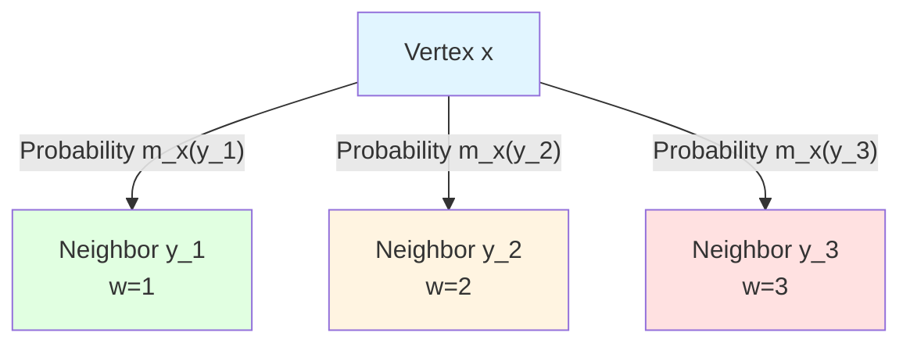
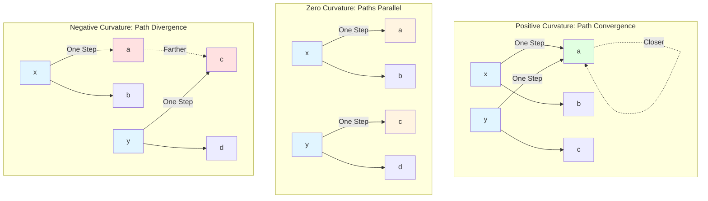

# 23.5 Discrete Ricci Curvature: Why Are Problems Hard?

> **Article Guide**
>
> In the previous two articles, we proved:
> - Bounded-degree graphs → polynomial growth $V(T) \sim T^d$
> - Exponential growth → infinite dimension $\dim_{\text{comp}} = \infty$
>
> But these are just "results", haven't answered "why": **Why** do some configuration graphs lead to polynomial growth, while others lead to exponential growth?
>
> This article introduces **discrete Ricci curvature** $\kappa(x,y)$, which characterizes "divergence or contraction of paths in local regions". We will prove:
> 1. **Non-Negative Curvature → Polynomial Growth** (Theorem 4.1): If $\kappa(x,y) \ge 0$, then $V(T) \le C T^{d_*}$;
> 2. **Negative Curvature → Exponential Growth** (Theorem 4.2): If $\kappa(x,y) \le -K_0 < 0$, then $V(T) \ge c\lambda^T$.
>
> This establishes quantitative connection between "curvature–problem difficulty": **Positive curvature corresponds to path convergence (easy to find optimal solution), negative curvature corresponds to path divergence (hard to exhaust)**.
>
> **Key Insight**: Problem's "difficulty" is not an attribute of algorithms, but a **geometric attribute** (curvature) of configuration space. P-class problems correspond to "non-negative curvature space", NP-hard problems correspond to "negative curvature space".

---

## 1. Why Do We Need Curvature? Deep Reasons from Degree to Geometry

### 1.1 Remaining Questions from Previous Article

In the previous article, we proved:

- **Theorem**: If graph's degree is bounded $\deg(x) \le D$ and edge weights are bounded, then $V(T) \sim T^{d_*}$ (polynomial);
- **Theorem**: If $V(T) \ge \lambda^n$, then $\dim_{\text{comp}} = \infty$ (infinite dimension).

**Remaining Questions**:

1. "Bounded degree" is only a **sufficient condition**, not necessary—some graphs with unbounded degree still have polynomial growth;
2. "Unbounded degree" also cannot directly imply exponential growth—need finer geometric characterization;
3. **Core Question**: What is the **essential geometric property** determining volume growth?

### 1.2 Everyday Analogy: From "Number of Intersections" to "Road Curvature"

Imagine exploring in a city:

- **Degree** corresponds to "number of roads connected at each intersection":
  - If each intersection connects at most 4 roads (bounded degree), then exploration range is limited;
  - But this doesn't tell you "whether roads are straight or curved".

- **Curvature** corresponds to "degree of road curvature":
  - **Positive Curvature** (like sphere): Roads curve inward, different paths converge together;
  - **Zero Curvature** (like plane): Roads are straight, parallel lines remain parallel;
  - **Negative Curvature** (like saddle surface): Roads curve outward, different paths diverge.

**Key Insight**:

- In **positive curvature** space, even if degree is large, volume growth is still controlled (because paths converge);
- In **negative curvature** space, even if degree is bounded, volume grows exponentially (because paths diverge).

Therefore, **curvature** more essentially determines volume growth than **degree**.

### 1.3 From Continuous to Discrete: Generalization of Ricci Curvature

In continuous Riemann geometry, **Ricci curvature** $\text{Ric}$ characterizes "average contraction or divergence of geodesics":

- **Positive Ricci Curvature**: Geodesics converge inward (e.g., sphere);
- **Negative Ricci Curvature**: Geodesics diverge outward (e.g., hyperboloid).

**Bishop-Gromov Comparison Theorem** (continuous case):

- If $\text{Ric} \ge K > 0$, then volume growth controlled by polynomial: $V(T) \le C T^d$;
- If $\text{Ricci} \le -K_0 < 0$, then volume grows exponentially: $V(T) \ge c e^{\sqrt{K_0}T}$.

In discrete complexity graphs, we need a **discrete version of Ricci curvature**, which can:

1. Be defined on discrete graphs (not depending on differential structure);
2. Characterize "divergence or contraction of local paths";
3. Control volume growth (discrete version of Bishop-Gromov theorem).

---

## 2. Local Transition Distribution: From Edges to Probability Measures

### 2.1 Definition: Local One-Step Transition Distribution

On complexity graph $G_{\text{comp}} = (X,E,w)$, we want to characterize "distribution reached after random walk one step from vertex $x$".

**Definition 2.1** (Local One-Step Transition Distribution, from euler-gls-info/02-discrete-complexity-geometry.md Definition 4.1)

On complexity graph $G_{\text{comp}} = (X,E,w)$, define **local one-step transition distribution** from $x$ as:
$$
m_x(y) = \frac{a(x,y)}{\sum_{z} a(x,z)}
$$

where:
$$
a(x,y) = \begin{cases}
\exp(-\lambda w(x,y)), & (x,y)\in E, \\
0, & \text{otherwise},
\end{cases}
$$
$\lambda > 0$ is fixed **scale parameter**.

**Explanation**:

- $a(x,y)$ has preference for "low-cost edges": smaller edge weight $w(x,y)$, larger $a(x,y)$;
- $m_x(y)$ is normalized probability distribution: $\sum_y m_x(y) = 1$;
- $\lambda$ controls "preference strength":
  - When $\lambda$ is large, only choose lowest-cost edges;
  - When $\lambda$ is small, uniformly choose all edges.

**Everyday Analogy**:

- Imagine you're at intersection, need choose a road to continue:
  - Each road has a "travel time" $w(x,y)$ (edge weight);
  - You prefer choosing "short travel time" roads, but also have certain probability to choose other roads;
  - $m_x(y)$ is "probability of choosing road $y$".

### 2.2 Example: Transition Distribution of Two-Dimensional Lattice Graph

**Example 2.2** (Two-Dimensional Lattice Graph)

Consider two-dimensional integer lattice $\mathbb{Z}^2$, each vertex $(i,j)$ has 4 neighbors (up, down, left, right), all edge weights are 1.

Transition distribution from vertex $(0,0)$:
$$
a((0,0),(0,1)) = a((0,0),(0,-1)) = a((0,0),(1,0)) = a((0,0),(-1,0)) = e^{-\lambda}
$$

Normalization:
$$
m_{(0,0)}((0,1)) = m_{(0,0)}((0,-1)) = m_{(0,0)}((1,0)) = m_{(0,0),(-1,0)} = \frac{e^{-\lambda}}{4e^{-\lambda}} = \frac{1}{4}
$$

**Observation**: Since all edge weights are same, transition distribution is **uniform distribution** (each neighbor probability 1/4).

### 2.3 Diagram: Visualization of Transition Distribution

**Explanation**:

- Vertex $x$ has 3 neighbors;
- Edge weights are 1, 2, 3 respectively;
- Transition probabilities:
  $$
  m_x(y_1) = \frac{e^{-\lambda}}{e^{-\lambda}+e^{-2\lambda}+e^{-3\lambda}} \quad (\text{largest})
  $$
  $$
  m_x(y_2) = \frac{e^{-2\lambda}}{e^{-\lambda}+e^{-2\lambda}+e^{-3\lambda}} \quad (\text{medium})
  $$
  $$
  m_x(y_3) = \frac{e^{-3\lambda}}{e^{-\lambda}+e^{-2\lambda}+e^{-3\lambda}} \quad (\text{smallest})
  $$

---

## 3. Wasserstein Distance: "Transport Cost" Between Measures

### 3.1 Definition: First-Order Wasserstein Distance

How to measure "distance" between two probability distributions $m_x$ and $m_y$?

**Definition 3.1** (First-Order Wasserstein Distance)

For two probability measures $m_x,m_y$ on $X$, define **first-order Wasserstein distance** as:
$$
W_1(m_x,m_y) = \inf_{\pi} \sum_{z,z'} d(z,z')\pi(z,z')
$$

where infimum is over all **couplings** (coupling) $\pi$, i.e., satisfying:
$$
\sum_{z'}\pi(z,z') = m_x(z), \quad \sum_z\pi(z,z') = m_y(z')
$$

**Intuitive Understanding**:

- $m_x(z)$ can be understood as "mass $m_x(z)$ at position $z$";
- We want to "transport" mass of $m_x$ to positions of $m_y$;
- $\pi(z,z')$ represents "mass transported from position $z$ to position $z'$";
- $d(z,z')$ is cost of transporting unit mass;
- $W_1(m_x,m_y)$ is total cost of "optimal transport scheme".

**Everyday Analogy**:

- Imagine you have sand distributed at positions $m_x$, need rearrange into distribution $m_y$;
- Cost of moving unit sand distance $d(z,z')$ is $d(z,z')$;
- Wasserstein distance is total cost of "most economical sand stacking scheme".

### 3.2 Kantorovich Dual Form

Wasserstein distance has an equivalent dual form, very useful in theoretical proofs:

**Proposition 3.2** (Kantorovich Dual, from euler-gls-info/02-discrete-complexity-geometry.md Appendix B.1)

$$
W_1(m_x,m_y) = \sup_{\varphi\in\text{Lip}_1} \sum_z \varphi(z)(m_x(z) - m_y(z))
$$

where $\text{Lip}_1$ is set of all **1-Lipschitz functions**, i.e., satisfying:
$$
|\varphi(z) - \varphi(z')| \le d(z,z')
$$

**Intuitive Understanding**:

- Dual form says: Wasserstein distance = "largest Lipschitz functional difference";
- This is very useful in proofs, because can avoid directly handling complex couplings.

### 3.3 Example: Wasserstein Distance of Two-Point Distribution

**Example 3.3** (Two-Point Distribution)

Consider two Dirac distributions:

- $m_x = \delta_a$ (all mass concentrated at point $a$);
- $m_y = \delta_b$ (all mass concentrated at point $b$).

Then:
$$
W_1(\delta_a,\delta_b) = d(a,b)
$$

**Proof**: Only transport scheme is "transport all mass from point $a$ to point $b$", cost is $d(a,b)$. □

---

## 4. Definition of Discrete Ricci Curvature: From Wasserstein to Curvature

### 4.1 Definition: Ricci Curvature on Complexity Graph

Now we can define discrete Ricci curvature.

**Definition 4.1** (Discrete Ricci Curvature, from euler-gls-info/02-discrete-complexity-geometry.md Definition 4.2)

For $x\neq y$, define **discrete Ricci curvature** from $x$ to $y$ as:
$$
\kappa(x,y) = 1 - \frac{W_1(m_x,m_y)}{d(x,y)}
$$

**Intuitive Understanding**:

- $d(x,y)$: Complexity distance between vertices $x$ and $y$ (shortest path cost);
- $W_1(m_x,m_y)$: Wasserstein distance between two distributions after random walk one step from $x$ and $y$;
- If $W_1(m_x,m_y) < d(x,y)$, then $\kappa(x,y) > 0$: **Path convergence** (positive curvature);
- If $W_1(m_x,m_y) > d(x,y)$, then $\kappa(x,y) < 0$: **Path divergence** (negative curvature).

**Symbol Interpretation**:

- $\kappa(x,y) > 0$: Non-negative curvature, paths converge, volume growth controlled;
- $\kappa(x,y) = 0$: Zero curvature, paths parallel, linear growth;
- $\kappa(x,y) < 0$: Negative curvature, paths diverge, exponential growth.

**Everyday Analogy**:

- **Positive Curvature** (sphere): Two people start from different points on equator, walk north, will meet at north pole (paths converge);
- **Zero Curvature** (plane): Two people walk along parallel lines, always maintain same distance (paths parallel);
- **Negative Curvature** (saddle surface): Two people start from different points at center, will walk farther apart (paths diverge).

### 4.2 Example: Curvature of Two-Dimensional Lattice Graph

**Example 4.2** (Curvature of Two-Dimensional Lattice Graph)

Consider two-dimensional integer lattice $\mathbb{Z}^2$, all edge weights are 1. Calculate curvature between adjacent vertices $(0,0)$ and $(1,0)$.

1. **Complexity Distance**: $d((0,0),(1,0)) = 1$ (one step reachable).

2. **Transition Distributions**:
   - $m_{(0,0)}$ uniformly distributed on 4 neighbors $(0,1),(0,-1),(1,0),(-1,0)$, each probability 1/4;
   - $m_{(1,0)}$ uniformly distributed on 4 neighbors $(1,1),(1,-1),(2,0),(0,0)$, each probability 1/4.

3. **Wasserstein Distance**:
   - Two distributions have 1 common support point: (0,0) and (1,0);
   - Mass to "transport": 3/4 (from 3 neighbors on one side to 3 neighbors on other side);
   - Average transport distance: approximately 1 (adjacent lattice sites);
   - $W_1(m_{(0,0)},m_{(1,0)}) \approx 1$.

4. **Curvature**:
   $$
   \kappa((0,0),(1,0)) = 1 - \frac{W_1}{d} \approx 1 - \frac{1}{1} = 0
   $$

**Conclusion**: Two-dimensional lattice graph's curvature is **approximately 0** (zero curvature), corresponding to plane geometry.

### 4.3 Diagram: Comparison of Positive, Zero, and Negative Curvature

**Explanation**:

- **Positive Curvature**: From $x$ and $y$ walk one step, Wasserstein distance between two distributions **less than** $d(x,y)$ (paths converge);
- **Zero Curvature**: Wasserstein distance **equals** $d(x,y)$ (paths parallel);
- **Negative Curvature**: Wasserstein distance **greater than** $d(x,y)$ (paths diverge).

---

## 5. Curvature and Volume Growth: Core Theorems

### 5.1 Theorem: Non-Negative Curvature → Polynomial Growth

**Theorem 5.1** (Polynomial Growth Under Non-Negative Curvature, from euler-gls-info/02-discrete-complexity-geometry.md Theorem 4.4)

Assume complexity graph is locally finite directed graph, its symmetric version has bounded degree, and there exists $K \ge 0$, such that for all adjacent $x,y$:
$$
\kappa(x,y) \ge K
$$

Then there exist constants $C,d_* > 0$ and $T_0 > 0$, such that for all $T \ge T_0$:
$$
V_{x_0}(T) \le C T^{d_*}
$$

In particular, $\overline{\dim}_{\text{comp}}(x_0) \le d_*$.

**Proof Strategy** (from euler-gls-info/02-discrete-complexity-geometry.md Appendix B.2):

1. **Meaning of Curvature Lower Bound**:
   - If $\kappa(x,y) \ge K \ge 0$, then $W_1(m_x,m_y) \le (1-K)d(x,y)$;
   - This means "from $x$ and $y$ random walk one step, distance between two distributions shrinks to at most $(1-K)$ times original".

2. **Contraction Property of Random Walk**:
   - Let $P$ be transition operator (defined by $m_x$);
   - For any two distributions $\mu,\nu$, we have:
     $$
     W_1(\mu P,\nu P) \le (1-K)W_1(\mu,\nu)
     $$
   - This shows random walk contracts distributions each step.

3. **Control of Volume Growth**:
   - Contraction property means "random walk from starting point doesn't spread quickly";
   - Use discrete version of Bishop-Gromov comparison theorem (similar to continuous case);
   - Can prove complexity ball volume grows at most polynomially: $V(T) \le C T^{d_*}$.

QED. □

**Everyday Analogy**:

- In **positive curvature** space (e.g., sphere), even if you can walk in any direction, but because "space curves inward", range you can reach is limited (polynomial growth).

### 5.2 Theorem: Negative Curvature → Exponential Growth

**Theorem 5.2** (Exponential Growth Under Strict Negative Curvature, from euler-gls-info/02-discrete-complexity-geometry.md Theorem 4.5)

Assume there exist $K_0 > 0$ and $\delta > 0$, such that for all point pairs satisfying $d(x,y) \le \delta$:
$$
\kappa(x,y) \le -K_0
$$

Then there exist constants $c,\lambda > 1$ and $T_0 > 0$, such that for all $n\in\mathbb{N}$:
$$
V_{x_0}(n T_0) \ge c \lambda^n
$$

**Proof Strategy** (from euler-gls-info/02-discrete-complexity-geometry.md Appendix B.3):

1. **Meaning of Curvature Upper Bound**:
   - If $\kappa(x,y) \le -K_0 < 0$, then $W_1(m_x,m_y) \ge (1+K_0)d(x,y)$;
   - This means "from $x$ and $y$ random walk one step, distance between two distributions expands to at least $(1+K_0)$ times original".

2. **Divergence Property of Random Walk**:
   - For any two distributions $\mu,\nu$, we have:
     $$
     W_1(\mu P,\nu P) \ge (1+K_0)W_1(\mu,\nu)
     $$
   - This shows random walk diverges distributions each step.

3. **Construction of Tree-Like Expanding Subgraph**:
   - Using divergence property, can find a "tree-like expansion" subgraph in complexity graph;
   - In this subgraph, from $x_0$, each fixed budget increase $T_0$, reachable points multiply by constant factor $\lambda$;
   - Therefore $V(nT_0) \ge c\lambda^n$ (exponential growth).

QED. □

**Everyday Analogy**:

- In **negative curvature** space (e.g., saddle surface), because "space curves outward", different paths diverge quickly, range you can reach grows exponentially.

### 5.3 Comparison Table: Curvature and Volume Growth

| Curvature $\kappa(x,y)$ | Wasserstein Distance | Random Walk Behavior | Volume Growth $V(T)$ | Complexity Dimension | Typical Space |
|------------------------|---------------------|---------------------|---------------------|---------------------|--------------|
| $\kappa \ge K > 0$ | $W_1 \le (1-K)d$ | Contraction (Convergence) | $\le C T^{d_*}$ | $\dim < \infty$ | Sphere, Positive Curvature Manifold |
| $\kappa = 0$ | $W_1 = d$ | Parallel | $\sim T^d$ | $\dim = d$ | Plane, Euclidean Space |
| $\kappa \le -K_0 < 0$ | $W_1 \ge (1+K_0)d$ | Divergence | $\ge c\lambda^T$ | $\dim = \infty$ | Hyperboloid, Negative Curvature Manifold |

---

## 6. Calculation Methods of Curvature: How to Calculate $\kappa(x,y)$ in Practical Problems

### 6.1 Step 1: Calculate Transition Distribution $m_x$

Given complexity graph $G_{\text{comp}} = (X,E,w)$ and vertex $x$:

1. Find all neighbors of $x$: $N(x) = \{y : (x,y)\in E\}$;
2. Calculate weights $a(x,y) = \exp(-\lambda w(x,y))$;
3. Normalize: $m_x(y) = a(x,y) / \sum_{z\in N(x)} a(x,z)$.

### 6.2 Step 2: Calculate Wasserstein Distance $W_1(m_x,m_y)$

For two discrete distributions $m_x$ and $m_y$:

1. **Simplified Case** (non-overlapping support):
   - If supports of $m_x$ and $m_y$ completely non-overlapping, then:
     $$
     W_1(m_x,m_y) = \sum_{z\in N(x)} m_x(z) d(z,y) = \mathbb{E}_{z\sim m_x}[d(z,y)]
     $$

2. **General Case**:
   - Need solve optimal transport problem (linear programming);
   - On small-scale graphs can use simplex method or network flow algorithms.

### 6.3 Step 3: Calculate Curvature $\kappa(x,y)$

$$
\kappa(x,y) = 1 - \frac{W_1(m_x,m_y)}{d(x,y)}
$$

### 6.4 Example: Curvature of Complete Binary Tree

**Example 6.1** (Negative Curvature of Complete Binary Tree)

Consider complete binary tree, each node has 2 child nodes, all edge weights are 1.

1. **Choose Two Adjacent Vertices**: Root node $r$ and its left child $l$;
2. **Complexity Distance**: $d(r,l) = 1$;
3. **Transition Distributions**:
   - $m_r$ uniformly distributed on left child $l$ and right child $r'$: $m_r(l) = m_r(r') = 1/2$;
   - $m_l$ uniformly distributed on root $r$ and its two child nodes $l_1,l_2$: $m_l(r) = m_l(l_1) = m_l(l_2) = 1/3$.
4. **Wasserstein Distance**:
   - Common support: Only overlap between $r$ (root) and $l$ (left child);
   - Mass to transport: From $m_r$'s $r'$ to $m_l$'s $l_1,l_2$;
   - Transport distance: $d(r',l_1) = d(r',l_2) = 2$ (two steps);
   - $W_1(m_r,m_l) \approx 1/2 \cdot 0 + 1/2 \cdot 2 = 1$ (simplified estimate).
5. **Curvature**:
   $$
   \kappa(r,l) \approx 1 - \frac{1}{1} = 0 \quad \text{or slightly negative}
   $$

**Observation**: Complete binary tree's curvature is **close to 0 or slightly negative**, which explains why it has exponential growth.

---

## 7. Correspondence Between Curvature and Problem Difficulty: Analysis of Practical Problems

### 7.1 Sorting Problem: Positive Curvature → P-Class

**Problem**: Given $n$ numbers, sort them.

**Configuration Space**: All possible permutations, size $n!$.

**Algorithm**: Merge sort (divide and conquer)

- Each step operation: Compare and merge;
- Configuration graph: Each configuration (partially ordered) has $O(n)$ successors (positions can merge);
- **Curvature Analysis**:
  - Near "nearly ordered" configurations, different paths converge to "completely ordered" state;
  - Curvature $\kappa(x,y) \ge 0$ (non-negative);
  - Volume growth $V(T) = O(T^{\log n})$ (polynomial).

**Conclusion**: Sorting problem corresponds to **non-negative curvature space**, belongs to P-class.

### 7.2 Traveling Salesman Problem: Negative Curvature → NP-Hard

**Problem**: Given $n$ cities, find shortest path visiting all cities.

**Configuration Space**: All possible visit orders, size $n!$.

**Algorithm**: Brute force search (exhaustive)

- Each step operation: Swap order of two cities;
- Configuration graph: Each configuration has $O(n^2)$ successors (can swap any two cities);
- **Curvature Analysis**:
  - In configuration space, different paths diverge quickly (no obvious "convergence point");
  - Curvature $\kappa(x,y) < 0$ (negative);
  - Volume growth $V(T) = O(2^T)$ (exponential).

**Conclusion**: Traveling salesman problem corresponds to **negative curvature space**, belongs to NP-hard.

### 7.3 3-SAT Problem: Negative Curvature → NP-Complete

**Problem**: Given Boolean formula (conjunctive normal form), determine if satisfiable.

**Configuration Space**: All possible variable assignments, size $2^n$.

**Algorithm**: Backtracking search (exhaustive)

- Each step operation: Assign value to one variable (True or False);
- Configuration graph: Tree structure, each node splits into 2 child nodes;
- **Curvature Analysis**:
  - Tree structure naturally has negative curvature (splits each layer);
  - Curvature $\kappa(x,y) \approx -1$ (strongly negative);
  - Volume growth $V(T) = O(2^T)$ (exponential).

**Conclusion**: 3-SAT problem corresponds to **strongly negative curvature space**, belongs to NP-complete.

---

## 8. Summary and Key Formula Review

### 8.1 Core Definitions

| Concept | Definition | Source |
|---------|------------|--------|
| **Transition Distribution** | $m_x(y) = \frac{\exp(-\lambda w(x,y))}{\sum_z \exp(-\lambda w(x,z))}$ | Definition 2.1 |
| **Wasserstein Distance** | $W_1(m_x,m_y) = \inf_\pi \sum_{z,z'} d(z,z')\pi(z,z')$ | Definition 3.1 |
| **Discrete Ricci Curvature** | $\kappa(x,y) = 1 - \frac{W_1(m_x,m_y)}{d(x,y)}$ | Definition 4.1 |

### 8.2 Core Theorems

| Theorem | Condition | Conclusion | Number |
|---------|-----------|------------|--------|
| **Non-Negative Curvature → Polynomial** | $\kappa(x,y) \ge K \ge 0$ | $V(T) \le C T^{d_*}$, $\dim_{\text{comp}} \le d_*$ | Theorem 5.1 |
| **Negative Curvature → Exponential** | $\kappa(x,y) \le -K_0 < 0$ | $V(T) \ge c\lambda^T$, $\dim_{\text{comp}} = \infty$ | Theorem 5.2 |
| **Curvature and Contraction** | $\kappa(x,y) \ge K$ | $W_1(\mu P,\nu P) \le (1-K)W_1(\mu,\nu)$ | Theorem 4.3 |

### 8.3 Key Formulas

| Formula | Meaning | Source |
|---------|---------|--------|
| $\kappa(x,y) > 0$ | Positive curvature, paths converge, polynomial growth | Definition 4.1 |
| $\kappa(x,y) = 0$ | Zero curvature, paths parallel, linear/polynomial growth | Definition 4.1 |
| $\kappa(x,y) < 0$ | Negative curvature, paths diverge, exponential growth | Definition 4.1 |
| $W_1(\delta_a,\delta_b) = d(a,b)$ | Wasserstein distance of Dirac distributions | Example 3.3 |

### 8.4 Everyday Analogy Summary

| Geometric Concept | Everyday Analogy |
|-------------------|------------------|
| Positive Curvature | Sphere: Walking north will meet at north pole (paths converge) |
| Zero Curvature | Plane: Parallel lines remain parallel (paths parallel) |
| Negative Curvature | Saddle Surface: Walking from center will go farther apart (paths diverge) |
| Wasserstein Distance | Total cost of optimal sand stacking transport scheme |
| Transition Distribution | Probability distribution of choosing roads at intersection |

### 8.5 Interface with Previous Articles

- **23.3**: Defined complexity graph, complexity distance, complexity ball;
- **23.4**: Proved bounded degree → polynomial, exponential → infinite dimension;
- **This Article (23.5)**: Introduced discrete Ricci curvature, proved curvature ↔ volume growth, established quantitative connection between "curvature–problem difficulty";
- **Next Article (23.6)**: Will introduce information geometry, study relationship between "task-perceived information distance" and complexity.

### 8.6 Key Insights

1. **Curvature More Essential Than Degree**:
   - Bounded degree is only sufficient condition, non-negative curvature is essential reason;
   - Negative curvature leads to exponential growth even in graphs with bounded degree.

2. **Curvature Characterizes Geometric Behavior of Paths**:
   - Positive curvature: Paths converge, easy to find optimal solution (P-class);
   - Negative curvature: Paths diverge, hard to exhaust all possibilities (NP-hard).

3. **Contraction and Divergence of Random Walk**:
   - Positive curvature → Wasserstein distance contracts each step → volume growth controlled;
   - Negative curvature → Wasserstein distance diverges each step → volume exponential explosion.

4. **Problem Difficulty Is Geometric Attribute**:
   - P/NP is not just "algorithm attribute", but "geometric attribute of configuration space";
   - Curvature is geometric invariant, doesn't depend on specific algorithm choice.

---

## 9. Open Problems and Outlook

1. **Precise Calculation of Curvature**:
   - For given complexity graph, how to efficiently calculate curvature $\kappa(x,y)$ for all edges?
   - Does there exist method of "local curvature sampling" to estimate global curvature distribution?

2. **Curvature and Algorithm Design**:
   - Can we use curvature information to guide search algorithms? (e.g., prioritize exploring "high curvature regions")
   - Can we design "curvature-adaptive" heuristic algorithms?

3. **Curvature Interpretation of Quantum Algorithms**:
   - What curvature do Shor's algorithm, Grover search correspond to in classical configuration space?
   - How does quantum interference change effective curvature?

4. **Higher-Order Curvature**:
   - Ricci curvature is "average of sectional curvature", can we define "sectional curvature" on discrete graphs?
   - What is meaning of higher-order curvature (Riemann curvature tensor) in complexity geometry?

These questions will be partially explored in subsequent chapters.

---

**Preview of Next Article**: 23.6 Task-Perceived Information Geometry: From Complexity to Information

In next article, we will introduce **information geometry**, studying:

1. **Observation Operator Family** $\mathcal{O} = \{O_j : X\to\Delta(Y_j)\}$: How to measure "information" of configuration?
2. **Task Relative Entropy** $D_Q(x\|y)$: Information difference between different configurations under specific task;
3. **Jensen-Shannon Distance** $d_{\text{JS},Q}(x,y)$: Task-perceived information distance;
4. **Fisher Information Matrix** $g_{ij}^{(Q)}$: Metric tensor of information geometry;
5. **Relationship Between Information Dimension and Complexity Dimension**: $\dim_{\text{info},Q} \le \dim_{\text{comp}}$ (theorem).

Through these techniques, we will see: Complexity geometry (Articles 23.3-23.5) and information geometry (Articles 23.6-23.7) are **two complementary perspectives** of configuration space—former characterizes "path cost", latter characterizes "information quality".

**Source Theory**: euler-gls-info/02-discrete-complexity-geometry.md, euler-gls-info/03-discrete-information-geometry.md

