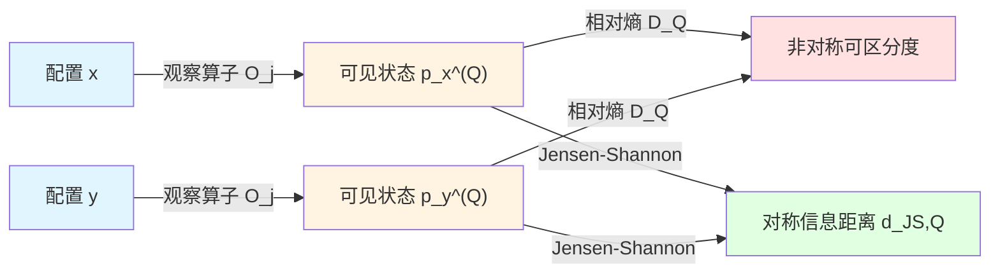
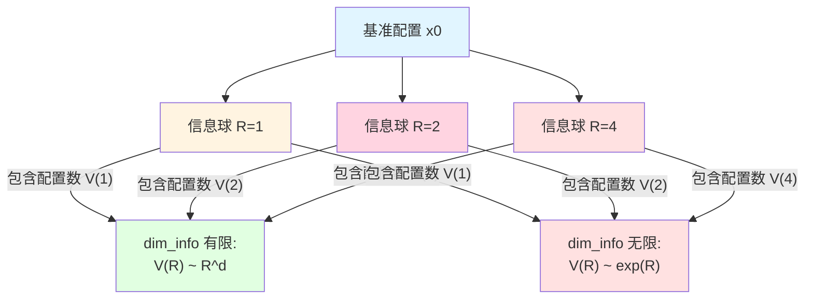
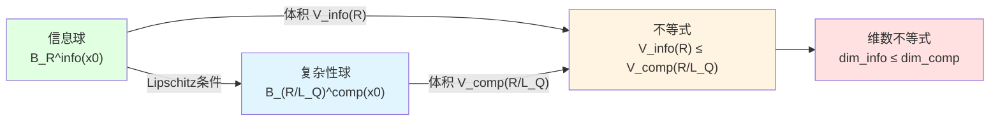
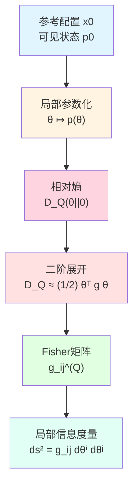
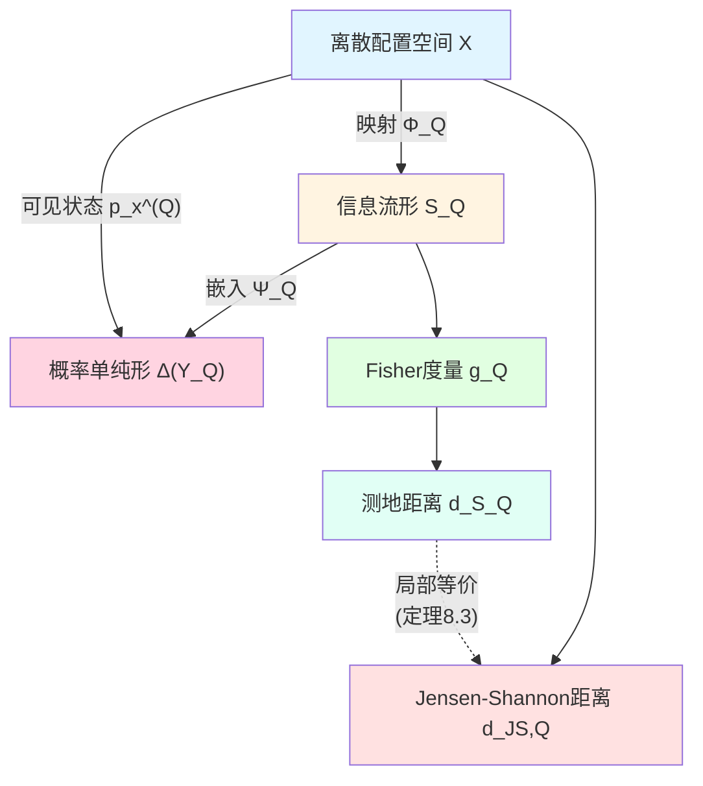
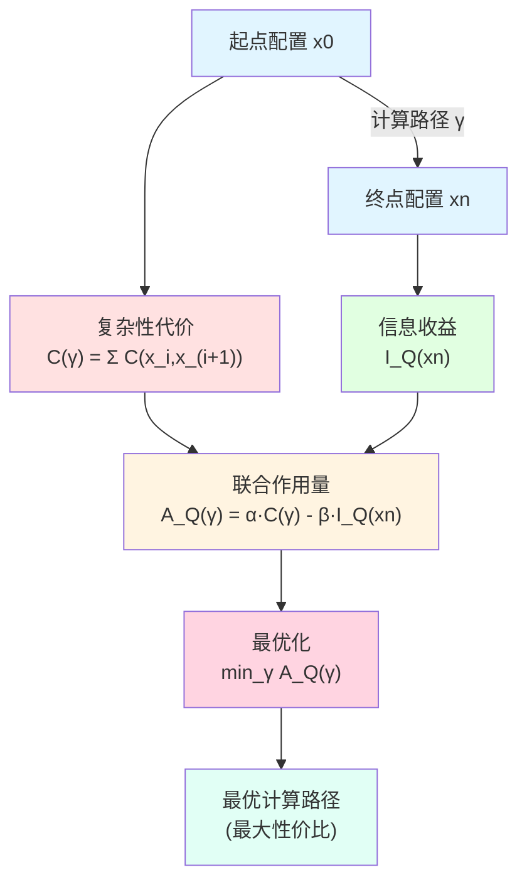
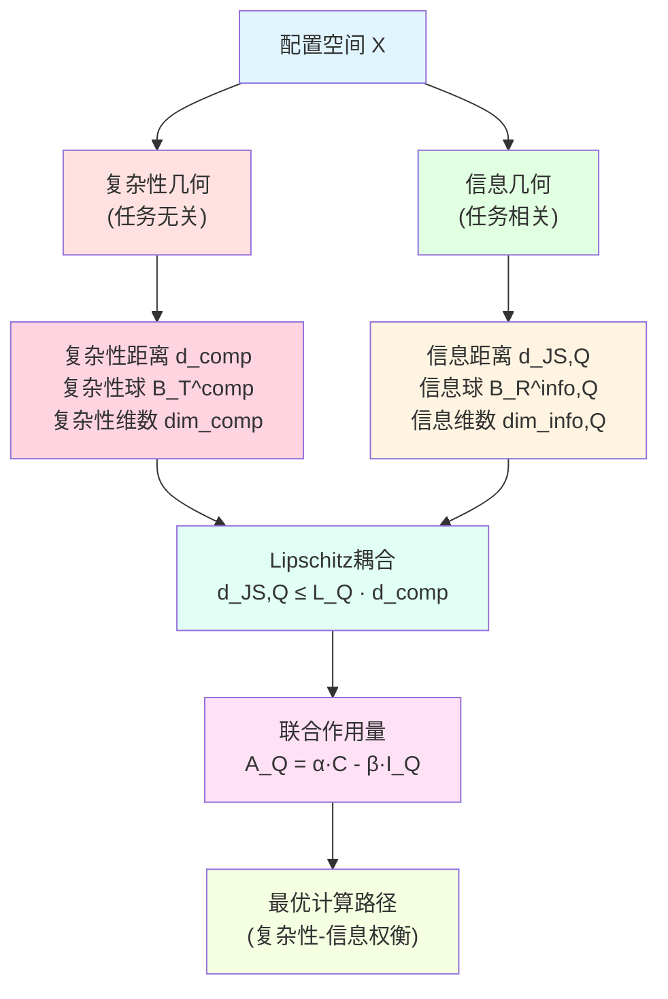

# 23.6 从复杂性到信息:任务感知的信息几何

在前面几篇中,我们学习了计算宇宙的复杂性几何:复杂性距离 $d(x,y)$ 告诉我们从配置 $x$ 走到 $y$ 需要付出多少代价,复杂性维数和Ricci曲率刻画了问题的难度。但这些都只回答了"计算有多难"的问题,没有回答"我们得到了什么"。

就像登山一样,复杂性几何告诉你山有多高、多陡,但没有告诉你山顶的风景有多美。**信息几何**就是要回答这第二个问题:在有限的计算资源下,我们能获取多少有用的信息?不同的任务对"有用"的定义不同,因此信息几何是**任务感知**的。

本文基于 euler-gls-info/03-discrete-information-geometry.md,在完全离散的设定下构造任务感知的信息几何理论。

---

## 1. 为什么需要信息几何?日常类比

### 1.1 从地图到风景:两种距离

想象你在一座城市中,有两种方式衡量两个地点之间的"距离":

**物理距离**:从A到B需要走多少米,这是复杂性距离的类比。无论你去B做什么,物理距离都是一样的。

**信息距离**:从A到B你的"视野变化"有多大。
- 如果你是摄影师,关心的是景色变化,那么从室内走到海边的"信息距离"很大,因为视野完全不同;
- 如果你是外卖员,关心的是订单号,那么从一家餐厅走到另一家的"信息距离"取决于菜单的相似度,而不是物理距离。

**核心洞察**:
- 物理距离(复杂性距离)是任务无关的,只看"走了多远";
- 信息距离是任务相关的,看"观察到的东西变了多少"。

同样的物理路径,对不同任务有不同的信息价值。

### 1.2 旅行的价值:复杂性与信息的权衡

继续旅行的比喻:
- **复杂性代价**:旅行需要时间、金钱、体力;
- **信息收益**:旅行让你看到新风景、了解新文化、获得新体验。

理性的旅行者会权衡这两者:
- 如果你只有一天时间,就去附近的景点(低复杂性,中等信息);
- 如果你有一周时间,可以去远方(高复杂性,高信息);
- 如果景点太相似,即使很近也没必要都去(低复杂性,低信息增益)。

**信息几何就是在计算宇宙中做这样的权衡**:给定有限的计算时间,选择能最大化信息收益的计算路径。

---

## 2. 观察算子:配置的"可见状态"

**源理论**:euler-gls-info/03-discrete-information-geometry.md 定义2.1, 定义2.2

### 2.1 为什么配置不能直接观察?

在计算宇宙中,配置 $x\in X$ 是完整的内部状态,可能包含海量信息(例如一个有 $10^{23}$ 个量子比特的宇宙配置)。但观察者永远只能通过有限的实验或测量来访问它,就像:
- 你无法"看到"整个地球,只能通过卫星照片、气象数据、地图等有限渠道了解它;
- 你无法"读取"一个大脑的所有神经元状态,只能通过脑电图、fMRI、行为测试等有限手段观察它。

因此,我们需要**观察算子**来描述"在某个任务下,我们能看到配置的哪些方面"。

### 2.2 观察算子的数学定义

**定义 2.1**(观察算子族,源自 euler-gls-info/03-discrete-information-geometry.md 定义2.1)

设 $(Y_j)_{j\in J}$ 为一族有限结果集合。一个观察算子族是映射集合

$$
\mathcal{O} = \{ O_j : X \to \Delta(Y_j) \}_{j\in J},
$$

其中 $\Delta(Y_j)$ 为在 $Y_j$ 上的概率单纯形,且对每个 $x\in X$、$j\in J$,$O_j(x) = p_x^{(j)}$ 是一次实验在结果集合 $Y_j$ 上的结果分布。

**日常解读**:
- $Y_j$ 是某个观测的"可能结果集",例如:
  - 测量温度:$Y_j = \{0^\circ, 1^\circ, \dots, 100^\circ\}$;
  - 图像分类:$Y_j = \{\text{猫}, \text{狗}, \text{鸟}\}$;
  - 量子测量:$Y_j = \{|0\rangle, |1\rangle\}$。
- $O_j(x)$ 是配置 $x$ 在观测 $j$ 下的结果分布。例如,如果 $x$ 是"微热的水",$O_{\text{温度}}(x)$ 可能是 $p(30^\circ) = 0.7, p(31^\circ) = 0.3$。
- 观察算子族 $\mathcal{O}$ 就是所有可用观测手段的集合。

### 2.3 任务 $Q$:选择关心哪些观测

**定义 2.2**(任务 $Q$ 下的联合可见状态,源自 euler-gls-info/03-discrete-information-geometry.md 定义2.2)

对给定有限任务集合 $Q\subset J$,定义可见结果集合

$$
Y_Q = \prod_{j\in Q} Y_j,
$$

并定义配置 $x$ 的联合可见状态为一个在 $Y_Q$ 上的联合分布 $p_x^{(Q)}$。最简单的构造是假设各观测独立,在此情况下

$$
p_x^{(Q)}(y) = \prod_{j\in Q} p_x^{(j)}(y_j),
\quad y = (y_j)_{j\in Q}\in Y_Q.
$$

**日常类比**:
- 任务 $Q$ 就是"我关心的观测列表"。例如:
  - 天气预报任务:$Q = \{\text{温度}, \text{湿度}, \text{气压}\}$;
  - 医学诊断任务:$Q = \{\text{体温}, \text{血压}, \text{心率}\}$;
  - 图像识别任务:$Q = \{\text{颜色直方图}, \text{边缘检测}, \text{纹理特征}\}$。
- 联合可见状态 $p_x^{(Q)}$ 就是配置 $x$ 在这些观测下的"综合表现"。

**关键洞察**:不同的任务 $Q$ 会看到同一配置 $x$ 的不同"侧面"。例如:
- 对于识别猫狗的任务,$x_1=\text{"一只猫"}$ 和 $x_2=\text{"另一只猫"}$ 的可见状态可能很接近;
- 对于识别猫品种的任务,$x_1$ 和 $x_2$ 的可见状态可能很远(一只是波斯猫,另一只是暹罗猫)。

---

## 3. 任务感知的相对熵:可区分程度

**源理论**:euler-gls-info/03-discrete-information-geometry.md 定义2.3

### 3.1 相对熵:两个配置在任务下有多不同?

**定义 3.1**(任务 $Q$ 下的相对熵,源自 euler-gls-info/03-discrete-information-geometry.md 定义2.3)

对配置 $x,y\in X$,若对所有 $z\in Y_Q$ 有 $p_y^{(Q)}(z) > 0$ 蕴含 $p_x^{(Q)}(z) > 0$,则定义

$$
D_Q(x\Vert y)
=
\sum_{z\in Y_Q}
p_x^{(Q)}(z)\,\log\frac{p_x^{(Q)}(z)}{p_y^{(Q)}(z)},
$$

否则定义 $D_Q(x\Vert y) = +\infty$。

**日常解读**:
- $D_Q(x\Vert y)$ 衡量的是"在任务 $Q$ 下,我能多容易地区分 $x$ 和 $y$"。
- 如果 $D_Q(x\Vert y) = 0$,说明在任务 $Q$ 下,$x$ 和 $y$ 完全无法区分(虽然它们在配置空间中可能是不同的点);
- 如果 $D_Q(x\Vert y)$ 很大,说明在任务 $Q$ 下,$x$ 和 $y$ 非常容易区分。

### 3.2 日常类比:双胞胎的可区分度

想象两个双胞胎 Alice 和 Bob:
- **任务 $Q_1$:人脸识别**
  - 可见状态:$p_{Alice}^{(Q_1)} \approx p_{Bob}^{(Q_1)}$(脸很像)
  - 相对熵:$D_{Q_1}(Alice\Vert Bob) \approx 0$(几乎无法区分)
- **任务 $Q_2$:指纹识别**
  - 可见状态:$p_{Alice}^{(Q_2)} \neq p_{Bob}^{(Q_2)}$(指纹不同)
  - 相对熵:$D_{Q_2}(Alice\Vert Bob) > 0$(可以区分)
- **任务 $Q_3$:DNA测序**
  - 可见状态:$p_{Alice}^{(Q_3)} \approx p_{Bob}^{(Q_3)}$(DNA高度相似)
  - 相对熵:$D_{Q_3}(Alice\Vert Bob) \approx 0$(几乎无法区分)

**核心洞察**:同样两个配置,在不同任务下的"信息距离"完全不同。

### 3.3 相对熵的性质

**命题 3.2**(相对熵的基本性质)

1. **非负性**:$D_Q(x\Vert y) \ge 0$,且等号成立当且仅当 $p_x^{(Q)} = p_y^{(Q)}$;
2. **非对称性**:一般 $D_Q(x\Vert y) \neq D_Q(y\Vert x)$;
3. **不满足三角不等式**:相对熵不是度量。

**日常解读**:
- 非负性:不可区分度不能是负数;
- 非对称性:"从 $x$ 看 $y$" 和 "从 $y$ 看 $x$" 的惊讶程度不同。例如,从"见过很多猫"的人(配置 $x$)看到一只猫(配置 $y$)不惊讶($D_Q(x\Vert y)$ 小),但从"从未见过猫"的人(配置 $y$)看到第一只猫(配置 $x$)很惊讶($D_Q(y\Vert x)$ 大);
- 不满足三角不等式:这就是为什么我们需要对称化。

---

## 4. 信息距离:对称化与度量性质

**源理论**:euler-gls-info/03-discrete-information-geometry.md 定义3.1

### 4.1 Jensen-Shannon距离

**定义 4.1**(任务 $Q$ 下的 Jensen–Shannon 散度与信息距离,源自 euler-gls-info/03-discrete-information-geometry.md 定义3.1)

对 $x,y\in X$,定义混合分布

$$
m_{x,y}^{(Q)} = \frac12\big(p_x^{(Q)} + p_y^{(Q)}\big),
$$

Jensen–Shannon 散度

$$
\mathrm{JS}_Q(x,y)
=
\frac12 D\big(p_x^{(Q)}\Vert m_{x,y}^{(Q)}\big)
+
\frac12 D\big(p_y^{(Q)}\Vert m_{x,y}^{(Q)}\big),
$$

并定义信息距离

$$
d_{\mathrm{JS},Q}(x,y) = \sqrt{2\,\mathrm{JS}_Q(x,y)}.
$$

**日常解读**:
- 混合分布 $m_{x,y}^{(Q)}$ 就是"把 $x$ 和 $y$ 的观测结果各取一半";
- $\mathrm{JS}_Q(x,y)$ 衡量的是"$x$ 和 $y$ 各自偏离平均的程度";
- $d_{\mathrm{JS},Q}(x,y)$ 是对称的,且满足度量公理。

### 4.2 为什么平方根?

Jensen–Shannon散度本身不满足三角不等式,但它的平方根满足。这是一个数学事实,类似于欧氏空间中"距离平方不满足三角不等式,但距离满足"。

**定理 4.2**(信息距离的度量性质)

$d_{\mathrm{JS},Q}$ 是 $X$ 上关于任务 $Q$ 的度量:满足非负性、对称性、三角不等式,且 $d_{\mathrm{JS},Q}(x,y) = 0$ 当且仅当 $p_x^{(Q)} = p_y^{(Q)}$。

### 4.3 日常类比:城市的"印象距离"

想象你访问过很多城市,每个城市给你的"印象"可以用一个概率分布描述:
- 巴黎:$p_{\text{巴黎}}(\text{建筑}) = 0.4, p_{\text{巴黎}}(\text{美食}) = 0.3, p_{\text{巴黎}}(\text{艺术}) = 0.3$
- 罗马:$p_{\text{罗马}}(\text{建筑}) = 0.5, p_{\text{罗马}}(\text{美食}) = 0.3, p_{\text{罗马}}(\text{艺术}) = 0.2$
- 东京:$p_{\text{东京}}(\text{建筑}) = 0.2, p_{\text{东京}}(\text{美食}) = 0.5, p_{\text{东京}}(\text{艺术}) = 0.3$

则:
- 巴黎与罗马的"印象距离"$d_{\mathrm{JS}}(\text{巴黎},\text{罗马})$ 相对较小(都是欧洲古城);
- 巴黎与东京的"印象距离"$d_{\mathrm{JS}}(\text{巴黎},\text{东京})$ 相对较大(文化差异大)。

这个"印象距离"就是信息距离的日常版本。

---

## 5. 信息球与信息维数

**源理论**:euler-gls-info/03-discrete-information-geometry.md 定义3.2, 定义3.3

### 5.1 信息球:任务下的"可达范围"

**定义 5.1**(信息球与信息体积,源自 euler-gls-info/03-discrete-information-geometry.md 定义3.2)

对基准配置 $x_0\in X$、任务 $Q$ 与半径 $R>0$,定义信息球

$$
B_R^{\mathrm{info},Q}(x_0)
=
\{ x\in X : d_{\mathrm{JS},Q}(x,x_0) \le R \},
$$

信息体积

$$
V_{x_0}^{\mathrm{info},Q}(R)
=
\big|B_R^{\mathrm{info},Q}(x_0)\big|.
$$

**日常解读**:
- 信息球 $B_R^{\mathrm{info},Q}(x_0)$ 是"在任务 $Q$ 下,与 $x_0$ 的信息距离不超过 $R$ 的所有配置";
- 信息体积 $V_{x_0}^{\mathrm{info},Q}(R)$ 是这些配置的数目。

### 5.2 日常类比:音乐的"风格相似度"

以音乐推荐为例:
- $x_0$ 是你最喜欢的一首歌;
- 任务 $Q$ 是"音乐风格识别"(观测:节奏、和声、音色等);
- 信息球 $B_R^{\mathrm{info},Q}(x_0)$ 就是"风格与 $x_0$ 相似度在 $R$ 以内的所有歌曲";
- 信息体积 $V_{x_0}^{\mathrm{info},Q}(R)$ 就是这些歌曲的数量。

如果 $R$ 很小,只有几首"几乎一模一样"的歌;如果 $R$ 很大,可能包括同流派的上千首歌。

### 5.3 信息维数:任务的复杂度

**定义 5.2**(信息维数,源自 euler-gls-info/03-discrete-information-geometry.md 定义3.3)

对给定任务 $Q$ 与基准 $x_0$,定义上信息维数

$$
\overline{\dim}_{\mathrm{info},Q}(x_0)
=
\limsup_{R\to\infty}
\frac{\log V_{x_0}^{\mathrm{info},Q}(R)}{\log R},
$$

下信息维数

$$
\underline{\dim}_{\mathrm{info},Q}(x_0)
=
\liminf_{R\to\infty}
\frac{\log V_{x_0}^{\mathrm{info},Q}(R)}{\log R}.
$$

若二者相等,则称共同值为信息维数,记为 $\dim_{\mathrm{info},Q}(x_0)$。

**日常解读**:
- 信息维数 $\dim_{\mathrm{info},Q}(x_0)$ 衡量的是"在任务 $Q$ 下,可区分状态的数量随半径的增长速度";
- 如果 $\dim_{\mathrm{info},Q} = 0$,说明任务 $Q$ 几乎无法区分不同配置(例如"颜色盲测试"对色盲患者);
- 如果 $\dim_{\mathrm{info},Q} = d$ 有限,说明任务 $Q$ 实际上只看到一个 $d$ 维的信息结构;
- 如果 $\dim_{\mathrm{info},Q} = \infty$,说明任务 $Q$ 具有无限的区分能力(例如"完美记忆测试")。

### 5.4 例子:图像识别任务的信息维数

考虑 $28\times 28$ 灰度图像(如MNIST手写数字):
- **配置空间 $X$**:所有 $256^{784}$ 种可能的图像;
- **任务 $Q_1$:数字识别**(0-9)
  - 可见状态:10个类别的概率分布;
  - 信息维数:$\dim_{\mathrm{info},Q_1} \approx 9$(因为10类在9维单纯形上);
- **任务 $Q_2$:像素重建**
  - 可见状态:全部784个像素值;
  - 信息维数:$\dim_{\mathrm{info},Q_2} \approx 784$。

**核心洞察**:同样的配置空间,不同任务的信息维数可以相差巨大。任务 $Q_1$ 只需要低维信息,任务 $Q_2$ 需要高维信息。

---

## 6. 信息维数与复杂性维数的关系

**源理论**:euler-gls-info/03-discrete-information-geometry.md 命题3.4

### 6.1 核心不等式:信息受限于复杂性

**定理 6.1**(信息维数受复杂性维数约束,源自 euler-gls-info/03-discrete-information-geometry.md 命题3.4)

假设存在常数 $L_Q>0$,使得对所有相邻配置 $x,y$(即 $(x,y)\in\mathsf{T}$)有

$$
d_{\mathrm{JS},Q}(x,y)
\le L_Q\,\mathsf{C}(x,y),
$$

则存在常数 $C>0$,使得对所有 $R>0$ 有

$$
V_{x_0}^{\mathrm{info},Q}(R)
\le
V_{x_0}^{\mathrm{comp}}\!\left(\frac{R}{C}\right).
$$

从而

$$
\overline{\dim}_{\mathrm{info},Q}(x_0)
\le
\overline{\dim}_{\mathrm{comp}}(x_0).
$$

**日常解读**:
- 第一个假设说的是"单步计算的复杂性代价 $\mathsf{C}(x,y)$ 控制了单步的信息增益 $d_{\mathrm{JS},Q}(x,y)$";
- 第二个结论说的是"信息球体积不会超过对应的复杂性球体积";
- 第三个结论说的是"信息维数不会超过复杂性维数"。

### 6.2 日常类比:旅行的信息收益

继续旅行的比喻:
- 复杂性距离:物理距离(公里数);
- 信息距离:风景变化(新鲜度);
- 假设:每公里最多能看到一定量的新风景($d_{\mathrm{JS},Q} \le L_Q \cdot d_{\mathrm{comp}}$);
- 结论:如果你只走了100公里,你看到的新风景不会超过"走100公里能看到的上限"。

**核心洞察**:计算资源(复杂性)是信息获取的硬约束。你不能期望用很少的计算资源获得无限的信息。

### 6.3 证明思路(详见附录)

证明的核心思想是:
1. 对任意在信息球内的配置 $x$,即 $d_{\mathrm{JS},Q}(x,x_0) \le R$;
2. 取从 $x_0$ 到 $x$ 的复杂性最短路径 $\gamma$;
3. 由局部Lipschitz条件,逐段累加得到 $d_{\mathrm{JS},Q}(x,x_0) \le L_Q \cdot d_{\mathrm{comp}}(x_0,x)$;
4. 因此 $x$ 也在复杂性球 $B_{R/L_Q}^{\mathrm{comp}}(x_0)$ 内;
5. 从而信息球被包含在复杂性球中,体积自然不超过后者。

### 6.4 例子:P类问题的信息维数有限

回顾第23.4篇的结论:
- P类问题的复杂性维数有限:$\dim_{\mathrm{comp}} < \infty$;
- 由定理6.1,对任何满足Lipschitz条件的任务 $Q$,信息维数也有限:$\dim_{\mathrm{info},Q} \le \dim_{\mathrm{comp}} < \infty$。

**日常解读**:如果一个问题在复杂性上是"易处理"的(P类),那么在信息上也不会有"无限的区分能力"。

**反例**:NP难问题的复杂性维数无限,可能存在任务 $Q$ 使得信息维数也无限。例如,在旅行商问题(TSP)中:
- 配置 $x$ 是一条路径;
- 任务 $Q$:"路径的总长度是否小于阈值?";
- 不同路径的长度分布可以有指数级的区分度,信息维数可能无限。

---

## 7. 局部Fisher结构:相对熵的二阶展开

**源理论**:euler-gls-info/03-discrete-information-geometry.md 定义4.1, 定理4.2

### 7.1 为什么需要局部结构?

前面的信息距离 $d_{\mathrm{JS},Q}$ 是全局定义的,但在很多情况下我们关心"在某个配置 $x_0$ 附近,信息几何长什么样"。这就需要**局部度量结构**,即在 $x_0$ 附近用一个"信息度量张量"来描述距离。

这类似于地球表面:全局是球面,但局部可以用平面(切空间)加上度量张量来近似。

### 7.2 局部参数化与Fisher矩阵

**假设 7.1**(局部参数化)

令 $x_0\in X$ 为参考配置,假设存在一个局部参数化

$$
\theta \in \Theta \subset \mathbb{R}^k
\quad\longmapsto\quad
p(\theta) \in \Delta(Y_Q),
$$

使得 $p(0) = p_0 = p_{x_0}^{(Q)}$,且 $x_0$ 附近的配置 $x$ 可以用 $\theta$ 参数化:$p_x^{(Q)} \approx p(\theta(x))$。

**定义 7.2**(局部任务Fisher矩阵,源自 euler-gls-info/03-discrete-information-geometry.md 定义4.1)

在上述设定下,定义任务 $Q$ 的局部 Fisher 信息矩阵为

$$
g_{ij}^{(Q)}(0)
=
\sum_{z\in Y_Q}
p_0(z)\,
\partial_{\theta_i}\log p(\theta)(z)\big\vert_{\theta=0}\,
\partial_{\theta_j}\log p(\theta)(z)\big\vert_{\theta=0}.
$$

**日常解读**:
- $\theta$ 是 $x_0$ 附近的"局部坐标",类似于地图上的经纬度;
- $p(\theta)$ 是参数 $\theta$ 对应的可见状态分布;
- $g_{ij}^{(Q)}$ 是"信息度量张量",告诉你在 $\theta$ 空间中"单位位移"对应多大的信息变化。

### 7.3 相对熵的二阶展开

**定理 7.3**(相对熵的Fisher二阶形式,源自 euler-gls-info/03-discrete-information-geometry.md 定理4.2)

在上述设定及常规正则性条件下,对足够小的 $\theta\in\Theta$,有

$$
D_Q\big(\theta\Vert 0\big)
=
D\big(p(\theta)\Vert p(0)\big)
=
\frac{1}{2}
\sum_{i,j} g_{ij}^{(Q)}(0)\,\theta_i\theta_j
+ o(|\theta|^2).
$$

**日常解读**:
- 这个定理说的是"相对熵在局部上是一个二次型";
- $g_{ij}^{(Q)}$ 的系数矩阵就是Fisher矩阵;
- 这类似于物理学中的"势能在平衡点附近的二阶展开":$U(\mathbf{x}) \approx \frac{1}{2}\mathbf{x}^\top H \mathbf{x}$,其中 $H$ 是Hessian矩阵。

### 7.4 日常类比:音高的"可区分度"

想象你是调音师,任务是区分不同音高:
- $x_0$ 是标准A音(440 Hz);
- 参数 $\theta$ 是频率偏移(单位:Hz);
- 可见状态 $p(\theta)$ 是"听众判断音高的概率分布";
- Fisher矩阵 $g(\theta)$ 刻画的是"在某个音高附近,每Hz的频率变化导致多大的感知差异"。

人耳对不同频段的敏感度不同:
- 在中音区(200-2000 Hz),Fisher矩阵较大(敏感);
- 在超低音区(<20 Hz)或超高音区(>20000 Hz),Fisher矩阵接近0(不敏感)。

**核心洞察**:Fisher矩阵捕捉了"局部信息敏感度"。

---

## 8. 信息流形:从离散到连续

**源理论**:euler-gls-info/03-discrete-information-geometry.md 假设4.3, 定义4.4, 定理4.5

### 8.1 信息流形的概念

在很多情况下,配置空间 $X$ 在任务 $Q$ 下的可见状态集合 $\{ p_x^{(Q)} : x\in X \}$ 虽然是离散的,但可以用一个连续的参数流形来逼近。

**假设 8.1**(任务可见状态的流形结构,源自 euler-gls-info/03-discrete-information-geometry.md 假设4.3)

存在一个维数有限的流形 $\mathcal{S}_Q$ 与嵌入映射

$$
\Psi_Q : \mathcal{S}_Q \hookrightarrow \Delta(Y_Q),
$$

以及映射

$$
\Phi_Q : X \to \mathcal{S}_Q,
$$

使得

1. 对每个 $x\in X$,$p_x^{(Q)}$ 近似于 $\Psi_Q(\Phi_Q(x))$;
2. $\Psi_Q$ 在 $\mathcal{S}_Q$ 上的标准 Fisher 信息度量与相对熵二阶导数一致。

**日常解读**:
- $\mathcal{S}_Q$ 是"任务 $Q$ 的信息流形",是所有可见状态的"有效参数空间";
- $\Psi_Q$ 是"从参数到概率分布的嵌入";
- $\Phi_Q$ 是"从配置到信息状态的映射"。

### 8.2 例子:高斯分布族

考虑一个简单例子:
- **配置空间 $X$**:所有可能的"噪声信号";
- **任务 $Q$**:"估计信号的均值和方差";
- **可见状态 $p_x^{(Q)}$**:高斯分布 $\mathcal{N}(\mu,\sigma^2)$;
- **信息流形 $\mathcal{S}_Q$**:$\mathbb{R} \times \mathbb{R}_+ = \{(\mu,\sigma^2) : \sigma^2 > 0\}$;
- **映射 $\Phi_Q$**:$x \mapsto (\mu(x), \sigma^2(x))$。

在这个例子中,虽然配置空间 $X$ 可能是离散的(有限精度的数字),但信息流形 $\mathcal{S}_Q$ 是一个二维连续流形。

### 8.3 信息度量与测地距离

**定义 8.2**(任务信息流形与信息度量,源自 euler-gls-info/03-discrete-information-geometry.md 定义4.4)

在假设 8.1 下,任务 $Q$ 的信息流形为 $(\mathcal{S}_Q,g_Q)$,其中 $g_Q$ 是 Fisher 信息度量。对配置 $x\in X$,其信息几何位置为 $\Phi_Q(x)\in\mathcal{S}_Q$。

**定理 8.3**(局部信息距离的一致性,源自 euler-gls-info/03-discrete-information-geometry.md 定理4.5)

设 $x,x_0 \in X$ 使得 $\Phi_Q(x_0) = \theta_0$、$\Phi_Q(x) = \theta$,且 $\theta$ 接近 $\theta_0$。则有

$$
d_{\mathrm{JS},Q}(x,x_0)
=
\sqrt{
(\theta-\theta_0)^\top g_Q(\theta_0)(\theta-\theta_0)
}
+ o(|\theta-\theta_0|).
$$

**日常解读**:
- 这个定理说的是"离散的Jensen-Shannon距离"在局部上等价于"连续的Fisher度量诱导的测地距离";
- 换句话说,信息流形 $(\mathcal{S}_Q,g_Q)$ 是离散信息几何的连续化极限。

### 8.4 日常类比:地图与实际地形

- **离散配置空间 $X$**:城市中的所有街道交叉口(离散点);
- **信息流形 $\mathcal{S}_Q$**:连续的地图(经纬度坐标);
- **映射 $\Phi_Q$**:每个交叉口对应地图上的一个坐标;
- **信息度量 $g_Q$**:地图上的距离(考虑地形起伏、交通便利性等);
- **Jensen-Shannon距离**:两个交叉口之间的"实际通行时间";
- **定理8.3**:如果两个交叉口很近,地图距离≈实际通行时间。

**核心洞察**:信息流形提供了一个"连续化的视角",让我们可以用微分几何的工具研究离散信息几何。

---

## 9. 信息-复杂性Lipschitz不等式

**源理论**:euler-gls-info/03-discrete-information-geometry.md 命题5.1

### 9.1 局部Lipschitz条件

在信息流形框架下,我们可以加强定理6.1的全局不等式为局部的"梯度控制"关系。

**命题 9.1**(局部信息–复杂性 Lipschitz 不等式,源自 euler-gls-info/03-discrete-information-geometry.md 命题5.1)

若存在常数 $L_Q^{\mathrm{loc}}>0$,使得对所有相邻配置 $x,y$(即 $(x,y)\in\mathsf{T}$ 且 $x,y$ 位于某个局部区域)有

$$
d_{\mathcal{S}_Q}\big(\Phi_Q(x),\Phi_Q(y)\big)
\le
L_Q^{\mathrm{loc}} \,\mathsf{C}(x,y),
$$

则对任意局部路径 $\gamma$ 有

$$
L_Q(\gamma)
\le
L_Q^{\mathrm{loc}}\,\mathsf{C}(\gamma).
$$

特别地,最小信息距离与最小复杂性距离之间满足

$$
d_{\mathcal{S}_Q}\big(\Phi_Q(x_0),\Phi_Q(x)\big)
\le
L_Q^{\mathrm{loc}}\,d_{\mathrm{comp}}(x_0,x).
$$

**日常解读**:
- 第一个条件说的是"单步计算的信息增益不超过复杂性代价的 $L_Q^{\mathrm{loc}}$ 倍";
- 第二个结论说的是"路径的信息长度不超过复杂性长度的 $L_Q^{\mathrm{loc}}$ 倍";
- 第三个结论说的是"两点之间的最小信息距离不超过最小复杂性距离的 $L_Q^{\mathrm{loc}}$ 倍"。

### 9.2 日常类比:爬山的"风景-体力"比

继续爬山的比喻:
- 复杂性距离:爬升高度(米);
- 信息距离:风景变化(新鲜度);
- Lipschitz常数 $L_Q^{\mathrm{loc}}$:每米高度能带来的最大风景变化。

在不同地形中:
- **平原**:$L_Q^{\mathrm{loc}}$ 很小(爬很高也看不到新风景);
- **悬崖**:$L_Q^{\mathrm{loc}}$ 很大(爬一点就能看到完全不同的景色);
- **森林**:$L_Q^{\mathrm{loc}}$ 中等(逐渐变化)。

**核心洞察**:Lipschitz常数刻画了"计算资源到信息收益的转化效率"。

### 9.3 例子:排序算法的信息-复杂性比

考虑排序任务:
- **配置 $x$**:数组的某个排列;
- **任务 $Q$**:"数组是否已排序?";
- **可见状态 $p_x^{(Q)}$**:$p(\text{已排序}) = \mathbb{1}_{\text{sorted}}(x)$;
- **复杂性代价 $\mathsf{C}(x,y)$**:交换操作数;
- **信息增益 $d_{\mathcal{S}_Q}(\Phi_Q(x),\Phi_Q(y))$**:排序程度的变化。

对于冒泡排序:
- 每次交换最多减少1个逆序对;
- 信息增益 $\approx \frac{1}{n^2}$(在 $n^2$ 个逆序对中减少1个);
- Lipschitz常数 $L_Q^{\mathrm{loc}} \approx \frac{1}{n^2}$。

对于快速排序:
- 每次分区可能减少 $\Theta(n)$ 个逆序对;
- 信息增益 $\approx \frac{1}{n}$;
- Lipschitz常数 $L_Q^{\mathrm{loc}} \approx \frac{1}{n}$,更高效!

**核心洞察**:不同算法对应不同的信息-复杂性转化效率,这可以用Lipschitz常数量化。

---

## 10. 任务感知的联合作用量

**源理论**:euler-gls-info/03-discrete-information-geometry.md 定义5.2

### 10.1 权衡复杂性与信息

现在我们有两种几何:
- **复杂性几何**:告诉我们"走了多远"(代价);
- **信息几何**:告诉我们"得到了什么"(收益)。

理性的计算者应该权衡这两者,寻找"性价比最高"的计算路径。这就需要一个**联合作用量**。

**定义 10.1**(任务 $Q$ 的联合作用量原型,源自 euler-gls-info/03-discrete-information-geometry.md 定义5.2)

设 $\gamma = (x_0,x_1,\dots,x_n)$ 为一条路径,其复杂性长度为 $\mathsf{C}(\gamma)$,终点信息质量为 $\mathsf{I}_Q(x_n)$(由任务定义的质量函数)。定义任务 $Q$ 的联合作用量

$$
\mathcal{A}_Q(\gamma)
=
\alpha \,\mathsf{C}(\gamma)
-
\beta\,\mathsf{I}_Q(x_n),
$$

其中 $\alpha,\beta>0$ 为平衡复杂性与信息的权重。

**日常解读**:
- $\alpha \,\mathsf{C}(\gamma)$ 是"路径的总代价"(时间、计算资源等);
- $\beta\,\mathsf{I}_Q(x_n)$ 是"终点的信息收益"(解决问题的程度、答案的精度等);
- $\mathcal{A}_Q(\gamma)$ 是"净代价"(代价 - 收益);
- 最优路径是使 $\mathcal{A}_Q(\gamma)$ 最小的路径。

### 10.2 日常类比:旅行的总收益

继续旅行的比喻:
- $\mathsf{C}(\gamma)$:旅行的总费用(机票+酒店+餐饮);
- $\mathsf{I}_Q(x_n)$:旅行的总收获(新体验、新知识、美好回忆);
- $\alpha$:你对金钱的重视程度(穷学生 $\alpha$ 大,富豪 $\alpha$ 小);
- $\beta$:你对体验的重视程度(文艺青年 $\beta$ 大,实用主义者 $\beta$ 小);
- $\mathcal{A}_Q(\gamma) = \alpha \cdot \text{费用} - \beta \cdot \text{收获}$:旅行的"净损失";
- 最优旅行路线:使净损失最小(或净收益最大)的路线。

**核心洞察**:不同的 $\alpha/\beta$ 比值对应不同的"价值观",会导致不同的最优策略。

### 10.3 连续极限:变分原理

在连续极限中,如我们在信息流形 $(\mathcal{S}_Q,g_Q)$ 与复杂性流形 $(\mathcal{M},G)$ 上引入时间参数 $t$,令配置路径 $x(t)$ 与信息路径 $\theta(t) = \Phi_Q(x(t))$,则联合作用量的连续形式为

$$
\mathcal{A}_Q[\theta(\cdot)]
=
\int_{0}^{T}
\alpha \sqrt{
G_{ab}(\theta(t))\,\dot{\theta}^a(t)\dot{\theta}^b(t)
}
\,\mathrm{d}t
-
\beta\,\mathsf{I}_Q(\theta(T)).
$$

**日常解读**:
- 积分项 $\int \alpha \sqrt{G_{ab}\dot{\theta}^a\dot{\theta}^b}\,\mathrm{d}t$ 是"路径的复杂性长度"(连续版本);
- 边界项 $\beta\,\mathsf{I}_Q(\theta(T))$ 是"终点的信息质量";
- 最优路径满足Euler-Lagrange方程(变分法的标准结论)。

这个连续作用量将在后续第23.10-11篇中详细展开,与时间、复杂性、信息三者的联合变分原理对接。

---

## 11. 完整图景:复杂性几何+信息几何

### 11.1 两种几何的对比

| 维度 | 复杂性几何 | 信息几何 |
|------|-----------|----------|
| 关心的问题 | "走了多远?" | "得到了什么?" |
| 基本距离 | $d_{\mathrm{comp}}(x,y)$ | $d_{\mathrm{JS},Q}(x,y)$ |
| 球体积 | $V^{\mathrm{comp}}(T)$ | $V^{\mathrm{info},Q}(R)$ |
| 维数 | $\dim_{\mathrm{comp}}$ | $\dim_{\mathrm{info},Q}$ |
| 局部度量 | 复杂性度量 $G_{ab}$ | Fisher度量 $g_{ij}^{(Q)}$ |
| 依赖性 | 任务无关 | 任务相关 |
| 物理类比 | 物理距离 | 风景变化 |

### 11.2 核心不等式链

$$
\dim_{\mathrm{info},Q}(x_0)
\le
\dim_{\mathrm{comp}}(x_0)
$$

$$
d_{\mathcal{S}_Q}\big(\Phi_Q(x),\Phi_Q(y)\big)
\le
L_Q^{\mathrm{loc}}\,d_{\mathrm{comp}}(x,y)
$$

$$
V_{x_0}^{\mathrm{info},Q}(R)
\le
V_{x_0}^{\mathrm{comp}}\!\left(\frac{R}{C}\right)
$$

**日常解读**:这三个不等式都在说同一件事:信息受限于复杂性,你不能指望用很少的计算资源获得无限的信息。

### 11.3 联合视角:配置空间的双重几何

每个配置 $x\in X$ 同时生活在两个几何中:
1. **复杂性几何**:从 $x_0$ 走到 $x$ 需要多少代价?
2. **信息几何**:$x$ 与 $x_0$ 在任务 $Q$ 下有多不同?

最优计算策略需要同时考虑这两个几何,寻找"在给定复杂性预算下,信息收益最大"的路径。

---

## 12. 实例:机器学习中的信息几何

### 12.1 配置空间:神经网络参数

考虑一个简单的神经网络:
- **配置空间 $X$**:所有可能的权重矩阵 $W \in \mathbb{R}^{d \times d}$;
- **一步更新 $\mathsf{T}$**:梯度下降 $W \to W - \eta \nabla L(W)$;
- **单步代价 $\mathsf{C}$**:计算一个batch的梯度所需的计算量。

### 12.2 任务:图像分类

- **观察算子 $O$**:在验证集上测试分类准确率;
- **可见状态 $p_W^{(Q)}$**:混淆矩阵(每对真实类别-预测类别的概率);
- **信息质量 $\mathsf{I}_Q(W)$**:验证集准确率。

### 12.3 复杂性几何 vs 信息几何

**复杂性几何**:
- 复杂性距离 $d_{\mathrm{comp}}(W_1,W_2)$:从 $W_1$ 训练到 $W_2$ 需要的总梯度计算量;
- 复杂性球 $B_T^{\mathrm{comp}}(W_0)$:训练时间 $T$ 内可达的所有参数;
- 复杂性维数:$\dim_{\mathrm{comp}} \approx d^2$(参数空间维数)。

**信息几何**:
- 信息距离 $d_{\mathrm{JS},Q}(W_1,W_2)$:两个参数对应的分类器在混淆矩阵上的差异;
- 信息球 $B_R^{\mathrm{info},Q}(W_0)$:所有"分类性能与 $W_0$ 相似"的参数;
- 信息维数:$\dim_{\mathrm{info},Q} \approx K(K-1)$(类别数 $K$ 对应的混淆矩阵自由度)。

### 12.4 观察:信息维数 ≪ 复杂性维数

在实际中:
- 参数空间维数 $d^2$ 可能很大(例如 $10^6$ 维);
- 但信息空间维数只有 $K(K-1)$(例如10类分类,$\dim_{\mathrm{info},Q} \approx 90$)。

**核心洞察**:虽然参数空间是高维的(复杂性高),但任务只需要低维的信息(信息低),这就是为什么深度学习可以工作——高维参数空间提供了足够的表达能力,但最终只需要提取低维的信息。

这正是定理6.1的体现:$\dim_{\mathrm{info},Q} \le \dim_{\mathrm{comp}}$,且在很多情况下不等号是严格的。

---

## 13. 与前后章节的联系

### 13.1 与第23.3-5篇的联系(复杂性几何)

第23.3-5篇建立了复杂性几何:
- 第23.3篇:复杂性图与度量 $d_{\mathrm{comp}}(x,y)$;
- 第23.4篇:体积增长 $V^{\mathrm{comp}}(T)$ 与复杂性维数 $\dim_{\mathrm{comp}}$;
- 第23.5篇:离散Ricci曲率 $\kappa(x,y)$ 与问题难度。

本篇(第23.6篇)在此基础上引入了信息几何:
- 信息距离 $d_{\mathrm{JS},Q}(x,y)$(对应复杂性距离);
- 信息体积 $V^{\mathrm{info},Q}(R)$ 与信息维数 $\dim_{\mathrm{info},Q}$(对应复杂性体积与维数);
- Lipschitz不等式(连接两种几何)。

### 13.2 与第23.7篇的预告(Fisher结构深化)

下一篇第23.7篇将深入研究Fisher结构:
- Fisher信息矩阵 $g_{ij}^{(Q)}$ 的几何意义;
- 信息-复杂性不等式的加强形式;
- 信息流形 $(\mathcal{S}_Q,g_Q)$ 的整体性质。

### 13.3 与第23.8-9篇的预告(统一时间刻度)

第23.8-9篇将引入**统一时间刻度** $\kappa(\omega)$,它是复杂性几何与信息几何的桥梁:
- 在复杂性侧:$\kappa(\omega)$ 刻画"单步代价"的频率密度;
- 在信息侧:$\kappa(\omega)$ 刻画"单步信息增益"的频率密度;
- 统一时间刻度将使两种几何在连续极限下融合。

### 13.4 与第23.10-11篇的预告(变分原理)

第23.10-11篇将基于复杂性几何、信息几何和统一时间刻度,构造完整的**时间-信息-复杂性联合变分原理**:
- 联合流形 $\mathcal{E}_Q = \mathcal{M} \times \mathcal{S}_Q$;
- 联合作用量 $\mathcal{A}[\theta(t),\phi(t)]$(本篇定义10.1的连续版本);
- Euler-Lagrange方程与最优计算世界线。

---

## 14. 总结

本篇引入了计算宇宙的**任务感知信息几何**,核心思想是:

### 14.1 核心概念

1. **观察算子族 $\mathcal{O} = \{O_j\}$**:描述"我们能看到配置的哪些方面";
2. **任务 $Q$**:选择关心哪些观察,定义联合可见状态 $p_x^{(Q)}$;
3. **任务相对熵 $D_Q(x\Vert y)$**:在任务 $Q$ 下配置 $x$ 与 $y$ 的可区分程度;
4. **Jensen-Shannon信息距离 $d_{\mathrm{JS},Q}(x,y)$**:对称化的度量;
5. **信息球 $B_R^{\mathrm{info},Q}(x_0)$ 与信息维数 $\dim_{\mathrm{info},Q}$**:刻画任务的信息复杂度;
6. **Fisher矩阵 $g_{ij}^{(Q)}$**:相对熵的二阶展开,局部信息度量;
7. **信息流形 $(\mathcal{S}_Q,g_Q)$**:离散信息几何的连续化极限;
8. **信息-复杂性不等式 $\dim_{\mathrm{info},Q} \le \dim_{\mathrm{comp}}$**:信息受限于复杂性;
9. **联合作用量 $\mathcal{A}_Q = \alpha\mathsf{C} - \beta\mathsf{I}_Q$**:权衡复杂性与信息。

### 14.2 核心洞察

- **任务相关性**:同一配置在不同任务下有不同的"信息状态";
- **双重几何**:每个配置同时生活在复杂性几何(任务无关)和信息几何(任务相关)中;
- **资源约束**:复杂性是信息的硬约束,信息维数不超过复杂性维数;
- **局部-全局对应**:离散的Jensen-Shannon距离在局部等价于连续的Fisher度量;
- **变分视角**:最优计算路径是联合作用量的极小化。

### 14.3 日常类比回顾

- **旅行**:复杂性=距离,信息=风景变化,最优路径=性价比最高的旅行;
- **音乐**:配置=歌曲,任务=风格识别,信息距离=风格相似度;
- **机器学习**:配置=参数,任务=分类,信息=准确率。

### 14.4 数学结构

**源理论来源**:本篇所有核心定义与定理均严格基于 euler-gls-info/03-discrete-information-geometry.md。

**关键公式总结**:

1. 观察算子:$O_j : X \to \Delta(Y_j)$
2. 联合可见状态:$p_x^{(Q)} = \prod_{j\in Q} p_x^{(j)}$
3. 任务相对熵:$D_Q(x\Vert y) = \sum_z p_x^{(Q)}(z)\log\frac{p_x^{(Q)}(z)}{p_y^{(Q)}(z)}$
4. Jensen-Shannon距离:$d_{\mathrm{JS},Q}(x,y) = \sqrt{2\,\mathrm{JS}_Q(x,y)}$
5. 信息维数:$\dim_{\mathrm{info},Q} = \limsup_{R\to\infty} \frac{\log V^{\mathrm{info},Q}(R)}{\log R}$
6. Fisher矩阵:$g_{ij}^{(Q)} = \sum_z p_0(z)\,\partial_i\log p\,\partial_j\log p$
7. 相对熵二阶展开:$D_Q(\theta\Vert 0) = \frac{1}{2}\theta^\top g^{(Q)}\theta + o(|\theta|^2)$
8. 信息-复杂性不等式:$\dim_{\mathrm{info},Q} \le \dim_{\mathrm{comp}}$
9. Lipschitz不等式:$d_{\mathcal{S}_Q}(\Phi_Q(x),\Phi_Q(y)) \le L_Q^{\mathrm{loc}}\,d_{\mathrm{comp}}(x,y)$
10. 联合作用量:$\mathcal{A}_Q(\gamma) = \alpha\,\mathsf{C}(\gamma) - \beta\,\mathsf{I}_Q(x_n)$

---

**下一篇预告**:23.7 Fisher结构与信息-复杂性不等式的深化

在下一篇中,我们将深入研究:
1. **Fisher信息矩阵的几何意义**:为什么它是"信息敏感度"的度量?
2. **信息流形的整体性质**:曲率、测地线、体积元;
3. **信息-复杂性不等式的加强形式**:在什么条件下 $\dim_{\mathrm{info},Q} = \dim_{\mathrm{comp}}$?
4. **最优观测策略**:如何选择任务 $Q$ 使信息收益最大?
5. **信息-复杂性联合流形的初步构造**:为后续变分原理做准备。
