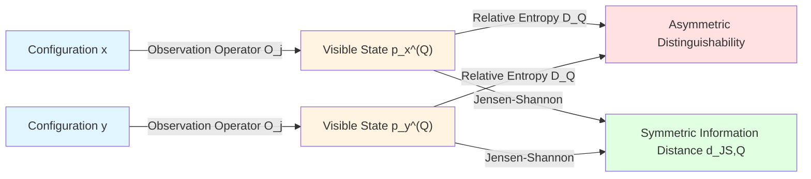
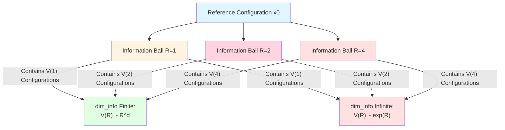
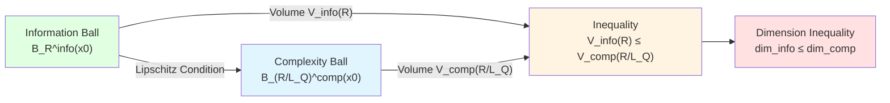
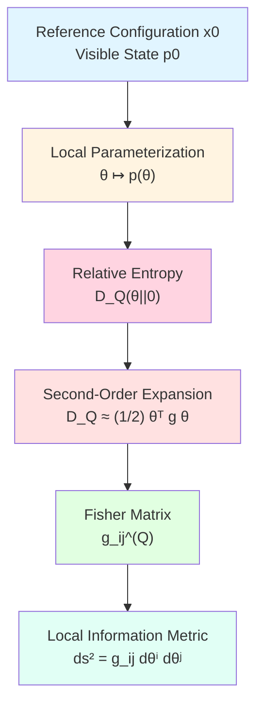
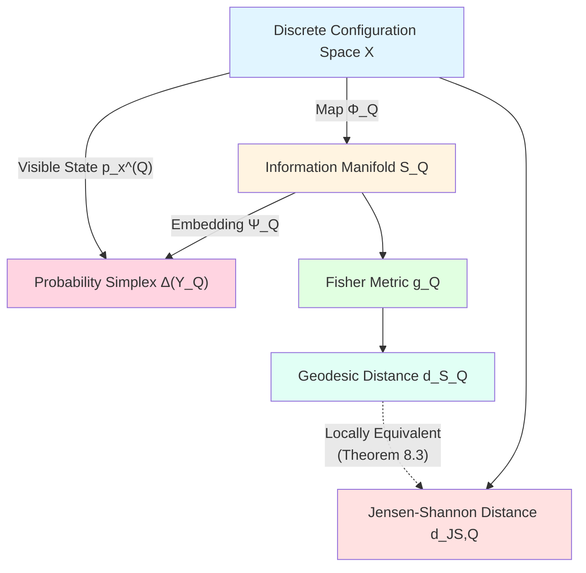
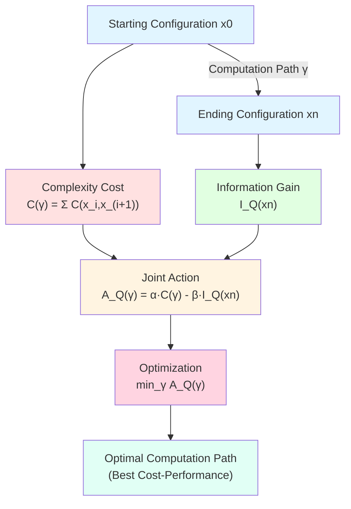
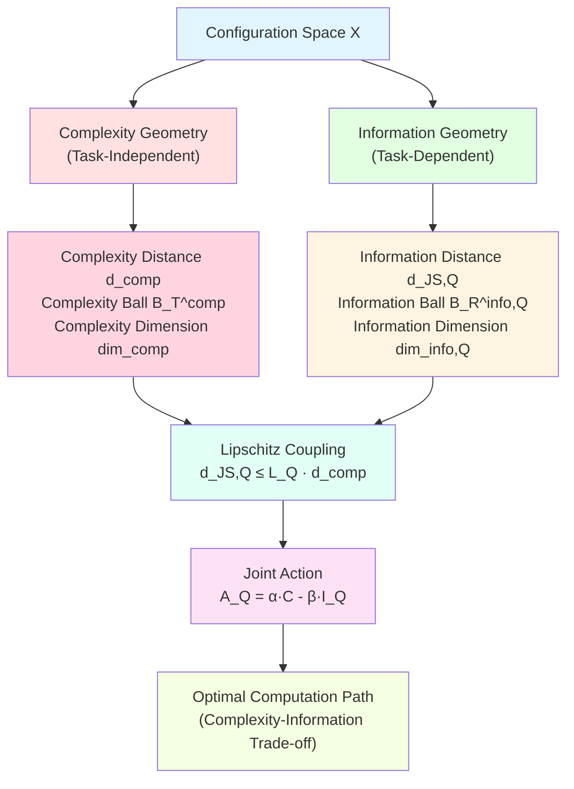

# 23.6 From Complexity to Information: Task-Perceived Information Geometry

In the previous articles, we learned complexity geometry of computational universe: complexity distance $d(x,y)$ tells us how much cost is needed to go from configuration $x$ to $y$, complexity dimension and Ricci curvature characterize problem difficulty. But these only answer "how hard is computation", not "what do we get".

Like mountain climbing, complexity geometry tells you how high and steep the mountain is, but doesn't tell you how beautiful the view at the summit is. **Information geometry** answers this second question: Under finite computational resources, how much useful information can we obtain? Different tasks define "useful" differently, so information geometry is **task-perceived**.

This article is based on euler-gls-info/03-discrete-information-geometry.md, constructing task-perceived information geometry theory in completely discrete setting.

---

## 1. Why Do We Need Information Geometry? Everyday Analogy

### 1.1 From Map to Scenery: Two Types of Distance

Imagine you're in a city, two ways to measure "distance" between two locations:

**Physical Distance**: How many meters from A to B, this is analogy of complexity distance. No matter what you do at B, physical distance is the same.

**Information Distance**: How much does your "view change" from A to B.
- If you're a photographer, care about scenery change, then "information distance" from indoor to seaside is large, because views completely different;
- If you're a delivery person, care about order numbers, then "information distance" from one restaurant to another depends on menu similarity, not physical distance.

**Core Insight**:
- Physical distance (complexity distance) is task-independent, only looks at "how far walked";
- Information distance is task-dependent, looks at "how much observed things changed".

Same physical path has different information value for different tasks.

### 1.2 Value of Travel: Trade-off Between Complexity and Information

Continuing travel analogy:
- **Complexity Cost**: Travel needs time, money, energy;
- **Information Gain**: Travel lets you see new scenery, learn new culture, gain new experiences.

Rational travelers balance these:
- If you only have one day, go to nearby attractions (low complexity, medium information);
- If you have one week, can go far (high complexity, high information);
- If attractions too similar, even if close no need to visit all (low complexity, low information gain).

**Information geometry does such balancing in computational universe**: Given finite computation time, choose computation paths that maximize information gain.

---

## 2. Observation Operators: "Visible States" of Configuration

**Source Theory**: euler-gls-info/03-discrete-information-geometry.md Definition 2.1, Definition 2.2

### 2.1 Why Can't Configurations Be Directly Observed?

In computational universe, configuration $x\in X$ is complete internal state, may contain massive information (e.g., universe configuration with $10^{23}$ qubits). But observers can only access it through finite experiments or measurements, like:
- You cannot "see" entire Earth, only understand it through limited channels like satellite photos, weather data, maps;
- You cannot "read" all neuron states of a brain, only observe it through limited means like EEG, fMRI, behavioral tests.

Therefore, we need **observation operators** to describe "under some task, which aspects of configuration can we see".

### 2.2 Mathematical Definition of Observation Operators

**Definition 2.1** (Observation Operator Family, from euler-gls-info/03-discrete-information-geometry.md Definition 2.1)

Let $(Y_j)_{j\in J}$ be a family of finite result sets. An observation operator family is a set of maps

$$
\mathcal{O} = \{ O_j : X \to \Delta(Y_j) \}_{j\in J},
$$

where $\Delta(Y_j)$ is probability simplex on $Y_j$, and for each $x\in X$, $j\in J$, $O_j(x) = p_x^{(j)}$ is result distribution of one experiment on result set $Y_j$.

**Everyday Interpretation**:
- $Y_j$ is "possible result set" of some observation, e.g.:
  - Temperature measurement: $Y_j = \{0^\circ, 1^\circ, \dots, 100^\circ\}$;
  - Image classification: $Y_j = \{\text{cat}, \text{dog}, \text{bird}\}$;
  - Quantum measurement: $Y_j = \{|0\rangle, |1\rangle\}$.
- $O_j(x)$ is result distribution of configuration $x$ under observation $j$. For example, if $x$ is "slightly warm water", $O_{\text{temperature}}(x)$ might be $p(30^\circ) = 0.7, p(31^\circ) = 0.3$.
- Observation operator family $\mathcal{O}$ is set of all available observation means.

### 2.3 Task $Q$: Choosing Which Observations to Care About

**Definition 2.2** (Joint Visible State Under Task $Q$, from euler-gls-info/03-discrete-information-geometry.md Definition 2.2)

For given finite task set $Q\subset J$, define visible result set

$$
Y_Q = \prod_{j\in Q} Y_j,
$$

and define joint visible state of configuration $x$ as a joint distribution $p_x^{(Q)}$ on $Y_Q$. Simplest construction assumes observations independent, in which case

$$
p_x^{(Q)}(y) = \prod_{j\in Q} p_x^{(j)}(y_j),
\quad y = (y_j)_{j\in Q}\in Y_Q.
$$

**Everyday Analogy**:
- Task $Q$ is "list of observations I care about". For example:
  - Weather forecast task: $Q = \{\text{temperature}, \text{humidity}, \text{pressure}\}$;
  - Medical diagnosis task: $Q = \{\text{body temperature}, \text{blood pressure}, \text{heart rate}\}$;
  - Image recognition task: $Q = \{\text{color histogram}, \text{edge detection}, \text{texture features}\}$.
- Joint visible state $p_x^{(Q)}$ is "comprehensive performance" of configuration $x$ under these observations.

**Key Insight**: Different tasks $Q$ see different "sides" of same configuration $x$. For example:
- For cat-dog recognition task, visible states of $x_1=\text{"a cat"}$ and $x_2=\text{"another cat"}$ may be very close;
- For cat breed recognition task, visible states of $x_1$ and $x_2$ may be far (one is Persian, other is Siamese).

---

## 3. Task-Perceived Relative Entropy: Distinguishability

**Source Theory**: euler-gls-info/03-discrete-information-geometry.md Definition 2.3

### 3.1 Relative Entropy: How Different Are Two Configurations Under Task?

**Definition 3.1** (Relative Entropy Under Task $Q$, from euler-gls-info/03-discrete-information-geometry.md Definition 2.3)

For configurations $x,y\in X$, if for all $z\in Y_Q$ we have $p_y^{(Q)}(z) > 0$ implies $p_x^{(Q)}(z) > 0$, then define

$$
D_Q(x\Vert y)
=
\sum_{z\in Y_Q}
p_x^{(Q)}(z)\,\log\frac{p_x^{(Q)}(z)}{p_y^{(Q)}(z)},
$$

otherwise define $D_Q(x\Vert y) = +\infty$.

**Everyday Interpretation**:
- $D_Q(x\Vert y)$ measures "under task $Q$, how easily can I distinguish $x$ and $y$".
- If $D_Q(x\Vert y) = 0$, means under task $Q$, $x$ and $y$ completely indistinguishable (though they may be different points in configuration space);
- If $D_Q(x\Vert y)$ is large, means under task $Q$, $x$ and $y$ very easy to distinguish.

### 3.2 Everyday Analogy: Distinguishability of Twins

Imagine two twins Alice and Bob:
- **Task $Q_1$: Face Recognition**
  - Visible states: $p_{Alice}^{(Q_1)} \approx p_{Bob}^{(Q_1)}$ (faces very similar)
  - Relative entropy: $D_{Q_1}(Alice\Vert Bob) \approx 0$ (almost indistinguishable)
- **Task $Q_2$: Fingerprint Recognition**
  - Visible states: $p_{Alice}^{(Q_2)} \neq p_{Bob}^{(Q_2)}$ (fingerprints different)
  - Relative entropy: $D_{Q_2}(Alice\Vert Bob) > 0$ (can distinguish)
- **Task $Q_3$: DNA Sequencing**
  - Visible states: $p_{Alice}^{(Q_3)} \approx p_{Bob}^{(Q_3)}$ (DNA highly similar)
  - Relative entropy: $D_{Q_3}(Alice\Vert Bob) \approx 0$ (almost indistinguishable)

**Core Insight**: Same two configurations have completely different "information distances" under different tasks.

### 3.3 Properties of Relative Entropy

**Proposition 3.2** (Basic Properties of Relative Entropy)

1. **Non-Negativity**: $D_Q(x\Vert y) \ge 0$, with equality if and only if $p_x^{(Q)} = p_y^{(Q)}$;
2. **Asymmetry**: Generally $D_Q(x\Vert y) \neq D_Q(y\Vert x)$;
3. **Does Not Satisfy Triangle Inequality**: Relative entropy is not a metric.

**Everyday Interpretation**:
- Non-negativity: Indistinguishability cannot be negative;
- Asymmetry: "Looking at $y$ from $x$" and "looking at $x$ from $y$" have different surprise levels. For example, person who "has seen many cats" (configuration $x$) seeing a cat (configuration $y$) not surprised ($D_Q(x\Vert y)$ small), but person who "never seen cats" (configuration $y$) seeing first cat (configuration $x$) very surprised ($D_Q(y\Vert x)$ large);
- Does not satisfy triangle inequality: This is why we need symmetrization.

---

## 4. Information Distance: Symmetrization and Metric Properties

**Source Theory**: euler-gls-info/03-discrete-information-geometry.md Definition 3.1

### 4.1 Jensen-Shannon Distance

**Definition 4.1** (Jensen–Shannon Divergence and Information Distance Under Task $Q$, from euler-gls-info/03-discrete-information-geometry.md Definition 3.1)

For $x,y\in X$, define mixed distribution

$$
m_{x,y}^{(Q)} = \frac12\big(p_x^{(Q)} + p_y^{(Q)}\big),
$$

Jensen–Shannon divergence

$$
\mathrm{JS}_Q(x,y)
=
\frac12 D\big(p_x^{(Q)}\Vert m_{x,y}^{(Q)}\big)
+
\frac12 D\big(p_y^{(Q)}\Vert m_{x,y}^{(Q)}\big),
$$

and define information distance

$$
d_{\mathrm{JS},Q}(x,y) = \sqrt{2\,\mathrm{JS}_Q(x,y)}.
$$

**Everyday Interpretation**:
- Mixed distribution $m_{x,y}^{(Q)}$ is "take half of $x$'s and half of $y$'s observation results";
- $\mathrm{JS}_Q(x,y)$ measures "how much $x$ and $y$ each deviate from average";
- $d_{\mathrm{JS},Q}(x,y)$ is symmetric and satisfies metric axioms.

### 4.2 Why Square Root?

Jensen–Shannon divergence itself does not satisfy triangle inequality, but its square root does. This is a mathematical fact, similar to Euclidean space where "distance squared does not satisfy triangle inequality, but distance does".

**Theorem 4.2** (Metric Properties of Information Distance)

$d_{\mathrm{JS},Q}$ is a metric on $X$ with respect to task $Q$: satisfies non-negativity, symmetry, triangle inequality, and $d_{\mathrm{JS},Q}(x,y) = 0$ if and only if $p_x^{(Q)} = p_y^{(Q)}$.

### 4.3 Everyday Analogy: "Impression Distance" of Cities

Imagine you've visited many cities, each city's "impression" can be described by a probability distribution:
- Paris: $p_{\text{Paris}}(\text{architecture}) = 0.4, p_{\text{Paris}}(\text{food}) = 0.3, p_{\text{Paris}}(\text{art}) = 0.3$
- Rome: $p_{\text{Rome}}(\text{architecture}) = 0.5, p_{\text{Rome}}(\text{food}) = 0.3, p_{\text{Rome}}(\text{art}) = 0.2$
- Tokyo: $p_{\text{Tokyo}}(\text{architecture}) = 0.2, p_{\text{Tokyo}}(\text{food}) = 0.5, p_{\text{Tokyo}}(\text{art}) = 0.3$

Then:
- "Impression distance" $d_{\mathrm{JS}}(\text{Paris},\text{Rome})$ between Paris and Rome relatively small (both European ancient cities);
- "Impression distance" $d_{\mathrm{JS}}(\text{Paris},\text{Tokyo})$ between Paris and Tokyo relatively large (large cultural difference).

This "impression distance" is everyday version of information distance.

---

## 5. Information Ball and Information Dimension

**Source Theory**: euler-gls-info/03-discrete-information-geometry.md Definition 3.2, Definition 3.3

### 5.1 Information Ball: "Reachable Range" Under Task

**Definition 5.1** (Information Ball and Information Volume, from euler-gls-info/03-discrete-information-geometry.md Definition 3.2)

For reference configuration $x_0\in X$, task $Q$ and radius $R>0$, define information ball

$$
B_R^{\mathrm{info},Q}(x_0)
=
\{ x\in X : d_{\mathrm{JS},Q}(x,x_0) \le R \},
$$

information volume

$$
V_{x_0}^{\mathrm{info},Q}(R)
=
\big|B_R^{\mathrm{info},Q}(x_0)\big|.
$$

**Everyday Interpretation**:
- Information ball $B_R^{\mathrm{info},Q}(x_0)$ is "all configurations with information distance from $x_0$ not exceeding $R$ under task $Q$";
- Information volume $V_{x_0}^{\mathrm{info},Q}(R)$ is number of these configurations.

### 5.2 Everyday Analogy: "Style Similarity" of Music

Taking music recommendation as example:
- $x_0$ is your favorite song;
- Task $Q$ is "music style recognition" (observations: rhythm, harmony, timbre, etc.);
- Information ball $B_R^{\mathrm{info},Q}(x_0)$ is "all songs with style similarity to $x_0$ within $R$";
- Information volume $V_{x_0}^{\mathrm{info},Q}(R)$ is number of these songs.

If $R$ is small, only few songs "almost identical"; if $R$ is large, may include thousands of songs in same genre.

### 5.3 Information Dimension: Complexity of Task

**Definition 5.2** (Information Dimension, from euler-gls-info/03-discrete-information-geometry.md Definition 3.3)

For given task $Q$ and reference $x_0$, define upper information dimension

$$
\overline{\dim}_{\mathrm{info},Q}(x_0)
=
\limsup_{R\to\infty}
\frac{\log V_{x_0}^{\mathrm{info},Q}(R)}{\log R},
$$

lower information dimension

$$
\underline{\dim}_{\mathrm{info},Q}(x_0)
=
\liminf_{R\to\infty}
\frac{\log V_{x_0}^{\mathrm{info},Q}(R)}{\log R}.
$$

If they are equal, call common value information dimension, denoted $\dim_{\mathrm{info},Q}(x_0)$.

**Everyday Interpretation**:
- Information dimension $\dim_{\mathrm{info},Q}(x_0)$ measures "under task $Q$, growth rate of number of distinguishable states with radius";
- If $\dim_{\mathrm{info},Q} = 0$, means task $Q$ almost cannot distinguish different configurations (e.g., "color blindness test" for colorblind patients);
- If $\dim_{\mathrm{info},Q} = d$ finite, means task $Q$ actually only sees a $d$-dimensional information structure;
- If $\dim_{\mathrm{info},Q} = \infty$, means task $Q$ has infinite distinguishing ability (e.g., "perfect memory test").

### 5.4 Example: Information Dimension of Image Recognition Task

Consider $28\times 28$ grayscale images (like MNIST handwritten digits):
- **Configuration Space $X$**: All $256^{784}$ possible images;
- **Task $Q_1$: Digit Recognition** (0-9)
  - Visible states: Probability distribution over 10 categories;
  - Information dimension: $\dim_{\mathrm{info},Q_1} \approx 9$ (because 10 categories on 9-dimensional simplex);
- **Task $Q_2$: Pixel Reconstruction**
  - Visible states: All 784 pixel values;
  - Information dimension: $\dim_{\mathrm{info},Q_2} \approx 784$.

**Core Insight**: Same configuration space, information dimensions of different tasks can differ greatly. Task $Q_1$ only needs low-dimensional information, task $Q_2$ needs high-dimensional information.

---

## 6. Relationship Between Information Dimension and Complexity Dimension

**Source Theory**: euler-gls-info/03-discrete-information-geometry.md Proposition 3.4

### 6.1 Core Inequality: Information Constrained by Complexity

**Theorem 6.1** (Information Dimension Constrained by Complexity Dimension, from euler-gls-info/03-discrete-information-geometry.md Proposition 3.4)

Assume there exists constant $L_Q>0$, such that for all adjacent configurations $x,y$ (i.e., $(x,y)\in\mathsf{T}$) we have

$$
d_{\mathrm{JS},Q}(x,y)
\le L_Q\,\mathsf{C}(x,y),
$$

then there exists constant $C>0$, such that for all $R>0$ we have

$$
V_{x_0}^{\mathrm{info},Q}(R)
\le
V_{x_0}^{\mathrm{comp}}\!\left(\frac{R}{C}\right).
$$

Therefore

$$
\overline{\dim}_{\mathrm{info},Q}(x_0)
\le
\overline{\dim}_{\mathrm{comp}}(x_0).
$$

**Everyday Interpretation**:
- First assumption says "single-step computation complexity cost $\mathsf{C}(x,y)$ controls single-step information gain $d_{\mathrm{JS},Q}(x,y)$";
- Second conclusion says "information ball volume does not exceed corresponding complexity ball volume";
- Third conclusion says "information dimension does not exceed complexity dimension".

### 6.2 Everyday Analogy: Information Gain of Travel

Continuing travel analogy:
- Complexity distance: Physical distance (kilometers);
- Information distance: Scenery change (freshness);
- Assumption: Each kilometer can see at most certain amount of new scenery ($d_{\mathrm{JS},Q} \le L_Q \cdot d_{\mathrm{comp}}$);
- Conclusion: If you only walked 100 km, new scenery you see cannot exceed "upper limit of what can be seen by walking 100 km".

**Core Insight**: Computational resources (complexity) are hard constraint on information acquisition. You cannot expect to obtain infinite information with little computational resources.

### 6.3 Proof Strategy (Details in Appendix)

Core idea of proof is:
1. For any configuration $x$ in information ball, i.e., $d_{\mathrm{JS},Q}(x,x_0) \le R$;
2. Take complexity shortest path $\gamma$ from $x_0$ to $x$;
3. By local Lipschitz condition, accumulate segment by segment to get $d_{\mathrm{JS},Q}(x,x_0) \le L_Q \cdot d_{\mathrm{comp}}(x_0,x)$;
4. Therefore $x$ is also in complexity ball $B_{R/L_Q}^{\mathrm{comp}}(x_0)$;
5. Thus information ball is contained in complexity ball, volume naturally does not exceed latter.

### 6.4 Example: Information Dimension Finite for P-Class Problems

Recalling conclusion from Article 23.4:
- P-class problems have finite complexity dimension: $\dim_{\mathrm{comp}} < \infty$;
- By Theorem 6.1, for any task $Q$ satisfying Lipschitz condition, information dimension is also finite: $\dim_{\mathrm{info},Q} \le \dim_{\mathrm{comp}} < \infty$.

**Everyday Interpretation**: If a problem is "tractable" in complexity (P-class), then in information it also won't have "infinite distinguishing ability".

**Counterexample**: NP-hard problems have infinite complexity dimension, may exist task $Q$ such that information dimension is also infinite. For example, in traveling salesman problem (TSP):
- Configuration $x$ is a path;
- Task $Q$: "Is total length of path less than threshold?";
- Length distributions of different paths can have exponential distinguishability, information dimension may be infinite.

---

## 7. Local Fisher Structure: Second-Order Expansion of Relative Entropy

**Source Theory**: euler-gls-info/03-discrete-information-geometry.md Definition 4.1, Theorem 4.2

### 7.1 Why Do We Need Local Structure?

Previous information distance $d_{\mathrm{JS},Q}$ is globally defined, but in many cases we care "near some configuration $x_0$, what does information geometry look like". This requires **local metric structure**, i.e., near $x_0$ use an "information metric tensor" to describe distance.

This is similar to Earth's surface: globally a sphere, but locally can approximate with plane (tangent space) plus metric tensor.

### 7.2 Local Parameterization and Fisher Matrix

**Assumption 7.1** (Local Parameterization)

Let $x_0\in X$ be reference configuration, assume there exists a local parameterization

$$
\theta \in \Theta \subset \mathbb{R}^k
\quad\longmapsto\quad
p(\theta) \in \Delta(Y_Q),
$$

such that $p(0) = p_0 = p_{x_0}^{(Q)}$, and configurations $x$ near $x_0$ can be parameterized by $\theta$: $p_x^{(Q)} \approx p(\theta(x))$.

**Definition 7.2** (Local Task Fisher Matrix, from euler-gls-info/03-discrete-information-geometry.md Definition 4.1)

Under above setting, define local Fisher information matrix of task $Q$ as

$$
g_{ij}^{(Q)}(0)
=
\sum_{z\in Y_Q}
p_0(z)\,
\partial_{\theta_i}\log p(\theta)(z)\big\vert_{\theta=0}\,
\partial_{\theta_j}\log p(\theta)(z)\big\vert_{\theta=0}.
$$

**Everyday Interpretation**:
- $\theta$ is "local coordinates" near $x_0$, similar to latitude-longitude on map;
- $p(\theta)$ is visible state distribution corresponding to parameter $\theta$;
- $g_{ij}^{(Q)}$ is "information metric tensor", tells you in $\theta$ space "unit displacement" corresponds to how much information change.

### 7.3 Second-Order Expansion of Relative Entropy

**Theorem 7.3** (Fisher Second-Order Form of Relative Entropy, from euler-gls-info/03-discrete-information-geometry.md Theorem 4.2)

Under above setting and standard regularity conditions, for sufficiently small $\theta\in\Theta$, we have

$$
D_Q\big(\theta\Vert 0\big)
=
D\big(p(\theta)\Vert p(0)\big)
=
\frac{1}{2}
\sum_{i,j} g_{ij}^{(Q)}(0)\,\theta_i\theta_j
+ o(|\theta|^2).
$$

**Everyday Interpretation**:
- This theorem says "relative entropy locally is a quadratic form";
- Coefficient matrix of $g_{ij}^{(Q)}$ is Fisher matrix;
- This is similar to "second-order expansion of potential energy near equilibrium point" in physics: $U(\mathbf{x}) \approx \frac{1}{2}\mathbf{x}^\top H \mathbf{x}$, where $H$ is Hessian matrix.

### 7.4 Everyday Analogy: "Distinguishability" of Pitch

Imagine you're a tuner, task is distinguishing different pitches:
- $x_0$ is standard A note (440 Hz);
- Parameter $\theta$ is frequency offset (unit: Hz);
- Visible state $p(\theta)$ is "probability distribution of listeners judging pitch";
- Fisher matrix $g(\theta)$ characterizes "near some pitch, how much perceptual difference does each Hz frequency change cause".

Human ear has different sensitivity to different frequency ranges:
- In mid-range (200-2000 Hz), Fisher matrix is large (sensitive);
- In ultra-low range (<20 Hz) or ultra-high range (>20000 Hz), Fisher matrix approaches 0 (insensitive).

**Core Insight**: Fisher matrix captures "local information sensitivity".

---

## 8. Information Manifold: From Discrete to Continuous

**Source Theory**: euler-gls-info/03-discrete-information-geometry.md Assumption 4.3, Definition 4.4, Theorem 4.5

### 8.1 Concept of Information Manifold

In many cases, visible state set $\{ p_x^{(Q)} : x\in X \}$ of configuration space $X$ under task $Q$ is discrete, but can be approximated by a continuous parameter manifold.

**Assumption 8.1** (Manifold Structure of Task Visible States, from euler-gls-info/03-discrete-information-geometry.md Assumption 4.3)

There exists a finite-dimensional manifold $\mathcal{S}_Q$ and embedding map

$$
\Psi_Q : \mathcal{S}_Q \hookrightarrow \Delta(Y_Q),
$$

and map

$$
\Phi_Q : X \to \mathcal{S}_Q,
$$

such that

1. For each $x\in X$, $p_x^{(Q)}$ approximates $\Psi_Q(\Phi_Q(x))$;
2. Standard Fisher information metric on $\mathcal{S}_Q$ via $\Psi_Q$ agrees with second derivative of relative entropy.

**Everyday Interpretation**:
- $\mathcal{S}_Q$ is "information manifold of task $Q$", effective parameter space of all visible states;
- $\Psi_Q$ is "embedding from parameters to probability distributions";
- $\Phi_Q$ is "map from configurations to information states".

### 8.2 Example: Gaussian Distribution Family

Consider a simple example:
- **Configuration Space $X$**: All possible "noisy signals";
- **Task $Q$**: "Estimate mean and variance of signal";
- **Visible State $p_x^{(Q)}$**: Gaussian distribution $\mathcal{N}(\mu,\sigma^2)$;
- **Information Manifold $\mathcal{S}_Q$**: $\mathbb{R} \times \mathbb{R}_+ = \{(\mu,\sigma^2) : \sigma^2 > 0\}$;
- **Map $\Phi_Q$**: $x \mapsto (\mu(x), \sigma^2(x))$.

In this example, although configuration space $X$ may be discrete (finite precision numbers), information manifold $\mathcal{S}_Q$ is a two-dimensional continuous manifold.

### 8.3 Information Metric and Geodesic Distance

**Definition 8.2** (Task Information Manifold and Information Metric, from euler-gls-info/03-discrete-information-geometry.md Definition 4.4)

Under Assumption 8.1, information manifold of task $Q$ is $(\mathcal{S}_Q,g_Q)$, where $g_Q$ is Fisher information metric. For configuration $x\in X$, its information geometric position is $\Phi_Q(x)\in\mathcal{S}_Q$.

**Theorem 8.3** (Consistency of Local Information Distance, from euler-gls-info/03-discrete-information-geometry.md Theorem 4.5)

Let $x,x_0 \in X$ such that $\Phi_Q(x_0) = \theta_0$, $\Phi_Q(x) = \theta$, and $\theta$ is close to $\theta_0$. Then

$$
d_{\mathrm{JS},Q}(x,x_0)
=
\sqrt{
(\theta-\theta_0)^\top g_Q(\theta_0)(\theta-\theta_0)
}
+ o(|\theta-\theta_0|).
$$

**Everyday Interpretation**:
- This theorem says "discrete Jensen-Shannon distance" locally equivalent to "geodesic distance induced by continuous Fisher metric";
- In other words, information manifold $(\mathcal{S}_Q,g_Q)$ is continuous limit of discrete information geometry.

### 8.4 Everyday Analogy: Map and Actual Terrain

- **Discrete Configuration Space $X$**: All street intersections in city (discrete points);
- **Information Manifold $\mathcal{S}_Q$**: Continuous map (latitude-longitude coordinates);
- **Map $\Phi_Q$**: Each intersection corresponds to a coordinate on map;
- **Information Metric $g_Q$**: Distance on map (considering terrain undulation, traffic convenience, etc.);
- **Jensen-Shannon Distance**: "Actual travel time" between two intersections;
- **Theorem 8.3**: If two intersections are close, map distance ≈ actual travel time.

**Core Insight**: Information manifold provides a "continuous perspective", letting us use differential geometry tools to study discrete information geometry.

---

## 9. Information-Complexity Lipschitz Inequality

**Source Theory**: euler-gls-info/03-discrete-information-geometry.md Proposition 5.1

### 9.1 Local Lipschitz Condition

Under information manifold framework, we can strengthen global inequality of Theorem 6.1 to local "gradient control" relationship.

**Proposition 9.1** (Local Information–Complexity Lipschitz Inequality, from euler-gls-info/03-discrete-information-geometry.md Proposition 5.1)

If there exists constant $L_Q^{\mathrm{loc}}>0$, such that for all adjacent configurations $x,y$ (i.e., $(x,y)\in\mathsf{T}$ and $x,y$ located in some local region) we have

$$
d_{\mathcal{S}_Q}\big(\Phi_Q(x),\Phi_Q(y)\big)
\le
L_Q^{\mathrm{loc}} \,\mathsf{C}(x,y),
$$

then for any local path $\gamma$ we have

$$
L_Q(\gamma)
\le
L_Q^{\mathrm{loc}}\,\mathsf{C}(\gamma).
$$

In particular, minimum information distance and minimum complexity distance satisfy

$$
d_{\mathcal{S}_Q}\big(\Phi_Q(x_0),\Phi_Q(x)\big)
\le
L_Q^{\mathrm{loc}}\,d_{\mathrm{comp}}(x_0,x).
$$

**Everyday Interpretation**:
- First condition says "single-step computation information gain does not exceed $L_Q^{\mathrm{loc}}$ times complexity cost";
- Second conclusion says "path information length does not exceed $L_Q^{\mathrm{loc}}$ times complexity length";
- Third conclusion says "minimum information distance between two points does not exceed $L_Q^{\mathrm{loc}}$ times minimum complexity distance".

### 9.2 Everyday Analogy: "Scenery-Energy" Ratio of Mountain Climbing

Continuing mountain climbing analogy:
- Complexity distance: Climbing height (meters);
- Information distance: Scenery change (freshness);
- Lipschitz constant $L_Q^{\mathrm{loc}}$: Maximum scenery change per meter height.

In different terrains:
- **Plains**: $L_Q^{\mathrm{loc}}$ small (climb high also cannot see new scenery);
- **Cliffs**: $L_Q^{\mathrm{loc}}$ large (climb a bit can see completely different view);
- **Forests**: $L_Q^{\mathrm{loc}}$ medium (gradual change).

**Core Insight**: Lipschitz constant characterizes "conversion efficiency from computational resources to information gain".

### 9.3 Example: Information-Complexity Ratio of Sorting Algorithms

Consider sorting task:
- **Configuration $x$**: Some permutation of array;
- **Task $Q$**: "Is array sorted?";
- **Visible State $p_x^{(Q)}$**: $p(\text{sorted}) = \mathbb{1}_{\text{sorted}}(x)$;
- **Complexity Cost $\mathsf{C}(x,y)$**: Number of swap operations;
- **Information Gain $d_{\mathcal{S}_Q}(\Phi_Q(x),\Phi_Q(y))$**: Change in sortedness.

For bubble sort:
- Each swap reduces at most 1 inversion pair;
- Information gain $\approx \frac{1}{n^2}$ (reduce 1 out of $n^2$ inversion pairs);
- Lipschitz constant $L_Q^{\mathrm{loc}} \approx \frac{1}{n^2}$.

For quicksort:
- Each partition may reduce $\Theta(n)$ inversion pairs;
- Information gain $\approx \frac{1}{n}$;
- Lipschitz constant $L_Q^{\mathrm{loc}} \approx \frac{1}{n}$, more efficient!

**Core Insight**: Different algorithms correspond to different information-complexity conversion efficiencies, quantifiable by Lipschitz constant.

---

## 10. Task-Perceived Joint Action

**Source Theory**: euler-gls-info/03-discrete-information-geometry.md Definition 5.2

### 10.1 Balancing Complexity and Information

Now we have two geometries:
- **Complexity Geometry**: Tells us "how far walked" (cost);
- **Information Geometry**: Tells us "what obtained" (gain).

Rational computers should balance these, seeking computation paths with "best cost-performance ratio". This requires a **joint action**.

**Definition 10.1** (Joint Action Prototype for Task $Q$, from euler-gls-info/03-discrete-information-geometry.md Definition 5.2)

Let $\gamma = (x_0,x_1,\dots,x_n)$ be a path, its complexity length is $\mathsf{C}(\gamma)$, endpoint information quality is $\mathsf{I}_Q(x_n)$ (quality function defined by task). Define joint action for task $Q$

$$
\mathcal{A}_Q(\gamma)
=
\alpha \,\mathsf{C}(\gamma)
-
\beta\,\mathsf{I}_Q(x_n),
$$

where $\alpha,\beta>0$ are weights balancing complexity and information.

**Everyday Interpretation**:
- $\alpha \,\mathsf{C}(\gamma)$ is "total cost of path" (time, computational resources, etc.);
- $\beta\,\mathsf{I}_Q(x_n)$ is "information gain at endpoint" (degree of solving problem, precision of answer, etc.);
- $\mathcal{A}_Q(\gamma)$ is "net cost" (cost - gain);
- Optimal path is one minimizing $\mathcal{A}_Q(\gamma)$.

### 10.2 Everyday Analogy: Total Gain of Travel

Continuing travel analogy:
- $\mathsf{C}(\gamma)$: Total cost of travel (airfare + hotel + meals);
- $\mathsf{I}_Q(x_n)$: Total gain of travel (new experiences, new knowledge, good memories);
- $\alpha$: Your emphasis on money (poor student $\alpha$ large, rich person $\alpha$ small);
- $\beta$: Your emphasis on experience (artistic person $\beta$ large, pragmatist $\beta$ small);
- $\mathcal{A}_Q(\gamma) = \alpha \cdot \text{cost} - \beta \cdot \text{gain}$: "Net loss" of travel;
- Optimal travel route: Route minimizing net loss (or maximizing net gain).

**Core Insight**: Different $\alpha/\beta$ ratios correspond to different "values", lead to different optimal strategies.

### 10.3 Continuous Limit: Variational Principle

In continuous limit, as we introduce time parameter $t$ on information manifold $(\mathcal{S}_Q,g_Q)$ and complexity manifold $(\mathcal{M},G)$, let configuration path $x(t)$ and information path $\theta(t) = \Phi_Q(x(t))$, then continuous form of joint action is

$$
\mathcal{A}_Q[\theta(\cdot)]
=
\int_{0}^{T}
\alpha \sqrt{
G_{ab}(\theta(t))\,\dot{\theta}^a(t)\dot{\theta}^b(t)
}
\,\mathrm{d}t
-
\beta\,\mathsf{I}_Q(\theta(T)).
$$

**Everyday Interpretation**:
- Integral term $\int \alpha \sqrt{G_{ab}\dot{\theta}^a\dot{\theta}^b}\,\mathrm{d}t$ is "complexity length of path" (continuous version);
- Boundary term $\beta\,\mathsf{I}_Q(\theta(T))$ is "information quality at endpoint";
- Optimal path satisfies Euler-Lagrange equations (standard conclusion of calculus of variations).

This continuous action will be detailed in subsequent Articles 23.10-11, interfacing with joint variational principle of time, complexity, and information.

---

## 11. Complete Picture: Complexity Geometry + Information Geometry

### 11.1 Comparison of Two Geometries

| Dimension | Complexity Geometry | Information Geometry |
|-----------|-------------------|---------------------|
| Concerned Question | "How far walked?" | "What obtained?" |
| Basic Distance | $d_{\mathrm{comp}}(x,y)$ | $d_{\mathrm{JS},Q}(x,y)$ |
| Ball Volume | $V^{\mathrm{comp}}(T)$ | $V^{\mathrm{info},Q}(R)$ |
| Dimension | $\dim_{\mathrm{comp}}$ | $\dim_{\mathrm{info},Q}$ |
| Local Metric | Complexity Metric $G_{ab}$ | Fisher Metric $g_{ij}^{(Q)}$ |
| Dependence | Task-Independent | Task-Dependent |
| Physical Analogy | Physical Distance | Scenery Change |

### 11.2 Core Inequality Chain

$$
\dim_{\mathrm{info},Q}(x_0)
\le
\dim_{\mathrm{comp}}(x_0)
$$

$$
d_{\mathcal{S}_Q}\big(\Phi_Q(x),\Phi_Q(y)\big)
\le
L_Q^{\mathrm{loc}}\,d_{\mathrm{comp}}(x,y)
$$

$$
V_{x_0}^{\mathrm{info},Q}(R)
\le
V_{x_0}^{\mathrm{comp}}\!\left(\frac{R}{C}\right)
$$

**Everyday Interpretation**: These three inequalities all say the same thing: Information is constrained by complexity, you cannot expect to obtain infinite information with little computational resources.

### 11.3 Joint Perspective: Dual Geometry of Configuration Space

Each configuration $x\in X$ simultaneously lives in two geometries:
1. **Complexity Geometry**: How much cost to walk from $x_0$ to $x$?
2. **Information Geometry**: How different are $x$ and $x_0$ under task $Q$?

Optimal computation strategy needs to consider both geometries simultaneously, seeking paths that "maximize information gain under given complexity budget".

---

## 12. Example: Information Geometry in Machine Learning

### 12.1 Configuration Space: Neural Network Parameters

Consider a simple neural network:
- **Configuration Space $X$**: All possible weight matrices $W \in \mathbb{R}^{d \times d}$;
- **One-Step Update $\mathsf{T}$**: Gradient descent $W \to W - \eta \nabla L(W)$;
- **Single-Step Cost $\mathsf{C}$**: Computational cost of computing gradient for one batch.

### 12.2 Task: Image Classification

- **Observation Operator $O$**: Test classification accuracy on validation set;
- **Visible State $p_W^{(Q)}$**: Confusion matrix (probability for each pair of true class-predicted class);
- **Information Quality $\mathsf{I}_Q(W)$**: Validation set accuracy.

### 12.3 Complexity Geometry vs Information Geometry

**Complexity Geometry**:
- Complexity distance $d_{\mathrm{comp}}(W_1,W_2)$: Total gradient computation needed to train from $W_1$ to $W_2$;
- Complexity ball $B_T^{\mathrm{comp}}(W_0)$: All parameters reachable within training time $T$;
- Complexity dimension: $\dim_{\mathrm{comp}} \approx d^2$ (parameter space dimension).

**Information Geometry**:
- Information distance $d_{\mathrm{JS},Q}(W_1,W_2)$: Difference between classifiers corresponding to two parameters on confusion matrix;
- Information ball $B_R^{\mathrm{info},Q}(W_0)$: All parameters with "classification performance similar to $W_0$";
- Information dimension: $\dim_{\mathrm{info},Q} \approx K(K-1)$ (degrees of freedom of confusion matrix for $K$ classes).

### 12.4 Observation: Information Dimension ≪ Complexity Dimension

In practice:
- Parameter space dimension $d^2$ may be large (e.g., $10^6$ dimensions);
- But information space dimension only $K(K-1)$ (e.g., 10-class classification, $\dim_{\mathrm{info},Q} \approx 90$).

**Core Insight**: Although parameter space is high-dimensional (high complexity), task only needs low-dimensional information (low information), this is why deep learning works—high-dimensional parameter space provides sufficient expressiveness, but ultimately only need extract low-dimensional information.

This is exactly manifestation of Theorem 6.1: $\dim_{\mathrm{info},Q} \le \dim_{\mathrm{comp}}$, and in many cases inequality is strict.

---

## 13. Connections with Previous and Subsequent Chapters

### 13.1 Connection with Articles 23.3-5 (Complexity Geometry)

Articles 23.3-5 established complexity geometry:
- Article 23.3: Complexity graph and metric $d_{\mathrm{comp}}(x,y)$;
- Article 23.4: Volume growth $V^{\mathrm{comp}}(T)$ and complexity dimension $\dim_{\mathrm{comp}}$;
- Article 23.5: Discrete Ricci curvature $\kappa(x,y)$ and problem difficulty.

This article (Article 23.6) introduces information geometry on this basis:
- Information distance $d_{\mathrm{JS},Q}(x,y)$ (corresponding to complexity distance);
- Information volume $V^{\mathrm{info},Q}(R)$ and information dimension $\dim_{\mathrm{info},Q}$ (corresponding to complexity volume and dimension);
- Lipschitz inequality (connecting two geometries).

### 13.2 Preview of Article 23.7 (Deepening Fisher Structure)

Next article 23.7 will deeply study Fisher structure:
- Geometric meaning of Fisher information matrix $g_{ij}^{(Q)}$;
- Strengthened form of information-complexity inequality;
- Global properties of information manifold $(\mathcal{S}_Q,g_Q)$.

### 13.3 Preview of Articles 23.8-9 (Unified Time Scale)

Articles 23.8-9 will introduce **unified time scale** $\kappa(\omega)$, which is bridge between complexity geometry and information geometry:
- On complexity side: $\kappa(\omega)$ characterizes frequency density of "single-step cost";
- On information side: $\kappa(\omega)$ characterizes frequency density of "single-step information gain";
- Unified time scale will fuse two geometries in continuous limit.

### 13.4 Preview of Articles 23.10-11 (Variational Principle)

Articles 23.10-11 will construct complete **time-information-complexity joint variational principle** based on complexity geometry, information geometry, and unified time scale:
- Joint manifold $\mathcal{E}_Q = \mathcal{M} \times \mathcal{S}_Q$;
- Joint action $\mathcal{A}[\theta(t),\phi(t)]$ (continuous version of Definition 10.1 in this article);
- Euler-Lagrange equations and optimal computation worldlines.

---

## 14. Summary

This article introduced **task-perceived information geometry** of computational universe, core ideas are:

### 14.1 Core Concepts

1. **Observation Operator Family $\mathcal{O} = \{O_j\}$**: Describes "which aspects of configuration can we see";
2. **Task $Q$**: Choose which observations to care about, define joint visible state $p_x^{(Q)}$;
3. **Task Relative Entropy $D_Q(x\Vert y)$**: Distinguishability of configurations $x$ and $y$ under task $Q$;
4. **Jensen-Shannon Information Distance $d_{\mathrm{JS},Q}(x,y)$**: Symmetrized metric;
5. **Information Ball $B_R^{\mathrm{info},Q}(x_0)$ and Information Dimension $\dim_{\mathrm{info},Q}$**: Characterize information complexity of task;
6. **Fisher Matrix $g_{ij}^{(Q)}$**: Second-order expansion of relative entropy, local information metric;
7. **Information Manifold $(\mathcal{S}_Q,g_Q)$**: Continuous limit of discrete information geometry;
8. **Information-Complexity Inequality $\dim_{\mathrm{info},Q} \le \dim_{\mathrm{comp}}$**: Information constrained by complexity;
9. **Joint Action $\mathcal{A}_Q = \alpha\mathsf{C} - \beta\mathsf{I}_Q$**: Balance complexity and information.

### 14.2 Core Insights

- **Task Dependence**: Same configuration has different "information states" under different tasks;
- **Dual Geometry**: Each configuration simultaneously lives in complexity geometry (task-independent) and information geometry (task-dependent);
- **Resource Constraint**: Complexity is hard constraint on information, information dimension does not exceed complexity dimension;
- **Local-Global Correspondence**: Discrete Jensen-Shannon distance locally equivalent to continuous Fisher metric;
- **Variational Perspective**: Optimal computation path is minimization of joint action.

### 14.3 Everyday Analogy Review

- **Travel**: Complexity = distance, Information = scenery change, Optimal path = most cost-effective travel;
- **Music**: Configuration = song, Task = style recognition, Information distance = style similarity;
- **Machine Learning**: Configuration = parameters, Task = classification, Information = accuracy.

### 14.4 Mathematical Structure

**Source Theory**: All core definitions and theorems in this article strictly based on euler-gls-info/03-discrete-information-geometry.md.

**Key Formula Summary**:

1. Observation operator: $O_j : X \to \Delta(Y_j)$
2. Joint visible state: $p_x^{(Q)} = \prod_{j\in Q} p_x^{(j)}$
3. Task relative entropy: $D_Q(x\Vert y) = \sum_z p_x^{(Q)}(z)\log\frac{p_x^{(Q)}(z)}{p_y^{(Q)}(z)}$
4. Jensen-Shannon distance: $d_{\mathrm{JS},Q}(x,y) = \sqrt{2\,\mathrm{JS}_Q(x,y)}$
5. Information dimension: $\dim_{\mathrm{info},Q} = \limsup_{R\to\infty} \frac{\log V^{\mathrm{info},Q}(R)}{\log R}$
6. Fisher matrix: $g_{ij}^{(Q)} = \sum_z p_0(z)\,\partial_i\log p\,\partial_j\log p$
7. Relative entropy second-order expansion: $D_Q(\theta\Vert 0) = \frac{1}{2}\theta^\top g^{(Q)}\theta + o(|\theta|^2)$
8. Information-complexity inequality: $\dim_{\mathrm{info},Q} \le \dim_{\mathrm{comp}}$
9. Lipschitz inequality: $d_{\mathcal{S}_Q}(\Phi_Q(x),\Phi_Q(y)) \le L_Q^{\mathrm{loc}}\,d_{\mathrm{comp}}(x,y)$
10. Joint action: $\mathcal{A}_Q(\gamma) = \alpha\,\mathsf{C}(\gamma) - \beta\,\mathsf{I}_Q(x_n)$

---

**Preview of Next Article**: 23.7 Fisher Structure and Deepening of Information-Complexity Inequality

In next article, we will deeply study:
1. **Geometric Meaning of Fisher Information Matrix**: Why is it metric of "information sensitivity"?
2. **Global Properties of Information Manifold**: Curvature, geodesics, volume element;
3. **Strengthened Form of Information-Complexity Inequality**: Under what conditions does $\dim_{\mathrm{info},Q} = \dim_{\mathrm{comp}}$?
4. **Optimal Observation Strategy**: How to choose task $Q$ to maximize information gain?
5. **Preliminary Construction of Information-Complexity Joint Manifold**: Preparation for subsequent variational principle.

