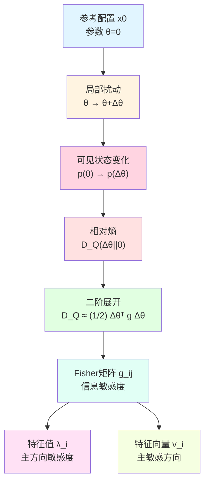
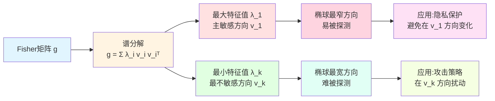
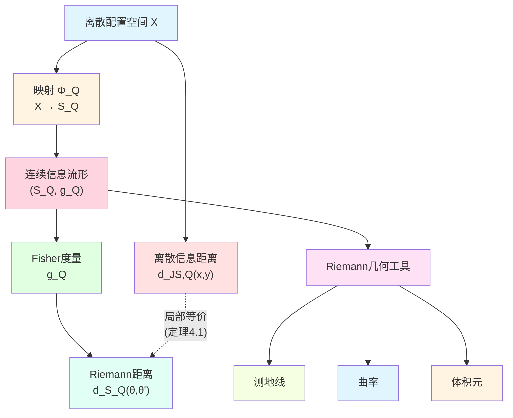
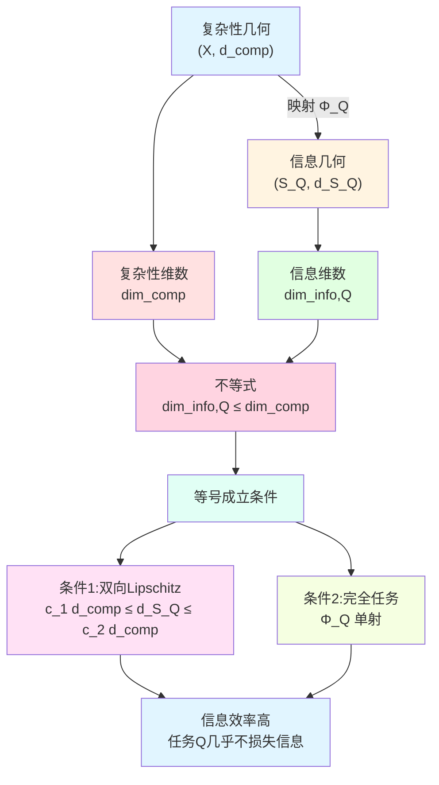
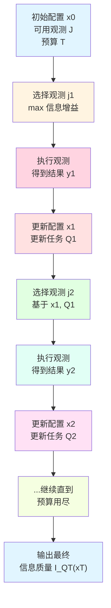
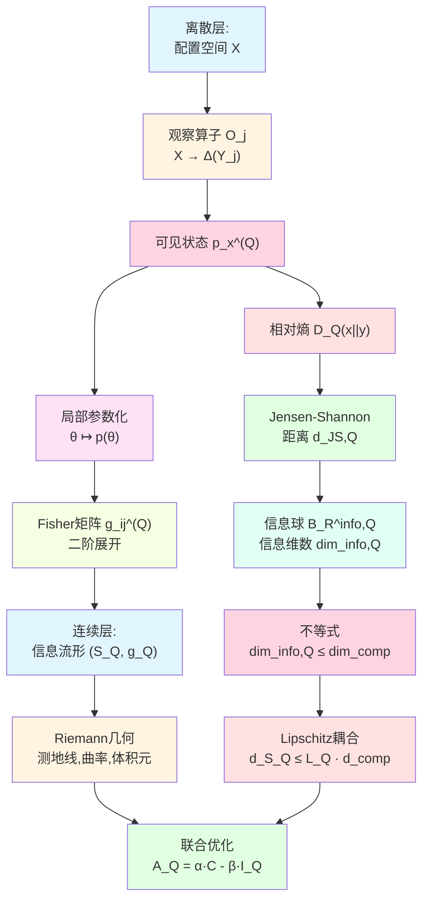

# 23.7 Fisher结构与信息-复杂性不等式的深化

在上一篇中,我们建立了任务感知的信息几何:通过观察算子族将配置映射为可见状态,用Jensen-Shannon距离衡量信息差异,并证明了信息维数受复杂性维数约束。但我们只是浅尝了局部Fisher结构,没有深入探讨它的几何意义和实际应用。

本篇将深化Fisher信息矩阵的理解,建立更精细的信息-复杂性不等式,并探讨如何在实际问题中利用这些结构设计最优观测策略。

**核心问题**:
- Fisher矩阵为什么是"信息敏感度"的自然度量?
- 在什么条件下信息维数等于复杂性维数?
- 如何选择任务 $Q$ 使信息收益最大?

本文基于 euler-gls-info/03-discrete-information-geometry.md 第4-5节及附录。

---

## 1. Fisher矩阵的几何意义:为什么是"信息敏感度"?

### 1.1 从物理类比说起:弹簧的刚度

想象一个弹簧系统:
- 你在平衡位置 $x_0$ 附近移动弹簧,位移为 $\Delta x$;
- 势能变化为 $\Delta U \approx \frac{1}{2}k(\Delta x)^2$,其中 $k$ 是弹簧刚度;
- 刚度 $k$ 越大,单位位移导致的势能变化越大,系统对位移越"敏感"。

Fisher矩阵的作用完全类似:
- 你在参考配置 $x_0$ 附近移动到 $x$,参数变化为 $\Delta\theta$;
- 相对熵变化为 $D_Q(\theta\Vert 0) \approx \frac{1}{2}\Delta\theta^\top g^{(Q)} \Delta\theta$;
- Fisher矩阵 $g^{(Q)}$ 的系数越大,单位参数变化导致的信息距离越大,任务 $Q$ 对这个方向的变化越"敏感"。

**核心洞察**:Fisher矩阵是信息几何中的"刚度矩阵"或"Hessian矩阵",它的特征值刻画了不同方向上的信息敏感度。

### 1.2 日常类比:品酒师的味觉灵敏度

想象一位品酒师在品尝葡萄酒:
- **参考状态 $x_0$**:某款标准红酒;
- **参数空间 $\theta$**:酒的属性(酸度、甜度、单宁含量等);
- **任务 $Q$**:品酒师的味觉测试;
- **可见状态 $p_\theta^{(Q)}$**:品酒师对不同味道的感知概率分布。

Fisher矩阵 $g_{ij}^{(Q)}$ 的各个分量代表:
- $g_{11}$:对酸度变化的敏感度;
- $g_{22}$:对甜度变化的敏感度;
- $g_{12}$:酸度与甜度的交叉敏感度(例如,酸味会影响对甜味的感知)。

**不同品酒师的Fisher矩阵不同**:
- 新手:所有系数都小(对细微差别不敏感);
- 专家:某些系数很大(例如对单宁的敏感度极高)。

**核心洞察**:Fisher矩阵量化了"观测者在某个任务下的分辨能力"。

### 1.3 Fisher矩阵的数学定义回顾

**源理论**:euler-gls-info/03-discrete-information-geometry.md 定义4.1

**定义 1.1**(局部任务Fisher矩阵,源自 euler-gls-info/03-discrete-information-geometry.md 定义4.1)

设配置 $x_0$ 附近存在局部参数化 $\theta \mapsto p(\theta) \in \Delta(Y_Q)$,使得 $p(0) = p_0 = p_{x_0}^{(Q)}$。定义任务 $Q$ 的局部 Fisher 信息矩阵为

$$
g_{ij}^{(Q)}(0)
=
\sum_{z\in Y_Q}
p_0(z)\,
\partial_{\theta_i}\log p(\theta)(z)\big\vert_{\theta=0}\,
\partial_{\theta_j}\log p(\theta)(z)\big\vert_{\theta=0}.
$$

**物理解读**:
- $\log p(\theta)(z)$ 是"对数似然",它的梯度 $\partial_i \log p$ 称为"得分函数";
- $g_{ij}^{(Q)}$ 是得分函数的协方差:$g_{ij} = \mathrm{Cov}(\partial_i \log p, \partial_j \log p)$;
- 协方差大意味着对这两个参数方向的联合敏感度高。

---

## 2. Fisher矩阵的谱分解:主敏感方向

**源理论**:基于 euler-gls-info/03-discrete-information-geometry.md 定理4.2

### 2.1 特征值与特征向量的意义

Fisher矩阵 $g^{(Q)}$ 是对称半正定矩阵,可以进行谱分解:

$$
g^{(Q)} = \sum_{i=1}^{k} \lambda_i v_i v_i^\top,
$$

其中 $\lambda_1 \ge \lambda_2 \ge \cdots \ge \lambda_k \ge 0$ 是特征值,$v_1,\dots,v_k$ 是对应的单位特征向量。

**几何意义**:
- **特征向量 $v_i$**:第 $i$ 个主敏感方向,即"在这个方向上移动时,信息变化最显著";
- **特征值 $\lambda_i$**:在方向 $v_i$ 上的信息敏感度,即"单位位移导致的相对熵增量"。

### 2.2 日常类比:摄像头的视野

想象一个摄像头在监控一个房间:
- **参考状态 $x_0$**:空房间;
- **参数空间 $\theta$**:房间中物体的位置(2维);
- **任务 $Q$**:摄像头的图像识别;
- **Fisher矩阵 $g^{(Q)}$**:对物体移动的敏感度。

如果摄像头正对着门口:
- **主方向 $v_1$**:水平方向(平行于门);
- **主特征值 $\lambda_1$**:很大(门口有人进出,图像变化明显);
- **次方向 $v_2$**:垂直方向(垂直于门);
- **次特征值 $\lambda_2$**:较小(远近移动,图像变化不明显)。

**核心洞察**:Fisher矩阵的谱分解告诉我们"哪些方向的变化最容易被任务 $Q$ 探测到"。

### 2.3 信息椭球:可分辨性的几何表示

相对熵的二阶近似 $D_Q(\theta\Vert 0) \approx \frac{1}{2}\theta^\top g^{(Q)} \theta$ 定义了一个椭球:

$$
\mathcal{E}_\epsilon = \{\theta : \theta^\top g^{(Q)} \theta \le 2\epsilon\}.
$$

这个椭球的几何特征:
- **主轴方向**:特征向量 $v_i$;
- **主轴半径**:$r_i = \sqrt{2\epsilon/\lambda_i}$;
- **最大敏感方向**:对应最大特征值 $\lambda_1$ 的方向 $v_1$,椭球在这个方向上最"扁";
- **最小敏感方向**:对应最小特征值 $\lambda_k$ 的方向 $v_k$,椭球在这个方向上最"宽"。

**日常解读**:
- 如果你在 $v_1$ 方向上移动很少,就会被任务 $Q$ 探测到(椭球在这个方向上很窄);
- 如果你在 $v_k$ 方向上移动很多,可能还不会被探测到(椭球在这个方向上很宽)。

---

## 3. 相对熵的二阶展开:Cramér-Rao界的信息论版本

**源理论**:euler-gls-info/03-discrete-information-geometry.md 定理4.2及附录B.1

### 3.1 核心定理

**定理 3.1**(相对熵的Fisher二阶形式,源自 euler-gls-info/03-discrete-information-geometry.md 定理4.2)

在局部参数化 $\theta \mapsto p(\theta)$ 及常规正则性条件下,对足够小的 $\theta\in\Theta$,有

$$
D_Q\big(\theta\Vert 0\big)
=
D\big(p(\theta)\Vert p(0)\big)
=
\frac{1}{2}
\sum_{i,j} g_{ij}^{(Q)}(0)\,\theta_i\theta_j
+ o(|\theta|^2).
$$

**日常解读**:
- 这个定理说的是"相对熵在局部上是一个二次型,系数矩阵就是Fisher矩阵";
- 类比物理:势能在平衡点附近 $U(\mathbf{x}) \approx \frac{1}{2}\mathbf{x}^\top H \mathbf{x}$,其中 $H$ 是Hessian矩阵;
- Fisher矩阵 $g^{(Q)}$ 是相对熵的"信息Hessian"。

### 3.2 证明思路(详见源理论附录B.1)

证明的核心步骤:
1. 对相对熵 $D(p_\theta\Vert p_0) = \sum_z p_\theta(z)\log\frac{p_\theta(z)}{p_0(z)}$ 在 $\theta=0$ 处做Taylor展开;
2. 零阶项:$D(p_0\Vert p_0) = 0$;
3. 一阶项:由概率归一化条件 $\sum_z p_\theta(z) = 1$,一阶导数为零;
4. 二阶项:通过对数似然的二阶导数,化简为 $\frac{1}{2}\sum_{ij} g_{ij}\theta_i\theta_j$,其中 $g_{ij} = \sum_z p_0(z)\partial_i\log p\cdot\partial_j\log p$。

**核心技巧**:利用恒等式

$$
\sum_z \partial_i p_\theta(z) \cdot \partial_j \log p_\theta(z)
=
\sum_z p_\theta(z) \cdot \partial_i \log p_\theta(z) \cdot \partial_j \log p_\theta(z),
$$

将混合导数转化为得分函数的协方差。

### 3.3 Cramér-Rao界的联系

在统计学中,Cramér-Rao界说的是:对参数 $\theta$ 的任何无偏估计量 $\hat{\theta}$,其协方差矩阵满足

$$
\mathrm{Cov}(\hat{\theta}) \ge g^{-1},
$$

其中 $g$ 是Fisher信息矩阵,不等式表示矩阵的半正定序。

**日常解读**:
- Fisher矩阵越大,估计的精度上界越高(方差越小);
- Fisher矩阵的逆 $g^{-1}$ 给出了"最优估计的方差下界"。

**与相对熵的联系**:
- 相对熵 $D_Q(\theta\Vert 0) \approx \frac{1}{2}\theta^\top g \theta$ 刻画了"真实参数偏离 $\theta_0$ 时,观测分布的可区分度";
- Cramér-Rao界说的是"给定观测数据,我们能以多高精度估计参数";
- 两者通过Fisher矩阵统一:Fisher矩阵既是"信息的Hessian",也是"估计精度的下界"。

---

## 4. 信息流形的测地距离与Jensen-Shannon距离的一致性

**源理论**:euler-gls-info/03-discrete-information-geometry.md 定理4.5及附录B.2

### 4.1 局部一致性定理

**定理 4.1**(局部信息距离的一致性,源自 euler-gls-info/03-discrete-information-geometry.md 定理4.5)

设 $x,x_0 \in X$ 使得 $\Phi_Q(x_0) = \theta_0$、$\Phi_Q(x) = \theta$,且 $\theta$ 接近 $\theta_0$。则有

$$
d_{\mathrm{JS},Q}(x,x_0)
=
\sqrt{
(\theta-\theta_0)^\top g_Q(\theta_0)(\theta-\theta_0)
}
+ o(|\theta-\theta_0|).
$$

**日常解读**:
- 左边 $d_{\mathrm{JS},Q}$ 是离散配置空间上的Jensen-Shannon信息距离;
- 右边 $\sqrt{(\theta-\theta_0)^\top g_Q(\theta_0)(\theta-\theta_0)}$ 是连续信息流形上的Fisher度量诱导的测地距离;
- 定理说的是"在局部,两者是等价的"。

### 4.2 为什么需要平方根?

注意定理中的平方根,这对应于:
- 相对熵 $D_Q(\theta\Vert 0) \approx \frac{1}{2}\theta^\top g \theta$(二次型);
- Jensen-Shannon散度 $\mathrm{JS}_Q(x,y) \approx \frac{1}{4}(\theta-\theta_0)^\top g (\theta-\theta_0)$(也是二次型);
- Jensen-Shannon距离 $d_{\mathrm{JS},Q} = \sqrt{2\mathrm{JS}_Q} \approx \sqrt{\frac{1}{2}\theta^\top g \theta}$(需要平方根才能满足三角不等式)。

**日常类比**:这类似于欧氏空间中"距离平方"与"距离"的关系:
- 距离平方:$\|\mathbf{x}\|^2 = \mathbf{x}^\top \mathbf{x}$(不满足三角不等式);
- 距离:$\|\mathbf{x}\| = \sqrt{\mathbf{x}^\top \mathbf{x}}$(满足三角不等式)。

### 4.3 信息流形的Riemann几何

定理4.1的深层意义是:在假设4.3下(存在信息流形 $(\mathcal{S}_Q,g_Q)$),离散信息几何在连续极限下收敛到一个标准的Riemann流形,其度量就是Fisher信息度量 $g_Q$。

这意味着我们可以用Riemann几何的全部工具来研究信息几何:
- **测地线**:信息距离最短的路径;
- **曲率**:信息流形的"弯曲程度";
- **体积元**:信息球的体积公式;
- **平行移动**:沿路径保持"信息方向"。

---

## 5. 信息-复杂性不等式的加强形式

**源理论**:euler-gls-info/03-discrete-information-geometry.md 命题3.4, 命题5.1及附录A.1, C.1

### 5.1 全局Lipschitz不等式回顾

在第23.6篇中,我们证明了全局的体积包含关系:

**定理 5.1**(信息维数受复杂性维数约束,源自 euler-gls-info/03-discrete-information-geometry.md 命题3.4)

假设存在常数 $L_Q>0$,使得对所有相邻配置 $x,y$ 有 $d_{\mathrm{JS},Q}(x,y) \le L_Q\,\mathsf{C}(x,y)$,则

$$
V_{x_0}^{\mathrm{info},Q}(R)
\le
V_{x_0}^{\mathrm{comp}}\!\left(\frac{R}{L_Q}\right),
$$

从而 $\dim_{\mathrm{info},Q}(x_0) \le \dim_{\mathrm{comp}}(x_0)$。

### 5.2 局部Lipschitz不等式

在信息流形框架下,我们有更精细的局部版本:

**命题 5.2**(局部信息-复杂性Lipschitz不等式,源自 euler-gls-info/03-discrete-information-geometry.md 命题5.1)

若存在常数 $L_Q^{\mathrm{loc}}>0$,使得对所有相邻配置 $x,y$ 有

$$
d_{\mathcal{S}_Q}\big(\Phi_Q(x),\Phi_Q(y)\big)
\le
L_Q^{\mathrm{loc}} \,\mathsf{C}(x,y),
$$

则对任意路径 $\gamma$ 有

$$
L_Q(\gamma)
\le
L_Q^{\mathrm{loc}}\,\mathsf{C}(\gamma).
$$

特别地,

$$
d_{\mathcal{S}_Q}\big(\Phi_Q(x_0),\Phi_Q(x)\big)
\le
L_Q^{\mathrm{loc}}\,d_{\mathrm{comp}}(x_0,x).
$$

**日常解读**:
- Lipschitz常数 $L_Q^{\mathrm{loc}}$ 刻画了"单位复杂性代价能换取的最大信息增益";
- 如果 $L_Q^{\mathrm{loc}}$ 很大,说明任务 $Q$ 的"信息效率"高;
- 如果 $L_Q^{\mathrm{loc}}$ 很小,说明需要很大的复杂性代价才能获得少量信息。

### 5.3 等号成立的条件:何时信息维数等于复杂性维数?

定理5.1给出的是不等式 $\dim_{\mathrm{info},Q} \le \dim_{\mathrm{comp}}$,什么时候等号成立?

**条件1**:满测映射 $\Phi_Q$

如果映射 $\Phi_Q : X \to \mathcal{S}_Q$ 是"满的"(即每个信息状态都对应至少一个配置),且Lipschitz常数在两个方向上都成立:

$$
c_1 d_{\mathrm{comp}}(x,y)
\le
d_{\mathcal{S}_Q}(\Phi_Q(x),\Phi_Q(y))
\le
c_2 d_{\mathrm{comp}}(x,y),
$$

则信息球体积与复杂性球体积以相同速率增长,从而 $\dim_{\mathrm{info},Q} = \dim_{\mathrm{comp}}$。

**条件2**:任务 $Q$ 是"完全的"

如果任务 $Q$ 包含足够多的观察算子,使得不同的配置必定在 $Q$ 下有不同的可见状态(即 $p_x^{(Q)} \neq p_y^{(Q)}$ 对所有 $x \neq y$),则 $\Phi_Q$ 是单射,信息几何继承复杂性几何的全部结构。

**日常类比**:
- **不完全任务**:用低分辨率摄像头拍照,很多细节丢失,$\dim_{\mathrm{info},Q} < \dim_{\mathrm{comp}}$;
- **完全任务**:用高分辨率摄像头拍照,几乎所有细节保留,$\dim_{\mathrm{info},Q} \approx \dim_{\mathrm{comp}}$。

---

## 6. 信息流形的曲率与体积增长

### 6.1 信息流形上的Ricci曲率

虽然源理论没有详细讨论信息流形的曲率,但我们可以借鉴第23.5篇关于复杂性几何的Ricci曲率的思想。

对于信息流形 $(\mathcal{S}_Q, g_Q)$,我们可以定义标准的Riemann曲率张量 $R_{ijkl}$ 和Ricci曲率 $\mathrm{Ric}_{ij}$。

**物理意义**:
- **正曲率**:信息球的体积增长慢于欧氏空间,表示"信息高度集中";
- **零曲率**:信息球的体积增长与欧氏空间相同,信息流形局部是平坦的;
- **负曲率**:信息球的体积增长快于欧氏空间,表示"信息高度分散"。

### 6.2 日常类比:城市的信息密度

想象城市的"信息地图":
- **市中心**:信息密度高,Ricci曲率正(球面几何),单位距离内包含大量信息;
- **郊区**:信息密度低,Ricci曲率接近零(平面几何),单位距离内信息较少;
- **信息荒漠**:几乎没有信息,Ricci曲率负(双曲几何),即使走很远也看不到新东西。

### 6.3 信息流形的体积元

在Riemann流形 $(\mathcal{S}_Q, g_Q)$ 上,体积元由度量的行列式给出:

$$
\mathrm{d}V_Q = \sqrt{\det g_Q} \,\mathrm{d}\theta^1 \cdots \mathrm{d}\theta^k.
$$

信息球的体积为

$$
V_{x_0}^{\mathrm{info},Q}(R)
\approx
\int_{d_{\mathcal{S}_Q}(\theta_0,\theta) \le R}
\sqrt{\det g_Q(\theta)} \,\mathrm{d}^k\theta.
$$

**与复杂性几何的对比**:
- 复杂性几何:度量 $G_{ab}$ 由单步代价 $\mathsf{C}(x,y)$ 诱导;
- 信息几何:度量 $g_Q$ 由观察算子族 $\mathcal{O}$ 和任务 $Q$ 诱导;
- 两者通过Lipschitz不等式耦合。

---

## 7. 最优观测策略:如何选择任务 $Q$?

**源理论启发**:基于 euler-gls-info/03-discrete-information-geometry.md 第5节的联合作用量思想

### 7.1 问题设定

假设你有一个固定的计算预算 $T$(复杂性代价上界),你希望设计一个观测任务 $Q$,使得在预算内能获取最多的信息。

**形式化**:给定复杂性约束 $\mathsf{C}(\gamma) \le T$,选择任务 $Q$ 使得终点信息质量 $\mathsf{I}_Q(x_n)$ 最大。

### 7.2 贪心策略:最大化局部信息增益

在每一步,选择观测 $O_j$ 使得单步信息增益最大:

$$
j^* = \arg\max_{j\in J} d_{\mathcal{S}_{\{j\}}}(\Phi_{\{j\}}(x),\Phi_{\{j\}}(x_0)),
$$

即选择"在当前配置 $x$ 下,与参考配置 $x_0$ 的信息距离最大"的观测。

**日常类比**:
- 医生诊断疾病:先做最有区分度的检查(例如,如果怀疑是心脏病,先做心电图而不是验血);
- 侦探破案:先调查最可疑的线索。

### 7.3 最优任务选择:信息-复杂性效率

对于任务 $Q\subset J$,定义信息-复杂性效率为

$$
\eta_Q = \frac{\dim_{\mathrm{info},Q}}{|Q| \cdot c_Q},
$$

其中 $|Q|$ 是任务包含的观测数,$c_Q$ 是每个观测的平均复杂性代价。

**解释**:
- $\dim_{\mathrm{info},Q}$:任务提供的信息维数(收益);
- $|Q| \cdot c_Q$:任务的总复杂性代价(成本);
- $\eta_Q$:单位代价的信息收益(效率)。

**最优任务**:$Q^* = \arg\max_Q \eta_Q$。

**日常类比**:
- 选择考试科目:在有限的复习时间内,优先复习"性价比高"的科目(单位时间提分多);
- 投资决策:在有限的资金内,优先投资"回报率高"的项目。

### 7.4 自适应观测:根据中间结果调整任务

更精细的策略是"自适应观测":根据前几步的观测结果,动态调整后续的观测任务。

**算法框架**:
1. 初始化:$x_0$,任务集合 $J$,预算 $T$;
2. 对于 $t=1,2,\dots$ 直到预算用尽:
   - 根据当前配置 $x_{t-1}$ 和历史观测,选择下一个观测 $j_t$;
   - 执行观测,得到结果,更新配置 $x_t$;
   - 更新任务 $Q_t = Q_{t-1} \cup \{j_t\}$;
3. 输出:最终信息质量 $\mathsf{I}_{Q_T}(x_T)$。

**日常类比**:
- 医生诊断:根据初步检查结果,决定是否需要进一步的专项检查;
- 机器学习:主动学习(active learning),根据模型的不确定性选择下一个标注样本。

---

## 8. 应用实例:深度学习中的Fisher信息矩阵

### 8.1 神经网络参数的Fisher矩阵

考虑一个神经网络:
- **配置空间 $X$**:所有可能的权重配置 $W \in \mathbb{R}^d$;
- **任务 $Q$**:在测试集上的分类;
- **可见状态 $p_W^{(Q)}$**:模型的输出概率分布 $p(y|x;W)$;
- **Fisher矩阵**:

$$
g_{ij}^{(Q)}
=
\mathbb{E}_{x\sim\text{data}}
\left[
\sum_{y}
p(y|x;W)\,
\partial_{W_i}\log p(y|x;W)\,
\partial_{W_j}\log p(y|x;W)
\right].
$$

### 8.2 Fisher矩阵的应用

**应用1:自然梯度下降**

普通梯度下降在参数空间中沿梯度方向移动,但参数空间的"距离"不是信息距离。自然梯度下降使用Fisher矩阵的逆作为度量,沿信息几何中的"最陡下降方向"移动:

$$
W_{t+1} = W_t - \eta \,(g^{(Q)})^{-1} \nabla L(W_t).
$$

**直观解释**:
- 普通梯度:在参数空间中单位步长;
- 自然梯度:在信息空间中单位步长,考虑了不同参数方向的信息敏感度。

**应用2:模型压缩**

Fisher矩阵的小特征值对应的参数方向"对输出的影响小",可以被安全地剪枝或量化,从而压缩模型:
- 识别小特征值方向:$\lambda_i < \epsilon$;
- 在这些方向上舍入参数:$W_i \to \text{round}(W_i)$;
- 信息损失可控:$\Delta D_Q \approx \frac{1}{2}\sum_{i:\lambda_i<\epsilon} \lambda_i (\Delta W_i)^2$。

**应用3:不确定性估计**

Fisher矩阵的逆近似于参数的后验协方差(Laplace近似):

$$
p(W|\text{data}) \approx \mathcal{N}\big(W^*,\, (g^{(Q)})^{-1}\big),
$$

其中 $W^*$ 是最大似然估计。这可以用于贝叶斯神经网络的不确定性量化。

### 8.3 日常类比:雕刻中的"重要方向"

想象你在雕刻一座雕像:
- **参数空间**:所有可能的雕刻状态;
- **Fisher矩阵**:每个方向上"对雕像整体外观的影响";
- **大特征值方向**:关键细节(例如脸部轮廓),必须精雕细琢;
- **小特征值方向**:次要细节(例如背景纹理),可以粗略处理。

**核心洞察**:Fisher矩阵告诉你"哪些参数对任务重要,哪些不重要",从而指导优化、压缩、正则化等操作。

---

## 9. 信息-复杂性联合优化:变分原理的预演

**源理论**:euler-gls-info/03-discrete-information-geometry.md 定义5.2

### 9.1 联合作用量的精细化

回顾第23.6篇的联合作用量:

$$
\mathcal{A}_Q(\gamma)
=
\alpha \,\mathsf{C}(\gamma)
-
\beta\,\mathsf{I}_Q(x_n).
$$

现在我们可以用Fisher结构来精细化这个作用量。在信息流形上,信息质量可以用"信息距离的积分"来表示:

$$
\mathsf{I}_Q(x_n)
=
\int_{\gamma_{\mathrm{info}}}
\sqrt{g_{ij}^{(Q)}\,\mathrm{d}\theta^i\,\mathrm{d}\theta^j},
$$

其中 $\gamma_{\mathrm{info}} = \Phi_Q(\gamma)$ 是信息路径。

**联合作用量的完整形式**:

$$
\mathcal{A}_Q[\gamma]
=
\int_\gamma
\left[
\alpha\,\mathrm{d}\mathsf{C}
-
\beta\sqrt{g_{ij}^{(Q)}\,\mathrm{d}\theta^i\,\mathrm{d}\theta^j}
\right].
$$

### 9.2 Euler-Lagrange方程的预期形式

虽然详细推导要等到第23.10-11篇,但我们可以预期最优路径满足某种Euler-Lagrange方程,形如:

$$
\frac{\mathrm{d}}{\mathrm{d}t}
\left(
\frac{\partial \mathcal{L}}{\partial \dot{\theta}}
\right)
-
\frac{\partial \mathcal{L}}{\partial \theta}
= 0,
$$

其中Lagrangian密度为

$$
\mathcal{L}(\theta,\dot{\theta})
=
\alpha\sqrt{G_{ab}\dot{\theta}^a\dot{\theta}^b}
-
\beta\sqrt{g_{ij}^{(Q)}\dot{\theta}^i\dot{\theta}^j}.
$$

**日常解读**:
- 第一项:复杂性代价(成本);
- 第二项:信息收益(收入);
- Euler-Lagrange方程:边际成本=边际收益的连续版本。

### 9.3 与物理学的类比:Fermat原理

这个变分原理类似于光学中的Fermat原理:
- **Fermat原理**:光线沿使传播时间最短的路径传播;
- **信息-复杂性原理**:计算沿使"复杂性-信息"最优的路径进行。

两者的数学结构完全相同,都是路径的泛函极值问题。

---

## 10. 完整图景:从离散到连续的信息几何

### 10.1 多层结构总结

### 10.2 核心公式速查表

| 概念 | 离散版本 | 连续版本 |
|------|----------|----------|
| 可见状态 | $p_x^{(Q)} \in \Delta(Y_Q)$ | $p(\theta) \in \Delta(Y_Q)$ |
| 相对熵 | $D_Q(x\Vert y)$ | $D(p(\theta)\Vert p(0))$ |
| 信息距离 | $d_{\mathrm{JS},Q}(x,y)$ | $\sqrt{(\theta-\theta_0)^\top g_Q(\theta-\theta_0)}$ |
| 局部度量 | Fisher矩阵 $g_{ij}^{(Q)}$ | Riemann度量 $g_Q$ |
| 二阶展开 | $D_Q(\theta\Vert 0) \approx \frac{1}{2}\theta^\top g \theta$ | - |
| 体积 | $V^{\mathrm{info},Q}(R) = \|B_R^{\mathrm{info},Q}\|$ | $\int_{B_R} \sqrt{\det g_Q}\,\mathrm{d}^k\theta$ |
| 维数 | $\dim_{\mathrm{info},Q} = \limsup \frac{\log V}{\log R}$ | $k = \dim \mathcal{S}_Q$ |

### 10.3 与复杂性几何的对比

| 维度 | 复杂性几何 | 信息几何 |
|------|-----------|----------|
| 基本对象 | 配置 $x\in X$ | 可见状态 $p_x^{(Q)}$ |
| 基本距离 | $d_{\mathrm{comp}}(x,y)$ | $d_{\mathrm{JS},Q}(x,y)$ |
| 局部度量 | 复杂性度量 $G_{ab}$ | Fisher度量 $g_{ij}^{(Q)}$ |
| 曲率 | 离散Ricci $\kappa(x,y)$ | Riemann曲率 $R_{ijkl}$ |
| 体积增长 | $V^{\mathrm{comp}}(T)$ | $V^{\mathrm{info},Q}(R)$ |
| 维数 | $\dim_{\mathrm{comp}}$ | $\dim_{\mathrm{info},Q}$ |
| 物理意义 | "走了多远" | "看到了什么" |
| 依赖性 | 任务无关 | 任务相关 |

---

## 11. 总结

本篇深化了信息几何的理解,核心要点:

### 11.1 核心概念

1. **Fisher矩阵 $g_{ij}^{(Q)}$**:相对熵的Hessian,刻画信息敏感度;
2. **谱分解 $g = \sum \lambda_i v_i v_i^\top$**:主敏感方向与敏感度;
3. **相对熵二阶展开 $D_Q(\theta\Vert 0) \approx \frac{1}{2}\theta^\top g \theta$**:局部二次近似;
4. **信息流形 $(\mathcal{S}_Q,g_Q)$**:离散信息几何的连续化;
5. **局部一致性 $d_{\mathrm{JS},Q} \approx \sqrt{\theta^\top g_Q \theta}$**:离散与连续的桥梁;
6. **Lipschitz不等式 $d_{\mathcal{S}_Q} \le L_Q^{\mathrm{loc}} d_{\mathrm{comp}}$**:信息受限于复杂性;
7. **等号条件**:双向Lipschitz或完全任务;
8. **最优观测策略**:最大化信息-复杂性效率 $\eta_Q$;
9. **自适应观测**:根据中间结果动态调整任务;
10. **联合作用量 $\mathcal{A}_Q = \alpha\mathsf{C} - \beta\mathsf{I}_Q$**:变分原理的基础。

### 11.2 核心洞察

- **Fisher矩阵是信息几何的核心**:它既是相对熵的Hessian,又是Cramér-Rao界的基础,还是Riemann度量的局部表示;
- **谱分解揭示主敏感方向**:大特征值对应"容易探测"的方向,小特征值对应"难以探测"的方向;
- **信息-复杂性不等式是资源约束**:$\dim_{\mathrm{info},Q} \le \dim_{\mathrm{comp}}$,信息收益受限于计算资源;
- **等号成立需要高效任务**:完全任务或双向Lipschitz;
- **最优任务选择是工程问题**:在有限资源下,选择信息-复杂性效率最高的观测。

### 11.3 日常类比回顾

- **弹簧刚度**:Fisher矩阵=信息刚度;
- **品酒师**:不同方向的味觉敏感度;
- **摄像头视野**:主敏感方向=主视野方向;
- **城市信息密度**:Ricci曲率=信息集中度;
- **雕刻的重要方向**:Fisher特征值=参数重要性;
- **投资效率**:信息-复杂性效率=投资回报率。

### 11.4 数学结构

**源理论来源**:本篇所有核心内容严格基于 euler-gls-info/03-discrete-information-geometry.md 第4-5节及附录A,B,C。

**关键公式**:

1. Fisher矩阵:$g_{ij}^{(Q)} = \sum_z p_0(z)\,\partial_i\log p\,\partial_j\log p$
2. 相对熵展开:$D_Q(\theta\Vert 0) = \frac{1}{2}\theta^\top g^{(Q)} \theta + o(|\theta|^2)$
3. 局部一致性:$d_{\mathrm{JS},Q}(x,x_0) = \sqrt{(\theta-\theta_0)^\top g_Q(\theta-\theta_0)} + o(|\theta-\theta_0|)$
4. Lipschitz不等式:$d_{\mathcal{S}_Q}(\Phi_Q(x),\Phi_Q(y)) \le L_Q^{\mathrm{loc}} d_{\mathrm{comp}}(x,y)$
5. 维数不等式:$\dim_{\mathrm{info},Q}(x_0) \le \dim_{\mathrm{comp}}(x_0)$
6. 体积包含:$V_{x_0}^{\mathrm{info},Q}(R) \le V_{x_0}^{\mathrm{comp}}(R/L_Q)$

---

**下一篇预告**:23.8 统一时间刻度:散射母尺的物理实现

在下一篇中,我们将引入**统一时间刻度** $\kappa(\omega)$,它是连接复杂性几何、信息几何与物理时空的关键桥梁:
1. **散射相位导数 $\kappa(\omega) = \varphi'(\omega)/\pi$**:频率相关的"时间密度";
2. **谱移密度 $\rho_{\mathrm{rel}}(\omega) = (2\pi)^{-1}\mathrm{tr}Q(\omega)$**:群延迟矩阵的迹;
3. **单步代价的连续化 $\mathsf{C}(x,y) = \int \kappa(\omega)\,\mathrm{d}\mu_{x,y}$**:从离散到连续;
4. **控制流形 $(\mathcal{M},G)$ 与信息流形 $(\mathcal{S}_Q,g_Q)$ 的统一**:通过统一时间刻度耦合;
5. **Gromov-Hausdorff收敛**:离散复杂性几何收敛到连续控制流形。
