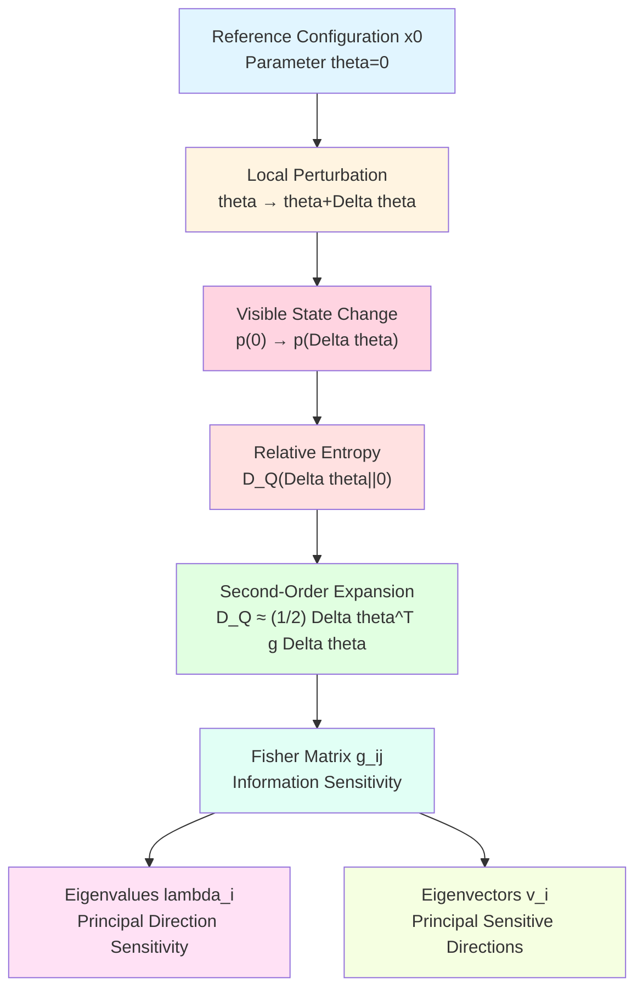
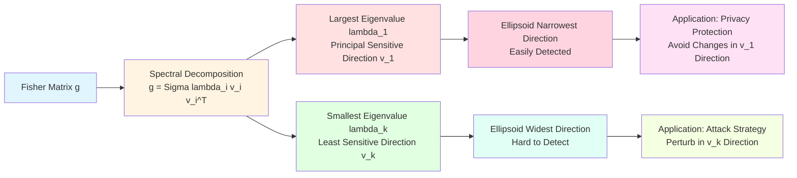
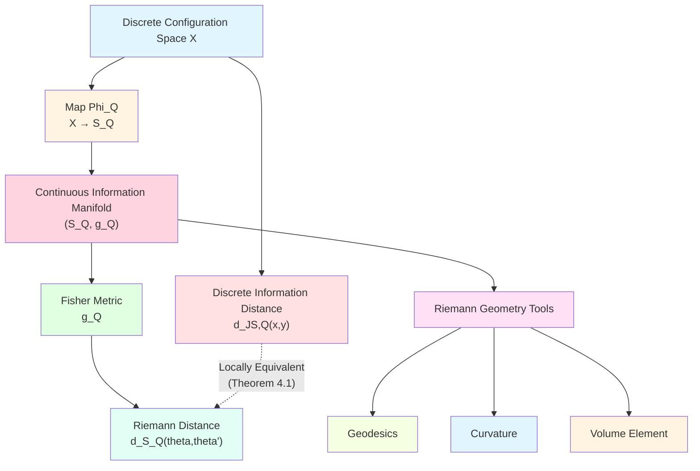
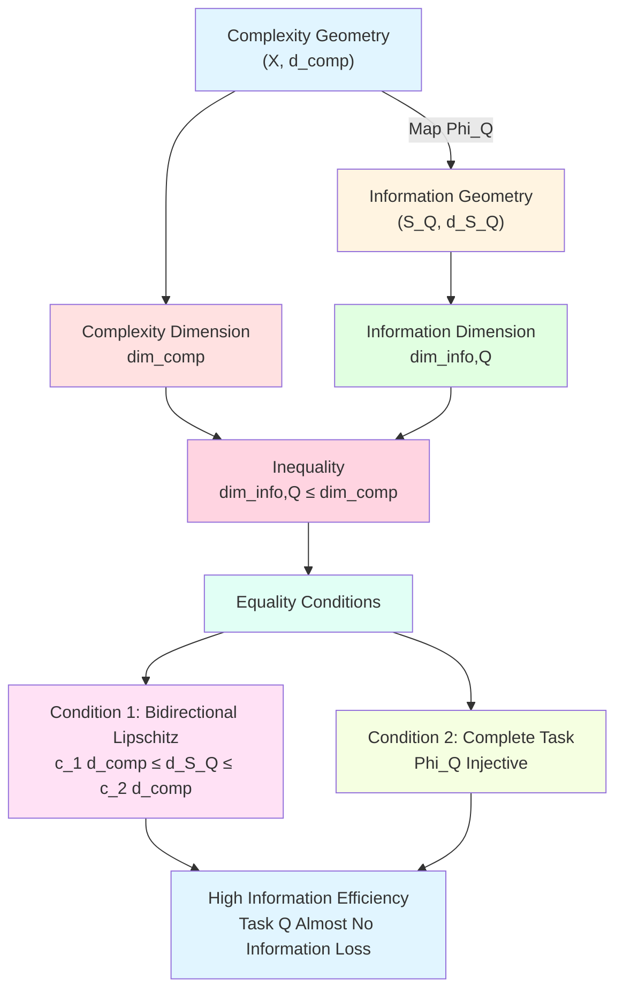
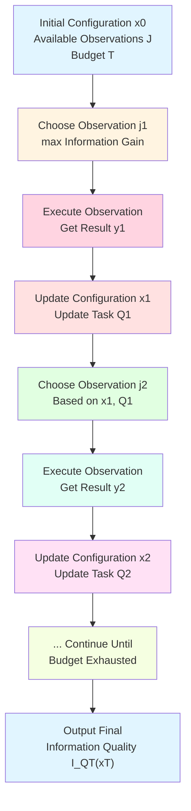
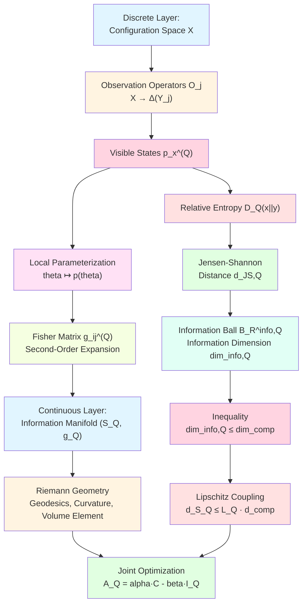

# 23.7 Fisher Structure and Deepening of Information-Complexity Inequality

In the previous article, we established task-perceived information geometry: mapping configurations to visible states through observation operator families, measuring information differences with Jensen-Shannon distance, and proved information dimension is constrained by complexity dimension. But we only touched on local Fisher structure, didn't deeply explore its geometric meaning and practical applications.

This article will deepen understanding of Fisher information matrix, establish finer information-complexity inequalities, and explore how to use these structures to design optimal observation strategies in practical problems.

**Core Questions**:
- Why is Fisher matrix natural metric of "information sensitivity"?
- Under what conditions does information dimension equal complexity dimension?
- How to choose task $Q$ to maximize information gain?

This article is based on euler-gls-info/03-discrete-information-geometry.md Sections 4-5 and appendices.

---

## 1. Geometric Meaning of Fisher Matrix: Why Is It "Information Sensitivity"?

### 1.1 Starting from Physical Analogy: Stiffness of Spring

Imagine a spring system:
- You move spring near equilibrium position $x_0$, displacement is $\Delta x$;
- Potential energy change is $\Delta U \approx \frac{1}{2}k(\Delta x)^2$, where $k$ is spring stiffness;
- Larger stiffness $k$, larger potential energy change per unit displacement, system more "sensitive" to displacement.

Fisher matrix plays exactly similar role:
- You move from reference configuration $x_0$ to $x$ nearby, parameter change is $\Delta\theta$;
- Relative entropy change is $D_Q(\theta\Vert 0) \approx \frac{1}{2}\Delta\theta^\top g^{(Q)} \Delta\theta$;
- Larger coefficients of Fisher matrix $g^{(Q)}$, larger information distance per unit parameter change, task $Q$ more "sensitive" to changes in this direction.

**Core Insight**: Fisher matrix is "stiffness matrix" or "Hessian matrix" in information geometry, its eigenvalues characterize information sensitivity in different directions.

### 1.2 Everyday Analogy: Taste Sensitivity of Wine Taster

Imagine a wine taster tasting wine:
- **Reference State $x_0$**: A standard red wine;
- **Parameter Space $\theta$**: Wine attributes (acidity, sweetness, tannin content, etc.);
- **Task $Q$**: Wine taster's taste test;
- **Visible State $p_\theta^{(Q)}$**: Probability distribution of taster's perception of different flavors.

Components of Fisher matrix $g_{ij}^{(Q)}$ represent:
- $g_{11}$: Sensitivity to acidity changes;
- $g_{22}$: Sensitivity to sweetness changes;
- $g_{12}$: Cross-sensitivity of acidity and sweetness (e.g., sour taste affects perception of sweetness).

**Different tasters have different Fisher matrices**:
- Novice: All coefficients small (insensitive to subtle differences);
- Expert: Some coefficients large (e.g., extremely sensitive to tannin).

**Core Insight**: Fisher matrix quantifies "observer's resolution ability under some task".

### 1.3 Review of Mathematical Definition of Fisher Matrix

**Source Theory**: euler-gls-info/03-discrete-information-geometry.md Definition 4.1

**Definition 1.1** (Local Task Fisher Matrix, from euler-gls-info/03-discrete-information-geometry.md Definition 4.1)

Suppose near configuration $x_0$ there exists local parameterization $\theta \mapsto p(\theta) \in \Delta(Y_Q)$, such that $p(0) = p_0 = p_{x_0}^{(Q)}$. Define local Fisher information matrix of task $Q$ as

$$
g_{ij}^{(Q)}(0)
=
\sum_{z\in Y_Q}
p_0(z)\,
\partial_{\theta_i}\log p(\theta)(z)\big\vert_{\theta=0}\,
\partial_{\theta_j}\log p(\theta)(z)\big\vert_{\theta=0}.
$$

**Physical Interpretation**:
- $\log p(\theta)(z)$ is "log-likelihood", its gradient $\partial_i \log p$ is called "score function";
- $g_{ij}^{(Q)}$ is covariance of score functions: $g_{ij} = \mathrm{Cov}(\partial_i \log p, \partial_j \log p)$;
- Large covariance means high joint sensitivity to these two parameter directions.

---

## 2. Spectral Decomposition of Fisher Matrix: Principal Sensitive Directions

**Source Theory**: Based on euler-gls-info/03-discrete-information-geometry.md Theorem 4.2

### 2.1 Meaning of Eigenvalues and Eigenvectors

Fisher matrix $g^{(Q)}$ is symmetric positive semidefinite matrix, can perform spectral decomposition:

$$
g^{(Q)} = \sum_{i=1}^{k} \lambda_i v_i v_i^\top,
$$

where $\lambda_1 \ge \lambda_2 \ge \cdots \ge \lambda_k \ge 0$ are eigenvalues, $v_1,\dots,v_k$ are corresponding unit eigenvectors.

**Geometric Meaning**:
- **Eigenvector $v_i$**: $i$-th principal sensitive direction, i.e., "when moving in this direction, information change most significant";
- **Eigenvalue $\lambda_i$**: Information sensitivity in direction $v_i$, i.e., "relative entropy increment per unit displacement".

### 2.2 Everyday Analogy: Camera Field of View

Imagine a camera monitoring a room:
- **Reference State $x_0$**: Empty room;
- **Parameter Space $\theta$**: Positions of objects in room (2D);
- **Task $Q$**: Camera's image recognition;
- **Fisher Matrix $g^{(Q)}$**: Sensitivity to object movement.

If camera faces door:
- **Principal Direction $v_1$**: Horizontal direction (parallel to door);
- **Principal Eigenvalue $\lambda_1$**: Large (people entering/exiting door, image changes significantly);
- **Secondary Direction $v_2$**: Vertical direction (perpendicular to door);
- **Secondary Eigenvalue $\lambda_2$**: Smaller (near-far movement, image changes less significantly).

**Core Insight**: Spectral decomposition of Fisher matrix tells us "which directions of change are most easily detected by task $Q$".

### 2.3 Information Ellipsoid: Geometric Representation of Distinguishability

Second-order approximation of relative entropy $D_Q(\theta\Vert 0) \approx \frac{1}{2}\theta^\top g^{(Q)} \theta$ defines an ellipsoid:

$$
\mathcal{E}_\epsilon = \{\theta : \theta^\top g^{(Q)} \theta \le 2\epsilon\}.
$$

Geometric features of this ellipsoid:
- **Principal Axis Directions**: Eigenvectors $v_i$;
- **Principal Axis Radii**: $r_i = \sqrt{2\epsilon/\lambda_i}$;
- **Maximum Sensitive Direction**: Direction $v_1$ corresponding to largest eigenvalue $\lambda_1$, ellipsoid most "flat" in this direction;
- **Minimum Sensitive Direction**: Direction $v_k$ corresponding to smallest eigenvalue $\lambda_k$, ellipsoid most "wide" in this direction.

**Everyday Interpretation**:
- If you move little in $v_1$ direction, will be detected by task $Q$ (ellipsoid narrow in this direction);
- If you move much in $v_k$ direction, may still not be detected (ellipsoid wide in this direction).

---

## 3. Second-Order Expansion of Relative Entropy: Information-Theoretic Version of Cramér-Rao Bound

**Source Theory**: euler-gls-info/03-discrete-information-geometry.md Theorem 4.2 and Appendix B.1

### 3.1 Core Theorem

**Theorem 3.1** (Fisher Second-Order Form of Relative Entropy, from euler-gls-info/03-discrete-information-geometry.md Theorem 4.2)

Under local parameterization $\theta \mapsto p(\theta)$ and standard regularity conditions, for sufficiently small $\theta\in\Theta$, we have

$$
D_Q\big(\theta\Vert 0\big)
=
D\big(p(\theta)\Vert p(0)\big)
=
\frac{1}{2}
\sum_{i,j} g_{ij}^{(Q)}(0)\,\theta_i\theta_j
+ o(|\theta|^2).
$$

**Everyday Interpretation**:
- This theorem says "relative entropy locally is a quadratic form, coefficient matrix is Fisher matrix";
- Physical analogy: Potential energy near equilibrium point $U(\mathbf{x}) \approx \frac{1}{2}\mathbf{x}^\top H \mathbf{x}$, where $H$ is Hessian matrix;
- Fisher matrix $g^{(Q)}$ is "information Hessian" of relative entropy.

### 3.2 Proof Strategy (Details in Source Theory Appendix B.1)

Core steps of proof:
1. Perform Taylor expansion of relative entropy $D(p_\theta\Vert p_0) = \sum_z p_\theta(z)\log\frac{p_\theta(z)}{p_0(z)}$ at $\theta=0$;
2. Zeroth-order term: $D(p_0\Vert p_0) = 0$;
3. First-order term: By probability normalization condition $\sum_z p_\theta(z) = 1$, first derivative is zero;
4. Second-order term: Through second derivative of log-likelihood, simplify to $\frac{1}{2}\sum_{ij} g_{ij}\theta_i\theta_j$, where $g_{ij} = \sum_z p_0(z)\partial_i\log p\cdot\partial_j\log p$.

**Core Technique**: Use identity

$$
\sum_z \partial_i p_\theta(z) \cdot \partial_j \log p_\theta(z)
=
\sum_z p_\theta(z) \cdot \partial_i \log p_\theta(z) \cdot \partial_j \log p_\theta(z),
$$

convert mixed derivatives to covariance of score functions.

### 3.3 Connection with Cramér-Rao Bound

In statistics, Cramér-Rao bound says: For any unbiased estimator $\hat{\theta}$ of parameter $\theta$, its covariance matrix satisfies

$$
\mathrm{Cov}(\hat{\theta}) \ge g^{-1},
$$

where $g$ is Fisher information matrix, inequality means positive semidefinite order of matrices.

**Everyday Interpretation**:
- Larger Fisher matrix, higher precision upper bound of estimation (smaller variance);
- Inverse of Fisher matrix $g^{-1}$ gives "variance lower bound of optimal estimation".

**Connection with Relative Entropy**:
- Relative entropy $D_Q(\theta\Vert 0) \approx \frac{1}{2}\theta^\top g \theta$ characterizes "when true parameter deviates from $\theta_0$, distinguishability of observation distribution";
- Cramér-Rao bound says "given observation data, how high precision can we estimate parameters";
- Both unified through Fisher matrix: Fisher matrix is both "Hessian of information" and "lower bound of estimation precision".

---

## 4. Consistency of Geodesic Distance on Information Manifold and Jensen-Shannon Distance

**Source Theory**: euler-gls-info/03-discrete-information-geometry.md Theorem 4.5 and Appendix B.2

### 4.1 Local Consistency Theorem

**Theorem 4.1** (Consistency of Local Information Distance, from euler-gls-info/03-discrete-information-geometry.md Theorem 4.5)

Let $x,x_0 \in X$ such that $\Phi_Q(x_0) = \theta_0$, $\Phi_Q(x) = \theta$, and $\theta$ is close to $\theta_0$. Then

$$
d_{\mathrm{JS},Q}(x,x_0)
=
\sqrt{
(\theta-\theta_0)^\top g_Q(\theta_0)(\theta-\theta_0)
}
+ o(|\theta-\theta_0|).
$$

**Everyday Interpretation**:
- Left side $d_{\mathrm{JS},Q}$ is Jensen-Shannon information distance on discrete configuration space;
- Right side $\sqrt{(\theta-\theta_0)^\top g_Q(\theta_0)(\theta-\theta_0)}$ is geodesic distance induced by Fisher metric on continuous information manifold;
- Theorem says "locally, they are equivalent".

### 4.2 Why Square Root?

Note square root in theorem, this corresponds to:
- Relative entropy $D_Q(\theta\Vert 0) \approx \frac{1}{2}\theta^\top g \theta$ (quadratic form);
- Jensen-Shannon divergence $\mathrm{JS}_Q(x,y) \approx \frac{1}{4}(\theta-\theta_0)^\top g (\theta-\theta_0)$ (also quadratic form);
- Jensen-Shannon distance $d_{\mathrm{JS},Q} = \sqrt{2\mathrm{JS}_Q} \approx \sqrt{\frac{1}{2}\theta^\top g \theta}$ (need square root to satisfy triangle inequality).

**Everyday Analogy**: This is similar to relationship between "distance squared" and "distance" in Euclidean space:
- Distance squared: $\|\mathbf{x}\|^2 = \mathbf{x}^\top \mathbf{x}$ (does not satisfy triangle inequality);
- Distance: $\|\mathbf{x}\| = \sqrt{\mathbf{x}^\top \mathbf{x}}$ (satisfies triangle inequality).

### 4.3 Riemann Geometry of Information Manifold

Deep meaning of Theorem 4.1 is: Under Assumption 4.3 (existence of information manifold $(\mathcal{S}_Q,g_Q)$), discrete information geometry converges in continuous limit to a standard Riemann manifold, whose metric is Fisher information metric $g_Q$.

This means we can use all tools of Riemann geometry to study information geometry:
- **Geodesics**: Paths with shortest information distance;
- **Curvature**: "Degree of bending" of information manifold;
- **Volume Element**: Volume formula of information ball;
- **Parallel Transport**: Preserving "information direction" along paths.

---

## 5. Strengthened Form of Information-Complexity Inequality

**Source Theory**: euler-gls-info/03-discrete-information-geometry.md Proposition 3.4, Proposition 5.1 and Appendices A.1, C.1

### 5.1 Review of Global Lipschitz Inequality

In Article 23.6, we proved global volume containment relation:

**Theorem 5.1** (Information Dimension Constrained by Complexity Dimension, from euler-gls-info/03-discrete-information-geometry.md Proposition 3.4)

Assume there exists constant $L_Q>0$, such that for all adjacent configurations $x,y$ we have $d_{\mathrm{JS},Q}(x,y) \le L_Q\,\mathsf{C}(x,y)$, then

$$
V_{x_0}^{\mathrm{info},Q}(R)
\le
V_{x_0}^{\mathrm{comp}}\!\left(\frac{R}{L_Q}\right),
$$

therefore $\dim_{\mathrm{info},Q}(x_0) \le \dim_{\mathrm{comp}}(x_0)$.

### 5.2 Local Lipschitz Inequality

Under information manifold framework, we have finer local version:

**Proposition 5.2** (Local Information-Complexity Lipschitz Inequality, from euler-gls-info/03-discrete-information-geometry.md Proposition 5.1)

If there exists constant $L_Q^{\mathrm{loc}}>0$, such that for all adjacent configurations $x,y$ we have

$$
d_{\mathcal{S}_Q}\big(\Phi_Q(x),\Phi_Q(y)\big)
\le
L_Q^{\mathrm{loc}} \,\mathsf{C}(x,y),
$$

then for any path $\gamma$ we have

$$
L_Q(\gamma)
\le
L_Q^{\mathrm{loc}}\,\mathsf{C}(\gamma).
$$

In particular,

$$
d_{\mathcal{S}_Q}\big(\Phi_Q(x_0),\Phi_Q(x)\big)
\le
L_Q^{\mathrm{loc}}\,d_{\mathrm{comp}}(x_0,x).
$$

**Everyday Interpretation**:
- Lipschitz constant $L_Q^{\mathrm{loc}}$ characterizes "maximum information gain per unit complexity cost";
- If $L_Q^{\mathrm{loc}}$ is large, means task $Q$ has high "information efficiency";
- If $L_Q^{\mathrm{loc}}$ is small, means need large complexity cost to obtain little information.

### 5.3 Conditions for Equality: When Does Information Dimension Equal Complexity Dimension?

Theorem 5.1 gives inequality $\dim_{\mathrm{info},Q} \le \dim_{\mathrm{comp}}$, when does equality hold?

**Condition 1**: Surjective Map $\Phi_Q$

If map $\Phi_Q : X \to \mathcal{S}_Q$ is "surjective" (i.e., each information state corresponds to at least one configuration), and Lipschitz constant holds in both directions:

$$
c_1 d_{\mathrm{comp}}(x,y)
\le
d_{\mathcal{S}_Q}(\Phi_Q(x),\Phi_Q(y))
\le
c_2 d_{\mathrm{comp}}(x,y),
$$

then information ball volume and complexity ball volume grow at same rate, therefore $\dim_{\mathrm{info},Q} = \dim_{\mathrm{comp}}$.

**Condition 2**: Task $Q$ is "Complete"

If task $Q$ contains enough observation operators, such that different configurations must have different visible states under $Q$ (i.e., $p_x^{(Q)} \neq p_y^{(Q)}$ for all $x \neq y$), then $\Phi_Q$ is injective, information geometry inherits all structure of complexity geometry.

**Everyday Analogy**:
- **Incomplete Task**: Taking photos with low-resolution camera, many details lost, $\dim_{\mathrm{info},Q} < \dim_{\mathrm{comp}}$;
- **Complete Task**: Taking photos with high-resolution camera, almost all details preserved, $\dim_{\mathrm{info},Q} \approx \dim_{\mathrm{comp}}$.

---

## 6. Curvature and Volume Growth of Information Manifold

### 6.1 Ricci Curvature on Information Manifold

Although source theory doesn't discuss curvature of information manifold in detail, we can borrow ideas from Article 23.5 about Ricci curvature of complexity geometry.

For information manifold $(\mathcal{S}_Q, g_Q)$, we can define standard Riemann curvature tensor $R_{ijkl}$ and Ricci curvature $\mathrm{Ric}_{ij}$.

**Physical Meaning**:
- **Positive Curvature**: Volume growth of information ball slower than Euclidean space, means "information highly concentrated";
- **Zero Curvature**: Volume growth of information ball same as Euclidean space, information manifold locally flat;
- **Negative Curvature**: Volume growth of information ball faster than Euclidean space, means "information highly dispersed".

### 6.2 Everyday Analogy: Information Density of City

Imagine "information map" of city:
- **City Center**: High information density, positive Ricci curvature (spherical geometry), contains large amount of information per unit distance;
- **Suburbs**: Low information density, Ricci curvature near zero (planar geometry), less information per unit distance;
- **Information Desert**: Almost no information, negative Ricci curvature (hyperbolic geometry), even walk far cannot see new things.

### 6.3 Volume Element of Information Manifold

On Riemann manifold $(\mathcal{S}_Q, g_Q)$, volume element given by determinant of metric:

$$
\mathrm{d}V_Q = \sqrt{\det g_Q} \,\mathrm{d}\theta^1 \cdots \mathrm{d}\theta^k.
$$

Volume of information ball is

$$
V_{x_0}^{\mathrm{info},Q}(R)
\approx
\int_{d_{\mathcal{S}_Q}(\theta_0,\theta) \le R}
\sqrt{\det g_Q(\theta)} \,\mathrm{d}^k\theta.
$$

**Comparison with Complexity Geometry**:
- Complexity Geometry: Metric $G_{ab}$ induced by single-step cost $\mathsf{C}(x,y)$;
- Information Geometry: Metric $g_Q$ induced by observation operator family $\mathcal{O}$ and task $Q$;
- Both coupled through Lipschitz inequality.

---

## 7. Optimal Observation Strategy: How to Choose Task $Q$?

**Source Theory Inspiration**: Based on joint action idea from euler-gls-info/03-discrete-information-geometry.md Section 5

### 7.1 Problem Setting

Assume you have fixed computation budget $T$ (complexity cost upper bound), you want to design an observation task $Q$, such that maximum information can be obtained within budget.

**Formalization**: Given complexity constraint $\mathsf{C}(\gamma) \le T$, choose task $Q$ such that endpoint information quality $\mathsf{I}_Q(x_n)$ is maximized.

### 7.2 Greedy Strategy: Maximize Local Information Gain

At each step, choose observation $O_j$ that maximizes single-step information gain:

$$
j^* = \arg\max_{j\in J} d_{\mathcal{S}_{\{j\}}}(\Phi_{\{j\}}(x),\Phi_{\{j\}}(x_0)),
$$

i.e., choose observation with "largest information distance from reference configuration $x_0$ under current configuration $x$".

**Everyday Analogy**:
- Doctor diagnosing disease: First do most distinguishing test (e.g., if suspect heart disease, do ECG first rather than blood test);
- Detective solving case: First investigate most suspicious clue.

### 7.3 Optimal Task Selection: Information-Complexity Efficiency

For task $Q\subset J$, define information-complexity efficiency as

$$
\eta_Q = \frac{\dim_{\mathrm{info},Q}}{|Q| \cdot c_Q},
$$

where $|Q|$ is number of observations in task, $c_Q$ is average complexity cost per observation.

**Interpretation**:
- $\dim_{\mathrm{info},Q}$: Information dimension provided by task (gain);
- $|Q| \cdot c_Q$: Total complexity cost of task (cost);
- $\eta_Q$: Information gain per unit cost (efficiency).

**Optimal Task**: $Q^* = \arg\max_Q \eta_Q$.

**Everyday Analogy**:
- Choosing exam subjects: In limited review time, prioritize "high cost-performance" subjects (more score improvement per unit time);
- Investment decision: In limited funds, prioritize "high return rate" projects.

### 7.4 Adaptive Observation: Adjust Task Based on Intermediate Results

Finer strategy is "adaptive observation": Based on observation results of previous steps, dynamically adjust subsequent observation task.

**Algorithm Framework**:
1. Initialize: $x_0$, task set $J$, budget $T$;
2. For $t=1,2,\dots$ until budget exhausted:
   - Based on current configuration $x_{t-1}$ and historical observations, choose next observation $j_t$;
   - Execute observation, get result, update configuration $x_t$;
   - Update task $Q_t = Q_{t-1} \cup \{j_t\}$;
3. Output: Final information quality $\mathsf{I}_{Q_T}(x_T)$.

**Everyday Analogy**:
- Doctor diagnosis: Based on preliminary test results, decide if further specialized tests needed;
- Machine learning: Active learning, choose next labeled sample based on model uncertainty.

---

## 8. Application Example: Fisher Information Matrix in Deep Learning

### 8.1 Fisher Matrix of Neural Network Parameters

Consider a neural network:
- **Configuration Space $X$**: All possible weight configurations $W \in \mathbb{R}^d$;
- **Task $Q$**: Classification on test set;
- **Visible State $p_W^{(Q)}$**: Model's output probability distribution $p(y|x;W)$;
- **Fisher Matrix**:

$$
g_{ij}^{(Q)}
=
\mathbb{E}_{x\sim\text{data}}
\left[
\sum_{y}
p(y|x;W)\,
\partial_{W_i}\log p(y|x;W)\,
\partial_{W_j}\log p(y|x;W)
\right].
$$

### 8.2 Applications of Fisher Matrix

**Application 1: Natural Gradient Descent**

Ordinary gradient descent moves along gradient direction in parameter space, but "distance" in parameter space is not information distance. Natural gradient descent uses inverse of Fisher matrix as metric, moves along "steepest descent direction" in information geometry:

$$
W_{t+1} = W_t - \eta \,(g^{(Q)})^{-1} \nabla L(W_t).
$$

**Intuitive Explanation**:
- Ordinary gradient: Unit step in parameter space;
- Natural gradient: Unit step in information space, considers information sensitivity of different parameter directions.

**Application 2: Model Compression**

Parameter directions corresponding to small eigenvalues of Fisher matrix "have small impact on output", can be safely pruned or quantized, thus compressing model:
- Identify small eigenvalue directions: $\lambda_i < \epsilon$;
- Round parameters in these directions: $W_i \to \text{round}(W_i)$;
- Information loss controllable: $\Delta D_Q \approx \frac{1}{2}\sum_{i:\lambda_i<\epsilon} \lambda_i (\Delta W_i)^2$.

**Application 3: Uncertainty Estimation**

Inverse of Fisher matrix approximates posterior covariance of parameters (Laplace approximation):

$$
p(W|\text{data}) \approx \mathcal{N}\big(W^*,\, (g^{(Q)})^{-1}\big),
$$

where $W^*$ is maximum likelihood estimate. This can be used for uncertainty quantification in Bayesian neural networks.

### 8.3 Everyday Analogy: "Important Directions" in Sculpting

Imagine you're sculpting a statue:
- **Parameter Space**: All possible sculpting states;
- **Fisher Matrix**: "Impact on overall appearance of statue" in each direction;
- **Large Eigenvalue Directions**: Key details (e.g., facial contours), must carve meticulously;
- **Small Eigenvalue Directions**: Minor details (e.g., background texture), can handle roughly.

**Core Insight**: Fisher matrix tells you "which parameters important for task, which not", thus guides optimization, compression, regularization, etc.

---

## 9. Information-Complexity Joint Optimization: Preview of Variational Principle

**Source Theory**: euler-gls-info/03-discrete-information-geometry.md Definition 5.2

### 9.1 Refinement of Joint Action

Recalling joint action from Article 23.6:

$$
\mathcal{A}_Q(\gamma)
=
\alpha \,\mathsf{C}(\gamma)
-
\beta\,\mathsf{I}_Q(x_n).
$$

Now we can refine this action using Fisher structure. On information manifold, information quality can be represented as "integral of information distance":

$$
\mathsf{I}_Q(x_n)
=
\int_{\gamma_{\mathrm{info}}}
\sqrt{g_{ij}^{(Q)}\,\mathrm{d}\theta^i\,\mathrm{d}\theta^j},
$$

where $\gamma_{\mathrm{info}} = \Phi_Q(\gamma)$ is information path.

**Complete Form of Joint Action**:

$$
\mathcal{A}_Q[\gamma]
=
\int_\gamma
\left[
\alpha\,\mathrm{d}\mathsf{C}
-
\beta\sqrt{g_{ij}^{(Q)}\,\mathrm{d}\theta^i\,\mathrm{d}\theta^j}
\right].
$$

### 9.2 Expected Form of Euler-Lagrange Equations

Although detailed derivation waits until Articles 23.10-11, we can expect optimal path satisfies some Euler-Lagrange equation, of form:

$$
\frac{\mathrm{d}}{\mathrm{d}t}
\left(
\frac{\partial \mathcal{L}}{\partial \dot{\theta}}
\right)
-
\frac{\partial \mathcal{L}}{\partial \theta}
= 0,
$$

where Lagrangian density is

$$
\mathcal{L}(\theta,\dot{\theta})
=
\alpha\sqrt{G_{ab}\dot{\theta}^a\dot{\theta}^b}
-
\beta\sqrt{g_{ij}^{(Q)}\dot{\theta}^i\dot{\theta}^j}.
$$

**Everyday Interpretation**:
- First term: Complexity cost (expense);
- Second term: Information gain (income);
- Euler-Lagrange equation: Continuous version of marginal cost = marginal gain.

### 9.3 Analogy with Physics: Fermat's Principle

This variational principle is similar to Fermat's principle in optics:
- **Fermat's Principle**: Light travels along path minimizing propagation time;
- **Information-Complexity Principle**: Computation proceeds along path optimizing "complexity-information".

Mathematical structures of both are identical, both are functional extremum problems of paths.

---

## 10. Complete Picture: Information Geometry from Discrete to Continuous

### 10.1 Multi-Layer Structure Summary

### 10.2 Core Formula Quick Reference

| Concept | Discrete Version | Continuous Version |
|---------|------------------|-------------------|
| Visible State | $p_x^{(Q)} \in \Delta(Y_Q)$ | $p(\theta) \in \Delta(Y_Q)$ |
| Relative Entropy | $D_Q(x\Vert y)$ | $D(p(\theta)\Vert p(0))$ |
| Information Distance | $d_{\mathrm{JS},Q}(x,y)$ | $\sqrt{(\theta-\theta_0)^\top g_Q(\theta-\theta_0)}$ |
| Local Metric | Fisher Matrix $g_{ij}^{(Q)}$ | Riemann Metric $g_Q$ |
| Second-Order Expansion | $D_Q(\theta\Vert 0) \approx \frac{1}{2}\theta^\top g \theta$ | - |
| Volume | $V^{\mathrm{info},Q}(R) = \|B_R^{\mathrm{info},Q}\|$ | $\int_{B_R} \sqrt{\det g_Q}\,\mathrm{d}^k\theta$ |
| Dimension | $\dim_{\mathrm{info},Q} = \limsup \frac{\log V}{\log R}$ | $k = \dim \mathcal{S}_Q$ |

### 10.3 Comparison with Complexity Geometry

| Dimension | Complexity Geometry | Information Geometry |
|-----------|-------------------|---------------------|
| Basic Object | Configuration $x\in X$ | Visible State $p_x^{(Q)}$ |
| Basic Distance | $d_{\mathrm{comp}}(x,y)$ | $d_{\mathrm{JS},Q}(x,y)$ |
| Local Metric | Complexity Metric $G_{ab}$ | Fisher Metric $g_{ij}^{(Q)}$ |
| Curvature | Discrete Ricci $\kappa(x,y)$ | Riemann Curvature $R_{ijkl}$ |
| Volume Growth | $V^{\mathrm{comp}}(T)$ | $V^{\mathrm{info},Q}(R)$ |
| Dimension | $\dim_{\mathrm{comp}}$ | $\dim_{\mathrm{info},Q}$ |
| Physical Meaning | "How far walked" | "What seen" |
| Dependence | Task-Independent | Task-Dependent |

---

## 11. Summary

This article deepens understanding of information geometry, core points:

### 11.1 Core Concepts

1. **Fisher Matrix $g_{ij}^{(Q)}$**: Hessian of relative entropy, characterizes information sensitivity;
2. **Spectral Decomposition $g = \sum \lambda_i v_i v_i^\top$**: Principal sensitive directions and sensitivities;
3. **Second-Order Expansion of Relative Entropy $D_Q(\theta\Vert 0) \approx \frac{1}{2}\theta^\top g \theta$**: Local quadratic approximation;
4. **Information Manifold $(\mathcal{S}_Q,g_Q)$**: Continuous limit of discrete information geometry;
5. **Local Consistency $d_{\mathrm{JS},Q} \approx \sqrt{\theta^\top g_Q \theta}$**: Bridge between discrete and continuous;
6. **Lipschitz Inequality $d_{\mathcal{S}_Q} \le L_Q^{\mathrm{loc}} d_{\mathrm{comp}}$**: Information constrained by complexity;
7. **Equality Conditions**: Bidirectional Lipschitz or complete task;
8. **Optimal Observation Strategy**: Maximize information-complexity efficiency $\eta_Q$;
9. **Adaptive Observation**: Dynamically adjust task based on intermediate results;
10. **Joint Action $\mathcal{A}_Q = \alpha\mathsf{C} - \beta\mathsf{I}_Q$**: Foundation of variational principle.

### 11.2 Core Insights

- **Fisher Matrix Is Core of Information Geometry**: It is both Hessian of relative entropy, foundation of Cramér-Rao bound, and local representation of Riemann metric;
- **Spectral Decomposition Reveals Principal Sensitive Directions**: Large eigenvalues correspond to "easily detected" directions, small eigenvalues correspond to "hard to detect" directions;
- **Information-Complexity Inequality Is Resource Constraint**: $\dim_{\mathrm{info},Q} \le \dim_{\mathrm{comp}}$, information gain constrained by computational resources;
- **Equality Requires Efficient Task**: Complete task or bidirectional Lipschitz;
- **Optimal Task Selection Is Engineering Problem**: Under finite resources, choose observations with highest information-complexity efficiency.

### 11.3 Everyday Analogy Review

- **Spring Stiffness**: Fisher matrix = information stiffness;
- **Wine Taster**: Taste sensitivity in different directions;
- **Camera Field of View**: Principal sensitive direction = principal viewing direction;
- **City Information Density**: Ricci curvature = information concentration;
- **Important Directions in Sculpting**: Fisher eigenvalues = parameter importance;
- **Investment Efficiency**: Information-complexity efficiency = investment return rate.

### 11.4 Mathematical Structure

**Source Theory**: All core content in this article strictly based on euler-gls-info/03-discrete-information-geometry.md Sections 4-5 and Appendices A, B, C.

**Key Formulas**:

1. Fisher matrix: $g_{ij}^{(Q)} = \sum_z p_0(z)\,\partial_i\log p\,\partial_j\log p$
2. Relative entropy expansion: $D_Q(\theta\Vert 0) = \frac{1}{2}\theta^\top g^{(Q)} \theta + o(|\theta|^2)$
3. Local consistency: $d_{\mathrm{JS},Q}(x,x_0) = \sqrt{(\theta-\theta_0)^\top g_Q(\theta-\theta_0)} + o(|\theta-\theta_0|)$
4. Lipschitz inequality: $d_{\mathcal{S}_Q}(\Phi_Q(x),\Phi_Q(y)) \le L_Q^{\mathrm{loc}} d_{\mathrm{comp}}(x,y)$
5. Dimension inequality: $\dim_{\mathrm{info},Q}(x_0) \le \dim_{\mathrm{comp}}(x_0)$
6. Volume containment: $V_{x_0}^{\mathrm{info},Q}(R) \le V_{x_0}^{\mathrm{comp}}(R/L_Q)$

---

**Preview of Next Article**: 23.8 Unified Time Scale: Physical Realization of Scattering Master Ruler

In next article, we will introduce **unified time scale** $\kappa(\omega)$, which is key bridge connecting complexity geometry, information geometry, and physical spacetime:
1. **Scattering Phase Derivative $\kappa(\omega) = \varphi'(\omega)/\pi$**: Frequency-dependent "time density";
2. **Spectral Shift Density $\rho_{\mathrm{rel}}(\omega) = (2\pi)^{-1}\mathrm{tr}Q(\omega)$**: Trace of group delay matrix;
3. **Continuous Limit of Single-Step Cost $\mathsf{C}(x,y) = \int \kappa(\omega)\,\mathrm{d}\mu_{x,y}$**: From discrete to continuous;
4. **Unification of Control Manifold $(\mathcal{M},G)$ and Information Manifold $(\mathcal{S}_Q,g_Q)$**: Coupled through unified time scale;
5. **Gromov-Hausdorff Convergence**: Discrete complexity geometry converges to continuous control manifold.

