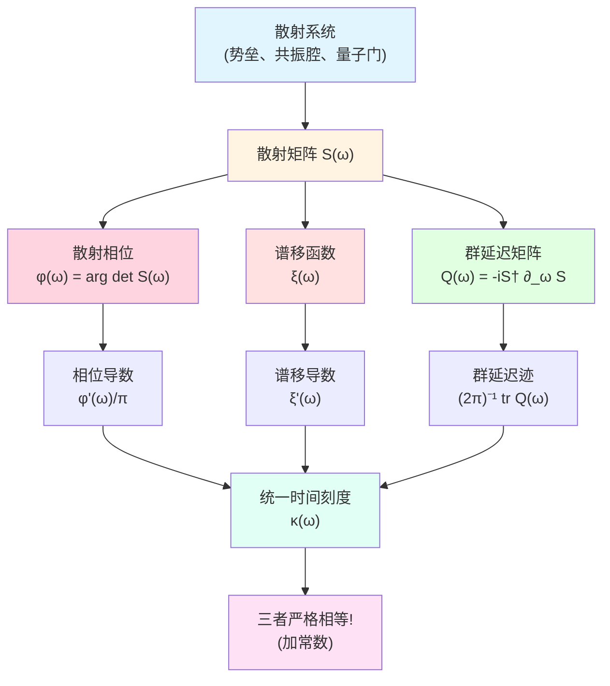
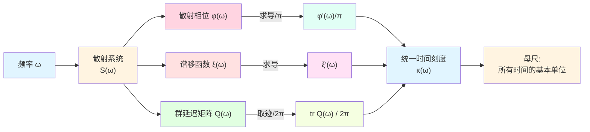
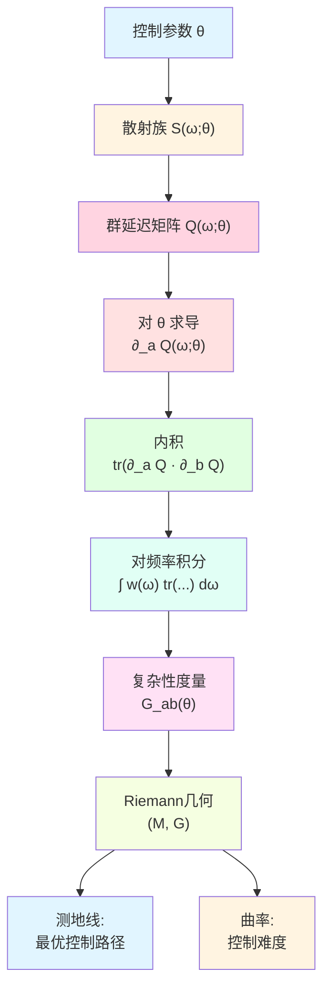
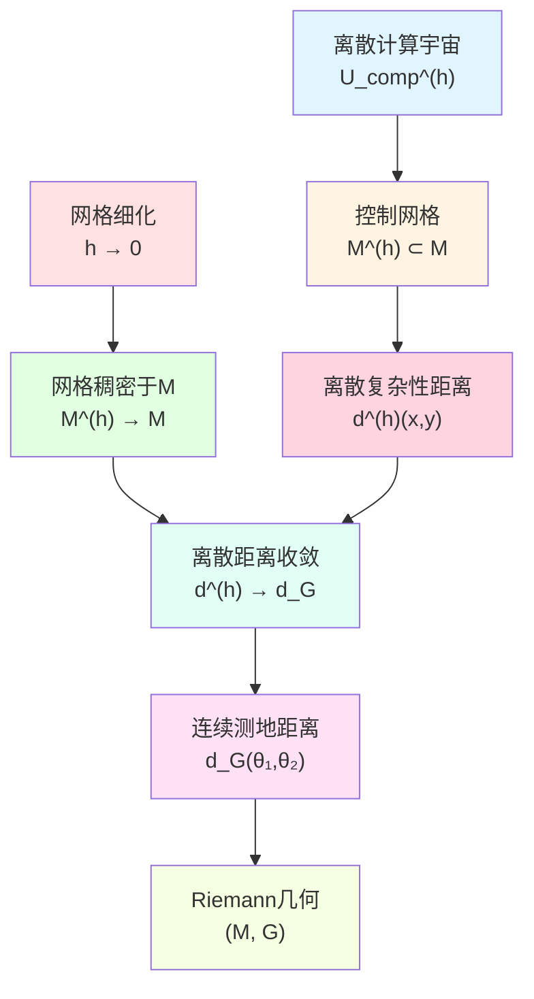
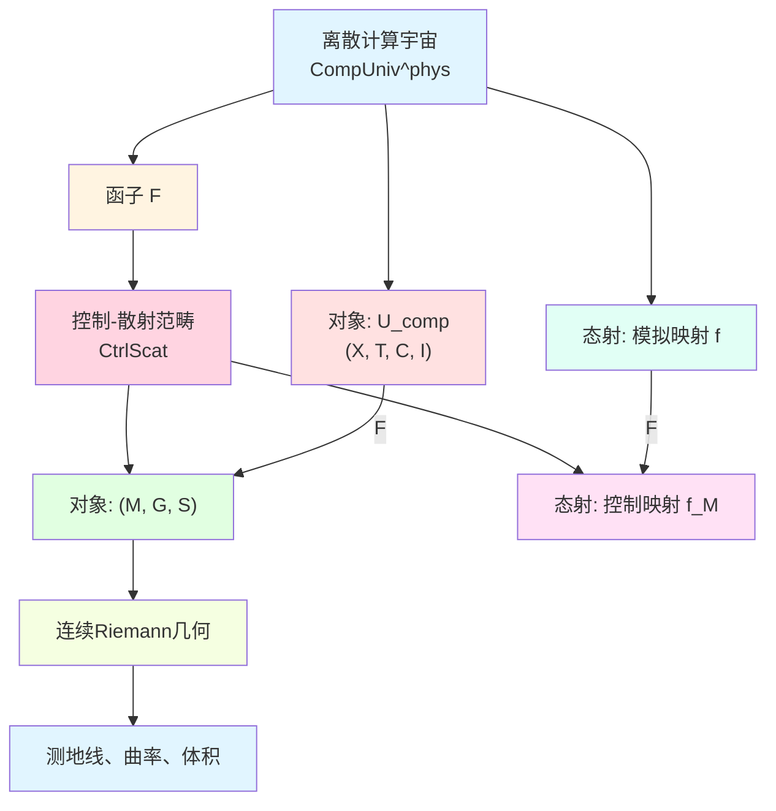
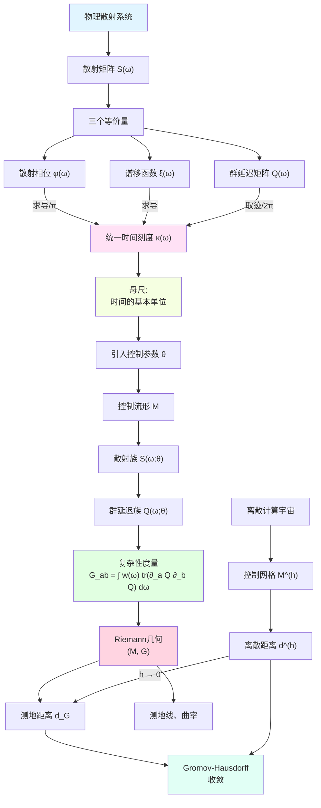

# 23.8 统一时间刻度:散射母尺的物理实现

在前面的文章中,我们建立了计算宇宙的离散几何:复杂性几何告诉我们"计算有多难",信息几何告诉我们"能得到什么"。但这些都是抽象的几何结构,还没有回答一个根本问题:**计算的代价如何与物理时间联系?**

就像用尺子测量长度,我们需要一个"时间的尺子"。但不同于日常的钟表,计算宇宙中的时间应该是**内禀的**,由计算过程本身决定,而不是外部添加的参数。

本篇将引入**统一时间刻度**(Unified Time Scale),它是计算宇宙与物理宇宙的关键桥梁。这个刻度不是人为规定的,而是由散射理论自然诱导的"母尺"。

**核心问题**:
- 什么是统一时间刻度?为什么它能统一散射、谱移、群延迟三个看似无关的量?
- 如何用统一时间刻度定义计算的代价?
- 离散的计算步骤如何在连续极限下变成Riemann几何?

本文基于 euler-gls-info/04-unified-time-scale-continuous-complexity-geometry.md。

---

## 1. 为什么需要统一时间刻度?从钟表到散射

### 1.1 日常时间的局限性

在日常生活中,我们用钟表测量时间:
- **机械钟**:靠摆锤的周期运动;
- **石英钟**:靠石英晶体的振荡频率;
- **原子钟**:靠原子的能级跃迁频率。

所有这些钟表的共同特点:**它们测量的是外部参考系统的周期**,与被测对象无关。

但在计算宇宙中,我们需要的是**内禀时间**:
- 不同的计算过程有不同的"固有时间";
- 计算的"难度"应该由计算本身决定,而不是墙上的钟表;
- 量子计算、经典计算、生物计算的"一步"时间可能完全不同。

**核心问题**:如何定义一个与物理过程本身相关的时间刻度?

### 1.2 散射的物理图像:波的"延迟"

想象你向一口井里扔一块石头:
- 石头下落,几秒后听到"扑通"声;
- 声音从井底反射回来,又过几秒才听到;
- **总延迟时间**就是石头下落+声波往返的时间。

这个延迟时间不是外部钟表测的,而是由**井的深度和声速**决定的内禀量。

在量子力学中,类似的现象叫**散射延迟**:
- 一个波包入射到某个势垒(例如隧道、共振腔);
- 波包被散射,透射或反射;
- 散射后的波包相比自由传播会有一个**相位延迟**,这个延迟对应一个"群延迟时间"。

**核心洞察**:散射延迟是物理系统的内禀时间刻度,不依赖外部参考。

### 1.3 三个看似无关的量

在散射理论中,有三个经典的物理量:

1. **散射相位 $\varphi(\omega)$**:波在频率 $\omega$ 下散射后的总相位变化;
2. **谱移函数 $\xi(\omega)$**:系统能谱相对自由情况的"移动";
3. **群延迟 $\tau_g(\omega)$**:波包通过系统的平均延迟时间。

这三个量在经典散射理论中分别来自不同的计算,看起来没什么联系。但在统一时间刻度理论中,它们**奇迹般地是同一个东西的三种表现形式**!

---

## 2. 统一时间刻度的散射母尺

**源理论**:euler-gls-info/04-unified-time-scale-continuous-complexity-geometry.md 第2.1节

### 2.1 散射矩阵与散射相位

**定义 2.1**(散射矩阵)

对一个量子散射系统,设自由哈密顿量为 $H_0$,全哈密顿量为 $H = H_0 + V$(其中 $V$ 是势能或相互作用)。散射算子定义为

$$
S = W_+^\dagger W_-,
$$

其中 $W_\pm$ 是Møller波算子。在频域表示下,$S$ 可以写成频率依赖的散射矩阵 $S(\omega)$,它是酉矩阵:$S(\omega)^\dagger S(\omega) = I$。

**日常类比**:
- 想象一个多端口的电路网络(例如光纤分束器);
- 输入端有多个通道,输出端也有多个通道;
- 散射矩阵 $S(\omega)$ 描述"在频率 $\omega$ 下,各个输入端的信号如何分配到输出端"。

**散射相位的定义**:

总散射相位定义为

$$
\varphi(\omega) = \arg\det S(\omega),
$$

即散射矩阵行列式的辐角。

**日常解读**:
- 如果散射矩阵是对角的(各通道独立),则 $\varphi(\omega) = \sum_i \arg S_{ii}(\omega)$ 是各个通道相位的总和;
- 如果有耦合,相位还包含通道间的干涉贡献。

### 2.2 谱移函数与Birman-Krein公式

**定义 2.2**(谱移函数,源自 euler-gls-info/04-unified-time-scale-continuous-complexity-geometry.md)

谱移函数 $\xi(\omega)$ 通过Birman-Krein公式与散射矩阵联系:

$$
\det S(\omega) = \exp\big(-2\pi\mathrm{i}\,\xi(\omega)\big).
$$

**物理意义**:
- $\xi(\omega)$ 衡量的是"加上势 $V$ 后,能谱在 $\omega$ 以下移动了多少";
- 如果 $\xi(\omega) = 0$,说明能谱没有移动;
- 如果 $\xi(\omega) > 0$,说明能谱整体向下移(更多本征态);
- 如果 $\xi(\omega) < 0$,说明能谱整体向上移(更少本征态)。

**从Birman-Krein公式可以得到**:

$$
\varphi(\omega) = \arg\det S(\omega) = -2\pi\xi(\omega) \pmod{2\pi}.
$$

因此相位与谱移函数直接相关。

### 2.3 群延迟矩阵

**定义 2.3**(Wigner-Smith群延迟矩阵,源自 euler-gls-info/04-unified-time-scale-continuous-complexity-geometry.md 第2.1节)

群延迟矩阵定义为

$$
Q(\omega) = -\mathrm{i}\,S(\omega)^\dagger\partial_\omega S(\omega).
$$

**物理意义**:
- $Q(\omega)$ 是一个Hermite矩阵(因为 $S$ 酉);
- 它的特征值 $\tau_i(\omega)$ 对应各个本征通道的群延迟时间;
- 迹 $\mathrm{tr}\,Q(\omega) = \sum_i \tau_i(\omega)$ 是所有通道的总延迟。

**为什么叫"群延迟"?**

在经典波动理论中,一个波包的群速度是 $v_g = \mathrm{d}\omega/\mathrm{d}k$,其中 $k$ 是波数。群延迟就是波包通过系统所需的时间:

$$
\tau_g = \frac{\mathrm{d}k}{\mathrm{d}\omega} \cdot L,
$$

其中 $L$ 是系统长度。量子散射中,$Q(\omega)$ 推广了这个概念到多通道情形。

### 2.4 统一时间刻度母式:三者的惊人统一

**定理 2.4**(统一时间刻度母式,源自 euler-gls-info/04-unified-time-scale-continuous-complexity-geometry.md 第2.1节)

在常规正则性条件下,以下三个量在加常数意义下相等:

$$
\kappa(\omega) = \frac{\varphi'(\omega)}{\pi} = \xi'(\omega) = \rho_{\mathrm{rel}}(\omega) = \frac{1}{2\pi}\mathrm{tr}\,Q(\omega),
$$

其中 $\rho_{\mathrm{rel}}(\omega)$ 称为相对态密度。

**日常解读**:
- **第一项 $\varphi'(\omega)/\pi$**:"相位对频率的导数"÷$\pi$,刻画相位变化率;
- **第二项 $\xi'(\omega)$**:"谱移函数的导数",刻画能级密度的变化;
- **第三项 $(2\pi)^{-1}\mathrm{tr}\,Q(\omega)$**:"平均群延迟"÷$2\pi$,刻画波包延迟;
- **核心洞察**:这三个物理量**完全等价**,都在测量同一个东西——**系统在频率 $\omega$ 附近的内禀时间刻度密度**!

### 2.5 为什么叫"母尺"?

统一时间刻度 $\kappa(\omega)$ 之所以叫"母尺"(Master Scale),是因为:
- 它像一把"可变的尺子",在不同频率 $\omega$ 下有不同的刻度密度;
- 所有与时间相关的物理量(相位、能谱、延迟)都可以用它来测量;
- 它是**物理时间的最基本单位**,所有其他时间定义都可以从它导出。

**日常类比**:
- 想象一把弹性的尺子,在不同位置拉伸程度不同;
- 在某些区域(共振频率附近),$\kappa(\omega)$ 很大,时间"变慢"(类似相对论中的时间膨胀);
- 在其他区域(远离共振),$\kappa(\omega)$ 很小,时间"正常流动"。

---

## 3. 控制流形:将计算参数化

**源理论**:euler-gls-info/04-unified-time-scale-continuous-complexity-geometry.md 第2.2节

### 3.1 为什么需要"控制"?

在计算宇宙中,配置不是孤立的,而是可以通过某种"控制操作"来改变的。例如:
- **量子计算**:改变量子门的参数(旋转角度、耦合强度);
- **经典计算**:改变逻辑电路的电压、时钟频率;
- **神经网络**:改变权重矩阵的参数。

这些可调的参数形成一个**控制空间**,我们将其几何化为**控制流形** $\mathcal{M}$。

### 3.2 控制流形的定义

**定义 3.1**(控制流形与散射族,源自 euler-gls-info/04-unified-time-scale-continuous-complexity-geometry.md 定义2.1)

一个控制-散射系统由如下数据组成:

1. **控制流形 $\mathcal{M}$**:一个 $d$ 维可微流形,坐标记为 $\theta = (\theta^1,\dots,\theta^d)$;
2. **散射族 $S(\omega;\theta)$**:对每个 $\theta\in\mathcal{M}$ 和频率 $\omega$,赋予一个酉散射矩阵 $S(\omega;\theta)$,它对 $\theta,\omega$ 可微;
3. **群延迟矩阵族 $Q(\omega;\theta)$**:

$$
Q(\omega;\theta) = -\mathrm{i}\,S(\omega;\theta)^\dagger\partial_\omega S(\omega;\theta).
$$

**日常类比**:
- $\theta$ 就是"旋钮的位置":例如收音机的调频旋钮,转动它会改变接收频率;
- $S(\omega;\theta)$ 就是"旋钮在位置 $\theta$ 时,系统对频率 $\omega$ 的响应";
- 控制流形 $\mathcal{M}$ 就是"所有可能的旋钮位置"组成的空间。

### 3.3 例子:单量子比特门

考虑一个单量子比特的旋转门:

$$
U(\theta) = \begin{pmatrix}
\cos(\theta/2) & -\sin(\theta/2) \\
\sin(\theta/2) & \cos(\theta/2)
\end{pmatrix},
$$

其中 $\theta \in [0,2\pi]$ 是旋转角度。

- **控制流形**:$\mathcal{M} = S^1$(圆周);
- **散射矩阵**:$S(\omega;\theta) = U(\theta)$(这里忽略频率依赖,实际中会有);
- **群延迟矩阵**:$Q(\omega;\theta)$ 可以通过 $\partial_\omega U(\theta)$ 计算。

这是一个最简单的例子,实际的量子计算机有成千上万个参数,控制流形是高维的。

### 3.4 控制流形与计算宇宙的关联

**定义 3.2**(控制流形到配置空间的映射)

对给定计算宇宙 $U_{\mathrm{comp}} = (X,\mathsf{T},\mathsf{C},\mathsf{I})$,若其每一步更新均可通过某个控制-散射系统实现,则存在映射:

$$
\Psi : \mathcal{M} \to X,
$$

使得控制参数 $\theta \in \mathcal{M}$ 对应一个配置 $x = \Psi(\theta) \in X$。

**日常解读**:
- 控制流形 $\mathcal{M}$ 是"物理层面的参数空间"(例如量子门的角度);
- 配置空间 $X$ 是"逻辑层面的状态空间"(例如量子比特的计算基态);
- 映射 $\Psi$ 是"从物理参数到逻辑状态的编码"。

**核心洞察**:控制流形提供了一个**连续化的视角**来看待离散的配置空间。

---

## 4. 复杂性度量 $G$:从散射到几何

**源理论**:euler-gls-info/04-unified-time-scale-continuous-complexity-geometry.md 第3节

### 4.1 核心思想:用群延迟的变化定义距离

在控制流形上,我们想定义一个度量,使得"控制参数的变化"对应"计算代价的增加"。

**关键观察**:
- 控制参数从 $\theta$ 变到 $\theta + \mathrm{d}\theta$ 时,散射矩阵从 $S(\omega;\theta)$ 变到 $S(\omega;\theta+\mathrm{d}\theta)$;
- 这导致群延迟矩阵的变化:$Q(\omega;\theta) \to Q(\omega;\theta+\mathrm{d}\theta)$;
- 群延迟的变化反映了**统一时间刻度的变化**,即"计算这一步需要的物理时间改变了多少"。

因此,我们用**群延迟矩阵对控制参数的导数** $\partial_a Q(\omega;\theta)$ 来构造度量。

### 4.2 度量的数学定义

**定义 4.1**(统一时间刻度诱导的度量,源自 euler-gls-info/04-unified-time-scale-continuous-complexity-geometry.md 定义3.1)

在控制流形 $\mathcal{M}$ 上定义二阶张量

$$
G_{ab}(\theta) = \int_{\Omega} w(\omega)\,\mathrm{tr}\big( \partial_a Q(\omega;\theta)\,\partial_b Q(\omega;\theta) \big)\,\mathrm{d}\omega,
$$

其中:
- $\partial_a = \partial/\partial\theta^a$ 是对控制参数的偏导数;
- $w(\omega) \ge 0$ 是权重函数,选择感兴趣的频段;
- $\Omega$ 是频率区间;
- $\mathrm{tr}(AB)$ 是矩阵 $AB$ 的迹。

若 $G_{ab}(\theta)$ 在每一点均为正定,则 $G$ 为 $\mathcal{M}$ 上的Riemann度量,称为**统一时间刻度诱导的复杂性度量**。

**日常解读**:
- $\partial_a Q(\omega;\theta)$ 是"沿控制方向 $a$ 移动时,群延迟矩阵的变化";
- $\mathrm{tr}(\partial_a Q \cdot \partial_b Q)$ 是"方向 $a$ 和方向 $b$ 的群延迟变化的内积";
- 对频率 $\omega$ 积分,加权求和,得到总的"控制代价"。

### 4.3 为什么是正定的?

**命题 4.2**(正定性条件,源自 euler-gls-info/04-unified-time-scale-continuous-complexity-geometry.md 命题3.2)

若对任意非零切向量 $v = v^a\partial_a \in T_\theta\mathcal{M}$,存在频率 $\omega \in\Omega$ 使得

$$
\partial_v Q(\omega;\theta) = v^a\partial_a Q(\omega;\theta) \neq 0,
$$

且

$$
\int_{\Omega} w(\omega)\,\mathrm{tr}\big( \partial_v Q(\omega;\theta)\,\partial_v Q(\omega;\theta) \big)\,\mathrm{d}\omega > 0,
$$

则 $G_{ab}(\theta)$ 在 $\theta$ 处为正定。

**日常解读**:
- 如果沿某个方向 $v$ 移动,群延迟矩阵完全不变(所有频率下都是 $\partial_v Q = 0$),则这个方向对度量没有贡献,度量在该方向退化;
- 反之,只要存在某些频率使得群延迟有变化,且权重 $w(\omega)$ 不消去,则度量是正定的。

**物理意义**:
- 正定性意味着"任何非平凡的控制变化都会导致非零的计算代价";
- 退化方向对应"纯规范自由度"(例如整体相位,不影响物理观测)。

### 4.4 日常类比:爬山的坡度

想象你在山区调整收音机的频率(旋钮 $\theta$):
- **平坦区域**:转动旋钮,信号几乎不变,$\partial_\theta Q \approx 0$,度量 $G$ 很小;
- **陡峭区域**(共振附近):稍微转动,信号剧烈变化,$\partial_\theta Q$ 很大,度量 $G$ 很大;
- **度量 $G$** 就像地形的"坡度平方",它告诉你"在这个参数点,控制有多'敏感'"。

---

## 5. 控制路径的几何长度:物理时间的累积

**源理论**:euler-gls-info/04-unified-time-scale-continuous-complexity-geometry.md 第3.3节

### 5.1 路径长度的定义

给定一条可微控制路径 $\theta:[0,T]\to\mathcal{M}$,它的**几何长度**定义为:

$$
L_G[\theta] = \int_0^T \sqrt{G_{ab}(\theta(t))\,\dot{\theta}^a(t)\dot{\theta}^b(t)}\,\mathrm{d}t.
$$

**日常解读**:
- $\dot{\theta}^a(t) = \mathrm{d}\theta^a/\mathrm{d}t$ 是控制参数的变化率(速度);
- $G_{ab}\dot{\theta}^a\dot{\theta}^b$ 是速度的"度量平方"(类似 $v^2 = v_x^2 + v_y^2$);
- $\sqrt{G_{ab}\dot{\theta}^a\dot{\theta}^b}$ 是瞬时"速率";
- 对时间积分,得到总长度。

### 5.2 长度与物理时间的关系

**命题 5.1**(长度与统一时间刻度的关系,源自 euler-gls-info/04-unified-time-scale-continuous-complexity-geometry.md 命题3.3)

在适当的正则性条件下,控制路径 $\theta(t)$ 的几何长度 $L_G[\theta]$ 与沿该路径累积的物理时间刻度积分成正比,即存在常数 $\alpha>0$ 使得

$$
L_G[\theta] = \alpha \int_0^T \mathrm{d}t\,\int_{\Omega} w(\omega)\,\kappa(\omega;\theta(t))^2\,\mathrm{d}\omega,
$$

其中 $\kappa(\omega;\theta) = (2\pi)^{-1}\mathrm{tr}\,Q(\omega;\theta)$ 为统一时间刻度密度。

**日常解读**:
- 左边 $L_G[\theta]$ 是"控制路径的几何长度"(抽象的);
- 右边是"沿路径累积的统一时间刻度的平方的积分"(具体的物理量);
- 这个命题说:**几何长度就是物理时间的度量**!

### 5.3 日常类比:旅行的"里程"

想象你开车从A到B:
- **路线 $\theta(t)$**:你选择的道路(控制路径);
- **瞬时速度 $\sqrt{G_{ab}\dot{\theta}^a\dot{\theta}^b}$**:车速表显示的速度(单位:km/h);
- **总里程 $L_G[\theta]$**:里程表增加的数值(单位:km);
- **物理时间**:实际行驶的时间(单位:小时)。

命题5.1说的是:"里程"与"时间×速度平方"成正比,这正是我们对"距离"的直观理解!

---

## 6. 离散到连续:Gromov-Hausdorff收敛

**源理论**:euler-gls-info/04-unified-time-scale-continuous-complexity-geometry.md 第4节

### 6.1 核心问题:离散几何如何变成连续几何?

前面7篇文章建立的都是**离散复杂性几何**:
- 配置空间 $X$ 是离散的(可数集合);
- 复杂性距离 $d(x,y)$ 是逐步跳跃累加的;
- 复杂性球、维数、Ricci曲率都是离散定义的。

现在我们有了连续的控制流形 $(\mathcal{M},G)$:
- $\mathcal{M}$ 是连续流形;
- 度量 $G$ 诱导测地距离 $d_G$;
- 这是标准的Riemann几何。

**关键问题**:离散几何与连续几何是什么关系?

### 6.2 细化序列:让离散网格越来越密

想象你用越来越细的网格来近似一个连续曲面:
- 粗网格:只有几个点,连接是"跳跃式"的;
- 细网格:点很多很密,连接接近连续曲线;
- 极限:网格无穷细,逼近连续曲面。

数学上,我们考虑一族标记为 $h>0$ 的计算宇宙 $\{U_{\mathrm{comp}}^{(h)}\}$:
- $h$ 是离散步长(网格间距);
- 当 $h\to 0$ 时,网格越来越细;
- 每个 $U_{\mathrm{comp}}^{(h)}$ 有自己的离散复杂性距离 $d^{(h)}$。

### 6.3 距离收敛定理

**定理 6.1**(复杂性距离的Riemann极限,源自 euler-gls-info/04-unified-time-scale-continuous-complexity-geometry.md 定理4.1)

设 $(\mathcal{M},G)$ 为由统一时间刻度诱导的控制流形,$\{U_{\mathrm{comp}}^{(h)}\}$ 为一族具有控制网格 $\mathcal{M}^{(h)}$ 的计算宇宙。假设:

1. 网格 $\mathcal{M}^{(h)}$ 在 $h\to 0$ 时稠密于 $\mathcal{M}$;
2. 单步代价与度量一致:$\mathsf{C}^{(h)}(\theta,\theta+he_a) = \sqrt{G_{aa}(\theta)}\,h + o(h)$;
3. 无跳跃:配置图的边只连接网格相邻点。

则对任意 $\theta_1,\theta_2\in\mathcal{M}$,有

$$
\lim_{h\to 0} d^{(h)}(\theta_1^{(h)},\theta_2^{(h)}) = d_G(\theta_1,\theta_2),
$$

其中 $d^{(h)}$ 为离散复杂性距离,$d_G$ 为Riemann测地距离。

**日常解读**:
- 条件1:"网格越来越密,最终填满整个控制流形";
- 条件2:"离散步长的代价与连续度量的局部值一致";
- 条件3:"不能有'超远程传送'的边,只能逐步走";
- 结论:"离散距离收敛到连续测地距离"!

### 6.4 日常类比:像素到图像

想象一张数字照片:
- **低分辨率**(大 $h$):100×100像素,看起来是一个个方块;
- **中分辨率**(中 $h$):1000×1000像素,已经比较平滑;
- **高分辨率**(小 $h$):10000×10000像素,几乎连续;
- **极限**(h→0):无穷分辨率,变成连续图像。

离散复杂性几何 → 连续Riemann几何,就像低分辨率像素 → 高清图像的过程!

### 6.5 Gromov-Hausdorff收敛的意义

定理6.1实际上是更深刻的**Gromov-Hausdorff收敛**的一个特例:

**定义 6.2**(Gromov-Hausdorff距离)

两个度量空间 $(X,d_X)$ 和 $(Y,d_Y)$ 的Gromov-Hausdorff距离定义为

$$
d_{GH}(X,Y) = \inf\{\epsilon : \exists Z, f_X, f_Y\},
$$

其中下确界取遍所有同时等距嵌入 $X,Y$ 到某个度量空间 $Z$ 的嵌入 $f_X:X\to Z$, $f_Y:Y\to Z$,使得 $X$ 和 $Y$ 的 Hausdorff 距离 $\le \epsilon$。

定理6.1的结论可以加强为:

$$
d_{GH}\big((X^{(h)},d^{(h)}),\,(\mathcal{M},d_G)\big) \to 0 \quad\text{as }h\to 0.
$$

这意味着:不仅距离函数逐点收敛,而且整个度量空间结构(包括拓扑、体积、曲率等)都在收敛!

---

## 7. 例子:一维散射网络

**源理论**:euler-gls-info/04-unified-time-scale-continuous-complexity-geometry.md 第4.3节

### 7.1 模型设定

考虑一个一维两端口散射网络:
- **控制参数**:$\theta \in [\theta_{\min},\theta_{\max}] \subset\mathbb{R}$(例如势垒高度);
- **散射矩阵**:

$$
S(\omega;\theta) = \begin{pmatrix} r(\omega;\theta) & t'(\omega;\theta) \\ t(\omega;\theta) & r'(\omega;\theta) \end{pmatrix},
$$

其中 $r$ 是反射系数,$t$ 是透射系数,满足酉性 $|r|^2 + |t|^2 = 1$。

### 7.2 群延迟矩阵

$$
Q(\omega;\theta) = -\mathrm{i}\,S(\omega;\theta)^\dagger\partial_\omega S(\omega;\theta)
$$

是一个 $2\times 2$ Hermite矩阵。它的迹

$$
\mathrm{tr}\,Q(\omega;\theta) = \tau_r(\omega;\theta) + \tau_t(\omega;\theta)
$$

是反射通道和透射通道的群延迟之和。

### 7.3 一维度量

$$
G(\theta) = \int_{\Omega} w(\omega)\,\mathrm{tr}\big( \partial_\theta Q(\omega;\theta)\,\partial_\theta Q(\omega;\theta) \big)\,\mathrm{d}\omega.
$$

这定义了一维Riemann度量 $G(\theta)\mathrm{d}\theta^2$。

**测地距离**:在一维情形,测地线就是直线,测地距离为

$$
d_G(\theta_1,\theta_2) = \left|\int_{\theta_1}^{\theta_2} \sqrt{G(\theta)}\,\mathrm{d}\theta\right|.
$$

### 7.4 离散化

将 $\theta$ 离散化为网格点 $\theta_n = \theta_0 + nh$,定义单步代价

$$
\mathsf{C}^{(h)}(\theta_n,\theta_{n+1}) = \sqrt{G(\theta_n)}\,h.
$$

则离散复杂性距离为

$$
d^{(h)}(\theta_m,\theta_n) = \sum_{k=m}^{n-1} \mathsf{C}^{(h)}(\theta_k,\theta_{k+1}) = h\sum_{k=m}^{n-1}\sqrt{G(\theta_k)}.
$$

### 7.5 收敛结果

当 $h\to 0$ 时,Riemann和收敛到积分:

$$
\lim_{h\to 0} d^{(h)}(\theta_1^{(h)},\theta_2^{(h)}) = \int_{\theta_1}^{\theta_2} \sqrt{G(\theta)}\,\mathrm{d}\theta = d_G(\theta_1,\theta_2).
$$

这是定理6.1在一维情形的具体实现!

**物理解释**:
- 离散步长 $h$ 对应"控制精度";
- 细化网格对应"提高控制精度";
- 极限下,离散的"逐步跳跃"变成连续的"沿测地线运动"。

---

## 8. 控制-散射范畴:从离散到连续的函子

**源理论**:euler-gls-info/04-unified-time-scale-continuous-complexity-geometry.md 第5节

### 8.1 为什么需要范畴论?

范畴论提供了一个"抽象的视角"来理解不同数学结构之间的关系:
- **对象**:某类数学结构(例如度量空间、群、向量空间);
- **态射**:结构之间保持某些性质的映射(例如等距映射、群同态、线性映射);
- **函子**:范畴之间的映射,保持对象和态射的结构。

在我们的背景下:
- **离散计算宇宙范畴 $\mathbf{CompUniv}$**:对象是计算宇宙 $(X,\mathsf{T},\mathsf{C},\mathsf{I})$,态射是模拟映射;
- **控制-散射范畴 $\mathbf{CtrlScat}$**:对象是控制流形 $(\mathcal{M},G,S)$,态射是保度量的控制映射;
- **函子 $F$**:从离散到连续的提升。

### 8.2 控制-散射对象与态射

**定义 8.1**(控制-散射对象,源自 euler-gls-info/04-unified-time-scale-continuous-complexity-geometry.md 定义5.1)

一个控制-散射对象是三元组

$$
C = (\mathcal{M},G,S),
$$

其中:
- $(\mathcal{M},G)$ 为带Riemann度量的控制流形;
- $S(\omega;\theta)$ 为满足统一时间刻度母式的散射族。

**定义 8.2**(控制-散射态射,源自定义5.2)

两个控制-散射对象 $C = (\mathcal{M},G,S)$、$C' = (\mathcal{M}',G',S')$ 之间的态射是映射 $f:\mathcal{M}\to\mathcal{M}'$,满足:

1. $f$ 为光滑映射;
2. 度量被控制地变换:存在 $\alpha,\beta>0$ 使得

$$
\alpha\,G_\theta(v,v) \le G'_{f(\theta)}(\mathrm{d}f_\theta v,\mathrm{d}f_\theta v) \le \beta\,G_\theta(v,v);
$$

3. 散射族相容。

### 8.3 从计算宇宙到控制-散射的函子

**定义 8.3**(提升函子 $F$,源自euler-gls-info/04-unified-time-scale-continuous-complexity-geometry.md 第5.2节)

设 $\mathbf{CompUniv}^{\mathrm{phys}}$ 为"可由统一时间刻度散射实现"的计算宇宙子范畴。构造函子

$$
F:\mathbf{CompUniv}^{\mathrm{phys}} \to \mathbf{CtrlScat}
$$

如下:

1. **对象层面**:给定 $U_{\mathrm{comp}} = (X,\mathsf{T},\mathsf{C},\mathsf{I})$,由其物理实现构造 $(\mathcal{M},G,S)$,令

$$
F(U_{\mathrm{comp}}) = (\mathcal{M},G,S).
$$

2. **态射层面**:给定模拟映射 $f:U_{\mathrm{comp}}\rightsquigarrow U_{\mathrm{comp}}'$,对应控制映射 $f_{\mathcal{M}}:\mathcal{M}\to\mathcal{M}'$,令

$$
F(f) = f_{\mathcal{M}}.
$$

**命题 8.4**(函子性,源自 euler-gls-info/04-unified-time-scale-continuous-complexity-geometry.md 命题5.3)

$F$ 构成一个协变函子,即满足:
1. $F(\mathrm{id}) = \mathrm{id}$;
2. $F(g\circ f) = F(g)\circ F(f)$。

**日常解读**:
- 函子 $F$ 把"离散计算宇宙"提升为"连续控制流形";
- 态射(模拟映射)被保持为控制映射;
- 复杂性距离的离散步进被保持为度量的测地距离。

### 8.4 日常类比:从像素到矢量图

- **离散计算宇宙**:位图(bitmap),由像素组成,离散的;
- **控制-散射对象**:矢量图(vector graphics),由曲线和形状组成,连续的;
- **函子 $F$**:位图转矢量化的算法,保持图像的形状和结构。

---

## 9. 完整图景:从散射到几何

### 9.1 理论结构总结

### 9.2 核心公式速查

| 概念 | 公式 | 物理意义 |
|------|------|----------|
| 散射相位 | $\varphi(\omega) = \arg\det S(\omega)$ | 总相位变化 |
| 谱移函数 | $\det S(\omega) = e^{-2\pi\mathrm{i}\xi(\omega)}$ | 能谱移动 |
| 群延迟矩阵 | $Q(\omega) = -\mathrm{i}S^\dagger\partial_\omega S$ | 各通道延迟 |
| **统一时间刻度** | $\kappa(\omega) = \varphi'(\omega)/\pi = \xi'(\omega) = (2\pi)^{-1}\mathrm{tr}Q(\omega)$ | **时间密度母尺** |
| 复杂性度量 | $G_{ab}(\theta) = \int w(\omega)\mathrm{tr}(\partial_a Q\,\partial_b Q)\,\mathrm{d}\omega$ | 控制代价 |
| 路径长度 | $L_G[\theta] = \int_0^T \sqrt{G_{ab}\dot{\theta}^a\dot{\theta}^b}\,\mathrm{d}t$ | 总计算代价 |
| 测地距离 | $d_G(\theta_1,\theta_2) = \inf_\gamma L_G[\gamma]$ | 最小代价 |
| 离散收敛 | $\lim_{h\to 0} d^{(h)} = d_G$ | 连续极限 |

---

## 10. 总结

本篇建立了从物理散射到计算几何的完整桥梁:

### 10.1 核心概念

1. **统一时间刻度 $\kappa(\omega)$**:三位一体的母尺
   - 散射相位导数:$\varphi'(\omega)/\pi$
   - 谱移函数导数:$\xi'(\omega)$
   - 群延迟迹:$(2\pi)^{-1}\mathrm{tr}Q(\omega)$

2. **控制流形 $\mathcal{M}$**:参数化的计算空间

3. **复杂性度量 $G_{ab}(\theta)$**:由群延迟导数诱导
   $$G_{ab} = \int w(\omega)\mathrm{tr}(\partial_a Q\,\partial_b Q)\,\mathrm{d}\omega$$

4. **Gromov-Hausdorff收敛**:离散→连续
   $$\lim_{h\to 0} d^{(h)} = d_G$$

5. **控制-散射范畴 $\mathbf{CtrlScat}$**:范畴论框架

### 10.2 核心洞察

- **统一性**:散射相位、谱移、群延迟本质上是同一个量的三种表现;
- **内禀性**:时间刻度是物理过程自身的属性,不依赖外部参考;
- **几何化**:计算代价可以几何化为Riemann流形上的测地距离;
- **极限一致性**:离散几何在细化极限下严格收敛到连续几何;
- **范畴自然性**:离散与连续通过函子联系,保持结构。

### 10.3 日常类比回顾

- **弹性尺子**:统一时间刻度像可变刻度的尺子;
- **收音机调频**:控制流形像旋钮的参数空间;
- **爬山坡度**:复杂性度量像地形的陡峭程度;
- **像素到图像**:离散收敛像提高照片分辨率;
- **位图到矢量图**:函子像图像格式转换。

### 10.4 与前后章节的联系

**与第23.1-7篇的联系**:
- 第23.3-5篇:离散复杂性几何(复杂性距离、体积、Ricci曲率);
- 第23.6-7篇:离散信息几何(Fisher矩阵、信息维数);
- 本篇:提供了从离散到连续的严格桥梁,通过统一时间刻度。

**与第23.9篇的预告**:
下一篇将深入研究控制流形的整体性质:
- Gromov-Hausdorff收敛的几何细节;
- 控制流形的曲率与拓扑;
- 与信息流形的耦合。

**与第23.10-11篇的预告**:
第23.10-11篇将基于控制流形 $(\mathcal{M},G)$ 与信息流形 $(\mathcal{S}_Q,g_Q)$,构造联合的时间-信息-复杂性变分原理,实现三者的完全统一。

---

**下一篇预告**:23.9 控制流形与Gromov-Hausdorff收敛

在下一篇中,我们将深入研究:
1. **Gromov-Hausdorff距离的几何意义**:度量空间如何"接近"?
2. **控制流形的整体性质**:紧性、完备性、测地完备性;
3. **离散与连续的精细对应**:不仅距离收敛,体积、曲率也收敛;
4. **与信息流形的耦合**:控制流形 $\mathcal{M}$ 与信息流形 $\mathcal{S}_Q$ 的联合几何;
5. **物理实例**:量子电路、散射网络、神经网络的控制流形。
