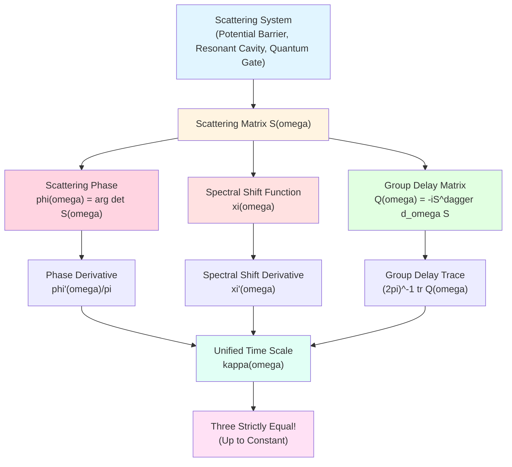
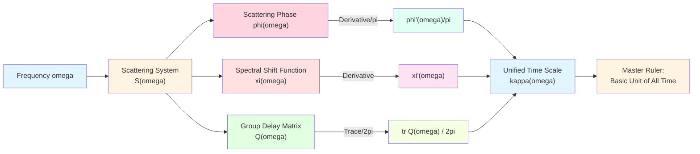
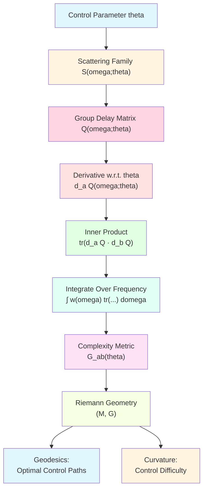
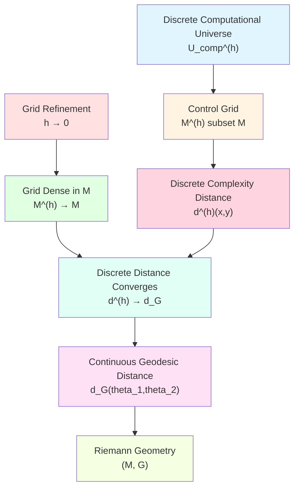
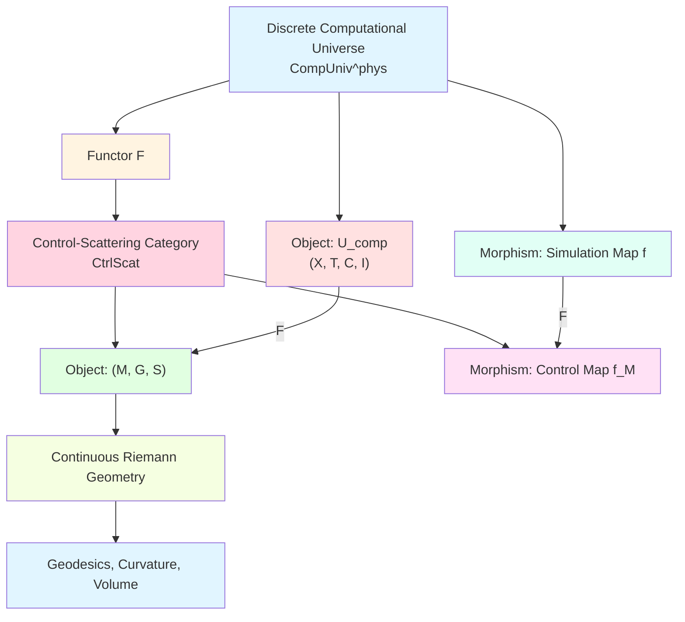
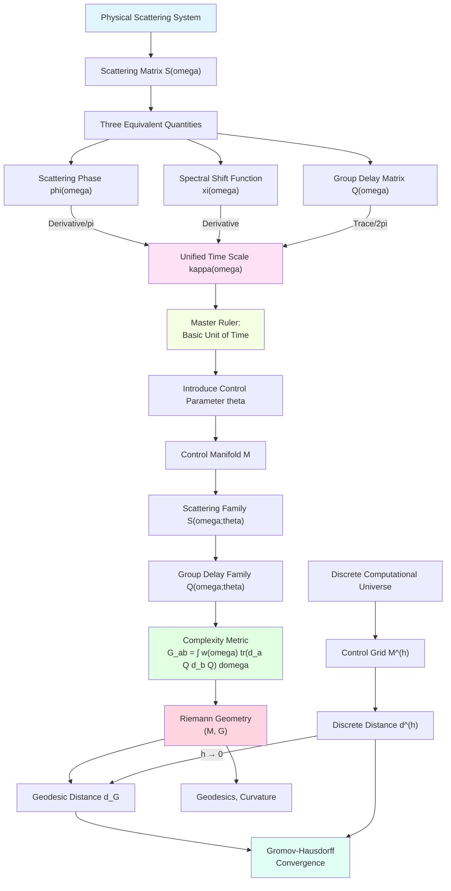

# 23.8 Unified Time Scale: Physical Realization of Scattering Master Ruler

In previous articles, we established discrete geometry of computational universe: complexity geometry tells us "how hard is computation", information geometry tells us "what can be obtained". But these are abstract geometric structures, haven't answered a fundamental question: **How is computational cost connected to physical time?**

Like using a ruler to measure length, we need a "ruler of time". But unlike everyday clocks, time in computational universe should be **intrinsic**, determined by computation process itself, not externally added parameters.

This article will introduce **Unified Time Scale** (Unified Time Scale), which is key bridge between computational universe and physical universe. This scale is not artificially specified, but naturally induced "master ruler" from scattering theory.

**Core Questions**:
- What is unified time scale? Why can it unify three seemingly unrelated quantities: scattering, spectral shift, and group delay?
- How to define computational cost using unified time scale?
- How do discrete computation steps become Riemann geometry in continuous limit?

This article is based on euler-gls-info/04-unified-time-scale-continuous-complexity-geometry.md.

---

## 1. Why Do We Need Unified Time Scale? From Clocks to Scattering

### 1.1 Limitations of Everyday Time

In everyday life, we measure time with clocks:
- **Mechanical Clock**: Relies on periodic motion of pendulum;
- **Quartz Clock**: Relies on oscillation frequency of quartz crystal;
- **Atomic Clock**: Relies on energy level transition frequency of atoms.

Common feature of all these clocks: **They measure periods of external reference systems**, independent of measured object.

But in computational universe, what we need is **intrinsic time**:
- Different computation processes have different "inherent times";
- "Difficulty" of computation should be determined by computation itself, not wall clock;
- "One step" time of quantum computation, classical computation, biological computation may be completely different.

**Core Question**: How to define a time scale related to physical process itself?

### 1.2 Physical Picture of Scattering: "Delay" of Waves

Imagine you throw a stone into a well:
- Stone falls, hear "plop" sound after few seconds;
- Sound reflects from bottom, hear again after few more seconds;
- **Total delay time** is time for stone falling + sound round trip.

This delay time is not measured by external clock, but intrinsic quantity determined by **depth of well and sound speed**.

In quantum mechanics, similar phenomenon is called **scattering delay**:
- A wave packet incident on some potential barrier (e.g., tunnel, resonant cavity);
- Wave packet scattered, transmitted or reflected;
- Scattered wave packet has a **phase delay** compared to free propagation, this delay corresponds to a "group delay time".

**Core Insight**: Scattering delay is intrinsic time scale of physical system, doesn't depend on external reference.

### 1.3 Three Seemingly Unrelated Quantities

In scattering theory, there are three classical physical quantities:

1. **Scattering Phase $\varphi(\omega)$**: Total phase change of wave after scattering at frequency $\omega$;
2. **Spectral Shift Function $\xi(\omega)$**: "Shift" of system energy spectrum relative to free case;
3. **Group Delay $\tau_g(\omega)$**: Average delay time of wave packet passing through system.

These three quantities come from different calculations in classical scattering theory, seem unrelated. But in unified time scale theory, they **miraculously are three manifestations of the same thing**!

---

## 2. Scattering Master Ruler of Unified Time Scale

**Source Theory**: euler-gls-info/04-unified-time-scale-continuous-complexity-geometry.md Section 2.1

### 2.1 Scattering Matrix and Scattering Phase

**Definition 2.1** (Scattering Matrix)

For a quantum scattering system, let free Hamiltonian be $H_0$, full Hamiltonian be $H = H_0 + V$ (where $V$ is potential or interaction). Scattering operator defined as

$$
S = W_+^\dagger W_-,
$$

where $W_\pm$ are Møller wave operators. In frequency representation, $S$ can be written as frequency-dependent scattering matrix $S(\omega)$, it is unitary: $S(\omega)^\dagger S(\omega) = I$.

**Everyday Analogy**:
- Imagine a multi-port circuit network (e.g., fiber beam splitter);
- Input has multiple channels, output also has multiple channels;
- Scattering matrix $S(\omega)$ describes "at frequency $\omega$, how signals from each input port are distributed to output ports".

**Definition of Scattering Phase**:

Total scattering phase defined as

$$
\varphi(\omega) = \arg\det S(\omega),
$$

i.e., argument of determinant of scattering matrix.

**Everyday Interpretation**:
- If scattering matrix is diagonal (channels independent), then $\varphi(\omega) = \sum_i \arg S_{ii}(\omega)$ is sum of phases of each channel;
- If there is coupling, phase also contains interference contributions between channels.

### 2.2 Spectral Shift Function and Birman-Krein Formula

**Definition 2.2** (Spectral Shift Function, from euler-gls-info/04-unified-time-scale-continuous-complexity-geometry.md)

Spectral shift function $\xi(\omega)$ is related to scattering matrix through Birman-Krein formula:

$$
\det S(\omega) = \exp\big(-2\pi\mathrm{i}\,\xi(\omega)\big).
$$

**Physical Meaning**:
- $\xi(\omega)$ measures "after adding potential $V$, how much energy spectrum shifted below $\omega$";
- If $\xi(\omega) = 0$, means energy spectrum didn't shift;
- If $\xi(\omega) > 0$, means energy spectrum shifted downward overall (more eigenstates);
- If $\xi(\omega) < 0$, means energy spectrum shifted upward overall (fewer eigenstates).

**From Birman-Krein formula we get**:

$$
\varphi(\omega) = \arg\det S(\omega) = -2\pi\xi(\omega) \pmod{2\pi}.
$$

Therefore phase is directly related to spectral shift function.

### 2.3 Group Delay Matrix

**Definition 2.3** (Wigner-Smith Group Delay Matrix, from euler-gls-info/04-unified-time-scale-continuous-complexity-geometry.md Section 2.1)

Group delay matrix defined as

$$
Q(\omega) = -\mathrm{i}\,S(\omega)^\dagger\partial_\omega S(\omega).
$$

**Physical Meaning**:
- $Q(\omega)$ is a Hermitian matrix (because $S$ unitary);
- Its eigenvalues $\tau_i(\omega)$ correspond to group delay times of each eigenchannel;
- Trace $\mathrm{tr}\,Q(\omega) = \sum_i \tau_i(\omega)$ is total delay of all channels.

**Why Called "Group Delay"?**

In classical wave theory, group velocity of a wave packet is $v_g = \mathrm{d}\omega/\mathrm{d}k$, where $k$ is wavenumber. Group delay is time needed for wave packet to pass through system:

$$
\tau_g = \frac{\mathrm{d}k}{\mathrm{d}\omega} \cdot L,
$$

where $L$ is system length. In quantum scattering, $Q(\omega)$ generalizes this concept to multi-channel case.

### 2.4 Master Formula of Unified Time Scale: Amazing Unification of Three

**Theorem 2.4** (Master Formula of Unified Time Scale, from euler-gls-info/04-unified-time-scale-continuous-complexity-geometry.md Section 2.1)

Under standard regularity conditions, following three quantities are equal up to additive constant:

$$
\kappa(\omega) = \frac{\varphi'(\omega)}{\pi} = \xi'(\omega) = \rho_{\mathrm{rel}}(\omega) = \frac{1}{2\pi}\mathrm{tr}\,Q(\omega),
$$

where $\rho_{\mathrm{rel}}(\omega)$ is called relative density of states.

**Everyday Interpretation**:
- **First Term $\varphi'(\omega)/\pi$**: "Derivative of phase with respect to frequency" ÷ $\pi$, characterizes phase change rate;
- **Second Term $\xi'(\omega)$**: "Derivative of spectral shift function", characterizes change in energy level density;
- **Third Term $(2\pi)^{-1}\mathrm{tr}\,Q(\omega)$**: "Average group delay" ÷ $2\pi$, characterizes wave packet delay;
- **Core Insight**: These three physical quantities **completely equivalent**, all measuring same thing—**intrinsic time scale density of system near frequency $\omega$**!

### 2.5 Why Called "Master Ruler"?

Unified time scale $\kappa(\omega)$ is called "Master Scale" because:
- It's like a "variable ruler", has different scale density at different frequencies $\omega$;
- All time-related physical quantities (phase, energy spectrum, delay) can be measured with it;
- It is **most basic unit of physical time**, all other time definitions can be derived from it.

**Everyday Analogy**:
- Imagine an elastic ruler, stretching differently at different positions;
- In some regions (near resonance frequencies), $\kappa(\omega)$ is large, time "slows down" (similar to time dilation in relativity);
- In other regions (far from resonance), $\kappa(\omega)$ is small, time "flows normally".

---

## 3. Control Manifold: Parameterizing Computation

**Source Theory**: euler-gls-info/04-unified-time-scale-continuous-complexity-geometry.md Section 2.2

### 3.1 Why Do We Need "Control"?

In computational universe, configurations are not isolated, but can be changed through some "control operations". For example:
- **Quantum Computation**: Change parameters of quantum gates (rotation angles, coupling strengths);
- **Classical Computation**: Change voltage, clock frequency of logic circuits;
- **Neural Networks**: Change parameters of weight matrices.

These adjustable parameters form a **control space**, which we geometrize as **control manifold** $\mathcal{M}$.

### 3.2 Definition of Control Manifold

**Definition 3.1** (Control Manifold and Scattering Family, from euler-gls-info/04-unified-time-scale-continuous-complexity-geometry.md Definition 2.1)

A control-scattering system consists of following data:

1. **Control Manifold $\mathcal{M}$**: A $d$-dimensional differentiable manifold, coordinates denoted $\theta = (\theta^1,\dots,\theta^d)$;
2. **Scattering Family $S(\omega;\theta)$**: For each $\theta\in\mathcal{M}$ and frequency $\omega$, assign a unitary scattering matrix $S(\omega;\theta)$, differentiable in $\theta,\omega$;
3. **Group Delay Matrix Family $Q(\omega;\theta)$**:

$$
Q(\omega;\theta) = -\mathrm{i}\,S(\omega;\theta)^\dagger\partial_\omega S(\omega;\theta).
$$

**Everyday Analogy**:
- $\theta$ is "position of knob": e.g., frequency tuning knob of radio, rotating it changes reception frequency;
- $S(\omega;\theta)$ is "when knob at position $\theta$, system's response to frequency $\omega$";
- Control manifold $\mathcal{M}$ is space of "all possible knob positions".

### 3.3 Example: Single Qubit Gate

Consider a single qubit rotation gate:

$$
U(\theta) = \begin{pmatrix}
\cos(\theta/2) & -\sin(\theta/2) \\
\sin(\theta/2) & \cos(\theta/2)
\end{pmatrix},
$$

where $\theta \in [0,2\pi]$ is rotation angle.

- **Control Manifold**: $\mathcal{M} = S^1$ (circle);
- **Scattering Matrix**: $S(\omega;\theta) = U(\theta)$ (here ignore frequency dependence, in practice there would be);
- **Group Delay Matrix**: $Q(\omega;\theta)$ can be computed through $\partial_\omega U(\theta)$.

This is simplest example, actual quantum computers have thousands of parameters, control manifold is high-dimensional.

### 3.4 Connection Between Control Manifold and Computational Universe

**Definition 3.2** (Map from Control Manifold to Configuration Space)

For given computational universe $U_{\mathrm{comp}} = (X,\mathsf{T},\mathsf{C},\mathsf{I})$, if each step update can be realized through some control-scattering system, then there exists map:

$$
\Psi : \mathcal{M} \to X,
$$

such that control parameter $\theta \in \mathcal{M}$ corresponds to a configuration $x = \Psi(\theta) \in X$.

**Everyday Interpretation**:
- Control manifold $\mathcal{M}$ is "parameter space at physical level" (e.g., angles of quantum gates);
- Configuration space $X$ is "state space at logical level" (e.g., computational basis states of qubits);
- Map $\Psi$ is "encoding from physical parameters to logical states".

**Core Insight**: Control manifold provides a **continuous perspective** to view discrete configuration space.

---

## 4. Complexity Metric $G$: From Scattering to Geometry

**Source Theory**: euler-gls-info/04-unified-time-scale-continuous-complexity-geometry.md Section 3

### 4.1 Core Idea: Define Distance Using Change in Group Delay

On control manifold, we want to define a metric, such that "change in control parameters" corresponds to "increase in computational cost".

**Key Observation**:
- When control parameter changes from $\theta$ to $\theta + \mathrm{d}\theta$, scattering matrix changes from $S(\omega;\theta)$ to $S(\omega;\theta+\mathrm{d}\theta)$;
- This causes change in group delay matrix: $Q(\omega;\theta) \to Q(\omega;\theta+\mathrm{d}\theta)$;
- Change in group delay reflects **change in unified time scale**, i.e., "how much physical time needed for this computation step changed".

Therefore, we use **derivative of group delay matrix with respect to control parameters** $\partial_a Q(\omega;\theta)$ to construct metric.

### 4.2 Mathematical Definition of Metric

**Definition 4.1** (Metric Induced by Unified Time Scale, from euler-gls-info/04-unified-time-scale-continuous-complexity-geometry.md Definition 3.1)

On control manifold $\mathcal{M}$, define second-order tensor

$$
G_{ab}(\theta) = \int_{\Omega} w(\omega)\,\mathrm{tr}\big( \partial_a Q(\omega;\theta)\,\partial_b Q(\omega;\theta) \big)\,\mathrm{d}\omega,
$$

where:
- $\partial_a = \partial/\partial\theta^a$ is partial derivative with respect to control parameter;
- $w(\omega) \ge 0$ is weight function, selecting frequency band of interest;
- $\Omega$ is frequency interval;
- $\mathrm{tr}(AB)$ is trace of matrix $AB$.

If $G_{ab}(\theta)$ is positive definite at each point, then $G$ is Riemann metric on $\mathcal{M}$, called **complexity metric induced by unified time scale**.

**Everyday Interpretation**:
- $\partial_a Q(\omega;\theta)$ is "change in group delay matrix when moving along control direction $a$";
- $\mathrm{tr}(\partial_a Q \cdot \partial_b Q)$ is "inner product of group delay changes in directions $a$ and $b$";
- Integrate over frequency $\omega$, weighted sum, get total "control cost".

### 4.3 Why Positive Definite?

**Proposition 4.2** (Positive Definiteness Condition, from euler-gls-info/04-unified-time-scale-continuous-complexity-geometry.md Proposition 3.2)

If for any nonzero tangent vector $v = v^a\partial_a \in T_\theta\mathcal{M}$, there exists frequency $\omega \in\Omega$ such that

$$
\partial_v Q(\omega;\theta) = v^a\partial_a Q(\omega;\theta) \neq 0,
$$

and

$$
\int_{\Omega} w(\omega)\,\mathrm{tr}\big( \partial_v Q(\omega;\theta)\,\partial_v Q(\omega;\theta) \big)\,\mathrm{d}\omega > 0,
$$

then $G_{ab}(\theta)$ is positive definite at $\theta$.

**Everyday Interpretation**:
- If moving along some direction $v$, group delay matrix completely unchanged (all frequencies have $\partial_v Q = 0$), then this direction contributes nothing to metric, metric degenerates in this direction;
- Conversely, as long as there exist some frequencies where group delay changes, and weight $w(\omega)$ doesn't cancel, then metric is positive definite.

**Physical Meaning**:
- Positive definiteness means "any non-trivial control change leads to non-zero computational cost";
- Degenerate directions correspond to "pure gauge degrees of freedom" (e.g., global phase, doesn't affect physical observations).

### 4.4 Everyday Analogy: Slope of Mountain Climbing

Imagine adjusting radio frequency in mountains (knob $\theta$):
- **Flat Region**: Rotating knob, signal almost unchanged, $\partial_\theta Q \approx 0$, metric $G$ small;
- **Steep Region** (near resonance): Slight rotation, signal changes dramatically, $\partial_\theta Q$ large, metric $G$ large;
- **Metric $G$** is like "slope squared" of terrain, tells you "at this parameter point, how 'sensitive' is control".

---

## 5. Geometric Length of Control Path: Accumulation of Physical Time

**Source Theory**: euler-gls-info/04-unified-time-scale-continuous-complexity-geometry.md Section 3.3

### 5.1 Definition of Path Length

Given a differentiable control path $\theta:[0,T]\to\mathcal{M}$, its **geometric length** defined as:

$$
L_G[\theta] = \int_0^T \sqrt{G_{ab}(\theta(t))\,\dot{\theta}^a(t)\dot{\theta}^b(t)}\,\mathrm{d}t.
$$

**Everyday Interpretation**:
- $\dot{\theta}^a(t) = \mathrm{d}\theta^a/\mathrm{d}t$ is rate of change of control parameter (velocity);
- $G_{ab}\dot{\theta}^a\dot{\theta}^b$ is "metric square" of velocity (similar to $v^2 = v_x^2 + v_y^2$);
- $\sqrt{G_{ab}\dot{\theta}^a\dot{\theta}^b}$ is instantaneous "speed";
- Integrate over time, get total length.

### 5.2 Relationship Between Length and Physical Time

**Proposition 5.1** (Relationship Between Length and Unified Time Scale, from euler-gls-info/04-unified-time-scale-continuous-complexity-geometry.md Proposition 3.3)

Under appropriate regularity conditions, geometric length $L_G[\theta]$ of control path $\theta(t)$ is proportional to integral of physical time scale accumulated along this path, i.e., there exists constant $\alpha>0$ such that

$$
L_G[\theta] = \alpha \int_0^T \mathrm{d}t\,\int_{\Omega} w(\omega)\,\kappa(\omega;\theta(t))^2\,\mathrm{d}\omega,
$$

where $\kappa(\omega;\theta) = (2\pi)^{-1}\mathrm{tr}\,Q(\omega;\theta)$ is unified time scale density.

**Everyday Interpretation**:
- Left side $L_G[\theta]$ is "geometric length of control path" (abstract);
- Right side is "integral of square of unified time scale accumulated along path" (concrete physical quantity);
- This proposition says: **Geometric length is measure of physical time**!

### 5.3 Everyday Analogy: "Mileage" of Travel

Imagine driving from A to B:
- **Route $\theta(t)$**: Road you choose (control path);
- **Instantaneous Speed $\sqrt{G_{ab}\dot{\theta}^a\dot{\theta}^b}$**: Speed shown on speedometer (unit: km/h);
- **Total Mileage $L_G[\theta]$**: Value added on odometer (unit: km);
- **Physical Time**: Actual travel time (unit: hours).

Proposition 5.1 says: "Mileage" proportional to "time × speed squared", exactly our intuitive understanding of "distance"!

---

## 6. Discrete to Continuous: Gromov-Hausdorff Convergence

**Source Theory**: euler-gls-info/04-unified-time-scale-continuous-complexity-geometry.md Section 4

### 6.1 Core Question: How Does Discrete Geometry Become Continuous Geometry?

Previous 7 articles all established **discrete complexity geometry**:
- Configuration space $X$ is discrete (countable set);
- Complexity distance $d(x,y)$ accumulated step by step;
- Complexity ball, dimension, Ricci curvature all defined discretely.

Now we have continuous control manifold $(\mathcal{M},G)$:
- $\mathcal{M}$ is continuous manifold;
- Metric $G$ induces geodesic distance $d_G$;
- This is standard Riemann geometry.

**Key Question**: What is relationship between discrete geometry and continuous geometry?

### 6.2 Refinement Sequence: Making Discrete Grid Finer and Finer

Imagine approximating a continuous surface with finer and finer grids:
- Coarse grid: Only few points, connections are "jumps";
- Fine grid: Many dense points, connections approach continuous curves;
- Limit: Grid infinitely fine, approximates continuous surface.

Mathematically, we consider a family of computational universes labeled $h>0$: $\{U_{\mathrm{comp}}^{(h)}\}$:
- $h$ is discrete step size (grid spacing);
- When $h\to 0$, grid becomes finer and finer;
- Each $U_{\mathrm{comp}}^{(h)}$ has its own discrete complexity distance $d^{(h)}$.

### 6.3 Distance Convergence Theorem

**Theorem 6.1** (Riemann Limit of Complexity Distance, from euler-gls-info/04-unified-time-scale-continuous-complexity-geometry.md Theorem 4.1)

Let $(\mathcal{M},G)$ be control manifold induced by unified time scale, $\{U_{\mathrm{comp}}^{(h)}\}$ be a family of computational universes with control grids $\mathcal{M}^{(h)}$. Assume:

1. Grids $\mathcal{M}^{(h)}$ dense in $\mathcal{M}$ as $h\to 0$;
2. Single-step cost consistent with metric: $\mathsf{C}^{(h)}(\theta,\theta+he_a) = \sqrt{G_{aa}(\theta)}\,h + o(h)$;
3. No jumps: Edges of configuration graph only connect adjacent grid points.

Then for any $\theta_1,\theta_2\in\mathcal{M}$, we have

$$
\lim_{h\to 0} d^{(h)}(\theta_1^{(h)},\theta_2^{(h)}) = d_G(\theta_1,\theta_2),
$$

where $d^{(h)}$ is discrete complexity distance, $d_G$ is Riemann geodesic distance.

**Everyday Interpretation**:
- Condition 1: "Grid becomes denser and denser, eventually fills entire control manifold";
- Condition 2: "Cost of discrete step size consistent with local value of continuous metric";
- Condition 3: "Cannot have 'long-range teleportation' edges, can only step gradually";
- Conclusion: "Discrete distance converges to continuous geodesic distance"!

### 6.4 Everyday Analogy: Pixels to Image

Imagine a digital photo:
- **Low Resolution** (large $h$): 100×100 pixels, looks like squares;
- **Medium Resolution** (medium $h$): 1000×1000 pixels, already quite smooth;
- **High Resolution** (small $h$): 10000×10000 pixels, almost continuous;
- **Limit** (h→0): Infinite resolution, becomes continuous image.

Discrete complexity geometry → continuous Riemann geometry, like low-resolution pixels → high-definition image process!

### 6.5 Meaning of Gromov-Hausdorff Convergence

Theorem 6.1 is actually a special case of deeper **Gromov-Hausdorff convergence**:

**Definition 6.2** (Gromov-Hausdorff Distance)

Gromov-Hausdorff distance between two metric spaces $(X,d_X)$ and $(Y,d_Y)$ defined as

$$
d_{GH}(X,Y) = \inf\{\epsilon : \exists Z, f_X, f_Y\},
$$

where infimum is over all simultaneous isometric embeddings $f_X:X\to Z$, $f_Y:Y\to Z$ of $X,Y$ into some metric space $Z$, such that Hausdorff distance between $X$ and $Y$ is $\le \epsilon$.

Conclusion of Theorem 6.1 can be strengthened to:

$$
d_{GH}\big((X^{(h)},d^{(h)}),\,(\mathcal{M},d_G)\big) \to 0 \quad\text{as }h\to 0.
$$

This means: Not only distance functions converge pointwise, but entire metric space structure (including topology, volume, curvature, etc.) converges!

---

## 7. Example: One-Dimensional Scattering Network

**Source Theory**: euler-gls-info/04-unified-time-scale-continuous-complexity-geometry.md Section 4.3

### 7.1 Model Setting

Consider a one-dimensional two-port scattering network:
- **Control Parameter**: $\theta \in [\theta_{\min},\theta_{\max}] \subset\mathbb{R}$ (e.g., barrier height);
- **Scattering Matrix**:

$$
S(\omega;\theta) = \begin{pmatrix} r(\omega;\theta) & t'(\omega;\theta) \\ t(\omega;\theta) & r'(\omega;\theta) \end{pmatrix},
$$

where $r$ is reflection coefficient, $t$ is transmission coefficient, satisfy unitarity $|r|^2 + |t|^2 = 1$.

### 7.2 Group Delay Matrix

$$
Q(\omega;\theta) = -\mathrm{i}\,S(\omega;\theta)^\dagger\partial_\omega S(\omega;\theta)
$$

is a $2\times 2$ Hermitian matrix. Its trace

$$
\mathrm{tr}\,Q(\omega;\theta) = \tau_r(\omega;\theta) + \tau_t(\omega;\theta)
$$

is sum of group delays of reflection and transmission channels.

### 7.3 One-Dimensional Metric

$$
G(\theta) = \int_{\Omega} w(\omega)\,\mathrm{tr}\big( \partial_\theta Q(\omega;\theta)\,\partial_\theta Q(\omega;\theta) \big)\,\mathrm{d}\omega.
$$

This defines one-dimensional Riemann metric $G(\theta)\mathrm{d}\theta^2$.

**Geodesic Distance**: In one-dimensional case, geodesics are straight lines, geodesic distance is

$$
d_G(\theta_1,\theta_2) = \left|\int_{\theta_1}^{\theta_2} \sqrt{G(\theta)}\,\mathrm{d}\theta\right|.
$$

### 7.4 Discretization

Discretize $\theta$ into grid points $\theta_n = \theta_0 + nh$, define single-step cost

$$
\mathsf{C}^{(h)}(\theta_n,\theta_{n+1}) = \sqrt{G(\theta_n)}\,h.
$$

Then discrete complexity distance is

$$
d^{(h)}(\theta_m,\theta_n) = \sum_{k=m}^{n-1} \mathsf{C}^{(h)}(\theta_k,\theta_{k+1}) = h\sum_{k=m}^{n-1}\sqrt{G(\theta_k)}.
$$

### 7.5 Convergence Result

When $h\to 0$, Riemann sum converges to integral:

$$
\lim_{h\to 0} d^{(h)}(\theta_1^{(h)},\theta_2^{(h)}) = \int_{\theta_1}^{\theta_2} \sqrt{G(\theta)}\,\mathrm{d}\theta = d_G(\theta_1,\theta_2).
$$

This is concrete realization of Theorem 6.1 in one-dimensional case!

**Physical Interpretation**:
- Discrete step size $h$ corresponds to "control precision";
- Refining grid corresponds to "improving control precision";
- In limit, discrete "step-by-step jumps" become continuous "motion along geodesics".

---

## 8. Control-Scattering Category: Functor from Discrete to Continuous

**Source Theory**: euler-gls-info/04-unified-time-scale-continuous-complexity-geometry.md Section 5

### 8.1 Why Do We Need Category Theory?

Category theory provides an "abstract perspective" to understand relationships between different mathematical structures:
- **Objects**: Some class of mathematical structures (e.g., metric spaces, groups, vector spaces);
- **Morphisms**: Maps preserving certain properties between structures (e.g., isometries, group homomorphisms, linear maps);
- **Functors**: Maps between categories, preserving structure of objects and morphisms.

In our context:
- **Discrete Computational Universe Category $\mathbf{CompUniv}$**: Objects are computational universes $(X,\mathsf{T},\mathsf{C},\mathsf{I})$, morphisms are simulation maps;
- **Control-Scattering Category $\mathbf{CtrlScat}$**: Objects are control manifolds $(\mathcal{M},G,S)$, morphisms are metric-preserving control maps;
- **Functor $F$**: Lifting from discrete to continuous.

### 8.2 Control-Scattering Objects and Morphisms

**Definition 8.1** (Control-Scattering Object, from euler-gls-info/04-unified-time-scale-continuous-complexity-geometry.md Definition 5.1)

A control-scattering object is a triple

$$
C = (\mathcal{M},G,S),
$$

where:
- $(\mathcal{M},G)$ is control manifold with Riemann metric;
- $S(\omega;\theta)$ is scattering family satisfying unified time scale master formula.

**Definition 8.2** (Control-Scattering Morphism, from Definition 5.2)

A morphism between two control-scattering objects $C = (\mathcal{M},G,S)$ and $C' = (\mathcal{M}',G',S')$ is a map $f:\mathcal{M}\to\mathcal{M}'$, satisfying:

1. $f$ is smooth map;
2. Metric controlled transformation: There exist $\alpha,\beta>0$ such that

$$
\alpha\,G_\theta(v,v) \le G'_{f(\theta)}(\mathrm{d}f_\theta v,\mathrm{d}f_\theta v) \le \beta\,G_\theta(v,v);
$$

3. Scattering families compatible.

### 8.3 Functor from Computational Universe to Control-Scattering

**Definition 8.3** (Lifting Functor $F$, from euler-gls-info/04-unified-time-scale-continuous-complexity-geometry.md Section 5.2)

Let $\mathbf{CompUniv}^{\mathrm{phys}}$ be subcategory of computational universes "realizable by unified time scale scattering". Construct functor

$$
F:\mathbf{CompUniv}^{\mathrm{phys}} \to \mathbf{CtrlScat}
$$

as follows:

1. **Object Level**: Given $U_{\mathrm{comp}} = (X,\mathsf{T},\mathsf{C},\mathsf{I})$, construct $(\mathcal{M},G,S)$ from its physical realization, let

$$
F(U_{\mathrm{comp}}) = (\mathcal{M},G,S).
$$

2. **Morphism Level**: Given simulation map $f:U_{\mathrm{comp}}\rightsquigarrow U_{\mathrm{comp}}'$, corresponding control map $f_{\mathcal{M}}:\mathcal{M}\to\mathcal{M}'$, let

$$
F(f) = f_{\mathcal{M}}.
$$

**Proposition 8.4** (Functoriality, from euler-gls-info/04-unified-time-scale-continuous-complexity-geometry.md Proposition 5.3)

$F$ constitutes a covariant functor, i.e., satisfies:
1. $F(\mathrm{id}) = \mathrm{id}$;
2. $F(g\circ f) = F(g)\circ F(f)$.

**Everyday Interpretation**:
- Functor $F$ lifts "discrete computational universe" to "continuous control manifold";
- Morphisms (simulation maps) preserved as control maps;
- Step-by-step progression of complexity distance preserved as geodesic distance of metric.

### 8.4 Everyday Analogy: From Pixels to Vector Graphics

- **Discrete Computational Universe**: Bitmap, composed of pixels, discrete;
- **Control-Scattering Object**: Vector graphics, composed of curves and shapes, continuous;
- **Functor $F$**: Bitmap-to-vector conversion algorithm, preserves shape and structure of image.

---

## 9. Complete Picture: From Scattering to Geometry

### 9.1 Theoretical Structure Summary

### 9.2 Core Formula Quick Reference

| Concept | Formula | Physical Meaning |
|---------|---------|-----------------|
| Scattering Phase | $\varphi(\omega) = \arg\det S(\omega)$ | Total Phase Change |
| Spectral Shift Function | $\det S(\omega) = e^{-2\pi\mathrm{i}\xi(\omega)}$ | Energy Spectrum Shift |
| Group Delay Matrix | $Q(\omega) = -\mathrm{i}S^\dagger\partial_\omega S$ | Delay of Each Channel |
| **Unified Time Scale** | $\kappa(\omega) = \varphi'(\omega)/\pi = \xi'(\omega) = (2\pi)^{-1}\mathrm{tr}Q(\omega)$ | **Master Ruler of Time Density** |
| Complexity Metric | $G_{ab}(\theta) = \int w(\omega)\mathrm{tr}(\partial_a Q\,\partial_b Q)\,\mathrm{d}\omega$ | Control Cost |
| Path Length | $L_G[\theta] = \int_0^T \sqrt{G_{ab}\dot{\theta}^a\dot{\theta}^b}\,\mathrm{d}t$ | Total Computational Cost |
| Geodesic Distance | $d_G(\theta_1,\theta_2) = \inf_\gamma L_G[\gamma]$ | Minimum Cost |
| Discrete Convergence | $\lim_{h\to 0} d^{(h)} = d_G$ | Continuous Limit |

---

## 10. Summary

This article establishes complete bridge from physical scattering to computational geometry:

### 10.1 Core Concepts

1. **Unified Time Scale $\kappa(\omega)$**: Trinity master ruler
   - Scattering phase derivative: $\varphi'(\omega)/\pi$
   - Spectral shift function derivative: $\xi'(\omega)$
   - Group delay trace: $(2\pi)^{-1}\mathrm{tr}Q(\omega)$

2. **Control Manifold $\mathcal{M}$**: Parameterized computation space

3. **Complexity Metric $G_{ab}(\theta)$**: Induced by group delay derivative
   $$G_{ab} = \int w(\omega)\mathrm{tr}(\partial_a Q\,\partial_b Q)\,\mathrm{d}\omega$$

4. **Gromov-Hausdorff Convergence**: Discrete → Continuous
   $$\lim_{h\to 0} d^{(h)} = d_G$$

5. **Control-Scattering Category $\mathbf{CtrlScat}$**: Category-theoretic framework

### 10.2 Core Insights

- **Unification**: Scattering phase, spectral shift, group delay are essentially three manifestations of same quantity;
- **Intrinsic Nature**: Time scale is property of physical process itself, doesn't depend on external reference;
- **Geometrization**: Computational cost can be geometrized as geodesic distance on Riemann manifold;
- **Limit Consistency**: Discrete geometry strictly converges to continuous geometry in refinement limit;
- **Categorical Naturality**: Discrete and continuous connected through functor, preserving structure.

### 10.3 Everyday Analogy Review

- **Elastic Ruler**: Unified time scale like variable-scale ruler;
- **Radio Frequency Tuning**: Control manifold like parameter space of knobs;
- **Mountain Climbing Slope**: Complexity metric like steepness of terrain;
- **Pixels to Image**: Discrete convergence like improving photo resolution;
- **Bitmap to Vector Graphics**: Functor like image format conversion.

### 10.4 Connections with Previous and Subsequent Chapters

**Connection with Articles 23.1-7**:
- Articles 23.3-5: Discrete complexity geometry (complexity distance, volume, Ricci curvature);
- Articles 23.6-7: Discrete information geometry (Fisher matrix, information dimension);
- This Article: Provides strict bridge from discrete to continuous, through unified time scale.

**Preview of Article 23.9**:
Next article will deeply study global properties of control manifold:
- Geometric details of Gromov-Hausdorff convergence;
- Curvature and topology of control manifold;
- Coupling with information manifold.

**Preview of Articles 23.10-11**:
Articles 23.10-11 will construct joint time-information-complexity variational principle based on control manifold $(\mathcal{M},G)$ and information manifold $(\mathcal{S}_Q,g_Q)$, achieving complete unification of three.

---

**Preview of Next Article**: 23.9 Control Manifold and Gromov-Hausdorff Convergence

In next article, we will deeply study:
1. **Geometric Meaning of Gromov-Hausdorff Distance**: How do metric spaces "approach" each other?
2. **Global Properties of Control Manifold**: Compactness, completeness, geodesic completeness;
3. **Fine Correspondence Between Discrete and Continuous**: Not only distance converges, but volume and curvature also converge;
4. **Coupling with Information Manifold**: Joint geometry of control manifold $\mathcal{M}$ and information manifold $\mathcal{S}_Q$;
5. **Physical Examples**: Control manifolds of quantum circuits, scattering networks, neural networks.

