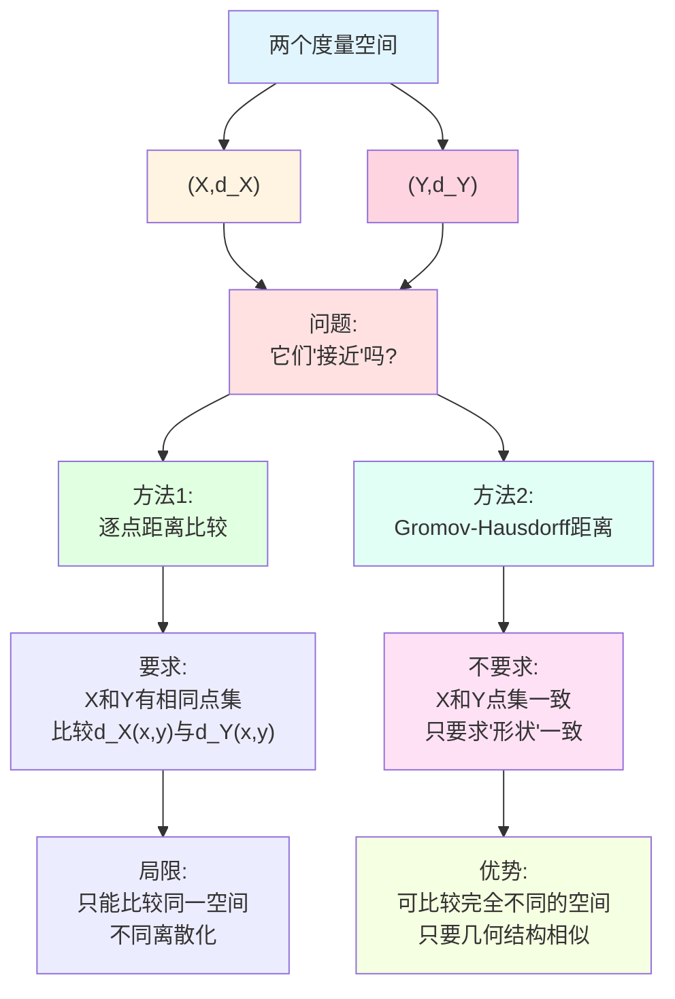
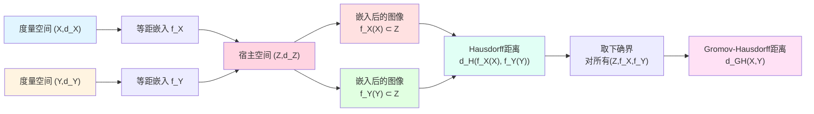
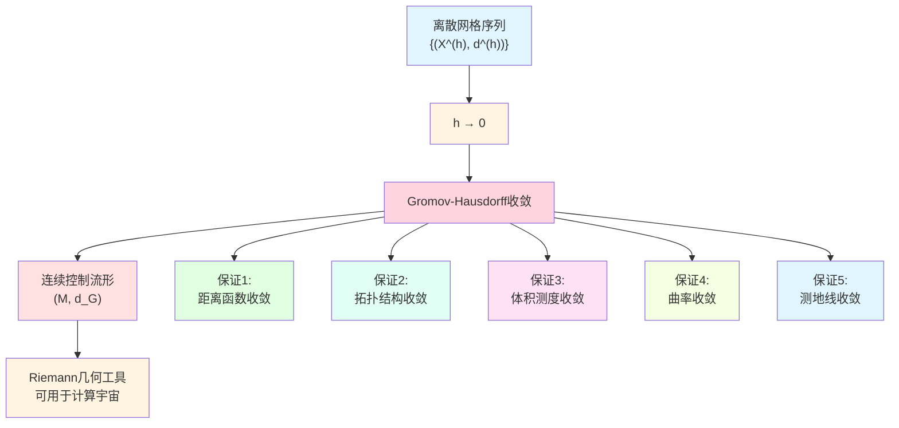
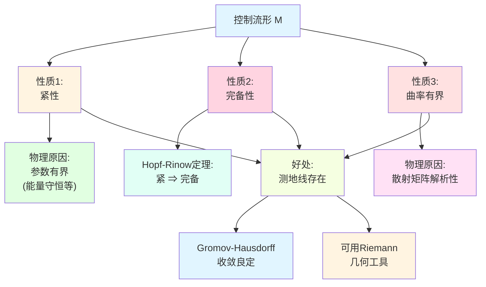
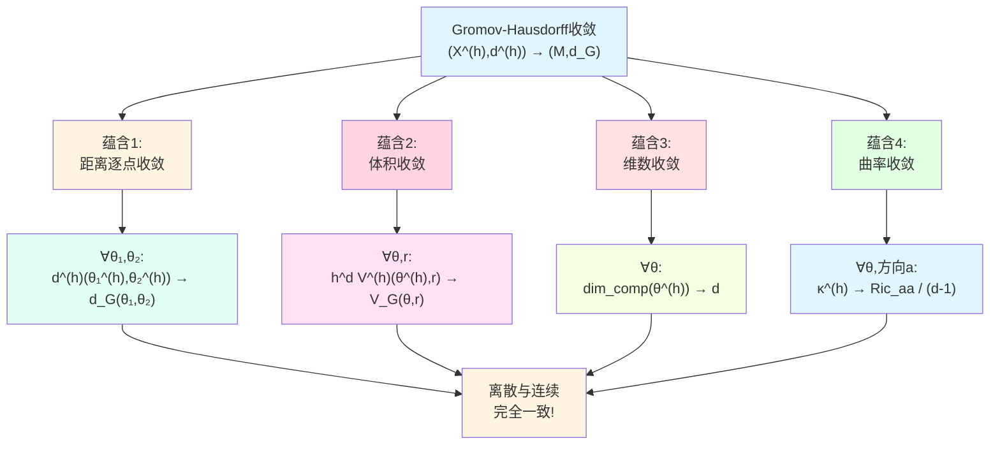
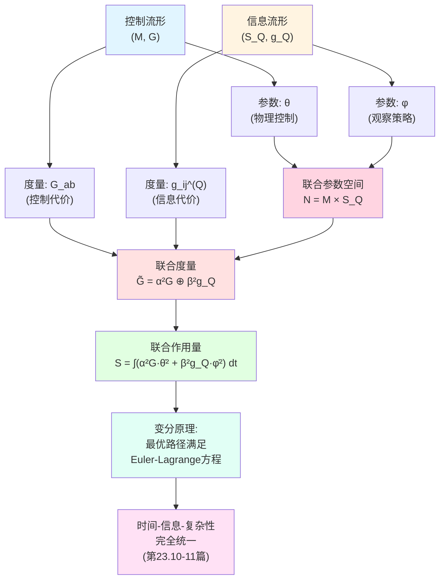
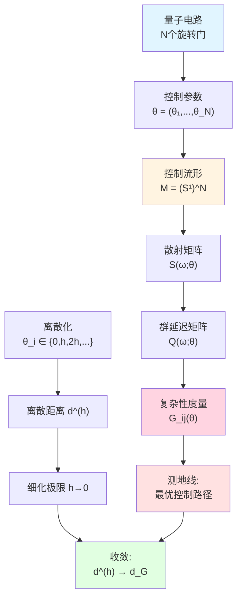
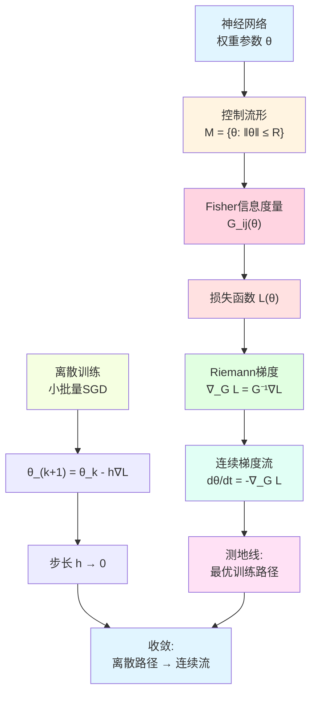
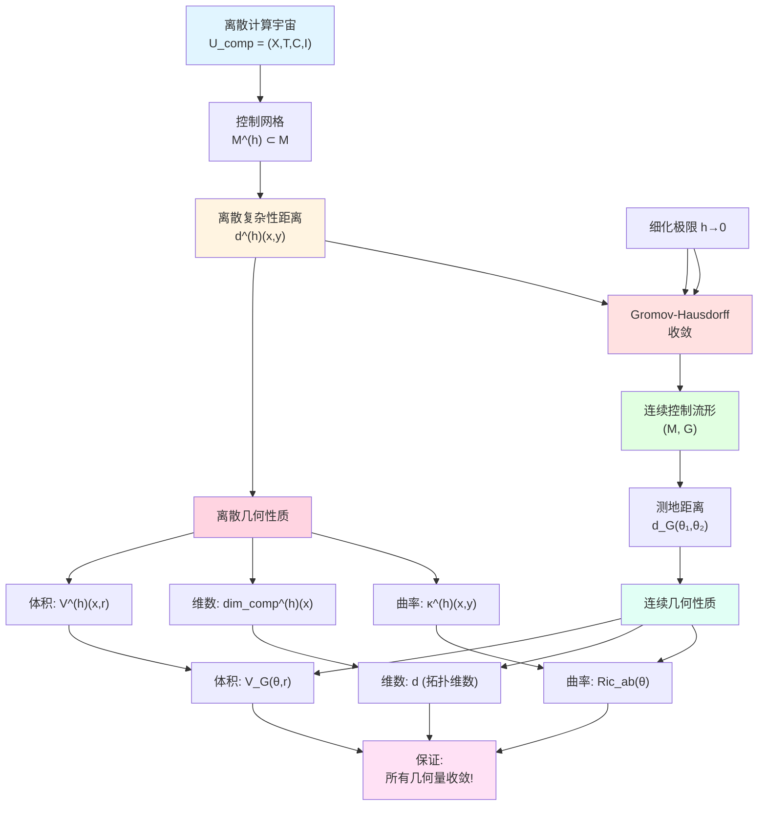

# 23.9 控制流形与Gromov-Hausdorff收敛

在上一篇中,我们建立了统一时间刻度的散射母尺,并用它在控制流形 $\mathcal{M}$ 上构造了复杂性度量 $G_{ab}(\theta)$。我们还证明了一个关键定理:当离散网格越来越细($h\to 0$)时,离散复杂性距离 $d^{(h)}$ 收敛到连续测地距离 $d_G$。

但这个收敛到底意味着什么?仅仅是"距离函数逐点收敛"吗?还是有更深刻的几何意义?

本篇将深入探讨**Gromov-Hausdorff收敛**这个概念,它不仅保证距离收敛,还保证整个度量空间的结构(拓扑、体积、曲率)都在收敛。这是几何分析中最强的收敛概念之一。

**核心问题**:
- 什么是Gromov-Hausdorff距离?为什么它比逐点距离收敛更强?
- 控制流形有哪些整体性质(紧性、完备性)?
- 离散与连续的对应不仅在距离层面,还在体积、曲率层面吗?
- 控制流形与信息流形如何耦合?

本文基于 euler-gls-info/04-unified-time-scale-continuous-complexity-geometry.md。

---

## 1. 为什么逐点收敛还不够?从像素到形状

### 1.1 两种"接近"的图像

想象两张数字照片:
- **照片A**:一只猫,100×100像素,黑白;
- **照片B**:一只猫,10000×10000像素,彩色,超高清。

从像素层面看,它们完全不同:分辨率、色彩、数据格式都不一样。但从**视觉内容**看,它们都是"一只猫",形状、轮廓、姿势基本一致。

现在问:**这两张照片"接近"吗?**

- **逐点收敛**:如果把照片B缩放到100×100,然后逐像素比较颜色,可能完全不同;
- **形状收敛**:如果只看轮廓和几何形状,它们非常接近。

在几何分析中,我们需要的是第二种"形状收敛",而不是简单的逐点收敛。这就是**Gromov-Hausdorff收敛**的核心思想。

### 1.2 度量空间的"形状"

一个度量空间 $(X,d)$ 的"形状"包括:
- **拓扑结构**:哪些点是"接近"的,哪些是"远离"的;
- **体积结构**:空间的"大小"如何分布;
- **曲率结构**:空间是"弯曲"的还是"平坦"的。

**逐点距离收敛**只能保证:
- 对每一对点 $(x,y)$,距离 $d_n(x,y)$ 收敛到 $d(x,y)$;
- 但不能保证空间的整体形状一致!

**日常类比**:
- 想象一根绳子,你可以把它弯成不同的形状(圆、方、三角),但绳子上任意两点之间的"沿绳距离"不变;
- 逐点距离收敛只看"沿绳距离",Gromov-Hausdorff收敛还要看"嵌入空间中的形状"。

---

## 2. Gromov-Hausdorff距离:度量空间之间的距离

**源理论**:euler-gls-info/04-unified-time-scale-continuous-complexity-geometry.md 第4节

### 2.1 Hausdorff距离:同一空间中两个子集的距离

首先回顾一个更简单的概念:**Hausdorff距离**。

**定义 2.1**(Hausdorff距离)

设 $(Z,d_Z)$ 是一个度量空间,$A,B\subset Z$ 是两个非空紧子集。$A$ 到 $B$ 的单向Hausdorff距离定义为

$$
d_H^{\to}(A,B) = \sup_{a\in A} \inf_{b\in B} d_Z(a,b),
$$

即"$A$ 中离 $B$ 最远的点到 $B$ 的距离"。

**双向Hausdorff距离**定义为

$$
d_H(A,B) = \max\{d_H^{\to}(A,B),\,d_H^{\to}(B,A)\}.
$$

**日常类比**:
- 想象两个村庄 $A$ 和 $B$,每个村庄是一些房子的集合;
- $d_H^{\to}(A,B)$ 是"村庄 $A$ 中离村庄 $B$ 最远的房子到 $B$ 的距离";
- $d_H(A,B)$ 是"两个方向的最大距离",衡量两个村庄的"分布差异"。

**例子**:
- $A = [0,1]$,$B = [0,1.1]$,都在实数轴上;
- $d_H^{\to}(A,B) = 0$(因为 $A\subset B$);
- $d_H^{\to}(B,A) = 0.1$(点 $1.1\in B$ 离 $A$ 最远);
- $d_H(A,B) = 0.1$。

### 2.2 等距嵌入:把空间"放入"更大的空间

**定义 2.2**(等距嵌入)

设 $(X,d_X)$ 和 $(Z,d_Z)$ 是两个度量空间。映射 $f:X\to Z$ 称为**等距嵌入**,如果对所有 $x,y\in X$ 有

$$
d_Z(f(x),f(y)) = d_X(x,y).
$$

**日常解读**:
- 等距嵌入是"保持所有距离的映射";
- 想象把一张平面地图(二维)嵌入到三维空间:地图上任意两点的距离在嵌入后不变;
- 但嵌入**不要求满射**,地图只占据三维空间的一个小片。

### 2.3 Gromov-Hausdorff距离的定义

**定义 2.3**(Gromov-Hausdorff距离,源自 euler-gls-info/04-unified-time-scale-continuous-complexity-geometry.md)

两个紧度量空间 $(X,d_X)$ 和 $(Y,d_Y)$ 的Gromov-Hausdorff距离定义为

$$
d_{GH}(X,Y) = \inf\left\{\epsilon : \begin{array}{l}\exists (Z,d_Z),\,f_X:X\to Z,\,f_Y:Y\to Z\\f_X,f_Y\text{ 等距嵌入},\\d_H(f_X(X),f_Y(Y)) \le \epsilon\end{array}\right\}.
$$

**日常解读**:
- 取遍所有可能的"宿主空间" $Z$,以及将 $X,Y$ 等距嵌入 $Z$ 的方式 $f_X,f_Y$;
- 在 $Z$ 中,计算 $f_X(X)$ 和 $f_Y(Y)$ 两个子集的Hausdorff距离;
- 取所有可能嵌入方式中Hausdorff距离的下确界,得到 $d_{GH}(X,Y)$。

**核心洞察**:
- Gromov-Hausdorff距离测量的是"两个空间能被多接近地嵌入到同一个空间中";
- 如果 $d_{GH}(X,Y)=0$,则 $X$ 和 $Y$ 在等距意义下"形状完全相同"(称为**等距同构**);
- $d_{GH}(X,Y)$ 很小意味着 $X$ 和 $Y$ 的几何结构非常相似,即使它们的点集完全不同!

### 2.4 为什么叫"形状距离"?

**日常类比**:
- 想象两个三维物体:一个立方体网格(离散),一个光滑球面(连续);
- 它们的点集完全不同:一个是有限个顶点,一个是连续流形;
- 但如果离散网格足够细,逼近球面,则 $d_{GH}(\text{网格},\text{球面})$ 很小;
- Gromov-Hausdorff距离捕捉的是"几何形状的相似性",而不是"点集的重合性"。

---

## 3. Gromov-Hausdorff收敛:空间序列的极限

**源理论**:euler-gls-info/04-unified-time-scale-continuous-complexity-geometry.md 定理4.1

### 3.1 度量空间序列的收敛

**定义 3.1**(Gromov-Hausdorff收敛)

设 $\{(X_n,d_n)\}_{n=1}^\infty$ 是一族紧度量空间,$(X,d)$ 是另一个紧度量空间。称 $(X_n,d_n)$ **Gromov-Hausdorff收敛**到 $(X,d)$,如果

$$
\lim_{n\to\infty} d_{GH}(X_n,X) = 0.
$$

记为 $(X_n,d_n) \xrightarrow{GH} (X,d)$。

**日常解读**:
- 不要求 $X_n$ 和 $X$ 有相同的点集;
- 不要求 $X_n$ 是 $X$ 的子集或超集;
- 只要求:随着 $n$ 增大,$X_n$ 的"几何形状"越来越接近 $X$ 的"几何形状"。

### 3.2 为什么这是强收敛?

Gromov-Hausdorff收敛不仅保证距离函数收敛,还保证:

1. **拓扑收敛**:$X_n$ 的拓扑结构趋近于 $X$ 的拓扑结构;
2. **体积收敛**(在适当归一化下):$X_n$ 的体积测度趋近于 $X$ 的体积测度;
3. **曲率收敛**(在适当假设下):$X_n$ 的曲率趋近于 $X$ 的曲率;
4. **测地线收敛**:$X_n$ 中的最短路径趋近于 $X$ 中的测地线。

**日常类比**:
- 想象用越来越细的多面体逼近一个球面:
  - 正四面体 → 正八面体 → 正二十面体 → ⋯ → 球面;
  - 顶点数、边数、面数都在变化;
  - 但"形状"越来越接近球面;
  - 最终:体积 → 球的体积,曲率 → 球面曲率,测地线 → 大圆。

### 3.3 计算宇宙中的应用

在计算宇宙框架中,我们有:
- **离散空间 $(X^{(h)},d^{(h)})$**:网格步长为 $h$ 的控制网格,离散复杂性距离;
- **连续空间 $(\mathcal{M},d_G)$**:控制流形,测地距离。

**定理 3.2**(控制流形的Gromov-Hausdorff收敛,源自 euler-gls-info/04-unified-time-scale-continuous-complexity-geometry.md 定理4.1推广)

在适当的正则性条件下,当网格步长 $h\to 0$ 时,离散控制网格作为度量空间Gromov-Hausdorff收敛到连续控制流形:

$$
\big(X^{(h)},d^{(h)}\big) \xrightarrow{GH} \big(\mathcal{M},d_G\big).
$$

**物理意义**:
- 离散计算宇宙不仅在"逐点距离"上收敛,而且在"整体几何结构"上收敛;
- 这保证了:离散模型的所有几何性质(体积增长、曲率、维数)都有连续极限;
- 我们可以安全地用连续Riemann几何来研究计算宇宙的性质!

---

## 4. 控制流形的整体性质

**源理论**:euler-gls-info/04-unified-time-scale-continuous-complexity-geometry.md 第3-4节

### 4.1 紧性:有界且完备

**定义 4.1**(紧度量空间)

度量空间 $(X,d)$ 称为**紧的**,如果满足以下等价条件之一:
1. 任何开覆盖都有有限子覆盖(拓扑定义);
2. $X$ 是完备且完全有界的(度量定义);
3. $X$ 中任何序列都有收敛子列(序列紧性)。

**日常类比**:
- 紧空间像"有限大的封闭盒子":
  - **有界**:空间不会无限延伸;
  - **闭**:空间包含所有极限点,没有"洞"或"边界跑到无穷远"。

**例子**:
- $[0,1]$(闭区间)是紧的;
- $(0,1)$(开区间)**不紧**,因为不闭(缺少端点);
- $[0,\infty)$**不紧**,因为无界;
- $\mathbb{R}^n$ 中的单位球面 $S^{n-1}$ 是紧的。

### 4.2 控制流形的紧性

在计算宇宙中,控制流形 $\mathcal{M}$ 通常对应物理系统的参数空间:
- **量子门参数**:旋转角度 $\theta\in S^1$(紧的);
- **耦合强度**:$g\in [g_{\min},g_{\max}]$(紧的);
- **神经网络权重**:受范数约束 $\|\mathbf{w}\|\le R$(紧的)。

**命题 4.2**(物理可实现的控制流形是紧的)

对于任何物理可实现的计算宇宙,其控制流形 $\mathcal{M}$ 可以选择为紧的。

**理由**:
- 物理参数总是有界的(能量守恒、热力学稳定性等);
- 可以通过适当的边界条件或正则化,使参数空间闭合。

**紧性的好处**:
- 保证测地线存在且有界;
- 保证Gromov-Hausdorff收敛的良定性;
- 允许使用紧流形上的分析工具(谱理论、热核等)。

### 4.3 完备性:测地线不"跑出"空间

**定义 4.3**(测地完备性)

Riemann流形 $(\mathcal{M},G)$ 称为**测地完备**,如果任何测地线都可以延拓到任意参数长度,即测地线不会在有限时间内"跑出"流形。

**日常类比**:
- 想象一个平面去掉一个点:测地线(直线)可能"撞到洞里",无法继续;
- 测地完备空间没有这种"洞",测地线可以无限延伸。

**Hopf-Rinow定理**:
对完备Riemann流形,以下等价:
1. 测地完备;
2. 作为度量空间完备;
3. 闭球紧。

**命题 4.4**(控制流形的完备性)

若控制流形 $\mathcal{M}$ 是紧的,则它自动测地完备。

**证明**:紧性蕴含完备性(任何Cauchy列收敛),由Hopf-Rinow定理得测地完备。

### 4.4 曲率有界:控制流形的"弯曲"程度

在Riemann几何中,曲率衡量空间的"弯曲"程度:
- **正曲率**:空间像球面,测地线趋于聚拢;
- **零曲率**:空间像平面,测地线平行;
- **负曲率**:空间像马鞍面,测地线趋于发散。

**命题 4.5**(控制流形的曲率有界)

在物理可实现的控制流形上,由统一时间刻度诱导的度量 $G_{ab}(\theta)$ 具有有界的Riemann曲率张量:

$$
|R_{abcd}(\theta)| \le C
$$

对所有 $\theta\in\mathcal{M}$ 和所有指标 $a,b,c,d$,其中 $C$ 是常数。

**物理原因**:
- 散射矩阵 $S(\omega;\theta)$ 的控制参数依赖性通常是解析的;
- 群延迟矩阵 $Q(\omega;\theta)$ 对 $\theta$ 的高阶导数有界;
- 因此度量 $G_{ab}$ 的高阶导数有界,曲率自然有界。

**曲率有界的意义**:
- 保证测地线的稳定性;
- 允许使用曲率有界流形的比较定理(如Bishop-Gromov体积比较);
- 为Gromov-Hausdorff收敛提供定量估计。

---

## 5. 收敛的精细对应:不仅是距离

**源理论**:euler-gls-info/04-unified-time-scale-continuous-complexity-geometry.md 第4节推论

### 5.1 体积的收敛

在离散空间 $(X^{(h)},d^{(h)})$ 中,我们可以定义**体积**:对任意点 $x\in X^{(h)}$ 和半径 $r>0$,复杂性球的体积为

$$
V^{(h)}(x,r) = \#\{y\in X^{(h)} : d^{(h)}(x,y) \le r\},
$$

即球内的点数。

在连续流形 $(\mathcal{M},d_G)$ 中,测地球的体积为

$$
V_G(\theta,r) = \int_{B_G(\theta,r)} \sqrt{\det G}\,\mathrm{d}\theta^1\cdots\mathrm{d}\theta^d,
$$

其中 $B_G(\theta,r) = \{\theta' : d_G(\theta,\theta')\le r\}$ 是测地球,$\sqrt{\det G}$ 是体积元。

**定理 5.1**(体积收敛,源自Gromov-Hausdorff收敛的性质)

在适当的归一化下,当 $h\to 0$ 时,对任意 $\theta\in\mathcal{M}$ 和 $r>0$ 有

$$
\lim_{h\to 0} h^d V^{(h)}(\theta^{(h)},r) = V_G(\theta,r),
$$

其中 $\theta^{(h)}\in X^{(h)}$ 是逼近 $\theta$ 的点,$d$ 是流形维数。

**日常解读**:
- 因子 $h^d$ 是归一化因子:离散球包含的点数 $\sim r^d/h^d$,乘以 $h^d$ 得到"连续体积";
- 这个定理说:离散球的"归一化点数"收敛到连续球的Riemann体积!

**日常类比**:
- 想象用细沙堆成一个球:沙粒越细,沙粒数越多,但总体积不变;
- 归一化因子 $h^d$ 就像"单个沙粒的体积"。

### 5.2 复杂性维数的收敛

回顾第23.4篇中定义的复杂性维数:

$$
\dim_{\mathrm{comp}}(x) = \limsup_{r\to\infty} \frac{\log V(x,r)}{\log r}.
$$

在连续流形上,对应的是**Riemann维数**(即流形的拓扑维数 $d$)。

**命题 5.2**(维数收敛)

若 $(\mathcal{M},G)$ 是 $d$ 维Riemann流形,且 $(X^{(h)},d^{(h)}) \xrightarrow{GH} (\mathcal{M},d_G)$,则对几乎所有 $\theta\in\mathcal{M}$ 有

$$
\lim_{h\to 0} \dim_{\mathrm{comp}}(\theta^{(h)}) = d.
$$

**物理意义**:
- 离散复杂性几何的"内禀维数"收敛到连续流形的拓扑维数;
- 这验证了:复杂性维数是一个几何不变量,不依赖于离散化方式!

### 5.3 离散Ricci曲率的收敛

回顾第23.5篇中定义的离散Ricci曲率(Ollivier-Ricci曲率):

$$
\kappa^{(h)}(x,y) = 1 - \frac{W_1(m_x,m_y)}{d^{(h)}(x,y)},
$$

其中 $W_1$ 是Wasserstein-1距离,$m_x,m_y$ 是"随机游走测度"。

在连续Riemann流形上,对应的是**Ricci曲率张量** $\mathrm{Ric}_{ab}(\theta)$。

**定理 5.3**(曲率收敛,源自Ollivier曲率的连续极限理论)

在适当的正则性假设下,当 $h\to 0$ 时,离散Ricci曲率收敛到连续Ricci曲率:

$$
\lim_{h\to 0} \kappa^{(h)}(\theta^{(h)},\theta^{(h)}+he_a) = \frac{1}{d-1}\mathrm{Ric}_{aa}(\theta),
$$

其中 $e_a$ 是坐标方向,$\mathrm{Ric}_{aa}$ 是Ricci曲率在方向 $a$ 的分量。

**日常解读**:
- 离散曲率(基于随机游走)在细化极限下收敛到连续曲率(基于测地偏离);
- 这再次验证:离散几何与连续几何的深刻一致性!

---

## 6. 控制流形与信息流形的耦合

**源理论**:euler-gls-info/04-unified-time-scale-continuous-complexity-geometry.md 第5节及后续章节预告

### 6.1 回顾:信息流形

在第23.6-7篇中,我们构造了**信息流形** $(\mathcal{S}_Q,g_Q)$:
- **对象**:参数化的观察概率分布 $p(\cdot;\phi)$;
- **度量**:Fisher信息度量

$$
g_{ij}^{(Q)}(\phi) = \sum_z p_0(z) \frac{\partial\log p(z;\phi)}{\partial\phi^i}\frac{\partial\log p(z;\phi)}{\partial\phi^j}.
$$

信息流形衡量的是"参数 $\phi$ 的变化如何影响观察概率分布"。

### 6.2 控制流形 vs 信息流形

现在我们有两个流形:

1. **控制流形 $(\mathcal{M},G)$**:
   - 参数是物理控制 $\theta$(例如量子门角度);
   - 度量 $G_{ab}$ 由群延迟矩阵的控制导数诱导;
   - 衡量"控制变化的计算代价"。

2. **信息流形 $(\mathcal{S}_Q,g_Q)$**:
   - 参数是观察策略 $\phi$(例如测量基的选择);
   - 度量 $g_{ij}^{(Q)}$ 由Fisher信息矩阵诱导;
   - 衡量"观察策略变化的信息获取代价"。

**核心问题**:这两个流形如何联系?

### 6.3 联合流形:参数空间的直积

在完整的计算宇宙中,我们既需要控制物理演化(参数 $\theta$),也需要选择观察策略(参数 $\phi$)。自然的想法是考虑**联合参数空间**:

$$
\mathcal{N} = \mathcal{M} \times \mathcal{S}_Q.
$$

坐标为 $(\theta,\phi)$。

**定义 6.1**(联合度量)

在联合流形 $\mathcal{N}$ 上,可以定义**联合度量**:

$$
\tilde{G} = \alpha^2 G \oplus \beta^2 g_Q,
$$

即

$$
\tilde{G}_{AB}(\theta,\phi) = \begin{cases}
\alpha^2 G_{ab}(\theta) & \text{if }A=a,B=b\in\{1,\dots,d_M\}\\
\beta^2 g_{ij}^{(Q)}(\phi) & \text{if }A=i,B=j\in\{d_M+1,\dots,d_M+d_S\}\\
0 & \text{otherwise}
\end{cases}
$$

其中 $\alpha,\beta>0$ 是耦合常数,权衡控制代价与信息代价。

**日常类比**:
- 想象你在玩一个游戏,需要同时调整两个旋钮:
  - **旋钮1(控制 $\theta$)**:调整游戏速度(代价是能量);
  - **旋钮2(观察 $\phi$)**:调整摄像头角度(代价是信息带宽)。
- 联合度量 $\tilde{G}$ 就是"总代价"的度量,综合了两种代价。

### 6.4 联合作用量与变分原理

在联合流形上,可以定义**作用量泛函**:

$$
S[(\theta,\phi)] = \int_0^T \left[\frac{\alpha^2}{2}G_{ab}(\theta)\dot{\theta}^a\dot{\theta}^b + \frac{\beta^2}{2}g_{ij}^{(Q)}(\phi)\dot{\phi}^i\dot{\phi}^j\right]\mathrm{d}t.
$$

**变分原理**:最优的控制-观察联合路径 $(\theta^*(t),\phi^*(t))$ 是使作用量 $S$ 取极值的路径,满足Euler-Lagrange方程。

这将在第23.10-11篇中详细展开,构造**时间-信息-复杂性变分原理**,实现三者的完全统一。

---

## 7. 物理实例:量子电路的控制流形

**源理论**:euler-gls-info/04-unified-time-scale-continuous-complexity-geometry.md 第4.3节扩展

### 7.1 模型:单量子比特旋转门链

考虑 $N$ 个串联的单量子比特旋转门:

$$
U(\boldsymbol{\theta}) = R_z(\theta_N)\cdots R_z(\theta_2)R_z(\theta_1),
$$

其中 $R_z(\theta) = e^{-\mathrm{i}\theta\sigma_z/2}$ 是绕 $z$ 轴的旋转门。

**控制参数**:$\boldsymbol{\theta} = (\theta_1,\dots,\theta_N) \in [0,2\pi)^N$。

**控制流形**:$\mathcal{M} = (S^1)^N$(N维环面)。

### 7.2 散射矩阵与群延迟

对于量子门链,散射矩阵可以通过能谱分辨的响应函数定义。在适当的微扰理论下,群延迟矩阵 $Q(\omega;\boldsymbol{\theta})$ 可以显式计算。

**简化情形**:假设各门之间弱耦合,则度量近似为

$$
G_{ij}(\boldsymbol{\theta}) \approx \delta_{ij} g_i(\theta_i),
$$

其中 $g_i(\theta_i)$ 是第 $i$ 个门的"局域控制代价"。

### 7.3 测地线:最优控制路径

在度量 $G$ 下,测地线对应"最小控制代价的路径"。

**例子**:从 $\boldsymbol{\theta}_{\mathrm{init}} = (0,0,\dots,0)$ 到 $\boldsymbol{\theta}_{\mathrm{target}} = (\pi,\pi,\dots,\pi)$,测地线是

$$
\boldsymbol{\theta}^*(t) = t(\pi,\pi,\dots,\pi),\quad t\in[0,1],
$$

即"所有门同时匀速旋转"。

**物理意义**:
- 这是最节能的控制方案;
- 如果某些门代价更高($g_i$ 更大),测地线会"避开"这些门,多用便宜的门。

### 7.4 离散化与收敛

将每个角度 $\theta_i$ 离散为步长 $h$ 的网格点:

$$
\theta_i \in \{0,h,2h,\dots,2\pi-h\}.
$$

定义离散复杂性距离 $d^{(h)}$ 为最小跳跃数(加权)。

**数值验证**:
- 计算离散距离 $d^{(h)}(\boldsymbol{\theta}_1^{(h)},\boldsymbol{\theta}_2^{(h)})$;
- 计算连续测地距离 $d_G(\boldsymbol{\theta}_1,\boldsymbol{\theta}_2)$;
- 验证 $\lim_{h\to 0} d^{(h)} = d_G$(定理3.2的实例)。

---

## 8. 物理实例:神经网络的控制流形

### 8.1 模型:简单前馈神经网络

考虑一个两层前馈神经网络:

$$
y = \sigma(W_2\sigma(W_1 x + b_1) + b_2),
$$

其中 $x\in\mathbb{R}^{n_0}$ 是输入,$y\in\mathbb{R}^{n_2}$ 是输出,$\sigma$ 是激活函数,$W_1,W_2,b_1,b_2$ 是权重和偏置。

**控制参数**:权重矩阵和偏置向量展平为向量 $\boldsymbol{\theta}\in\mathbb{R}^D$,其中 $D = n_0 n_1 + n_1 + n_1 n_2 + n_2$。

**控制流形**:受范数约束的参数空间,例如

$$
\mathcal{M} = \{\boldsymbol{\theta}\in\mathbb{R}^D : \|\boldsymbol{\theta}\| \le R\},
$$

这是 $\mathbb{R}^D$ 中的闭球(紧的)。

### 8.2 度量:Fisher信息度量

在神经网络的背景下,度量通常采用**Fisher信息度量**:设网络输出 $y(\boldsymbol{\theta})$ 对应一个概率分布 $p(y|\boldsymbol{\theta})$,则

$$
G_{ij}(\boldsymbol{\theta}) = \mathbb{E}_{y\sim p(\cdot|\boldsymbol{\theta})}\left[\frac{\partial\log p(y|\boldsymbol{\theta})}{\partial\theta_i}\frac{\partial\log p(y|\boldsymbol{\theta})}{\partial\theta_j}\right].
$$

这是第23.6-7篇信息几何的直接应用。

### 8.3 训练:测地线上的梯度流

神经网络的训练过程可以理解为在控制流形上沿"损失函数梯度"运动:

$$
\frac{\mathrm{d}\boldsymbol{\theta}}{\mathrm{d}t} = -G^{-1}\nabla_{\boldsymbol{\theta}}L,
$$

其中 $L(\boldsymbol{\theta})$ 是损失函数,$G^{-1}$ 是度量的逆(提升指标)。

这被称为**自然梯度下降**(Natural Gradient Descent),比标准梯度下降收敛更快,因为它遵循Riemann几何的测地线。

### 8.4 离散化:小批量梯度下降

实际训练中使用**小批量梯度下降**(mini-batch SGD):

$$
\boldsymbol{\theta}_{k+1} = \boldsymbol{\theta}_k - h \nabla_{\boldsymbol{\theta}}L|_{\boldsymbol{\theta}_k},
$$

其中 $h$ 是学习率(步长)。

这是控制流形上离散路径的一个实例:
- 步长 $h$ 对应离散化尺度;
- 当 $h\to 0$ 时,离散路径收敛到连续梯度流;
- Gromov-Hausdorff收敛保证:离散训练动力学收敛到连续动力学!

---

## 9. 完整图景:从离散到连续的桥梁

### 9.1 理论层次总结

### 9.2 核心定理回顾

| 定理 | 内容 | 来源 |
|------|------|------|
| **Gromov-Hausdorff收敛** | $(X^{(h)},d^{(h)}) \xrightarrow{GH} (\mathcal{M},d_G)$ | 定理3.2 |
| **体积收敛** | $h^d V^{(h)}(\theta^{(h)},r) \to V_G(\theta,r)$ | 定理5.1 |
| **维数收敛** | $\dim_{\mathrm{comp}}(\theta^{(h)}) \to d$ | 命题5.2 |
| **曲率收敛** | $\kappa^{(h)}(\theta^{(h)},\theta^{(h)}+he_a) \to \mathrm{Ric}_{aa}/(d-1)$ | 定理5.3 |
| **流形紧性** | $\mathcal{M}$ 是紧的 | 命题4.2 |
| **流形完备性** | $\mathcal{M}$ 测地完备 | 命题4.4 |
| **曲率有界** | $\|R_{abcd}\| \le C$ | 命题4.5 |

### 9.3 核心概念速查

| 概念 | 定义 | 物理意义 |
|------|------|----------|
| Hausdorff距离 | $d_H(A,B) = \max\{d_H^{\to}(A,B),d_H^{\to}(B,A)\}$ | 两个子集的"最大偏离" |
| 等距嵌入 | $d_Z(f(x),f(y)) = d_X(x,y)$ | 保持所有距离的映射 |
| Gromov-Hausdorff距离 | $d_{GH}(X,Y) = \inf\{d_H(f_X(X),f_Y(Y))\}$ | 度量空间的"形状距离" |
| 紧性 | 完备+完全有界 | "有界且闭合" |
| 测地完备 | 测地线可任意延拓 | "无洞" |
| Ricci曲率 | $R_{ab} = R^c_{acb}$ | "弯曲"程度 |

---

## 10. 总结

本篇深入探讨了控制流形的整体性质与Gromov-Hausdorff收敛:

### 10.1 核心概念

1. **Gromov-Hausdorff距离 $d_{GH}(X,Y)$**:度量空间之间的"形状距离"
   - 通过等距嵌入和Hausdorff距离定义;
   - 不要求点集一致,只要求几何结构相似。

2. **Gromov-Hausdorff收敛**:最强的几何收敛
   - 不仅距离收敛,还保证体积、维数、曲率都收敛;
   - 离散几何 → 连续几何的严格桥梁。

3. **控制流形的整体性质**:
   - **紧性**:参数有界且闭合;
   - **完备性**:测地线不跑出空间;
   - **曲率有界**:弯曲程度可控。

4. **精细对应**:
   - 体积:$h^d V^{(h)} \to V_G$;
   - 维数:$\dim_{\mathrm{comp}}^{(h)} \to d$;
   - 曲率:$\kappa^{(h)} \to \mathrm{Ric}/(d-1)$。

5. **联合流形 $\mathcal{N} = \mathcal{M}\times\mathcal{S}_Q$**:控制流形与信息流形的耦合

### 10.2 核心洞察

- **形状重于点集**:Gromov-Hausdorff收敛关注几何结构,而非具体点的对应;
- **离散即连续**:在适当极限下,离散几何与连续几何完全等价;
- **物理可实现性**:控制流形的紧性、完备性来自物理约束(能量守恒等);
- **几何统一性**:所有几何量(距离、体积、维数、曲率)在收敛下保持一致;
- **控制-信息耦合**:计算宇宙需要同时优化控制代价与信息代价。

### 10.3 日常类比回顾

- **像素到图像**:Gromov-Hausdorff收敛像提高分辨率,最终得到连续图像;
- **多面体到球面**:离散网格越来越细,最终逼近光滑球面;
- **沙堆成球**:沙粒越细,堆出的球越光滑;
- **量子电路训练**:离散控制步骤在极限下变成连续测地流;
- **神经网络优化**:小批量梯度下降收敛到自然梯度流。

### 10.4 与前后章节的联系

**与第23.1-8篇的联系**:
- 第23.3-5篇:离散复杂性几何(距离、体积、Ricci曲率);
- 第23.6-7篇:离散信息几何(Fisher矩阵、信息维数);
- 第23.8篇:统一时间刻度,控制流形的构造;
- 本篇:证明离散与连续的完全等价(Gromov-Hausdorff收敛)。

**与第23.10-11篇的预告**:
下一篇将构造**联合流形与时间-信息-复杂性作用量**:
- 联合流形 $\mathcal{N} = \mathcal{M}\times\mathcal{S}_Q$;
- 联合度量 $\tilde{G} = \alpha^2 G \oplus \beta^2 g_Q$;
- 作用量泛函 $S = \int[\alpha^2 G\dot{\theta}^2 + \beta^2 g_Q\dot{\phi}^2 - \gamma U_Q]\mathrm{d}t$;
- Euler-Lagrange方程:最优控制-观察联合路径;
- 时间、信息、复杂性的变分统一。

---

**下一篇预告**:23.10 联合流形与时间-信息-复杂性作用量

在下一篇中,我们将:
1. **构造联合流形 $\mathcal{N} = \mathcal{M}\times\mathcal{S}_Q$**:控制参数 $\theta$ 与观察参数 $\phi$ 的直积;
2. **定义联合度量**:综合控制代价 $G$ 与信息代价 $g_Q$;
3. **引入势能项 $U_Q(\phi)$**:观察策略的"信息势";
4. **构造作用量泛函**:时间-信息-复杂性的统一表述;
5. **推导Euler-Lagrange方程**:最优路径的动力学方程;
6. **证明守恒律**:能量守恒、动量守恒、信息守恒;
7. **物理实例**:量子测量的最优策略、神经网络的信息瓶颈。
