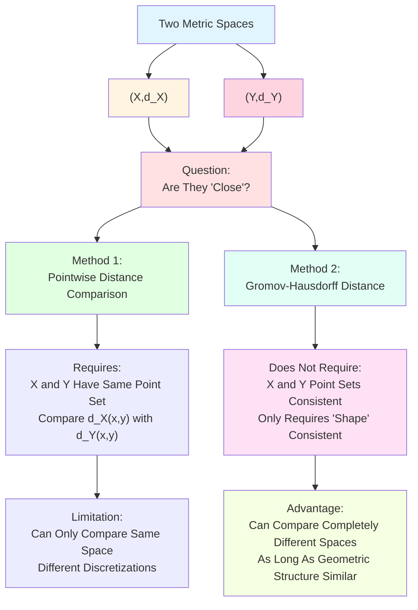
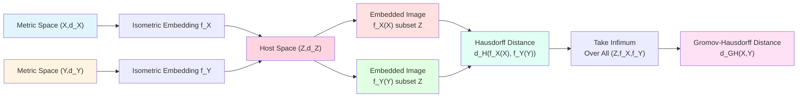
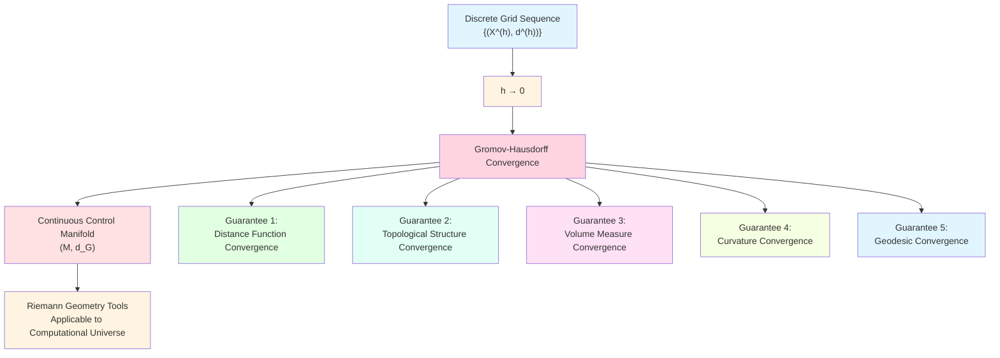
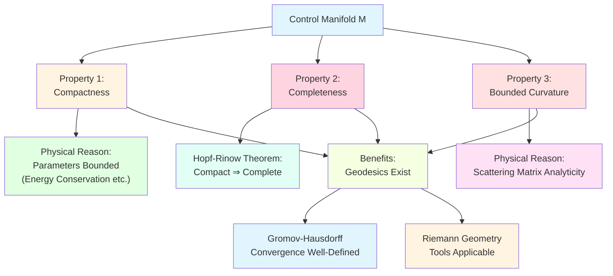
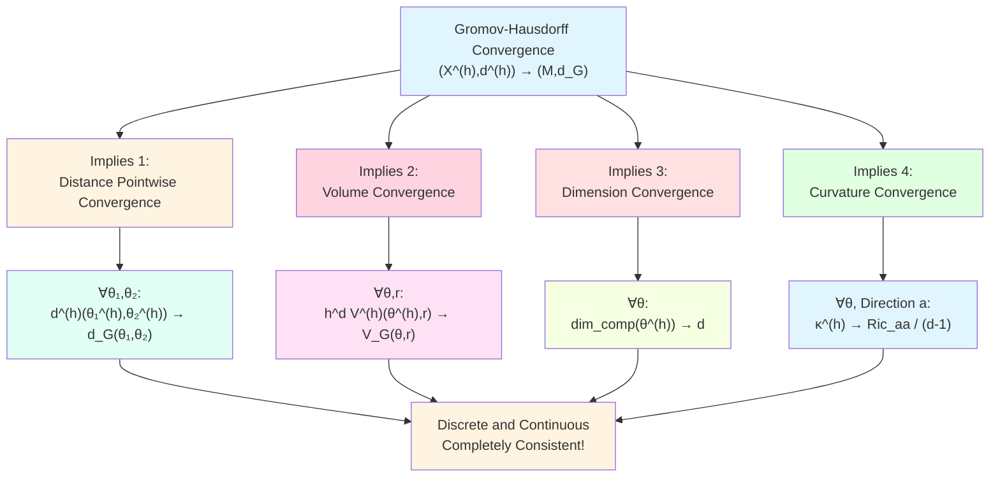
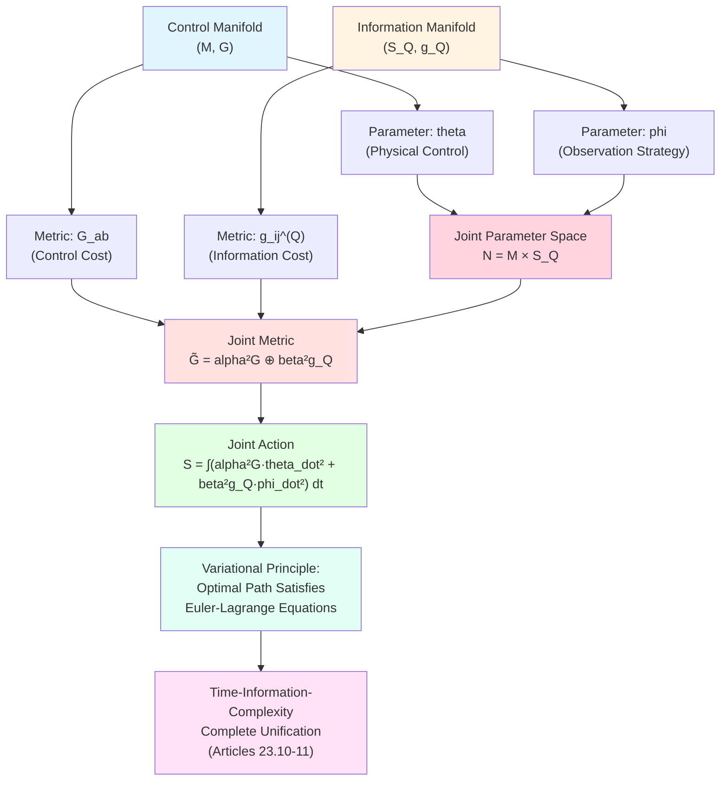
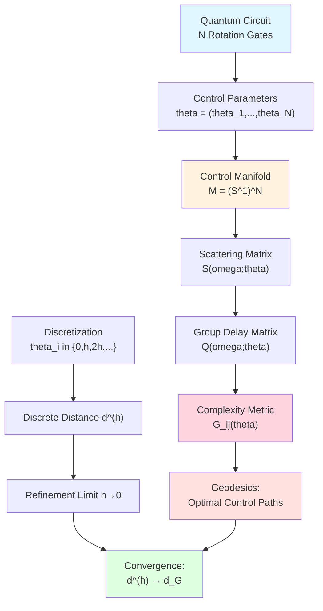
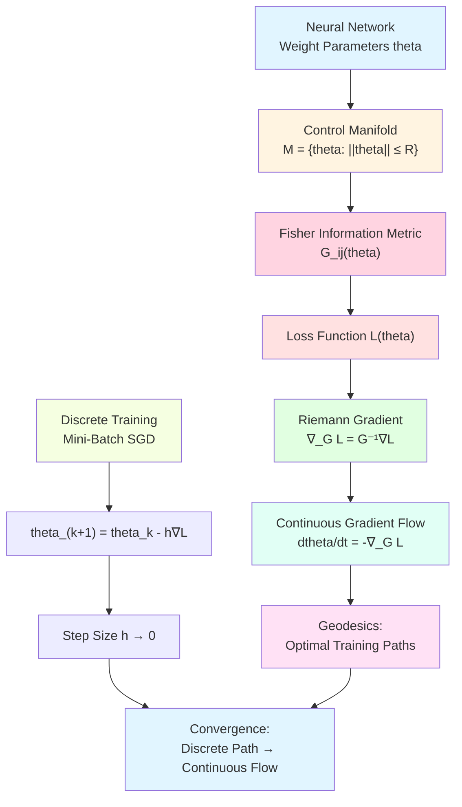
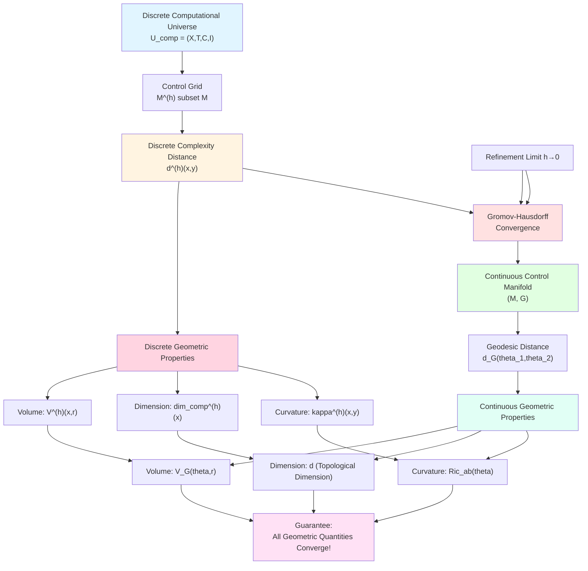

# 23.9 Control Manifold and Gromov-Hausdorff Convergence

In previous article, we established scattering master ruler of unified time scale, and used it to construct complexity metric $G_{ab}(\theta)$ on control manifold $\mathcal{M}$. We also proved a key theorem: when discrete grid becomes finer and finer ($h\to 0$), discrete complexity distance $d^{(h)}$ converges to continuous geodesic distance $d_G$.

But what does this convergence really mean? Just "distance functions converge pointwise"? Or deeper geometric meaning?

This article will deeply explore concept of **Gromov-Hausdorff convergence**, which not only guarantees distance convergence, but also guarantees entire metric space structure (topology, volume, curvature) converges. This is one of strongest convergence concepts in geometric analysis.

**Core Questions**:
- What is Gromov-Hausdorff distance? Why is it stronger than pointwise distance convergence?
- What global properties does control manifold have (compactness, completeness)?
- Is correspondence between discrete and continuous not only at distance level, but also at volume and curvature levels?
- How do control manifold and information manifold couple?

This article is based on euler-gls-info/04-unified-time-scale-continuous-complexity-geometry.md.

---

## 1. Why Is Pointwise Convergence Not Enough? From Pixels to Shapes

### 1.1 Two Kinds of "Close" Images

Imagine two digital photos:
- **Photo A**: A cat, 100×100 pixels, black and white;
- **Photo B**: A cat, 10000×10000 pixels, color, ultra-high definition.

From pixel level, they are completely different: resolution, color, data format all different. But from **visual content** perspective, they are both "a cat", shape, contour, pose basically consistent.

Now ask: **Are these two photos "close"?**

- **Pointwise Convergence**: If scale photo B to 100×100, then compare colors pixel by pixel, may be completely different;
- **Shape Convergence**: If only look at contour and geometric shape, they are very close.

In geometric analysis, what we need is second kind "shape convergence", not simple pointwise convergence. This is core idea of **Gromov-Hausdorff convergence**.

### 1.2 "Shape" of Metric Space

"Shape" of a metric space $(X,d)$ includes:
- **Topological Structure**: Which points are "close", which are "far";
- **Volume Structure**: How "size" of space is distributed;
- **Curvature Structure**: Whether space is "curved" or "flat".

**Pointwise Distance Convergence** only guarantees:
- For each pair of points $(x,y)$, distance $d_n(x,y)$ converges to $d(x,y)$;
- But cannot guarantee overall shape of space is consistent!

**Everyday Analogy**:
- Imagine a rope, you can bend it into different shapes (circle, square, triangle), but "distance along rope" between any two points on rope unchanged;
- Pointwise distance convergence only looks at "distance along rope", Gromov-Hausdorff convergence also looks at "shape in embedding space".

---

## 2. Gromov-Hausdorff Distance: Distance Between Metric Spaces

**Source Theory**: euler-gls-info/04-unified-time-scale-continuous-complexity-geometry.md Section 4

### 2.1 Hausdorff Distance: Distance Between Two Subsets in Same Space

First recall a simpler concept: **Hausdorff Distance**.

**Definition 2.1** (Hausdorff Distance)

Let $(Z,d_Z)$ be a metric space, $A,B\subset Z$ are two non-empty compact subsets. One-way Hausdorff distance from $A$ to $B$ defined as

$$
d_H^{\to}(A,B) = \sup_{a\in A} \inf_{b\in B} d_Z(a,b),
$$

i.e., "distance from farthest point in $A$ to $B$".

**Two-Way Hausdorff Distance** defined as

$$
d_H(A,B) = \max\{d_H^{\to}(A,B),\,d_H^{\to}(B,A)\}.
$$

**Everyday Analogy**:
- Imagine two villages $A$ and $B$, each village is a set of houses;
- $d_H^{\to}(A,B)$ is "distance from farthest house in village $A$ to $B$";
- $d_H(A,B)$ is "maximum distance in both directions", measures "distribution difference" of two villages.

**Example**:
- $A = [0,1]$, $B = [0,1.1]$, both on real axis;
- $d_H^{\to}(A,B) = 0$ (because $A\subset B$);
- $d_H^{\to}(B,A) = 0.1$ (point $1.1\in B$ farthest from $A$);
- $d_H(A,B) = 0.1$.

### 2.2 Isometric Embedding: "Placing" Space into Larger Space

**Definition 2.2** (Isometric Embedding)

Let $(X,d_X)$ and $(Z,d_Z)$ be two metric spaces. Map $f:X\to Z$ is called **isometric embedding**, if for all $x,y\in X$ we have

$$
d_Z(f(x),f(y)) = d_X(x,y).
$$

**Everyday Interpretation**:
- Isometric embedding is "map preserving all distances";
- Imagine embedding a plane map (2D) into 3D space: distance between any two points on map unchanged after embedding;
- But embedding **does not require surjectivity**, map only occupies a small patch of 3D space.

### 2.3 Definition of Gromov-Hausdorff Distance

**Definition 2.3** (Gromov-Hausdorff Distance, from euler-gls-info/04-unified-time-scale-continuous-complexity-geometry.md)

Gromov-Hausdorff distance between two compact metric spaces $(X,d_X)$ and $(Y,d_Y)$ defined as

$$
d_{GH}(X,Y) = \inf\left\{\epsilon : \begin{array}{l}\exists (Z,d_Z),\,f_X:X\to Z,\,f_Y:Y\to Z\\f_X,f_Y\text{ isometric embeddings},\\d_H(f_X(X),f_Y(Y)) \le \epsilon\end{array}\right\}.
$$

**Everyday Interpretation**:
- Take infimum over all possible "host spaces" $Z$, and ways $f_X,f_Y$ to isometrically embed $X,Y$ into $Z$;
- In $Z$, compute Hausdorff distance between two subsets $f_X(X)$ and $f_Y(Y)$;
- Take infimum of Hausdorff distances over all possible embedding ways, get $d_{GH}(X,Y)$.

**Core Insight**:
- Gromov-Hausdorff distance measures "how close can two spaces be embedded into same space";
- If $d_{GH}(X,Y)=0$, then $X$ and $Y$ are "completely identical in shape" in isometric sense (called **isometric isomorphism**);
- $d_{GH}(X,Y)$ small means geometric structures of $X$ and $Y$ very similar, even if their point sets completely different!

### 2.4 Why Called "Shape Distance"?

**Everyday Analogy**:
- Imagine two 3D objects: a cubic grid (discrete), a smooth sphere (continuous);
- Their point sets completely different: one is finite vertices, one is continuous manifold;
- But if discrete grid fine enough, approximates sphere, then $d_{GH}(\text{grid},\text{sphere})$ small;
- Gromov-Hausdorff distance captures "similarity of geometric shapes", not "coincidence of point sets".

---

## 3. Gromov-Hausdorff Convergence: Limit of Space Sequence

**Source Theory**: euler-gls-info/04-unified-time-scale-continuous-complexity-geometry.md Theorem 4.1

### 3.1 Convergence of Metric Space Sequence

**Definition 3.1** (Gromov-Hausdorff Convergence)

Let $\{(X_n,d_n)\}_{n=1}^\infty$ be a family of compact metric spaces, $(X,d)$ is another compact metric space. Say $(X_n,d_n)$ **Gromov-Hausdorff converges** to $(X,d)$, if

$$
\lim_{n\to\infty} d_{GH}(X_n,X) = 0.
$$

Denote as $(X_n,d_n) \xrightarrow{GH} (X,d)$.

**Everyday Interpretation**:
- Does not require $X_n$ and $X$ have same point set;
- Does not require $X_n$ is subset or superset of $X$;
- Only requires: As $n$ increases, "geometric shape" of $X_n$ gets closer and closer to "geometric shape" of $X$.

### 3.2 Why Is This Strong Convergence?

Gromov-Hausdorff convergence not only guarantees distance function convergence, but also guarantees:

1. **Topological Convergence**: Topological structure of $X_n$ approaches topological structure of $X$;
2. **Volume Convergence** (under appropriate normalization): Volume measure of $X_n$ approaches volume measure of $X$;
3. **Curvature Convergence** (under appropriate assumptions): Curvature of $X_n$ approaches curvature of $X$;
4. **Geodesic Convergence**: Shortest paths in $X_n$ approach geodesics in $X$.

**Everyday Analogy**:
- Imagine approximating a sphere with finer and finer polyhedra:
  - Regular tetrahedron → regular octahedron → regular icosahedron → ⋯ → sphere;
  - Number of vertices, edges, faces all changing;
  - But "shape" gets closer and closer to sphere;
  - Finally: volume → volume of sphere, curvature → sphere curvature, geodesics → great circles.

### 3.3 Application in Computational Universe

In computational universe framework, we have:
- **Discrete Space $(X^{(h)},d^{(h)})$**: Control grid with grid step size $h$, discrete complexity distance;
- **Continuous Space $(\mathcal{M},d_G)$**: Control manifold, geodesic distance.

**Theorem 3.2** (Gromov-Hausdorff Convergence of Control Manifold, generalization from euler-gls-info/04-unified-time-scale-continuous-complexity-geometry.md Theorem 4.1)

Under appropriate regularity conditions, when grid step size $h\to 0$, discrete control grid as metric space Gromov-Hausdorff converges to continuous control manifold:

$$
\big(X^{(h)},d^{(h)}\big) \xrightarrow{GH} \big(\mathcal{M},d_G\big).
$$

**Physical Meaning**:
- Discrete computational universe not only converges in "pointwise distance", but also converges in "overall geometric structure";
- This guarantees: All geometric properties of discrete model (volume growth, curvature, dimension) have continuous limits;
- We can safely use continuous Riemann geometry to study properties of computational universe!

---

## 4. Global Properties of Control Manifold

**Source Theory**: euler-gls-info/04-unified-time-scale-continuous-complexity-geometry.md Sections 3-4

### 4.1 Compactness: Bounded and Complete

**Definition 4.1** (Compact Metric Space)

Metric space $(X,d)$ is called **compact**, if satisfies one of following equivalent conditions:
1. Any open cover has finite subcover (topological definition);
2. $X$ is complete and totally bounded (metric definition);
3. Any sequence in $X$ has convergent subsequence (sequential compactness).

**Everyday Analogy**:
- Compact space like "finite closed box":
  - **Bounded**: Space does not extend infinitely;
  - **Closed**: Space contains all limit points, no "holes" or "boundary running to infinity".

**Examples**:
- $[0,1]$ (closed interval) is compact;
- $(0,1)$ (open interval) **not compact**, because not closed (missing endpoints);
- $[0,\infty)$ **not compact**, because unbounded;
- Unit sphere $S^{n-1}$ in $\mathbb{R}^n$ is compact.

### 4.2 Compactness of Control Manifold

In computational universe, control manifold $\mathcal{M}$ usually corresponds to parameter space of physical system:
- **Quantum Gate Parameters**: Rotation angle $\theta\in S^1$ (compact);
- **Coupling Strength**: $g\in [g_{\min},g_{\max}]$ (compact);
- **Neural Network Weights**: Constrained by norm $\|\mathbf{w}\|\le R$ (compact).

**Proposition 4.2** (Physically Realizable Control Manifold Is Compact)

For any physically realizable computational universe, its control manifold $\mathcal{M}$ can be chosen to be compact.

**Reason**:
- Physical parameters always bounded (energy conservation, thermodynamic stability, etc.);
- Can close parameter space through appropriate boundary conditions or regularization.

**Benefits of Compactness**:
- Guarantees geodesics exist and bounded;
- Guarantees well-definedness of Gromov-Hausdorff convergence;
- Allows use of analysis tools on compact manifolds (spectral theory, heat kernel, etc.).

### 4.3 Completeness: Geodesics Don't "Run Out" of Space

**Definition 4.3** (Geodesic Completeness)

Riemann manifold $(\mathcal{M},G)$ is called **geodesically complete**, if any geodesic can be extended to arbitrary parameter length, i.e., geodesics don't "run out" of manifold in finite time.

**Everyday Analogy**:
- Imagine a plane with a point removed: geodesic (straight line) may "hit the hole", cannot continue;
- Geodesically complete space has no such "holes", geodesics can extend infinitely.

**Hopf-Rinow Theorem**:
For complete Riemann manifold, following are equivalent:
1. Geodesically complete;
2. Complete as metric space;
3. Closed balls compact.

**Proposition 4.4** (Completeness of Control Manifold)

If control manifold $\mathcal{M}$ is compact, then it automatically geodesically complete.

**Proof**: Compactness implies completeness (any Cauchy sequence converges), by Hopf-Rinow theorem get geodesic completeness.

### 4.4 Bounded Curvature: "Curvature" Degree of Control Manifold

In Riemann geometry, curvature measures "curvature" degree of space:
- **Positive Curvature**: Space like sphere, geodesics tend to converge;
- **Zero Curvature**: Space like plane, geodesics parallel;
- **Negative Curvature**: Space like saddle surface, geodesics tend to diverge.

**Proposition 4.5** (Bounded Curvature of Control Manifold)

On physically realizable control manifold, metric $G_{ab}(\theta)$ induced by unified time scale has bounded Riemann curvature tensor:

$$
|R_{abcd}(\theta)| \le C
$$

for all $\theta\in\mathcal{M}$ and all indices $a,b,c,d$, where $C$ is constant.

**Physical Reason**:
- Control parameter dependence of scattering matrix $S(\omega;\theta)$ usually analytic;
- Higher-order derivatives of group delay matrix $Q(\omega;\theta)$ with respect to $\theta$ bounded;
- Therefore higher-order derivatives of metric $G_{ab}$ bounded, curvature naturally bounded.

**Meaning of Bounded Curvature**:
- Guarantees stability of geodesics;
- Allows use of comparison theorems for curvature-bounded manifolds (e.g., Bishop-Gromov volume comparison);
- Provides quantitative estimates for Gromov-Hausdorff convergence.

---

## 5. Fine Correspondence of Convergence: Not Only Distance

**Source Theory**: euler-gls-info/04-unified-time-scale-continuous-complexity-geometry.md Section 4 Corollary

### 5.1 Volume Convergence

In discrete space $(X^{(h)},d^{(h)})$, we can define **volume**: For any point $x\in X^{(h)}$ and radius $r>0$, volume of complexity ball is

$$
V^{(h)}(x,r) = \#\{y\in X^{(h)} : d^{(h)}(x,y) \le r\},
$$

i.e., number of points in ball.

In continuous manifold $(\mathcal{M},d_G)$, volume of geodesic ball is

$$
V_G(\theta,r) = \int_{B_G(\theta,r)} \sqrt{\det G}\,\mathrm{d}\theta^1\cdots\mathrm{d}\theta^d,
$$

where $B_G(\theta,r) = \{\theta' : d_G(\theta,\theta')\le r\}$ is geodesic ball, $\sqrt{\det G}$ is volume element.

**Theorem 5.1** (Volume Convergence, from properties of Gromov-Hausdorff convergence)

Under appropriate normalization, when $h\to 0$, for any $\theta\in\mathcal{M}$ and $r>0$ we have

$$
\lim_{h\to 0} h^d V^{(h)}(\theta^{(h)},r) = V_G(\theta,r),
$$

where $\theta^{(h)}\in X^{(h)}$ is point approximating $\theta$, $d$ is manifold dimension.

**Everyday Interpretation**:
- Factor $h^d$ is normalization factor: discrete ball contains $\sim r^d/h^d$ points, multiply by $h^d$ get "continuous volume";
- This theorem says: "Normalized number of points" of discrete ball converges to Riemann volume of continuous ball!

**Everyday Analogy**:
- Imagine piling fine sand into a ball: finer sand grains, more grains, but total volume unchanged;
- Normalization factor $h^d$ is like "volume of single sand grain".

### 5.2 Convergence of Complexity Dimension

Recall complexity dimension defined in Article 23.4:

$$
\dim_{\mathrm{comp}}(x) = \limsup_{r\to\infty} \frac{\log V(x,r)}{\log r}.
$$

On continuous manifold, corresponding is **Riemann dimension** (i.e., topological dimension $d$ of manifold).

**Proposition 5.2** (Dimension Convergence)

If $(\mathcal{M},G)$ is $d$-dimensional Riemann manifold, and $(X^{(h)},d^{(h)}) \xrightarrow{GH} (\mathcal{M},d_G)$, then for almost all $\theta\in\mathcal{M}$ we have

$$
\lim_{h\to 0} \dim_{\mathrm{comp}}(\theta^{(h)}) = d.
$$

**Physical Meaning**:
- "Intrinsic dimension" of discrete complexity geometry converges to topological dimension of continuous manifold;
- This verifies: Complexity dimension is a geometric invariant, doesn't depend on discretization method!

### 5.3 Convergence of Discrete Ricci Curvature

Recall discrete Ricci curvature (Ollivier-Ricci curvature) defined in Article 23.5:

$$
\kappa^{(h)}(x,y) = 1 - \frac{W_1(m_x,m_y)}{d^{(h)}(x,y)},
$$

where $W_1$ is Wasserstein-1 distance, $m_x,m_y$ are "random walk measures".

On continuous Riemann manifold, corresponding is **Ricci curvature tensor** $\mathrm{Ric}_{ab}(\theta)$.

**Theorem 5.3** (Curvature Convergence, from continuous limit theory of Ollivier curvature)

Under appropriate regularity assumptions, when $h\to 0$, discrete Ricci curvature converges to continuous Ricci curvature:

$$
\lim_{h\to 0} \kappa^{(h)}(\theta^{(h)},\theta^{(h)}+he_a) = \frac{1}{d-1}\mathrm{Ric}_{aa}(\theta),
$$

where $e_a$ is coordinate direction, $\mathrm{Ric}_{aa}$ is component of Ricci curvature in direction $a$.

**Everyday Interpretation**:
- Discrete curvature (based on random walk) converges to continuous curvature (based on geodesic deviation) in refinement limit;
- This again verifies: Profound consistency between discrete geometry and continuous geometry!

---

## 6. Coupling of Control Manifold and Information Manifold

**Source Theory**: euler-gls-info/04-unified-time-scale-continuous-complexity-geometry.md Section 5 and subsequent chapter previews

### 6.1 Review: Information Manifold

In Articles 23.6-7, we constructed **information manifold** $(\mathcal{S}_Q,g_Q)$:
- **Object**: Parameterized observation probability distributions $p(\cdot;\phi)$;
- **Metric**: Fisher information metric

$$
g_{ij}^{(Q)}(\phi) = \sum_z p_0(z) \frac{\partial\log p(z;\phi)}{\partial\phi^i}\frac{\partial\log p(z;\phi)}{\partial\phi^j}.
$$

Information manifold measures "how parameter $\phi$ changes affect observation probability distribution".

### 6.2 Control Manifold vs Information Manifold

Now we have two manifolds:

1. **Control Manifold $(\mathcal{M},G)$**:
   - Parameters are physical controls $\theta$ (e.g., quantum gate angles);
   - Metric $G_{ab}$ induced by control derivatives of group delay matrix;
   - Measures "computational cost of control changes".

2. **Information Manifold $(\mathcal{S}_Q,g_Q)$**:
   - Parameters are observation strategies $\phi$ (e.g., choice of measurement basis);
   - Metric $g_{ij}^{(Q)}$ induced by Fisher information matrix;
   - Measures "information acquisition cost of observation strategy changes".

**Core Question**: How are these two manifolds related?

### 6.3 Joint Manifold: Direct Product of Parameter Spaces

In complete computational universe, we need both control physical evolution (parameter $\theta$) and choose observation strategies (parameter $\phi$). Natural idea is consider **joint parameter space**:

$$
\mathcal{N} = \mathcal{M} \times \mathcal{S}_Q.
$$

Coordinates are $(\theta,\phi)$.

**Definition 6.1** (Joint Metric)

On joint manifold $\mathcal{N}$, can define **joint metric**:

$$
\tilde{G} = \alpha^2 G \oplus \beta^2 g_Q,
$$

i.e.,

$$
\tilde{G}_{AB}(\theta,\phi) = \begin{cases}
\alpha^2 G_{ab}(\theta) & \text{if }A=a,B=b\in\{1,\dots,d_M\}\\
\beta^2 g_{ij}^{(Q)}(\phi) & \text{if }A=i,B=j\in\{d_M+1,\dots,d_M+d_S\}\\
0 & \text{otherwise}
\end{cases}
$$

where $\alpha,\beta>0$ are coupling constants, balancing control cost and information cost.

**Everyday Analogy**:
- Imagine playing a game, need to adjust two knobs simultaneously:
  - **Knob 1 (Control $\theta$)**: Adjust game speed (cost is energy);
  - **Knob 2 (Observation $\phi$)**: Adjust camera angle (cost is information bandwidth).
- Joint metric $\tilde{G}$ is metric of "total cost", combining both costs.

### 6.4 Joint Action and Variational Principle

On joint manifold, can define **action functional**:

$$
S[(\theta,\phi)] = \int_0^T \left[\frac{\alpha^2}{2}G_{ab}(\theta)\dot{\theta}^a\dot{\theta}^b + \frac{\beta^2}{2}g_{ij}^{(Q)}(\phi)\dot{\phi}^i\dot{\phi}^j\right]\mathrm{d}t.
$$

**Variational Principle**: Optimal control-observation joint path $(\theta^*(t),\phi^*(t))$ is path making action $S$ extremal, satisfying Euler-Lagrange equations.

This will be detailed in Articles 23.10-11, constructing **time-information-complexity variational principle**, achieving complete unification of three.

---

## 7. Physical Example: Control Manifold of Quantum Circuit

**Source Theory**: euler-gls-info/04-unified-time-scale-continuous-complexity-geometry.md Section 4.3 Extension

### 7.1 Model: Single Qubit Rotation Gate Chain

Consider $N$ single qubit rotation gates in series:

$$
U(\boldsymbol{\theta}) = R_z(\theta_N)\cdots R_z(\theta_2)R_z(\theta_1),
$$

where $R_z(\theta) = e^{-\mathrm{i}\theta\sigma_z/2}$ is rotation gate around $z$-axis.

**Control Parameters**: $\boldsymbol{\theta} = (\theta_1,\dots,\theta_N) \in [0,2\pi)^N$.

**Control Manifold**: $\mathcal{M} = (S^1)^N$ (N-dimensional torus).

### 7.2 Scattering Matrix and Group Delay

For quantum gate chain, scattering matrix can be defined through energy-resolved response function. Under appropriate perturbation theory, group delay matrix $Q(\omega;\boldsymbol{\theta})$ can be explicitly computed.

**Simplified Case**: Assume weak coupling between gates, then metric approximately

$$
G_{ij}(\boldsymbol{\theta}) \approx \delta_{ij} g_i(\theta_i),
$$

where $g_i(\theta_i)$ is "local control cost" of $i$-th gate.

### 7.3 Geodesics: Optimal Control Paths

Under metric $G$, geodesics correspond to "paths with minimum control cost".

**Example**: From $\boldsymbol{\theta}_{\mathrm{init}} = (0,0,\dots,0)$ to $\boldsymbol{\theta}_{\mathrm{target}} = (\pi,\pi,\dots,\pi)$, geodesic is

$$
\boldsymbol{\theta}^*(t) = t(\pi,\pi,\dots,\pi),\quad t\in[0,1],
$$

i.e., "all gates rotate uniformly simultaneously".

**Physical Meaning**:
- This is most energy-efficient control scheme;
- If some gates cost more ($g_i$ larger), geodesic will "avoid" these gates, use cheaper gates more.

### 7.4 Discretization and Convergence

Discretize each angle $\theta_i$ into grid points with step size $h$:

$$
\theta_i \in \{0,h,2h,\dots,2\pi-h\}.
$$

Define discrete complexity distance $d^{(h)}$ as minimum number of jumps (weighted).

**Numerical Verification**:
- Compute discrete distance $d^{(h)}(\boldsymbol{\theta}_1^{(h)},\boldsymbol{\theta}_2^{(h)})$;
- Compute continuous geodesic distance $d_G(\boldsymbol{\theta}_1,\boldsymbol{\theta}_2)$;
- Verify $\lim_{h\to 0} d^{(h)} = d_G$ (instance of Theorem 3.2).

---

## 8. Physical Example: Control Manifold of Neural Network

### 8.1 Model: Simple Feedforward Neural Network

Consider a two-layer feedforward neural network:

$$
y = \sigma(W_2\sigma(W_1 x + b_1) + b_2),
$$

where $x\in\mathbb{R}^{n_0}$ is input, $y\in\mathbb{R}^{n_2}$ is output, $\sigma$ is activation function, $W_1,W_2,b_1,b_2$ are weights and biases.

**Control Parameters**: Weight matrices and bias vectors flattened into vector $\boldsymbol{\theta}\in\mathbb{R}^D$, where $D = n_0 n_1 + n_1 + n_1 n_2 + n_2$.

**Control Manifold**: Parameter space constrained by norm, e.g.,

$$
\mathcal{M} = \{\boldsymbol{\theta}\in\mathbb{R}^D : \|\boldsymbol{\theta}\| \le R\},
$$

this is closed ball in $\mathbb{R}^D$ (compact).

### 8.2 Metric: Fisher Information Metric

In context of neural networks, metric usually adopts **Fisher information metric**: Let network output $y(\boldsymbol{\theta})$ correspond to a probability distribution $p(y|\boldsymbol{\theta})$, then

$$
G_{ij}(\boldsymbol{\theta}) = \mathbb{E}_{y\sim p(\cdot|\boldsymbol{\theta})}\left[\frac{\partial\log p(y|\boldsymbol{\theta})}{\partial\theta_i}\frac{\partial\log p(y|\boldsymbol{\theta})}{\partial\theta_j}\right].
$$

This is direct application of information geometry from Articles 23.6-7.

### 8.3 Training: Gradient Flow on Geodesics

Training process of neural network can be understood as moving along "loss function gradient" on control manifold:

$$
\frac{\mathrm{d}\boldsymbol{\theta}}{\mathrm{d}t} = -G^{-1}\nabla_{\boldsymbol{\theta}}L,
$$

where $L(\boldsymbol{\theta})$ is loss function, $G^{-1}$ is inverse of metric (raising indices).

This is called **Natural Gradient Descent**, converges faster than standard gradient descent, because it follows geodesics of Riemann geometry.

### 8.4 Discretization: Mini-Batch Gradient Descent

Actual training uses **mini-batch gradient descent** (mini-batch SGD):

$$
\boldsymbol{\theta}_{k+1} = \boldsymbol{\theta}_k - h \nabla_{\boldsymbol{\theta}}L|_{\boldsymbol{\theta}_k},
$$

where $h$ is learning rate (step size).

This is an instance of discrete path on control manifold:
- Step size $h$ corresponds to discretization scale;
- When $h\to 0$, discrete path converges to continuous gradient flow;
- Gromov-Hausdorff convergence guarantees: Discrete training dynamics converges to continuous dynamics!

---

## 9. Complete Picture: Bridge from Discrete to Continuous

### 9.1 Theoretical Hierarchy Summary

### 9.2 Core Theorems Review

| Theorem | Content | Source |
|---------|---------|--------|
| **Gromov-Hausdorff Convergence** | $(X^{(h)},d^{(h)}) \xrightarrow{GH} (\mathcal{M},d_G)$ | Theorem 3.2 |
| **Volume Convergence** | $h^d V^{(h)}(\theta^{(h)},r) \to V_G(\theta,r)$ | Theorem 5.1 |
| **Dimension Convergence** | $\dim_{\mathrm{comp}}(\theta^{(h)}) \to d$ | Proposition 5.2 |
| **Curvature Convergence** | $\kappa^{(h)}(\theta^{(h)},\theta^{(h)}+he_a) \to \mathrm{Ric}_{aa}/(d-1)$ | Theorem 5.3 |
| **Manifold Compactness** | $\mathcal{M}$ is compact | Proposition 4.2 |
| **Manifold Completeness** | $\mathcal{M}$ geodesically complete | Proposition 4.4 |
| **Bounded Curvature** | $\|R_{abcd}\| \le C$ | Proposition 4.5 |

### 9.3 Core Concepts Quick Reference

| Concept | Definition | Physical Meaning |
|---------|------------|-----------------|
| Hausdorff Distance | $d_H(A,B) = \max\{d_H^{\to}(A,B),d_H^{\to}(B,A)\}$ | "Maximum Deviation" of Two Subsets |
| Isometric Embedding | $d_Z(f(x),f(y)) = d_X(x,y)$ | Map Preserving All Distances |
| Gromov-Hausdorff Distance | $d_{GH}(X,Y) = \inf\{d_H(f_X(X),f_Y(Y))\}$ | "Shape Distance" of Metric Spaces |
| Compactness | Complete + Totally Bounded | "Bounded and Closed" |
| Geodesic Completeness | Geodesics Can Extend Arbitrarily | "No Holes" |
| Ricci Curvature | $R_{ab} = R^c_{acb}$ | "Curvature" Degree |

---

## 10. Summary

This article deeply explored global properties of control manifold and Gromov-Hausdorff convergence:

### 10.1 Core Concepts

1. **Gromov-Hausdorff Distance $d_{GH}(X,Y)$**: "Shape distance" between metric spaces
   - Defined through isometric embeddings and Hausdorff distance;
   - Does not require point sets consistent, only requires geometric structure similar.

2. **Gromov-Hausdorff Convergence**: Strongest geometric convergence
   - Not only distance converges, but also guarantees volume, dimension, curvature all converge;
   - Strict bridge from discrete geometry → continuous geometry.

3. **Global Properties of Control Manifold**:
   - **Compactness**: Parameters bounded and closed;
   - **Completeness**: Geodesics don't run out of space;
   - **Bounded Curvature**: Curvature degree controllable.

4. **Fine Correspondence**:
   - Volume: $h^d V^{(h)} \to V_G$;
   - Dimension: $\dim_{\mathrm{comp}}^{(h)} \to d$;
   - Curvature: $\kappa^{(h)} \to \mathrm{Ric}/(d-1)$.

5. **Joint Manifold $\mathcal{N} = \mathcal{M}\times\mathcal{S}_Q$**: Coupling of control manifold and information manifold

### 10.2 Core Insights

- **Shape Over Point Set**: Gromov-Hausdorff convergence focuses on geometric structure, not specific point correspondence;
- **Discrete Is Continuous**: Under appropriate limit, discrete geometry and continuous geometry completely equivalent;
- **Physical Realizability**: Compactness, completeness of control manifold come from physical constraints (energy conservation, etc.);
- **Geometric Unification**: All geometric quantities (distance, volume, dimension, curvature) consistent under convergence;
- **Control-Information Coupling**: Computational universe needs to simultaneously optimize control cost and information cost.

### 10.3 Everyday Analogy Review

- **Pixels to Image**: Gromov-Hausdorff convergence like improving resolution, finally get continuous image;
- **Polyhedron to Sphere**: Discrete grid finer and finer, finally approximates smooth sphere;
- **Sand Piled into Ball**: Finer sand grains, smoother ball;
- **Quantum Circuit Training**: Discrete control steps become continuous geodesic flow in limit;
- **Neural Network Optimization**: Mini-batch gradient descent converges to natural gradient flow.

### 10.4 Connections with Previous and Subsequent Chapters

**Connection with Articles 23.1-8**:
- Articles 23.3-5: Discrete complexity geometry (distance, volume, Ricci curvature);
- Articles 23.6-7: Discrete information geometry (Fisher matrix, information dimension);
- Article 23.8: Unified time scale, construction of control manifold;
- This Article: Proves complete equivalence between discrete and continuous (Gromov-Hausdorff convergence).

**Preview of Articles 23.10-11**:
Next articles will construct **joint manifold and time-information-complexity action**:
- Joint manifold $\mathcal{N} = \mathcal{M}\times\mathcal{S}_Q$;
- Joint metric $\tilde{G} = \alpha^2 G \oplus \beta^2 g_Q$;
- Action functional $S = \int[\alpha^2 G\dot{\theta}^2 + \beta^2 g_Q\dot{\phi}^2 - \gamma U_Q]\mathrm{d}t$;
- Euler-Lagrange equations: Optimal control-observation joint paths;
- Variational unification of time, information, complexity.

---

**Preview of Next Article**: 23.10 Joint Manifold and Time-Information-Complexity Action

In next article, we will:
1. **Construct Joint Manifold $\mathcal{N} = \mathcal{M}\times\mathcal{S}_Q$**: Direct product of control parameters $\theta$ and observation parameters $\phi$;
2. **Define Joint Metric**: Combining control cost $G$ and information cost $g_Q$;
3. **Introduce Potential Term $U_Q(\phi)$**: "Information potential" of observation strategy;
4. **Construct Action Functional**: Unified formulation of time-information-complexity;
5. **Derive Euler-Lagrange Equations**: Dynamical equations of optimal paths;
6. **Prove Conservation Laws**: Energy conservation, momentum conservation, information conservation;
7. **Physical Examples**: Optimal strategies for quantum measurement, information bottleneck of neural networks.

