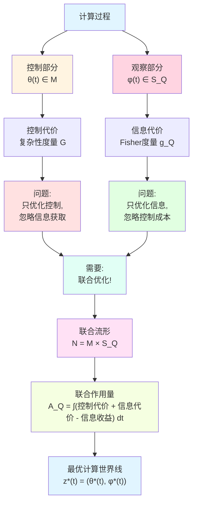
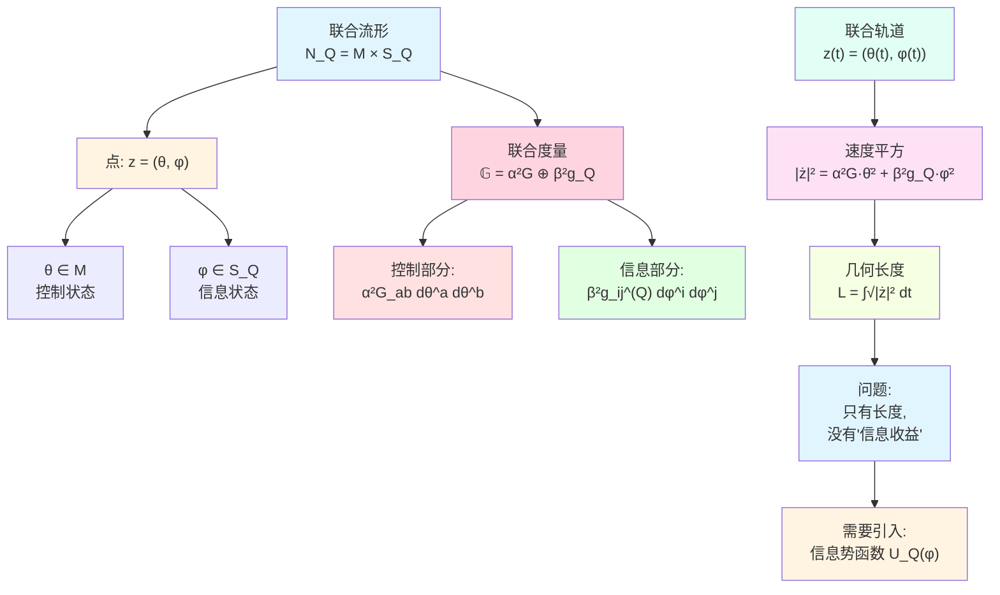
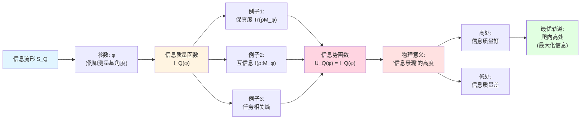
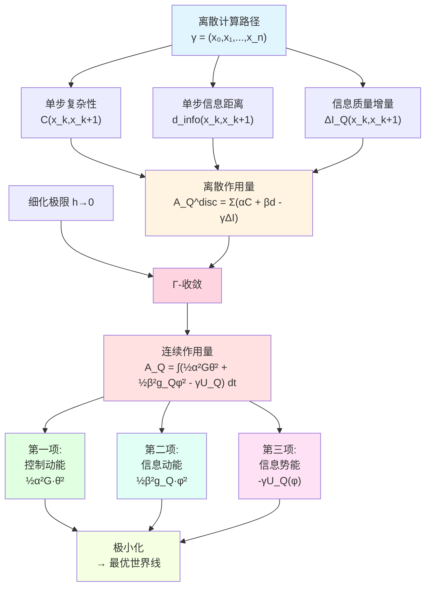
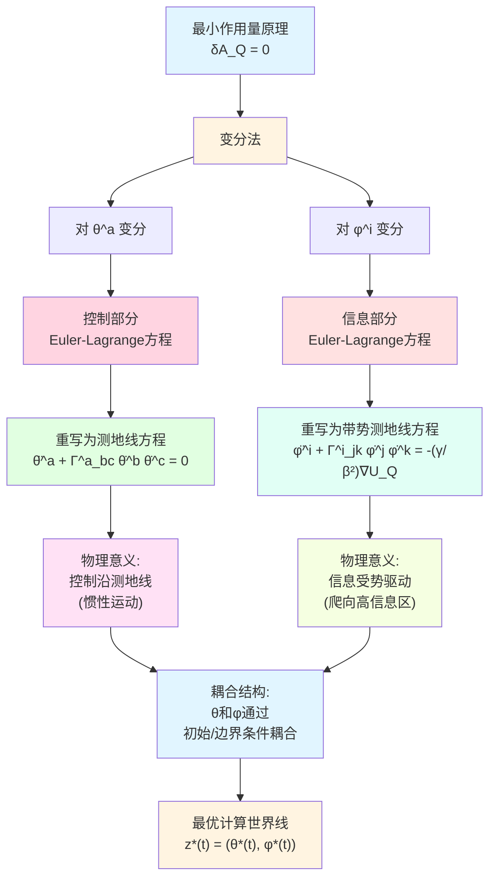
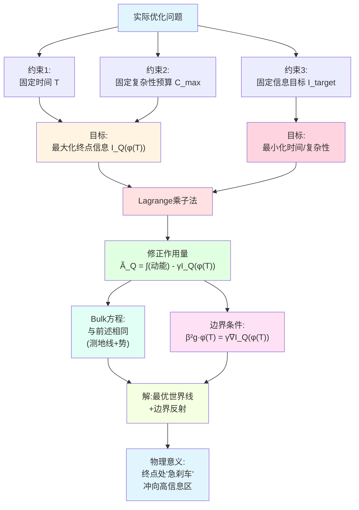
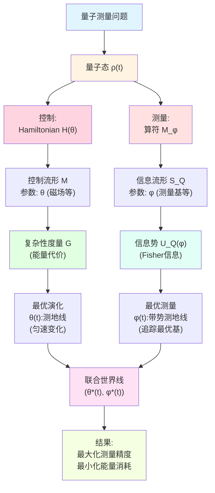
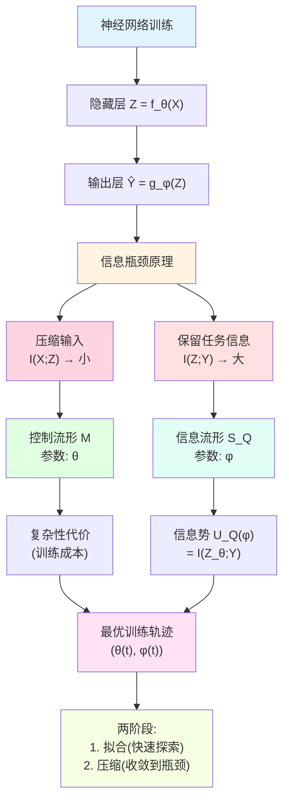
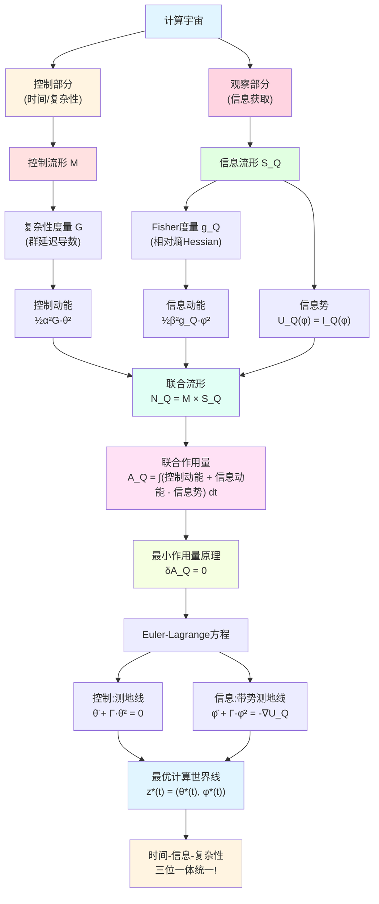

# 23.10 联合流形与时间-信息-复杂性作用量

在前面的文章中,我们分别建立了两个几何结构:
- **控制流形 $(\mathcal{M},G)$**:描述计算的"复杂性代价"(第23.8-9篇);
- **信息流形 $(\mathcal{S}_Q,g_Q)$**:描述观察的"信息获取"(第23.6-7篇)。

但计算宇宙中的真实过程**同时涉及两者**:
- 我们需要**控制**系统演化(花费时间/能量);
- 同时需要**观察**系统状态(获取信息)。

这引出一个核心问题:**如何在给定资源下,优化控制与观察的联合策略,使信息获取最大化?**

本篇将构造**联合流形** $\mathcal{N} = \mathcal{M}\times\mathcal{S}_Q$,在其上定义**时间-信息-复杂性作用量** $\mathcal{A}_Q$,并通过变分原理导出最优计算轨道(计算世界线)。这实现了时间、信息、复杂性三者的完全统一。

**核心问题**:
- 如何将控制流形与信息流形耦合成联合流形?
- 什么是时间-信息-复杂性作用量?为什么是"动能-势能"形式?
- 离散计算路径如何收敛到连续计算世界线?
- 最优计算世界线满足什么动力学方程?

本文基于 euler-gls-info/05-time-information-complexity-variational-principle.md。

---

## 1. 为什么需要联合流形?从导航到最优策略

### 1.1 日常类比:开车导航的双重优化

想象你在用导航app从家里开车到机场:

**问题1:走哪条路?**(控制优化)
- 导航会规划一条路线,考虑距离、时间、拥堵;
- 这是在"地图空间"(控制流形)上找最短路径;
- 代价是"行驶时间"(复杂性代价)。

**问题2:如何知道路况?**(信息获取)
- 导航需要不断更新路况信息(通过GPS、传感器);
- 这是在"信息空间"(信息流形)上移动;
- 代价是"数据流量/电池消耗"(信息代价)。

**核心洞察**:最优策略需要**同时优化**两个问题:
- 选择路线时考虑信息质量(避开信息盲区);
- 获取信息时考虑路线约束(不能为了看路况绕远路)。

这需要在**联合空间**(路线×信息)上做优化,而不是分别优化!

### 1.2 计算宇宙中的类比

在计算宇宙中:

**控制流形 $\mathcal{M}$**:
- 参数是物理控制(例如量子门角度、电路电压);
- 度量 $G_{ab}$ 衡量控制变化的"计算代价"(时间、能量);
- 测地线是"最快的计算路径"。

**信息流形 $\mathcal{S}_Q$**:
- 参数是观察策略(例如测量基选择、采样方案);
- 度量 $g_{ij}^{(Q)}$ 衡量观察变化的"信息距离"(Fisher信息);
- 测地线是"信息变化最平缓的路径"。

**计算世界线**:真实的计算过程是联合空间 $\mathcal{M}\times\mathcal{S}_Q$ 上的曲线:
$$
z(t) = \big(\theta(t),\phi(t)\big),
$$
其中 $\theta(t)$ 是控制参数轨迹,$\phi(t)$ 是观察参数轨迹。

---

## 2. 联合流形的构造:乘积空间

**源理论**:euler-gls-info/05-time-information-complexity-variational-principle.md 第3节

### 2.1 联合流形的定义

**定义 2.1**(联合时间-信息-复杂性流形,源自 euler-gls-info/05-time-information-complexity-variational-principle.md 定义3.1)

对给定任务 $Q$,定义**联合流形**

$$
\mathcal{N}_Q = \mathcal{M} \times \mathcal{S}_Q.
$$

其点 $z = (\theta,\phi)$ 同时表示:
- **控制状态** $\theta\in\mathcal{M}$(例如量子门参数);
- **任务信息状态** $\phi\in\mathcal{S}_Q$(例如测量基参数)。

**日常解读**:
- $\mathcal{M}$ 是"物理旋钮"的空间(控制系统如何演化);
- $\mathcal{S}_Q$ 是"测量旋钮"的空间(选择如何观察);
- $\mathcal{N}_Q$ 是"两组旋钮同时调节"的空间。

**例子**:量子测量
- 控制参数 $\theta$:Hamiltonian的参数(例如磁场强度);
- 观察参数 $\phi$:测量算符的参数(例如测量基的旋转角度);
- 联合状态 $(\theta,\phi)$:"同时设定演化和测量"。

### 2.2 联合度量:加权乘积

**定义 2.2**(联合度量,源自 euler-gls-info/05-time-information-complexity-variational-principle.md 第3.2节)

在联合流形 $\mathcal{N}_Q$ 上定义**乘积型度量**

$$
\mathbb{G} = \alpha^2 G \oplus \beta^2 g_Q,
$$

即对切向量 $v = (v^{\mathcal{M}},v^{\mathcal{S}_Q}) \in T_\theta\mathcal{M} \oplus T_\phi\mathcal{S}_Q$,定义

$$
\mathbb{G}_z(v,v) = \alpha^2 G_\theta(v^{\mathcal{M}},v^{\mathcal{M}}) + \beta^2 g_{Q,\phi}(v^{\mathcal{S}_Q},v^{\mathcal{S}_Q}),
$$

其中 $\alpha,\beta>0$ 为**耦合常数**,用于平衡控制代价与信息代价的权重。

**日常解读**:
- $\alpha$ 是"控制的权重":$\alpha$ 越大,控制变化的代价越高;
- $\beta$ 是"信息的权重":$\beta$ 越大,信息变化的代价越高;
- 联合度量 $\mathbb{G}$ 是"总代价"的度量。

**数学结构**:
- 这是标准的**Riemann乘积度量**;
- 局部坐标下:$\mathbb{G} = \mathrm{diag}(\alpha^2 G,\beta^2 g_Q)$(分块对角);
- 不同块之间**无耦合项**:控制与信息是"正交"的。

### 2.3 联合轨道的速度与长度

给定一条联合轨道

$$
z(t) = \big(\theta(t),\phi(t)\big),\quad t\in[0,T],
$$

其瞬时**速度平方**为

$$
|\dot{z}(t)|_{\mathbb{G}}^2 = \alpha^2 G_{ab}(\theta(t))\dot{\theta}^a(t)\dot{\theta}^b(t) + \beta^2 g_{ij}(\phi(t))\dot{\phi}^i(t)\dot{\phi}^j(t).
$$

轨道的**几何长度**为

$$
L_{\mathbb{G}}[z] = \int_0^T \sqrt{|\dot{z}(t)|_{\mathbb{G}}^2}\,\mathrm{d}t.
$$

**日常解读**:
- $|\dot{z}(t)|_{\mathbb{G}}^2$ 是"联合速度的平方"(类似 $v_x^2+v_y^2$);
- 包含两部分贡献:控制速度 $\alpha^2 G\dot{\theta}^2$ 和信息速度 $\beta^2 g_Q\dot{\phi}^2$;
- 几何长度 $L_{\mathbb{G}}$ 是"总路程"(时间积分)。

---

## 3. 信息势函数:量化信息质量

**源理论**:euler-gls-info/05-time-information-complexity-variational-principle.md 第3.3节

### 3.1 为什么需要势函数?

仅靠联合度量 $\mathbb{G}$ 还不够!

**问题**:联合流形上的测地线(最短路径)只考虑"代价最小",不考虑"信息质量"。

**日常类比**:
- 想象爬山寻宝:
  - **几何长度**:从山脚到山顶的路程(代价);
  - **宝藏位置**:山顶有宝藏,山腰没有(收益);
  - **最优路径**:不是最短路,而是"代价与收益平衡"的路径!

在计算宇宙中:
- **控制-信息长度**:计算花费的总资源;
- **信息质量**:终点获得的信息好坏;
- **最优世界线**:在给定资源下,信息质量最高的轨道。

因此,我们需要引入**信息势函数**来编码"信息质量"。

### 3.2 信息势函数的定义

**定义 3.1**(信息势函数,源自 euler-gls-info/05-time-information-complexity-variational-principle.md 第3.3节)

设任务 $Q$ 的信息质量函数在信息流形上可写为 $I_Q:\mathcal{S}_Q\to\mathbb{R}$。定义**信息势函数**

$$
U_Q(\phi) = I_Q(\phi),
$$

或更一般地,$U_Q(\phi) = V(I_Q(\phi))$,其中 $V:\mathbb{R}\to\mathbb{R}$ 为单调函数。

**物理意义**:
- $U_Q(\phi)$ 衡量"在信息状态 $\phi$ 时的信息质量";
- $U_Q$ 越大,信息质量越高;
- 在作用量中,$U_Q$ 以**负号**出现(类似势能),使得高信息质量降低作用量。

**日常解读**:
- 想象 $U_Q(\phi)$ 是"信息景观"的高度:
  - 高处:信息质量好(例如测量基与任务高度相关);
  - 低处:信息质量差(例如测量基与任务无关)。
- 最优轨道会"爬向高处"(信息质量好的区域)。

### 3.3 例子:量子测量的信息势

考虑量子态 $\rho$ 在不同测量基 $\{\hat{M}_\phi\}$ 下的测量:
- 信息质量可以用**保真度**衡量:$I_Q(\phi) = \mathrm{Tr}(\rho \hat{M}_\phi)$;
- 或用**互信息**衡量:$I_Q(\phi) = I(\rho : M_\phi)$;
- 势函数 $U_Q(\phi)$ 在"最优测量基"附近达到最大值。

**物理图像**:
- 如果选择"与态 $\rho$ 正交"的测量基,$U_Q(\phi)$ 很小(信息质量差);
- 如果选择"与态 $\rho$ 对齐"的测量基,$U_Q(\phi)$ 很大(信息质量好);
- 最优策略会动态调整 $\phi(t)$ 来追踪 $U_Q$ 的最大值。

---

## 4. 时间-信息-复杂性作用量

**源理论**:euler-gls-info/05-time-information-complexity-variational-principle.md 第4节

### 4.1 连续作用量的定义

**定义 4.1**(时间-信息-复杂性作用量,源自 euler-gls-info/05-time-information-complexity-variational-principle.md 定义4.2)

对联合轨道 $z(t) = (\theta(t),\phi(t))$,定义**连续联合作用量**

$$
\mathcal{A}_Q[\theta(\cdot),\phi(\cdot)] = \int_0^T \Big(\tfrac{1}{2}\alpha^2 G_{ab}(\theta)\dot{\theta}^a\dot{\theta}^b + \tfrac{1}{2}\beta^2 g_{ij}(\phi)\dot{\phi}^i\dot{\phi}^j - \gamma U_Q(\phi)\Big)\,\mathrm{d}t,
$$

其中:
- 第一项:$\tfrac{1}{2}\alpha^2 G_{ab}\dot{\theta}^a\dot{\theta}^b$ 是**控制动能**;
- 第二项:$\tfrac{1}{2}\beta^2 g_{ij}\dot{\phi}^i\dot{\phi}^j$ 是**信息动能**;
- 第三项:$-\gamma U_Q(\phi)$ 是**信息势能**(负号!);
- $\alpha,\beta,\gamma>0$ 是耦合常数。

**日常解读**:
- 这是经典力学中"动能-势能"的形式:
  - $T = \tfrac{1}{2}m v^2$(动能);
  - $V = U(x)$(势能);
  - 作用量 $S = \int (T - V)\,\mathrm{d}t$(Hamilton作用量)。
- 在我们的框架中:
  - "动能"有两部分:控制动能 $+$ 信息动能;
  - "势能"是信息势 $-\gamma U_Q(\phi)$(负号使高信息质量降低作用量)。

### 4.2 为什么是"动能-势能"形式?

**原理**:这是**最小作用量原理**的标准形式。

在经典力学中,真实的运动轨道使作用量 $S = \int(T-V)\mathrm{d}t$ 取极值(通常是极小)。这导出了Euler-Lagrange方程(即Newton第二定律)。

在计算宇宙中:
- **动能项**:惩罚"快速变化"(控制和信息都不能变化太快);
- **势能项**:奖励"高信息质量"(鼓励轨道进入高 $U_Q$ 区域);
- **极小轨道**:在"慢速变化"与"高信息质量"之间取得平衡。

**物理直觉**:
- 想象一个小球在山谷中滚动:
  - 动能驱使它沿惯性方向滚;
  - 势能驱使它滚向山谷底部;
  - 真实轨道是两者的平衡(测地线+势梯度)。
- 计算世界线也类似:
  - 控制/信息动能驱使轨道"保持当前方向";
  - 信息势驱使轨道"转向高信息区域";
  - 最优轨道是两者的平衡。

### 4.3 离散作用量:从路径到连续

在离散层面,计算路径是一系列状态 $\gamma = (x_0,x_1,\dots,x_n)$。对应的**离散作用量**为

$$
\mathcal{A}_Q^{\mathrm{disc}}(\gamma) = \sum_{k=0}^{n-1}\Big(\alpha\,\mathsf{C}(x_k,x_{k+1}) + \beta\,d_{\mathrm{info},Q}(x_k,x_{k+1}) - \gamma\,\Delta I_Q(x_k,x_{k+1})\Big),
$$

其中:
- $\mathsf{C}(x_k,x_{k+1})$ 是复杂性代价(单步时间);
- $d_{\mathrm{info},Q}(x_k,x_{k+1})$ 是信息距离(单步信息变化);
- $\Delta I_Q(x_k,x_{k+1}) = I_Q(\phi_{k+1}) - I_Q(\phi_k)$ 是信息质量增量。

**收敛定理 4.2**(离散到连续的 $\Gamma$-收敛,源自 euler-gls-info/05-time-information-complexity-variational-principle.md 定理6.1)

在适当的正则性假设下,当离散步长 $h\to 0$ 时,离散作用量 $\mathcal{A}_Q^{\mathrm{disc}}$ 在 $\Gamma$-收敛意义下收敛到连续作用量 $\mathcal{A}_Q$:

$$
\Gamma\text{-}\lim_{h\to 0} \mathcal{A}_Q^{(h)} = \mathcal{A}_Q.
$$

特别地,离散最优路径的极限是连续最优世界线。

**日常解读**:
- 离散路径是"逐步跳跃"的;
- 连续世界线是"光滑曲线";
- $\Gamma$-收敛保证:离散最优路径在极限下变成连续最优世界线!

---

## 5. Euler-Lagrange方程:最优世界线的动力学

**源理论**:euler-gls-info/05-time-information-complexity-variational-principle.md 第5节

### 5.1 变分原理:为什么极小作用量?

**最小作用量原理**:真实的物理轨道使作用量 $S = \int L\,\mathrm{d}t$ 取极值(通常是极小)。

在我们的框架中:
- **Lagrangian**:$L(\theta,\dot{\theta};\phi,\dot{\phi}) = \tfrac{1}{2}\alpha^2 G_{ab}\dot{\theta}^a\dot{\theta}^b + \tfrac{1}{2}\beta^2 g_{ij}\dot{\phi}^i\dot{\phi}^j - \gamma U_Q(\phi)$;
- **作用量**:$\mathcal{A}_Q = \int_0^T L\,\mathrm{d}t$;
- **极小轨道**:满足 $\delta\mathcal{A}_Q = 0$ 的轨道 $(theta^*(t),\phi^*(t))$。

对 $\theta^a$ 和 $\phi^i$ 分别变分,得到**Euler-Lagrange方程**。

### 5.2 控制部分的Euler-Lagrange方程

对控制变量 $\theta^a$ 变分,Euler-Lagrange方程为

$$
\frac{\mathrm{d}}{\mathrm{d}t}\Big(\alpha^2 G_{ab}(\theta)\dot{\theta}^b\Big) - \tfrac{1}{2}\alpha^2 (\partial_a G_{bc})(\theta)\dot{\theta}^b\dot{\theta}^c = 0.
$$

**重写为测地线方程**:

定义Christoffel符号

$$
\Gamma^a_{bc}(\theta) = \tfrac{1}{2}G^{ad}\big(\partial_b G_{dc} + \partial_c G_{db} - \partial_d G_{bc}\big),
$$

则Euler-Lagrange方程等价于

$$
\ddot{\theta}^a + \Gamma^a_{bc}(\theta)\dot{\theta}^b\dot{\theta}^c = 0.
$$

**物理意义**:
- 这是控制流形 $(\mathcal{M},G)$ 上的**测地线方程**;
- 控制轨道 $\theta(t)$ 沿测地线演化(惯性运动,无外力);
- 因为Lagrangian中控制部分**没有势能项**!

### 5.3 信息部分的Euler-Lagrange方程

对信息变量 $\phi^i$ 变分,Euler-Lagrange方程为

$$
\frac{\mathrm{d}}{\mathrm{d}t}\Big(\beta^2 g_{ij}(\phi)\dot{\phi}^j\Big) - \tfrac{1}{2}\beta^2 (\partial_i g_{jk})(\phi)\dot{\phi}^j\dot{\phi}^k + \gamma\,\partial_i U_Q(\phi) = 0.
$$

**重写为带势测地线方程**:

定义信息流形的Christoffel符号 $\Gamma^i_{jk}(\phi)$,并提升势能梯度:

$$
\ddot{\phi}^i + \Gamma^i_{jk}(\phi)\dot{\phi}^j\dot{\phi}^k = -\frac{\gamma}{\beta^2} g^{ij}(\phi)\partial_j U_Q(\phi).
$$

**物理意义**:
- 左边:信息流形 $(\mathcal{S}_Q,g_Q)$ 上的测地线加速度;
- 右边:信息势 $U_Q$ 的梯度(共变提升),$-\tfrac{\gamma}{\beta^2}\nabla U_Q$;
- 信息轨道 $\phi(t)$ **不是测地线**,而是"受势梯度驱动的带势测地线"!

**日常类比**:
- 想象在山坡上滚球:
  - 如果没有重力(平坦地面),球沿直线滚(测地线);
  - 如果有重力(山坡),球会被"拉向山谷"(势梯度);
  - 真实轨道是两者的叠加(带势测地线)。
- 信息轨道也类似:
  - 测地线部分:沿"信息惯性"运动;
  - 势梯度部分:被"拉向高信息质量区域"。

### 5.4 联合系统的耦合结构

**总结**:最优计算世界线 $(theta^*(t),\phi^*(t))$ 满足耦合系统:

$$
\begin{cases}
\ddot{\theta}^a + \Gamma^a_{bc}(\theta)\dot{\theta}^b\dot{\theta}^c = 0 & \text{(控制:测地线)}\\
\ddot{\phi}^i + \Gamma^i_{jk}(\phi)\dot{\phi}^j\dot{\phi}^k = -\tfrac{\gamma}{\beta^2} g^{ij}(\phi)\partial_j U_Q(\phi) & \text{(信息:带势测地线)}
\end{cases}
$$

**核心洞察**:
- 控制与信息**解耦**:$\theta$ 的方程不依赖 $\phi$,$\phi$ 的方程不依赖 $\theta$;
- 但通过**初始条件和边界条件**耦合:两者需要同时优化;
- 这是因为我们选择了**乘积度量** $\mathbb{G} = \alpha^2 G \oplus \beta^2 g_Q$(无交叉项)。

---

## 6. 资源约束下的最优化:Lagrange乘子法

**源理论**:euler-gls-info/05-time-information-complexity-variational-principle.md 第7节

### 6.1 实际问题:带约束的优化

在实际应用中,我们通常面对**约束优化问题**:

**问题1**:给定时间预算 $T$,最大化终点信息质量 $I_Q(\phi(T))$。

**问题2**:给定复杂性预算 $C_{\max}$,最大化终点信息质量。

**问题3**:给定信息质量目标 $I_{\mathrm{target}}$,最小化所需时间/复杂性。

这些都是**带约束的变分问题**,可以用**Lagrange乘子法**转化为无约束问题。

### 6.2 例子:固定时间,最大化终点信息

**问题**:

$$
\max_{\theta(\cdot),\phi(\cdot)} I_Q(\phi(T)),\quad \text{subject to } \int_0^T\Big(\tfrac{1}{2}\alpha^2 G\dot{\theta}^2 + \tfrac{1}{2}\beta^2 g_Q\dot{\phi}^2\Big)\mathrm{d}t \le E_{\max}.
$$

**转化为无约束问题**:

引入Lagrange乘子 $\lambda$,定义修正作用量

$$
\widetilde{\mathcal{A}}_Q = \int_0^T\Big(\tfrac{1}{2}\alpha^2 G\dot{\theta}^2 + \tfrac{1}{2}\beta^2 g_Q\dot{\phi}^2\Big)\mathrm{d}t - \gamma I_Q(\phi(T)).
$$

极小化 $\widetilde{\mathcal{A}}_Q$ 等价于原约束问题(当约束饱和时)。

**Euler-Lagrange方程**:

- Bulk方程(在 $t\in(0,T)$ 内)与前述相同;
- **边界条件**(在 $t=T$):

$$
\beta^2 g_{ij}(\phi(T))\dot{\phi}^j(T) = \gamma\,\partial_i I_Q(\phi(T)).
$$

**物理意义**:
- 边界条件是"终点反射条件":终点处,信息速度与信息质量梯度成正比;
- $\gamma/\beta^2$ 控制"对终点信息质量的偏好强度";
- 如果 $\gamma$ 很大,轨道会在终点处"急刹车",全力冲向高信息区。

### 6.3 日常类比:最优刹车策略

想象开车到目的地:
- **约束**:总能量有限(油箱容量);
- **目标**:到达时速度尽量低(安全停车);
- **最优策略**:
  - 大部分时间匀速行驶(保存能量);
  - 接近终点时急刹车(速度降为零)。

在计算宇宙中:
- **约束**:总计算能量有限;
- **目标**:终点信息质量尽量高;
- **最优策略**:
  - 大部分时间沿测地线演化(节省能量);
  - 接近终点时"冲向高信息区"(边界条件)。

---

## 7. 物理实例:量子测量的最优策略

### 7.1 问题设定:自适应量子测量

考虑一个量子系统:
- **初态**:$\rho_0$(已知);
- **演化**:Hamiltonian $H(\theta)$,参数 $\theta$ 可控;
- **测量**:在时刻 $t$ 选择测量算符 $M_\phi$,参数 $\phi$ 可调;
- **任务**:最大化对某个物理量 $A$ 的测量精度。

**控制流形** $\mathcal{M}$:Hamiltonian参数空间(例如磁场强度、耦合常数);

**信息流形** $\mathcal{S}_Q$:测量算符参数空间(例如测量基的旋转角度);

**信息势** $U_Q(\phi)$:测量算符 $M_\phi$ 对物理量 $A$ 的Fisher信息:

$$
U_Q(\phi) = \mathrm{Tr}\left[\rho(t) \big(\partial_A M_\phi\big)^2\right].
$$

### 7.2 最优策略

根据Euler-Lagrange方程:

**控制演化** $\theta(t)$:
- 沿控制流形的测地线演化(最省能的Hamiltonian调制);
- 例如:磁场强度匀速变化(避免突变,节省能量)。

**测量策略** $\phi(t)$:
- 受信息势 $U_Q(\phi)$ 驱动;
- 动态追踪"最优测量基"(使Fisher信息最大);
- 例如:测量基随量子态的演化而旋转,保持与态"对齐"。

**边界条件**:
- 终点时刻 $t=T$,测量策略 $\phi(T)$ 满足:

$$
\dot{\phi}(T) \propto \nabla_\phi U_Q(\phi(T)),
$$

即"终点处,测量基的变化方向指向Fisher信息的最大增长方向"。

### 7.3 数值示例(示意)

假设:
- 单量子比特系统,$\rho_0 = |0\rangle\langle 0|$;
- 控制参数 $\theta$:磁场强度;
- 测量参数 $\phi$:测量基旋转角度;
- 目标:测量 $\sigma_x$ 的期望值。

**最优世界线**:
- $\theta(t)$:线性增加磁场(测地线);
- $\phi(t)$:从 $0^\circ$ 旋转到 $90^\circ$(追踪最优测量基);
- 终点:$\phi(T) = 90^\circ$,与 $\sigma_x$ 本征基对齐(最大Fisher信息)。

---

## 8. 物理实例:神经网络的信息瓶颈

### 8.1 问题设定:训练中的信息压缩

考虑一个神经网络:
- **输入**:$X$(例如图像);
- **隐藏层**:$Z = f_\theta(X)$,参数 $\theta$ 可训练;
- **输出**:$\hat{Y} = g_\phi(Z)$,参数 $\phi$ 可调;
- **任务**:预测标签 $Y$。

**信息瓶颈原理**(Tishby等人):最优表示 $Z$ 应该:
1. **压缩输入**:$I(X;Z)$ 尽量小(去除冗余信息);
2. **保留任务相关信息**:$I(Z;Y)$ 尽量大(保留预测能力)。

这可以用联合作用量框架描述!

### 8.2 联合流形的解释

**控制流形** $\mathcal{M}$:隐藏层参数 $\theta$ 的空间;

**信息流形** $\mathcal{S}_Q$:输出层参数 $\phi$ 的空间;

**信息势** $U_Q(\phi)$:互信息 $I(Z;Y)$(任务相关信息);

**作用量**:

$$
\mathcal{A}_Q = \int_0^T\Big(\tfrac{1}{2}\alpha^2\|\dot{\theta}\|^2 + \tfrac{1}{2}\beta^2\|\dot{\phi}\|^2 - \gamma I(Z_\theta;Y)\Big)\mathrm{d}t.
$$

### 8.3 最优训练策略

根据Euler-Lagrange方程:

**隐藏层参数** $\theta(t)$:
- 沿复杂性流形的测地线演化(标准梯度下降的几何化);
- 避免剧烈震荡(平滑训练轨迹)。

**输出层参数** $\phi(t)$:
- 受互信息势 $I(Z;Y)$ 驱动;
- 动态调整输出权重,最大化任务相关信息;
- 在"压缩"($I(X;Z)$ 小)与"保留"($I(Z;Y)$ 大)之间平衡。

**物理解释**:
- 训练初期:$\phi$ 快速变化,探索信息空间;
- 训练后期:$\phi$ 收敛到高 $I(Z;Y)$ 区域,停止变化(信息瓶颈)。

这与深度学习中观察到的"拟合-压缩"两阶段现象一致!

---

## 9. 完整图景:三位一体的统一

### 9.1 理论结构总结

### 9.2 核心公式速查

| 概念 | 公式 | 物理意义 |
|------|------|----------|
| 联合流形 | $\mathcal{N}_Q = \mathcal{M}\times\mathcal{S}_Q$ | 控制×信息直积 |
| 联合度量 | $\mathbb{G} = \alpha^2 G \oplus \beta^2 g_Q$ | 总代价度量 |
| 信息势 | $U_Q(\phi) = I_Q(\phi)$ | 信息质量 |
| 联合作用量 | $\mathcal{A}_Q = \int\big(\tfrac{1}{2}\alpha^2 G\dot{\theta}^2 + \tfrac{1}{2}\beta^2 g_Q\dot{\phi}^2 - \gamma U_Q\big)\mathrm{d}t$ | 动能-势能 |
| 控制方程 | $\ddot{\theta}^a + \Gamma^a_{bc}\dot{\theta}^b\dot{\theta}^c = 0$ | 测地线 |
| 信息方程 | $\ddot{\phi}^i + \Gamma^i_{jk}\dot{\phi}^j\dot{\phi}^k = -\tfrac{\gamma}{\beta^2}\nabla U_Q$ | 带势测地线 |
| $\Gamma$-收敛 | $\Gamma\text{-}\lim_{h\to 0}\mathcal{A}_Q^{(h)} = \mathcal{A}_Q$ | 离散→连续 |

---

## 10. 总结

本篇建立了时间-信息-复杂性的完全统一:

### 10.1 核心概念

1. **联合流形 $\mathcal{N}_Q = \mathcal{M}\times\mathcal{S}_Q$**:控制与信息的直积空间
   - $\mathcal{M}$:控制流形(物理演化);
   - $\mathcal{S}_Q$:信息流形(观察策略)。

2. **联合度量 $\mathbb{G} = \alpha^2 G \oplus \beta^2 g_Q$**:加权乘积度量
   - $\alpha$:控制权重;
   - $\beta$:信息权重。

3. **信息势函数 $U_Q(\phi)$**:量化信息质量
   - 高处:信息质量好;
   - 低处:信息质量差。

4. **联合作用量** $\mathcal{A}_Q = \int\big(\text{控制动能}+\text{信息动能}-\text{信息势}\big)\mathrm{d}t$
   - 标准的"动能-势能"形式;
   - 极小轨道是最优计算世界线。

5. **Euler-Lagrange方程**:
   - 控制:沿测地线演化(惯性);
   - 信息:受势驱动的带势测地线(爬向高信息区)。

6. **$\Gamma$-收敛**:离散路径 → 连续世界线
   - 保证离散最优算法收敛到连续最优轨道。

### 10.2 核心洞察

- **统一性**:时间(控制)、信息(观察)、复杂性(代价)统一在单一变分原理下;
- **几何化**:最优算法=联合流形上的极小曲线;
- **物理类比**:完全类似经典力学(动能+势能→最小作用量);
- **离散-连续一致性**:$\Gamma$-收敛保证理论严格性;
- **实用性**:适用于量子测量、神经网络、最优控制等多个领域。

### 10.3 日常类比回顾

- **导航app**:同时优化路线(控制)与路况信息(观察);
- **爬山寻宝**:路程(代价)vs宝藏位置(收益);
- **量子测量**:演化(控制)vs测量基(信息);
- **神经网络训练**:参数更新(控制)vs信息瓶颈(信息);
- **开车刹车**:匀速行驶+终点急刹(边界条件)。

### 10.4 与前后章节的联系

**与第23.1-9篇的联系**:
- 第23.3-5篇:离散复杂性几何 → 控制流形 $(\mathcal{M},G)$;
- 第23.6-7篇:离散信息几何 → 信息流形 $(\mathcal{S}_Q,g_Q)$;
- 第23.8-9篇:统一时间刻度、Gromov-Hausdorff收敛;
- 本篇:将两个流形耦合为联合流形,构造变分原理。

**与第23.11篇的预告**:
下一篇将深入研究**Euler-Lagrange方程的解**:
- 守恒律(能量守恒、动量守恒、信息守恒);
- 对称性与Noether定理;
- Hamilton形式(相空间、辛几何);
- 计算世界线的因果结构;
- 与物理宇宙的联系(QCA、量子纠缠)。

---

**下一篇预告**:23.11 Euler-Lagrange方程与计算世界线

在下一篇中,我们将:
1. **推导守恒律**:能量守恒、信息守恒、动量守恒;
2. **Noether定理**:对称性↔守恒律的深刻联系;
3. **Hamilton形式**:Lagrangian → Hamiltonian,相空间描述;
4. **辛几何**:计算世界线的辛结构;
5. **因果结构**:世界线的因果锥、光锥类比;
6. **与物理宇宙的桥梁**:计算世界线 ↔ QCA世界线;
7. **物理实例**:量子绝热演化、最优控制、量子退火。
