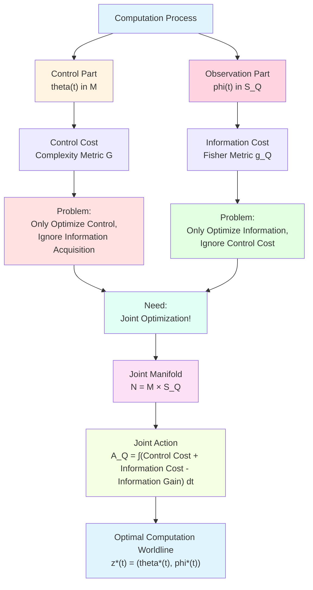
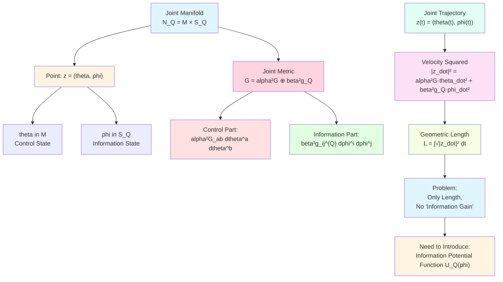
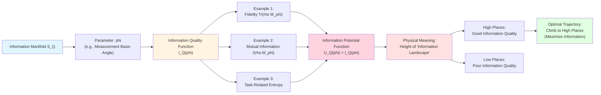
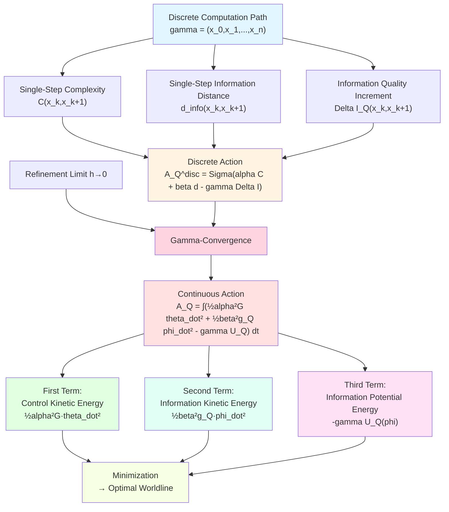
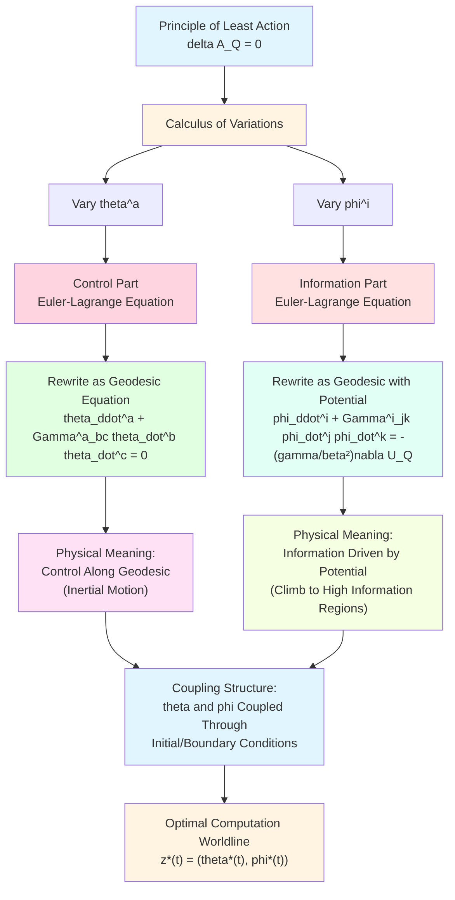
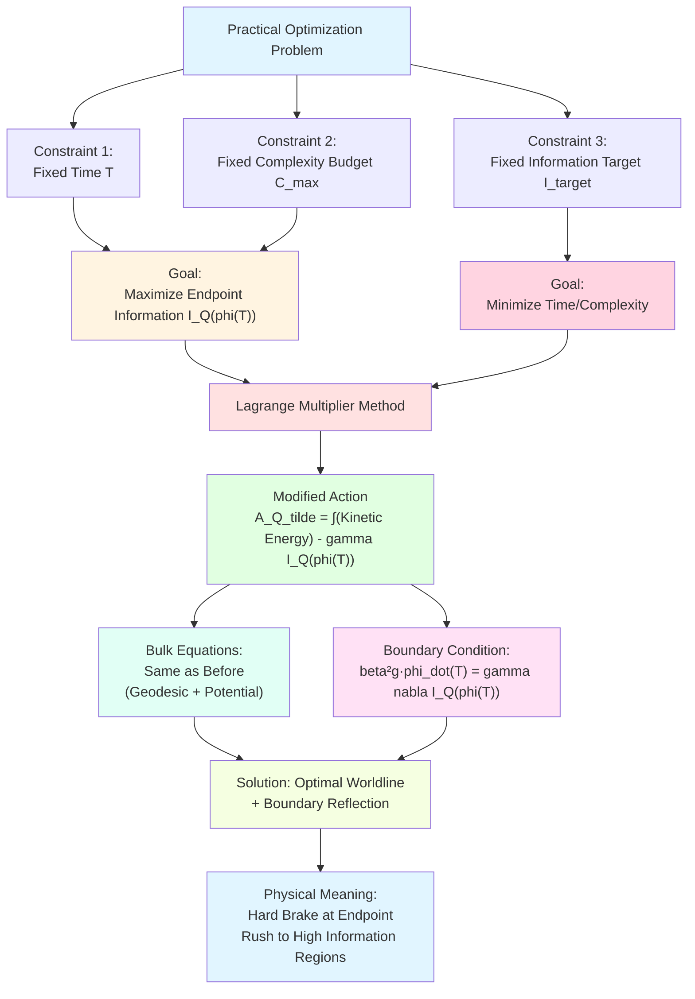
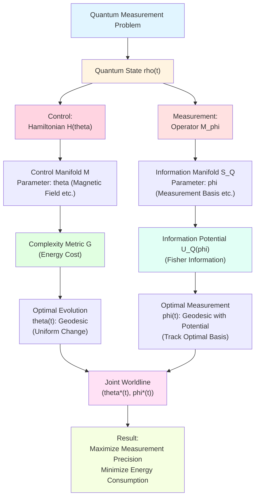
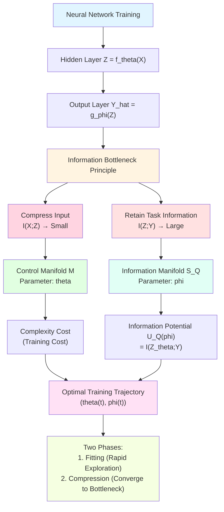
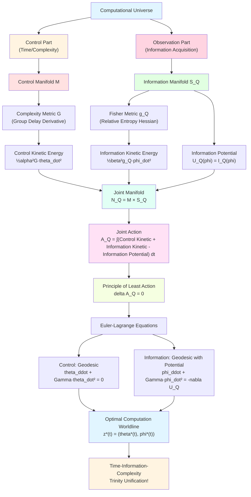

# 23.10 Joint Manifold and Time-Information-Complexity Action

In previous articles, we separately established two geometric structures:
- **Control Manifold $(\mathcal{M},G)$**: Describes "complexity cost" of computation (Articles 23.8-9);
- **Information Manifold $(\mathcal{S}_Q,g_Q)$**: Describes "information acquisition" of observation (Articles 23.6-7).

But real processes in computational universe **involve both simultaneously**:
- We need to **control** system evolution (spending time/energy);
- Simultaneously need to **observe** system state (acquiring information).

This raises a core question: **How to optimize joint strategy of control and observation under given resources, maximizing information acquisition?**

This article will construct **joint manifold** $\mathcal{N} = \mathcal{M}\times\mathcal{S}_Q$, define **time-information-complexity action** $\mathcal{A}_Q$ on it, and derive optimal computation trajectories (computation worldlines) through variational principle. This achieves complete unification of time, information, and complexity.

**Core Questions**:
- How to couple control manifold and information manifold into joint manifold?
- What is time-information-complexity action? Why is it "kinetic-potential" form?
- How do discrete computation paths converge to continuous computation worldlines?
- What dynamical equations do optimal computation worldlines satisfy?

This article is based on euler-gls-info/05-time-information-complexity-variational-principle.md.

---

## 1. Why Do We Need Joint Manifold? From Navigation to Optimal Strategy

### 1.1 Everyday Analogy: Dual Optimization of Driving Navigation

Imagine using navigation app to drive from home to airport:

**Question 1: Which Route?** (Control Optimization)
- Navigation plans a route, considering distance, time, congestion;
- This is finding shortest path on "map space" (control manifold);
- Cost is "travel time" (complexity cost).

**Question 2: How to Know Road Conditions?** (Information Acquisition)
- Navigation needs to continuously update road condition information (through GPS, sensors);
- This is moving on "information space" (information manifold);
- Cost is "data traffic/battery consumption" (information cost).

**Core Insight**: Optimal strategy needs to **simultaneously optimize** both problems:
- When choosing route, consider information quality (avoid information blind spots);
- When acquiring information, consider route constraints (cannot detour just to see road conditions).

This requires optimization on **joint space** (route × information), not separately!

### 1.2 Analogy in Computational Universe

In computational universe:

**Control Manifold $\mathcal{M}$**:
- Parameters are physical controls (e.g., quantum gate angles, circuit voltages);
- Metric $G_{ab}$ measures "computational cost" of control changes (time, energy);
- Geodesics are "fastest computation paths".

**Information Manifold $\mathcal{S}_Q$**:
- Parameters are observation strategies (e.g., measurement basis selection, sampling schemes);
- Metric $g_{ij}^{(Q)}$ measures "information distance" of observation changes (Fisher information);
- Geodesics are "paths with gentlest information changes".

**Computation Worldline**: Real computation process is a curve on joint space $\mathcal{M}\times\mathcal{S}_Q$:
$$
z(t) = \big(\theta(t),\phi(t)\big),
$$
where $\theta(t)$ is control parameter trajectory, $\phi(t)$ is observation parameter trajectory.

---

## 2. Construction of Joint Manifold: Product Space

**Source Theory**: euler-gls-info/05-time-information-complexity-variational-principle.md Section 3

### 2.1 Definition of Joint Manifold

**Definition 2.1** (Joint Time-Information-Complexity Manifold, from euler-gls-info/05-time-information-complexity-variational-principle.md Definition 3.1)

For given task $Q$, define **joint manifold**

$$
\mathcal{N}_Q = \mathcal{M} \times \mathcal{S}_Q.
$$

Its point $z = (\theta,\phi)$ simultaneously represents:
- **Control State** $\theta\in\mathcal{M}$ (e.g., quantum gate parameters);
- **Task Information State** $\phi\in\mathcal{S}_Q$ (e.g., measurement basis parameters).

**Everyday Interpretation**:
- $\mathcal{M}$ is space of "physical knobs" (how to control system evolution);
- $\mathcal{S}_Q$ is space of "measurement knobs" (how to choose observation);
- $\mathcal{N}_Q$ is space of "adjusting both sets of knobs simultaneously".

**Example**: Quantum Measurement
- Control parameter $\theta$: Parameters of Hamiltonian (e.g., magnetic field strength);
- Observation parameter $\phi$: Parameters of measurement operator (e.g., rotation angle of measurement basis);
- Joint state $(\theta,\phi)$: "Simultaneously set evolution and measurement".

### 2.2 Joint Metric: Weighted Product

**Definition 2.2** (Joint Metric, from euler-gls-info/05-time-information-complexity-variational-principle.md Section 3.2)

On joint manifold $\mathcal{N}_Q$, define **product-type metric**

$$
\mathbb{G} = \alpha^2 G \oplus \beta^2 g_Q,
$$

i.e., for tangent vector $v = (v^{\mathcal{M}},v^{\mathcal{S}_Q}) \in T_\theta\mathcal{M} \oplus T_\phi\mathcal{S}_Q$, define

$$
\mathbb{G}_z(v,v) = \alpha^2 G_\theta(v^{\mathcal{M}},v^{\mathcal{M}}) + \beta^2 g_{Q,\phi}(v^{\mathcal{S}_Q},v^{\mathcal{S}_Q}),
$$

where $\alpha,\beta>0$ are **coupling constants**, used to balance weights of control cost and information cost.

**Everyday Interpretation**:
- $\alpha$ is "weight of control": Larger $\alpha$, higher cost of control changes;
- $\beta$ is "weight of information": Larger $\beta$, higher cost of information changes;
- Joint metric $\mathbb{G}$ is metric of "total cost".

**Mathematical Structure**:
- This is standard **Riemann product metric**;
- In local coordinates: $\mathbb{G} = \mathrm{diag}(\alpha^2 G,\beta^2 g_Q)$ (block diagonal);
- **No coupling terms** between different blocks: Control and information are "orthogonal".

### 2.3 Velocity and Length of Joint Trajectory

Given a joint trajectory

$$
z(t) = \big(\theta(t),\phi(t)\big),\quad t\in[0,T],
$$

its instantaneous **velocity squared** is

$$
|\dot{z}(t)|_{\mathbb{G}}^2 = \alpha^2 G_{ab}(\theta(t))\dot{\theta}^a(t)\dot{\theta}^b(t) + \beta^2 g_{ij}(\phi(t))\dot{\phi}^i(t)\dot{\phi}^j(t).
$$

**Geometric length** of trajectory is

$$
L_{\mathbb{G}}[z] = \int_0^T \sqrt{|\dot{z}(t)|_{\mathbb{G}}^2}\,\mathrm{d}t.
$$

**Everyday Interpretation**:
- $|\dot{z}(t)|_{\mathbb{G}}^2$ is "square of joint velocity" (similar to $v_x^2+v_y^2$);
- Contains two contributions: control velocity $\alpha^2 G\dot{\theta}^2$ and information velocity $\beta^2 g_Q\dot{\phi}^2$;
- Geometric length $L_{\mathbb{G}}$ is "total distance" (time integral).

---

## 3. Information Potential Function: Quantifying Information Quality

**Source Theory**: euler-gls-info/05-time-information-complexity-variational-principle.md Section 3.3

### 3.1 Why Do We Need Potential Function?

Joint metric $\mathbb{G}$ alone is not enough!

**Problem**: Geodesics (shortest paths) on joint manifold only consider "minimum cost", don't consider "information quality".

**Everyday Analogy**:
- Imagine mountain climbing treasure hunting:
  - **Geometric Length**: Distance from foot to summit (cost);
  - **Treasure Location**: Summit has treasure, mountainside doesn't (gain);
  - **Optimal Path**: Not shortest path, but path balancing "cost and gain"!

In computational universe:
- **Control-Information Length**: Total resources spent on computation;
- **Information Quality**: Quality of information obtained at endpoint;
- **Optimal Worldline**: Trajectory with highest information quality under given resources.

Therefore, we need to introduce **information potential function** to encode "information quality".

### 3.2 Definition of Information Potential Function

**Definition 3.1** (Information Potential Function, from euler-gls-info/05-time-information-complexity-variational-principle.md Section 3.3)

Let information quality function of task $Q$ on information manifold be written as $I_Q:\mathcal{S}_Q\to\mathbb{R}$. Define **information potential function**

$$
U_Q(\phi) = I_Q(\phi),
$$

or more generally, $U_Q(\phi) = V(I_Q(\phi))$, where $V:\mathbb{R}\to\mathbb{R}$ is monotonic function.

**Physical Meaning**:
- $U_Q(\phi)$ measures "information quality at information state $\phi$";
- Larger $U_Q$, higher information quality;
- In action, $U_Q$ appears with **negative sign** (like potential energy), making high information quality reduce action.

**Everyday Interpretation**:
- Imagine $U_Q(\phi)$ is height of "information landscape":
  - High places: Good information quality (e.g., measurement basis highly correlated with task);
  - Low places: Poor information quality (e.g., measurement basis uncorrelated with task).
- Optimal trajectory will "climb to high places" (regions with good information quality).

### 3.3 Example: Information Potential of Quantum Measurement

Consider measurement of quantum state $\rho$ under different measurement bases $\{\hat{M}_\phi\}$:
- Information quality can be measured by **fidelity**: $I_Q(\phi) = \mathrm{Tr}(\rho \hat{M}_\phi)$;
- Or measured by **mutual information**: $I_Q(\phi) = I(\rho : M_\phi)$;
- Potential function $U_Q(\phi)$ reaches maximum near "optimal measurement basis".

**Physical Picture**:
- If choose measurement basis "orthogonal to state $\rho$", $U_Q(\phi)$ small (poor information quality);
- If choose measurement basis "aligned with state $\rho$", $U_Q(\phi)$ large (good information quality);
- Optimal strategy will dynamically adjust $\phi(t)$ to track maximum of $U_Q$.

---

## 4. Time-Information-Complexity Action

**Source Theory**: euler-gls-info/05-time-information-complexity-variational-principle.md Section 4

### 4.1 Definition of Continuous Action

**Definition 4.1** (Time-Information-Complexity Action, from euler-gls-info/05-time-information-complexity-variational-principle.md Definition 4.2)

For joint trajectory $z(t) = (\theta(t),\phi(t))$, define **continuous joint action**

$$
\mathcal{A}_Q[\theta(\cdot),\phi(\cdot)] = \int_0^T \Big(\tfrac{1}{2}\alpha^2 G_{ab}(\theta)\dot{\theta}^a\dot{\theta}^b + \tfrac{1}{2}\beta^2 g_{ij}(\phi)\dot{\phi}^i\dot{\phi}^j - \gamma U_Q(\phi)\Big)\,\mathrm{d}t,
$$

where:
- First term: $\tfrac{1}{2}\alpha^2 G_{ab}\dot{\theta}^a\dot{\theta}^b$ is **control kinetic energy**;
- Second term: $\tfrac{1}{2}\beta^2 g_{ij}\dot{\phi}^i\dot{\phi}^j$ is **information kinetic energy**;
- Third term: $-\gamma U_Q(\phi)$ is **information potential energy** (negative sign!);
- $\alpha,\beta,\gamma>0$ are coupling constants.

**Everyday Interpretation**:
- This is "kinetic-potential" form in classical mechanics:
  - $T = \tfrac{1}{2}m v^2$ (kinetic energy);
  - $V = U(x)$ (potential energy);
  - Action $S = \int (T - V)\,\mathrm{d}t$ (Hamilton action).
- In our framework:
  - "Kinetic energy" has two parts: control kinetic energy $+$ information kinetic energy;
  - "Potential energy" is information potential $-\gamma U_Q(\phi)$ (negative sign makes high information quality reduce action).

### 4.2 Why "Kinetic-Potential" Form?

**Principle**: This is standard form of **principle of least action**.

In classical mechanics, real motion trajectories make action $S = \int(T-V)\mathrm{d}t$ extremal (usually minimum). This derives Euler-Lagrange equations (i.e., Newton's second law).

In computational universe:
- **Kinetic Terms**: Penalize "rapid changes" (both control and information cannot change too fast);
- **Potential Term**: Reward "high information quality" (encourage trajectories to enter high $U_Q$ regions);
- **Minimum Trajectory**: Balances between "slow changes" and "high information quality".

**Physical Intuition**:
- Imagine a ball rolling in valley:
  - Kinetic energy drives it to roll along inertial direction;
  - Potential energy drives it to roll toward valley bottom;
  - Real trajectory is balance of both (geodesic + potential gradient).
- Computation worldline similar:
  - Control/information kinetic energy drives trajectory to "maintain current direction";
  - Information potential drives trajectory to "turn toward high information regions";
  - Optimal trajectory is balance of both.

### 4.3 Discrete Action: From Paths to Continuous

At discrete level, computation path is a sequence of states $\gamma = (x_0,x_1,\dots,x_n)$. Corresponding **discrete action** is

$$
\mathcal{A}_Q^{\mathrm{disc}}(\gamma) = \sum_{k=0}^{n-1}\Big(\alpha\,\mathsf{C}(x_k,x_{k+1}) + \beta\,d_{\mathrm{info},Q}(x_k,x_{k+1}) - \gamma\,\Delta I_Q(x_k,x_{k+1})\Big),
$$

where:
- $\mathsf{C}(x_k,x_{k+1})$ is complexity cost (single-step time);
- $d_{\mathrm{info},Q}(x_k,x_{k+1})$ is information distance (single-step information change);
- $\Delta I_Q(x_k,x_{k+1}) = I_Q(\phi_{k+1}) - I_Q(\phi_k)$ is information quality increment.

**Convergence Theorem 4.2** (Gamma-Convergence from Discrete to Continuous, from euler-gls-info/05-time-information-complexity-variational-principle.md Theorem 6.1)

Under appropriate regularity assumptions, when discrete step size $h\to 0$, discrete action $\mathcal{A}_Q^{\mathrm{disc}}$ converges to continuous action $\mathcal{A}_Q$ in $\Gamma$-convergence sense:

$$
\Gamma\text{-}\lim_{h\to 0} \mathcal{A}_Q^{(h)} = \mathcal{A}_Q.
$$

In particular, limit of discrete optimal paths is continuous optimal worldline.

**Everyday Interpretation**:
- Discrete paths are "step-by-step jumps";
- Continuous worldlines are "smooth curves";
- $\Gamma$-convergence guarantees: Discrete optimal paths become continuous optimal worldlines in limit!

---

## 5. Euler-Lagrange Equations: Dynamics of Optimal Worldlines

**Source Theory**: euler-gls-info/05-time-information-complexity-variational-principle.md Section 5

### 5.1 Variational Principle: Why Minimize Action?

**Principle of Least Action**: Real physical trajectories make action $S = \int L\,\mathrm{d}t$ extremal (usually minimum).

In our framework:
- **Lagrangian**: $L(\theta,\dot{\theta};\phi,\dot{\phi}) = \tfrac{1}{2}\alpha^2 G_{ab}\dot{\theta}^a\dot{\theta}^b + \tfrac{1}{2}\beta^2 g_{ij}\dot{\phi}^i\dot{\phi}^j - \gamma U_Q(\phi)$;
- **Action**: $\mathcal{A}_Q = \int_0^T L\,\mathrm{d}t$;
- **Minimum Trajectory**: Trajectory $(theta^*(t),\phi^*(t))$ satisfying $\delta\mathcal{A}_Q = 0$.

Varying $\theta^a$ and $\phi^i$ separately, get **Euler-Lagrange equations**.

### 5.2 Euler-Lagrange Equation for Control Part

Varying control variable $\theta^a$, Euler-Lagrange equation is

$$
\frac{\mathrm{d}}{\mathrm{d}t}\Big(\alpha^2 G_{ab}(\theta)\dot{\theta}^b\Big) - \tfrac{1}{2}\alpha^2 (\partial_a G_{bc})(\theta)\dot{\theta}^b\dot{\theta}^c = 0.
$$

**Rewrite as Geodesic Equation**:

Define Christoffel symbols

$$
\Gamma^a_{bc}(\theta) = \tfrac{1}{2}G^{ad}\big(\partial_b G_{dc} + \partial_c G_{db} - \partial_d G_{bc}\big),
$$

then Euler-Lagrange equation equivalent to

$$
\ddot{\theta}^a + \Gamma^a_{bc}(\theta)\dot{\theta}^b\dot{\theta}^c = 0.
$$

**Physical Meaning**:
- This is **geodesic equation** on control manifold $(\mathcal{M},G)$;
- Control trajectory $\theta(t)$ evolves along geodesic (inertial motion, no external force);
- Because control part in Lagrangian **has no potential term**!

### 5.3 Euler-Lagrange Equation for Information Part

Varying information variable $\phi^i$, Euler-Lagrange equation is

$$
\frac{\mathrm{d}}{\mathrm{d}t}\Big(\beta^2 g_{ij}(\phi)\dot{\phi}^j\Big) - \tfrac{1}{2}\beta^2 (\partial_i g_{jk})(\phi)\dot{\phi}^j\dot{\phi}^k + \gamma\,\partial_i U_Q(\phi) = 0.
$$

**Rewrite as Geodesic Equation with Potential**:

Define Christoffel symbols of information manifold $\Gamma^i_{jk}(\phi)$, and raise potential gradient:

$$
\ddot{\phi}^i + \Gamma^i_{jk}(\phi)\dot{\phi}^j\dot{\phi}^k = -\frac{\gamma}{\beta^2} g^{ij}(\phi)\partial_j U_Q(\phi).
$$

**Physical Meaning**:
- Left side: Geodesic acceleration on information manifold $(\mathcal{S}_Q,g_Q)$;
- Right side: Gradient of information potential $U_Q$ (covariantly raised), $-\tfrac{\gamma}{\beta^2}\nabla U_Q$;
- Information trajectory $\phi(t)$ **is not geodesic**, but "geodesic with potential driven by potential gradient"!

**Everyday Analogy**:
- Imagine rolling ball on hillside:
  - If no gravity (flat ground), ball rolls along straight line (geodesic);
  - If gravity (hillside), ball is "pulled toward valley" (potential gradient);
  - Real trajectory is superposition of both (geodesic with potential).
- Information trajectory similar:
  - Geodesic part: Moves along "information inertia";
  - Potential gradient part: "Pulled toward high information quality regions".

### 5.4 Coupling Structure of Joint System

**Summary**: Optimal computation worldline $(theta^*(t),\phi^*(t))$ satisfies coupled system:

$$
\begin{cases}
\ddot{\theta}^a + \Gamma^a_{bc}(\theta)\dot{\theta}^b\dot{\theta}^c = 0 & \text{(Control: Geodesic)}\\
\ddot{\phi}^i + \Gamma^i_{jk}(\phi)\dot{\phi}^j\dot{\phi}^k = -\tfrac{\gamma}{\beta^2} g^{ij}(\phi)\partial_j U_Q(\phi) & \text{(Information: Geodesic with Potential)}
\end{cases}
$$

**Core Insight**:
- Control and information **decoupled**: $\theta$ equation doesn't depend on $\phi$, $\phi$ equation doesn't depend on $\theta$;
- But coupled through **initial conditions and boundary conditions**: Both need simultaneous optimization;
- This is because we chose **product metric** $\mathbb{G} = \alpha^2 G \oplus \beta^2 g_Q$ (no cross terms).

---

## 6. Optimization Under Resource Constraints: Lagrange Multiplier Method

**Source Theory**: euler-gls-info/05-time-information-complexity-variational-principle.md Section 7

### 6.1 Practical Problem: Constrained Optimization

In practical applications, we usually face **constrained optimization problems**:

**Problem 1**: Given time budget $T$, maximize endpoint information quality $I_Q(\phi(T))$.

**Problem 2**: Given complexity budget $C_{\max}$, maximize endpoint information quality.

**Problem 3**: Given information quality target $I_{\mathrm{target}}$, minimize required time/complexity.

These are all **constrained variational problems**, can be converted to unconstrained problems using **Lagrange multiplier method**.

### 6.2 Example: Fixed Time, Maximize Endpoint Information

**Problem**:

$$
\max_{\theta(\cdot),\phi(\cdot)} I_Q(\phi(T)),\quad \text{subject to } \int_0^T\Big(\tfrac{1}{2}\alpha^2 G\dot{\theta}^2 + \tfrac{1}{2}\beta^2 g_Q\dot{\phi}^2\Big)\mathrm{d}t \le E_{\max}.
$$

**Convert to Unconstrained Problem**:

Introduce Lagrange multiplier $\lambda$, define modified action

$$
\widetilde{\mathcal{A}}_Q = \int_0^T\Big(\tfrac{1}{2}\alpha^2 G\dot{\theta}^2 + \tfrac{1}{2}\beta^2 g_Q\dot{\phi}^2\Big)\mathrm{d}t - \gamma I_Q(\phi(T)).
$$

Minimizing $\widetilde{\mathcal{A}}_Q$ equivalent to original constrained problem (when constraint saturated).

**Euler-Lagrange Equations**:

- Bulk equations (inside $t\in(0,T)$) same as before;
- **Boundary Condition** (at $t=T$):

$$
\beta^2 g_{ij}(\phi(T))\dot{\phi}^j(T) = \gamma\,\partial_i I_Q(\phi(T)).
$$

**Physical Meaning**:
- Boundary condition is "endpoint reflection condition": At endpoint, information velocity proportional to information quality gradient;
- $\gamma/\beta^2$ controls "preference strength for endpoint information quality";
- If $\gamma$ large, trajectory will "brake hard" at endpoint, rush toward high information regions.

### 6.3 Everyday Analogy: Optimal Braking Strategy

Imagine driving to destination:
- **Constraint**: Total energy limited (fuel tank capacity);
- **Goal**: Speed as low as possible when arriving (safe parking);
- **Optimal Strategy**:
  - Most time constant speed (save energy);
  - Near endpoint brake hard (speed drops to zero).

In computational universe:
- **Constraint**: Total computation energy limited;
- **Goal**: Endpoint information quality as high as possible;
- **Optimal Strategy**:
  - Most time evolve along geodesic (save energy);
  - Near endpoint "rush toward high information regions" (boundary condition).

---

## 7. Physical Example: Optimal Strategy for Quantum Measurement

### 7.1 Problem Setting: Adaptive Quantum Measurement

Consider a quantum system:
- **Initial State**: $\rho_0$ (known);
- **Evolution**: Hamiltonian $H(\theta)$, parameter $\theta$ controllable;
- **Measurement**: At time $t$ choose measurement operator $M_\phi$, parameter $\phi$ adjustable;
- **Task**: Maximize measurement precision of some physical quantity $A$.

**Control Manifold** $\mathcal{M}$: Parameter space of Hamiltonian (e.g., magnetic field strength, coupling constants);

**Information Manifold** $\mathcal{S}_Q$: Parameter space of measurement operators (e.g., rotation angle of measurement basis);

**Information Potential** $U_Q(\phi)$: Fisher information of measurement operator $M_\phi$ for physical quantity $A$:

$$
U_Q(\phi) = \mathrm{Tr}\left[\rho(t) \big(\partial_A M_\phi\big)^2\right].
$$

### 7.2 Optimal Strategy

According to Euler-Lagrange equations:

**Control Evolution** $\theta(t)$:
- Evolves along geodesic of control manifold (most energy-efficient Hamiltonian modulation);
- Example: Magnetic field strength changes uniformly (avoid sudden changes, save energy).

**Measurement Strategy** $\phi(t)$:
- Driven by information potential $U_Q(\phi)$;
- Dynamically tracks "optimal measurement basis" (maximizes Fisher information);
- Example: Measurement basis rotates with evolution of quantum state, keeping "aligned" with state.

**Boundary Condition**:
- At endpoint time $t=T$, measurement strategy $\phi(T)$ satisfies:

$$
\dot{\phi}(T) \propto \nabla_\phi U_Q(\phi(T)),
$$

i.e., "at endpoint, direction of measurement basis change points toward direction of maximum Fisher information growth".

### 7.3 Numerical Example (Illustrative)

Assume:
- Single qubit system, $\rho_0 = |0\rangle\langle 0|$;
- Control parameter $\theta$: Magnetic field strength;
- Measurement parameter $\phi$: Rotation angle of measurement basis;
- Goal: Measure expectation value of $\sigma_x$.

**Optimal Worldline**:
- $\theta(t)$: Linearly increase magnetic field (geodesic);
- $\phi(t)$: Rotate from $0^\circ$ to $90^\circ$ (track optimal measurement basis);
- Endpoint: $\phi(T) = 90^\circ$, aligned with $\sigma_x$ eigenbasis (maximum Fisher information).

---

## 8. Physical Example: Information Bottleneck of Neural Networks

### 8.1 Problem Setting: Information Compression in Training

Consider a neural network:
- **Input**: $X$ (e.g., images);
- **Hidden Layer**: $Z = f_\theta(X)$, parameter $\theta$ trainable;
- **Output**: $\hat{Y} = g_\phi(Z)$, parameter $\phi$ adjustable;
- **Task**: Predict label $Y$.

**Information Bottleneck Principle** (Tishby et al.): Optimal representation $Z$ should:
1. **Compress Input**: $I(X;Z)$ as small as possible (remove redundant information);
2. **Retain Task-Relevant Information**: $I(Z;Y)$ as large as possible (retain predictive ability).

This can be described using joint action framework!

### 8.2 Interpretation of Joint Manifold

**Control Manifold** $\mathcal{M}$: Space of hidden layer parameters $\theta$;

**Information Manifold** $\mathcal{S}_Q$: Space of output layer parameters $\phi$;

**Information Potential** $U_Q(\phi)$: Mutual information $I(Z;Y)$ (task-relevant information);

**Action**:

$$
\mathcal{A}_Q = \int_0^T\Big(\tfrac{1}{2}\alpha^2\|\dot{\theta}\|^2 + \tfrac{1}{2}\beta^2\|\dot{\phi}\|^2 - \gamma I(Z_\theta;Y)\Big)\mathrm{d}t.
$$

### 8.3 Optimal Training Strategy

According to Euler-Lagrange equations:

**Hidden Layer Parameters** $\theta(t)$:
- Evolve along geodesic of complexity manifold (geometrization of standard gradient descent);
- Avoid violent oscillations (smooth training trajectory).

**Output Layer Parameters** $\phi(t)$:
- Driven by mutual information potential $I(Z;Y)$;
- Dynamically adjust output weights, maximize task-relevant information;
- Balance between "compression" ($I(X;Z)$ small) and "retention" ($I(Z;Y)$ large).

**Physical Interpretation**:
- Early training: $\phi$ changes rapidly, explores information space;
- Late training: $\phi$ converges to high $I(Z;Y)$ regions, stops changing (information bottleneck).

This is consistent with "fitting-compression" two-phase phenomenon observed in deep learning!

---

## 9. Complete Picture: Trinity Unification

### 9.1 Theoretical Structure Summary

### 9.2 Core Formula Quick Reference

| Concept | Formula | Physical Meaning |
|---------|---------|-----------------|
| Joint Manifold | $\mathcal{N}_Q = \mathcal{M}\times\mathcal{S}_Q$ | Control × Information Direct Product |
| Joint Metric | $\mathbb{G} = \alpha^2 G \oplus \beta^2 g_Q$ | Total Cost Metric |
| Information Potential | $U_Q(\phi) = I_Q(\phi)$ | Information Quality |
| Joint Action | $\mathcal{A}_Q = \int\big(\tfrac{1}{2}\alpha^2 G\dot{\theta}^2 + \tfrac{1}{2}\beta^2 g_Q\dot{\phi}^2 - \gamma U_Q\big)\mathrm{d}t$ | Kinetic-Potential |
| Control Equation | $\ddot{\theta}^a + \Gamma^a_{bc}\dot{\theta}^b\dot{\theta}^c = 0$ | Geodesic |
| Information Equation | $\ddot{\phi}^i + \Gamma^i_{jk}\dot{\phi}^j\dot{\phi}^k = -\tfrac{\gamma}{\beta^2}\nabla U_Q$ | Geodesic with Potential |
| $\Gamma$-Convergence | $\Gamma\text{-}\lim_{h\to 0}\mathcal{A}_Q^{(h)} = \mathcal{A}_Q$ | Discrete → Continuous |

---

## 10. Summary

This article established complete unification of time-information-complexity:

### 10.1 Core Concepts

1. **Joint Manifold $\mathcal{N}_Q = \mathcal{M}\times\mathcal{S}_Q$**: Direct product space of control and information
   - $\mathcal{M}$: Control manifold (physical evolution);
   - $\mathcal{S}_Q$: Information manifold (observation strategy).

2. **Joint Metric $\mathbb{G} = \alpha^2 G \oplus \beta^2 g_Q$**: Weighted product metric
   - $\alpha$: Control weight;
   - $\beta$: Information weight.

3. **Information Potential Function $U_Q(\phi)$**: Quantifies information quality
   - High places: Good information quality;
   - Low places: Poor information quality.

4. **Joint Action** $\mathcal{A}_Q = \int\big(\text{control kinetic}+\text{information kinetic}-\text{information potential}\big)\mathrm{d}t$
   - Standard "kinetic-potential" form;
   - Minimum trajectory is optimal computation worldline.

5. **Euler-Lagrange Equations**:
   - Control: Evolves along geodesic (inertial);
   - Information: Geodesic with potential driven by potential (climbs to high information regions).

6. **$\Gamma$-Convergence**: Discrete paths → Continuous worldlines
   - Guarantees discrete optimal algorithms converge to continuous optimal trajectories.

### 10.2 Core Insights

- **Unification**: Time (control), information (observation), complexity (cost) unified under single variational principle;
- **Geometrization**: Optimal algorithms = minimum curves on joint manifold;
- **Physical Analogy**: Completely similar to classical mechanics (kinetic + potential → least action);
- **Discrete-Continuous Consistency**: $\Gamma$-convergence guarantees theoretical rigor;
- **Practicality**: Applicable to quantum measurement, neural networks, optimal control, and many other fields.

### 10.3 Everyday Analogy Review

- **Navigation App**: Simultaneously optimize route (control) and road condition information (observation);
- **Mountain Climbing Treasure Hunting**: Distance (cost) vs treasure location (gain);
- **Quantum Measurement**: Evolution (control) vs measurement basis (information);
- **Neural Network Training**: Parameter updates (control) vs information bottleneck (information);
- **Driving Braking**: Constant speed + hard brake at endpoint (boundary condition).

### 10.4 Connections with Previous and Subsequent Chapters

**Connection with Articles 23.1-9**:
- Articles 23.3-5: Discrete complexity geometry → control manifold $(\mathcal{M},G)$;
- Articles 23.6-7: Discrete information geometry → information manifold $(\mathcal{S}_Q,g_Q)$;
- Articles 23.8-9: Unified time scale, Gromov-Hausdorff convergence;
- This Article: Couple two manifolds into joint manifold, construct variational principle.

**Preview of Article 23.11**:
Next article will deeply study **solutions of Euler-Lagrange equations**:
- Conservation laws (energy conservation, momentum conservation, information conservation);
- Symmetries and Noether theorem;
- Hamilton form (phase space, symplectic geometry);
- Causal structure of computation worldlines;
- Connection with physical universe (QCA, quantum entanglement).

---

**Preview of Next Article**: 23.11 Euler-Lagrange Equations and Computation Worldlines

In next article, we will:
1. **Derive Conservation Laws**: Energy conservation, information conservation, momentum conservation;
2. **Noether Theorem**: Profound connection between symmetries ↔ conservation laws;
3. **Hamilton Form**: Lagrangian → Hamiltonian, phase space description;
4. **Symplectic Geometry**: Symplectic structure of computation worldlines;
5. **Causal Structure**: Causal cones, light cone analogy of worldlines;
6. **Bridge to Physical Universe**: Computation worldlines ↔ QCA worldlines;
7. **Physical Examples**: Quantum adiabatic evolution, optimal control, quantum annealing.

