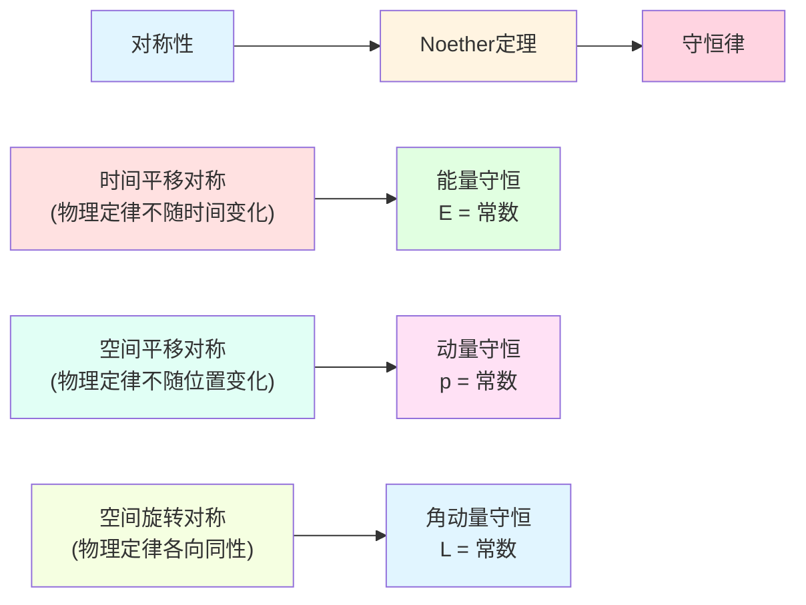
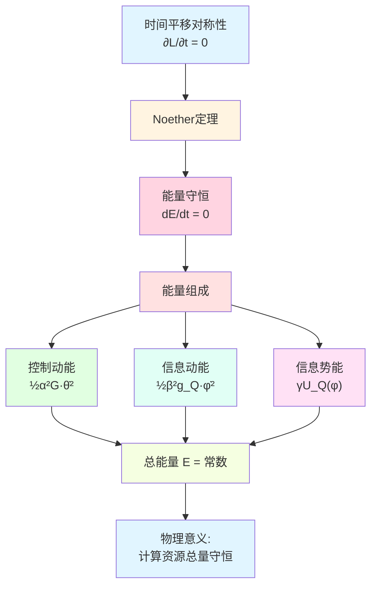
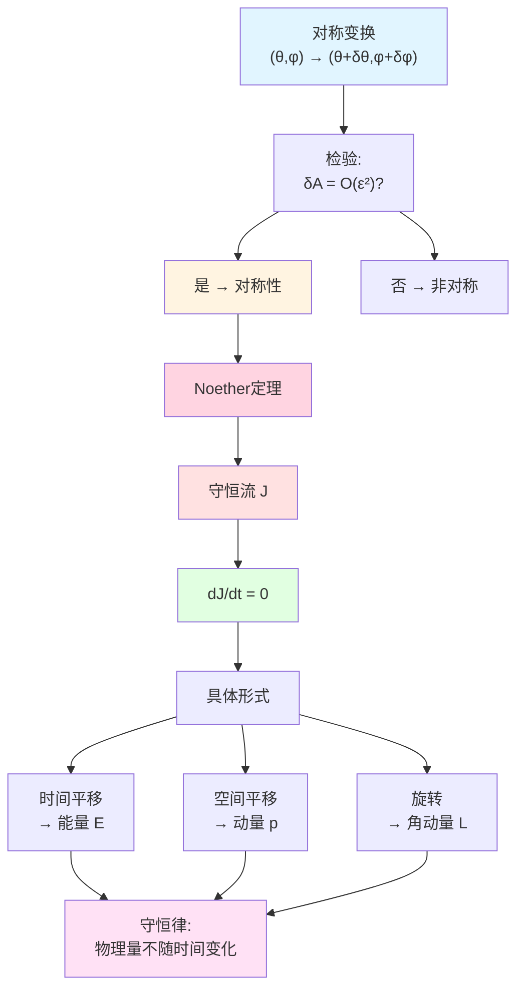
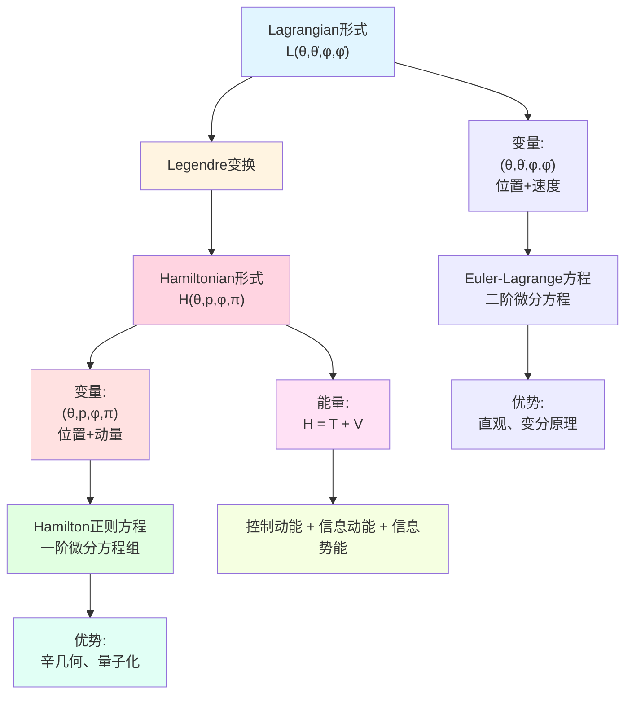
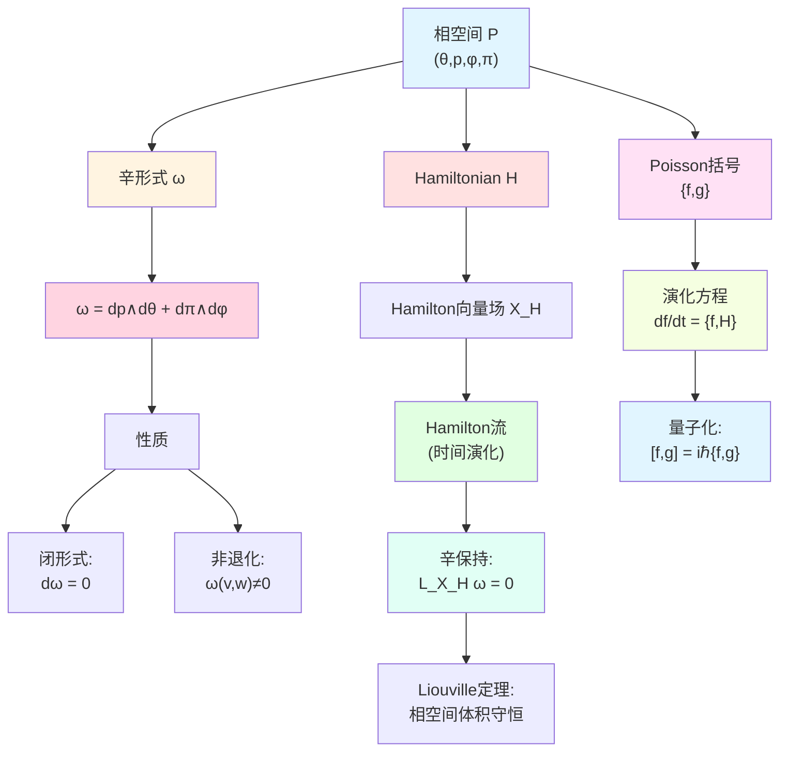
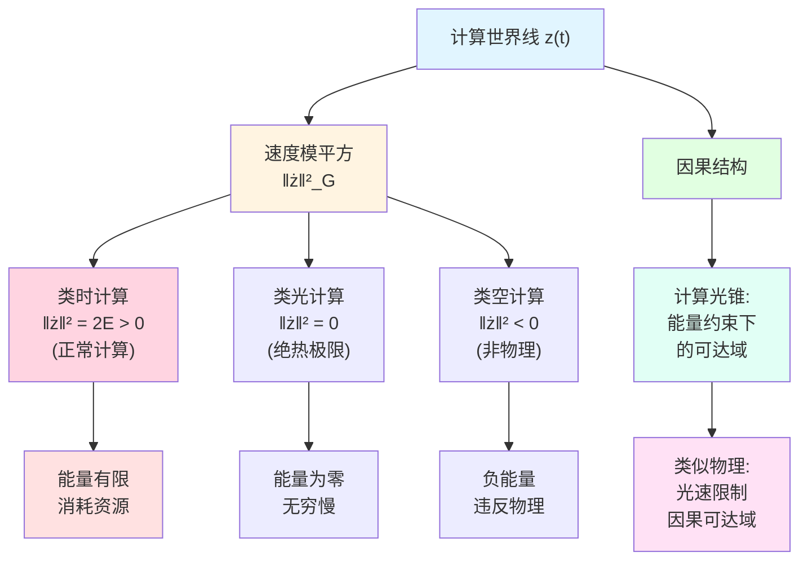
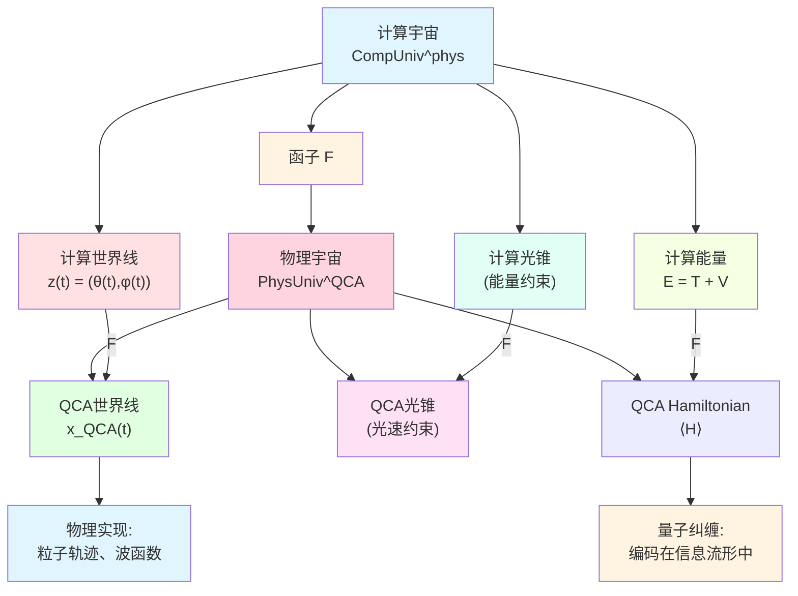
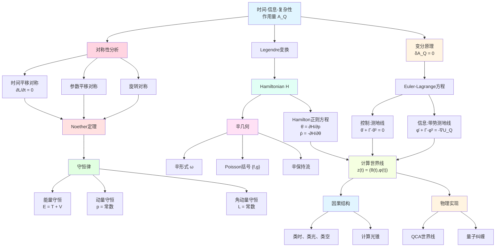

# 23.11 Euler-Lagrange方程与计算世界线

在上一篇中,我们构造了时间-信息-复杂性作用量 $\mathcal{A}_Q$,并导出了Euler-Lagrange方程:
- **控制**:$\ddot{\theta}^a + \Gamma^a_{bc}\dot{\theta}^b\dot{\theta}^c = 0$(测地线);
- **信息**:$\ddot{\phi}^i + \Gamma^i_{jk}\dot{\phi}^j\dot{\phi}^k = -\tfrac{\gamma}{\beta^2}\nabla U_Q$(带势测地线)。

这些方程描述了最优计算世界线的**动力学**。但就像经典力学一样,仅有运动方程还不够,我们还需要理解:
- **守恒律**:什么量在演化中保持不变?
- **对称性**:守恒律来自哪些对称性?(Noether定理)
- **Hamilton形式**:如何从Lagrangian转到Hamiltonian?(相空间描述)
- **因果结构**:计算世界线有"光锥"吗?

本篇将深入探讨这些问题,揭示计算世界线的深层结构。

**核心问题**:
- 时间-信息-复杂性作用量有哪些守恒律?
- Noether定理如何联系对称性与守恒律?
- Hamilton形式下的计算世界线是什么样的?
- 计算世界线的因果结构与物理时空的关系?

本文基于 euler-gls-info/05-time-information-complexity-variational-principle.md 以及经典力学的Hamilton-Jacobi理论。

---

## 1. 从Newton定律到守恒律:日常类比

### 1.1 日常守恒律:钱包里的钱

想象你每天记账:
- **收入**:工资、奖金(能量输入);
- **支出**:买菜、房租(能量输出);
- **余额**:钱包里剩余的钱(总能量)。

**守恒律**:如果没有收入和支出(孤立系统),余额不变!

$$
\text{余额}(t) = \text{常数}.
$$

这是**能量守恒**的日常版本。

### 1.2 物理守恒律的来源

在经典力学中,守恒律有深刻的来源:**对称性**。

**Noether定理**(1915年,Emmy Noether):
> 每一个连续对称性都对应一个守恒律。

**例子**:
- **时间平移对称**(今天的物理定律=明天的物理定律)→**能量守恒**;
- **空间平移对称**(这里的物理定律=那里的物理定律)→**动量守恒**;
- **空间旋转对称**(向左转=向右转)→**角动量守恒**。

### 1.3 计算世界线的守恒律

在计算宇宙中,我们也有作用量 $\mathcal{A}_Q$ 和Euler-Lagrange方程。自然的问题:
- 作用量 $\mathcal{A}_Q$ 有哪些对称性?
- 这些对称性对应哪些守恒律?

**核心洞察**:
- **控制-信息能量**:在特定条件下守恒;
- **信息质量**:在某些演化下守恒;
- **复杂性动量**:在空间均匀系统中守恒。

---

## 2. 能量守恒:时间平移对称性

**源理论**:基于 euler-gls-info/05-time-information-complexity-variational-principle.md 第5节及经典力学理论

### 2.1 Lagrangian的时间平移不变性

回顾联合作用量的Lagrangian:

$$
L(\theta,\dot{\theta};\phi,\dot{\phi}) = \tfrac{1}{2}\alpha^2 G_{ab}(\theta)\dot{\theta}^a\dot{\theta}^b + \tfrac{1}{2}\beta^2 g_{ij}(\phi)\dot{\phi}^i\dot{\phi}^j - \gamma U_Q(\phi).
$$

**关键观察**:$L$ **不显含时间** $t$!

$$
\frac{\partial L}{\partial t} = 0.
$$

这意味着:**Lagrangian在时间平移下不变**。

**日常解读**:
- 今天计算的代价=明天计算的代价;
- 物理定律不随时间变化(假设没有外部干扰)。

### 2.2 能量守恒定律

**定理 2.1**(能量守恒)

如果Lagrangian $L$ 不显含时间 $t$,则存在守恒量(能量):

$$
E = \sum_a \frac{\partial L}{\partial\dot{\theta}^a}\dot{\theta}^a + \sum_i \frac{\partial L}{\partial\dot{\phi}^i}\dot{\phi}^i - L,
$$

即

$$
\frac{\mathrm{d}E}{\mathrm{d}t} = 0.
$$

**计算**:

对我们的Lagrangian:

$$
\frac{\partial L}{\partial\dot{\theta}^a} = \alpha^2 G_{ab}\dot{\theta}^b,\quad \frac{\partial L}{\partial\dot{\phi}^i} = \beta^2 g_{ij}\dot{\phi}^j.
$$

因此能量为

$$
E = \alpha^2 G_{ab}\dot{\theta}^a\dot{\theta}^b + \beta^2 g_{ij}\dot{\phi}^i\dot{\phi}^j - L.
$$

代入 $L$ 的表达式:

$$
E = \alpha^2 G_{ab}\dot{\theta}^a\dot{\theta}^b + \beta^2 g_{ij}\dot{\phi}^i\dot{\phi}^j - \Big(\tfrac{1}{2}\alpha^2 G\dot{\theta}^2 + \tfrac{1}{2}\beta^2 g_Q\dot{\phi}^2 - \gamma U_Q\Big),
$$

$$
E = \tfrac{1}{2}\alpha^2 G_{ab}\dot{\theta}^a\dot{\theta}^b + \tfrac{1}{2}\beta^2 g_{ij}\dot{\phi}^i\dot{\phi}^j + \gamma U_Q(\phi).
$$

**物理意义**:

$$
E = \underbrace{\tfrac{1}{2}\alpha^2 G\dot{\theta}^2}_{\text{控制动能}} + \underbrace{\tfrac{1}{2}\beta^2 g_Q\dot{\phi}^2}_{\text{信息动能}} + \underbrace{\gamma U_Q(\phi)}_{\text{信息势能}}.
$$

**日常解读**:
- 能量 = 动能 + 势能;
- 控制动能:控制变化的代价;
- 信息动能:信息变化的代价;
- 信息势能:当前信息质量。

**守恒条件**:沿Euler-Lagrange方程的解,$E$ 保持不变!

### 2.3 能量守恒的应用:速度约束

能量守恒给出了速度的约束。如果初始能量为 $E_0$,则任何时刻:

$$
\tfrac{1}{2}\alpha^2 G\dot{\theta}^2 + \tfrac{1}{2}\beta^2 g_Q\dot{\phi}^2 = E_0 - \gamma U_Q(\phi).
$$

**物理解释**:
- 如果信息势 $U_Q(\phi)$ 增大(进入高信息区),动能必须减小(速度降低);
- 如果 $U_Q(\phi)$ 减小(信息质量下降),动能增大(速度加快);
- 这类似于"爬山":爬得越高,速度越慢。

**例子**:如果 $\phi$ 固定(不优化信息),则

$$
\tfrac{1}{2}\alpha^2 G\dot{\theta}^2 = \text{常数},
$$

即控制速度恒定(匀速运动)。

---

## 3. Noether定理的一般形式

**源理论**:基于经典变分原理,结合euler-gls-info/05-time-information-complexity-variational-principle.md

### 3.1 连续对称性的定义

**定义 3.1**(连续对称性)

设作用量为 $\mathcal{A} = \int_0^T L(\theta,\dot{\theta};\phi,\dot{\phi};t)\,\mathrm{d}t$。如果存在单参数变换

$$
\theta^a \to \theta^a + \epsilon\,\delta\theta^a,\quad \phi^i \to \phi^i + \epsilon\,\delta\phi^i,
$$

使得在 $\epsilon\to 0$ 时,作用量的变化为

$$
\delta\mathcal{A} = O(\epsilon^2),
$$

则称该变换为**对称变换**。

**例子**:
- **时间平移**:$t\to t+\epsilon$,$L$ 不显含 $t$;
- **参数平移**:$\theta^a \to \theta^a + \epsilon\,c^a$(常数),$L$ 对 $\theta^a$ 周期;
- **旋转**:在某个子空间中旋转参数,$L$ 旋转不变。

### 3.2 Noether定理

**定理 3.2**(Noether定理,1915)

对每一个连续对称性变换 $(\delta\theta^a,\delta\phi^i)$,存在守恒流:

$$
J = \sum_a \frac{\partial L}{\partial\dot{\theta}^a}\delta\theta^a + \sum_i \frac{\partial L}{\partial\dot{\phi}^i}\delta\phi^i - L\,\delta t,
$$

满足

$$
\frac{\mathrm{d}J}{\mathrm{d}t} = 0.
$$

**应用**:

1. **时间平移** $\delta t = \epsilon$,$\delta\theta = \delta\phi = 0$:
   $$J = -L \Rightarrow E = -L + \sum_a p_a\dot{\theta}^a + \sum_i \pi_i\dot{\phi}^i.$$
   (能量守恒)

2. **参数平移** $\delta\theta^a = \epsilon\,c^a$:
   $$J = \sum_a \frac{\partial L}{\partial\dot{\theta}^a}c^a.$$
   (动量守恒)

3. **信息流形旋转** $\delta\phi^i = \epsilon\,R^i_j\phi^j$:
   $$J = \sum_i \frac{\partial L}{\partial\dot{\phi}^i}R^i_j\phi^j.$$
   (信息角动量守恒)

---

## 4. Hamilton形式:从Lagrangian到Hamiltonian

**源理论**:基于经典力学Hamilton理论,结合euler-gls-info/05-time-information-complexity-variational-principle.md

### 4.1 为什么需要Hamilton形式?

Lagrangian形式使用 $(\theta,\dot{\theta},\phi,\dot{\phi})$ 作为变量(位置+速度)。

Hamilton形式使用 $(\theta,p_\theta,\phi,p_\phi)$ 作为变量(位置+动量)。

**优势**:
- **相空间描述**:将 $2n$ 维配置空间提升为 $4n$ 维相空间;
- **辛几何结构**:Hamilton方程具有优美的辛对称性;
- **量子化**:Hamilton形式是量子力学的起点(算符代替经典变量)。

### 4.2 Legendre变换:从速度到动量

**定义 4.1**(共轭动量)

定义**控制共轭动量**:

$$
p_a = \frac{\partial L}{\partial\dot{\theta}^a} = \alpha^2 G_{ab}(\theta)\dot{\theta}^b.
$$

定义**信息共轭动量**:

$$
\pi_i = \frac{\partial L}{\partial\dot{\phi}^i} = \beta^2 g_{ij}(\phi)\dot{\phi}^j.
$$

**物理意义**:
- $p_a$ 是"控制动量",衡量控制速度乘以"质量"(度量);
- $\pi_i$ 是"信息动量",衡量信息速度乘以"质量"(Fisher度量)。

**反解速度**:

$$
\dot{\theta}^a = \frac{1}{\alpha^2}G^{ab}p_b,\quad \dot{\phi}^i = \frac{1}{\beta^2}g^{ij}\pi_j.
$$

### 4.3 Hamiltonian的定义

**定义 4.2**(Hamiltonian)

通过Legendre变换定义Hamiltonian:

$$
H(\theta,p_\theta;\phi,p_\phi) = \sum_a p_a\dot{\theta}^a + \sum_i \pi_i\dot{\phi}^i - L.
$$

代入:

$$
H = p_a\dot{\theta}^a + \pi_i\dot{\phi}^i - \Big(\tfrac{1}{2}\alpha^2 G_{ab}\dot{\theta}^a\dot{\theta}^b + \tfrac{1}{2}\beta^2 g_{ij}\dot{\phi}^i\dot{\phi}^j - \gamma U_Q\Big).
$$

利用 $p_a = \alpha^2 G_{ab}\dot{\theta}^b$:

$$
p_a\dot{\theta}^a = \alpha^2 G_{ab}\dot{\theta}^b\dot{\theta}^a = \alpha^2 G\dot{\theta}^2,
$$

类似地 $\pi_i\dot{\phi}^i = \beta^2 g_Q\dot{\phi}^2$。因此:

$$
H = \alpha^2 G\dot{\theta}^2 + \beta^2 g_Q\dot{\phi}^2 - \tfrac{1}{2}\alpha^2 G\dot{\theta}^2 - \tfrac{1}{2}\beta^2 g_Q\dot{\phi}^2 + \gamma U_Q,
$$

$$
H = \tfrac{1}{2}\alpha^2 G\dot{\theta}^2 + \tfrac{1}{2}\beta^2 g_Q\dot{\phi}^2 + \gamma U_Q.
$$

用动量表示:

$$
H = \frac{1}{2\alpha^2}G^{ab}p_a p_b + \frac{1}{2\beta^2}g^{ij}\pi_i\pi_j + \gamma U_Q(\phi).
$$

**物理意义**:$H$ 就是**能量** $E$!

$$
H = \underbrace{\frac{1}{2\alpha^2}G^{ab}p_a p_b}_{\text{控制动能}} + \underbrace{\frac{1}{2\beta^2}g^{ij}\pi_i\pi_j}_{\text{信息动能}} + \underbrace{\gamma U_Q(\phi)}_{\text{信息势能}}.
$$

### 4.4 Hamilton正则方程

**定理 4.3**(Hamilton正则方程)

Euler-Lagrange方程等价于Hamilton正则方程组:

$$
\begin{cases}
\dot{\theta}^a = \dfrac{\partial H}{\partial p_a} = \dfrac{1}{\alpha^2}G^{ab}p_b\\[10pt]
\dot{p}_a = -\dfrac{\partial H}{\partial\theta^a} = -\dfrac{1}{2\alpha^2}(\partial_a G^{bc})p_b p_c\\[10pt]
\dot{\phi}^i = \dfrac{\partial H}{\partial\pi_i} = \dfrac{1}{\beta^2}g^{ij}\pi_j\\[10pt]
\dot{\pi}_i = -\dfrac{\partial H}{\partial\phi^i} = -\dfrac{1}{2\beta^2}(\partial_i g^{jk})\pi_j\pi_k - \gamma\partial_i U_Q
\end{cases}
$$

**日常解读**:
- 第1、3式:动量决定速度(速度是动量的函数);
- 第2、4式:势能和度量的梯度驱动动量变化。

---

## 5. 辛几何:相空间的几何结构

**源理论**:基于经典辛几何理论

### 5.1 相空间与辛形式

**定义 5.1**(相空间)

相空间是所有可能的 $(\theta,p,\phi,\pi)$ 组成的空间:

$$
\mathcal{P} = T^*\mathcal{M} \times T^*\mathcal{S}_Q,
$$

其中 $T^*\mathcal{M}$ 是控制流形的余切丛,$T^*\mathcal{S}_Q$ 是信息流形的余切丛。

**辛形式**:在相空间上定义辛2-形式:

$$
\omega = \sum_a \mathrm{d}p_a \wedge \mathrm{d}\theta^a + \sum_i \mathrm{d}\pi_i \wedge \mathrm{d}\phi^i.
$$

**性质**:
- $\omega$ 是闭形式:$\mathrm{d}\omega = 0$;
- $\omega$ 是非退化的:对任意非零向量 $v$,存在 $w$ 使得 $\omega(v,w)\neq 0$。

**物理意义**:辛形式编码了正则变量 $(\theta,p)$ 和 $(\phi,\pi)$ 之间的"共轭关系"。

### 5.2 Hamilton流与辛保持

**定义 5.2**(Hamilton向量场)

Hamiltonian $H$ 诱导一个向量场 $X_H$,满足:

$$
\omega(X_H,\cdot) = \mathrm{d}H.
$$

在坐标下:

$$
X_H = \frac{\partial H}{\partial p_a}\frac{\partial}{\partial\theta^a} - \frac{\partial H}{\partial\theta^a}\frac{\partial}{\partial p_a} + \frac{\partial H}{\partial\pi_i}\frac{\partial}{\partial\phi^i} - \frac{\partial H}{\partial\phi^i}\frac{\partial}{\partial\pi_i}.
$$

**定理 5.3**(Hamilton流保持辛形式)

Hamilton流(沿 $X_H$ 的积分曲线)保持辛形式不变:

$$
\mathcal{L}_{X_H}\omega = 0,
$$

其中 $\mathcal{L}$ 是Lie导数。

**物理意义**:Hamilton演化保持相空间的"体积"(Liouville定理的推广)。

### 5.3 Poisson括号

**定义 5.4**(Poisson括号)

对任意两个相空间函数 $f,g$,定义Poisson括号:

$$
\{f,g\} = \sum_a \Big(\frac{\partial f}{\partial\theta^a}\frac{\partial g}{\partial p_a} - \frac{\partial f}{\partial p_a}\frac{\partial g}{\partial\theta^a}\Big) + \sum_i \Big(\frac{\partial f}{\partial\phi^i}\frac{\partial g}{\partial\pi_i} - \frac{\partial f}{\partial\pi_i}\frac{\partial g}{\partial\phi^i}\Big).
$$

**性质**:
- 反对称:$\{f,g\} = -\{g,f\}$;
- Jacobi恒等式:$\{\{f,g\},h\} + \{\{g,h\},f\} + \{\{h,f\},g\} = 0$;
- Leibniz法则:$\{f,gh\} = g\{f,h\} + \{f,g\}h$。

**演化方程**:任意物理量 $f(\theta,p,\phi,\pi)$ 的时间演化为:

$$
\frac{\mathrm{d}f}{\mathrm{d}t} = \{f,H\}.
$$

特别地,Hamilton方程可写为:

$$
\dot{\theta}^a = \{\theta^a,H\},\quad \dot{p}_a = \{p_a,H\},\quad \dot{\phi}^i = \{\phi^i,H\},\quad \dot{\pi}_i = \{\pi_i,H\}.
$$

---

## 6. 计算世界线的因果结构

**源理论**:基于euler-gls-info/05-time-information-complexity-variational-principle.md及GLS因果理论

### 6.1 类光、类时、类空世界线

在相对论中,世界线根据四维速度的模分为:
- **类时**:$\|\dot{x}\|^2 < 0$(实物粒子);
- **类光**:$\|\dot{x}\|^2 = 0$(光子);
- **类空**:$\|\dot{x}\|^2 > 0$(不可达,超光速)。

在计算宇宙中,我们有联合度量 $\mathbb{G} = \alpha^2 G \oplus \beta^2 g_Q$。定义世界线的"速度模平方":

$$
\|\dot{z}\|_{\mathbb{G}}^2 = \alpha^2 G_{ab}\dot{\theta}^a\dot{\theta}^b + \beta^2 g_{ij}\dot{\phi}^i\dot{\phi}^j.
$$

类比地,我们可以定义:

**定义 6.1**(计算世界线的因果类型)

- **类时计算**:$\|\dot{z}\|_{\mathbb{G}}^2 = 2E$(能量有限);
- **类光计算**:$\|\dot{z}\|_{\mathbb{G}}^2 = 0$(零能量,极限情况);
- **类空计算**:$\|\dot{z}\|_{\mathbb{G}}^2 < 0$(负能量,通常被排除)。

**物理意义**:
- 类时计算:正常的计算过程,消耗有限能量;
- 类光计算:绝热极限(无穷慢),能量趋于零;
- 类空计算:非物理(违反能量守恒)。

### 6.2 计算的"光锥"

在Minkowski时空中,光锥定义了因果可达域:只有类时或类光路径可以连接两个事件。

在计算宇宙中,类似的因果结构由**复杂性度量 $G$ 和信息度量 $g_Q$** 定义。

**定义 6.2**(计算光锥)

给定初始点 $z_0 = (\theta_0,\phi_0)$,从 $z_0$ 出发的**未来计算光锥**是所有满足以下条件的点 $z = (\theta,\phi)$:

$$
\exists \text{世界线 } z(t), \quad z(0) = z_0,\quad z(T) = z,\quad E[z] \le E_{\max},
$$

其中 $E_{\max}$ 是可用的总能量预算。

**日常解读**:
- 计算光锥是"在给定能量下,从初始状态能到达的所有状态";
- 类似于"你有100元,能买到哪些商品"的可达集合。

### 6.3 因果结构与计算复杂性

在GLS理论中,计算宇宙的因果结构与物理时空的因果结构联系紧密(通过QCA实现)。

**关键洞察**:
- **复杂性距离 $d_G$** 类似于时空中的"固有时";
- **信息距离 $d_{g_Q}$** 类似于"信息空间中的距离";
- **能量约束 $E\le E_{\max}$** 限制了可达域,类似于光速限制因果可达域。

---

## 7. 与物理宇宙的联系:QCA世界线

**源理论**:基于GLS统一理论框架(euler-gls-info/06-categorical-equivalence-computational-physical-universes.md预告)

### 7.1 QCA(量子胞自动机)宇宙

在GLS理论中,物理宇宙被建模为**量子胞自动机**(QCA):
- 时空是离散的网格;
- 每个格点有量子态;
- 演化由幺正算符控制(保持概率和)。

QCA的世界线是格点上的轨迹,满足:
- 局域性:每步只影响邻近格点;
- 幺正性:总概率守恒;
- 因果性:未来格点只依赖过去光锥内的格点。

### 7.2 计算世界线 ↔ QCA世界线

**核心命题 7.1**(计算-物理对应,来自GLS框架)

存在函子 $F:\mathbf{CompUniv}^{\mathrm{phys}} \to \mathbf{PhysUniv}^{\mathrm{QCA}}$,使得:

1. **对象层面**:计算宇宙 $U_{\mathrm{comp}}$ 对应一个QCA宇宙 $U_{\mathrm{QCA}}$;
2. **轨道层面**:计算世界线 $z(t) = (\theta(t),\phi(t))$ 对应QCA格点上的世界线 $x_{\mathrm{QCA}}(t)$;
3. **因果层面**:计算光锥 ↔ QCA光锥;
4. **能量层面**:计算能量 $E$ ↔ QCA Hamiltonian的期望值。

**日常解读**:
- 计算世界线是"抽象的算法轨迹";
- QCA世界线是"具体的物理粒子轨迹";
- 两者在GLS理论框架下**完全等价**(范畴等价)!

### 7.3 量子纠缠与信息流形

在QCA中,量子纠缠是核心特征。在计算宇宙框架中,纠缠对应于**信息流形上的非平凡结构**。

**例子**:
- **无纠缠态**:$\rho = \rho_A \otimes \rho_B$,信息流形是乘积流形;
- **最大纠缠态**:Bell态,信息流形具有非平凡拓扑;
- **纠缠熵**:$S(\rho_A) = -\mathrm{Tr}(\rho_A\log\rho_A)$,对应信息流形上的体积。

**关键洞察**:
- 信息势 $U_Q(\phi)$ 可以编码纠缠信息;
- 最优计算世界线倾向于"利用纠缠"(进入高 $U_Q$ 区域)。

---

## 8. 完整图景:从作用量到世界线

### 8.1 理论结构总结

### 8.2 核心公式速查

| 概念 | 公式 | 物理意义 |
|------|------|----------|
| Lagrangian | $L = \tfrac{1}{2}\alpha^2 G\dot{\theta}^2 + \tfrac{1}{2}\beta^2 g_Q\dot{\phi}^2 - \gamma U_Q$ | 动能-势能 |
| 能量 | $E = \tfrac{1}{2}\alpha^2 G\dot{\theta}^2 + \tfrac{1}{2}\beta^2 g_Q\dot{\phi}^2 + \gamma U_Q$ | 守恒量 |
| 共轭动量 | $p_a = \alpha^2 G_{ab}\dot{\theta}^b$,$\pi_i = \beta^2 g_{ij}\dot{\phi}^j$ | 速度×质量 |
| Hamiltonian | $H = \tfrac{1}{2\alpha^2}G^{ab}p_a p_b + \tfrac{1}{2\beta^2}g^{ij}\pi_i\pi_j + \gamma U_Q$ | 能量函数 |
| Hamilton方程 | $\dot{\theta}^a = \partial H/\partial p_a$,$\dot{p}_a = -\partial H/\partial\theta^a$ | 正则方程 |
| 辛形式 | $\omega = \mathrm{d}p\wedge\mathrm{d}\theta + \mathrm{d}\pi\wedge\mathrm{d}\phi$ | 相空间结构 |
| Poisson括号 | $\{f,g\} = \sum_a(\partial_\theta f\,\partial_p g - \partial_p f\,\partial_\theta g) + \cdots$ | 代数结构 |
| 因果类型 | $\|\dot{z}\|_{\mathbb{G}}^2 = \alpha^2 G\dot{\theta}^2 + \beta^2 g_Q\dot{\phi}^2$ | 类时/类光/类空 |

---

## 9. 总结

本篇深入探讨了计算世界线的动力学与几何结构:

### 9.1 核心概念

1. **能量守恒**:时间平移对称性 → 能量 $E = T + V$ 守恒
   - 控制动能 + 信息动能 + 信息势能 = 常数

2. **Noether定理**:对称性 ↔ 守恒律
   - 时间平移 → 能量守恒
   - 空间平移 → 动量守恒
   - 旋转 → 角动量守恒

3. **Hamilton形式**:Lagrangian → Hamiltonian
   - 变量:(位置,速度) → (位置,动量)
   - 方程:二阶微分方程 → 一阶正则方程组

4. **辛几何**:相空间的几何结构
   - 辛形式 $\omega = \mathrm{d}p\wedge\mathrm{d}\theta + \mathrm{d}\pi\wedge\mathrm{d}\phi$
   - Poisson括号 $\{f,g\}$
   - 辛保持流(Liouville定理)

5. **因果结构**:计算光锥
   - 类时计算:正常能量
   - 类光计算:绝热极限
   - 能量约束定义可达域

6. **与物理宇宙的联系**:计算世界线 ↔ QCA世界线
   - 函子 $F:\mathbf{CompUniv} \to \mathbf{PhysUniv}$
   - 纠缠 ↔ 信息流形结构

### 9.2 核心洞察

- **守恒律源于对称性**:Noether定理是连接几何与动力学的桥梁;
- **Hamilton形式统一动力学**:一阶正则方程,辛几何结构,为量子化铺路;
- **因果结构几何化**:能量约束定义计算光锥,类似光速限制物理因果;
- **计算即物理**:计算世界线与QCA世界线在GLS框架下等价;
- **信息几何编码纠缠**:信息流形的非平凡结构对应量子纠缠。

### 9.3 日常类比回顾

- **钱包余额**:守恒律的日常版本(收入=支出时余额不变);
- **爬山**:势能高时速度慢(能量守恒);
- **相空间**:位置+动量的"完整描述";
- **光锥**:可达域受能量/光速限制;
- **抽象算法↔具体物理**:计算世界线↔粒子轨迹。

### 9.4 与前后章节的联系

**与第23.1-10篇的联系**:
- 第23.3-5篇:复杂性几何 → 控制流形 $(\mathcal{M},G)$
- 第23.6-7篇:信息几何 → 信息流形 $(\mathcal{S}_Q,g_Q)$
- 第23.10篇:联合作用量 $\mathcal{A}_Q$ 与Euler-Lagrange方程
- 本篇:守恒律、Hamilton形式、辛几何、因果结构

**与第23.12篇的预告**:
下一篇将构造**物理宇宙↔计算宇宙的函子结构**:
- 函子 $F:\mathbf{CompUniv}^{\mathrm{phys}} \to \mathbf{PhysUniv}^{\mathrm{QCA}}$
- 态射的保持性(模拟映射↔QCA映射)
- 复杂性距离↔时空距离的对应
- 为范畴等价定理铺路

---

**下一篇预告**:23.12 物理宇宙↔计算宇宙:函子结构

在下一篇中,我们将:
1. **构造函子 $F:\mathbf{CompUniv} \to \mathbf{PhysUniv}$**:从计算到物理的映射;
2. **对象层面**:计算宇宙 $U_{\mathrm{comp}}$ ↔ QCA宇宙 $U_{\mathrm{QCA}}$;
3. **态射层面**:模拟映射 ↔ QCA态射(保局域性、幺正性);
4. **距离保持**:复杂性距离 $d_{\mathrm{comp}}$ ↔ 时空距离 $d_{\mathrm{spacetime}}$;
5. **逆向函子 $G:\mathbf{PhysUniv} \to \mathbf{CompUniv}$**:从物理到计算;
6. **自然同构**:$F\circ G \simeq \mathrm{id}$,$G\circ F \simeq \mathrm{id}$(为范畴等价铺路)。
