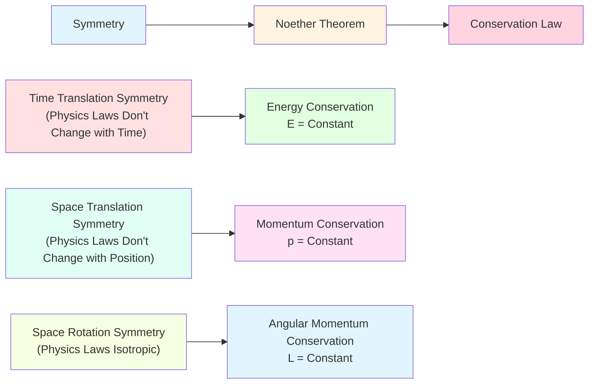
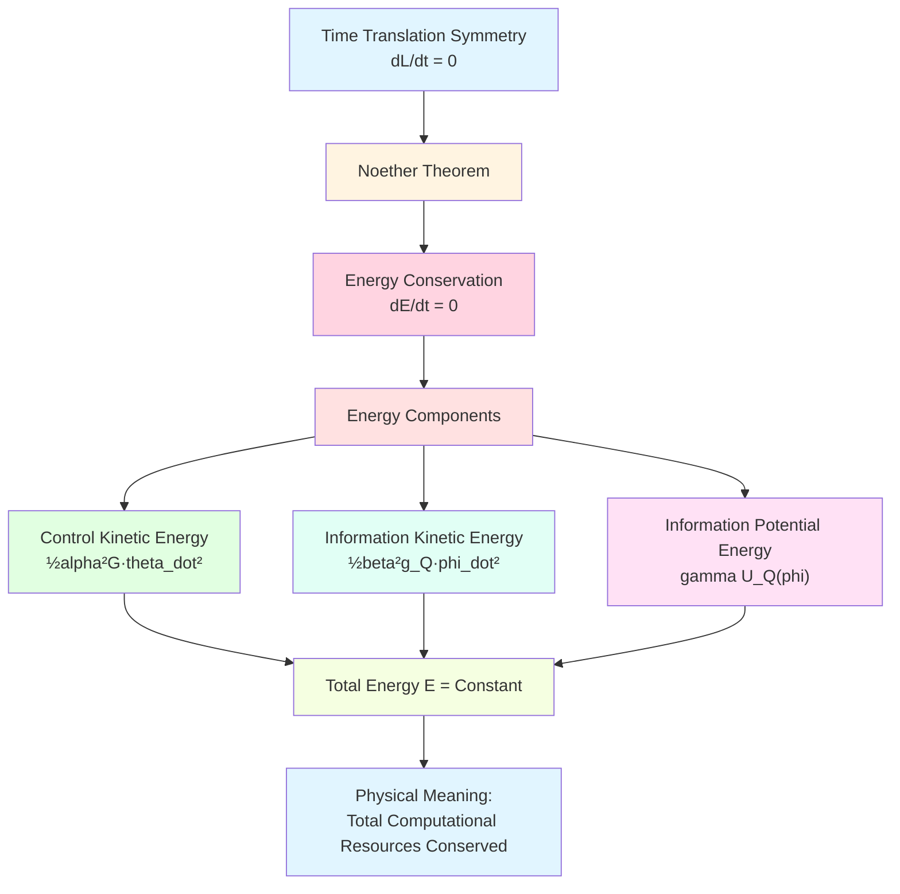
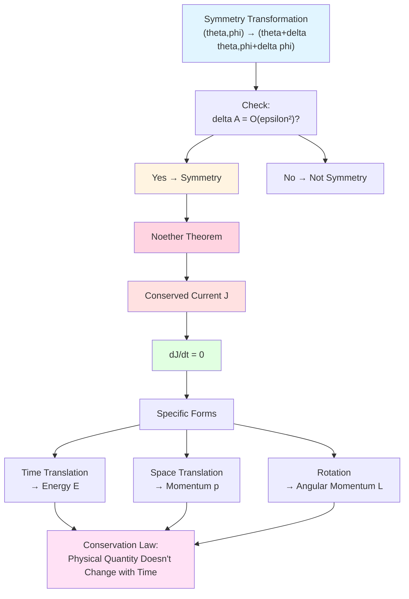
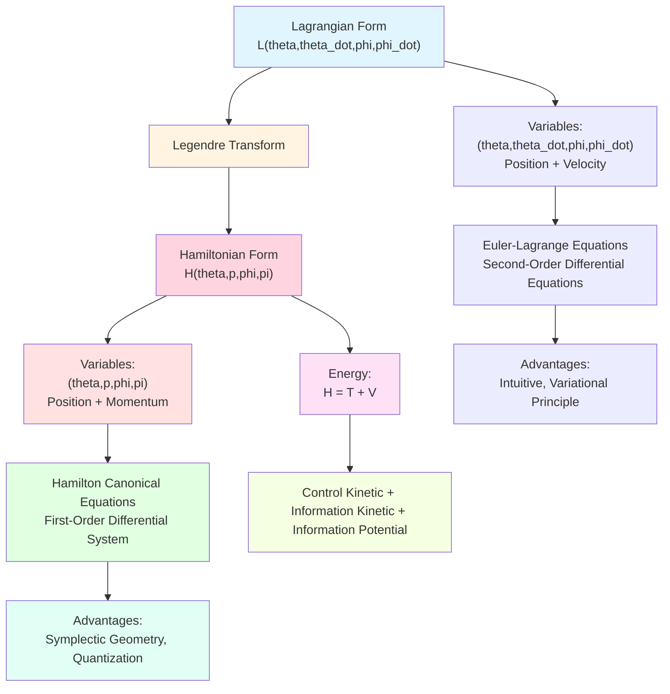
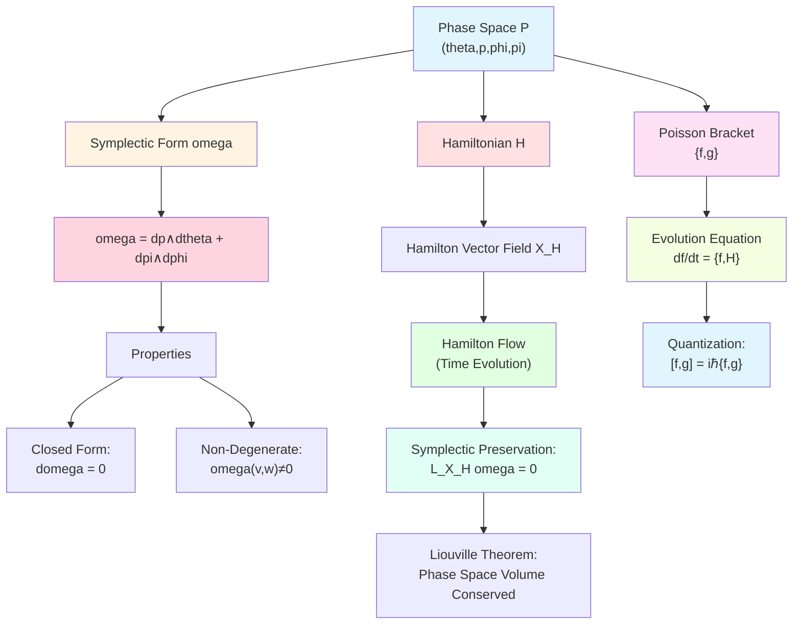
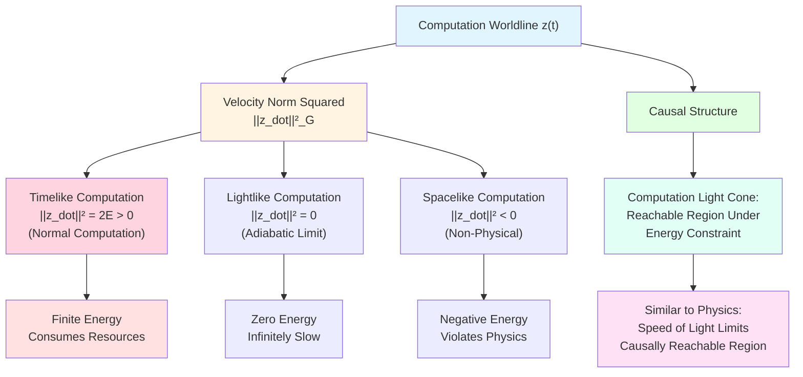
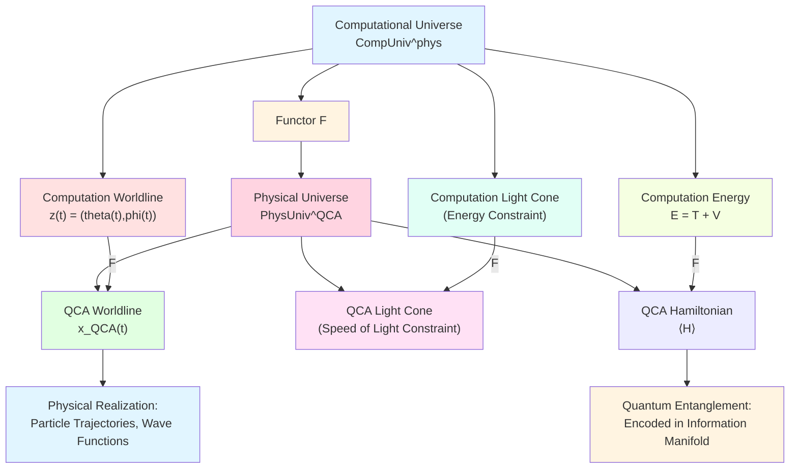
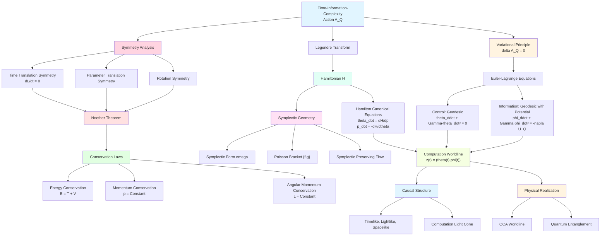

# 23.11 Euler-Lagrange Equations and Computation Worldlines

In previous article, we constructed time-information-complexity action $\mathcal{A}_Q$, and derived Euler-Lagrange equations:
- **Control**: $\ddot{\theta}^a + \Gamma^a_{bc}\dot{\theta}^b\dot{\theta}^c = 0$ (geodesic);
- **Information**: $\ddot{\phi}^i + \Gamma^i_{jk}\dot{\phi}^j\dot{\phi}^k = -\tfrac{\gamma}{\beta^2}\nabla U_Q$ (geodesic with potential).

These equations describe **dynamics** of optimal computation worldlines. But like classical mechanics, equations of motion alone are not enough, we also need to understand:
- **Conservation Laws**: What quantities remain unchanged during evolution?
- **Symmetries**: What symmetries give rise to conservation laws? (Noether theorem)
- **Hamilton Form**: How to go from Lagrangian to Hamiltonian? (phase space description)
- **Causal Structure**: Do computation worldlines have "light cones"?

This article will deeply explore these questions, revealing deep structure of computation worldlines.

**Core Questions**:
- What conservation laws does time-information-complexity action have?
- How does Noether theorem connect symmetries and conservation laws?
- What do computation worldlines look like in Hamilton form?
- Relationship between causal structure of computation worldlines and physical spacetime?

This article is based on euler-gls-info/05-time-information-complexity-variational-principle.md and classical mechanics Hamilton-Jacobi theory.

---

## 1. From Newton's Laws to Conservation Laws: Everyday Analogy

### 1.1 Everyday Conservation Law: Money in Wallet

Imagine you keep daily accounts:
- **Income**: Salary, bonuses (energy input);
- **Expenses**: Groceries, rent (energy output);
- **Balance**: Remaining money in wallet (total energy).

**Conservation Law**: If no income and expenses (isolated system), balance unchanged!

$$
\text{Balance}(t) = \text{constant}.
$$

This is everyday version of **energy conservation**.

### 1.2 Origin of Physical Conservation Laws

In classical mechanics, conservation laws have profound origin: **symmetries**.

**Noether Theorem** (1915, Emmy Noether):
> Every continuous symmetry corresponds to a conservation law.

**Examples**:
- **Time Translation Symmetry** (today's physics laws = tomorrow's physics laws) → **Energy Conservation**;
- **Space Translation Symmetry** (physics laws here = physics laws there) → **Momentum Conservation**;
- **Space Rotation Symmetry** (turn left = turn right) → **Angular Momentum Conservation**.

### 1.3 Conservation Laws of Computation Worldlines

In computational universe, we also have action $\mathcal{A}_Q$ and Euler-Lagrange equations. Natural questions:
- What symmetries does action $\mathcal{A}_Q$ have?
- What conservation laws do these symmetries correspond to?

**Core Insight**:
- **Control-Information Energy**: Conserved under specific conditions;
- **Information Quality**: Conserved under certain evolutions;
- **Complexity Momentum**: Conserved in spatially uniform systems.

---

## 2. Energy Conservation: Time Translation Symmetry

**Source Theory**: Based on euler-gls-info/05-time-information-complexity-variational-principle.md Section 5 and classical mechanics theory

### 2.1 Time Translation Invariance of Lagrangian

Recall Lagrangian of joint action:

$$
L(\theta,\dot{\theta};\phi,\dot{\phi}) = \tfrac{1}{2}\alpha^2 G_{ab}(\theta)\dot{\theta}^a\dot{\theta}^b + \tfrac{1}{2}\beta^2 g_{ij}(\phi)\dot{\phi}^i\dot{\phi}^j - \gamma U_Q(\phi).
$$

**Key Observation**: $L$ **does not explicitly depend on time** $t$!

$$
\frac{\partial L}{\partial t} = 0.
$$

This means: **Lagrangian invariant under time translation**.

**Everyday Interpretation**:
- Cost of computation today = cost of computation tomorrow;
- Physics laws don't change with time (assuming no external interference).

### 2.2 Energy Conservation Law

**Theorem 2.1** (Energy Conservation)

If Lagrangian $L$ does not explicitly depend on time $t$, then there exists conserved quantity (energy):

$$
E = \sum_a \frac{\partial L}{\partial\dot{\theta}^a}\dot{\theta}^a + \sum_i \frac{\partial L}{\partial\dot{\phi}^i}\dot{\phi}^i - L,
$$

i.e.,

$$
\frac{\mathrm{d}E}{\mathrm{d}t} = 0.
$$

**Calculation**:

For our Lagrangian:

$$
\frac{\partial L}{\partial\dot{\theta}^a} = \alpha^2 G_{ab}\dot{\theta}^b,\quad \frac{\partial L}{\partial\dot{\phi}^i} = \beta^2 g_{ij}\dot{\phi}^j.
$$

Therefore energy is

$$
E = \alpha^2 G_{ab}\dot{\theta}^a\dot{\theta}^b + \beta^2 g_{ij}\dot{\phi}^i\dot{\phi}^j - L.
$$

Substitute expression of $L$:

$$
E = \alpha^2 G_{ab}\dot{\theta}^a\dot{\theta}^b + \beta^2 g_{ij}\dot{\phi}^i\dot{\phi}^j - \Big(\tfrac{1}{2}\alpha^2 G\dot{\theta}^2 + \tfrac{1}{2}\beta^2 g_Q\dot{\phi}^2 - \gamma U_Q\Big),
$$

$$
E = \tfrac{1}{2}\alpha^2 G_{ab}\dot{\theta}^a\dot{\theta}^b + \tfrac{1}{2}\beta^2 g_{ij}\dot{\phi}^i\dot{\phi}^j + \gamma U_Q(\phi).
$$

**Physical Meaning**:

$$
E = \underbrace{\tfrac{1}{2}\alpha^2 G\dot{\theta}^2}_{\text{Control Kinetic Energy}} + \underbrace{\tfrac{1}{2}\beta^2 g_Q\dot{\phi}^2}_{\text{Information Kinetic Energy}} + \underbrace{\gamma U_Q(\phi)}_{\text{Information Potential Energy}}.
$$

**Everyday Interpretation**:
- Energy = Kinetic Energy + Potential Energy;
- Control kinetic energy: Cost of control changes;
- Information kinetic energy: Cost of information changes;
- Information potential energy: Current information quality.

**Conservation Condition**: Along solutions of Euler-Lagrange equations, $E$ remains unchanged!

### 2.3 Application of Energy Conservation: Velocity Constraints

Energy conservation gives constraints on velocity. If initial energy is $E_0$, then at any time:

$$
\tfrac{1}{2}\alpha^2 G\dot{\theta}^2 + \tfrac{1}{2}\beta^2 g_Q\dot{\phi}^2 = E_0 - \gamma U_Q(\phi).
$$

**Physical Interpretation**:
- If information potential $U_Q(\phi)$ increases (enter high information regions), kinetic energy must decrease (velocity decreases);
- If $U_Q(\phi)$ decreases (information quality drops), kinetic energy increases (velocity increases);
- This is similar to "mountain climbing": Higher climb, slower speed.

**Example**: If $\phi$ fixed (don't optimize information), then

$$
\tfrac{1}{2}\alpha^2 G\dot{\theta}^2 = \text{constant},
$$

i.e., control velocity constant (uniform motion).

---

## 3. General Form of Noether Theorem

**Source Theory**: Based on classical variational principle, combined with euler-gls-info/05-time-information-complexity-variational-principle.md

### 3.1 Definition of Continuous Symmetry

**Definition 3.1** (Continuous Symmetry)

Let action be $\mathcal{A} = \int_0^T L(\theta,\dot{\theta};\phi,\dot{\phi};t)\,\mathrm{d}t$. If there exists one-parameter transformation

$$
\theta^a \to \theta^a + \epsilon\,\delta\theta^a,\quad \phi^i \to \phi^i + \epsilon\,\delta\phi^i,
$$

such that when $\epsilon\to 0$, change in action is

$$
\delta\mathcal{A} = O(\epsilon^2),
$$

then this transformation is called **symmetry transformation**.

**Examples**:
- **Time Translation**: $t\to t+\epsilon$, $L$ doesn't explicitly depend on $t$;
- **Parameter Translation**: $\theta^a \to \theta^a + \epsilon\,c^a$ (constant), $L$ periodic in $\theta^a$;
- **Rotation**: Rotate parameters in some subspace, $L$ rotation invariant.

### 3.2 Noether Theorem

**Theorem 3.2** (Noether Theorem, 1915)

For every continuous symmetry transformation $(\delta\theta^a,\delta\phi^i)$, there exists conserved current:

$$
J = \sum_a \frac{\partial L}{\partial\dot{\theta}^a}\delta\theta^a + \sum_i \frac{\partial L}{\partial\dot{\phi}^i}\delta\phi^i - L\,\delta t,
$$

satisfying

$$
\frac{\mathrm{d}J}{\mathrm{d}t} = 0.
$$

**Applications**:

1. **Time Translation** $\delta t = \epsilon$, $\delta\theta = \delta\phi = 0$:
   $$J = -L \Rightarrow E = -L + \sum_a p_a\dot{\theta}^a + \sum_i \pi_i\dot{\phi}^i.$$
   (Energy conservation)

2. **Parameter Translation** $\delta\theta^a = \epsilon\,c^a$:
   $$J = \sum_a \frac{\partial L}{\partial\dot{\theta}^a}c^a.$$
   (Momentum conservation)

3. **Information Manifold Rotation** $\delta\phi^i = \epsilon\,R^i_j\phi^j$:
   $$J = \sum_i \frac{\partial L}{\partial\dot{\phi}^i}R^i_j\phi^j.$$
   (Information angular momentum conservation)

---

## 4. Hamilton Form: From Lagrangian to Hamiltonian

**Source Theory**: Based on classical mechanics Hamilton theory, combined with euler-gls-info/05-time-information-complexity-variational-principle.md

### 4.1 Why Do We Need Hamilton Form?

Lagrangian form uses $(\theta,\dot{\theta},\phi,\dot{\phi})$ as variables (position + velocity).

Hamilton form uses $(\theta,p_\theta,\phi,p_\phi)$ as variables (position + momentum).

**Advantages**:
- **Phase Space Description**: Lift $2n$-dimensional configuration space to $4n$-dimensional phase space;
- **Symplectic Geometric Structure**: Hamilton equations have beautiful symplectic symmetry;
- **Quantization**: Hamilton form is starting point of quantum mechanics (operators replace classical variables).

### 4.2 Legendre Transform: From Velocity to Momentum

**Definition 4.1** (Conjugate Momentum)

Define **control conjugate momentum**:

$$
p_a = \frac{\partial L}{\partial\dot{\theta}^a} = \alpha^2 G_{ab}(\theta)\dot{\theta}^b.
$$

Define **information conjugate momentum**:

$$
\pi_i = \frac{\partial L}{\partial\dot{\phi}^i} = \beta^2 g_{ij}(\phi)\dot{\phi}^j.
$$

**Physical Meaning**:
- $p_a$ is "control momentum", measures control velocity times "mass" (metric);
- $\pi_i$ is "information momentum", measures information velocity times "mass" (Fisher metric).

**Invert Velocity**:

$$
\dot{\theta}^a = \frac{1}{\alpha^2}G^{ab}p_b,\quad \dot{\phi}^i = \frac{1}{\beta^2}g^{ij}\pi_j.
$$

### 4.3 Definition of Hamiltonian

**Definition 4.2** (Hamiltonian)

Define Hamiltonian through Legendre transform:

$$
H(\theta,p_\theta;\phi,p_\phi) = \sum_a p_a\dot{\theta}^a + \sum_i \pi_i\dot{\phi}^i - L.
$$

Substitute:

$$
H = p_a\dot{\theta}^a + \pi_i\dot{\phi}^i - \Big(\tfrac{1}{2}\alpha^2 G_{ab}\dot{\theta}^a\dot{\theta}^b + \tfrac{1}{2}\beta^2 g_{ij}\dot{\phi}^i\dot{\phi}^j - \gamma U_Q\Big).
$$

Using $p_a = \alpha^2 G_{ab}\dot{\theta}^b$:

$$
p_a\dot{\theta}^a = \alpha^2 G_{ab}\dot{\theta}^b\dot{\theta}^a = \alpha^2 G\dot{\theta}^2,
$$

Similarly $\pi_i\dot{\phi}^i = \beta^2 g_Q\dot{\phi}^2$. Therefore:

$$
H = \alpha^2 G\dot{\theta}^2 + \beta^2 g_Q\dot{\phi}^2 - \tfrac{1}{2}\alpha^2 G\dot{\theta}^2 - \tfrac{1}{2}\beta^2 g_Q\dot{\phi}^2 + \gamma U_Q,
$$

$$
H = \tfrac{1}{2}\alpha^2 G\dot{\theta}^2 + \tfrac{1}{2}\beta^2 g_Q\dot{\phi}^2 + \gamma U_Q.
$$

Expressed in momentum:

$$
H = \frac{1}{2\alpha^2}G^{ab}p_a p_b + \frac{1}{2\beta^2}g^{ij}\pi_i\pi_j + \gamma U_Q(\phi).
$$

**Physical Meaning**: $H$ is exactly **energy** $E$!

$$
H = \underbrace{\frac{1}{2\alpha^2}G^{ab}p_a p_b}_{\text{Control Kinetic Energy}} + \underbrace{\frac{1}{2\beta^2}g^{ij}\pi_i\pi_j}_{\text{Information Kinetic Energy}} + \underbrace{\gamma U_Q(\phi)}_{\text{Information Potential Energy}}.
$$

### 4.4 Hamilton Canonical Equations

**Theorem 4.3** (Hamilton Canonical Equations)

Euler-Lagrange equations equivalent to Hamilton canonical system:

$$
\begin{cases}
\dot{\theta}^a = \dfrac{\partial H}{\partial p_a} = \dfrac{1}{\alpha^2}G^{ab}p_b\\[10pt]
\dot{p}_a = -\dfrac{\partial H}{\partial\theta^a} = -\dfrac{1}{2\alpha^2}(\partial_a G^{bc})p_b p_c\\[10pt]
\dot{\phi}^i = \dfrac{\partial H}{\partial\pi_i} = \dfrac{1}{\beta^2}g^{ij}\pi_j\\[10pt]
\dot{\pi}_i = -\dfrac{\partial H}{\partial\phi^i} = -\dfrac{1}{2\beta^2}(\partial_i g^{jk})\pi_j\pi_k - \gamma\partial_i U_Q
\end{cases}
$$

**Everyday Interpretation**:
- Equations 1, 3: Momentum determines velocity (velocity is function of momentum);
- Equations 2, 4: Gradients of potential and metric drive momentum changes.

---

## 5. Symplectic Geometry: Geometric Structure of Phase Space

**Source Theory**: Based on classical symplectic geometry theory

### 5.1 Phase Space and Symplectic Form

**Definition 5.1** (Phase Space)

Phase space is space of all possible $(\theta,p,\phi,\pi)$:

$$
\mathcal{P} = T^*\mathcal{M} \times T^*\mathcal{S}_Q,
$$

where $T^*\mathcal{M}$ is cotangent bundle of control manifold, $T^*\mathcal{S}_Q$ is cotangent bundle of information manifold.

**Symplectic Form**: Define symplectic 2-form on phase space:

$$
\omega = \sum_a \mathrm{d}p_a \wedge \mathrm{d}\theta^a + \sum_i \mathrm{d}\pi_i \wedge \mathrm{d}\phi^i.
$$

**Properties**:
- $\omega$ is closed form: $\mathrm{d}\omega = 0$;
- $\omega$ is non-degenerate: For any nonzero vector $v$, there exists $w$ such that $\omega(v,w)\neq 0$.

**Physical Meaning**: Symplectic form encodes "conjugate relationship" between canonical variables $(\theta,p)$ and $(\phi,\pi)$.

### 5.2 Hamilton Flow and Symplectic Preservation

**Definition 5.2** (Hamilton Vector Field)

Hamiltonian $H$ induces a vector field $X_H$, satisfying:

$$
\omega(X_H,\cdot) = \mathrm{d}H.
$$

In coordinates:

$$
X_H = \frac{\partial H}{\partial p_a}\frac{\partial}{\partial\theta^a} - \frac{\partial H}{\partial\theta^a}\frac{\partial}{\partial p_a} + \frac{\partial H}{\partial\pi_i}\frac{\partial}{\partial\phi^i} - \frac{\partial H}{\partial\phi^i}\frac{\partial}{\partial\pi_i}.
$$

**Theorem 5.3** (Hamilton Flow Preserves Symplectic Form)

Hamilton flow (integral curves along $X_H$) preserves symplectic form:

$$
\mathcal{L}_{X_H}\omega = 0,
$$

where $\mathcal{L}$ is Lie derivative.

**Physical Meaning**: Hamilton evolution preserves "volume" of phase space (generalization of Liouville theorem).

### 5.3 Poisson Bracket

**Definition 5.4** (Poisson Bracket)

For any two phase space functions $f,g$, define Poisson bracket:

$$
\{f,g\} = \sum_a \Big(\frac{\partial f}{\partial\theta^a}\frac{\partial g}{\partial p_a} - \frac{\partial f}{\partial p_a}\frac{\partial g}{\partial\theta^a}\Big) + \sum_i \Big(\frac{\partial f}{\partial\phi^i}\frac{\partial g}{\partial\pi_i} - \frac{\partial f}{\partial\pi_i}\frac{\partial g}{\partial\phi^i}\Big).
$$

**Properties**:
- Antisymmetric: $\{f,g\} = -\{g,f\}$;
- Jacobi identity: $\{\{f,g\},h\} + \{\{g,h\},f\} + \{\{h,f\},g\} = 0$;
- Leibniz rule: $\{f,gh\} = g\{f,h\} + \{f,g\}h$.

**Evolution Equation**: Time evolution of any physical quantity $f(\theta,p,\phi,\pi)$ is:

$$
\frac{\mathrm{d}f}{\mathrm{d}t} = \{f,H\}.
$$

In particular, Hamilton equations can be written as:

$$
\dot{\theta}^a = \{\theta^a,H\},\quad \dot{p}_a = \{p_a,H\},\quad \dot{\phi}^i = \{\phi^i,H\},\quad \dot{\pi}_i = \{\pi_i,H\}.
$$

---

## 6. Causal Structure of Computation Worldlines

**Source Theory**: Based on euler-gls-info/05-time-information-complexity-variational-principle.md and GLS causal theory

### 6.1 Timelike, Lightlike, Spacelike Worldlines

In relativity, worldlines are classified by norm of four-velocity:
- **Timelike**: $\|\dot{x}\|^2 < 0$ (massive particles);
- **Lightlike**: $\|\dot{x}\|^2 = 0$ (photons);
- **Spacelike**: $\|\dot{x}\|^2 > 0$ (unreachable, faster than light).

In computational universe, we have joint metric $\mathbb{G} = \alpha^2 G \oplus \beta^2 g_Q$. Define "velocity norm squared" of worldline:

$$
\|\dot{z}\|_{\mathbb{G}}^2 = \alpha^2 G_{ab}\dot{\theta}^a\dot{\theta}^b + \beta^2 g_{ij}\dot{\phi}^i\dot{\phi}^j.
$$

Analogously, we can define:

**Definition 6.1** (Causal Type of Computation Worldline)

- **Timelike Computation**: $\|\dot{z}\|_{\mathbb{G}}^2 = 2E$ (finite energy);
- **Lightlike Computation**: $\|\dot{z}\|_{\mathbb{G}}^2 = 0$ (zero energy, limiting case);
- **Spacelike Computation**: $\|\dot{z}\|_{\mathbb{G}}^2 < 0$ (negative energy, usually excluded).

**Physical Meaning**:
- Timelike computation: Normal computation process, consumes finite energy;
- Lightlike computation: Adiabatic limit (infinitely slow), energy tends to zero;
- Spacelike computation: Non-physical (violates energy conservation).

### 6.2 "Light Cone" of Computation

In Minkowski spacetime, light cone defines causally reachable region: Only timelike or lightlike paths can connect two events.

In computational universe, similar causal structure defined by **complexity metric $G$ and information metric $g_Q$**.

**Definition 6.2** (Computation Light Cone)

Given initial point $z_0 = (\theta_0,\phi_0)$, **future computation light cone** from $z_0$ is set of all points $z = (\theta,\phi)$ satisfying:

$$
\exists \text{ worldline } z(t), \quad z(0) = z_0,\quad z(T) = z,\quad E[z] \le E_{\max},
$$

where $E_{\max}$ is available total energy budget.

**Everyday Interpretation**:
- Computation light cone is "all states reachable from initial state under given energy";
- Similar to "reachable set of goods you can buy with 100 dollars".

### 6.3 Causal Structure and Computational Complexity

In GLS theory, causal structure of computational universe closely related to causal structure of physical spacetime (through QCA realization).

**Key Insight**:
- **Complexity Distance $d_G$** similar to "proper time" in spacetime;
- **Information Distance $d_{g_Q}$** similar to "distance in information space";
- **Energy Constraint $E\le E_{\max}$** limits reachable region, similar to speed of light limiting causally reachable region.

---

## 7. Connection with Physical Universe: QCA Worldlines

**Source Theory**: Based on GLS unified theory framework (preview from euler-gls-info/06-categorical-equivalence-computational-physical-universes.md)

### 7.1 QCA (Quantum Cellular Automaton) Universe

In GLS theory, physical universe is modeled as **Quantum Cellular Automaton** (QCA):
- Spacetime is discrete grid;
- Each lattice point has quantum state;
- Evolution controlled by unitary operators (preserve probability sum).

Worldlines of QCA are trajectories on lattice, satisfying:
- Locality: Each step only affects neighboring lattice points;
- Unitarity: Total probability conserved;
- Causality: Future lattice points only depend on past light cone lattice points.

### 7.2 Computation Worldline ↔ QCA Worldline

**Core Proposition 7.1** (Computation-Physics Correspondence, from GLS Framework)

There exists functor $F:\mathbf{CompUniv}^{\mathrm{phys}} \to \mathbf{PhysUniv}^{\mathrm{QCA}}$, such that:

1. **Object Level**: Computational universe $U_{\mathrm{comp}}$ corresponds to a QCA universe $U_{\mathrm{QCA}}$;
2. **Trajectory Level**: Computation worldline $z(t) = (\theta(t),\phi(t))$ corresponds to worldline $x_{\mathrm{QCA}}(t)$ on QCA lattice;
3. **Causal Level**: Computation light cone ↔ QCA light cone;
4. **Energy Level**: Computation energy $E$ ↔ Expectation value of QCA Hamiltonian.

**Everyday Interpretation**:
- Computation worldline is "abstract algorithm trajectory";
- QCA worldline is "concrete physical particle trajectory";
- Both **completely equivalent** (categorically equivalent) under GLS theory framework!

### 7.3 Quantum Entanglement and Information Manifold

In QCA, quantum entanglement is core feature. In computational universe framework, entanglement corresponds to **non-trivial structure on information manifold**.

**Examples**:
- **Unentangled State**: $\rho = \rho_A \otimes \rho_B$, information manifold is product manifold;
- **Maximally Entangled State**: Bell state, information manifold has non-trivial topology;
- **Entanglement Entropy**: $S(\rho_A) = -\mathrm{Tr}(\rho_A\log\rho_A)$, corresponds to volume on information manifold.

**Key Insight**:
- Information potential $U_Q(\phi)$ can encode entanglement information;
- Optimal computation worldlines tend to "utilize entanglement" (enter high $U_Q$ regions).

---

## 8. Complete Picture: From Action to Worldlines

### 8.1 Theoretical Structure Summary

### 8.2 Core Formula Quick Reference

| Concept | Formula | Physical Meaning |
|---------|---------|-----------------|
| Lagrangian | $L = \tfrac{1}{2}\alpha^2 G\dot{\theta}^2 + \tfrac{1}{2}\beta^2 g_Q\dot{\phi}^2 - \gamma U_Q$ | Kinetic-Potential |
| Energy | $E = \tfrac{1}{2}\alpha^2 G\dot{\theta}^2 + \tfrac{1}{2}\beta^2 g_Q\dot{\phi}^2 + \gamma U_Q$ | Conserved Quantity |
| Conjugate Momentum | $p_a = \alpha^2 G_{ab}\dot{\theta}^b$,$\pi_i = \beta^2 g_{ij}\dot{\phi}^j$ | Velocity × Mass |
| Hamiltonian | $H = \tfrac{1}{2\alpha^2}G^{ab}p_a p_b + \tfrac{1}{2\beta^2}g^{ij}\pi_i\pi_j + \gamma U_Q$ | Energy Function |
| Hamilton Equations | $\dot{\theta}^a = \partial H/\partial p_a$,$\dot{p}_a = -\partial H/\partial\theta^a$ | Canonical Equations |
| Symplectic Form | $\omega = \mathrm{d}p\wedge\mathrm{d}\theta + \mathrm{d}\pi\wedge\mathrm{d}\phi$ | Phase Space Structure |
| Poisson Bracket | $\{f,g\} = \sum_a(\partial_\theta f\,\partial_p g - \partial_p f\,\partial_\theta g) + \cdots$ | Algebraic Structure |
| Causal Type | $\|\dot{z}\|_{\mathbb{G}}^2 = \alpha^2 G\dot{\theta}^2 + \beta^2 g_Q\dot{\phi}^2$ | Timelike/Lightlike/Spacelike |

---

## 9. Summary

This article deeply explored dynamics and geometric structure of computation worldlines:

### 9.1 Core Concepts

1. **Energy Conservation**: Time translation symmetry → Energy $E = T + V$ conserved
   - Control kinetic energy + Information kinetic energy + Information potential energy = constant

2. **Noether Theorem**: Symmetry ↔ Conservation Law
   - Time translation → Energy conservation
   - Space translation → Momentum conservation
   - Rotation → Angular momentum conservation

3. **Hamilton Form**: Lagrangian → Hamiltonian
   - Variables: (position, velocity) → (position, momentum)
   - Equations: Second-order differential equations → First-order canonical system

4. **Symplectic Geometry**: Geometric structure of phase space
   - Symplectic form $\omega = \mathrm{d}p\wedge\mathrm{d}\theta + \mathrm{d}\pi\wedge\mathrm{d}\phi$
   - Poisson bracket $\{f,g\}$
   - Symplectic preserving flow (Liouville theorem)

5. **Causal Structure**: Computation light cone
   - Timelike computation: Normal energy
   - Lightlike computation: Adiabatic limit
   - Energy constraint defines reachable region

6. **Connection with Physical Universe**: Computation worldline ↔ QCA worldline
   - Functor $F:\mathbf{CompUniv} \to \mathbf{PhysUniv}$
   - Entanglement ↔ Information manifold structure

### 9.2 Core Insights

- **Conservation Laws Arise from Symmetries**: Noether theorem is bridge connecting geometry and dynamics;
- **Hamilton Form Unifies Dynamics**: First-order canonical equations, symplectic geometric structure, paves way for quantization;
- **Causal Structure Geometrized**: Energy constraint defines computation light cone, similar to speed of light limiting physical causality;
- **Computation Is Physics**: Computation worldlines and QCA worldlines equivalent under GLS framework;
- **Information Geometry Encodes Entanglement**: Non-trivial structure of information manifold corresponds to quantum entanglement.

### 9.3 Everyday Analogy Review

- **Wallet Balance**: Everyday version of conservation law (balance unchanged when income = expenses);
- **Mountain Climbing**: Slow speed when potential high (energy conservation);
- **Phase Space**: "Complete description" of position + momentum;
- **Light Cone**: Reachable region limited by energy/speed of light;
- **Abstract Algorithm ↔ Concrete Physics**: Computation worldline ↔ particle trajectory.

### 9.4 Connections with Previous and Subsequent Chapters

**Connection with Articles 23.1-10**:
- Articles 23.3-5: Complexity geometry → Control manifold $(\mathcal{M},G)$
- Articles 23.6-7: Information geometry → Information manifold $(\mathcal{S}_Q,g_Q)$
- Article 23.10: Joint action $\mathcal{A}_Q$ and Euler-Lagrange equations
- This Article: Conservation laws, Hamilton form, symplectic geometry, causal structure

**Preview of Article 23.12**:
Next article will construct **functor structure of Physical Universe ↔ Computational Universe**:
- Functor $F:\mathbf{CompUniv}^{\mathrm{phys}} \to \mathbf{PhysUniv}^{\mathrm{QCA}}$
- Preservation of morphisms (simulation maps ↔ QCA maps)
- Correspondence of complexity distance ↔ spacetime distance
- Paving way for categorical equivalence theorem

---

**Preview of Next Article**: 23.12 Physical Universe ↔ Computational Universe: Functor Structure

In next article, we will:
1. **Construct Functor $F:\mathbf{CompUniv} \to \mathbf{PhysUniv}$**: Mapping from computation to physics;
2. **Object Level**: Computational universe $U_{\mathrm{comp}}$ ↔ QCA universe $U_{\mathrm{QCA}}$;
3. **Morphism Level**: Simulation maps ↔ QCA morphisms (preserving locality, unitarity);
4. **Distance Preservation**: Complexity distance $d_{\mathrm{comp}}$ ↔ Spacetime distance $d_{\mathrm{spacetime}}$;
5. **Inverse Functor $G:\mathbf{PhysUniv} \to \mathbf{CompUniv}$**: From physics to computation;
6. **Natural Isomorphism**: $F\circ G \simeq \mathrm{id}$, $G\circ F \simeq \mathrm{id}$ (paving way for categorical equivalence).

