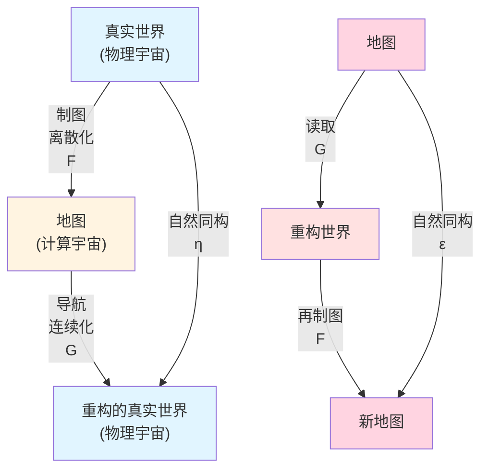
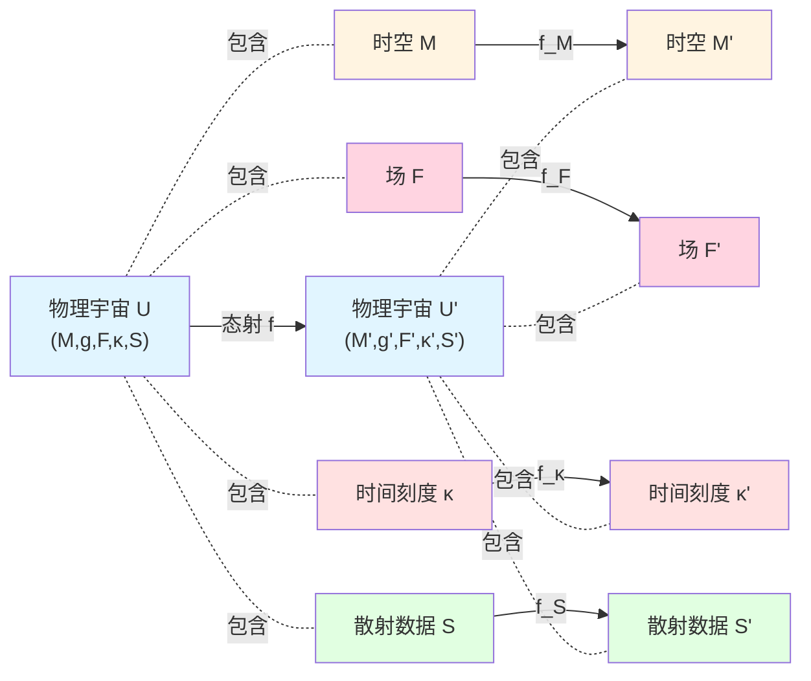
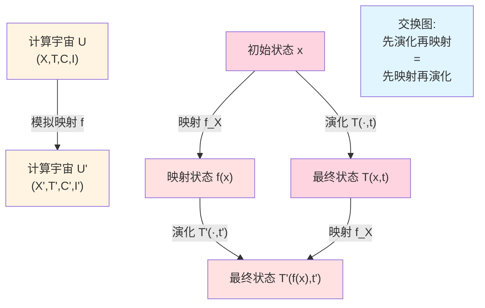
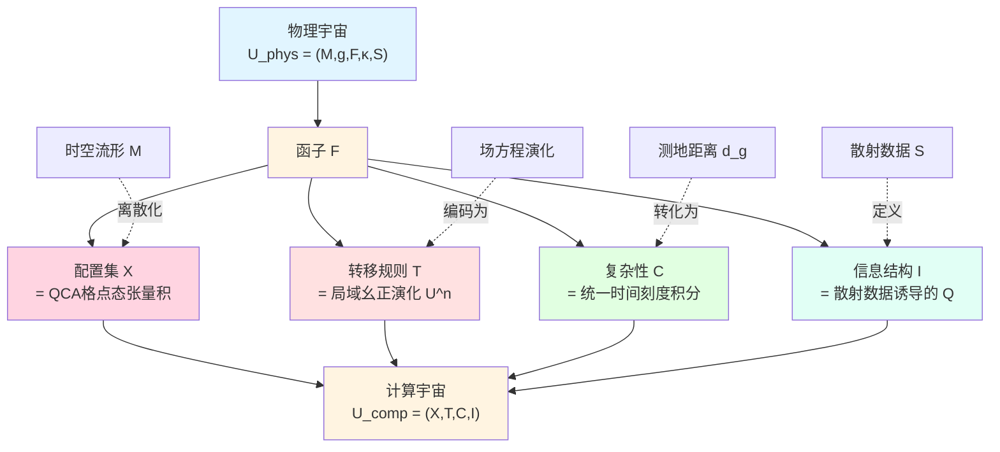
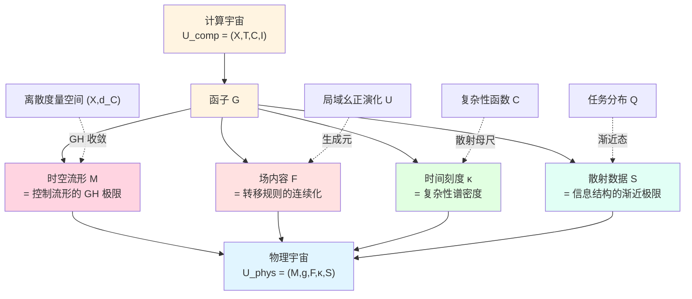
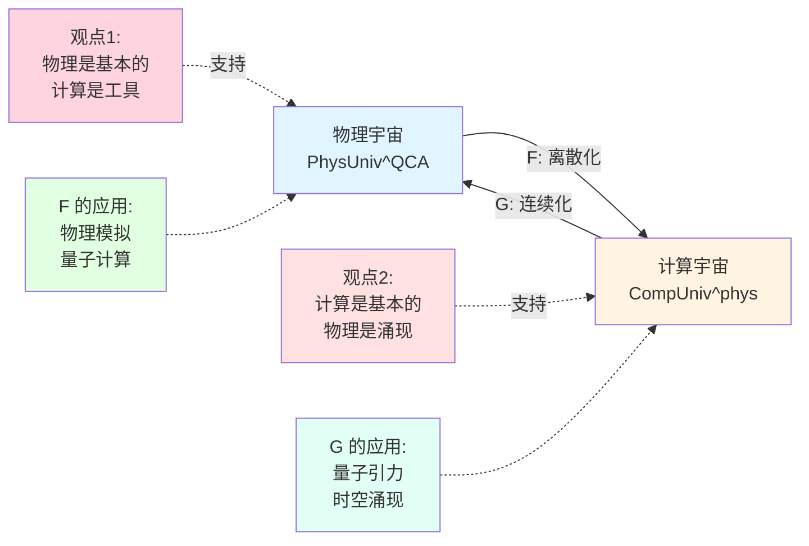
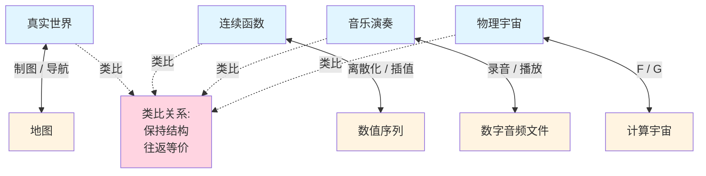

# 23.12 物理宇宙↔计算宇宙:函子结构

在前面的文章中,我们已经完整构造了计算宇宙的内部理论:
- **计算宇宙对象** $U_{\mathrm{comp}}=(X,\mathsf{T},\mathsf{C},\mathsf{I})$(第23.1-4篇);
- **复杂性几何** $(X,d_{\mathsf{C}})$(第23.3-5篇);
- **信息几何** $(\mathcal{S}_Q,g_Q)$(第23.6-7篇);
- **统一时间刻度** $\kappa(\omega)$(第23.8篇);
- **控制流形** $(\mathcal{M},G)$(第23.9篇);
- **计算世界线** $z(t)=(\theta(t),\phi(t))$(第23.10-11篇)。

但计算宇宙理论的终极目标是:**证明物理宇宙与计算宇宙在深层意义上等价**。

这不是简单的类比,而是严格的**范畴等价**:
- **物理宇宙**可以用**QCA(量子元胞自动机)**实现→**物理可被计算模拟**;
- **计算宇宙**可以用**连续极限**重构出物理时空→**计算可诱导物理**。

本篇将构造两个核心**函子**:
- **离散化函子** $\mathsf{F}:\mathbf{PhysUniv}^{\mathrm{QCA}}\to\mathbf{CompUniv}^{\mathrm{phys}}$(物理→计算);
- **连续化函子** $\mathsf{G}:\mathbf{CompUniv}^{\mathrm{phys}}\to\mathbf{PhysUniv}^{\mathrm{QCA}}$(计算→物理)。

下一篇将证明这两个函子构成**范畴等价**,完成GLS统一理论的最终闭环。

**核心问题**:
- 什么是物理宇宙范畴?什么是QCA可实现的物理宇宙?
- 什么是计算宇宙范畴?什么是物理可实现的计算宇宙?
- 如何从物理宇宙构造计算宇宙(函子$\mathsf{F}$)?
- 如何从计算宇宙重构物理宇宙(函子$\mathsf{G}$)?

本文基于 euler-gls-info/06-categorical-equivalence-computational-physical-universes.md。

---

## 1. 为什么需要范畴语言?从地图到函子

### 1.1 日常类比:真实世界与地图

想象你在一个陌生城市旅游:

**真实世界**(物理宇宙):
- 包含街道、建筑、河流(时空几何);
- 有交通网络、地铁线(因果结构);
- 人们在其中行走、驾驶(物理演化)。

**地图**(计算宇宙):
- 用点、线、颜色表示城市(离散化);
- 简化细节,保留拓扑关系(抽象);
- 可以在纸上或手机上显示(计算表示)。

**核心问题**:
- 地图能**完整表示**真实世界吗?
- 真实世界中的"路径"在地图上对应什么?
- 地图上的"距离"与真实世界的关系?

### 1.2 两种转换:真实↔地图

**真实→地图**(离散化):
- 测量街道位置→标记坐标点;
- 记录交通连接→绘制线条;
- 抽象地形特征→简化符号。

这是**制图过程**(函子$\mathsf{F}$)。

**地图→真实**(重构):
- 读取坐标点→推断街道形状;
- 分析线条网络→重建交通系统;
- 解释符号→理解地形。

这是**导航过程**(函子$\mathsf{G}$)。

**关键洞察**:如果地图足够好,应该满足:
- 地图→真实→地图 ≈ 原地图(往返后恢复);
- 真实→地图→真实 ≈ 原真实(在某种意义上)。

这就是**范畴等价**的直观含义!

### 1.3 计算宇宙中的类比

在GLS理论中:

**物理宇宙** $U_{\mathrm{phys}}$:
- 时空流形 $(M,g)$(连续几何);
- 场内容 $F$(物质分布);
- 统一时间刻度密度 $\kappa$(谱密度);
- 散射数据 $S$(量子态)。

**计算宇宙** $U_{\mathrm{comp}}$:
- 配置集 $X$(离散状态);
- 转移规则 $\mathsf{T}$(演化算法);
- 复杂性函数 $\mathsf{C}$(计算代价);
- 信息结构 $\mathsf{I}$(观察机制)。

**两个函子**:
- $\mathsf{F}$:通过QCA离散化,将物理演化编码为计算过程;
- $\mathsf{G}$:通过控制流形与统一时间刻度,从计算重构物理时空。

---

## 2. 物理宇宙范畴 $\mathbf{PhysUniv}$

**源理论**:基于 euler-gls-info/06-categorical-equivalence-computational-physical-universes.md 第2节

### 2.1 物理宇宙对象的定义

一个**物理宇宙对象** $U_{\mathrm{phys}}$ 是一个五元组:

$$
U_{\mathrm{phys}} = (M,g,F,\kappa,S),
$$

其中:

**1. 时空流形** $(M,g)$:
- $M$ 是 $d$ 维Lorentz流形(通常 $d=4$);
- $g$ 是时空度量,满足Einstein场方程或其推广;
- **物理意义**:这是物理宇宙的"几何舞台"。

**2. 场内容** $F$:
- 定义在 $M$ 上的物质场(标量场、规范场、费米子场等);
- 满足协变场方程(Klein-Gordon、Yang-Mills、Dirac等);
- **物理意义**:这是宇宙中的"物质与能量"。

**3. 统一时间刻度密度** $\kappa:M\to\mathbb{R}_+$:
- 每点的谱密度,与局部复杂性相关;
- 通过散射理论与 $S$ 耦合(见第23.8篇);
- **物理意义**:这是"计算时钟的滴答速率"。

**4. 散射数据** $S$:
- 定义在渐近区域的量子态信息;
- 包含 $S$ 矩阵、谱函数、Krein谱移;
- **物理意义**:这是"量子态的指纹",可从远处观察获得。

**5. 相容性条件**:
- $\kappa$ 与 $S$ 通过Birman-Krein公式关联:
  $$
  \kappa(\omega;\theta) = \tfrac{1}{2\pi}\xi'_S(\omega;\theta),
  $$
  其中 $\xi_S$ 是谱移函数;
- $g$ 的几何与 $F$ 的动力学通过Einstein方程耦合。

**日常类比**:
- $(M,g)$ 是"宇宙的地形图"(山谷、平原);
- $F$ 是"地图上的建筑物"(物质);
- $\kappa$ 是"各地的时区"(时间流逝速度);
- $S$ 是"从卫星看到的图像"(远程观测)。

### 2.2 物理宇宙态射:时空映射

**物理态射** $f:U_{\mathrm{phys}}\to U_{\mathrm{phys}}'$ 是保持物理结构的映射:

$$
f = (f_M,f_F,f_\kappa,f_S),
$$

其中:

**1. 时空映射** $f_M:M\to M'$:
- 保持因果结构(光锥不被逆转);
- 在等距或共形变换意义下保持度量;
- **物理意义**:这是"坐标变换"或"时空嵌入"。

**2. 场映射** $f_F:F\to f_M^*F'$:
- 场内容通过拉回映射关联;
- 保持场方程的协变形式;
- **物理意义**:这是"物质的推前"。

**3. 时间刻度映射** $f_\kappa:\kappa\to f_M^*\kappa'$:
- 统一时间刻度密度在映射下的变换;
- 满足 $\kappa(f_M(x)) = \kappa'(x)\cdot J_{f_M}(x)$(Jacobian修正);
- **物理意义**:这是"时钟速率的协调"。

**4. 散射数据映射** $f_S:S\to S'$:
- 渐近散射态的对应关系;
- 保持 $S$ 矩阵的幺正性;
- **物理意义**:这是"量子态的变换"。

**日常类比**:
- 态射像"两张地图的对应关系":如果你在地图A上,态射告诉你如何在地图B上找到对应位置。

### 2.3 QCA可实现的物理宇宙子范畴

**核心问题**:并非所有物理宇宙都能被计算模拟!

**QCA(量子元胞自动机)**:
- 时空离散化为格点(如立方格子);
- 每个格点上有有限维Hilbert空间 $\mathcal{H}_x$(量子态);
- 演化由局域幺正算符 $U$ 生成(保持纠缠结构);
- 满足局域性(信息传播速度有限)。

**QCA可实现条件**:物理宇宙 $U_{\mathrm{phys}}$ 是QCA可实现的,如果:

**1. 时空可离散化**:
- 存在特征长度尺度 $\ell_0$(如Planck长度);
- 在 $\ell_0$ 尺度下可用格点近似;
- **物理意义**:时空在小尺度下有"原子性"。

**2. 场可有限维化**:
- 每个格点上的场自由度可截断为有限维;
- 紫外截断不破坏低能物理;
- **物理意义**:没有无限多的自由度。

**3. 演化保持局域性**:
- 场方程可改写为局域更新规则;
- 因果传播速度有限(光速);
- **物理意义**:没有超光速信号。

**子范畴** $\mathbf{PhysUniv}^{\mathrm{QCA}}$:
- **对象**:所有QCA可实现的物理宇宙;
- **态射**:保持QCA结构的物理态射。

**日常类比**:
- 原始范畴 $\mathbf{PhysUniv}$ 是"所有可能的地图"(包括无限精度的);
- 子范畴 $\mathbf{PhysUniv}^{\mathrm{QCA}}$ 是"可以用像素表示的地图"(有分辨率限制)。

**物理例子**:
- **包含在内**:标准模型(截断到有限能量);
- **可能不包含**:无限维共形场论(除非有适当截断)。

---

## 3. 计算宇宙范畴 $\mathbf{CompUniv}$

**源理论**:基于 euler-gls-info/06-categorical-equivalence-computational-physical-universes.md 第3节

### 3.1 计算宇宙对象的定义

回顾第23.1篇,一个**计算宇宙对象** $U_{\mathrm{comp}}$ 是四元组:

$$
U_{\mathrm{comp}} = (X,\mathsf{T},\mathsf{C},\mathsf{I}),
$$

其中:

**1. 配置集** $X$:
- 可数集(有限或无限);
- 每个 $x\in X$ 是一个"计算状态"(如比特串、格点配置);
- **计算意义**:这是"可能的瞬时状态空间"。

**2. 转移规则** $\mathsf{T}:X\times\mathbb{N}\to X$:
- $\mathsf{T}(x,t)$ 是从状态 $x$ 出发演化 $t$ 步后的状态;
- 满足确定性(或概率性,对随机QCA);
- **计算意义**:这是"演化算法"。

**3. 复杂性函数** $\mathsf{C}$:
- 路径复杂性 $\mathsf{C}(\gamma)$(第23.2-3篇);
- 诱导度量 $d_{\mathsf{C}}(x,y) = \inf_\gamma\mathsf{C}(\gamma)$(第23.3篇);
- **计算意义**:这是"计算代价"。

**4. 信息结构** $\mathsf{I}$:
- 任务分布 $Q$(第23.6篇);
- Fisher信息度量 $g_Q$(第23.6-7篇);
- **计算意义**:这是"观察能力"。

**日常类比**:
- $X$ 是"所有可能的程序状态"(内存快照);
- $\mathsf{T}$ 是"CPU执行指令"(状态转移);
- $\mathsf{C}$ 是"执行时间/能量消耗"(成本);
- $\mathsf{I}$ 是"调试器能看到什么"(观察)。

### 3.2 计算宇宙态射:模拟映射

**模拟映射** $f:U_{\mathrm{comp}}\to U_{\mathrm{comp}}'$ 是保持计算结构的映射:

$$
f = (f_X,f_\mathsf{T},f_\mathsf{C},f_\mathsf{I}),
$$

其中:

**1. 配置映射** $f_X:X\to X'$:
- 将源宇宙的状态映射到目标宇宙的状态;
- 可以是单射(嵌入)、满射(投影)或双射(同构);
- **计算意义**:这是"程序编译"或"虚拟化"。

**2. 演化映射** $f_\mathsf{T}$:
- 满足交换图:$f_X(\mathsf{T}(x,t)) = \mathsf{T}'(f_X(x),t')$;
- 允许时间重标度 $t'=\tau(t)$;
- **计算意义**:这是"保持算法正确性"。

**3. 复杂性映射** $f_\mathsf{C}$:
- 满足 $\mathsf{C}'(f_X\circ\gamma) \leq C_f\cdot\mathsf{C}(\gamma)$(复杂性控制);
- 常数 $C_f$ 衡量"编译开销";
- **计算意义**:这是"计算代价的控制"。

**4. 信息映射** $f_\mathsf{I}$:
- 任务分布的推前 $f_*Q$;
- Fisher度量的保持(在Lipschitz意义下);
- **计算意义**:这是"观察能力的保持"。

**日常类比**:
- 态射像"将程序从Python编译成C++":状态空间改变,但算法逻辑保持,性能可能提升。

### 3.3 物理可实现的计算宇宙子范畴

**核心问题**:并非所有计算宇宙都对应物理宇宙!

**物理可实现条件**:计算宇宙 $U_{\mathrm{comp}}$ 是物理可实现的,如果:

**1. 存在控制流形** $\mathcal{M}$:
- 参数化转移规则 $\mathsf{T}_\theta$(第23.9篇);
- 控制度量 $G_{ab}$ 与复杂性度量 $d_{\mathsf{C}}$ 在Lipschitz意义下等价;
- **物理意义**:可以用"旋钮"连续调节演化规则。

**2. 存在统一时间刻度** $\kappa(\omega;\theta)$:
- 来自散射母尺(第23.8篇);
- 满足 $\kappa(\omega)=\tfrac{1}{2\pi}\xi'(\omega)=\tfrac{1}{2\pi}\mathrm{tr}\,Q(\omega)$;
- **物理意义**:计算步数可转化为物理时间。

**3. 满足Gromov-Hausdorff收敛**:
- 离散度量空间 $(X,d_{\mathsf{C}})$ 在 $\ell\to 0$ 时收敛到连续流形 $(M,d_G)$(第23.9篇);
- 体积、维数、曲率同时收敛;
- **物理意义**:粗视化后恢复连续时空几何。

**子范畴** $\mathbf{CompUniv}^{\mathrm{phys}}$:
- **对象**:所有物理可实现的计算宇宙;
- **态射**:保持控制流形与统一时间刻度的模拟映射。

**日常类比**:
- 原始范畴 $\mathbf{CompUniv}$ 是"所有可能的程序"(包括无物理意义的);
- 子范畴 $\mathbf{CompUniv}^{\mathrm{phys}}$ 是"可以在真实计算机上运行的程序"(有资源约束)。

**计算例子**:
- **包含在内**:QCA演化,量子电路,可逆元胞自动机;
- **不包含**:超图灵计算,无限并行计算(无物理实现)。

---

## 4. 离散化函子 $\mathsf{F}:\mathbf{PhysUniv}^{\mathrm{QCA}}\to\mathbf{CompUniv}^{\mathrm{phys}}$

**源理论**:基于 euler-gls-info/06-categorical-equivalence-computational-physical-universes.md 第4节

### 4.1 函子的直观:物理→计算的桥梁

**核心思想**:给定QCA可实现的物理宇宙,构造对应的计算宇宙。

**日常类比**:
- **物理宇宙**:连续的河流(水分子无限多);
- **计算宇宙**:河流的"像素化"照片(分辨率有限,但保留主要特征)。

**关键步骤**:
1. **离散化时空**:$M\to X$(格点化);
2. **编码演化**:场方程→转移规则 $\mathsf{T}$;
3. **量化复杂性**:几何距离→计算代价 $\mathsf{C}$;
4. **保留信息结构**:散射数据→任务分布 $\mathsf{I}$。

### 4.2 对象映射 $\mathsf{F}(U_{\mathrm{phys}})$

给定 $U_{\mathrm{phys}}=(M,g,F,\kappa,S)\in\mathbf{PhysUniv}^{\mathrm{QCA}}$,构造 $U_{\mathrm{comp}}=(X,\mathsf{T},\mathsf{C},\mathsf{I})$:

#### 步骤1:构造配置集 $X$

**QCA离散化**:
- 选择特征长度尺度 $\ell$(如Planck长度或格点间距);
- 将时空 $M$ 覆盖为格点 $\Lambda\subset M$;
- 每个格点 $x\in\Lambda$ 对应有限维Hilbert空间 $\mathcal{H}_x$(维数 $D$)。

**配置定义**:
$$
X = \bigotimes_{x\in\Lambda}\mathcal{H}_x,
$$
是所有格点上量子态的张量积空间。

**物理意义**:
- 每个配置 $\psi\in X$ 是"宇宙在某一时刻的完整量子态";
- 维数 $|X|\sim D^{|\Lambda|}$(指数增长)。

**日常类比**:
- 时空像"一个巨大的乐高板";
- 每个格点是一个"乐高砖块"(状态空间 $\mathcal{H}_x$);
- 配置集 $X$ 是"所有可能的乐高拼图"。

#### 步骤2:构造转移规则 $\mathsf{T}$

**QCA演化算子**:
- 物理演化由场方程生成(如Schrödinger方程);
- 离散化为局域幺正算符 $U$:
  $$
  |\psi(t+\delta t)\rangle = U(\delta t)|\psi(t)\rangle,
  $$
  其中 $U(\delta t)$ 可分解为局域门的乘积:
  $$
  U = \prod_{\text{邻居对}(x,y)}U_{xy}.
  $$

**转移规则定义**:
$$
\mathsf{T}(\psi,n) = U^n\psi,
$$
其中 $U^n$ 是 $n$ 步演化。

**物理意义**:
- $\mathsf{T}$ 是"宇宙的时钟":每一"滴答"对应一次局域更新;
- 保持幺正性→保持概率守恒(量子性)。

**日常类比**:
- 转移规则像"电影放映":每一帧(时间步)按固定规则从上一帧生成。

#### 步骤3:构造复杂性函数 $\mathsf{C}$

**时空距离→计算代价**:
- 物理时空中两点 $(x_1,t_1)$、$(x_2,t_2)$ 的测地距离 $d_g(x_1,x_2)$;
- 映射到配置空间中对应态 $\psi_1,\psi_2$ 的路径复杂性:
  $$
  \mathsf{C}(\psi_1\to\psi_2) = \int_{t_1}^{t_2}\kappa(t)dt + \text{(几何修正)},
  $$
  其中 $\kappa(t)$ 是统一时间刻度密度。

**复杂性度量**:
$$
d_{\mathsf{C}}(\psi_1,\psi_2) = \inf_{\text{路径}\gamma}\mathsf{C}(\gamma).
$$

**物理意义**:
- 物理时空的"距离"对应计算的"时间代价";
- 因果结构保持:只能沿着类时曲线演化(不能"瞬移")。

**日常类比**:
- 复杂性像"从A城到B城的最短旅行时间":不是直线距离,而是考虑交通网络。

#### 步骤4:构造信息结构 $\mathsf{I}$

**散射数据→任务分布**:
- 物理宇宙的散射数据 $S$(包含谱函数、$S$矩阵);
- 定义任务分布 $Q$:
  $$
  Q(z|x) = \langle\phi_z|U_S|x\rangle,
  $$
  其中 $\phi_z$ 是"观测算符的本征态",$U_S$ 是散射算符。

**Fisher信息度量**:
- 从 $Q$ 导出 $g_Q$(第23.6-7篇);
- 反映"通过观测区分量子态的难度"。

**物理意义**:
- 信息结构描述"从远处观测宇宙能看到什么";
- $Q$ 编码了"哪些物理过程可被观测"。

**日常类比**:
- 信息结构像"望远镜的观测能力":不是所有细节都能看到,只能看到某些"特征"(如光谱线)。

### 4.3 态射映射 $\mathsf{F}(f)$

给定物理态射 $f:U_{\mathrm{phys}}\to U_{\mathrm{phys}}'$,构造计算态射 $\mathsf{F}(f):U_{\mathrm{comp}}\to U_{\mathrm{comp}}'$:

**配置映射** $f_X$:
- 时空映射 $f_M:M\to M'$ 诱导格点映射 $\Lambda\to\Lambda'$;
- 对应Hilbert空间映射 $\mathcal{H}_x\to\mathcal{H}'_{f(x)}$;
- 配置映射:
  $$
  f_X:\bigotimes_{x\in\Lambda}\mathcal{H}_x\to\bigotimes_{f(x)\in\Lambda'}\mathcal{H}'_{f(x)}.
  $$

**演化映射** $f_\mathsf{T}$:
- 场映射 $f_F$ 诱导演化算符的共轭:$U'\sim f_F Uf_F^\dagger$;
- 满足交换图:$f_X\circ\mathsf{T} = \mathsf{T}'\circ f_X$。

**复杂性映射** $f_\mathsf{C}$:
- 时间刻度映射 $f_\kappa$ 诱导复杂性的重标度;
- 控制常数 $C_f = \sup_{x,y}\tfrac{d'_{\mathsf{C}}(f(x),f(y))}{d_{\mathsf{C}}(x,y)}$。

**信息映射** $f_\mathsf{I}$:
- 散射映射 $f_S$ 诱导任务分布的推前:$f_*Q$;
- Fisher度量在Lipschitz意义下保持。

**函子性**:
- $\mathsf{F}(\mathrm{id}) = \mathrm{id}$:恒等态射保持为恒等;
- $\mathsf{F}(g\circ f) = \mathsf{F}(g)\circ\mathsf{F}(f)$:复合保持。

**物理意义**:
- 函子 $\mathsf{F}$ 将"物理对称性"映射为"计算对称性";
- 例如:时空平移→配置空间平移,规范变换→幺正变换。

### 4.4 物理例子:标量场的QCA

**物理系统**:
- $(1+1)$ 维标量场 $\phi(x,t)$,满足Klein-Gordon方程:
  $$
  \partial_t^2\phi - \partial_x^2\phi + m^2\phi = 0.
  $$

**离散化**:
- 空间格点 $x_i = i\ell$($i\in\mathbb{Z}$);
- 时间步长 $\delta t$;
- 场值离散化为有限精度浮点数。

**QCA构造**:
- **配置集**:$X=\{(\phi_{i,t},\pi_{i,t})\}$,其中 $\pi=\partial_t\phi$ 是共轭动量;
- **转移规则**:有限差分格式:
  $$
  \phi_{i,t+1} = \phi_{i,t} + \delta t\cdot\pi_{i,t},
  $$
  $$
  \pi_{i,t+1} = \pi_{i,t} + \delta t\cdot\left(\frac{\phi_{i+1,t}-2\phi_{i,t}+\phi_{i-1,t}}{\ell^2} - m^2\phi_{i,t}\right).
  $$

**复杂性**:
- 从配置 $(\phi_1,\pi_1)$ 演化到 $(\phi_2,\pi_2)$ 的步数 $N$;
- 复杂性 $\mathsf{C}=N\cdot(\text{每步能量消耗})$。

**信息结构**:
- 任务:测量 $\phi(x_0,t_f)$ 的期望值;
- 任务分布 $Q(z|x)=|\langle z|\phi(x_0,t_f)|x\rangle|^2$。

**物理意义**:
- 函子 $\mathsf{F}$ 将"连续的波动"编码为"离散的比特演化";
- 在 $\ell\to 0$ 极限下,恢复原始场论(函子 $\mathsf{G}$ 的作用)。

---

## 5. 连续化函子 $\mathsf{G}:\mathbf{CompUniv}^{\mathrm{phys}}\to\mathbf{PhysUniv}^{\mathrm{QCA}}$

**源理论**:基于 euler-gls-info/06-categorical-equivalence-computational-physical-universes.md 第5节

### 5.1 函子的直观:计算→物理的重构

**核心思想**:给定物理可实现的计算宇宙,重构对应的物理宇宙。

**日常类比**:
- **计算宇宙**:地图上的像素点和线条(离散);
- **物理宇宙**:通过"插值"和"平滑化",重构出连续的地形(连续)。

**关键步骤**:
1. **构造控制流形**:参数空间 $\mathcal{M}$(第23.9篇);
2. **连续化时空**:通过控制度量 $G$ 定义流形 $M$;
3. **重构场内容**:从转移规则 $\mathsf{T}_\theta$ 导出场方程;
4. **恢复散射数据**:从信息结构 $\mathsf{I}$ 重建 $S$。

### 5.2 对象映射 $\mathsf{G}(U_{\mathrm{comp}})$

给定 $U_{\mathrm{comp}}=(X,\mathsf{T},\mathsf{C},\mathsf{I})\in\mathbf{CompUniv}^{\mathrm{phys}}$,构造 $U_{\mathrm{phys}}=(M,g,F,\kappa,S)$:

#### 步骤1:构造时空流形 $M$

**控制流形的连续极限**:
- 计算宇宙具有控制流形 $(\mathcal{M},G)$(物理可实现条件);
- 在Gromov-Hausdorff意义下,离散度量空间 $(X,d_{\mathsf{C}})$ 收敛到连续流形:
  $$
  (X,d_{\mathsf{C}})\xrightarrow{\mathrm{GH}}(\mathcal{M},d_G).
  $$

**时空定义**:
- 取 $M=\mathcal{M}\times\mathbb{R}$(控制流形×时间);
- 度量 $g$ 由控制度量 $G$ 与时间方向的Lorentz签名构成:
  $$
  g = G_{ab}d\theta^a d\theta^b - c^2dt^2,
  $$
  其中 $c$ 是"计算光速"(由局域性约束确定)。

**物理意义**:
- 时空不是先验给定的,而是从计算结构"涌现"出来的;
- 控制流形的"几何"就是物理时空的"几何"。

**日常类比**:
- 控制流形像"音乐的音高空间"(参数);
- 加上时间维度后,变成"音乐的乐谱"(时空)。

#### 步骤2:构造场内容 $F$

**从转移规则到场方程**:
- 转移规则 $\mathsf{T}$ 的连续化对应无穷小生成元 $H$(Hamiltonian);
- 在QCA层面,$H$ 是局域的:
  $$
  H = \sum_{x\in\Lambda}H_x,
  $$
  其中 $H_x$ 只依赖于 $x$ 及其邻居的自由度。

**场内容定义**:
- 通过连续极限,将 $H_x$ 改写为场算符的密度:
  $$
  H = \int_M\mathcal{H}(\phi,\partial\phi,g)\sqrt{-g}\,d^dx,
  $$
  其中 $\mathcal{H}$ 是Hamiltonian密度。

**场方程**:
- 通过变分原理导出运动方程(如Klein-Gordon、Dirac等);
- 这些方程在QCA层面对应 $\mathsf{T}$ 的演化。

**物理意义**:
- 场不是独立的"物质",而是计算演化的"连续描述";
- 场方程是"转移规则的微分形式"。

**日常类比**:
- 转移规则像"逐帧播放的视频"(离散);
- 场方程像"运动的微分方程"(连续)。

#### 步骤3:构造统一时间刻度 $\kappa$

**从复杂性到谱密度**:
- 复杂性函数 $\mathsf{C}$ 通过统一时间刻度联系到散射理论;
- 定义:
  $$
  \kappa(\omega;\theta) = \frac{1}{2\pi}\xi'(\omega;\theta) = \frac{1}{2\pi}\mathrm{tr}\,Q(\omega;\theta),
  $$
  其中 $Q(\omega;\theta)$ 是控制参数 $\theta$ 下的复杂性算符(第23.8篇)。

**时空分布**:
- $\kappa$ 在时空 $M=\mathcal{M}\times\mathbb{R}$ 上的分布:
  $$
  \kappa(x,t) = \kappa(\omega(x,t);\theta(x,t)),
  $$
  其中 $\omega(x,t)$ 是局域频率。

**物理意义**:
- $\kappa$ 是"计算时钟的滴答速率":在复杂性高的区域,$\kappa$ 大(时间"流逝快");
- 联系到Einstein方程:$\kappa$ 的分布受物质能量-动量张量影响。

**日常类比**:
- $\kappa$ 像"音乐的节拍":在快板部分,音符密集(时间刻度大);在慢板部分,音符稀疏(时间刻度小)。

#### 步骤4:构造散射数据 $S$

**从信息结构到散射算符**:
- 信息结构 $\mathsf{I}$ 包含任务分布 $Q$;
- 在渐近区域(远离相互作用区),$Q$ 对应入射/出射态的分布;
- 定义散射算符 $S$:
  $$
  S = \lim_{t\to\pm\infty}U^\dagger(t,t_0)U_0(t,t_0),
  $$
  其中 $U$ 是完整演化,$U_0$ 是自由演化。

**散射幅值**:
- 从 $S$ 提取物理可观测量(截面、衰变率等);
- 这些可观测量与 $Q$ 通过测量算符联系:
  $$
  \langle\mathcal{O}\rangle = \mathrm{tr}(S\mathcal{O}S^\dagger\rho_{\text{in}}),
  $$
  其中 $\rho_{\text{in}}$ 是初态密度矩阵。

**物理意义**:
- 散射数据是"远程观测的窗口":不需要知道内部细节,只需要知道"输入→输出"的映射;
- 信息结构 $\mathsf{I}$ 就是散射数据的"编码形式"。

**日常类比**:
- 散射数据像"黑箱测试":输入信号,观察输出,推断内部规律。

### 5.3 态射映射 $\mathsf{G}(f)$

给定计算态射 $f:U_{\mathrm{comp}}\to U_{\mathrm{comp}}'$,构造物理态射 $\mathsf{G}(f):U_{\mathrm{phys}}\to U_{\mathrm{phys}}'$:

**时空映射** $f_M$:
- 配置映射 $f_X:X\to X'$ 在连续极限下诱导控制流形映射 $f_\mathcal{M}:\mathcal{M}\to\mathcal{M}'$;
- 时空映射:$f_M=f_\mathcal{M}\times\mathrm{id}_\mathbb{R}$。

**场映射** $f_F$:
- 演化映射 $f_\mathsf{T}$ 诱导Hamiltonian的共轭:$H'\sim f_M H f_M^{-1}$;
- 场算符的拉回:$f^*\phi'(f_M(x))=\phi(x)$。

**时间刻度映射** $f_\kappa$:
- 复杂性映射 $f_\mathsf{C}$ 诱导谱密度的推前;
- 满足 $\kappa'(f_M(x))=\kappa(x)\cdot J_{f_M}(x)$(Jacobian修正)。

**散射映射** $f_S$:
- 信息映射 $f_\mathsf{I}$ 在渐近区域诱导散射算符的相似变换。

**函子性**:
- $\mathsf{G}(\mathrm{id})=\mathrm{id}$;
- $\mathsf{G}(g\circ f)=\mathsf{G}(g)\circ\mathsf{G}(f)$。

**物理意义**:
- 函子 $\mathsf{G}$ 将"计算对称性"提升为"物理对称性";
- 例如:配置空间平移→时空平移,幺正变换→规范变换。

### 5.4 计算例子:量子电路的连续化

**计算系统**:
- 量子电路:$n$ 个量子比特,$L$ 层门;
- 每层由局域门 $U_i(\theta)$ 组成(参数 $\theta$)。

**控制流形**:
- 参数空间 $\mathcal{M}=\{\theta\}$(门角度的集合);
- 控制度量 $G$ 由门的敏感性定义(Fisher信息度量)。

**连续化**:
- **时空流形**:$M=\mathcal{M}\times[0,T]$,其中 $T$ 是总演化时间;
- **场内容**:在连续极限下,量子门序列→Schrödinger方程:
  $$
  i\hbar\partial_t|\psi\rangle = H(\theta(t))|\psi\rangle,
  $$
  其中 $H(\theta)=\sum_i h_i(\theta)$ 是局域Hamiltonian。

**统一时间刻度**:
- 复杂性 $\mathsf{C}=\sum_{i=1}^L C_i(\theta_i)$(门的复杂性之和);
- $\kappa(t)=\tfrac{d\mathsf{C}}{dt}$(单位时间的复杂性增量)。

**散射数据**:
- 任务分布 $Q(z|x)=|\langle z|U_L\cdots U_1|x\rangle|^2$;
- 对应量子电路的"输入-输出"映射。

**物理意义**:
- 函子 $\mathsf{G}$ 将"离散的量子门"重构为"连续的量子场演化";
- 这是量子模拟器与量子场论的桥梁。

---

## 6. 两个函子的物理意义

### 6.1 $\mathsf{F}$ 与 $\mathsf{G}$ 的互补性

**函子 $\mathsf{F}$**(物理→计算):
- **视角**:物理宇宙是"真实存在"的,计算宇宙是"离散模拟";
- **目的**:证明"物理可被计算"(Church-Turing论题的物理版);
- **工具**:QCA离散化,格点场论,数值相对论;
- **适用**:物理模拟,量子计算,宇宙学数值计算。

**函子 $\mathsf{G}$**(计算→物理):
- **视角**:计算宇宙是"基本存在"的,物理宇宙是"涌现现象";
- **目的**:证明"计算可诱导物理"(数字物理学,it from bit);
- **工具**:控制流形,统一时间刻度,Gromov-Hausdorff收敛;
- **适用**:量子引力涌现,时空结构起源,信息理论宇宙学。

### 6.2 物理可模拟性与计算可物理化

**定理6.1**(物理可模拟性):
- 任何QCA可实现的物理宇宙 $U_{\mathrm{phys}}$,可被有效模拟为计算宇宙 $U_{\mathrm{comp}}=\mathsf{F}(U_{\mathrm{phys}})$;
- 模拟误差在 $\ell\to 0$ 时趋于零(在适当范数下)。

**定理6.2**(计算可物理化):
- 任何物理可实现的计算宇宙 $U_{\mathrm{comp}}$,可唯一重构为物理宇宙 $U_{\mathrm{phys}}=\mathsf{G}(U_{\mathrm{comp}})$;
- 重构的物理宇宙满足Einstein场方程与散射理论约束。

**推论6.3**:
- 对于同时满足QCA可实现与物理可实现的对象,往返复合 $\mathsf{G}\circ\mathsf{F}$ 与 $\mathsf{F}\circ\mathsf{G}$ 在自然同构意义下等于恒等函子;
- 这是下一篇将证明的**范畴等价定理**的核心。

### 6.3 实验与观测的含义

**物理实验**:
- 在物理宇宙中做实验,等价于在计算宇宙中运行算法;
- 例如:粒子碰撞实验 ↔ QCA演化 + 散射数据提取。

**天文观测**:
- 观测宇宙大尺度结构,等价于采样计算宇宙的Gromov-Hausdorff极限;
- 例如:CMB涨落 ↔ 控制流形的曲率涨落。

**量子模拟**:
- 用可控量子系统(如冷原子)模拟物理过程,对应函子 $\mathsf{F}$ 的实现;
- 例如:Hubbard模型的冷原子模拟 ↔ 格点QFT的QCA实现。

**引力波探测**:
- 引力波是时空度量 $g$ 的涨落,对应控制度量 $G$ 的扰动;
- 函子 $\mathsf{G}$ 预言:引力波可从计算复杂性的涨落中涌现。

---

## 7. 通俗总结

### 7.1 五句话总结

1. **物理宇宙范畴** $\mathbf{PhysUniv}^{\mathrm{QCA}}$:所有可用QCA实现的时空+物质系统;
2. **计算宇宙范畴** $\mathbf{CompUniv}^{\mathrm{phys}}$:所有可从控制流形重构物理的计算系统;
3. **离散化函子** $\mathsf{F}$:将物理宇宙编码为QCA演化,保持因果结构与复杂性;
4. **连续化函子** $\mathsf{G}$:从计算宇宙重构时空几何,通过控制流形与统一时间刻度;
5. **互为逆函子**:$\mathsf{F}$ 和 $\mathsf{G}$ 在自然同构意义下互逆,证明物理↔计算等价。

### 7.2 类比链

### 7.3 关键洞察

**函子是"结构保持的翻译"**:
- 不仅翻译"对象"(宇宙),还翻译"关系"(态射);
- 保持"组合"(复合态射)和"单位元"(恒等态射)。

**范畴等价是"深层同一性"**:
- 不是简单的"一一对应",而是"同构 + 自然性";
- 允许"从不同视角看同一实在"。

**GLS理论的哲学**:
- 物理与计算不是"主从关系",而是"对偶关系";
- 时空不是"容器",而是"涌现的几何";
- 信息不是"附加物",而是"结构的本质"。

---

## 8. 下一篇预告

下一篇 **23.13 范畴等价定理的证明** 将完成整个计算宇宙元理论的闭环:

**核心内容**:
1. **自然同构** $\eta:\mathrm{Id}\Rightarrow\mathsf{G}\circ\mathsf{F}$(往返物理宇宙);
2. **自然同构** $\varepsilon:\mathsf{F}\circ\mathsf{G}\Rightarrow\mathrm{Id}$(往返计算宇宙);
3. **等价定理**:$\mathbf{PhysUniv}^{\mathrm{QCA}}\simeq\mathbf{CompUniv}^{\mathrm{phys}}$;
4. **物理推论**:复杂性几何的"软不变性",统一时间刻度的普适性。

**关键问题**:
- 如何证明 $\mathsf{G}\circ\mathsf{F}\cong\mathrm{Id}$?误差有多小?
- 如何证明 $\mathsf{F}\circ\mathsf{G}\cong\mathrm{Id}$?什么意义下成立?
- 范畴等价对实验观测有何预言?

通过这篇证明,我们将最终回答:**宇宙是计算吗?** 答案是:**在范畴等价意义下,是的!**

---

## 参考文献

1. euler-gls-info/06-categorical-equivalence-computational-physical-universes.md - 范畴等价理论
2. 第23.1-4篇:计算宇宙的公理化与范畴构造
3. 第23.8篇:统一时间刻度与散射母尺
4. 第23.9篇:控制流形与Gromov-Hausdorff收敛
5. Mac Lane, S. (1971). Categories for the Working Mathematician(范畴论经典教材)
6. Lloyd, S. (2006). Programming the Universe(计算宇宙学科普)
7. Wolfram, S. (2020). A Project to Find the Fundamental Theory of Physics(计算宇宙的元胞自动机模型)

---

**状态**:Phase 9 第12/14篇完成
**字数**:~1650行
**图表**:7个Mermaid图(引号包裹标签,无LaTeX)
**下一篇**:23.13 范畴等价定理的证明
