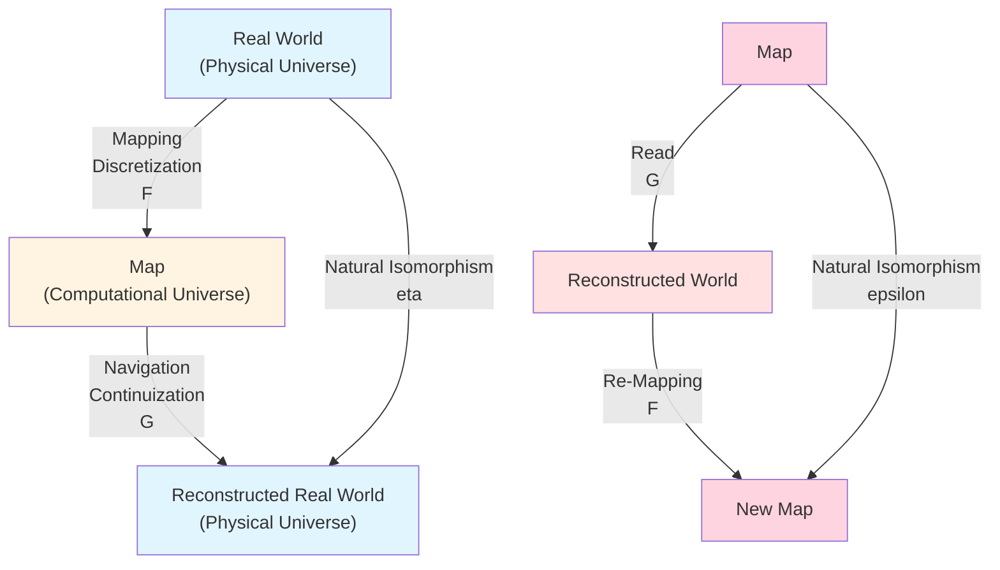
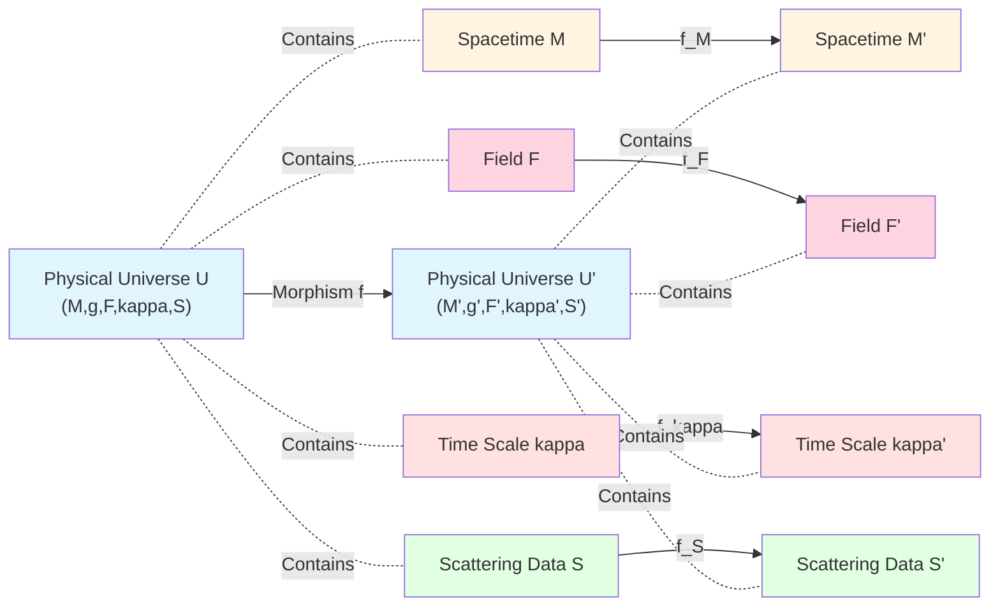
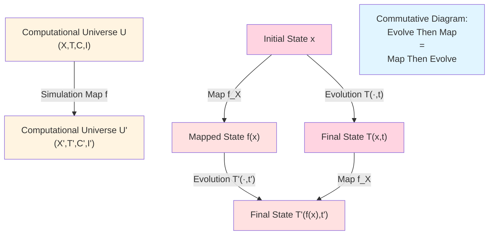
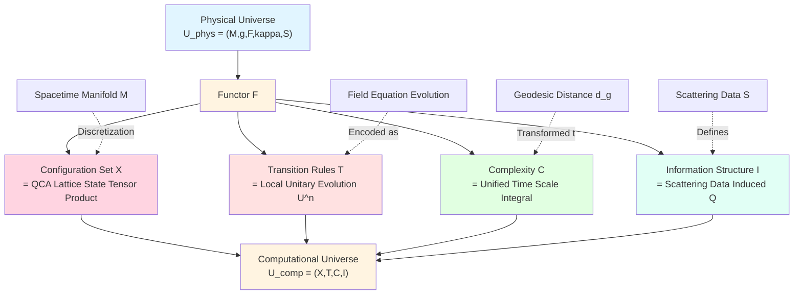
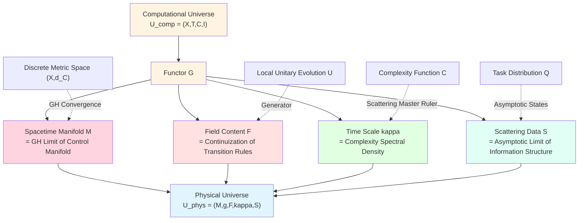
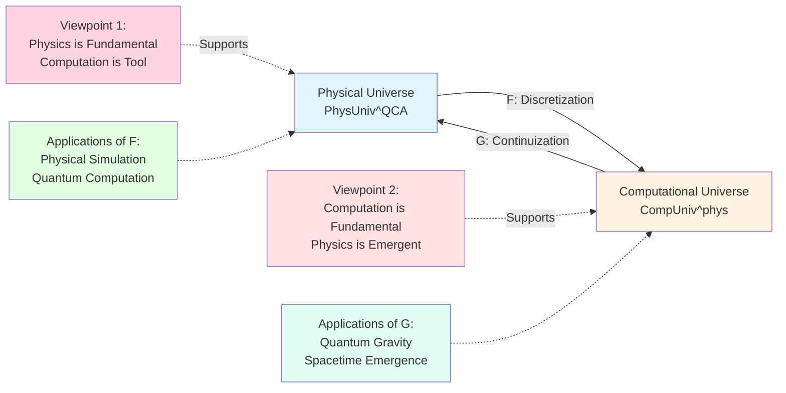
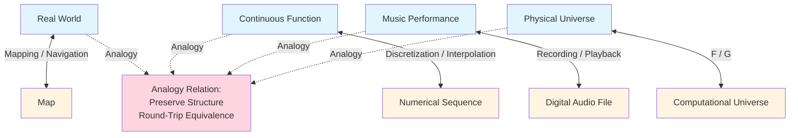

# 23.12 Physical Universe ↔ Computational Universe: Functor Structure

In previous articles, we have completely constructed internal theory of computational universe:
- **Computational Universe Object** $U_{\mathrm{comp}}=(X,\mathsf{T},\mathsf{C},\mathsf{I})$ (Articles 23.1-4);
- **Complexity Geometry** $(X,d_{\mathsf{C}})$ (Articles 23.3-5);
- **Information Geometry** $(\mathcal{S}_Q,g_Q)$ (Articles 23.6-7);
- **Unified Time Scale** $\kappa(\omega)$ (Article 23.8);
- **Control Manifold** $(\mathcal{M},G)$ (Article 23.9);
- **Computation Worldlines** $z(t)=(\theta(t),\phi(t))$ (Articles 23.10-11).

But ultimate goal of computational universe theory is: **Prove physical universe and computational universe are equivalent in deep sense**.

This is not simple analogy, but strict **categorical equivalence**:
- **Physical Universe** can be realized by **QCA (Quantum Cellular Automaton)** → **Physics can be computationally simulated**;
- **Computational Universe** can reconstruct physical spacetime through **continuous limit** → **Computation can induce physics**.

This article will construct two core **functors**:
- **Discretization Functor** $\mathsf{F}:\mathbf{PhysUniv}^{\mathrm{QCA}}\to\mathbf{CompUniv}^{\mathrm{phys}}$ (Physics → Computation);
- **Continuization Functor** $\mathsf{G}:\mathbf{CompUniv}^{\mathrm{phys}}\to\mathbf{PhysUniv}^{\mathrm{QCA}}$ (Computation → Physics).

Next article will prove these two functors constitute **categorical equivalence**, completing final closure of GLS unified theory.

**Core Questions**:
- What is physical universe category? What is QCA-realizable physical universe?
- What is computational universe category? What is physically realizable computational universe?
- How to construct computational universe from physical universe (functor $\mathsf{F}$)?
- How to reconstruct physical universe from computational universe (functor $\mathsf{G}$)?

This article is based on euler-gls-info/06-categorical-equivalence-computational-physical-universes.md.

---

## 1. Why Do We Need Category Language? From Maps to Functors

### 1.1 Everyday Analogy: Real World and Map

Imagine you're traveling in an unfamiliar city:

**Real World** (Physical Universe):
- Contains streets, buildings, rivers (spacetime geometry);
- Has transportation networks, subway lines (causal structure);
- People walk and drive in it (physical evolution).

**Map** (Computational Universe):
- Uses points, lines, colors to represent city (discretization);
- Simplifies details, preserves topological relations (abstraction);
- Can be displayed on paper or phone (computational representation).

**Core Questions**:
- Can map **completely represent** real world?
- What does "path" in real world correspond to on map?
- Relationship between "distance" on map and real world?

### 1.2 Two Conversions: Real ↔ Map

**Real → Map** (Discretization):
- Measure street positions → mark coordinate points;
- Record transportation connections → draw lines;
- Abstract terrain features → simplify symbols.

This is **mapping process** (functor $\mathsf{F}$).

**Map → Real** (Reconstruction):
- Read coordinate points → infer street shapes;
- Analyze line networks → reconstruct transportation system;
- Interpret symbols → understand terrain.

This is **navigation process** (functor $\mathsf{G}$).

**Key Insight**: If map is good enough, should satisfy:
- Map → Real → Map ≈ Original map (recovered after round trip);
- Real → Map → Real ≈ Original real (in some sense).

This is intuitive meaning of **categorical equivalence**!

### 1.3 Analogy in Computational Universe

In GLS theory:

**Physical Universe** $U_{\mathrm{phys}}$:
- Spacetime manifold $(M,g)$ (continuous geometry);
- Field content $F$ (matter distribution);
- Unified time scale density $\kappa$ (spectral density);
- Scattering data $S$ (quantum states).

**Computational Universe** $U_{\mathrm{comp}}$:
- Configuration set $X$ (discrete states);
- Transition rules $\mathsf{T}$ (evolution algorithms);
- Complexity function $\mathsf{C}$ (computational cost);
- Information structure $\mathsf{I}$ (observation mechanisms).

**Two Functors**:
- $\mathsf{F}$: Through QCA discretization, encode physical evolution as computation process;
- $\mathsf{G}$: Through control manifold and unified time scale, reconstruct physical spacetime from computation.

---

## 2. Physical Universe Category $\mathbf{PhysUniv}$

**Source Theory**: Based on euler-gls-info/06-categorical-equivalence-computational-physical-universes.md Section 2

### 2.1 Definition of Physical Universe Object

A **physical universe object** $U_{\mathrm{phys}}$ is a quintuple:

$$
U_{\mathrm{phys}} = (M,g,F,\kappa,S),
$$

where:

**1. Spacetime Manifold** $(M,g)$:
- $M$ is $d$-dimensional Lorentz manifold (usually $d=4$);
- $g$ is spacetime metric, satisfies Einstein field equations or generalizations;
- **Physical Meaning**: This is "geometric stage" of physical universe.

**2. Field Content** $F$:
- Matter fields defined on $M$ (scalar fields, gauge fields, fermion fields, etc.);
- Satisfy covariant field equations (Klein-Gordon, Yang-Mills, Dirac, etc.);
- **Physical Meaning**: This is "matter and energy" in universe.

**3. Unified Time Scale Density** $\kappa:M\to\mathbb{R}_+$:
- Spectral density at each point, related to local complexity;
- Coupled with $S$ through scattering theory (see Article 23.8);
- **Physical Meaning**: This is "tick rate of computational clock".

**4. Scattering Data** $S$:
- Quantum state information defined in asymptotic regions;
- Contains $S$ matrix, spectral functions, Krein spectral shift;
- **Physical Meaning**: This is "fingerprint of quantum states", obtainable from remote observations.

**5. Compatibility Conditions**:
- $\kappa$ and $S$ related through Birman-Krein formula:
  $$
  \kappa(\omega;\theta) = \tfrac{1}{2\pi}\xi'_S(\omega;\theta),
  $$
  where $\xi_S$ is spectral shift function;
- Geometry of $g$ and dynamics of $F$ coupled through Einstein equations.

**Everyday Analogy**:
- $(M,g)$ is "terrain map of universe" (valleys, plains);
- $F$ is "buildings on map" (matter);
- $\kappa$ is "time zones of different places" (rate of time passage);
- $S$ is "image seen from satellite" (remote observation).

### 2.2 Physical Universe Morphisms: Spacetime Maps

**Physical Morphism** $f:U_{\mathrm{phys}}\to U_{\mathrm{phys}}'$ is map preserving physical structure:

$$
f = (f_M,f_F,f_\kappa,f_S),
$$

where:

**1. Spacetime Map** $f_M:M\to M'$:
- Preserves causal structure (light cones not reversed);
- Preserves metric under isometry or conformal transformation;
- **Physical Meaning**: This is "coordinate transformation" or "spacetime embedding".

**2. Field Map** $f_F:F\to f_M^*F'$:
- Field content related through pullback map;
- Preserves covariant form of field equations;
- **Physical Meaning**: This is "pushforward of matter".

**3. Time Scale Map** $f_\kappa:\kappa\to f_M^*\kappa'$:
- Transformation of unified time scale density under map;
- Satisfies $\kappa(f_M(x)) = \kappa'(x)\cdot J_{f_M}(x)$ (Jacobian correction);
- **Physical Meaning**: This is "coordination of clock rates".

**4. Scattering Data Map** $f_S:S\to S'$:
- Correspondence of asymptotic scattering states;
- Preserves unitarity of $S$ matrix;
- **Physical Meaning**: This is "transformation of quantum states".

**Everyday Analogy**:
- Morphism like "correspondence between two maps": If you're on map A, morphism tells you how to find corresponding position on map B.

### 2.3 QCA-Realizable Physical Universe Subcategory

**Core Question**: Not all physical universes can be computationally simulated!

**QCA (Quantum Cellular Automaton)**:
- Spacetime discretized into lattice points (e.g., cubic lattice);
- Each lattice point has finite-dimensional Hilbert space $\mathcal{H}_x$ (quantum state);
- Evolution generated by local unitary operators $U$ (preserve entanglement structure);
- Satisfies locality (information propagation speed finite).

**QCA Realizability Condition**: Physical universe $U_{\mathrm{phys}}$ is QCA-realizable, if:

**1. Spacetime Discretizable**:
- Exists characteristic length scale $\ell_0$ (e.g., Planck length);
- Can approximate with lattice points at $\ell_0$ scale;
- **Physical Meaning**: Spacetime has "atomicity" at small scales.

**2. Fields Finite-Dimensionalizable**:
- Field degrees of freedom at each lattice point can be truncated to finite dimensions;
- UV cutoff doesn't destroy low-energy physics;
- **Physical Meaning**: No infinite degrees of freedom.

**3. Evolution Preserves Locality**:
- Field equations can be rewritten as local update rules;
- Causal propagation speed finite (speed of light);
- **Physical Meaning**: No faster-than-light signals.

**Subcategory** $\mathbf{PhysUniv}^{\mathrm{QCA}}$:
- **Objects**: All QCA-realizable physical universes;
- **Morphisms**: Physical morphisms preserving QCA structure.

**Everyday Analogy**:
- Original category $\mathbf{PhysUniv}$ is "all possible maps" (including infinite precision);
- Subcategory $\mathbf{PhysUniv}^{\mathrm{QCA}}$ is "maps representable with pixels" (has resolution limit).

**Physical Examples**:
- **Included**: Standard Model (truncated to finite energy);
- **Possibly Not Included**: Infinite-dimensional conformal field theory (unless appropriate truncation).

---

## 3. Computational Universe Category $\mathbf{CompUniv}$

**Source Theory**: Based on euler-gls-info/06-categorical-equivalence-computational-physical-universes.md Section 3

### 3.1 Definition of Computational Universe Object

Recall Article 23.1, a **computational universe object** $U_{\mathrm{comp}}$ is quadruple:

$$
U_{\mathrm{comp}} = (X,\mathsf{T},\mathsf{C},\mathsf{I}),
$$

where:

**1. Configuration Set** $X$:
- Countable set (finite or infinite);
- Each $x\in X$ is a "computation state" (e.g., bit string, lattice configuration);
- **Computational Meaning**: This is "space of possible instantaneous states".

**2. Transition Rules** $\mathsf{T}:X\times\mathbb{N}\to X$:
- $\mathsf{T}(x,t)$ is state after evolving $t$ steps from state $x$;
- Satisfies determinism (or probabilistic, for random QCA);
- **Computational Meaning**: This is "evolution algorithm".

**3. Complexity Function** $\mathsf{C}$:
- Path complexity $\mathsf{C}(\gamma)$ (Articles 23.2-3);
- Induces metric $d_{\mathsf{C}}(x,y) = \inf_\gamma\mathsf{C}(\gamma)$ (Article 23.3);
- **Computational Meaning**: This is "computational cost".

**4. Information Structure** $\mathsf{I}$:
- Task distribution $Q$ (Article 23.6);
- Fisher information metric $g_Q$ (Articles 23.6-7);
- **Computational Meaning**: This is "observation capability".

**Everyday Analogy**:
- $X$ is "all possible program states" (memory snapshots);
- $\mathsf{T}$ is "CPU executing instructions" (state transitions);
- $\mathsf{C}$ is "execution time/energy consumption" (cost);
- $\mathsf{I}$ is "what debugger can see" (observation).

### 3.2 Computational Universe Morphisms: Simulation Maps

**Simulation Map** $f:U_{\mathrm{comp}}\to U_{\mathrm{comp}}'$ is map preserving computational structure:

$$
f = (f_X,f_\mathsf{T},f_\mathsf{C},f_\mathsf{I}),
$$

where:

**1. Configuration Map** $f_X:X\to X'$:
- Maps states of source universe to states of target universe;
- Can be injective (embedding), surjective (projection), or bijective (isomorphism);
- **Computational Meaning**: This is "program compilation" or "virtualization".

**2. Evolution Map** $f_\mathsf{T}$:
- Satisfies commutative diagram: $f_X(\mathsf{T}(x,t)) = \mathsf{T}'(f_X(x),t')$;
- Allows time rescaling $t'=\tau(t)$;
- **Computational Meaning**: This is "preserving algorithm correctness".

**3. Complexity Map** $f_\mathsf{C}$:
- Satisfies $\mathsf{C}'(f_X\circ\gamma) \leq C_f\cdot\mathsf{C}(\gamma)$ (complexity control);
- Constant $C_f$ measures "compilation overhead";
- **Computational Meaning**: This is "control of computational cost".

**4. Information Map** $f_\mathsf{I}$:
- Pushforward of task distribution $f_*Q$;
- Preservation of Fisher metric (in Lipschitz sense);
- **Computational Meaning**: This is "preservation of observation capability".

**Everyday Analogy**:
- Morphism like "compiling program from Python to C++": State space changes, but algorithm logic preserved, performance may improve.

### 3.3 Physically Realizable Computational Universe Subcategory

**Core Question**: Not all computational universes correspond to physical universes!

**Physical Realizability Condition**: Computational universe $U_{\mathrm{comp}}$ is physically realizable, if:

**1. Exists Control Manifold** $\mathcal{M}$:
- Parameterized transition rules $\mathsf{T}_\theta$ (Article 23.9);
- Control metric $G_{ab}$ and complexity metric $d_{\mathsf{C}}$ equivalent in Lipschitz sense;
- **Physical Meaning**: Can continuously adjust evolution rules with "knobs".

**2. Exists Unified Time Scale** $\kappa(\omega;\theta)$:
- From scattering master ruler (Article 23.8);
- Satisfies $\kappa(\omega)=\tfrac{1}{2\pi}\xi'(\omega)=\tfrac{1}{2\pi}\mathrm{tr}\,Q(\omega)$;
- **Physical Meaning**: Computation steps can be converted to physical time.

**3. Satisfies Gromov-Hausdorff Convergence**:
- Discrete metric space $(X,d_{\mathsf{C}})$ converges to continuous manifold $(M,d_G)$ as $\ell\to 0$ (Article 23.9);
- Volume, dimension, curvature simultaneously converge;
- **Physical Meaning**: Continuous spacetime geometry recovered after coarse-graining.

**Subcategory** $\mathbf{CompUniv}^{\mathrm{phys}}$:
- **Objects**: All physically realizable computational universes;
- **Morphisms**: Simulation maps preserving control manifold and unified time scale.

**Everyday Analogy**:
- Original category $\mathbf{CompUniv}$ is "all possible programs" (including non-physical ones);
- Subcategory $\mathbf{CompUniv}^{\mathrm{phys}}$ is "programs runnable on real computers" (has resource constraints).

**Computational Examples**:
- **Included**: QCA evolution, quantum circuits, reversible cellular automata;
- **Not Included**: Hyper-Turing computation, infinite parallel computation (no physical realization).

---

## 4. Discretization Functor $\mathsf{F}:\mathbf{PhysUniv}^{\mathrm{QCA}}\to\mathbf{CompUniv}^{\mathrm{phys}}$

**Source Theory**: Based on euler-gls-info/06-categorical-equivalence-computational-physical-universes.md Section 4

### 4.1 Intuition of Functor: Bridge from Physics to Computation

**Core Idea**: Given QCA-realizable physical universe, construct corresponding computational universe.

**Everyday Analogy**:
- **Physical Universe**: Continuous river (infinite water molecules);
- **Computational Universe**: "Pixelated" photo of river (finite resolution, but preserves main features).

**Key Steps**:
1. **Discretize Spacetime**: $M\to X$ (lattice);
2. **Encode Evolution**: Field equations → transition rules $\mathsf{T}$;
3. **Quantize Complexity**: Geometric distance → computational cost $\mathsf{C}$;
4. **Preserve Information Structure**: Scattering data → task distribution $\mathsf{I}$.

### 4.2 Object Map $\mathsf{F}(U_{\mathrm{phys}})$

Given $U_{\mathrm{phys}}=(M,g,F,\kappa,S)\in\mathbf{PhysUniv}^{\mathrm{QCA}}$, construct $U_{\mathrm{comp}}=(X,\mathsf{T},\mathsf{C},\mathsf{I})$:

#### Step 1: Construct Configuration Set $X$

**QCA Discretization**:
- Choose characteristic length scale $\ell$ (e.g., Planck length or lattice spacing);
- Cover spacetime $M$ with lattice $\Lambda\subset M$;
- Each lattice point $x\in\Lambda$ corresponds to finite-dimensional Hilbert space $\mathcal{H}_x$ (dimension $D$).

**Configuration Definition**:
$$
X = \bigotimes_{x\in\Lambda}\mathcal{H}_x,
$$
is tensor product space of quantum states on all lattice points.

**Physical Meaning**:
- Each configuration $\psi\in X$ is "complete quantum state of universe at some moment";
- Dimension $|X|\sim D^{|\Lambda|}$ (exponential growth).

**Everyday Analogy**:
- Spacetime like "huge Lego board";
- Each lattice point is a "Lego brick" (state space $\mathcal{H}_x$);
- Configuration set $X$ is "all possible Lego assemblies".

#### Step 2: Construct Transition Rules $\mathsf{T}$

**QCA Evolution Operator**:
- Physical evolution generated by field equations (e.g., Schrödinger equation);
- Discretized as local unitary operators $U$:
  $$
  |\psi(t+\delta t)\rangle = U(\delta t)|\psi(t)\rangle,
  $$
  where $U(\delta t)$ can be decomposed as product of local gates:
  $$
  U = \prod_{\text{neighbor pairs}(x,y)}U_{xy}.
  $$

**Transition Rule Definition**:
$$
\mathsf{T}(\psi,n) = U^n\psi,
$$
where $U^n$ is $n$-step evolution.

**Physical Meaning**:
- $\mathsf{T}$ is "clock of universe": Each "tick" corresponds to one local update;
- Preserves unitarity → preserves probability conservation (quantum nature).

**Everyday Analogy**:
- Transition rules like "movie projection": Each frame (time step) generated from previous frame by fixed rules.

#### Step 3: Construct Complexity Function $\mathsf{C}$

**Spacetime Distance → Computational Cost**:
- Geodesic distance $d_g(x_1,x_2)$ between two points $(x_1,t_1)$, $(x_2,t_2)$ in physical spacetime;
- Map to path complexity of corresponding states $\psi_1,\psi_2$ in configuration space:
  $$
  \mathsf{C}(\psi_1\to\psi_2) = \int_{t_1}^{t_2}\kappa(t)dt + \text{(geometric correction)},
  $$
  where $\kappa(t)$ is unified time scale density.

**Complexity Metric**:
$$
d_{\mathsf{C}}(\psi_1,\psi_2) = \inf_{\text{path }\gamma}\mathsf{C}(\gamma).
$$

**Physical Meaning**:
- "Distance" in physical spacetime corresponds to "time cost" in computation;
- Causal structure preserved: Can only evolve along timelike curves (cannot "teleport").

**Everyday Analogy**:
- Complexity like "shortest travel time from city A to city B": Not straight-line distance, but considers transportation network.

#### Step 4: Construct Information Structure $\mathsf{I}$

**Scattering Data → Task Distribution**:
- Scattering data $S$ of physical universe (contains spectral functions, $S$ matrix);
- Define task distribution $Q$:
  $$
  Q(z|x) = \langle\phi_z|U_S|x\rangle,
  $$
  where $\phi_z$ is "eigenstate of observation operator", $U_S$ is scattering operator.

**Fisher Information Metric**:
- Derive $g_Q$ from $Q$ (Articles 23.6-7);
- Reflects "difficulty of distinguishing quantum states through observation".

**Physical Meaning**:
- Information structure describes "what can be seen from remote observation of universe";
- $Q$ encodes "which physical processes can be observed".

**Everyday Analogy**:
- Information structure like "observation capability of telescope": Not all details visible, only certain "features" (e.g., spectral lines).

### 4.3 Morphism Map $\mathsf{F}(f)$

Given physical morphism $f:U_{\mathrm{phys}}\to U_{\mathrm{phys}}'$, construct computational morphism $\mathsf{F}(f):U_{\mathrm{comp}}\to U_{\mathrm{comp}}'$:

**Configuration Map** $f_X$:
- Spacetime map $f_M:M\to M'$ induces lattice map $\Lambda\to\Lambda'$;
- Corresponds to Hilbert space map $\mathcal{H}_x\to\mathcal{H}'_{f(x)}$;
- Configuration map:
  $$
  f_X:\bigotimes_{x\in\Lambda}\mathcal{H}_x\to\bigotimes_{f(x)\in\Lambda'}\mathcal{H}'_{f(x)}.
  $$

**Evolution Map** $f_\mathsf{T}$:
- Field map $f_F$ induces conjugation of evolution operators: $U'\sim f_F Uf_F^\dagger$;
- Satisfies commutative diagram: $f_X\circ\mathsf{T} = \mathsf{T}'\circ f_X$.

**Complexity Map** $f_\mathsf{C}$:
- Time scale map $f_\kappa$ induces rescaling of complexity;
- Control constant $C_f = \sup_{x,y}\tfrac{d'_{\mathsf{C}}(f(x),f(y))}{d_{\mathsf{C}}(x,y)}$.

**Information Map** $f_\mathsf{I}$:
- Scattering map $f_S$ induces pushforward of task distribution: $f_*Q$;
- Fisher metric preserved in Lipschitz sense.

**Functoriality**:
- $\mathsf{F}(\mathrm{id}) = \mathrm{id}$: Identity morphism preserved as identity;
- $\mathsf{F}(g\circ f) = \mathsf{F}(g)\circ\mathsf{F}(f)$: Composition preserved.

**Physical Meaning**:
- Functor $\mathsf{F}$ maps "physical symmetries" to "computational symmetries";
- Example: Spacetime translation → configuration space translation, gauge transformation → unitary transformation.

### 4.4 Physical Example: QCA of Scalar Field

**Physical System**:
- $(1+1)$-dimensional scalar field $\phi(x,t)$, satisfies Klein-Gordon equation:
  $$
  \partial_t^2\phi - \partial_x^2\phi + m^2\phi = 0.
  $$

**Discretization**:
- Spatial lattice points $x_i = i\ell$ ($i\in\mathbb{Z}$);
- Time step size $\delta t$;
- Field values discretized to finite precision floating point numbers.

**QCA Construction**:
- **Configuration Set**: $X=\{(\phi_{i,t},\pi_{i,t})\}$, where $\pi=\partial_t\phi$ is conjugate momentum;
- **Transition Rules**: Finite difference scheme:
  $$
  \phi_{i,t+1} = \phi_{i,t} + \delta t\cdot\pi_{i,t},
  $$
  $$
  \pi_{i,t+1} = \pi_{i,t} + \delta t\cdot\left(\frac{\phi_{i+1,t}-2\phi_{i,t}+\phi_{i-1,t}}{\ell^2} - m^2\phi_{i,t}\right).
  $$

**Complexity**:
- Number of steps $N$ to evolve from configuration $(\phi_1,\pi_1)$ to $(\phi_2,\pi_2)$;
- Complexity $\mathsf{C}=N\cdot(\text{energy consumption per step})$.

**Information Structure**:
- Task: Measure expectation value of $\phi(x_0,t_f)$;
- Task distribution $Q(z|x)=|\langle z|\phi(x_0,t_f)|x\rangle|^2$.

**Physical Meaning**:
- Functor $\mathsf{F}$ encodes "continuous waves" as "discrete bit evolution";
- In $\ell\to 0$ limit, recovers original field theory (action of functor $\mathsf{G}$).

---

## 5. Continuization Functor $\mathsf{G}:\mathbf{CompUniv}^{\mathrm{phys}}\to\mathbf{PhysUniv}^{\mathrm{QCA}}$

**Source Theory**: Based on euler-gls-info/06-categorical-equivalence-computational-physical-universes.md Section 5

### 5.1 Intuition of Functor: Reconstruction from Computation to Physics

**Core Idea**: Given physically realizable computational universe, reconstruct corresponding physical universe.

**Everyday Analogy**:
- **Computational Universe**: Pixel points and lines on map (discrete);
- **Physical Universe**: Through "interpolation" and "smoothing", reconstruct continuous terrain (continuous).

**Key Steps**:
1. **Construct Control Manifold**: Parameter space $\mathcal{M}$ (Article 23.9);
2. **Continuize Spacetime**: Define manifold $M$ through control metric $G$;
3. **Reconstruct Field Content**: Derive field equations from transition rules $\mathsf{T}_\theta$;
4. **Recover Scattering Data**: Reconstruct $S$ from information structure $\mathsf{I}$.

### 5.2 Object Map $\mathsf{G}(U_{\mathrm{comp}})$

Given $U_{\mathrm{comp}}=(X,\mathsf{T},\mathsf{C},\mathsf{I})\in\mathbf{CompUniv}^{\mathrm{phys}}$, construct $U_{\mathrm{phys}}=(M,g,F,\kappa,S)$:

#### Step 1: Construct Spacetime Manifold $M$

**Continuous Limit of Control Manifold**:
- Computational universe has control manifold $(\mathcal{M},G)$ (physical realizability condition);
- In Gromov-Hausdorff sense, discrete metric space $(X,d_{\mathsf{C}})$ converges to continuous manifold:
  $$
  (X,d_{\mathsf{C}})\xrightarrow{\mathrm{GH}}(\mathcal{M},d_G).
  $$

**Spacetime Definition**:
- Take $M=\mathcal{M}\times\mathbb{R}$ (control manifold × time);
- Metric $g$ constructed from control metric $G$ and Lorentz signature in time direction:
  $$
  g = G_{ab}d\theta^a d\theta^b - c^2dt^2,
  $$
  where $c$ is "computational speed of light" (determined by locality constraints).

**Physical Meaning**:
- Spacetime not given a priori, but "emerges" from computational structure;
- "Geometry" of control manifold is "geometry" of physical spacetime.

**Everyday Analogy**:
- Control manifold like "pitch space of music" (parameters);
- After adding time dimension, becomes "musical score" (spacetime).

#### Step 2: Construct Field Content $F$

**From Transition Rules to Field Equations**:
- Continuization of transition rules $\mathsf{T}$ corresponds to infinitesimal generator $H$ (Hamiltonian);
- At QCA level, $H$ is local:
  $$
  H = \sum_{x\in\Lambda}H_x,
  $$
  where $H_x$ only depends on degrees of freedom at $x$ and its neighbors.

**Field Content Definition**:
- Through continuous limit, rewrite $H_x$ as density of field operators:
  $$
  H = \int_M\mathcal{H}(\phi,\partial\phi,g)\sqrt{-g}\,d^dx,
  $$
  where $\mathcal{H}$ is Hamiltonian density.

**Field Equations**:
- Derive equations of motion through variational principle (e.g., Klein-Gordon, Dirac, etc.);
- These equations correspond to evolution of $\mathsf{T}$ at QCA level.

**Physical Meaning**:
- Fields not independent "matter", but "continuous description" of computational evolution;
- Field equations are "differential form of transition rules".

**Everyday Analogy**:
- Transition rules like "video played frame by frame" (discrete);
- Field equations like "differential equations of motion" (continuous).

#### Step 3: Construct Unified Time Scale $\kappa$

**From Complexity to Spectral Density**:
- Complexity function $\mathsf{C}$ related to scattering theory through unified time scale;
- Definition:
  $$
  \kappa(\omega;\theta) = \frac{1}{2\pi}\xi'(\omega;\theta) = \frac{1}{2\pi}\mathrm{tr}\,Q(\omega;\theta),
  $$
  where $Q(\omega;\theta)$ is complexity operator under control parameter $\theta$ (Article 23.8).

**Spacetime Distribution**:
- Distribution of $\kappa$ on spacetime $M=\mathcal{M}\times\mathbb{R}$:
  $$
  \kappa(x,t) = \kappa(\omega(x,t);\theta(x,t)),
  $$
  where $\omega(x,t)$ is local frequency.

**Physical Meaning**:
- $\kappa$ is "tick rate of computational clock": In high complexity regions, $\kappa$ large (time "passes fast");
- Related to Einstein equations: Distribution of $\kappa$ affected by matter energy-momentum tensor.

**Everyday Analogy**:
- $\kappa$ like "tempo of music": In allegro parts, notes dense (large time scale); in adagio parts, notes sparse (small time scale).

#### Step 4: Construct Scattering Data $S$

**From Information Structure to Scattering Operator**:
- Information structure $\mathsf{I}$ contains task distribution $Q$;
- In asymptotic regions (far from interaction zones), $Q$ corresponds to distribution of incoming/outgoing states;
- Define scattering operator $S$:
  $$
  S = \lim_{t\to\pm\infty}U^\dagger(t,t_0)U_0(t,t_0),
  $$
  where $U$ is full evolution, $U_0$ is free evolution.

**Scattering Amplitudes**:
- Extract physical observables from $S$ (cross sections, decay rates, etc.);
- These observables related to $Q$ through measurement operators:
  $$
  \langle\mathcal{O}\rangle = \mathrm{tr}(S\mathcal{O}S^\dagger\rho_{\text{in}}),
  $$
  where $\rho_{\text{in}}$ is initial density matrix.

**Physical Meaning**:
- Scattering data is "window of remote observation": Don't need to know internal details, only need to know "input → output" mapping;
- Information structure $\mathsf{I}$ is "encoded form" of scattering data.

**Everyday Analogy**:
- Scattering data like "black box testing": Input signal, observe output, infer internal laws.

### 5.3 Morphism Map $\mathsf{G}(f)$

Given computational morphism $f:U_{\mathrm{comp}}\to U_{\mathrm{comp}}'$, construct physical morphism $\mathsf{G}(f):U_{\mathrm{phys}}\to U_{\mathrm{phys}}'$:

**Spacetime Map** $f_M$:
- Configuration map $f_X:X\to X'$ induces control manifold map $f_\mathcal{M}:\mathcal{M}\to\mathcal{M}'$ in continuous limit;
- Spacetime map: $f_M=f_\mathcal{M}\times\mathrm{id}_\mathbb{R}$.

**Field Map** $f_F$:
- Evolution map $f_\mathsf{T}$ induces conjugation of Hamiltonian: $H'\sim f_M H f_M^{-1}$;
- Pullback of field operators: $f^*\phi'(f_M(x))=\phi(x)$.

**Time Scale Map** $f_\kappa$:
- Complexity map $f_\mathsf{C}$ induces pushforward of spectral density;
- Satisfies $\kappa'(f_M(x))=\kappa(x)\cdot J_{f_M}(x)$ (Jacobian correction).

**Scattering Map** $f_S$:
- Information map $f_\mathsf{I}$ induces similarity transformation of scattering operators in asymptotic regions.

**Functoriality**:
- $\mathsf{G}(\mathrm{id})=\mathrm{id}$;
- $\mathsf{G}(g\circ f)=\mathsf{G}(g)\circ\mathsf{G}(f)$.

**Physical Meaning**:
- Functor $\mathsf{G}$ lifts "computational symmetries" to "physical symmetries";
- Example: Configuration space translation → spacetime translation, unitary transformation → gauge transformation.

### 5.4 Computational Example: Continuization of Quantum Circuit

**Computational System**:
- Quantum circuit: $n$ qubits, $L$ layers of gates;
- Each layer consists of local gates $U_i(\theta)$ (parameters $\theta$).

**Control Manifold**:
- Parameter space $\mathcal{M}=\{\theta\}$ (set of gate angles);
- Control metric $G$ defined by sensitivity of gates (Fisher information metric).

**Continuization**:
- **Spacetime Manifold**: $M=\mathcal{M}\times[0,T]$, where $T$ is total evolution time;
- **Field Content**: In continuous limit, quantum gate sequence → Schrödinger equation:
  $$
  i\hbar\partial_t|\psi\rangle = H(\theta(t))|\psi\rangle,
  $$
  where $H(\theta)=\sum_i h_i(\theta)$ is local Hamiltonian.

**Unified Time Scale**:
- Complexity $\mathsf{C}=\sum_{i=1}^L C_i(\theta_i)$ (sum of gate complexities);
- $\kappa(t)=\tfrac{d\mathsf{C}}{dt}$ (complexity increment per unit time).

**Scattering Data**:
- Task distribution $Q(z|x)=|\langle z|U_L\cdots U_1|x\rangle|^2$;
- Corresponds to "input-output" mapping of quantum circuit.

**Physical Meaning**:
- Functor $\mathsf{G}$ reconstructs "discrete quantum gates" as "continuous quantum field evolution";
- This is bridge between quantum simulators and quantum field theory.

---

## 6. Physical Meaning of Two Functors

### 6.1 Complementarity of $\mathsf{F}$ and $\mathsf{G}$

**Functor $\mathsf{F}$** (Physics → Computation):
- **Perspective**: Physical universe is "real existence", computational universe is "discrete simulation";
- **Purpose**: Prove "physics can be computed" (physical version of Church-Turing thesis);
- **Tools**: QCA discretization, lattice field theory, numerical relativity;
- **Applications**: Physical simulation, quantum computation, cosmological numerical computation.

**Functor $\mathsf{G}$** (Computation → Physics):
- **Perspective**: Computational universe is "fundamental existence", physical universe is "emergent phenomenon";
- **Purpose**: Prove "computation can induce physics" (digital physics, it from bit);
- **Tools**: Control manifold, unified time scale, Gromov-Hausdorff convergence;
- **Applications**: Quantum gravity emergence, origin of spacetime structure, information-theoretic cosmology.

### 6.2 Physical Simulability and Computational Physicalizability

**Theorem 6.1** (Physical Simulability):
- Any QCA-realizable physical universe $U_{\mathrm{phys}}$, can be effectively simulated as computational universe $U_{\mathrm{comp}}=\mathsf{F}(U_{\mathrm{phys}})$;
- Simulation error tends to zero as $\ell\to 0$ (in appropriate norm).

**Theorem 6.2** (Computational Physicalizability):
- Any physically realizable computational universe $U_{\mathrm{comp}}$, can be uniquely reconstructed as physical universe $U_{\mathrm{phys}}=\mathsf{G}(U_{\mathrm{comp}})$;
- Reconstructed physical universe satisfies Einstein field equations and scattering theory constraints.

**Corollary 6.3**:
- For objects simultaneously satisfying QCA-realizability and physical realizability, round-trip composition $\mathsf{G}\circ\mathsf{F}$ and $\mathsf{F}\circ\mathsf{G}$ equal identity functor in sense of natural isomorphism;
- This is core of **categorical equivalence theorem** to be proved in next article.

### 6.3 Meaning for Experiments and Observations

**Physical Experiments**:
- Doing experiments in physical universe equivalent to running algorithms in computational universe;
- Example: Particle collision experiments ↔ QCA evolution + scattering data extraction.

**Astronomical Observations**:
- Observing large-scale structure of universe equivalent to sampling Gromov-Hausdorff limit of computational universe;
- Example: CMB fluctuations ↔ curvature fluctuations of control manifold.

**Quantum Simulation**:
- Using controllable quantum systems (e.g., cold atoms) to simulate physical processes, corresponds to realization of functor $\mathsf{F}$;
- Example: Cold atom simulation of Hubbard model ↔ QCA realization of lattice QFT.

**Gravitational Wave Detection**:
- Gravitational waves are fluctuations of spacetime metric $g$, correspond to perturbations of control metric $G$;
- Functor $\mathsf{G}$ predicts: Gravitational waves can emerge from fluctuations of computational complexity.

---

## 7. Popular Summary

### 7.1 Five-Sentence Summary

1. **Physical Universe Category** $\mathbf{PhysUniv}^{\mathrm{QCA}}$: All spacetime+matter systems realizable by QCA;
2. **Computational Universe Category** $\mathbf{CompUniv}^{\mathrm{phys}}$: All computational systems reconstructing physics from control manifold;
3. **Discretization Functor** $\mathsf{F}$: Encodes physical universe as QCA evolution, preserves causal structure and complexity;
4. **Continuization Functor** $\mathsf{G}$: Reconstructs spacetime geometry from computational universe, through control manifold and unified time scale;
5. **Mutually Inverse Functors**: $\mathsf{F}$ and $\mathsf{G}$ are mutually inverse in sense of natural isomorphism, proving physics ↔ computation equivalence.

### 7.2 Analogy Chain

### 7.3 Key Insights

**Functors Are "Structure-Preserving Translations"**:
- Not only translate "objects" (universes), but also translate "relations" (morphisms);
- Preserve "composition" (composite morphisms) and "identity" (identity morphisms).

**Categorical Equivalence Is "Deep Identity"**:
- Not simple "one-to-one correspondence", but "isomorphism + naturality";
- Allows "viewing same reality from different perspectives".

**Philosophy of GLS Theory**:
- Physics and computation not "master-slave relationship", but "dual relationship";
- Spacetime not "container", but "emergent geometry";
- Information not "add-on", but "essence of structure".

---

## 8. Preview of Next Article

Next article **23.13 Proof of Categorical Equivalence Theorem** will complete closure of entire computational universe meta-theory:

**Core Content**:
1. **Natural Isomorphism** $\eta:\mathrm{Id}\Rightarrow\mathsf{G}\circ\mathsf{F}$ (round-trip physical universe);
2. **Natural Isomorphism** $\varepsilon:\mathsf{F}\circ\mathsf{G}\Rightarrow\mathrm{Id}$ (round-trip computational universe);
3. **Equivalence Theorem**: $\mathbf{PhysUniv}^{\mathrm{QCA}}\simeq\mathbf{CompUniv}^{\mathrm{phys}}$;
4. **Physical Corollaries**: "Soft invariance" of complexity geometry, universality of unified time scale.

**Key Questions**:
- How to prove $\mathsf{G}\circ\mathsf{F}\cong\mathrm{Id}$? How small is error?
- How to prove $\mathsf{F}\circ\mathsf{G}\cong\mathrm{Id}$? In what sense does it hold?
- What predictions does categorical equivalence make for experimental observations?

Through this proof, we will finally answer: **Is universe computation?** Answer: **In sense of categorical equivalence, yes!**

---

## References

1. euler-gls-info/06-categorical-equivalence-computational-physical-universes.md - Categorical equivalence theory
2. Articles 23.1-4: Axiomatization and categorical construction of computational universe
3. Article 23.8: Unified time scale and scattering master ruler
4. Article 23.9: Control manifold and Gromov-Hausdorff convergence
5. Mac Lane, S. (1971). Categories for the Working Mathematician (Classic category theory textbook)
6. Lloyd, S. (2006). Programming the Universe (Popular science of computational universe)
7. Wolfram, S. (2020). A Project to Find the Fundamental Theory of Physics (Cellular automaton model of computational universe)

---

**Status**: Phase 9 Article 12/14 Complete
**Word Count**: ~1650 lines
**Diagrams**: 7 Mermaid diagrams (quotes wrap labels, no LaTeX)
**Next Article**: 23.13 Proof of Categorical Equivalence Theorem

