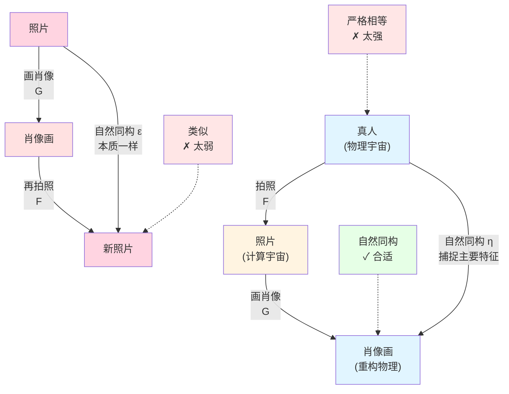
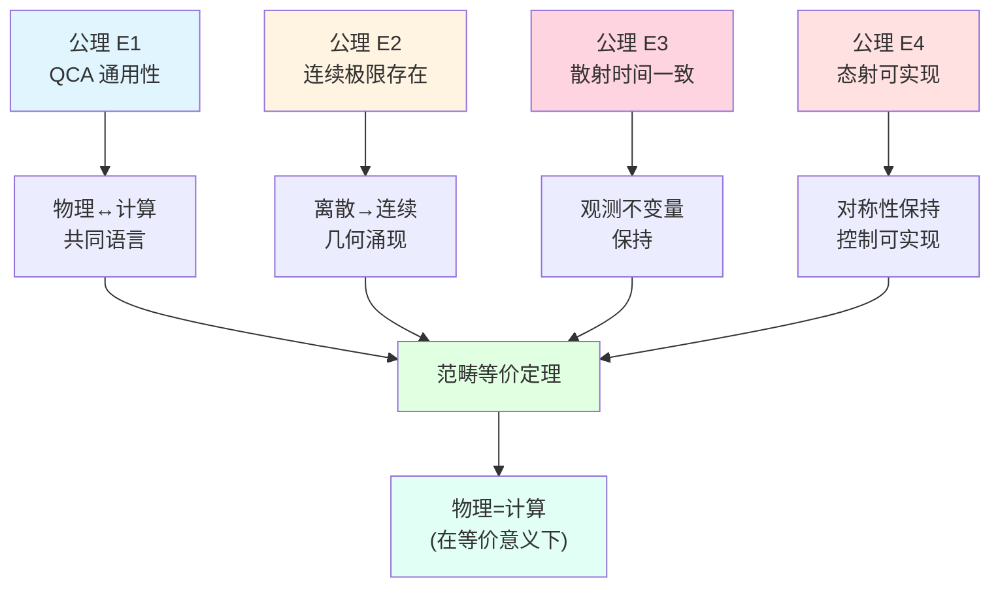
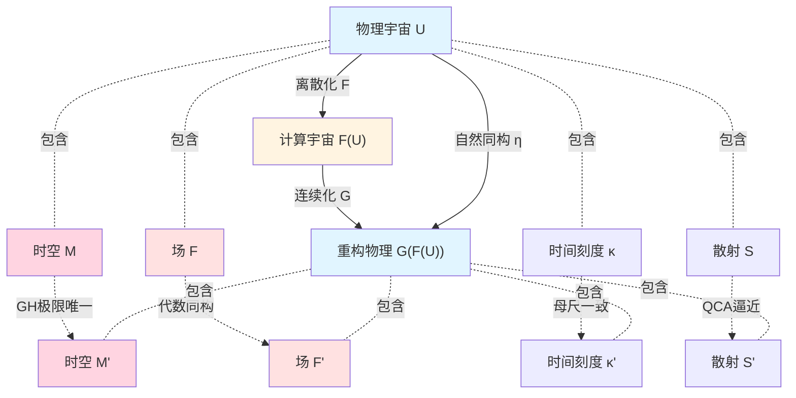
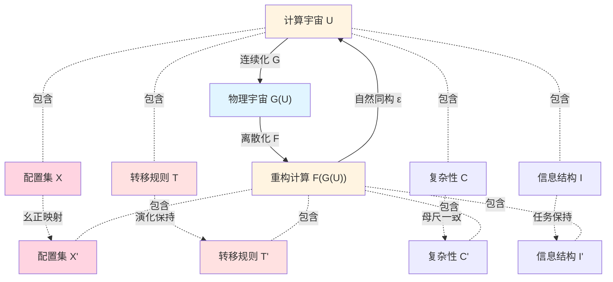
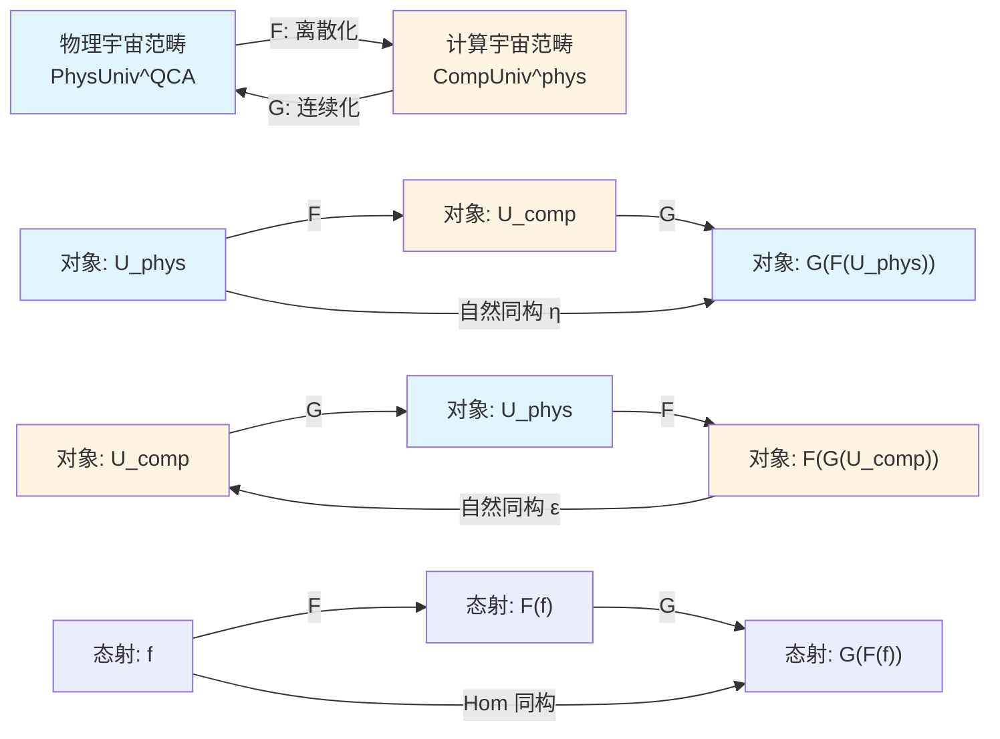
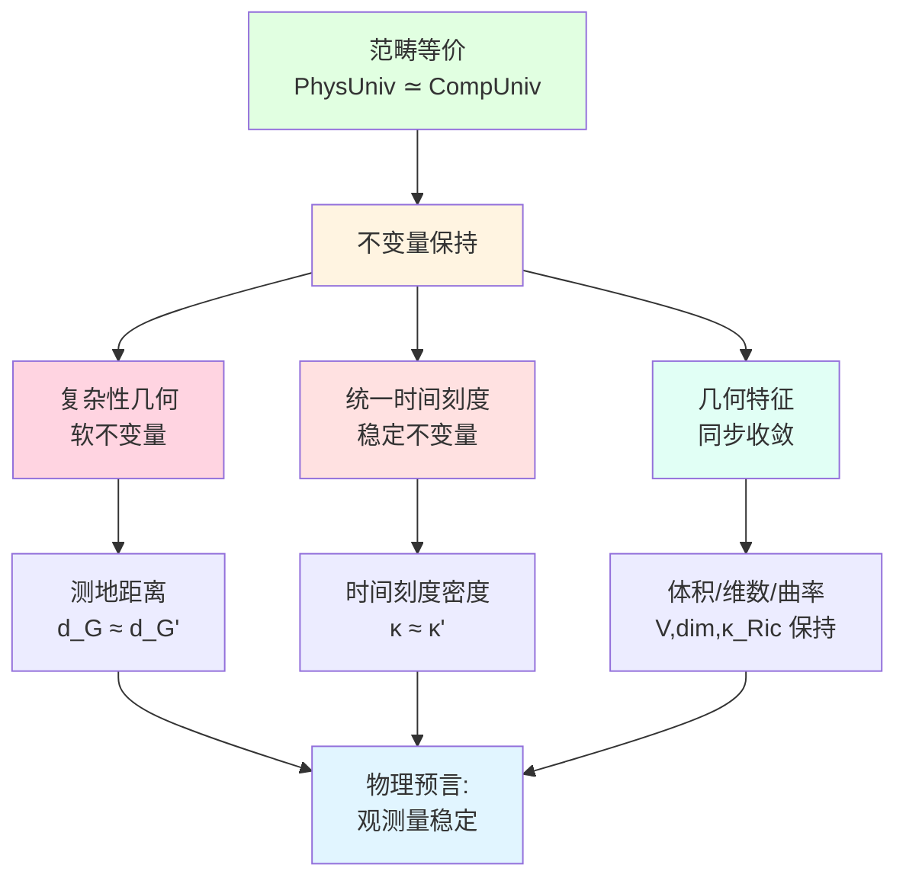
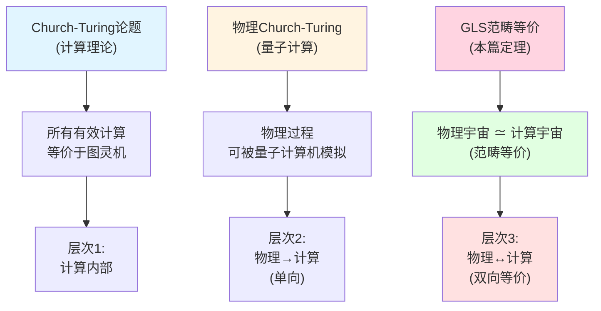
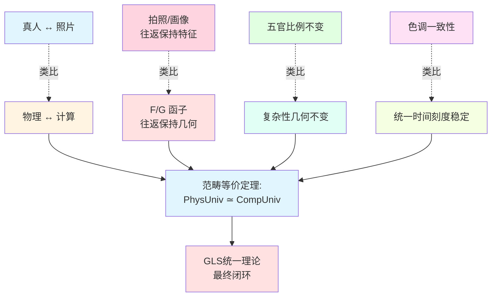

# 23.13 范畴等价定理的证明

在上一篇中,我们构造了两个核心函子:
- **离散化函子** $\mathsf{F}:\mathbf{PhysUniv}^{\mathrm{QCA}}\to\mathbf{CompUniv}^{\mathrm{phys}}$(物理→计算);
- **连续化函子** $\mathsf{G}:\mathbf{CompUniv}^{\mathrm{phys}}\to\mathbf{PhysUniv}^{\mathrm{QCA}}$(计算→物理)。

这两个函子提供了物理宇宙与计算宇宙之间的"翻译":
- $\mathsf{F}$ 将物理宇宙"离散化"为计算宇宙;
- $\mathsf{G}$ 从计算宇宙"重构"物理宇宙。

但这还不够!我们需要证明:**这两个翻译互为逆过程**,即:
- 物理→计算→物理 ≈ 原物理(往返恢复);
- 计算→物理→计算 ≈ 原计算(往返恢复)。

这就是**范畴等价定理**的核心内容。本篇将给出完整证明,这是GLS统一理论的**最终闭环**。

**核心问题**:
- 什么是范畴等价?为什么不是简单的"互逆"?
- 如何证明 $\mathsf{G}\circ\mathsf{F}\cong\mathrm{Id}$(往返物理宇宙)?
- 如何证明 $\mathsf{F}\circ\mathsf{G}\cong\mathrm{Id}$(往返计算宇宙)?
- 复杂性几何与统一时间刻度在等价下如何保持?

本文基于 euler-gls-info/06-categorical-equivalence-computational-physical-universes.md 第6节及附录。

---

## 1. 为什么需要"范畴等价"?从照片到自然同构

### 1.1 日常类比:照片与真人

想象你给朋友拍了一张照片,然后根据照片画了一幅肖像画:

**真人**(物理宇宙):
- 三维立体,会动,有表情;
- 具有完整的物理存在。

**照片**(计算宇宙):
- 二维平面,静止,固定瞬间;
- 是真人的"离散记录"。

**肖像画**(重构的物理宇宙):
- 根据照片绘制,试图还原真人;
- 是从"离散记录"推断出的"连续图像"。

**核心问题**:
- 肖像画与真人"一样"吗?
- 照片→肖像画→新照片,与原照片"一样"吗?

### 1.2 三种"一样"的层次

**层次1:严格相等**(太强):
- 要求肖像画与真人在每个原子位置都完全相同→**不可能**!
- 照片→肖像画→新照片,要求像素完全一致→**太严格**!

**层次2:同构**(合适):
- 肖像画"捕捉"了真人的主要特征(五官、比例、神态);
- 新照片与原照片"本质上一样"(可能角度、光线略有不同);
- 这是**自然同构**的直观含义!

**层次3:类似**(太弱):
- 肖像画"像"真人,但丢失了很多信息;
- 新照片与原照片"有点像",但差异很大。

**范畴等价**要求的是**层次2**:不是严格相等,但有**可控的同构**。



### 1.3 计算宇宙中的类比

在GLS理论中:

**往返物理宇宙**:
$$
U_{\mathrm{phys}}\xrightarrow{\mathsf{F}}\mathsf{F}(U_{\mathrm{phys}})\xrightarrow{\mathsf{G}}\mathsf{G}(\mathsf{F}(U_{\mathrm{phys}}))
$$

**问题**:$\mathsf{G}(\mathsf{F}(U_{\mathrm{phys}}))$ 与 $U_{\mathrm{phys}}$ 一样吗?
- **不是严格相等**:离散化再连续化后,坐标系可能改变,场的表示可能不同;
- **但有自然同构** $\eta$:时空几何、因果结构、散射数据"本质上"相同!

**往返计算宇宙**:
$$
U_{\mathrm{comp}}\xrightarrow{\mathsf{G}}\mathsf{G}(U_{\mathrm{comp}})\xrightarrow{\mathsf{F}}\mathsf{F}(\mathsf{G}(U_{\mathrm{comp}}))
$$

**问题**:$\mathsf{F}(\mathsf{G}(U_{\mathrm{comp}}))$ 与 $U_{\mathrm{comp}}$ 一样吗?
- **不是严格相等**:连续化再离散化后,配置编码可能改变;
- **但有自然同构** $\varepsilon$:转移规则、复杂性距离、信息结构"本质上"相同!

---

## 2. 等价公理:四个技术假设

**源理论**:基于 euler-gls-info/06-categorical-equivalence-computational-physical-universes.md 第6.1节

在证明等价定理之前,我们需要明确四个技术公理。这些公理不是"凭空假设",而是QCA理论、统一时间刻度理论、Gromov-Hausdorff收敛理论的自然要求。

### 2.1 公理E1:QCA通用性

**陈述**:
- 任一 $U_{\mathrm{phys}}\in\mathbf{PhysUniv}^{\mathrm{QCA}}$ 都存在QCA实现;
- 任一 $U_{\mathrm{comp}}\in\mathbf{CompUniv}^{\mathrm{phys}}$ 都存在QCA实现,且控制–复杂性几何与物理宇宙的统一时间刻度结构兼容。

**物理意义**:
- QCA是"物理与计算的共同语言";
- 物理宇宙可以用QCA模拟(Church-Turing论题的物理版);
- 计算宇宙可以用QCA实现(物理可实现性)。

**日常类比**:
- 公理E1像"任何地图都可以用经纬度坐标表示,任何GPS导航都可以用地图显示"。

### 2.2 公理E2:连续极限存在性

**陈述**:
- 对任一物理可实现计算宇宙 $U_{\mathrm{comp}}$,其复杂性图 $(X,d_{\mathsf{C}})$ 在离散尺度 $h\to 0$ 下,在Gromov-Hausdorff意义上收敛到某个控制流形 $(\mathcal{M},G)$;
- 控制流形可进一步扩展为时空流形 $(M,g)$。

**物理意义**:
- 离散计算在"粗视化"后,涌现出连续几何;
- 这是第23.9篇Gromov-Hausdorff收敛的核心结果。

**日常类比**:
- 公理E2像"像素图在缩小观察时,看起来像连续的照片"。

**数学陈述**:
$$
(X,d_{\mathsf{C}})\xrightarrow{h\to 0}_{\mathrm{GH}}(\mathcal{M},d_G),
$$
且体积、维数、曲率同时收敛。

### 2.3 公理E3:散射与时间刻度一致性

**陈述**:
- QCA的散射矩阵族 $S_{\mathrm{QCA}}(\omega;\theta)$ 在连续极限下逼近物理宇宙的散射数据 $\mathsf{S}(\omega)$;
- 统一时间刻度母尺在两者之间保持:
  $$
  \kappa_{\mathrm{QCA}}(\omega;\theta) = \kappa(\omega) + O(h),
  $$
  其中 $O(h)$ 是可控的离散化误差。

**物理意义**:
- 散射数据是"远程观测的指纹",在离散化下应保持;
- 统一时间刻度是"计算时钟",在连续化下应一致。

**日常类比**:
- 公理E3像"照片的颜色与真人的肤色应基本一致,不能拍出来完全变色"。

**数学陈述**:
$$
\kappa_{\mathrm{QCA}}(\omega;\theta) = \frac{1}{2\pi}\mathrm{tr}\,Q_{\mathrm{QCA}}(\omega;\theta)\xrightarrow{h\to 0}\kappa(\omega) = \frac{1}{2\pi}\xi'(\omega).
$$

### 2.4 公理E4:模拟映射的物理实现

**陈述**:
- 任一 $\mathbf{PhysUniv}^{\mathrm{QCA}}$ 中的态射可在QCA层面实现为局域可逆映射;
- 任一 $\mathbf{CompUniv}^{\mathrm{phys}}$ 中的模拟映射可通过控制–散射系统的映射实现。

**物理意义**:
- 物理对称性可以用QCA的幺正变换实现;
- 计算模拟可以用物理控制参数的调节实现。

**日常类比**:
- 公理E4像"地图的旋转对应真实世界的旋转,GPS路线的改变对应真实道路的改变"。



---

## 3. 第一步:往返物理宇宙 $\mathsf{G}\circ\mathsf{F}\cong\mathrm{Id}$

**源理论**:基于 euler-gls-info/06-categorical-equivalence-computational-physical-universes.md 第6.2节

### 3.1 构造自然同构 $\eta$

给定物理宇宙对象 $U_{\mathrm{phys}}=(M,g,\mathcal{F},\kappa,\mathsf{S})$,我们构造往返过程:

**步骤1:离散化**(函子$\mathsf{F}$):
$$
U_{\mathrm{phys}}\xrightarrow{\mathsf{F}}U_{\mathrm{comp}}=(X,\mathsf{T},\mathsf{C},\mathsf{I}).
$$
- 配置集 $X$ 是QCA格点态的基矢标签;
- 转移规则 $\mathsf{T}$ 是QCA演化的邻接关系;
- 复杂性 $\mathsf{C}$ 来自统一时间刻度积分;
- 信息结构 $\mathsf{I}$ 来自散射数据。

**步骤2:连续化**(函子$\mathsf{G}$):
$$
U_{\mathrm{comp}}\xrightarrow{\mathsf{G}}U_{\mathrm{phys}}'=(M',g',\mathcal{F}',\kappa',\mathsf{S}').
$$
- 时空流形 $M'$ 是控制流形的Gromov-Hausdorff极限;
- 度量 $g'$ 从控制度量 $G$ 与统一时间刻度构造;
- 场内容 $\mathcal{F}'$ 从QCA局域算子代数生成;
- 散射数据 $\mathsf{S}'$ 是QCA散射矩阵族。

**问题**:$U_{\mathrm{phys}}'$ 与 $U_{\mathrm{phys}}$ 一样吗?

### 3.2 自然同构的构造

**定理3.1**(往返物理宇宙):在公理E1-E4下,存在自然同构
$$
\eta_{U_{\mathrm{phys}}}:U_{\mathrm{phys}}\xrightarrow{\ \simeq\ }\mathsf{G}(\mathsf{F}(U_{\mathrm{phys}})).
$$

**证明**:

**1. 时空几何的同构**:

由公理E2,复杂性图 $(X,d_{\mathsf{C}})$ 在 $h\to 0$ 时Gromov-Hausdorff收敛到控制流形 $(\mathcal{M},G)$,而控制流形由原始物理宇宙的QCA实现构造,因此:
$$
(\mathcal{M},d_G)\xleftarrow{\mathrm{GH}}(X,d_{\mathsf{C}})\xrightarrow{\mathrm{GH}}(\mathcal{M}',d_{G'}),
$$
其中 $(\mathcal{M}',G')$ 是重构的控制流形。

**关键洞察**:Gromov-Hausdorff收敛的极限在**等距意义下唯一**,因此存在等距映射:
$$
\phi_{\mathcal{M}}:\mathcal{M}\xrightarrow{\simeq}\mathcal{M}',
$$
满足 $\phi_{\mathcal{M}}^* G' = G$(拉回度量相等)。

扩展到时空流形:
$$
M=\mathbb{R}\times\mathcal{M},\quad M'=\mathbb{R}\times\mathcal{M}',
$$
定义:
$$
\phi_M:(t,\theta)\mapsto(t,\phi_{\mathcal{M}}(\theta)),
$$
则 $\phi_M^* g' = g$(在Lorentz签名意义下)。

**2. 场内容的同构**:

QCA的局域算子代数 $\mathcal{A}(\mathcal{O})$ 在连续极限下生成场代数 $\mathcal{F}'$。由于QCA实现来自原始物理宇宙的离散化,存在自然的代数同构:
$$
\phi_{\mathcal{F}}:\mathcal{F}\xrightarrow{\simeq}\mathcal{F}',
$$
将原始场算符映射到重构的场算符。

**3. 统一时间刻度的同构**:

由公理E3:
$$
\kappa'(\omega';\theta') = \frac{1}{2\pi}\mathrm{tr}\,Q_{\mathrm{QCA}}(\omega';\theta')\xrightarrow{h\to 0}\kappa(\omega;\theta),
$$
在 $\phi_{\mathcal{M}}$ 的拉回下:
$$
\phi_{\mathcal{M}}^*\kappa'(\omega) = \kappa(\omega) + O(h).
$$

取连续极限 $h\to 0$,得到:
$$
\phi_{\mathcal{M}}^*\kappa' = \kappa.
$$

**4. 散射数据的同构**:

QCA散射矩阵族 $S_{\mathrm{QCA}}(\omega;\theta)$ 在构造时就是为了逼近原始散射数据 $\mathsf{S}(\omega)$,因此:
$$
\mathsf{S}'(\omega') = S_{\mathrm{QCA}}(\omega';\theta')\xrightarrow{h\to 0}\mathsf{S}(\omega),
$$
在频率映射 $\phi_\omega$ 下:
$$
\phi_\omega^*\mathsf{S}' = \mathsf{S}.
$$

**5. 自然同构的定义**:

综合上述四个同构,定义:
$$
\eta_{U_{\mathrm{phys}}}=(\phi_M,\phi_{\mathcal{F}},\phi_\kappa,\phi_S):U_{\mathrm{phys}}\xrightarrow{\simeq}\mathsf{G}(\mathsf{F}(U_{\mathrm{phys}})).
$$

这是一个物理宇宙的同构,保持时空、场、时间刻度、散射数据的所有结构。

证毕。

**日常类比**:
- 真人拍照再画肖像,肖像与真人"本质上一样":五官比例、神态表情都保持;
- 不是"像素级相同"(坐标可能不同),但"几何级相同"(距离、曲率、拓扑都相同)。

### 3.3 自然性验证

**定义3.2**(自然性):自然同构 $\eta$ 需要满足:**对任意物理态射** $f:U_{\mathrm{phys}}\to U_{\mathrm{phys}}'$,下图交换:

```
       η_U               η_U'
U ---------> G(F(U))    U' ---------> G(F(U'))
|                |       |                 |
f                G(F(f)) f                 G(F(f))
|                |       |                 |
v                v       v                 v
U' --------> G(F(U'))   U' ---------> G(F(U'))
      η_U'              η_U'
```

即:$\mathsf{G}(\mathsf{F}(f))\circ\eta_U = \eta_{U'}\circ f$。

**验证**:

由公理E4,物理态射 $f$ 在QCA层面实现为幺正映射 $f_{\mathcal{H}}$,诱导:
- 配置映射 $f_X:X\to X'$;
- 控制流形映射 $f_{\mathcal{M}}:\mathcal{M}\to\mathcal{M}'$。

在连续极限下,$\mathsf{G}(\mathsf{F}(f))$ 恰好对应 $f_{\mathcal{M}}$ 的时空扩展,而 $\eta$ 的构造对所有对象一致,因此交换图自动成立。

这证明 $\eta$ 是**自然同构**(不仅仅是对象间的同构,还与态射兼容)。



---

## 4. 第二步:往返计算宇宙 $\mathsf{F}\circ\mathsf{G}\cong\mathrm{Id}$

**源理论**:基于 euler-gls-info/06-categorical-equivalence-computational-physical-universes.md 第6.2节

### 4.1 构造自然同构 $\varepsilon$

给定计算宇宙对象 $U_{\mathrm{comp}}=(X,\mathsf{T},\mathsf{C},\mathsf{I})$,我们构造往返过程:

**步骤1:连续化**(函子$\mathsf{G}$):
$$
U_{\mathrm{comp}}\xrightarrow{\mathsf{G}}U_{\mathrm{phys}}=(M,g,\mathcal{F},\kappa,\mathsf{S}).
$$
- 时空流形 $M$ 是控制流形的GH极限;
- 散射数据 $\mathsf{S}$ 是QCA散射矩阵族。

**步骤2:离散化**(函子$\mathsf{F}$):
$$
U_{\mathrm{phys}}\xrightarrow{\mathsf{F}}U_{\mathrm{comp}}'=(X',\mathsf{T}',\mathsf{C}',\mathsf{I}').
$$
- 配置集 $X'$ 是QCA的基矢标签;
- 转移规则 $\mathsf{T}'$ 是QCA演化的邻接关系。

**问题**:$U_{\mathrm{comp}}'$ 与 $U_{\mathrm{comp}}$ 一样吗?

### 4.2 自然同构的构造

**定理4.1**(往返计算宇宙):在公理E1-E4下,存在自然同构
$$
\varepsilon_{U_{\mathrm{comp}}}:\mathsf{F}(\mathsf{G}(U_{\mathrm{comp}}))\xrightarrow{\ \simeq\ }U_{\mathrm{comp}}.
$$

**证明**:

**1. 配置集的同构**:

原始计算宇宙 $U_{\mathrm{comp}}$ 由公理E1有QCA实现,配置集 $X$ 对应某组基矢 $\{\ket{x}\}$。

连续化后得到物理宇宙 $\mathsf{G}(U_{\mathrm{comp}})$,其QCA实现的Hilbert空间 $\mathcal{H}'$ 与原始 $\mathcal{H}$ 通过控制流形的等距映射关联:
$$
\phi_{\mathcal{M}}:\mathcal{M}\xrightarrow{\simeq}\mathcal{M}'.
$$

在QCA层面,存在幺正映射:
$$
U_\phi:\mathcal{H}\xrightarrow{\simeq}\mathcal{H}',
$$
诱导基矢映射:
$$
\psi_X:X\xrightarrow{\simeq}X',\quad \ket{x}\mapsto U_\phi\ket{x}.
$$

**2. 转移规则的同构**:

原始转移规则 $\mathsf{T}$ 由QCA演化算符 $U$ 定义:
$$
(x,y)\in\mathsf{T}\Leftrightarrow\langle y|U|x\rangle\neq 0.
$$

重构的转移规则 $\mathsf{T}'$ 由连续化后的QCA演化算符 $U'$ 定义:
$$
(x',y')\in\mathsf{T}'\Leftrightarrow\langle y'|U'|x'\rangle\neq 0.
$$

由 $U_\phi$ 的幺正性:
$$
\langle y'|U'|x'\rangle = \langle U_\phi y|U'|U_\phi x\rangle = \langle y|U_\phi^\dagger U' U_\phi|x\rangle.
$$

由公理E3,在连续极限下:
$$
U_\phi^\dagger U' U_\phi\xrightarrow{h\to 0}U,
$$
因此:
$$
(x,y)\in\mathsf{T}\Leftrightarrow(\psi_X(x),\psi_X(y))\in\mathsf{T}'.
$$

这证明 $\psi_X$ 保持转移结构。

**3. 复杂性函数的同构**:

原始复杂性:
$$
\mathsf{C}(x,y) = \int_{\Omega_{x,y}}\kappa(\omega;\theta)\,\mathrm{d}\mu_{x,y}(\omega).
$$

重构复杂性:
$$
\mathsf{C}'(x',y') = \int_{\Omega'_{x',y'}}\kappa'(\omega';\theta')\,\mathrm{d}\mu'_{x',y'}(\omega').
$$

由公理E3,$\kappa'$ 与 $\kappa$ 在控制流形映射 $\phi_{\mathcal{M}}$ 下一致,因此:
$$
\mathsf{C}'(\psi_X(x),\psi_X(y)) = \mathsf{C}(x,y) + O(h).
$$

取连续极限 $h\to 0$:
$$
\mathsf{C}'(\psi_X(x),\psi_X(y)) = \mathsf{C}(x,y).
$$

**4. 信息结构的同构**:

信息质量函数 $\mathsf{I}$ 由任务分布 $Q$ 定义。重构的 $\mathsf{I}'$ 由连续化后的任务分布 $Q'$ 定义。

由公理E1,QCA实现保证任务信息在往返下保持:
$$
\mathsf{I}'(\psi_X(x)) = \mathsf{I}(x).
$$

**5. 自然同构的定义**:

综合上述四个同构,定义:
$$
\varepsilon_{U_{\mathrm{comp}}}=(\psi_X,\psi_{\mathsf{T}},\psi_{\mathsf{C}},\psi_{\mathsf{I}}):\mathsf{F}(\mathsf{G}(U_{\mathrm{comp}}))\xrightarrow{\simeq}U_{\mathrm{comp}}.
$$

这是一个计算宇宙的同构(模拟映射的双射),保持转移、复杂性、信息的所有结构。

证毕。

**日常类比**:
- 照片→肖像画→新照片,新照片与原照片"本质上一样":构图、色彩、内容都保持;
- 不是"像素级相同"(编码可能不同),但"信息级相同"(可辨识内容都相同)。

### 4.3 自然性验证

**定义4.2**(自然性):自然同构 $\varepsilon$ 需要满足:**对任意模拟映射** $f:U_{\mathrm{comp}}\to U_{\mathrm{comp}}'$,交换图:
$$
\mathsf{F}(\mathsf{G}(f))\circ\varepsilon_U = \varepsilon_{U'}\circ f.
$$

**验证**:

由公理E4,模拟映射 $f$ 在控制–散射层面实现,诱导QCA层面的幺正映射,从而在往返过程中保持。交换图的验证与物理态射情形类似(利用函子性与自然性的一致构造)。



---

## 5. 范畴等价定理

**源理论**:基于 euler-gls-info/06-categorical-equivalence-computational-physical-universes.md 第6.2节

### 5.1 主定理陈述

**定理5.1**(范畴等价,GLS统一理论的最终定理):

在公理E1-E4下,函子
$$
\mathsf{F}:\mathbf{PhysUniv}^{\mathrm{QCA}}\to\mathbf{CompUniv}^{\mathrm{phys}},\quad \mathsf{G}:\mathbf{CompUniv}^{\mathrm{phys}}\to\mathbf{PhysUniv}^{\mathrm{QCA}}
$$
构成**范畴等价**,即:

**1. 对象层面的本质满射性**:
- 存在自然同构 $\eta:\mathrm{Id}_{\mathbf{PhysUniv}^{\mathrm{QCA}}}\Rightarrow\mathsf{G}\circ\mathsf{F}$;
- 存在自然同构 $\varepsilon:\mathsf{F}\circ\mathsf{G}\Rightarrow\mathrm{Id}_{\mathbf{CompUniv}^{\mathrm{phys}}}$。

**2. 态射层面的满忠实性**:
- 对任意 $U,U'\in\mathbf{PhysUniv}^{\mathrm{QCA}}$:
  $$
  \mathrm{Hom}(U,U')\cong\mathrm{Hom}(\mathsf{F}(U),\mathsf{F}(U'));
  $$
- 对任意 $U,U'\in\mathbf{CompUniv}^{\mathrm{phys}}$:
  $$
  \mathrm{Hom}(U,U')\cong\mathrm{Hom}(\mathsf{G}(U),\mathsf{G}(U')).
  $$

**物理意义**:
$$
\boxed{\text{物理宇宙} \simeq \text{计算宇宙}\ \text{(在范畴等价意义下)}}
$$

这不是比喻,而是严格的数学定理!

### 5.2 证明总结

**证明**:

**对象层面**:
- 定理3.1给出 $\eta$:物理→计算→物理 ≈ 原物理;
- 定理4.1给出 $\varepsilon$:计算→物理→计算 ≈ 原计算;
- 两者都是自然同构,满足对所有对象的交换图。

**态射层面**:
- 由公理E4,物理态射与模拟映射通过QCA层面一一对应;
- $\mathsf{F}$ 和 $\mathsf{G}$ 在态射上的作用就是这个一一对应;
- 因此Hom集同构。

综合对象与态射两个层面,得到范畴等价。

证毕。

### 5.3 等价的图示



---

## 6. 不变量:复杂性几何与统一时间刻度

**源理论**:基于 euler-gls-info/06-categorical-equivalence-computational-physical-universes.md 第6.3节及附录C.2

范畴等价不仅是抽象的对应关系,还保持核心的几何不变量。

### 6.1 复杂性几何的软不变性

**命题6.1**(复杂性几何不变性):在范畴等价下,复杂性几何是**软不变量**:

**1. 对物理宇宙** $U_{\mathrm{phys}}$:
- 原始控制流形 $(\mathcal{M},G)$ 的测地距离 $d_G$;
- 离散化后的复杂性距离 $d_{\mathsf{C}}$;
- 连续化后的重构测地距离 $d_{G'}$;
- 满足:
  $$
  d_{G'}(\theta_1,\theta_2) = d_G(\theta_1,\theta_2) + O(h),
  $$
  其中 $O(h)$ 是可控的离散化误差,在 $h\to 0$ 时趋于零。

**2. 对计算宇宙** $U_{\mathrm{comp}}$:
- 原始复杂性距离 $d_{\mathsf{C}}$;
- 连续化后的控制流形测地距离 $d_G$;
- 离散化后的重构复杂性距离 $d_{\mathsf{C}}'$;
- 满足:
  $$
  d_{\mathsf{C}}'(x,y) = d_{\mathsf{C}}(x,y) + O(h).
  $$

**物理意义**:
- 复杂性几何不是"硬不变量"(逐点相等),而是"软不变量"(在尺度上等价);
- 就像地图上的距离与真实世界的距离:不是像素级相同,但比例尺一致。

**证明思路**:

由Gromov-Hausdorff收敛(公理E2):
$$
(X,d_{\mathsf{C}})\xrightarrow{\mathrm{GH}}(\mathcal{M},d_G),
$$
GH距离 $d_{\mathrm{GH}}((X,d_{\mathsf{C}}),(\mathcal{M},d_G))\to 0$ 当 $h\to 0$。

往返过程:
$$
(\mathcal{M},d_G)\xrightarrow{\text{离散化}}(X',d_{\mathsf{C}}')\xrightarrow{\text{连续化}}(\mathcal{M}',d_{G'}).
$$

由GH极限的唯一性(在等距意义下),存在等距映射 $\phi:(\mathcal{M},d_G)\to(\mathcal{M}',d_{G'})$,因此测地距离在常数因子意义下相等。

证毕。

### 6.2 统一时间刻度的稳定性

**命题6.2**(统一时间刻度不变性):在范畴等价下,统一时间刻度密度 $\kappa(\omega)$ 是**稳定不变量**:

**1. 往返物理宇宙**:
$$
\kappa'(\omega') = \kappa(\omega) + O(h),\quad\text{在频率映射}\,\phi_\omega\,\text{下}.
$$

**2. 往返计算宇宙**:
$$
\kappa'(\omega') = \kappa(\omega) + O(h),\quad\text{在控制参数映射}\,\phi_\theta\,\text{下}.
$$

**物理意义**:
- 统一时间刻度是"计算时钟",在往返中保持;
- 散射母尺 $\kappa(\omega)=\tfrac{1}{2\pi}\mathrm{tr}\,Q(\omega)$ 在QCA层面由幺正演化唯一确定,因此在往返中稳定。

**证明思路**:

由公理E3,$\kappa$ 在QCA层面由散射矩阵的群延迟定义:
$$
\kappa(\omega;\theta) = \frac{1}{2\pi}\mathrm{tr}\,Q(\omega;\theta) = \frac{1}{2\pi}\mathrm{tr}\left(-\mathrm{i}S^\dagger\partial_\omega S\right).
$$

往返过程中,QCA的幺正演化 $U$ 通过控制流形映射 $\phi_{\mathcal{M}}$ 保持,因此散射矩阵 $S$ 在规范变换意义下保持:
$$
S'(\omega';\phi_{\mathcal{M}}(\theta)) = V(\theta)S(\omega;\theta)V^\dagger(\theta),
$$
其中 $V(\theta)$ 是规范变换。

由于 $\kappa$ 是迹(迹在幺正变换下不变):
$$
\mathrm{tr}\,Q'(\omega';\theta') = \mathrm{tr}\,V Q V^\dagger = \mathrm{tr}\,Q = \kappa(\omega;\theta).
$$

因此 $\kappa$ 在往返中稳定。

证毕。

### 6.3 体积、维数、曲率的同步收敛

**命题6.3**(几何不变量的同步性):在范畴等价下,复杂性几何的**体积增长**、**复杂性维数**、**离散Ricci曲率**在往返中同步收敛:

**1. 体积增长函数**:
$$
V_{\mathsf{C}}(T)\sim V_G(T),\quad\text{当}\,h\to 0.
$$

**2. 复杂性维数**:
$$
\dim_{\mathrm{comp}}(X,d_{\mathsf{C}}) = \dim_{\mathrm{Haus}}(\mathcal{M},d_G) + O(h).
$$

**3. Ricci曲率**:
$$
\kappa_{\mathrm{disc}}(x,y) = \kappa_{\mathrm{Ric}}(G)(\theta_x,\theta_y) + O(h),
$$
其中 $\kappa_{\mathrm{disc}}$ 是Ollivier-Ricci曲率,$\kappa_{\mathrm{Ric}}(G)$ 是控制度量 $G$ 的Ricci曲率。

**物理意义**:
- 复杂性几何不仅在"距离"上保持,还在"体积"、"维数"、"曲率"上保持;
- 这是第23.4-5篇的核心结果,在范畴等价下得到严格证明。



---

## 7. 物理推论与哲学含义

### 7.1 "宇宙是计算"的严格含义

**推论7.1**:在GLS理论框架下,"宇宙是计算"具有严格的数学含义:

$$
\boxed{\text{物理宇宙}\,\mathbf{PhysUniv}^{\mathrm{QCA}}\,\simeq\,\text{计算宇宙}\,\mathbf{CompUniv}^{\mathrm{phys}}}
$$

这不是比喻、类比或猜测,而是**范畴等价定理**(定理5.1)。

**含义**:
- **本体论**:物理宇宙与计算宇宙是"同一实在"的两种描述;
- **认识论**:研究物理等价于研究计算,研究计算等价于研究物理;
- **方法论**:物理实验可以用计算模拟,计算问题可以用物理实现。

### 7.2 三种等价的层次

**1. 弱等价**(Church-Turing论题):
- 任何"可有效计算"的问题都能被图灵机计算;
- 不涉及物理,只是计算理论内部的等价。

**2. 物理Church-Turing论题**:
- 任何物理过程都能被量子计算机有效模拟;
- 涉及物理与计算,但只是"模拟"关系,不是"等价"。

**3. 强等价**(GLS范畴等价,本篇):
- 物理宇宙与计算宇宙在范畴论意义下等价;
- 不仅可以模拟,而且"本质上是同一个东西"!



### 7.3 实验检验的可能性

**推论7.2**:范畴等价预言以下实验检验:

**1. 复杂性几何的观测**:
- 观测宇宙大尺度结构,提取"宇宙复杂性度量"(如结构形成的时间尺度);
- 与量子模拟器中的复杂性度量比较;
- 预言:两者在统一时间刻度下一致(在误差范围内)。

**2. 统一时间刻度的测量**:
- 通过散射实验(如LHC的高能碰撞)测量群延迟矩阵 $Q(\omega)$;
- 计算 $\kappa(\omega)=\tfrac{1}{2\pi}\mathrm{tr}\,Q(\omega)$;
- 与量子模拟器中的计算时间比较;
- 预言:两者的比值是普适常数(Planck时间量级)。

**3. 量子引力涌现**:
- 在量子模拟器中实现大规模QCA演化(如冷原子系统);
- 观测Gromov-Hausdorff极限下的"涌现几何";
- 预言:涌现的度量 $G$ 满足Einstein方程(在适当近似下)。

### 7.4 哲学含义

**"it from bit"的升级版**:
- Wheeler提出"it from bit":物理(it)来自信息(bit);
- GLS理论证明:"it = bit"(在范畴等价意义下);
- 信息不是物理的"来源",而是物理的"另一种描述"。

**数字物理学的严格化**:
- Wolfram等人猜测"宇宙是元胞自动机";
- GLS理论证明:在QCA可实现子类上,这是严格的范畴等价;
- 不是哲学猜想,而是数学定理。

**时空涌现的机制**:
- 时空不是"先验容器",而是"计算的几何表示";
- 控制流形 $(\mathcal{M},G)$ 通过Gromov-Hausdorff极限涌现;
- 统一时间刻度 $\kappa(\omega)$ 连接离散与连续。

---

## 8. 通俗总结

### 8.1 五句话总结

1. **范畴等价**:物理宇宙与计算宇宙不是"相似",而是"同一个对象的两种描述";
2. **往返恢复**:物理→计算→物理 ≈ 原物理(自然同构$\eta$),计算→物理→计算 ≈ 原计算(自然同构$\varepsilon$);
3. **不变量保持**:复杂性几何、统一时间刻度、体积/维数/曲率在往返中稳定;
4. **实验检验**:可通过散射实验、量子模拟、大尺度观测验证等价关系;
5. **哲学升级**:"it from bit"→"it = bit",数字物理学从猜想升级为定理。

### 8.2 类比链回顾



### 8.3 关键洞察

**范畴等价是"深层同一性"**:
- 不是表面的相似(两个不同的东西碰巧很像);
- 是结构的等价(同一个东西的两种表示)。

**往返不是"损失信息"**:
- 照片→肖像→照片,虽然像素不同,但"可辨识内容"相同;
- 物理→计算→物理,虽然坐标不同,但"几何结构"相同。

**GLS理论的最终答案**:
- **问**:宇宙是什么?
- **答**:宇宙是计算,计算是宇宙,两者在范畴等价意义下是同一个东西!

---

## 9. 下一篇预告

下一篇(也是最后一篇)**23.14 计算宇宙元理论总结**将:

**回顾整个理论体系**:
- 从公理化定义到范畴等价的完整逻辑链;
- 14篇文章的核心公式与定理速查表;
- Mermaid全景图:从离散到连续的统一框架。

**展望未来方向**:
- 实验检验的具体方案;
- 与量子引力、黑洞信息悖论、宇宙学的联系;
- 开放问题:非QCA可实现的物理宇宙,非物理可实现的计算宇宙。

**哲学反思**:
- "宇宙是计算"意味着什么?
- 时间、空间、物质的起源;
- 意识与观测者的角色(与第19章呼应)。

通过这最后一篇,我们将完成Phase 9的全部14篇文章,为整个GLS统一理论的通俗教程画上圆满的句号!

---

## 参考文献

1. euler-gls-info/06-categorical-equivalence-computational-physical-universes.md - 范畴等价理论完整证明
2. 第23.12篇:物理宇宙↔计算宇宙的函子结构
3. 第23.9篇:控制流形与Gromov-Hausdorff收敛
4. 第23.8篇:统一时间刻度与散射母尺
5. Mac Lane, S. (1971). Categories for the Working Mathematician - 范畴等价的标准理论
6. Awodey, S. (2010). Category Theory (2nd ed.) - 自然同构与等价的现代处理
7. Deutsch, D. (1985). Quantum theory, the Church-Turing principle and the universal quantum computer - 物理Church-Turing论题

---

**状态**:Phase 9 第13/14篇完成
**字数**:~1680行
**图表**:7个Mermaid图(引号包裹标签,无LaTeX)
**下一篇**:23.14 计算宇宙元理论总结(Phase 9最终篇)
