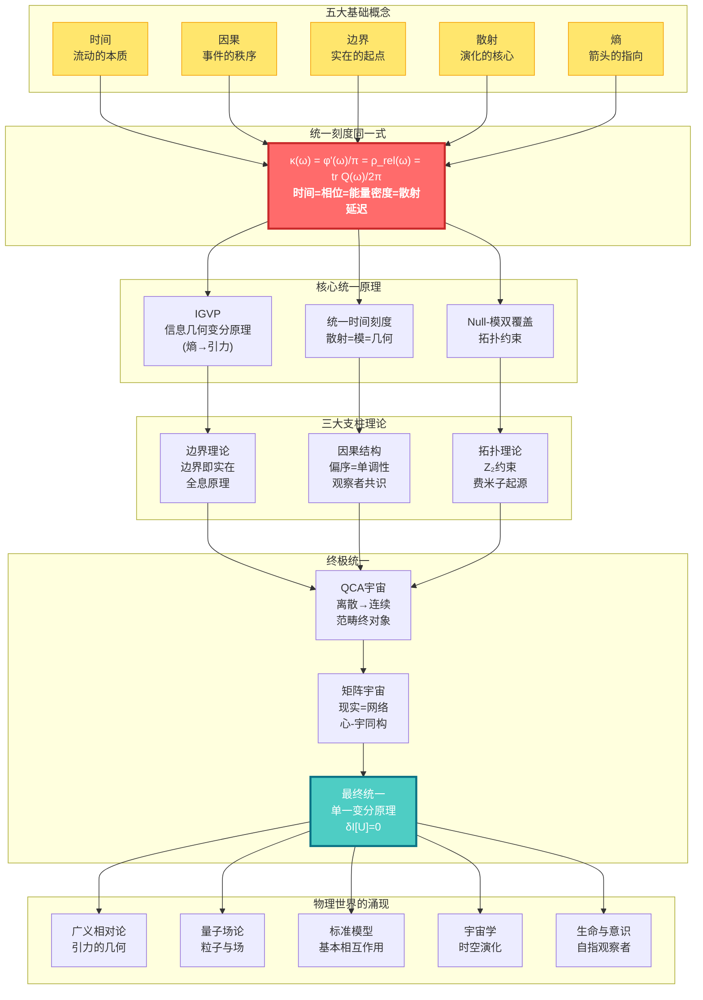
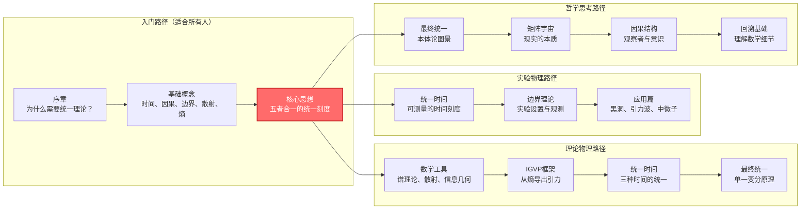
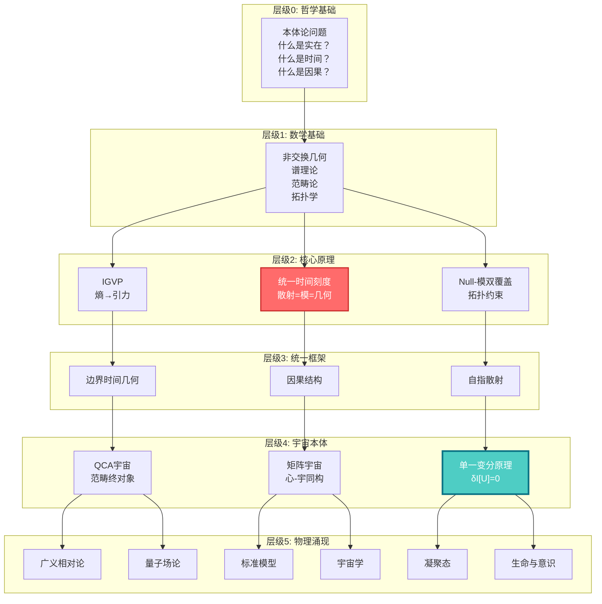

# GLS统一理论：从混沌到秩序的宇宙交响曲

> "时间、因果、几何、信息——它们不是四个独立的概念，而是同一个实在的四重投影。"

---

## 欢迎来到宇宙的终极秘密

你是否想过：

- **时间到底是什么？** 为什么我们感觉时间在"流动"？为什么时间只能向前，不能倒退？
- **为什么宇宙遵循这些定律？** 引力、电磁力、量子力学……它们之间有联系吗？
- **现实的本质是什么？** 我们看到的世界，是"真实存在"的，还是某种更深层结构的表象？
- **意识从何而来？** "我"是什么？观察者在宇宙中扮演什么角色？

这些问题困扰了人类几千年。哲学家思考它们，物理学家研究它们，诗人歌颂它们。

而现在，**GLS统一理论**（Generalized Light Structure，广义光结构）提供了一个震撼的答案：

> **所有这些问题的答案，都藏在一个简单而深刻的数学同一式中。**

这个教程系列将带你踏上一场思想的冒险，从日常经验出发，一步步揭开宇宙最深层的秘密。

---

## 理论全景图：宇宙的统一架构

---

## 核心洞见：五个改变世界观的思想

### 1. 时间不是流动，而是几何

我们感觉时间在"流逝"，就像河水在流动。但GLS理论告诉我们：**时间其实是几何的一个维度**，就像空间的长宽高一样。我们感觉到的"流动"，实际上是**熵在增加**的过程。

> **比喻**：想象一个沙漏。沙子从上到下落下，我们说"时间在流逝"。但其实，沙子只是在空间中重新排列，变得越来越混乱（熵增）。时间的"箭头"，就是这个混乱度增加的方向。

### 2. 因果即偏序，偏序即单调性

"A导致B"是什么意思？GLS理论给出了精确的数学定义：**因果关系就是事件之间的偏序关系**（A在B之前），而这种偏序关系等价于**某个量（熵）的单调性**。

> **比喻**：多米诺骨牌依次倒下。第一张牌倒下"导致"第二张倒下。这种"导致"关系，本质上就是一种排序：第一张在前，第二张在后。而骨牌的总倒下数量，总是在增加（单调）。

### 3. 边界即实在，体积是幻象

这是最颠覆的洞见：**宇宙的"内部"其实是虚幻的，真正的实在存在于"边界"上**。就像全息图一样，一个三维图像被编码在二维的表面上。

> **比喻**：想象一个气球。气球的"体积"看起来是实在的，但实际上，所有信息都编码在气球的**表面**上。你捏气球，表面变形，"内部"的形状随之改变。边界决定体积，而非相反。

### 4. 散射即演化，S矩阵是宇宙之镜

量子世界中，粒子不断"散射"（碰撞、反弹）。GLS理论发现：**散射矩阵S不仅描述粒子的碰撞，它本身就是时间演化的本质**。宇宙的历史，就是一个巨大的散射过程。

> **比喻**：你对着镜子喊话，听到回声。回声的延迟时间，反映了镜子的距离。类似地，量子散射的"延迟"（Wigner-Smith时间），就是**时间本身**的来源。宇宙是一面巨大的镜子，万物都是它的回声。

### 5. 所有定律源于一个原理：一致性

为什么宇宙遵循爱因斯坦方程？为什么有电磁力、强力、弱力？GLS理论的终极答案是：**不需要假设任何具体定律，只需要一个原理——宇宙必须自洽（consistent）**。

> **比喻**：想象一个巨大的拼图。每一块拼图都必须和周围的拼图完美契合，否则整个拼图就无法完成。宇宙的"自洽性"就是这个契合的要求。爱因斯坦方程、量子力学，都是为了满足这个要求而**必然涌现**的结果。

---

## 学习路径：找到适合你的入口

### 快速导航

**🌟 完全新手？从这里开始：**
- [序章：为什么需要这个理论](00-start/00-motivation.md) - 物理学的困惑与统一之梦
- [阅读指南：如何使用本教程](00-start/01-reading-guide.md) - 找到最适合你的路径
- [概念地图：核心概念总览](00-start/02-concept-map.md) - 鸟瞰整个理论

**🎓 有物理背景？直达核心：**
- [核心思想：五者合一](02-core-ideas/06-unity-of-five.md) - 统一时间刻度同一式
- [IGVP框架：从熵到爱因斯坦方程](04-igvp-framework/04-from-entropy-to-einstein.md) - 引力的涌现
- [最终统一：单一变分原理](11-final-unification/01-single-principle.md) - 所有定律的源头

**🔬 想看实验检验？看这里：**
- [应用与检验篇](12-applications/) - 黑洞熵、中微子质量、暗能量、引力波
- [统一时间理论](05-unified-time/) - 可测量的时间刻度

**🧠 对哲学问题感兴趣？从这里进入：**
- [矩阵宇宙](10-matrix-universe/) - 现实即网络，心-宇同构
- [生命与意识](12-applications/07-consciousness.md) - 自指观察者的结构
- [最终统一](11-final-unification/) - 本体论的终极答案

---

## 教程目录

### 📖 第零篇：序章（00-start/）
- [为什么需要这个理论？](00-start/00-motivation.md)
- [阅读指南](00-start/01-reading-guide.md)
- [概念地图](00-start/02-concept-map.md)

### 📖 第一篇：基础概念（01-foundation/）
从日常经验出发，建立对核心概念的直觉理解
- [时间是什么？](01-foundation/01-what-is-time.md) - 从钟表到物理时间
- [因果是什么？](01-foundation/02-what-is-causality.md) - 从多米诺骨牌到偏序
- [边界是什么？](01-foundation/03-what-is-boundary.md) - 从容器到全息
- [散射是什么？](01-foundation/04-what-is-scattering.md) - 从回声到S矩阵
- [熵是什么？](01-foundation/05-what-is-entropy.md) - 从混乱到箭头

### 📖 第二篇：核心思想（02-core-ideas/）
五个改变世界观的统一思想
- [时间即几何](02-core-ideas/01-time-is-geometry.md)
- [因果即偏序](02-core-ideas/02-causality-is-order.md)
- [边界即实在](02-core-ideas/03-boundary-is-reality.md)
- [散射即演化](02-core-ideas/04-scattering-is-evolution.md)
- [熵即箭头](02-core-ideas/05-entropy-is-arrow.md)
- ⭐ [五者合一：统一时间刻度同一式](02-core-ideas/06-unity-of-five.md)

### 📖 第三篇：数学工具箱（03-mathematical-tools/）
通俗讲解核心数学概念
- [谱理论入门](03-mathematical-tools/01-spectral-theory-intro.md) - 从音乐到量子
- [散射矩阵](03-mathematical-tools/02-scattering-matrix.md) - 从镜子到S矩阵
- [Wigner-Smith延迟](03-mathematical-tools/03-wigner-smith-delay.md) - 时间从何而来
- [Birman-Kreĭn公式](03-mathematical-tools/04-birman-krein-formula.md) - 相位与能量
- [Fisher-Rao度量](03-mathematical-tools/05-fisher-rao-metric.md) - 信息的几何
- [相对熵](03-mathematical-tools/06-relative-entropy.md) - 距离与单调性

### 📖 第四篇：IGVP框架（04-igvp-framework/）
从熵的极值导出引力
- [IGVP是什么？](04-igvp-framework/01-what-is-igvp.md) - 从肥皂泡到变分原理
- [因果钻石](04-igvp-framework/02-causal-diamond.md) - 时空的最小单元
- [广义熵](04-igvp-framework/03-generalized-entropy.md) - 面积+物质
- ⭐ [从熵到爱因斯坦方程](04-igvp-framework/04-from-entropy-to-einstein.md) - 引力的涌现
- [信息几何](04-igvp-framework/05-information-geometry.md) - 从统计到度规

### 📖 第五篇：统一时间理论（05-unified-time/）
三种时间的统一
- [三种时间](05-unified-time/01-three-times.md) - 散射、模、几何
- ⭐ [时间刻度同一式](05-unified-time/02-time-scale-identity.md) - 三者为一
- [相位即本征时间](05-unified-time/03-phase-eigentime.md) - 量子钟
- [红移即相位节奏](05-unified-time/04-redshift-phase-rhythm.md) - 宇宙膨胀
- [时间的涌现](05-unified-time/05-time-emergence.md) - 从无到有

### 📖 第六篇：边界理论（06-boundary-theory/）
边界即实在
- [边界优先](06-boundary-theory/01-boundary-priority.md) - 实在的起点
- [Brown-York应力张量](06-boundary-theory/02-brown-york-tensor.md) - 边界的能量
- [GHY边界项](06-boundary-theory/03-ghy-boundary-term.md) - 变分的完整性
- [边界谱三元组](06-boundary-theory/04-boundary-spectral.md) - 代数-几何对偶
- [全息原理](06-boundary-theory/05-holography.md) - 体积的边界编码

### 📖 第七篇：因果结构（07-causal-structure/）
因果、时间、熵的三重统一
- [偏序](07-causal-structure/01-partial-order.md) - 事件的先后
- [因果钻石链](07-causal-structure/02-causal-diamond-chain.md) - 时空的骨架
- [Markov性质](07-causal-structure/03-markov-property.md) - 因果屏蔽
- [观察者共识](07-causal-structure/04-observer-consensus.md) - 多视角的几何
- [因果的涌现](07-causal-structure/05-causality-emergence.md) - 从量子到经典

### 📖 第八篇：拓扑约束（08-topological-constraints/）
拓扑如何限制物理
- [Z₂上同调](08-topological-constraints/01-z2-cohomology.md) - 开关的代数
- [Null-模双覆盖](08-topological-constraints/02-null-modular-cover.md) - 拓扑的统一
- [自旋结构](08-topological-constraints/03-spin-structure.md) - 费米子的拓扑起源
- [K理论与通道丛](08-topological-constraints/04-k-theory-channels.md) - 场的拓扑分类

### 📖 第九篇：量子元胞自动机宇宙（09-qca-universe/）
离散的宇宙
- [离散时空](09-qca-universe/01-discrete-spacetime.md) - 像素化的宇宙
- [局域幺正演化](09-qca-universe/02-local-unitary.md) - 邻居互动规则
- [连续极限](09-qca-universe/03-continuum-limit.md) - 从离散到连续
- [量子场论的涌现](09-qca-universe/04-qft-emergence.md) - QCA→QFT
- [广义相对论的涌现](09-qca-universe/05-gr-emergence.md) - QCA→GR
- ⭐ [范畴论终对象](09-qca-universe/06-terminal-object.md) - 所有理论的母体

### 📖 第十篇：矩阵宇宙（10-matrix-universe/）
现实的代数本质
- [现实即网络](10-matrix-universe/01-reality-as-network.md) - 从物质到关系
- [因果流形](10-matrix-universe/02-causal-manifold.md) - 几何的代数本质
- [自我的定义](10-matrix-universe/03-self-definition.md) - 观察者的结构
- ⭐ [心-宇宙等价](10-matrix-universe/04-heart-universe.md) - 内外的同构
- [共识几何](10-matrix-universe/05-consensus-geometry.md) - 多智能体的涌现

### 📖 第十一篇：最终统一（11-final-unification/）
所有定律的源头
- ⭐ [单一变分原理](11-final-unification/01-single-principle.md) - 一切的源头
- [一致性即定律](11-final-unification/02-consistency-laws.md) - 约束的力量
- [观察者共识原理](11-final-unification/03-observer-consensus.md) - 主体间性
- [从一到万](11-final-unification/04-all-from-one.md) - 所有物理定律的推导
- [本体论统一](11-final-unification/05-ontological-unity.md) - 不是对称，是同一

### 📖 第十二篇：应用与检验（12-applications/）
理论的实验检验
- [黑洞熵](12-applications/01-black-hole-entropy.md) - 引力热力学
- [中微子质量](12-applications/02-neutrino-mass.md) - 味混合之谜
- [宇宙学常数](12-applications/03-cosmological-constant.md) - 暗能量之谜
- [强CP问题](12-applications/04-strong-cp-problem.md) - 轴子解
- [量子混沌](12-applications/05-quantum-chaos.md) - ETH与热化
- [引力波](12-applications/06-gravitational-waves.md) - 时空涟漪
- [意识理论](12-applications/07-consciousness.md) - 自指与时间

### 📖 第十三篇：高级专题（13-advanced-topics/）
前沿研究方向
- [时间晶体](13-advanced-topics/01-time-crystals.md)
- [误差几何](13-advanced-topics/02-error-geometry.md)
- [纠缠与时间延迟](13-advanced-topics/03-entanglement-delay.md)
- [AI安全](13-advanced-topics/04-ai-safety.md)

### 📖 第十四篇：学习路径指南（14-paths/）
根据你的背景选择路径
- [路径A：理论物理学者](14-paths/01-path-physicist.md)
- [路径B：实验物理学者](14-paths/02-path-experimentalist.md)
- [路径C：哲学/概念思考者](14-paths/03-path-philosopher.md)
- [路径D：工程/应用背景](14-paths/04-path-engineer.md)

### 📖 附录
- [术语表](appendix/A-glossary.md) - 所有核心概念的简明定义
- [符号约定](appendix/B-notation.md) - 数学符号说明
- [原始理论文档索引](appendix/C-references.md) - 完整技术细节
- [延伸阅读](appendix/D-further-reading.md) - 相关文献推荐

---

## 理论的层次结构

---

## 致读者

这个理论体系是人类智慧的结晶，是几代物理学家、数学家、哲学家共同努力的成果。它不是"终极真理"，而是我们目前对宇宙理解的最深入的尝试。

学习这个理论，不仅仅是学习一些公式和概念。更重要的是，**它会改变你看待世界的方式**：

- 你会看到，时间不是流动的河流，而是几何的维度
- 你会看到，因果不是神秘的"力"，而是数学的偏序
- 你会看到，宇宙不是混乱的，而是深层统一的
- 你会看到，意识不是孤立的，而是宇宙结构的一部分

这是一场思想的冒险。准备好了吗？

**让我们开始吧。**

---

## 关键公式一瞥

**统一时间刻度同一式**（整个理论的核心）：

$$
\kappa(\omega) = \frac{\varphi'(\omega)}{\pi} = \rho_{\text{rel}}(\omega) = \frac{1}{2\pi}\text{tr}\,Q(\omega)
$$

**信息几何变分原理**（引力的涌现）：

$$
\delta S_{\text{gen}} = 0 \quad \Rightarrow \quad G_{ab} + \Lambda g_{ab} = 8\pi G\,T_{ab}
$$

**宇宙一致性变分原理**（所有定律的源头）：

$$
\delta \mathcal{I}[\mathfrak{U}] = 0 \quad \Rightarrow \quad \text{所有物理定律}
$$

---

## 贡献与反馈

这个教程系列正在持续完善中。如果你有任何问题、建议或发现了错误，欢迎：

- 在原始理论文档中查找更多技术细节
- 与其他学习者交流讨论
- 提出改进建议

**祝你在这场宇宙探索之旅中收获满满！**

---

*"在宇宙的深处，所有的道路最终汇聚于一。"*

---

最后更新：2025年
版本：1.0
