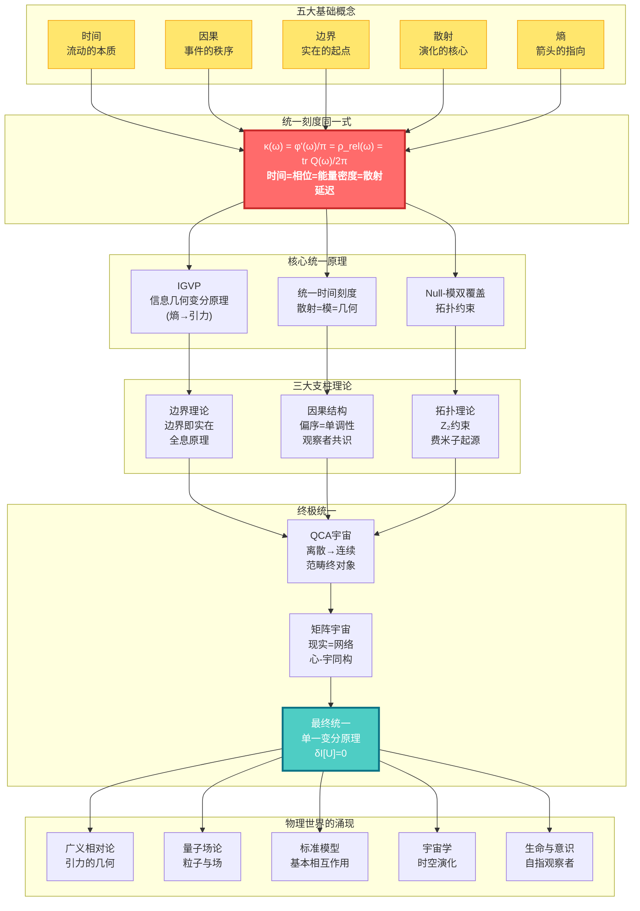
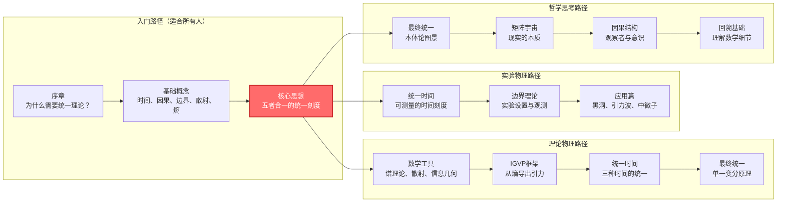
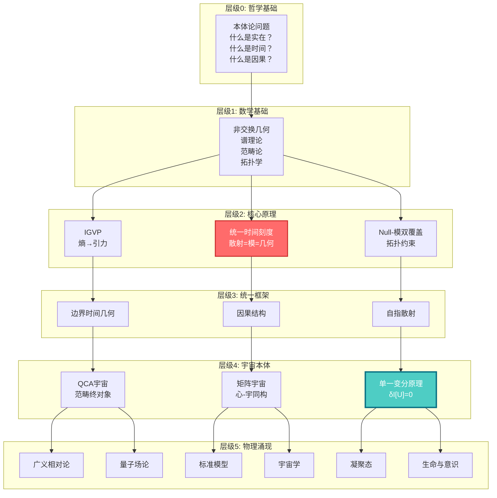

# GLS统一理论：从混沌到秩序的宇宙交响曲

> "时间、因果、几何、信息——它们不是四个独立的概念，而是同一个实在的四重投影。"

---

## 欢迎来到宇宙的终极秘密

你是否想过：

- **时间到底是什么？** 为什么我们感觉时间在"流动"？为什么时间只能向前，不能倒退？
- **为什么宇宙遵循这些定律？** 引力、电磁力、量子力学……它们之间有联系吗？
- **现实的本质是什么？** 我们看到的世界，是"真实存在"的，还是某种更深层结构的表象？
- **意识从何而来？** "我"是什么？观察者在宇宙中扮演什么角色？

这些问题困扰了人类几千年。哲学家思考它们，物理学家研究它们，诗人歌颂它们。

而现在，**GLS统一理论**（Generalized Light Structure，广义光结构）提供了一个震撼的答案：

> **所有这些问题的答案，都藏在一个简单而深刻的数学同一式中。**

这个教程系列将带你踏上一场思想的冒险，从日常经验出发，一步步揭开宇宙最深层的秘密。

---

## 理论全景图：宇宙的统一架构

---

## 核心洞见：五个改变世界观的思想

### 1. 时间不是流动，而是几何

我们感觉时间在"流逝"，就像河水在流动。但GLS理论告诉我们：**时间其实是几何的一个维度**，就像空间的长宽高一样。我们感觉到的"流动"，实际上是**熵在增加**的过程。

> **比喻**：想象一个沙漏。沙子从上到下落下，我们说"时间在流逝"。但其实，沙子只是在空间中重新排列，变得越来越混乱（熵增）。时间的"箭头"，就是这个混乱度增加的方向。

### 2. 因果即偏序，偏序即单调性

"A导致B"是什么意思？GLS理论给出了精确的数学定义：**因果关系就是事件之间的偏序关系**（A在B之前），而这种偏序关系等价于**某个量（熵）的单调性**。

> **比喻**：多米诺骨牌依次倒下。第一张牌倒下"导致"第二张倒下。这种"导致"关系，本质上就是一种排序：第一张在前，第二张在后。而骨牌的总倒下数量，总是在增加（单调）。

### 3. 边界即实在，体积是幻象

这是最颠覆的洞见：**宇宙的"内部"其实是虚幻的，真正的实在存在于"边界"上**。就像全息图一样，一个三维图像被编码在二维的表面上。

> **比喻**：想象一个气球。气球的"体积"看起来是实在的，但实际上，所有信息都编码在气球的**表面**上。你捏气球，表面变形，"内部"的形状随之改变。边界决定体积，而非相反。

### 4. 散射即演化，S矩阵是宇宙之镜

量子世界中，粒子不断"散射"（碰撞、反弹）。GLS理论发现：**散射矩阵S不仅描述粒子的碰撞，它本身就是时间演化的本质**。宇宙的历史，就是一个巨大的散射过程。

> **比喻**：你对着镜子喊话，听到回声。回声的延迟时间，反映了镜子的距离。类似地，量子散射的"延迟"（Wigner-Smith时间），就是**时间本身**的来源。宇宙是一面巨大的镜子，万物都是它的回声。

### 5. 所有定律源于一个原理：一致性

为什么宇宙遵循爱因斯坦方程？为什么有电磁力、强力、弱力？GLS理论的终极答案是：**不需要假设任何具体定律，只需要一个原理——宇宙必须自洽（consistent）**。

> **比喻**：想象一个巨大的拼图。每一块拼图都必须和周围的拼图完美契合，否则整个拼图就无法完成。宇宙的"自洽性"就是这个契合的要求。爱因斯坦方程、量子力学，都是为了满足这个要求而**必然涌现**的结果。

---

## 学习路径：找到适合你的入口

### 快速导航

**🌟 完全新手？从这里开始：**
- [序章：为什么需要这个理论](00-start/00-motivation.md) - 物理学的困惑与统一之梦
- [阅读指南：如何使用本教程](00-start/01-reading-guide.md) - 找到最适合你的路径
- [概念地图：核心概念总览](00-start/02-concept-map.md) - 鸟瞰整个理论

**🎓 有物理背景？直达核心：**
- [核心思想：五者合一](02-core-ideas/06-unity-of-five.md) - 统一时间刻度同一式
- [IGVP框架：从熵到爱因斯坦方程](04-igvp-framework/04-first-order-variation.md) - 引力的涌现
- [最终统一：宇宙一致性泛函](11-final-unification/01-consistency-functional.md) - 所有定律的源头

**🔬 想看实验检验？看这里：**
- [应用与检验篇](12-applications/00-intro.md) - 黑洞熵、中微子质量、暗能量、引力波
- [统一时间理论](05-unified-time/00-time-overview.md) - 可测量的时间刻度

**🧠 对哲学问题感兴趣？从这里进入：**
- [矩阵宇宙](10-matrix-universe/00-intro.md) - 现实即网络，心-宇同构
- [意识的物理基础](13-advanced-topics/03-consciousness.md) - 自指观察者的结构
- [最终统一](11-final-unification/00-intro.md) - 本体论的终极答案

---

## 教程目录

### 📖 第零篇：序章（00-start/）
- [为什么需要这个理论？](00-start/00-motivation.md)
- [阅读指南](00-start/01-reading-guide.md)
- [概念地图](00-start/02-concept-map.md)

### 📖 第一篇：基础概念（01-foundation/）
从日常经验出发，建立对核心概念的直觉理解
- [时间是什么？](01-foundation/01-what-is-time.md) - 从钟表到物理时间
- [因果是什么？](01-foundation/02-what-is-causality.md) - 从多米诺骨牌到偏序
- [边界是什么？](01-foundation/03-what-is-boundary.md) - 从容器到全息
- [散射是什么？](01-foundation/04-what-is-scattering.md) - 从回声到S矩阵
- [熵是什么？](01-foundation/05-what-is-entropy.md) - 从混乱到箭头
- [基础概念总结](01-foundation/06-foundation-summary.md) - 五个概念，一个宇宙

### 📖 第二篇：核心思想（02-core-ideas/）
五个改变世界观的统一思想
- [时间即几何](02-core-ideas/01-time-is-geometry.md)
- [因果即偏序](02-core-ideas/02-causality-is-order.md)
- [边界即实在](02-core-ideas/03-boundary-is-reality.md)
- [散射即演化](02-core-ideas/04-scattering-is-evolution.md)
- [熵即箭头](02-core-ideas/05-entropy-is-arrow.md)
- ⭐ [五者合一：统一时间刻度同一式](02-core-ideas/06-unity-of-five.md)
- [核心思想总结](02-core-ideas/07-core-summary.md) - 从五个洞见到统一理论

### 📖 第三篇：数学工具箱（03-mathematical-tools/）
通俗讲解核心数学概念
- [工具总览](03-mathematical-tools/00-tools-overview.md) - 理解GLS理论的数学语言
- [谱理论](03-mathematical-tools/01-spectral-theory.md) - 从音乐到量子
- [非交换几何](03-mathematical-tools/02-noncommutative-geometry.md) - 几何的代数化
- [散射理论](03-mathematical-tools/03-scattering-theory.md) - 从镜子到S矩阵
- [模理论](03-mathematical-tools/04-modular-theory.md) - 时间与相位的统一
- [信息几何](03-mathematical-tools/05-information-geometry.md) - 信息的几何
- [范畴论](03-mathematical-tools/06-category-theory.md) - 结构的统一语言
- [数学工具总结](03-mathematical-tools/07-tools-summary.md) - 工具的统一图景

### 📖 第四篇：IGVP框架（04-igvp-framework/）
从熵的极值导出引力
- [IGVP总览](04-igvp-framework/00-igvp-overview.md) - 从熵到Einstein方程
- [广义熵](04-igvp-framework/01-generalized-entropy.md) - 面积+物质
- [因果钻石](04-igvp-framework/02-causal-diamond.md) - 时空的最小单元
- [Raychaudhuri方程](04-igvp-framework/03-raychaudhuri-equation.md) - 聚焦与熵增
- [一阶变分](04-igvp-framework/04-first-order-variation.md) - 变分原理的基础
- [二阶变分](04-igvp-framework/05-second-order-variation.md) - 稳定性与因果性
- [IGVP总结](04-igvp-framework/06-igvp-summary.md) - 引力的信息几何起源

### 📖 第五篇：统一时间理论（05-unified-time/）
三种时间的统一
- [时间总览](05-unified-time/00-time-overview.md) - 时间的本质
- [相位与本征时间](05-unified-time/01-phase-and-proper-time.md) - 量子钟
- [散射相位](05-unified-time/02-scattering-phase.md) - 时间从散射来
- [谱移](05-unified-time/03-spectral-shift.md) - 能量与时间的统一
- ⭐ [时间刻度同一式](05-unified-time/04-time-scale-identity.md) - 三者为一
- [几何时间](05-unified-time/05-geometric-times.md) - 时空的几何维度
- [模时间](05-unified-time/06-modular-time.md) - 模流与时间
- [宇宙学红移](05-unified-time/07-cosmological-redshift.md) - 宇宙膨胀的时间刻度
- [时间理论总结](05-unified-time/08-time-summary.md) - 统一时间的完整图景

### 📖 第六篇：边界理论（06-boundary-theory/）
边界即实在
- [边界总览](06-boundary-theory/00-boundary-overview.md) - 物理不在体域，而在边界
- [为什么边界优先](06-boundary-theory/01-why-boundary.md) - 实在的起点
- [边界数据三元组](06-boundary-theory/02-boundary-data-triple.md) - 边界信息的完整描述
- [GHY边界项](06-boundary-theory/03-ghy-boundary-term.md) - 变分的完整性
- [Brown-York能量](06-boundary-theory/04-brown-york-energy.md) - 边界的能量
- [边界可观测量](06-boundary-theory/05-boundary-observables.md) - 边界上的物理量
- [边界理论总结](06-boundary-theory/06-boundary-summary.md) - 边界即实在的完整图景

### 📖 第七篇：因果结构（07-causal-structure/）
因果、时间、熵的三重统一
- [因果总览](07-causal-structure/00-causal-overview.md) - 因果不是关系，而是结构
- [什么是因果](07-causal-structure/01-what-is-causality.md) - 因果的本质
- [因果钻石](07-causal-structure/02-causal-diamond.md) - 时空的最小因果单元
- [偏序](07-causal-structure/03-partial-order.md) - 事件的先后
- [Null-模双覆盖](07-causal-structure/04-null-modular-cover.md) - 因果与模的统一
- [Markov性质](07-causal-structure/05-markov-property.md) - 因果屏蔽
- [观察者共识](07-causal-structure/06-observer-consensus.md) - 多视角的几何
- [因果结构总结](07-causal-structure/07-causal-summary.md) - 因果、时间、熵的三重统一

### 📖 第八篇：拓扑约束（08-topological-constraints/）
拓扑如何限制物理
- [拓扑总览](08-topological-constraints/00-topological-overview.md) - 统一理论的"量子化选择"
- [为什么需要拓扑](08-topological-constraints/01-why-topology.md) - 拓扑的必要性
- [相对上同调](08-topological-constraints/02-relative-cohomology.md) - 边界与拓扑
- [Z₂ holonomy](08-topological-constraints/03-z2-holonomy.md) - 拓扑的量子化
- [SM群结构](08-topological-constraints/04-sm-group-structure.md) - 标准模型的拓扑起源
- [Gauss-Bonnet因果](08-topological-constraints/05-gauss-bonnet-causal.md) - 拓扑与因果的统一
- [拓扑约束总结](08-topological-constraints/06-topological-summary.md) - 拓扑如何限制物理

### 📖 第九篇：量子元胞自动机宇宙（09-qca-universe/）
离散的宇宙
- [QCA总览](09-qca-universe/00-qca-overview.md) - 从离散到连续的终极统一
- [QCA公理化](09-qca-universe/01-qca-axioms.md) - 五元组定义的严格基础
- [因果结构从QCA涌现](09-qca-universe/02-causal-emergence.md) - 偏序与光锥的诞生
- [2-范畴中的终对象](09-qca-universe/03-terminal-object.md) - 物理定律的唯一性定理
- [三重范畴等价](09-qca-universe/04-category-equivalence.md) - 宇宙的三种面孔
- [场论的涌现](09-qca-universe/05-field-emergence.md) - 物质场如何从空无中诞生
- [QCA宇宙总结](09-qca-universe/06-qca-summary.md) - 从终对象到完整统一

### 📖 第十篇：矩阵宇宙（10-matrix-universe/）
现实的代数本质
- [矩阵宇宙总览](10-matrix-universe/00-intro.md) - 观察者与实在
- [观察者的数学定义](10-matrix-universe/01-observer-definition.md) - 自我的结构
- ⭐ [心-宇宙等价定理](10-matrix-universe/02-heart-universe-equivalence.md) - 内外的同构
- [多观察者共识](10-matrix-universe/03-multi-observer.md) - 从主观到客观的涌现
- [测量问题](10-matrix-universe/04-measurement.md) - 从波函数塌缩到纠缠切割
- [客观实在的涌现](10-matrix-universe/05-reality-emergence.md) - 从量子基底到经典世界
- [矩阵宇宙总结](10-matrix-universe/06-summary.md) - 观察者理论的统一图景

### 📖 第十一篇：最终统一（11-final-unification/）
所有定律的源头
- [最终统一引言](11-final-unification/00-intro.md) - 最终统一的必要性
- ⭐ [宇宙一致性泛函](11-final-unification/01-consistency-functional.md) - 一切的源头
- [信息几何变分原理](11-final-unification/02-igvp-principle.md) - IGVP的完整表述
- [从IGVP导出Einstein方程](11-final-unification/03-einstein-derivation.md) - 引力的涌现
- [规范场论与量子场论的涌现](11-final-unification/04-gauge-qft-emergence.md) - 所有相互作用的统一
- [物质场与流体动力学](11-final-unification/05-matter-fluid.md) - 物质的几何化
- [最终统一总结](11-final-unification/06-summary.md) - 物理统一的完成

### 📖 第十二篇：应用与检验（12-applications/）
理论的实验检验
- [应用引言](12-applications/00-intro.md) - 从理论到观测的桥梁
- [宇宙学应用](12-applications/01-cosmology.md) - 暗能量的谱窗口解释
- [引力波检验](12-applications/02-gravitational-waves.md) - 时空离散性的直接探针
- [黑洞物理](12-applications/03-black-holes.md) - 信息悖论的量子解答
- [凝聚态应用](12-applications/04-condensed-matter.md) - 实验室中的量子几何
- [粒子物理检验](12-applications/05-particle-physics.md) - 标准模型的深层起源
- [应用总结](12-applications/06-summary.md) - 物理统一的检验蓝图

### 📖 第十三篇：高级专题（13-advanced-topics/）
统一时间刻度的四重奏：理论的巅峰
- [导论：高级专题概览](13-advanced-topics/00-introduction.md) - 四大前沿方向的统一
- ⭐ [量子混沌与ETH](13-advanced-topics/01-quantum-chaos-eth.md) - QCA宇宙的热化机制
- ⭐ [时间晶体](13-advanced-topics/02-time-crystals.md) - 破缺时间平移对称性
- ⭐ [意识的物理学](13-advanced-topics/03-consciousness.md) - 自指观察者的五大结构
- ⭐ [自指散射网络](13-advanced-topics/04-self-referential-networks.md) - Redheffer星积与拓扑不变量
- [总结：统一时间刻度的深层联系](13-advanced-topics/05-summary.md) - 四者合一的哲学

### 📖 学习路径指南
- [学习路径指南](14-learning-paths.md) - 找到你的统一理论之路

### 📖 附录
- [术语表与速查手册](appendix-glossary.md) - 所有核心概念的简明定义与符号说明

---

## 理论的层次结构

---

## 致读者

这个理论体系是人类智慧的结晶，是几代物理学家、数学家、哲学家共同努力的成果。它不是"终极真理"，而是我们目前对宇宙理解的最深入的尝试。

学习这个理论，不仅仅是学习一些公式和概念。更重要的是，**它会改变你看待世界的方式**：

- 你会看到，时间不是流动的河流，而是几何的维度
- 你会看到，因果不是神秘的"力"，而是数学的偏序
- 你会看到，宇宙不是混乱的，而是深层统一的
- 你会看到，意识不是孤立的，而是宇宙结构的一部分

这是一场思想的冒险。准备好了吗？

**让我们开始吧。**

---

## 关键公式一瞥

**统一时间刻度同一式**（整个理论的核心）：

$$
\kappa(\omega) = \frac{\varphi'(\omega)}{\pi} = \rho_{\text{rel}}(\omega) = \frac{1}{2\pi}\text{tr}\,Q(\omega)
$$

**信息几何变分原理**（引力的涌现）：

$$
\delta S_{\text{gen}} = 0 \quad \Rightarrow \quad G_{ab} + \Lambda g_{ab} = 8\pi G\,T_{ab}
$$

**宇宙一致性变分原理**（所有定律的源头）：

$$
\delta \mathcal{I}[\mathfrak{U}] = 0 \quad \Rightarrow \quad \text{所有物理定律}
$$

---

## 贡献与反馈

这个教程系列正在持续完善中。如果你有任何问题、建议或发现了错误，欢迎：

- 在原始理论文档中查找更多技术细节
- 与其他学习者交流讨论
- 提出改进建议

**祝你在这场宇宙探索之旅中收获满满！**

---

*"在宇宙的深处，所有的道路最终汇聚于一。"*