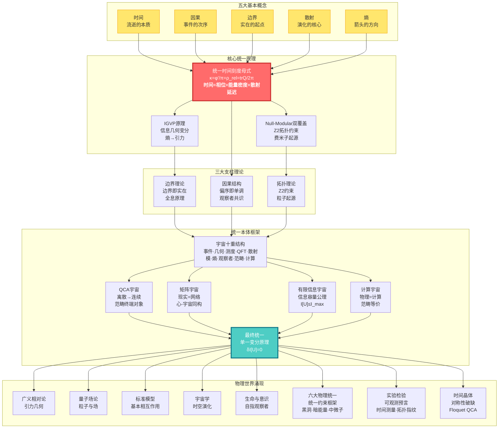
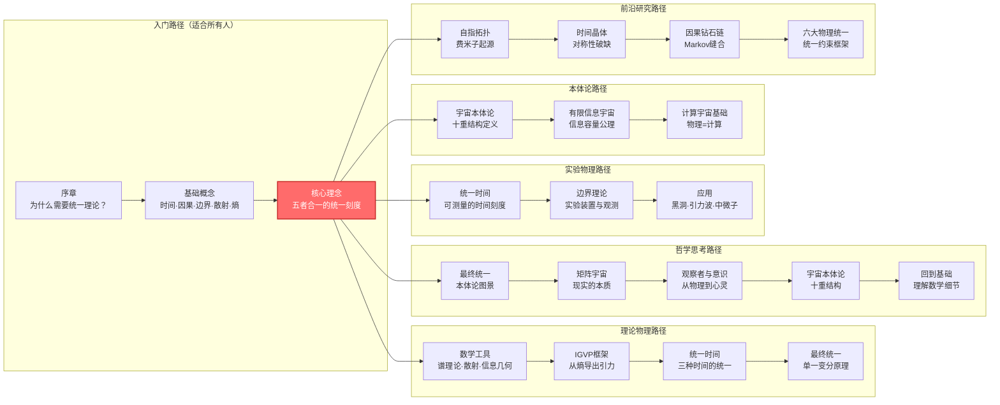
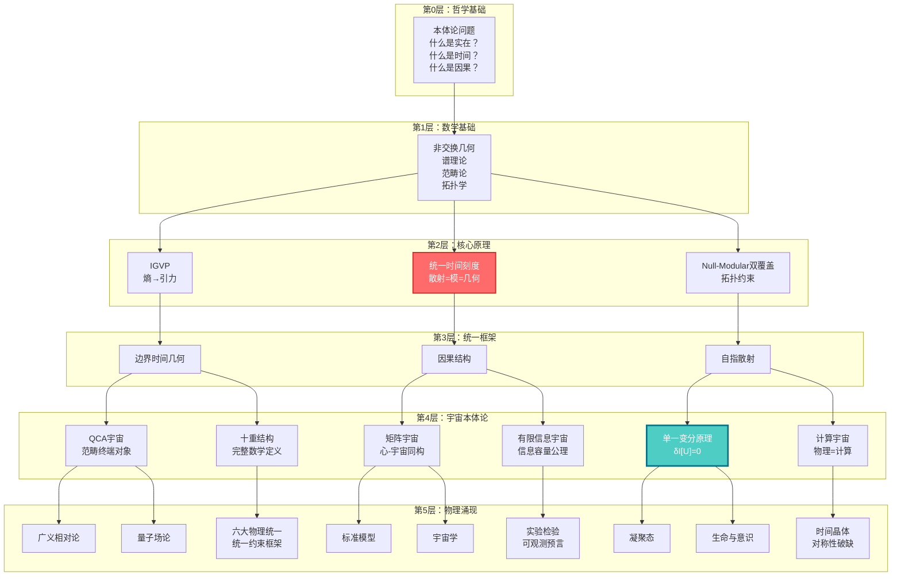

# GLS统一理论：从混沌到秩序的宇宙交响

> "时间、因果、几何、信息——它们不是四个独立的概念，而是同一个实在的四个投影。"

---

## 欢迎来到宇宙的终极秘密

你是否曾经好奇：

- **时间到底是什么？** 为什么我们感觉时间在"流逝"？为什么时间只能向前，不能倒退？
- **宇宙为何遵循这些定律？** 引力、电磁力、量子力学......它们之间有联系吗？
- **现实的本质是什么？** 我们看到的世界是"真实存在"的，还是某种更深层结构的表象？
- **意识从何而来？** 什么是"我"？观察者在宇宙中扮演什么角色？
- **物理世界与数学世界** 是什么关系？宇宙是一台巨大的计算机吗？
- **宇宙是无限的吗？** 还是它的信息容量是有限的？
- **为什么有这些物理常数？** 黑洞熵、暗能量、中微子质量...它们之间有联系吗？

这些问题困扰了人类数千年。哲学家思索它们，物理学家研究它们，诗人歌颂它们。

而现在，**GLS统一理论**（Generalized Light Structure, 广义光结构）给出了一个惊人的答案：

> **所有这些问题的答案，都隐藏在一个简洁而深刻的数学等式中。**

这套教程系列将带你踏上一段智性冒险，从日常经验出发，一步步揭示宇宙最深层的秘密。

**📚 教程规模**：本系列现已扩展至**23个主要部分**，包含**393个文件**（中英文），涵盖从基础概念到前沿研究的完整内容，包括：
- 基础理论与核心框架（第0-11部分）
- 应用与高级主题（第12-13部分）
- 本体论与有限信息（第15-16部分）
- 六大物理统一（第17部分）
- 自指拓扑与观察者意识（第18-19部分）
- 实验检验与实现（第20-22部分）
- 计算宇宙基础（第23部分）

---

## 理论全景图：宇宙的统一架构

---

## 核心洞见：改变你世界观的五个理念

### 1. 时间不是流动，而是几何

我们感觉时间在"流逝"，像河流一样。但GLS理论告诉我们：**时间其实是一个几何维度**，就像空间的长、宽、高一样。我们感受到的"流逝"，其实是**熵在增加**的过程。

> **比喻**：想象一个沙漏。沙子从上面流到下面，我们说"时间在流逝"。但其实，沙子只是在空间中重新排列，变得越来越无序（熵增）。时间的"箭头"，就是无序度增加的方向。

### 2. 因果即偏序，偏序即单调

什么叫"A导致B"？GLS理论给出精确的数学定义：**因果关系就是事件之间的偏序关系**（A在B之前），而这个偏序等价于**某个量（熵）的单调性**。

> **比喻**：多米诺骨牌依次倒下。第一块倒下"导致"第二块倒下。这种"导致"关系，本质上是一种排序：第一块在前，第二块在后。而已倒下骨牌的总数总是增加的（单调）。

### 3. 边界即实在，体积是幻象

这是最颠覆的洞见：**宇宙的"内部"其实是虚幻的，真正的实在存在于"边界"上**。就像全息图，三维图像被编码在二维表面上。

> **比喻**：想象一个气球。气球的"体积"看似真实，但实际上，所有信息都编码在气球的**表面**上。你挤压气球，表面变形，"内部"的形状也随之改变。边界决定体积，而非相反。

### 4. 散射即演化，S矩阵是宇宙之镜

在量子世界中，粒子不断"散射"（碰撞、反弹）。GLS理论发现：**散射矩阵S不仅描述粒子碰撞，它本身就是时间演化的本质**。宇宙的历史就是一个巨大的散射过程。

> **比喻**：你对着镜子喊话，听到回声。回声的延迟时间反映了镜子的距离。同样，量子散射的"延迟"（Wigner-Smith时间）就是**时间本身的来源**。宇宙是一面巨大的镜子，万物都是它的回声。

### 5. 所有定律源于一个原理：一致性

为什么宇宙遵循爱因斯坦方程？为什么有电磁力、强力、弱力？GLS理论的终极答案：**不需要假设任何特定定律，只需要一条原理——宇宙必须自洽**。

> **比喻**：想象一个巨大的拼图。每块拼图必须与周围的拼图完美契合，否则整个拼图无法完成。宇宙的"自洽性"就是这种契合要求。爱因斯坦方程、量子力学，都是为了满足这个要求而**必然涌现**的结果。

### 6. 宇宙是有限的：信息容量公理

传统物理假设宇宙是无限的，但GLS理论提出：**宇宙的信息容量是有限的**。这不仅是技术限制，而是宇宙的基本性质。从无限到有限的跃迁，揭示了宇宙的深层结构。

> **比喻**：想象一台计算机。无论它有多强大，内存总是有限的。宇宙就像这台计算机，它的"内存"（信息容量）是有限的。这个限制决定了宇宙中可能发生的一切。

### 7. 物理即计算：计算宇宙等价

GLS理论发现：**物理过程与计算过程在范畴上等价**。宇宙的运行就是一台巨大的计算机，物理定律就是计算规则。这为理解宇宙提供了全新的视角。

> **比喻**：想象一个电子游戏。游戏中的"物理"（重力、碰撞等）实际上都是程序代码的计算结果。同样，我们宇宙的物理定律，可能也是某种更深层"计算"的结果。

### 8. 六大物理问题的统一解答

黑洞熵、宇宙学常数、中微子质量、本征态热化、强CP问题、引力波色散——这六个看似无关的物理问题，在GLS统一约束框架下，**都源于同一个统一原理**。

> **比喻**：想象六把不同的锁，每把锁都需要不同的钥匙。但GLS理论发现，这些锁实际上都连接到同一个锁芯。一把"万能钥匙"（统一约束框架）就能打开所有锁。

---

## 学习路径：找到你的入口

### 快速导航

**🌟 完全零基础？从这里开始：**
- [序章：为什么需要这个理论？](00-start/00-motivation.md) - 物理学的困惑与统一的梦想
- [阅读指南：如何使用本教程](00-start/01-reading-guide.md) - 找到最适合你的路径
- [概念地图：核心概念一览](00-start/02-concept-map.md) - 鸟瞰整个理论

**🎓 有物理基础？直奔核心：**
- [核心理念：五者合一](02-core-ideas/06-unity-of-five.md) - 统一时间刻度等式
- [IGVP框架：从熵到爱因斯坦方程](04-igvp-framework/04-first-order-variation.md) - 引力的涌现
- [最终统一：宇宙一致性泛函](11-final-unification/01-consistency-functional.md) - 所有定律的源头
- [六大物理统一](17-six-physics-unified/00-six-physics-overview.md) - 统一约束框架下的六大物理问题

**🔬 想看实验检验？看这里：**
- [应用与检验](12-applications/00-intro.md) - 黑洞熵·中微子质量·暗能量·引力波
- [实验检验](20-experimental-tests/00-experimental-overview.md) - 统一理论的实验检验方案
- [统一时间理论](05-unified-time/00-time-overview.md) - 可测量的时间刻度

**🧠 对哲学问题感兴趣？从这里进入：**
- [矩阵宇宙](10-matrix-universe/00-intro.md) - 现实即网络，心-宇宙同构
- [意识的物理基础](13-advanced-topics/03-consciousness.md) - 自指观察者的结构
- [观察者与意识](19-observer-consciousness/00-observer-consciousness-overview.md) - 从物理到心灵的统一之桥
- [最终统一](11-final-unification/00-intro.md) - 本体论的终极回答
- [宇宙的本体论](15-universe-ontology/00-ontology-overview.md) - 宇宙的完整数学定义

**💻 对计算宇宙感兴趣？看这里：**
- [计算宇宙基础](23-computational-universe-foundations/00-overview.md) - 宇宙作为计算的严格数学基础
- [有限信息宇宙](16-finite-information-universe/00-finite-info-overview.md) - 从无限到有限的本体论跃迁
- [QCA宇宙](09-qca-universe/00-qca-overview.md) - 从离散到连续的终极统一

**🔬 对前沿主题感兴趣？看这里：**
- [自指拓扑](18-self-reference-topology/00-self-reference-overview.md) - 反馈环路、π-台阶与Z₂奇偶跃迁
- [时间晶体](22-time-crystals/00-time-crystal-overview.md) - 打破时间平移对称性
- [因果钻石链](21-causal-diamond-chain/00-causal-diamond-overview.md) - 因果钻石的链式结构
- [量子混沌与ETH](13-advanced-topics/01-quantum-chaos-eth.md) - QCA宇宙的热化机制

---

## 教程内容概览

本教程系列共包含**23个主要部分**，从基础概念到前沿研究，从数学工具到哲学思考，全面覆盖GLS统一理论的各个方面：

- **基础部分**（第0-4部分）：序章、基础概念、核心理念、数学工具、IGVP框架
- **核心理论**（第5-8部分）：统一时间、边界理论、因果结构、拓扑约束
- **统一框架**（第9-11部分）：QCA宇宙、矩阵宇宙、最终统一
- **应用与检验**（第12部分）：理论的应用与实验检验
- **高级主题**（第13部分）：量子混沌、时间晶体、意识、自指散射
- **本体论扩展**（第15-16部分）：宇宙本体论、有限信息宇宙
- **物理统一**（第17部分）：六大物理问题的统一解答
- **前沿研究**（第18-19部分）：自指拓扑、观察者与意识
- **实验与实现**（第20-22部分）：实验检验、因果钻石链、时间晶体
- **计算基础**（第23部分）：计算宇宙的数学基础

**总计**：393个Markdown文件（中英文），涵盖从入门到专业的完整学习路径。

### 📑 章节索引

| 部分 | 主题 | 文件数 | 核心内容 |
|------|------|--------|----------|
| 第0部分 | 序章 | 6 | 动机、阅读指南、概念地图 |
| 第1部分 | 基础概念 | 12 | 时间、因果、边界、散射、熵 |
| 第2部分 | 核心理念 | 14 | 五者合一、统一时间刻度 |
| 第3部分 | 数学工具 | 16 | 谱理论、散射、信息几何、范畴论 |
| 第4部分 | IGVP框架 | 14 | 广义熵、因果钻石、变分原理 |
| 第5部分 | 统一时间 | 28 | 三种时间的统一、时间-几何-相互作用 |
| 第6部分 | 边界理论 | 22 | 边界即实在、边界数据、GHY项 |
| 第7部分 | 因果结构 | 22 | 因果菱形、偏序、观察者共识 |
| 第8部分 | 拓扑约束 | 14 | Z₂ holonomy、标准模型群结构 |
| 第9部分 | QCA宇宙 | 14 | 离散→连续、范畴终端对象 |
| 第10部分 | 矩阵宇宙 | 24 | 心-宇宙同构、观察者理论 |
| 第11部分 | 最终统一 | 14 | 宇宙一致性泛函、单一变分原理 |
| 第12部分 | 应用 | 14 | 黑洞、引力波、中微子、暗能量 |
| 第13部分 | 高级主题 | 12 | 量子混沌、时间晶体、意识、自指散射 |
| 第14部分 | 学习路径 | 2 | 学习路径指南 |
| 第15部分 | 宇宙本体论 | 20 | 十重结构、完整数学定义 |
| 第16部分 | 有限信息宇宙 | 20 | 信息容量公理、参数分解 |
| 第17部分 | 六大物理统一 | 20 | 统一约束框架、六大问题解答 |
| 第18部分 | 自指拓扑 | 16 | 费米子起源、π-台阶量子化 |
| 第19部分 | 观察者与意识 | 18 | 意识定义、自由意志几何 |
| 第20部分 | 实验检验 | 16 | 实验方案、可行性分析 |
| 第21部分 | 因果钻石链 | 12 | Markov缝合、散射窗化 |
| 第22部分 | 时间晶体 | 10 | Floquet QCA、Z₂对称性 |
| 第23部分 | 计算宇宙基础 | 29 | 物理=计算、范畴等价 |
| 附录 | 术语表 | 2 | 术语表与速查手册 |

---

## 教程内容

### 📖 第零部分：序章 (00-start/)
- [为什么需要这个理论？](00-start/00-motivation.md)
- [阅读指南](00-start/01-reading-guide.md)
- [概念地图](00-start/02-concept-map.md)

### 📖 第一部分：基础概念 (01-foundation/)
从日常经验出发，建立对核心概念的直觉理解
- [什么是时间？](01-foundation/01-what-is-time.md) - 从钟表到物理时间
- [什么是因果？](01-foundation/02-what-is-causality.md) - 从多米诺到偏序
- [什么是边界？](01-foundation/03-what-is-boundary.md) - 从容器到全息
- [什么是散射？](01-foundation/04-what-is-scattering.md) - 从回声到S矩阵
- [什么是熵？](01-foundation/05-what-is-entropy.md) - 从混乱到箭头

### 📖 第二部分：核心理念 (02-core-ideas/)
改变你世界观的五个统一理念
- [时间即几何](02-core-ideas/01-time-is-geometry.md)
- [因果即次序](02-core-ideas/02-causality-is-order.md)
- [边界即实在](02-core-ideas/03-boundary-is-reality.md)
- [散射即演化](02-core-ideas/04-scattering-is-evolution.md)
- [熵即箭头](02-core-ideas/05-entropy-is-arrow.md)
- ⭐ [五者合一：统一时间刻度等式](02-core-ideas/06-unity-of-five.md)
- [核心理念总结](02-core-ideas/07-core-summary.md) - 从五个洞见到统一理论

### 📖 第三部分：数学工具箱 (03-mathematical-tools/)
核心数学概念的通俗讲解
- [工具概览](03-mathematical-tools/00-tools-overview.md) - 理解GLS理论的数学语言
- [谱理论](03-mathematical-tools/01-spectral-theory.md) - 从音乐到量子
- [非交换几何](03-mathematical-tools/02-noncommutative-geometry.md) - 几何的代数化
- [散射理论](03-mathematical-tools/03-scattering-theory.md) - 从镜子到S矩阵
- [模理论](03-mathematical-tools/04-modular-theory.md) - 时间与相位的统一
- [信息几何](03-mathematical-tools/05-information-geometry.md) - 信息的几何
- [范畴论](03-mathematical-tools/06-category-theory.md) - 结构的统一语言
- [数学工具总结](03-mathematical-tools/07-tools-summary.md) - 工具的统一图景

### 📖 第四部分：IGVP框架 (04-igvp-framework/)
从熵的极值导出引力
- [IGVP概览](04-igvp-framework/00-igvp-overview.md) - 从熵到爱因斯坦方程
- [广义熵](04-igvp-framework/01-generalized-entropy.md) - 面积+物质
- [因果菱形](04-igvp-framework/02-causal-diamond.md) - 时空的最小单元
- [Raychaudhuri方程](04-igvp-framework/03-raychaudhuri-equation.md) - 聚焦与熵增
- [一阶变分](04-igvp-framework/04-first-order-variation.md) - 变分原理基础
- [二阶变分](04-igvp-framework/05-second-order-variation.md) - 稳定性与因果性
- [IGVP总结](04-igvp-framework/06-igvp-summary.md) - 引力的信息几何起源

### 📖 第五部分：统一时间理论 (05-unified-time/)
三种时间的统一
- [时间概览](05-unified-time/00-time-overview.md) - 时间的本质
- [相位与本征时间](05-unified-time/01-phase-and-proper-time.md) - 量子钟表
- [散射相位](05-unified-time/02-scattering-phase.md) - 散射中的时间
- [谱移](05-unified-time/03-spectral-shift.md) - 能量与时间的统一
- ⭐ [时间刻度等式](05-unified-time/04-time-scale-identity.md) - 三者合一
- [几何时间](05-unified-time/05-geometric-times.md) - 时空的几何维度
- [模时间](05-unified-time/06-modular-time.md) - 模流与时间
- [宇宙学红移](05-unified-time/07-cosmological-redshift.md) - 宇宙膨胀的时间刻度
- [时间作为广义熵的最优路径](05-unified-time/08-time-as-entropy.md) - 时间箭头与熵增
- [时间-几何-相互作用的统一](05-unified-time/09-time-geometry-interaction.md) - 没有"力"，只有时间的弯曲
- [拓扑不变量与时间](05-unified-time/10-topological-invariants-time.md) - 时间的"DNA"
- [边界语言](05-unified-time/11-boundary-language.md) - 时间在哪里"说话"
- [时间域与可解模型](05-unified-time/12-time-domains-solvable.md) - 从边界数据重构时间
- [时间理论总结](05-unified-time/13-time-summary.md) - 万法归一的时间

### 📖 第六部分：边界理论 (06-boundary-theory/)
边界即实在
- [边界概览](06-boundary-theory/00-boundary-overview.md) - 物理不在体，而在界
- [为何边界优先](06-boundary-theory/01-why-boundary.md) - 实在的起点
- [边界数据三元组](06-boundary-theory/02-boundary-data-triple.md) - 边界信息的完整描述
- [GHY边界项](06-boundary-theory/03-ghy-boundary-term.md) - 变分的完备性
- [Brown-York能量](06-boundary-theory/04-brown-york-energy.md) - 边界上的能量
- [边界可观测量](06-boundary-theory/05-boundary-observables.md) - 边界上的物理量
- [边界作为舞台](06-boundary-theory/07-boundary-as-stage.md) - 边界上的物理过程
- [边界观察者时间](06-boundary-theory/08-boundary-observer-time.md) - 观察者与边界时间的统一
- [边界时钟](06-boundary-theory/09-boundary-clock.md) - 边界上的时间测量
- [三位一体主刻度](06-boundary-theory/10-trinity-master-scale.md) - 边界、时间、观察者的统一
- [边界理论总结](06-boundary-theory/11-boundary-summary.md) - 边界即实在的完整图景

### 📖 第七部分：因果结构 (07-causal-structure/)
因果、时间、熵的三重统一
- [因果概览](07-causal-structure/00-causal-overview.md) - 因果不是关系，而是结构
- [什么是因果](07-causal-structure/01-what-is-causality.md) - 因果的本质
- [因果菱形](07-causal-structure/02-causal-diamond.md) - 时空的最小因果单元
- [偏序](07-causal-structure/03-partial-order.md) - 事件的先后
- [Null-Modular双覆盖](07-causal-structure/04-null-modular-cover.md) - 因果与模的统一
- [Markov性质](07-causal-structure/05-markov-property.md) - 因果屏蔽
- [观察者共识](07-causal-structure/06-observer-consensus.md) - 多视角的几何
- [因果几何压缩](07-causal-structure/08-causal-geometry-compression.md) - 时空作为因果约束的最小无损压缩
- [误差几何与因果稳健性](07-causal-structure/09-error-geometry-robustness.md) - 从参数置信椭球到多实验可信区域
- [统一定理证明](07-causal-structure/10-unified-theorem-proof.md) - 因果结构的统一理论证明
- [因果结构总结](07-causal-structure/10-causal-summary.md) - 因果·时间·熵的三重统一

### 📖 第八部分：拓扑约束 (08-topological-constraints/)
拓扑如何约束物理
- [拓扑概览](08-topological-constraints/00-topological-overview.md) - 统一理论的"量子化选择"
- [为何需要拓扑](08-topological-constraints/01-why-topology.md) - 拓扑的必要性
- [相对上同调](08-topological-constraints/02-relative-cohomology.md) - 边界与拓扑
- [Z₂ Holonomy](08-topological-constraints/03-z2-holonomy.md) - 拓扑的量子化
- [标准模型群结构](08-topological-constraints/04-sm-group-structure.md) - 标准模型的拓扑起源
- [Gauss-Bonnet因果性](08-topological-constraints/05-gauss-bonnet-causal.md) - 拓扑与因果的统一
- [拓扑约束总结](08-topological-constraints/06-topological-summary.md) - 拓扑如何约束物理

### 📖 第九部分：量子元胞自动机宇宙 (09-qca-universe/)
离散宇宙
- [QCA概览](09-qca-universe/00-qca-overview.md) - 从离散到连续的终极统一
- [QCA公理化](09-qca-universe/01-qca-axioms.md) - 五元组定义的严格基础
- [因果结构从QCA涌现](09-qca-universe/02-causal-emergence.md) - 偏序与光锥的诞生
- [2-范畴中的终端对象](09-qca-universe/03-terminal-object.md) - 物理定律的唯一性定理
- [三重范畴等价](09-qca-universe/04-category-equivalence.md) - 宇宙的三副面孔
- [场论的涌现](09-qca-universe/05-field-emergence.md) - 物质场如何从虚无中涌现
- [QCA宇宙总结](09-qca-universe/06-qca-summary.md) - 从终端对象到完整统一

### 📖 第十部分：矩阵宇宙 (10-matrix-universe/)
现实的代数本质
- [矩阵宇宙概览](10-matrix-universe/00-intro.md) - 观察者与实在
- [观察者的数学定义](10-matrix-universe/01-observer-definition.md) - 自我的结构
- ⭐ [心-宇宙等价定理](10-matrix-universe/02-heart-universe-equivalence.md) - 内外的同构
- [多观察者共识](10-matrix-universe/03-multi-observer.md) - 从主观到客观的涌现
- [测量问题](10-matrix-universe/04-measurement.md) - 从波函数坍缩到纠缠剪断
- [客观实在的涌现](10-matrix-universe/05-reality-emergence.md) - 从量子基础到经典世界
- [自-宇宙同构](10-matrix-universe/06-self-universe-isomorphism.md) - 自我与宇宙的结构对应
- [矩阵中的自](10-matrix-universe/07-self-in-matrix.md) - 自我在矩阵宇宙中的位置
- [多观察者因果](10-matrix-universe/08-multi-observer-causal.md) - 多观察者之间的因果结构
- [算子网络](10-matrix-universe/09-operator-network.md) - 观察者网络的代数结构
- [实在等价性证明](10-matrix-universe/10-reality-equivalence-proof.md) - 客观实在的数学证明
- [矩阵宇宙总结](10-matrix-universe/11-summary.md) - 观察者理论的统一图景

### 📖 第十一部分：最终统一 (11-final-unification/)
所有定律的源头
- [最终统一引言](11-final-unification/00-intro.md) - 最终统一的必要性
- ⭐ [宇宙一致性泛函](11-final-unification/01-consistency-functional.md) - 万物之源
- [信息几何变分原理](11-final-unification/02-igvp-principle.md) - IGVP的完整表述
- [从IGVP导出爱因斯坦方程](11-final-unification/03-einstein-derivation.md) - 引力的涌现
- [规范场论与量子场论的涌现](11-final-unification/04-gauge-qft-emergence.md) - 所有相互作用的统一
- [物质场与流体动力学](11-final-unification/05-matter-fluid.md) - 物质的几何化
- [最终统一总结](11-final-unification/06-summary.md) - 物理统一的完成

### 📖 第十二部分：应用与检验 (12-applications/)
理论的实验检验
- [应用引言](12-applications/00-intro.md) - 从理论到观测的桥梁
- [宇宙学应用](12-applications/01-cosmology.md) - 暗能量的谱窗化解释
- [引力波检验](12-applications/02-gravitational-waves.md) - 时空离散性的直接探测
- [黑洞物理](12-applications/03-black-holes.md) - 信息悖论的量子答案
- [凝聚态应用](12-applications/04-condensed-matter.md) - 实验室中的量子几何
- [粒子物理检验](12-applications/05-particle-physics.md) - 标准模型的深层起源
- [应用总结](12-applications/06-summary.md) - 物理统一的检验蓝图

### 📖 第十三部分：高级主题 (13-advanced-topics/)
统一时间刻度的四重奏：理论的巅峰
- [引言：高级主题概览](13-advanced-topics/00-introduction.md) - 四大前沿方向的统一
- ⭐ [量子混沌与ETH](13-advanced-topics/01-quantum-chaos-eth.md) - QCA宇宙的热化机制
- ⭐ [时间晶体](13-advanced-topics/02-time-crystals.md) - 打破时间平移对称性
- ⭐ [意识的物理学](13-advanced-topics/03-consciousness.md) - 自指观察者的五大结构
- ⭐ [自指散射网络](13-advanced-topics/04-self-referential-networks.md) - Redheffer星积与拓扑不变量
- [总结：统一时间刻度的深层联系](13-advanced-topics/05-summary.md) - 四者合一的哲学

### 📖 第十四部分：学习路径指南
- [学习路径指南](14-learning-paths.md) - 找到你的统一理论之路

### 📖 第十五部分：宇宙的本体论 (15-universe-ontology/)
从现象到数学定义
- [本体论总览](15-universe-ontology/00-ontology-overview.md) - 宇宙的完整数学定义
- [宇宙的十重结构](15-universe-ontology/01-ten-fold-structure.md) - 完整数学定义的十个维度
- [事件几何测度](15-universe-ontology/02-event-geometry-measure.md) - 事件、几何与测度的统一
- [QFT散射模理论](15-universe-ontology/03-qft-scattering-modular.md) - 量子场论、散射与模的统一
- [熵观察者范畴](15-universe-ontology/04-entropy-observer-category.md) - 熵、观察者与范畴的统一
- [计算完备性](15-universe-ontology/05-computation-completeness.md) - 宇宙的计算本质
- [兼容性条件](15-universe-ontology/06-compatibility-conditions.md) - 十重结构的兼容性
- [因果结构](15-universe-ontology/07-causal-structure.md) - 本体论中的因果
- [无观察者本体论](15-universe-ontology/08-no-observer-ontology.md) - 超越观察者的本体
- [本体论总结](15-universe-ontology/09-ontology-summary.md) - 宇宙本体论的完整图景

### 📖 第十六部分：有限信息宇宙 (16-finite-information-universe/)
从无限到有限的本体论跃迁
- [有限信息总览](16-finite-information-universe/00-finite-info-overview.md) - 信息容量的公理化
- [信息容量公理](16-finite-information-universe/01-information-capacity-axiom.md) - 宇宙信息量的上限
- [参数向量分解](16-finite-information-universe/02-parameter-vector-decomposition.md) - 信息的参数化表示
- [结构参数](16-finite-information-universe/03-structural-parameters.md) - 宇宙结构的信息
- [动力学参数](16-finite-information-universe/04-dynamical-parameters.md) - 演化过程的信息
- [初始态参数](16-finite-information-universe/05-initial-state-parameters.md) - 初始条件的信息
- [信息熵不等式](16-finite-information-universe/06-information-entropy-inequality.md) - 信息与熵的关系
- [连续极限推导](16-finite-information-universe/07-continuum-limit-derivation.md) - 从离散到连续的过渡
- [观察者共识几何](16-finite-information-universe/08-observer-consensus-geometry.md) - 多观察者的信息几何
- [有限信息总结](16-finite-information-universe/09-finite-info-summary.md) - 有限信息宇宙的完整图景

### 📖 第十七部分：六大物理统一 (17-six-physics-unified/)
统一约束框架下的六大物理问题
- [六大物理总览](17-six-physics-unified/00-six-physics-overview.md) - 六把锁与一把钥匙
- [统一约束框架](17-six-physics-unified/01-unified-constraint-framework.md) - 统一约束的数学框架
- [黑洞熵约束](17-six-physics-unified/02-black-hole-entropy-constraint.md) - $S_{\mathrm{BH}} = A/4$ 的统一解释
- [宇宙学常数约束](17-six-physics-unified/03-cosmological-constant-constraint.md) - 暗能量的谱窗化解释
- [中微子质量约束](17-six-physics-unified/04-neutrino-mass-constraint.md) - PMNS结构与Yukawa耦合起源
- [ETH约束](17-six-physics-unified/05-eth-constraint.md) - 本征态热化假设的统一基础
- [强CP约束](17-six-physics-unified/06-strong-cp-constraint.md) - 强CP问题与轴子的拓扑-散射解
- [引力波色散](17-six-physics-unified/07-gravitational-wave-dispersion.md) - Lorentz破缺与色散的可检验预言
- [共同解空间](17-six-physics-unified/08-common-solution-space.md) - 六大问题的统一解
- [六大物理总结](17-six-physics-unified/09-six-physics-summary.md) - 统一约束框架的完整图景

### 📖 第十八部分：自指拓扑 (18-self-reference-topology/)
反馈环路、π-台阶与Z₂奇偶跃迁
- [自指拓扑总览](18-self-reference-topology/00-self-reference-overview.md) - 自指散射的拓扑结构
- [反馈环路延迟](18-self-reference-topology/01-feedback-loop-delay.md) - 自指中的时间延迟
- [π-台阶量子化](18-self-reference-topology/02-pi-step-quantization.md) - 自指散射的量子化条件
- [Z₂奇偶跃迁](18-self-reference-topology/03-z2-parity-transition.md) - 拓扑奇偶性的跃迁
- [费米子起源自指](18-self-reference-topology/04-fermion-origin-self-reference.md) - 费米子从自指散射中涌现
- [拓扑指纹](18-self-reference-topology/05-topological-fingerprint.md) - 自指结构的拓扑特征
- [不可判定性连接](18-self-reference-topology/06-undecidability-connection.md) - 自指与计算不可判定性的联系
- [自指拓扑总结](18-self-reference-topology/07-self-reference-summary.md) - 自指拓扑的完整图景

### 📖 第十九部分：观察者与意识 (19-observer-consciousness/)
从物理到心灵的统一之桥
- [观察者意识总览](19-observer-consciousness/00-observer-consciousness-overview.md) - 观测者、意识与边界时间
- [世界片切割](19-observer-consciousness/01-worldsheet-cut.md) - 观察者的世界片结构
- [意识定义](19-observer-consciousness/02-consciousness-definition.md) - 意识的数学定义
- [纠缠时间意识](19-observer-consciousness/03-entanglement-time-consciousness.md) - 量子纠缠与时间意识的统一
- [注意力时间选择](19-observer-consciousness/04-attention-time-selection.md) - 注意力机制的时间结构
- [自由意志几何](19-observer-consciousness/05-free-will-geometry.md) - 自由意志的几何基础
- [多观察者共识](19-observer-consciousness/06-multi-observer-consensus.md) - 多观察者之间的共识机制
- [涌现条件](19-observer-consciousness/07-emergence-conditions.md) - 意识涌现的物理条件
- [观察者总结](19-observer-consciousness/08-observer-summary.md) - 观察者与意识的统一图景

### 📖 第二十部分：实验检验 (20-experimental-tests/)
从理论到观测的桥梁
- [实验总览](20-experimental-tests/00-experimental-overview.md) - 统一理论的实验检验方案
- [统一时间测量](20-experimental-tests/01-unified-time-measurement.md) - 可测量的统一时间刻度
- [谱窗化技术](20-experimental-tests/02-spectral-windowing-technique.md) - 实验中的谱窗化方法
- [拓扑指纹光学](20-experimental-tests/03-topological-fingerprint-optics.md) - 光学实验中的拓扑指纹
- [因果钻石模拟](20-experimental-tests/04-causal-diamond-simulation.md) - 因果钻石的数值模拟
- [FRB观测应用](20-experimental-tests/05-frb-observation-application.md) - 快速射电暴的观测应用
- [可行性前景](20-experimental-tests/06-feasibility-prospects.md) - 实验检验的可行性分析
- [实验总结](20-experimental-tests/07-experimental-summary.md) - 实验检验的完整图景

### 📖 第二十一部分：因果钻石链 (21-causal-diamond-chain/)
因果钻石的链式结构
- [因果钻石链总览](21-causal-diamond-chain/00-causal-diamond-overview.md) - 因果钻石的链式组织
- [因果钻石基础](21-causal-diamond-chain/01-causal-diamond-basics.md) - 因果钻石的基本结构
- [Null-模双覆盖](21-causal-diamond-chain/02-null-modular-double-cover.md) - 因果钻石上的模结构
- [Markov缝合](21-causal-diamond-chain/03-markov-stitching.md) - 因果钻石之间的Markov连接
- [散射窗化](21-causal-diamond-chain/04-scattering-windowing.md) - 因果钻石链中的散射过程
- [因果钻石链总结](21-causal-diamond-chain/05-causal-diamond-summary.md) - 因果钻石链的完整图景

### 📖 第二十二部分：时间晶体 (22-time-crystals/)
打破时间平移对称性
- [时间晶体总览](22-time-crystals/00-time-crystal-overview.md) - 时间晶体的统一理论
- [Floquet QCA](22-time-crystals/01-floquet-qca.md) - 周期驱动的QCA
- [时间晶体Z₂](22-time-crystals/02-time-crystal-z2.md) - Z₂对称性与时间晶体
- [工程实现](22-time-crystals/03-engineering-implementation.md) - 时间晶体的实验实现
- [时间晶体总结](22-time-crystals/04-time-crystal-summary.md) - 时间晶体的完整图景

### 📖 第二十三部分：计算宇宙基础 (23-computational-universe-foundations/)
宇宙作为计算的严格数学基础
- [计算宇宙总览](23-computational-universe-foundations/00-overview.md) - 宇宙作为计算的元理论
- [宇宙作为计算](23-computational-universe-foundations/01-universe-as-computation.md) - 计算的数学定义
- [模拟范畴](23-computational-universe-foundations/02-simulation-category.md) - 模拟的范畴结构
- [复杂度图度量](23-computational-universe-foundations/03-complexity-graph-metric.md) - 复杂度的图度量
- [体积增长维度](23-computational-universe-foundations/04-volume-growth-dimension.md) - 体积增长的维度分析
- [离散Ricci曲率](23-computational-universe-foundations/05-discrete-ricci-curvature.md) - 离散空间的曲率
- [任务信息几何](23-computational-universe-foundations/06-task-information-geometry.md) - 计算任务的信息几何
- [Fisher信息复杂度不等式](23-computational-universe-foundations/07-fisher-info-complexity-inequality.md) - 信息与复杂度的关系
- [统一时间散射](23-computational-universe-foundations/08-unified-time-scattering.md) - 计算中的时间与散射
- [控制流形Gromov收敛](23-computational-universe-foundations/09-control-manifold-gromov-convergence.md) - 控制流形的几何收敛
- [时间信息复杂度联合作用](23-computational-universe-foundations/10-time-info-complexity-joint-action.md) - 时间、信息与复杂度的统一
- [Euler-Lagrange世界线](23-computational-universe-foundations/11-euler-lagrange-world-lines.md) - 计算中的变分原理
- [物理计算函子](23-computational-universe-foundations/12-physical-computational-functors.md) - 物理与计算的范畴对应
- [范畴等价证明](23-computational-universe-foundations/13-categorical-equivalence-proof.md) - 物理与计算的等价性
- [计算宇宙总结](23-computational-universe-foundations/14-computational-universe-summary.md) - 计算宇宙的完整图景

### 📖 附录
- [术语表与速查](appendix-glossary.md) - 所有核心概念的简明定义与符号说明

---

## 理论的层次结构

---

## 致读者

这套理论体系是人类智慧的结晶，是几代物理学家、数学家、哲学家共同努力的成果。它不是"终极真理"，但它是我们迄今为止对宇宙最深刻的理解尝试。

学习这套理论，不仅仅是学习公式和概念。更重要的是，**它将改变你看待世界的方式**：

- 你会看到，时间不是流动的河流，而是一个几何维度
- 你会看到，因果不是神秘的"力"，而是数学上的偏序
- 你会看到，宇宙不是混沌无序的，而是深刻统一的
- 你会看到，意识不是孤立的，而是宇宙结构的一部分
- 你会看到，宇宙不是无限的，而是有信息容量限制的
- 你会看到，物理过程就是计算过程，宇宙是一台巨大的计算机
- 你会看到，看似无关的物理问题，都源于同一个统一原理
- 你会看到，从黑洞熵到中微子质量，从时间晶体到意识，都在一个框架下统一

### 关于新增章节

本教程系列现已扩展至23个部分，新增的9个章节（第15-23部分）进一步深化和扩展了GLS统一理论：

- **第15部分：宇宙的本体论** - 给出了宇宙的完整数学定义，包含十重结构
- **第16部分：有限信息宇宙** - 提出了信息容量公理，揭示了宇宙的有限性
- **第17部分：六大物理统一** - 在统一约束框架下解答了六个重大物理问题
- **第18部分：自指拓扑** - 揭示了费米子从自指散射中涌现的机制
- **第19部分：观察者与意识** - 建立了从物理到意识的统一桥梁
- **第20部分：实验检验** - 提供了统一理论的实验检验方案
- **第21部分：因果钻石链** - 发展了因果结构的链式组织理论
- **第22部分：时间晶体** - 在统一框架下理解时间平移对称性破缺
- **第23部分：计算宇宙基础** - 建立了物理与计算等价的严格数学基础

这些新章节不仅丰富了理论内容，更为理解宇宙提供了全新的视角和工具。

这是一场智性的冒险。你准备好了吗？

**让我们开始吧。**

---

## 核心概念速查

### 🔑 五大基本概念

1. **时间** - 不是流动的河流，而是几何维度；统一时间刻度：$\kappa = \varphi'/\pi = \rho_{\text{rel}} = \text{tr}Q/2\pi$
2. **因果** - 不是神秘的"力"，而是事件的偏序关系；因果即单调性
3. **边界** - 不是容器的壁，而是实在的起点；边界即实在，体积是幻象
4. **散射** - 不是简单的碰撞，而是时间演化的本质；散射矩阵S = 时间演化
5. **熵** - 不是混乱度，而是时间的箭头；熵增 = 时间方向

### 🎯 三大统一原理

1. **统一时间刻度等式** - 时间 = 相位 = 能量密度 = 散射延迟
2. **IGVP原理** - 信息几何变分原理：$\delta S_{\text{gen}} = 0 \Rightarrow$ 爱因斯坦方程
3. **Null-Modular双覆盖** - Z₂拓扑约束，费米子统计的起源

### 🌌 三大宇宙图景

1. **QCA宇宙** - 离散量子元胞自动机，从离散到连续的涌现
2. **矩阵宇宙** - 现实即网络，心-宇宙同构：$\text{心} \cong \text{宇宙}$
3. **计算宇宙** - 物理过程 = 计算过程（范畴等价）

### 📐 宇宙的十重结构

宇宙$\mathfrak{U}$的完整数学定义包含十个维度：
- **事件** ($U_{\mathrm{evt}}$) - 发生了什么
- **几何** ($U_{\mathrm{geo}}$) - 在哪里发生
- **测度** ($U_{\mathrm{meas}}$) - 如何测量
- **QFT** ($U_{\mathrm{QFT}}$) - 量子场论结构
- **散射** ($U_{\mathrm{scat}}$) - 散射过程
- **模** ($U_{\mathrm{mod}}$) - 模结构
- **熵** ($U_{\mathrm{ent}}$) - 熵结构
- **观察者** ($U_{\mathrm{obs}}$) - 观察者结构
- **范畴** ($U_{\mathrm{cat}}$) - 范畴结构
- **计算** ($U_{\mathrm{comp}}$) - 计算结构

### 🔬 六大物理统一

在统一约束框架下，六个重大物理问题得到统一解答：
1. **黑洞熵** - $S_{\mathrm{BH}} = A/4$ 的统一解释
2. **宇宙学常数** - 暗能量的谱窗化解释
3. **中微子质量** - PMNS结构与Yukawa耦合起源
4. **ETH** - 本征态热化假设的统一基础
5. **强CP问题** - 拓扑-散射解
6. **引力波色散** - Lorentz破缺的可检验预言

---

## 关键公式一览

**统一时间刻度等式**（整个理论的核心）：
$$
\kappa(\omega) = \frac{\varphi'(\omega)}{\pi} = \rho_{\text{rel}}(\omega) = \frac{1}{2\pi}\text{tr}\,Q(\omega)
$$

**信息几何变分原理**（引力的涌现）：
$$
\delta S_{\text{gen}} = 0 \quad \Rightarrow \quad G_{ab} + \Lambda g_{ab} = 8\pi G\,T_{ab}
$$

**宇宙一致性变分原理**（所有定律的源头）：
$$
\delta \mathcal{I}[\mathfrak{U}] = 0 \quad \Rightarrow \quad \text{所有物理定律}
$$

**宇宙十重结构**（本体的完整定义）：
$$
\mathfrak{U} = \Big(U_{\mathrm{evt}},\ U_{\mathrm{geo}},\ U_{\mathrm{meas}},\ U_{\mathrm{QFT}},\ U_{\mathrm{scat}},\ U_{\mathrm{mod}},\ U_{\mathrm{ent}},\ U_{\mathrm{obs}},\ U_{\mathrm{cat}},\ U_{\mathrm{comp}}\Big)
$$

**心-宇宙同构**（观察者与宇宙的等价）：
$$
\text{心（观察者结构）} \cong \text{宇宙（因果流形）}
$$

**范畴等价**（三副面孔的统一）：
$$
\mathsf{Uni}_{\mathrm{geo}} \simeq \mathsf{Uni}_{\mathrm{mat}} \simeq \mathsf{Uni}_{\mathrm{QCA}}
$$

**有限信息宇宙**（信息容量公理）：
$$
I[\mathfrak{U}] \leq I_{\max} < \infty
$$

**六大物理统一约束**（统一约束框架）：
$$
\begin{cases}
S_{\mathrm{BH}} = A/4 & \text{（黑洞熵）} \\
\Lambda = \Lambda_{\text{spec}} & \text{（宇宙学常数）} \\
m_\nu = m_\nu(\text{PMNS}) & \text{（中微子质量）} \\
\text{ETH} & \text{（本征态热化）} \\
\theta_{\text{QCD}} = 0 & \text{（强CP问题）} \\
v_g \neq c & \text{（引力波色散）}
\end{cases}
$$

**自指散射拓扑不变量**（费米子起源）：
$$
\det(1 - S^2) = (-1)^n \quad \Rightarrow \quad \text{费米子统计}
$$

**计算宇宙等价**（物理与计算的统一）：
$$
\text{物理过程} \simeq \text{计算过程} \quad \text{（范畴等价）}
$$

---

## 贡献与反馈

本教程系列正在持续完善中。如果你有任何疑问、建议，或发现错误，欢迎：

- 查阅原始理论文档了解更多技术细节
- 与其他学习者交流讨论
- 提出改进意见

**祝你在探索宇宙的旅程中收获满满！**

---

*"在宇宙的深处，所有的道路最终汇聚为一。"*

---

## 扩展阅读

### 源理论文档（技术细节）

本教程基于以下8个源目录的严格理论：

1. **euler-gls-info/** - 计算宇宙核心理论（18篇）
2. **euler-gls-union/** - 统一框架与应用（17篇）
3. **euler-gls-paper-bondary/** - 边界理论深化（12篇）
4. **euler-gls-matrix-universe/** - 矩阵宇宙详解（8篇）
5. **euler-gls-paper-time/** - 时间理论扩展（10篇）
6. **euler-gls-paper/** - 核心论文（3篇）
7. **euler-gls-causal/** - 因果理论完善（5篇）
8. **euler-gls-extend/** - 前沿扩展（17篇）

**总计：90篇严格理论文档**

### 新增章节概览

本教程系列现已扩展至**23个主要部分**，新增内容包括：

- **第十五部分：宇宙的本体论** - 从现象到数学定义的完整框架，包含宇宙的十重结构定义
- **第十六部分：有限信息宇宙** - 信息容量公理与从无限到有限的本体论跃迁
- **第十七部分：六大物理统一** - 统一约束框架下的六大物理问题（黑洞熵、宇宙学常数、中微子质量、ETH、强CP、引力波色散）
- **第十八部分：自指拓扑** - 反馈环路、π-台阶量子化与费米子起源
- **第十九部分：观察者与意识** - 从物理到心灵的统一之桥，包含意识定义、自由意志几何等
- **第二十部分：实验检验** - 统一理论的实验检验方案与可行性分析
- **第二十一部分：因果钻石链** - 因果钻石的链式结构与Markov缝合
- **第二十二部分：时间晶体** - 打破时间平移对称性的统一理论
- **第二十三部分：计算宇宙基础** - 宇宙作为计算的严格数学基础

### 章节关联建议

- **基础路径**：第0-4部分 → 第5-8部分 → 第9-11部分
- **本体论路径**：第15部分 → 第16部分 → 第23部分
- **应用路径**：第12部分 → 第17部分 → 第20部分
- **前沿路径**：第13部分 → 第18部分 → 第19部分 → 第21-22部分

### 相关资源

- **原始文献**：查阅 `/docs/euler-gls-*/` 目录
- **扩展计划**：参见 [EXPANSION_PLAN.md](EXPANSION_PLAN.md)
- **英文版本**：[English Version](index_en.md)
- **学习路径**：[学习路径指南](14-learning-paths.md) - 找到最适合你的学习路径

---

## 版本信息

- **版本**：v2.1（完整扩展版）
- **最后更新**：2025-11-19
- **基于理论**：GLS统一理论完整框架（90篇源理论文档）
- **章节数量**：23个主要部分 + 附录
- **文件总数**：393个Markdown文件（中英文）
- **语言**：简体中文（含英文版本）
- **适用读者**：从零基础到专业研究者
- **新增内容**：第15-23部分（9个新章节，涵盖本体论、有限信息、六大物理统一、自指拓扑、观察者意识、实验检验、因果钻石链、时间晶体、计算宇宙基础）

---

**开始你的宇宙探索之旅 →** [序章：为什么需要统一理论？](00-start/00-motivation.md)
