# GLS统一理论：从混沌到秩序的宇宙交响

> "时间、因果、几何、信息——它们不是四个独立的概念，而是同一个实在的四个投影。"

---

## 欢迎来到宇宙的终极秘密

你是否曾经好奇：

- **时间到底是什么？** 为什么我们感觉时间在"流逝"？为什么时间只能向前，不能倒退？
- **宇宙为何遵循这些定律？** 引力、电磁力、量子力学......它们之间有联系吗？
- **现实的本质是什么？** 我们看到的世界是"真实存在"的，还是某种更深层结构的表象？
- **意识从何而来？** 什么是"我"？观察者在宇宙中扮演什么角色？
- **物理世界与数学世界** 是什么关系？宇宙是一台巨大的计算机吗？

这些问题困扰了人类数千年。哲学家思索它们，物理学家研究它们，诗人歌颂它们。

而现在，**GLS统一理论**（Generalized Light Structure, 广义光结构）给出了一个惊人的答案：

> **所有这些问题的答案，都隐藏在一个简洁而深刻的数学等式中。**

这套教程系列将带你踏上一段智性冒险，从日常经验出发，一步步揭示宇宙最深层的秘密。

---

## 理论全景图：宇宙的统一架构

```mermaid
graph TB
    subgraph "核心统一原理"
        Unity["统一时间刻度母式<br/>κ=φ'/π=ρ_rel=trQ/2π<br/><b>时间=相位=能量密度=散射延迟</b>"]
        IGVP["IGVP原理<br/>信息几何变分<br/>熵→引力"]
        NullMod["Null-Modular双覆盖<br/>Z2拓扑约束<br/>费米子起源"]
    end

    subgraph "五大基本概念"
        Time["时间<br/>流逝的本质"]
        Cause["因果<br/>事件的次序"]
        Bound["边界<br/>实在的起点"]
        Scatter["散射<br/>演化的核心"]
        Entropy["熵<br/>箭头的方向"]
    end

    subgraph "三大支柱理论"
        Boundary["边界理论<br/>边界即实在<br/>全息原理"]
        Causal["因果结构<br/>偏序即单调<br/>观察者共识"]
        Topo["拓扑理论<br/>Z2约束<br/>粒子起源"]
    end

    subgraph "统一本体框架"
        TenFold["宇宙十重结构<br/>事件·几何·测度·QFT·散射<br/>模·熵·观察者·范畴·计算"]
        QCA["QCA宇宙<br/>离散→连续<br/>范畴终端对象"]
        Matrix["矩阵宇宙<br/>现实=网络<br/>心-宇宙同构"]
        Final["最终统一<br/>单一变分原理<br/>δI[U]=0"]
    end

    subgraph "物理世界涌现"
        GR["广义相对论<br/>引力几何"]
        QFT["量子场论<br/>粒子与场"]
        SM["标准模型<br/>基本相互作用"]
        Cosmo["宇宙学<br/>时空演化"]
        Life["生命与意识<br/>自指观察者"]
    end

    Time --> Unity
    Cause --> Unity
    Bound --> Unity
    Scatter --> Unity
    Entropy --> Unity

    Unity --> IGVP
    Unity --> NullMod

    IGVP --> Boundary
    Unity --> Causal
    NullMod --> Topo

    Boundary --> TenFold
    Causal --> TenFold
    Topo --> TenFold

    TenFold --> QCA
    TenFold --> Matrix
    QCA --> Final
    Matrix --> Final

    Final --> GR
    Final --> QFT
    Final --> SM
    Final --> Cosmo
    Final --> Life

    style Unity fill:#ff6b6b,stroke:#c92a2a,stroke-width:3px,color:#fff
    style Final fill:#4ecdc4,stroke:#0b7285,stroke-width:3px,color:#fff
    style Time fill:#ffe66d,stroke:#f59f00
    style Cause fill:#ffe66d,stroke:#f59f00
    style Bound fill:#ffe66d,stroke:#f59f00
    style Scatter fill:#ffe66d,stroke:#f59f00
    style Entropy fill:#ffe66d,stroke:#f59f00
```

---

## 核心洞见：改变你世界观的五个理念

### 1. 时间不是流动，而是几何

我们感觉时间在"流逝"，像河流一样。但GLS理论告诉我们：**时间其实是一个几何维度**，就像空间的长、宽、高一样。我们感受到的"流逝"，其实是**熵在增加**的过程。

> **比喻**：想象一个沙漏。沙子从上面流到下面，我们说"时间在流逝"。但其实，沙子只是在空间中重新排列，变得越来越无序（熵增）。时间的"箭头"，就是无序度增加的方向。

### 2. 因果即偏序，偏序即单调

什么叫"A导致B"？GLS理论给出精确的数学定义：**因果关系就是事件之间的偏序关系**（A在B之前），而这个偏序等价于**某个量（熵）的单调性**。

> **比喻**：多米诺骨牌依次倒下。第一块倒下"导致"第二块倒下。这种"导致"关系，本质上是一种排序：第一块在前，第二块在后。而已倒下骨牌的总数总是增加的（单调）。

### 3. 边界即实在，体积是幻象

这是最颠覆的洞见：**宇宙的"内部"其实是虚幻的，真正的实在存在于"边界"上**。就像全息图，三维图像被编码在二维表面上。

> **比喻**：想象一个气球。气球的"体积"看似真实，但实际上，所有信息都编码在气球的**表面**上。你挤压气球，表面变形，"内部"的形状也随之改变。边界决定体积，而非相反。

### 4. 散射即演化，S矩阵是宇宙之镜

在量子世界中，粒子不断"散射"（碰撞、反弹）。GLS理论发现：**散射矩阵S不仅描述粒子碰撞，它本身就是时间演化的本质**。宇宙的历史就是一个巨大的散射过程。

> **比喻**：你对着镜子喊话，听到回声。回声的延迟时间反映了镜子的距离。同样，量子散射的"延迟"（Wigner-Smith时间）就是**时间本身的来源**。宇宙是一面巨大的镜子，万物都是它的回声。

### 5. 所有定律源于一个原理：一致性

为什么宇宙遵循爱因斯坦方程？为什么有电磁力、强力、弱力？GLS理论的终极答案：**不需要假设任何特定定律，只需要一条原理——宇宙必须自洽**。

> **比喻**：想象一个巨大的拼图。每块拼图必须与周围的拼图完美契合，否则整个拼图无法完成。宇宙的"自洽性"就是这种契合要求。爱因斯坦方程、量子力学，都是为了满足这个要求而**必然涌现**的结果。

---

## 学习路径：找到你的入口

### 快速导航

**🌟 完全零基础？从这里开始：**
- [序章：为什么需要这个理论？](00-start/00-motivation.md) - 物理学的困惑与统一的梦想
- [阅读指南：如何使用本教程](00-start/01-reading-guide.md) - 找到最适合你的路径
- [概念地图：核心概念一览](00-start/02-concept-map.md) - 鸟瞰整个理论

**🎓 有物理基础？直奔核心：**
- [核心理念：五者合一](02-core-ideas/06-unity-of-five.md) - 统一时间刻度等式
- [IGVP框架：从熵到爱因斯坦方程](04-igvp-framework/04-first-order-variation.md) - 引力的涌现
- [最终统一：宇宙一致性泛函](11-final-unification/01-consistency-functional.md) - 所有定律的源头

**🔬 想看实验检验？看这里：**
- [应用与检验](12-applications/00-intro.md) - 黑洞熵·中微子质量·暗能量·引力波
- [统一时间理论](05-unified-time/00-time-overview.md) - 可测量的时间刻度

**🧠 对哲学问题感兴趣？从这里进入：**
- [矩阵宇宙](10-matrix-universe/00-intro.md) - 现实即网络，心-宇宙同构
- [意识的物理基础](13-advanced-topics/03-consciousness.md) - 自指观察者的结构
- [最终统一](11-final-unification/00-intro.md) - 本体论的终极回答

---

## 教程内容

### 📖 第零部分：序章 (00-start/)
- [为什么需要这个理论？](00-start/00-motivation.md)
- [阅读指南](00-start/01-reading-guide.md)
- [概念地图](00-start/02-concept-map.md)

### 📖 第一部分：基础概念 (01-foundation/)
从日常经验出发，建立对核心概念的直觉理解
- [什么是时间？](01-foundation/01-what-is-time.md) - 从钟表到物理时间
- [什么是因果？](01-foundation/02-what-is-causality.md) - 从多米诺到偏序
- [什么是边界？](01-foundation/03-what-is-boundary.md) - 从容器到全息
- [什么是散射？](01-foundation/04-what-is-scattering.md) - 从回声到S矩阵
- [什么是熵？](01-foundation/05-what-is-entropy.md) - 从混乱到箭头

### 📖 第二部分：核心理念 (02-core-ideas/)
改变你世界观的五个统一理念
- [时间即几何](02-core-ideas/01-time-is-geometry.md)
- [因果即次序](02-core-ideas/02-causality-is-order.md)
- [边界即实在](02-core-ideas/03-boundary-is-reality.md)
- [散射即演化](02-core-ideas/04-scattering-is-evolution.md)
- [熵即箭头](02-core-ideas/05-entropy-is-arrow.md)
- ⭐ [五者合一：统一时间刻度等式](02-core-ideas/06-unity-of-five.md)
- [核心理念总结](02-core-ideas/07-core-summary.md) - 从五个洞见到统一理论

### 📖 第三部分：数学工具箱 (03-mathematical-tools/)
核心数学概念的通俗讲解
- [工具概览](03-mathematical-tools/00-tools-overview.md) - 理解GLS理论的数学语言
- [谱理论](03-mathematical-tools/01-spectral-theory.md) - 从音乐到量子
- [非交换几何](03-mathematical-tools/02-noncommutative-geometry.md) - 几何的代数化
- [散射理论](03-mathematical-tools/03-scattering-theory.md) - 从镜子到S矩阵
- [模理论](03-mathematical-tools/04-modular-theory.md) - 时间与相位的统一
- [信息几何](03-mathematical-tools/05-information-geometry.md) - 信息的几何
- [范畴论](03-mathematical-tools/06-category-theory.md) - 结构的统一语言
- [数学工具总结](03-mathematical-tools/07-tools-summary.md) - 工具的统一图景

### 📖 第四部分：IGVP框架 (04-igvp-framework/)
从熵的极值导出引力
- [IGVP概览](04-igvp-framework/00-igvp-overview.md) - 从熵到爱因斯坦方程
- [广义熵](04-igvp-framework/01-generalized-entropy.md) - 面积+物质
- [因果菱形](04-igvp-framework/02-causal-diamond.md) - 时空的最小单元
- [Raychaudhuri方程](04-igvp-framework/03-raychaudhuri-equation.md) - 聚焦与熵增
- [一阶变分](04-igvp-framework/04-first-order-variation.md) - 变分原理基础
- [二阶变分](04-igvp-framework/05-second-order-variation.md) - 稳定性与因果性
- [IGVP总结](04-igvp-framework/06-igvp-summary.md) - 引力的信息几何起源

### 📖 第五部分：统一时间理论 (05-unified-time/)
三种时间的统一
- [时间概览](05-unified-time/00-time-overview.md) - 时间的本质
- [相位与本征时间](05-unified-time/01-phase-and-proper-time.md) - 量子钟表
- [散射相位](05-unified-time/02-scattering-phase.md) - 散射中的时间
- [谱移](05-unified-time/03-spectral-shift.md) - 能量与时间的统一
- ⭐ [时间刻度等式](05-unified-time/04-time-scale-identity.md) - 三者合一
- [几何时间](05-unified-time/05-geometric-times.md) - 时空的几何维度
- [模时间](05-unified-time/06-modular-time.md) - 模流与时间
- [宇宙学红移](05-unified-time/07-cosmological-redshift.md) - 宇宙膨胀的时间刻度

### 📖 第六部分：边界理论 (06-boundary-theory/)
边界即实在
- [边界概览](06-boundary-theory/00-boundary-overview.md) - 物理不在体，而在界
- [为何边界优先](06-boundary-theory/01-why-boundary.md) - 实在的起点
- [边界数据三元组](06-boundary-theory/02-boundary-data-triple.md) - 边界信息的完整描述
- [GHY边界项](06-boundary-theory/03-ghy-boundary-term.md) - 变分的完备性
- [Brown-York能量](06-boundary-theory/04-brown-york-energy.md) - 边界上的能量
- [边界可观测量](06-boundary-theory/05-boundary-observables.md) - 边界上的物理量
- [边界理论总结](06-boundary-theory/06-boundary-summary.md) - 边界即实在的完整图景

### 📖 第七部分：因果结构 (07-causal-structure/)
因果、时间、熵的三重统一
- [因果概览](07-causal-structure/00-causal-overview.md) - 因果不是关系，而是结构
- [什么是因果](07-causal-structure/01-what-is-causality.md) - 因果的本质
- [因果菱形](07-causal-structure/02-causal-diamond.md) - 时空的最小因果单元
- [偏序](07-causal-structure/03-partial-order.md) - 事件的先后
- [Null-Modular双覆盖](07-causal-structure/04-null-modular-cover.md) - 因果与模的统一
- [Markov性质](07-causal-structure/05-markov-property.md) - 因果屏蔽
- [观察者共识](07-causal-structure/06-observer-consensus.md) - 多视角的几何
- [因果结构总结](07-causal-structure/07-causal-summary.md) - 因果·时间·熵的三重统一

### 📖 第八部分：拓扑约束 (08-topological-constraints/)
拓扑如何约束物理
- [拓扑概览](08-topological-constraints/00-topological-overview.md) - 统一理论的"量子化选择"
- [为何需要拓扑](08-topological-constraints/01-why-topology.md) - 拓扑的必要性
- [相对上同调](08-topological-constraints/02-relative-cohomology.md) - 边界与拓扑
- [Z₂ Holonomy](08-topological-constraints/03-z2-holonomy.md) - 拓扑的量子化
- [标准模型群结构](08-topological-constraints/04-sm-group-structure.md) - 标准模型的拓扑起源
- [Gauss-Bonnet因果性](08-topological-constraints/05-gauss-bonnet-causal.md) - 拓扑与因果的统一
- [拓扑约束总结](08-topological-constraints/06-topological-summary.md) - 拓扑如何约束物理

### 📖 第九部分：量子元胞自动机宇宙 (09-qca-universe/)
离散宇宙
- [QCA概览](09-qca-universe/00-qca-overview.md) - 从离散到连续的终极统一
- [QCA公理化](09-qca-universe/01-qca-axioms.md) - 五元组定义的严格基础
- [因果结构从QCA涌现](09-qca-universe/02-causal-emergence.md) - 偏序与光锥的诞生
- [2-范畴中的终端对象](09-qca-universe/03-terminal-object.md) - 物理定律的唯一性定理
- [三重范畴等价](09-qca-universe/04-category-equivalence.md) - 宇宙的三副面孔
- [场论的涌现](09-qca-universe/05-field-emergence.md) - 物质场如何从虚无中涌现
- [QCA宇宙总结](09-qca-universe/06-qca-summary.md) - 从终端对象到完整统一

### 📖 第十部分：矩阵宇宙 (10-matrix-universe/)
现实的代数本质
- [矩阵宇宙概览](10-matrix-universe/00-intro.md) - 观察者与实在
- [观察者的数学定义](10-matrix-universe/01-observer-definition.md) - 自我的结构
- ⭐ [心-宇宙等价定理](10-matrix-universe/02-heart-universe-equivalence.md) - 内外的同构
- [多观察者共识](10-matrix-universe/03-multi-observer.md) - 从主观到客观的涌现
- [测量问题](10-matrix-universe/04-measurement.md) - 从波函数坍缩到纠缠剪断
- [客观实在的涌现](10-matrix-universe/05-reality-emergence.md) - 从量子基础到经典世界
- [矩阵宇宙总结](10-matrix-universe/06-summary.md) - 观察者理论的统一图景

### 📖 第十一部分：最终统一 (11-final-unification/)
所有定律的源头
- [最终统一引言](11-final-unification/00-intro.md) - 最终统一的必要性
- ⭐ [宇宙一致性泛函](11-final-unification/01-consistency-functional.md) - 万物之源
- [信息几何变分原理](11-final-unification/02-igvp-principle.md) - IGVP的完整表述
- [从IGVP导出爱因斯坦方程](11-final-unification/03-einstein-derivation.md) - 引力的涌现
- [规范场论与量子场论的涌现](11-final-unification/04-gauge-qft-emergence.md) - 所有相互作用的统一
- [物质场与流体动力学](11-final-unification/05-matter-fluid.md) - 物质的几何化
- [最终统一总结](11-final-unification/06-summary.md) - 物理统一的完成

### 📖 第十二部分：应用与检验 (12-applications/)
理论的实验检验
- [应用引言](12-applications/00-intro.md) - 从理论到观测的桥梁
- [宇宙学应用](12-applications/01-cosmology.md) - 暗能量的谱窗化解释
- [引力波检验](12-applications/02-gravitational-waves.md) - 时空离散性的直接探测
- [黑洞物理](12-applications/03-black-holes.md) - 信息悖论的量子答案
- [凝聚态应用](12-applications/04-condensed-matter.md) - 实验室中的量子几何
- [粒子物理检验](12-applications/05-particle-physics.md) - 标准模型的深层起源
- [应用总结](12-applications/06-summary.md) - 物理统一的检验蓝图

### 📖 第十三部分：高级主题 (13-advanced-topics/)
统一时间刻度的四重奏：理论的巅峰
- [引言：高级主题概览](13-advanced-topics/00-introduction.md) - 四大前沿方向的统一
- ⭐ [量子混沌与ETH](13-advanced-topics/01-quantum-chaos-eth.md) - QCA宇宙的热化机制
- ⭐ [时间晶体](13-advanced-topics/02-time-crystals.md) - 打破时间平移对称性
- ⭐ [意识的物理学](13-advanced-topics/03-consciousness.md) - 自指观察者的五大结构
- ⭐ [自指散射网络](13-advanced-topics/04-self-referential-networks.md) - Redheffer星积与拓扑不变量
- [总结：统一时间刻度的深层联系](13-advanced-topics/05-summary.md) - 四者合一的哲学

### 📖 学习路径指南
- [学习路径指南](14-learning-paths.md) - 找到你的统一理论之路

### 📖 附录
- [术语表与速查](appendix-glossary.md) - 所有核心概念的简明定义与符号说明

---

## 理论的层次结构

```mermaid
graph TD
    subgraph "第0层：哲学基础"
        Phil["本体论问题<br/>什么是实在？<br/>什么是时间？<br/>什么是因果？"]
    end

    subgraph "第1层：数学基础"
        Math["非交换几何<br/>谱理论<br/>范畴论<br/>拓扑学"]
    end

    subgraph "第2层：核心原理"
        Core1["IGVP<br/>熵→引力"]
        Core2["统一时间刻度<br/>散射=模=几何"]
        Core3["Null-Modular双覆盖<br/>拓扑约束"]
    end

    subgraph "第3层：统一框架"
        Frame1["边界时间几何"]
        Frame2["因果结构"]
        Frame3["自指散射"]
    end

    subgraph "第4层：宇宙本体论"
        Onto1["QCA宇宙<br/>范畴终端对象"]
        Onto2["矩阵宇宙<br/>心-宇宙同构"]
        Onto3["单一变分原理<br/>δI[U]=0"]
    end

    subgraph "第5层：物理涌现"
        Phys1["广义相对论"]
        Phys2["量子场论"]
        Phys3["标准模型"]
        Phys4["宇宙学"]
        Phys5["凝聚态"]
        Phys6["生命与意识"]
    end

    Phil --> Math
    Math --> Core1
    Math --> Core2
    Math --> Core3

    Core1 --> Frame1
    Core2 --> Frame2
    Core3 --> Frame3

    Frame1 --> Onto1
    Frame2 --> Onto2
    Frame3 --> Onto3

    Onto1 --> Phys1
    Onto1 --> Phys2
    Onto2 --> Phys3
    Onto2 --> Phys4
    Onto3 --> Phys5
    Onto3 --> Phys6

    style Onto3 fill:#4ecdc4,stroke:#0b7285,stroke-width:3px,color:#fff
    style Core2 fill:#ff6b6b,stroke:#c92a2a,stroke-width:2px,color:#fff
```

---

## 致读者

这套理论体系是人类智慧的结晶，是几代物理学家、数学家、哲学家共同努力的成果。它不是"终极真理"，但它是我们迄今为止对宇宙最深刻的理解尝试。

学习这套理论，不仅仅是学习公式和概念。更重要的是，**它将改变你看待世界的方式**：

- 你会看到，时间不是流动的河流，而是一个几何维度
- 你会看到，因果不是神秘的"力"，而是数学上的偏序
- 你会看到，宇宙不是混沌无序的，而是深刻统一的
- 你会看到，意识不是孤立的，而是宇宙结构的一部分

这是一场智性的冒险。你准备好了吗？

**让我们开始吧。**

---

## 关键公式一览

**统一时间刻度等式**（整个理论的核心）：
$$
\kappa(\omega) = \frac{\varphi'(\omega)}{\pi} = \rho_{\text{rel}}(\omega) = \frac{1}{2\pi}\text{tr}\,Q(\omega)
$$

**信息几何变分原理**（引力的涌现）：
$$
\delta S_{\text{gen}} = 0 \quad \Rightarrow \quad G_{ab} + \Lambda g_{ab} = 8\pi G\,T_{ab}
$$

**宇宙一致性变分原理**（所有定律的源头）：
$$
\delta \mathcal{I}[\mathfrak{U}] = 0 \quad \Rightarrow \quad \text{所有物理定律}
$$

**宇宙十重结构**（本体的完整定义）：
$$
\mathfrak{U} = \Big(U_{\mathrm{evt}},\ U_{\mathrm{geo}},\ U_{\mathrm{meas}},\ U_{\mathrm{QFT}},\ U_{\mathrm{scat}},\ U_{\mathrm{mod}},\ U_{\mathrm{ent}},\ U_{\mathrm{obs}},\ U_{\mathrm{cat}},\ U_{\mathrm{comp}}\Big)
$$

**心-宇宙同构**（观察者与宇宙的等价）：
$$
\text{心（观察者结构）} \cong \text{宇宙（因果流形）}
$$

**范畴等价**（三副面孔的统一）：
$$
\mathsf{Uni}_{\mathrm{geo}} \simeq \mathsf{Uni}_{\mathrm{mat}} \simeq \mathsf{Uni}_{\mathrm{QCA}}
$$

---

## 贡献与反馈

本教程系列正在持续完善中。如果你有任何疑问、建议，或发现错误，欢迎：

- 查阅原始理论文档了解更多技术细节
- 与其他学习者交流讨论
- 提出改进意见

**祝你在探索宇宙的旅程中收获满满！**

---

*"在宇宙的深处，所有的道路最终汇聚为一。"*

---

## 扩展阅读

### 源理论文档（技术细节）

本教程基于以下8个源目录的严格理论：

1. **euler-gls-info/** - 计算宇宙核心理论（18篇）
2. **euler-gls-union/** - 统一框架与应用（17篇）
3. **euler-gls-paper-bondary/** - 边界理论深化（12篇）
4. **euler-gls-matrix-universe/** - 矩阵宇宙详解（8篇）
5. **euler-gls-paper-time/** - 时间理论扩展（10篇）
6. **euler-gls-paper/** - 核心论文（3篇）
7. **euler-gls-causal/** - 因果理论完善（5篇）
8. **euler-gls-extend/** - 前沿扩展（17篇）

**总计：90篇严格理论文档**

### 相关资源

- **原始文献**：查阅 `/docs/euler-gls-*/` 目录
- **扩展计划**：参见 [EXPANSION_PLAN.md](EXPANSION_PLAN.md)
- **英文版本**：[English Version](index_en.md)

---

## 版本信息

- **版本**：v2.0（大幅扩展版）
- **最后更新**：2025-11-18
- **基于理论**：GLS统一理论完整框架（90篇源理论文档）
- **语言**：简体中文
- **适用读者**：从零基础到专业研究者

---

**开始你的宇宙探索之旅 →** [序章：为什么需要统一理论？](00-start/00-motivation.md)
