# GLS Unified Theory: A Cosmic Symphony from Chaos to Order

> "Time, causality, geometry, information—they are not four independent concepts, but four projections of the same reality."

---

## Welcome to the Ultimate Secret of the Universe

Have you ever wondered:

- **What is time really?** Why do we feel time "flowing"? Why can time only move forward, not backward?
- **Why does the universe follow these laws?** Gravity, electromagnetism, quantum mechanics... Are they connected?
- **What is the nature of reality?** Is the world we see "truly existing," or a manifestation of some deeper structure?
- **Where does consciousness come from?** What is "I"? What role does the observer play in the universe?
- **What is the relationship between physics and mathematics?** Is the universe a giant computer?
- **Is the universe infinite?** Or is its information capacity finite?
- **Why do these physical constants exist?** Black hole entropy, dark energy, neutrino mass... Are they connected?

These questions have puzzled humanity for millennia. Philosophers contemplate them, physicists study them, poets celebrate them.

And now, the **GLS Unified Theory** (Generalized Light Structure) provides a stunning answer:

> **The answers to all these questions lie hidden in a simple yet profound mathematical identity.**

This tutorial series will take you on an intellectual adventure, starting from everyday experience, step by step revealing the deepest secrets of the universe.

**📚 Tutorial Scale**: This series has now expanded to **23 main parts**, containing **393 files** (English and Chinese), covering complete content from fundamental concepts to cutting-edge research, including:
- Fundamental Theory and Core Framework (Parts 0-11)
- Applications and Advanced Topics (Parts 12-13)
- Ontology and Finite Information (Parts 15-16)
- Six Physics Unified (Part 17)
- Self-Reference Topology and Observer Consciousness (Parts 18-19)
- Experimental Tests and Implementation (Parts 20-22)
- Computational Universe Foundations (Part 23)

---

## Theoretical Panorama: The Unified Architecture of the Universe

```mermaid
graph TB
    subgraph "Core Unification Principles"
        IGVP["IGVP<br/>Information Geometry Variational Principle<br/>(Entropy→Gravity)"]
        TimeScale["Unified Time Scale<br/>Scattering=Modular=Geometry"]
        NullMod["Null-Modular Double Cover<br/>Topological Constraints"]
    end

    subgraph "Five Fundamental Concepts"
        Time["Time<br/>The Essence of Flow"]
        Cause["Causality<br/>The Order of Events"]
        Bound["Boundary<br/>The Starting Point of Reality"]
        Scatter["Scattering<br/>The Core of Evolution"]
        Entropy["Entropy<br/>The Direction of the Arrow"]
    end

    subgraph "Unified Scale Identity"
        Unity["κ(ω) = φ'(ω)/π = ρ_rel(ω) = tr Q(ω)/2π<br/><b>Time=Phase=Energy Density=Scattering Delay</b>"]
    end

    subgraph "Three Pillar Theories"
        Boundary["Boundary Theory<br/>Boundary is Reality<br/>Holographic Principle"]
        Causal["Causal Structure<br/>Partial Order=Monotonicity<br/>Observer Consensus"]
        Topo["Topological Theory<br/>Z₂ Constraints<br/>Fermion Origin"]
    end

    subgraph "Unified Ontological Framework"
        TenFold["Ten-Fold Structure<br/>Event·Geometry·Measure·QFT·Scattering<br/>Modular·Entropy·Observer·Category·Computation"]
        QCA["QCA Universe<br/>Discrete→Continuous<br/>Terminal Object in Category"]
        Matrix["Matrix Universe<br/>Reality=Network<br/>Heart-Universe Isomorphism"]
        FiniteInfo["Finite Information Universe<br/>Information Capacity Axiom<br/>I[U]≤I_max"]
        CompUni["Computational Universe<br/>Physics=Computation<br/>Category Equivalence"]
        Final["Final Unification<br/>Single Variational Principle<br/>δI[U]=0"]
    end

    subgraph "Emergence of Physical World"
        GR["General Relativity<br/>Geometry of Gravity"]
        QFT["Quantum Field Theory<br/>Particles and Fields"]
        SM["Standard Model<br/>Fundamental Interactions"]
        Cosmo["Cosmology<br/>Spacetime Evolution"]
        Life["Life and Consciousness<br/>Self-Referential Observer"]
        SixPhys["Six Physics Unified<br/>Unified Constraint Framework<br/>Black Hole·Dark Energy·Neutrino"]
        ExpTest["Experimental Tests<br/>Observable Predictions<br/>Time Measurement·Topological Fingerprint"]
        TimeCrystal["Time Crystals<br/>Symmetry Breaking<br/>Floquet QCA"]
    end

    Time --> Unity
    Cause --> Unity
    Bound --> Unity
    Scatter --> Unity
    Entropy --> Unity

    Unity --> IGVP
    Unity --> TimeScale
    Unity --> NullMod

    IGVP --> Boundary
    TimeScale --> Causal
    NullMod --> Topo

    Boundary --> TenFold
    Causal --> TenFold
    Topo --> TenFold

    TenFold --> QCA
    TenFold --> Matrix
    TenFold --> FiniteInfo
    TenFold --> CompUni
    QCA --> Final
    Matrix --> Final
    FiniteInfo --> Final
    CompUni --> Final

    Final --> GR
    Final --> QFT
    Final --> SM
    Final --> Cosmo
    Final --> Life
    Final --> SixPhys
    Final --> ExpTest
    Final --> TimeCrystal

    style Unity fill:#ff6b6b,stroke:#c92a2a,stroke-width:3px,color:#fff
    style Final fill:#4ecdc4,stroke:#0b7285,stroke-width:3px,color:#fff
    style Time fill:#ffe66d,stroke:#f59f00
    style Cause fill:#ffe66d,stroke:#f59f00
    style Bound fill:#ffe66d,stroke:#f59f00
    style Scatter fill:#ffe66d,stroke:#f59f00
    style Entropy fill:#ffe66d,stroke:#f59f00
```

---

## Core Insights: Five Ideas That Change Your Worldview

### 1. Time is Not Flow, But Geometry

We feel time "passing," like a river flowing. But GLS theory tells us: **Time is actually a dimension of geometry**, just like the length, width, and height of space. The "flow" we feel is actually the process of **entropy increasing**.

> **Analogy**: Imagine an hourglass. Sand falls from top to bottom, and we say "time is passing." But actually, the sand is just rearranging in space, becoming increasingly disordered (entropy increase). The "arrow" of time is the direction of increasing disorder.

### 2. Causality is Partial Order, Partial Order is Monotonicity

What does "A causes B" mean? GLS theory gives a precise mathematical definition: **Causal relationships are partial order relationships between events** (A before B), and this partial order is equivalent to the **monotonicity of some quantity (entropy)**.

> **Analogy**: Dominoes falling in sequence. The first domino falling "causes" the second to fall. This "causing" relationship is essentially a kind of ordering: the first comes before the second. And the total number of fallen dominoes always increases (monotonic).

### 3. Boundary is Reality, Volume is Illusion

This is the most subversive insight: **The "interior" of the universe is actually illusory; true reality exists on the "boundary"**. Like a hologram, a three-dimensional image is encoded on a two-dimensional surface.

> **Analogy**: Imagine a balloon. The "volume" of the balloon appears real, but actually, all information is encoded on the balloon's **surface**. You squeeze the balloon, the surface deforms, and the "interior" shape changes accordingly. The boundary determines the volume, not the other way around.

### 4. Scattering is Evolution, S-Matrix is the Mirror of the Universe

In the quantum world, particles constantly "scatter" (collide, bounce). GLS theory discovers: **The scattering matrix S not only describes particle collisions, it is itself the essence of time evolution**. The history of the universe is a vast scattering process.

> **Analogy**: You shout at a mirror and hear an echo. The delay time of the echo reflects the distance to the mirror. Similarly, the "delay" of quantum scattering (Wigner-Smith time) is the source of **time itself**. The universe is a vast mirror, and all things are its echoes.

### 5. All Laws Arise from One Principle: Consistency

Why does the universe follow Einstein's equations? Why are there electromagnetic, strong, and weak forces? The ultimate answer of GLS theory: **No need to assume any specific laws, only one principle is needed—the universe must be self-consistent**.

> **Analogy**: Imagine a huge jigsaw puzzle. Each piece must fit perfectly with surrounding pieces, otherwise the entire puzzle cannot be completed. The "self-consistency" of the universe is this fitting requirement. Einstein's equations, quantum mechanics, are **necessarily emergent** results to satisfy this requirement.

### 6. The Universe is Finite: Information Capacity Axiom

Traditional physics assumes the universe is infinite, but GLS theory proposes: **The information capacity of the universe is finite**. This is not just a technical limitation, but a fundamental property of the universe. The transition from infinite to finite reveals the deep structure of the universe.

> **Analogy**: Imagine a computer. No matter how powerful it is, memory is always finite. The universe is like this computer, its "memory" (information capacity) is finite. This limitation determines everything that can happen in the universe.

### 7. Physics is Computation: Computational Universe Equivalence

GLS theory discovers: **Physical processes and computational processes are categorically equivalent**. The operation of the universe is like a giant computer, and physical laws are computational rules. This provides a completely new perspective for understanding the universe.

> **Analogy**: Imagine a video game. The "physics" in the game (gravity, collisions, etc.) are actually computational results of program code. Similarly, the physical laws of our universe may also be results of some deeper "computation."

### 8. Unified Answers to Six Major Physics Problems

Black hole entropy, cosmological constant, neutrino mass, eigenstate thermalization, strong CP problem, gravitational wave dispersion—these six seemingly unrelated physics problems, under the GLS unified constraint framework, **all originate from the same unified principle**.

> **Analogy**: Imagine six different locks, each requiring a different key. But GLS theory discovers that these locks are actually all connected to the same lock core. One "master key" (unified constraint framework) can open all locks.

---

## Learning Paths: Find Your Entry Point

### Quick Navigation

**🌟 Complete Beginner? Start Here:**
- [Prologue: Why Do We Need This Theory?](00-start/00-motivation_en.md) - The Puzzles of Physics and the Dream of Unification
- [Reading Guide: How to Use This Tutorial](00-start/01-reading-guide_en.md) - Find the Path That Suits You Best
- [Concept Map: Overview of Core Concepts](00-start/02-concept-map_en.md) - A Bird's Eye View of the Entire Theory

**🎓 Have Physics Background? Go Straight to the Core:**
- [Core Ideas: Unity of Five](02-core-ideas/06-unity-of-five_en.md) - Unified Time Scale Identity
- [IGVP Framework: From Entropy to Einstein Equations](04-igvp-framework/04-first-order-variation_en.md) - The Emergence of Gravity
- [Final Unification: Universe Consistency Functional](11-final-unification/01-consistency-functional_en.md) - The Source of All Laws
- [Six Physics Unified](17-six-physics-unified/00-six-physics-overview_en.md) - Six Major Physics Problems Under Unified Constraint Framework

**🔬 Want to See Experimental Tests? Look Here:**
- [Applications and Tests](12-applications/00-intro_en.md) - Black Hole Entropy, Neutrino Mass, Dark Energy, Gravitational Waves
- [Experimental Tests](20-experimental-tests/00-experimental-overview_en.md) - Experimental Test Schemes for Unified Theory
- [Unified Time Theory](05-unified-time/00-time-overview_en.md) - Measurable Time Scale

**🧠 Interested in Philosophical Questions? Enter Here:**
- [Matrix Universe](10-matrix-universe/00-intro_en.md) - Reality as Network, Heart-Universe Isomorphism
- [Physical Foundation of Consciousness](13-advanced-topics/03-consciousness_en.md) - Structure of Self-Referential Observer
- [Observer and Consciousness](19-observer-consciousness/00-observer-consciousness-overview_en.md) - Unified Bridge from Physics to Mind
- [Final Unification](11-final-unification/00-intro_en.md) - The Ultimate Answer to Ontology
- [Universe Ontology](15-universe-ontology/00-ontology-overview_en.md) - Complete Mathematical Definition of the Universe

**💻 Interested in Computational Universe? Look Here:**
- [Computational Universe Foundations](23-computational-universe-foundations/00-overview_en.md) - Strict Mathematical Foundation of Universe as Computation
- [Finite Information Universe](16-finite-information-universe/00-finite-info-overview_en.md) - Ontological Transition from Infinite to Finite
- [QCA Universe](09-qca-universe/00-qca-overview_en.md) - Ultimate Unification from Discrete to Continuous

**🔬 Interested in Frontier Topics? Look Here:**
- [Self-Reference Topology](18-self-reference-topology/00-self-reference-overview_en.md) - Feedback Loops, π-Step Quantization, and Z₂ Parity Transition
- [Time Crystals](22-time-crystals/00-time-crystal-overview_en.md) - Breaking Time Translation Symmetry
- [Causal Diamond Chain](21-causal-diamond-chain/00-causal-diamond-overview_en.md) - Chain Structure of Causal Diamonds
- [Quantum Chaos and ETH](13-advanced-topics/01-quantum-chaos-eth_en.md) - Thermalization Mechanism in QCA Universe

---

## Tutorial Contents Overview

This tutorial series contains **23 main parts**, covering all aspects of GLS Unified Theory from fundamental concepts to cutting-edge research, from mathematical tools to philosophical reflection:

- **Foundation Parts** (Parts 0-4): Prologue, Fundamental Concepts, Core Ideas, Mathematical Tools, IGVP Framework
- **Core Theory** (Parts 5-8): Unified Time, Boundary Theory, Causal Structure, Topological Constraints
- **Unified Framework** (Parts 9-11): QCA Universe, Matrix Universe, Final Unification
- **Applications and Tests** (Part 12): Applications and Experimental Tests of the Theory
- **Advanced Topics** (Part 13): Quantum Chaos, Time Crystals, Consciousness, Self-Referential Scattering
- **Ontology Extension** (Parts 15-16): Universe Ontology, Finite Information Universe
- **Physics Unification** (Part 17): Unified Answers to Six Major Physics Problems
- **Frontier Research** (Parts 18-19): Self-Reference Topology, Observer and Consciousness
- **Experiments and Implementation** (Parts 20-22): Experimental Tests, Causal Diamond Chain, Time Crystals
- **Computational Foundations** (Part 23): Mathematical Foundations of Computational Universe

**Total**: 393 Markdown files (English and Chinese), covering a complete learning path from beginner to professional.

### 📑 Chapter Index

| Part | Theme | File Count | Core Content |
|------|-------|------------|--------------|
| Part 0 | Prologue | 6 | Motivation, Reading Guide, Concept Map |
| Part 1 | Fundamental Concepts | 12 | Time, Causality, Boundary, Scattering, Entropy |
| Part 2 | Core Ideas | 14 | Unity of Five, Unified Time Scale |
| Part 3 | Mathematical Tools | 16 | Spectral Theory, Scattering, Information Geometry, Category Theory |
| Part 4 | IGVP Framework | 14 | Generalized Entropy, Causal Diamond, Variational Principle |
| Part 5 | Unified Time | 28 | Unification of Three Times, Time-Geometry-Interaction |
| Part 6 | Boundary Theory | 22 | Boundary is Reality, Boundary Data, GHY Term |
| Part 7 | Causal Structure | 22 | Causal Diamond, Partial Order, Observer Consensus |
| Part 8 | Topological Constraints | 14 | Z₂ Holonomy, Standard Model Group Structure |
| Part 9 | QCA Universe | 14 | Discrete→Continuous, Category Terminal Object |
| Part 10 | Matrix Universe | 24 | Heart-Universe Isomorphism, Observer Theory |
| Part 11 | Final Unification | 14 | Universe Consistency Functional, Single Variational Principle |
| Part 12 | Applications | 14 | Black Holes, Gravitational Waves, Neutrinos, Dark Energy |
| Part 13 | Advanced Topics | 12 | Quantum Chaos, Time Crystals, Consciousness, Self-Referential Scattering |
| Part 14 | Learning Paths | 2 | Learning Path Guide |
| Part 15 | Universe Ontology | 20 | Ten-Fold Structure, Complete Mathematical Definition |
| Part 16 | Finite Information Universe | 20 | Information Capacity Axiom, Parameter Decomposition |
| Part 17 | Six Physics Unified | 20 | Unified Constraint Framework, Six Problems Answered |
| Part 18 | Self-Reference Topology | 16 | Fermion Origin, π-Step Quantization |
| Part 19 | Observer and Consciousness | 18 | Consciousness Definition, Free Will Geometry |
| Part 20 | Experimental Tests | 16 | Experimental Schemes, Feasibility Analysis |
| Part 21 | Causal Diamond Chain | 12 | Markov Stitching, Scattering Windowing |
| Part 22 | Time Crystals | 10 | Floquet QCA, Z₂ Symmetry |
| Part 23 | Computational Universe Foundations | 29 | Physics=Computation, Category Equivalence |
| Appendix | Glossary | 2 | Glossary and Quick Reference |

---

## Tutorial Contents

### 📖 Part Zero: Prologue (00-start/)
- [Why Do We Need This Theory?](00-start/00-motivation_en.md)
- [Reading Guide](00-start/01-reading-guide_en.md)
- [Concept Map](00-start/02-concept-map_en.md)

### 📖 Part One: Fundamental Concepts (01-foundation/)
Building intuitive understanding of core concepts from everyday experience
- [What is Time?](01-foundation/01-what-is-time_en.md) - From Clocks to Physical Time
- [What is Causality?](01-foundation/02-what-is-causality_en.md) - From Dominoes to Partial Order
- [What is Boundary?](01-foundation/03-what-is-boundary_en.md) - From Containers to Holography
- [What is Scattering?](01-foundation/04-what-is-scattering_en.md) - From Echoes to S-Matrix
- [What is Entropy?](01-foundation/05-what-is-entropy_en.md) - From Disorder to Arrow
- [Summary of Fundamental Concepts](01-foundation/06-foundation-summary_en.md) - Five Concepts, One Universe

### 📖 Part Two: Core Ideas (02-core-ideas/)
Five unified ideas that change your worldview
- [Time is Geometry](02-core-ideas/01-time-is-geometry_en.md)
- [Causality is Order](02-core-ideas/02-causality-is-order_en.md)
- [Boundary is Reality](02-core-ideas/03-boundary-is-reality_en.md)
- [Scattering is Evolution](02-core-ideas/04-scattering-is-evolution_en.md)
- [Entropy is Arrow](02-core-ideas/05-entropy-is-arrow_en.md)
- ⭐ [Unity of Five: Unified Time Scale Identity](02-core-ideas/06-unity-of-five_en.md)
- [Summary of Core Ideas](02-core-ideas/07-core-summary_en.md) - From Five Insights to Unified Theory

### 📖 Part Three: Mathematical Toolbox (03-mathematical-tools/)
Accessible explanations of core mathematical concepts
- [Tools Overview](03-mathematical-tools/00-tools-overview_en.md) - Understanding the Mathematical Language of GLS Theory
- [Spectral Theory](03-mathematical-tools/01-spectral-theory_en.md) - From Music to Quantum
- [Noncommutative Geometry](03-mathematical-tools/02-noncommutative-geometry_en.md) - Algebraization of Geometry
- [Scattering Theory](03-mathematical-tools/03-scattering-theory_en.md) - From Mirrors to S-Matrix
- [Modular Theory](03-mathematical-tools/04-modular-theory_en.md) - Unification of Time and Phase
- [Information Geometry](03-mathematical-tools/05-information-geometry_en.md) - Geometry of Information
- [Category Theory](03-mathematical-tools/06-category-theory_en.md) - Unified Language of Structure
- [Summary of Mathematical Tools](03-mathematical-tools/07-tools-summary_en.md) - Unified Picture of Tools

### 📖 Part Four: IGVP Framework (04-igvp-framework/)
Deriving gravity from entropy extremization
- [IGVP Overview](04-igvp-framework/00-igvp-overview_en.md) - From Entropy to Einstein Equations
- [Generalized Entropy](04-igvp-framework/01-generalized-entropy_en.md) - Area + Matter
- [Causal Diamond](04-igvp-framework/02-causal-diamond_en.md) - Minimal Unit of Spacetime
- [Raychaudhuri Equation](04-igvp-framework/03-raychaudhuri-equation_en.md) - Focusing and Entropy Increase
- [First-Order Variation](04-igvp-framework/04-first-order-variation_en.md) - Foundation of Variational Principle
- [Second-Order Variation](04-igvp-framework/05-second-order-variation_en.md) - Stability and Causality
- [IGVP Summary](04-igvp-framework/06-igvp-summary_en.md) - Information Geometric Origin of Gravity

### 📖 Part Five: Unified Time Theory (05-unified-time/)
Unification of three times
- [Time Overview](05-unified-time/00-time-overview_en.md) - The Nature of Time
- [Phase and Proper Time](05-unified-time/01-phase-and-proper-time_en.md) - Quantum Clock
- [Scattering Phase](05-unified-time/02-scattering-phase_en.md) - Time from Scattering
- [Spectral Shift](05-unified-time/03-spectral-shift_en.md) - Unification of Energy and Time
- ⭐ [Time Scale Identity](05-unified-time/04-time-scale-identity_en.md) - Three Become One
- [Geometric Time](05-unified-time/05-geometric-times_en.md) - Geometric Dimension of Spacetime
- [Modular Time](05-unified-time/06-modular-time_en.md) - Modular Flow and Time
- [Cosmological Redshift](05-unified-time/07-cosmological-redshift_en.md) - Time Scale of Cosmic Expansion
- [Time as Generalized Entropy Optimal Path](05-unified-time/08-time-as-entropy_en.md) - Time Arrow and Entropy Increase
- [Time-Geometry-Interaction Unification](05-unified-time/09-time-geometry-interaction_en.md) - No "Force," Only Curvature of Time
- [Topological Invariants and Time](05-unified-time/10-topological-invariants-time_en.md) - The "DNA" of Time
- [Boundary Language](05-unified-time/11-boundary-language_en.md) - Where Time "Speaks"
- [Time Domains and Solvable Models](05-unified-time/12-time-domains-solvable_en.md) - Reconstructing Time from Boundary Data
- [Time Theory Summary](05-unified-time/13-time-summary_en.md) - All Times Unified into One

### 📖 Part Six: Boundary Theory (06-boundary-theory/)
Boundary is Reality
- [Boundary Overview](06-boundary-theory/00-boundary-overview_en.md) - Physics is Not in the Bulk, But on the Boundary
- [Why Boundary First](06-boundary-theory/01-why-boundary_en.md) - The Starting Point of Reality
- [Boundary Data Triple](06-boundary-theory/02-boundary-data-triple_en.md) - Complete Description of Boundary Information
- [GHY Boundary Term](06-boundary-theory/03-ghy-boundary-term_en.md) - Completeness of Variation
- [Brown-York Energy](06-boundary-theory/04-brown-york-energy_en.md) - Energy on the Boundary
- [Boundary Observables](06-boundary-theory/05-boundary-observables_en.md) - Physical Quantities on the Boundary
- [Boundary as Stage](06-boundary-theory/07-boundary-as-stage_en.md) - Physical Processes on the Boundary
- [Boundary Observer Time](06-boundary-theory/08-boundary-observer-time_en.md) - Unification of Observer and Boundary Time
- [Boundary Clock](06-boundary-theory/09-boundary-clock_en.md) - Time Measurement on the Boundary
- [Trinity Master Scale](06-boundary-theory/10-trinity-master-scale_en.md) - Unification of Boundary, Time, and Observer
- [Boundary Theory Summary](06-boundary-theory/11-boundary-summary_en.md) - Complete Picture of Boundary as Reality

### 📖 Part Seven: Causal Structure (07-causal-structure/)
Triple unification of causality, time, and entropy
- [Causal Overview](07-causal-structure/00-causal-overview_en.md) - Causality is Not a Relation, But a Structure
- [What is Causality](07-causal-structure/01-what-is-causality_en.md) - The Nature of Causality
- [Causal Diamond](07-causal-structure/02-causal-diamond_en.md) - Minimal Causal Unit of Spacetime
- [Partial Order](07-causal-structure/03-partial-order_en.md) - Before and After Events
- [Null-Modular Double Cover](07-causal-structure/04-null-modular-cover_en.md) - Unification of Causality and Modular
- [Markov Property](07-causal-structure/05-markov-property_en.md) - Causal Screening
- [Observer Consensus](07-causal-structure/06-observer-consensus_en.md) - Geometry of Multiple Perspectives
- [Causal Geometry Compression](07-causal-structure/08-causal-geometry-compression_en.md) - Spacetime as Minimal Lossless Compression Under Causal Constraints
- [Error Geometry and Causal Robustness](07-causal-structure/09-error-geometry-robustness_en.md) - From Parameter Confidence Ellipsoids to Multi-Experiment Credible Regions
- [Unified Theorem Proof](07-causal-structure/10-unified-theorem-proof_en.md) - Proof of Unified Theory of Causal Structure
- [Causal Structure Summary](07-causal-structure/10-causal-summary.md) - Triple Unification of Causality, Time, and Entropy

### 📖 Part Eight: Topological Constraints (08-topological-constraints/)
How topology constrains physics
- [Topological Overview](08-topological-constraints/00-topological-overview_en.md) - "Quantization Choice" of Unified Theory
- [Why Topology is Needed](08-topological-constraints/01-why-topology_en.md) - The Necessity of Topology
- [Relative Cohomology](08-topological-constraints/02-relative-cohomology_en.md) - Boundary and Topology
- [Z₂ Holonomy](08-topological-constraints/03-z2-holonomy_en.md) - Quantization of Topology
- [SM Group Structure](08-topological-constraints/04-sm-group-structure_en.md) - Topological Origin of Standard Model
- [Gauss-Bonnet Causality](08-topological-constraints/05-gauss-bonnet-causal_en.md) - Unification of Topology and Causality
- [Topological Constraints Summary](08-topological-constraints/06-topological-summary_en.md) - How Topology Constrains Physics

### 📖 Part Nine: Quantum Cellular Automaton Universe (09-qca-universe/)
Discrete Universe
- [QCA Overview](09-qca-universe/00-qca-overview_en.md) - Ultimate Unification from Discrete to Continuous
- [QCA Axiomatization](09-qca-universe/01-qca-axioms_en.md) - Rigorous Foundation of Five-Tuple Definition
- [Causal Structure Emerges from QCA](09-qca-universe/02-causal-emergence_en.md) - Birth of Partial Order and Light Cone
- [Terminal Object in 2-Category](09-qca-universe/03-terminal-object_en.md) - Uniqueness Theorem of Physical Laws
- [Triple Category Equivalence](09-qca-universe/04-category-equivalence_en.md) - Three Faces of the Universe
- [Emergence of Field Theory](09-qca-universe/05-field-emergence_en.md) - How Matter Fields Emerge from Nothingness
- [QCA Universe Summary](09-qca-universe/06-qca-summary_en.md) - From Terminal Object to Complete Unification

### 📖 Part Ten: Matrix Universe (10-matrix-universe/)
Algebraic Nature of Reality
- [Matrix Universe Overview](10-matrix-universe/00-intro_en.md) - Observer and Reality
- [Mathematical Definition of Observer](10-matrix-universe/01-observer-definition_en.md) - Structure of Self
- ⭐ [Heart-Universe Equivalence Theorem](10-matrix-universe/02-heart-universe-equivalence_en.md) - Isomorphism of Inner and Outer
- [Multi-Observer Consensus](10-matrix-universe/03-multi-observer_en.md) - Emergence from Subjective to Objective
- [Measurement Problem](10-matrix-universe/04-measurement_en.md) - From Wave Function Collapse to Entanglement Cutting
- [Emergence of Objective Reality](10-matrix-universe/05-reality-emergence_en.md) - From Quantum Basis to Classical World
- [Self-Universe Isomorphism](10-matrix-universe/06-self-universe-isomorphism_en.md) - Structural Correspondence Between Self and Universe
- [Self in Matrix](10-matrix-universe/07-self-in-matrix_en.md) - Position of Self in Matrix Universe
- [Multi-Observer Causal](10-matrix-universe/08-multi-observer-causal_en.md) - Causal Structure Among Multiple Observers
- [Operator Network](10-matrix-universe/09-operator-network_en.md) - Algebraic Structure of Observer Network
- [Reality Equivalence Proof](10-matrix-universe/10-reality-equivalence-proof_en.md) - Mathematical Proof of Objective Reality
- [Matrix Universe Summary](10-matrix-universe/11-summary_en.md) - Unified Picture of Observer Theory

### 📖 Part Eleven: Final Unification (11-final-unification/)
The Source of All Laws
- [Final Unification Introduction](11-final-unification/00-intro_en.md) - The Necessity of Final Unification
- ⭐ [Universe Consistency Functional](11-final-unification/01-consistency-functional_en.md) - The Source of Everything
- [Information Geometry Variational Principle](11-final-unification/02-igvp-principle_en.md) - Complete Formulation of IGVP
- [Deriving Einstein Equations from IGVP](11-final-unification/03-einstein-derivation_en.md) - Emergence of Gravity
- [Emergence of Gauge Field Theory and Quantum Field Theory](11-final-unification/04-gauge-qft-emergence_en.md) - Unification of All Interactions
- [Matter Fields and Fluid Dynamics](11-final-unification/05-matter-fluid_en.md) - Geometrization of Matter
- [Final Unification Summary](11-final-unification/06-summary_en.md) - Completion of Physical Unification

### 📖 Part Twelve: Applications and Tests (12-applications/)
Experimental Tests of the Theory
- [Applications Introduction](12-applications/00-intro_en.md) - Bridge from Theory to Observation
- [Cosmological Applications](12-applications/01-cosmology_en.md) - Spectral Window Explanation of Dark Energy
- [Gravitational Wave Tests](12-applications/02-gravitational-waves_en.md) - Direct Probe of Spacetime Discreteness
- [Black Hole Physics](12-applications/03-black-holes_en.md) - Quantum Answer to Information Paradox
- [Condensed Matter Applications](12-applications/04-condensed-matter_en.md) - Quantum Geometry in the Laboratory
- [Particle Physics Tests](12-applications/05-particle-physics_en.md) - Deep Origin of Standard Model
- [Applications Summary](12-applications/06-summary_en.md) - Test Blueprint for Physical Unification

### 📖 Part Thirteen: Advanced Topics (13-advanced-topics/)
The Quartet of Unified Time Scale: The Pinnacle of Theory
- [Introduction: Advanced Topics Overview](13-advanced-topics/00-introduction_en.md) - Unification of Four Frontier Directions
- ⭐ [Quantum Chaos and ETH](13-advanced-topics/01-quantum-chaos-eth_en.md) - Thermalization Mechanism of QCA Universe
- ⭐ [Time Crystals](13-advanced-topics/02-time-crystals_en.md) - Breaking Time Translation Symmetry
- ⭐ [Physics of Consciousness](13-advanced-topics/03-consciousness_en.md) - Five Structures of Self-Referential Observer
- ⭐ [Self-Referential Scattering Networks](13-advanced-topics/04-self-referential-networks_en.md) - Redheffer Star Product and Topological Invariants
- [Summary: Deep Connections of Unified Time Scale](13-advanced-topics/05-summary_en.md) - Philosophy of Four Becoming One

### 📖 Part Fourteen: Learning Path Guide
- [Learning Path Guide](14-learning-paths_en.md) - Find Your Path to Unified Theory

### 📖 Part Fifteen: Universe Ontology (15-universe-ontology/)
From Phenomena to Mathematical Definition
- [Ontology Overview](15-universe-ontology/00-ontology-overview_en.md) - Complete Mathematical Definition of the Universe
- [Ten-Fold Structure](15-universe-ontology/01-ten-fold-structure_en.md) - Ten Dimensions of Complete Mathematical Definition
- [Event Geometry Measure](15-universe-ontology/02-event-geometry-measure_en.md) - Unification of Event, Geometry, and Measure
- [QFT Scattering Modular](15-universe-ontology/03-qft-scattering-modular_en.md) - Unification of Quantum Field Theory, Scattering, and Modular
- [Entropy Observer Category](15-universe-ontology/04-entropy-observer-category_en.md) - Unification of Entropy, Observer, and Category
- [Computation Completeness](15-universe-ontology/05-computation-completeness_en.md) - Computational Nature of the Universe
- [Compatibility Conditions](15-universe-ontology/06-compatibility-conditions_en.md) - Compatibility of Ten-Fold Structure
- [Causal Structure](15-universe-ontology/07-causal-structure_en.md) - Causality in Ontology
- [No Observer Ontology](15-universe-ontology/08-no-observer-ontology_en.md) - Ontology Beyond Observer
- [Ontology Summary](15-universe-ontology/09-ontology-summary_en.md) - Complete Picture of Universe Ontology

### 📖 Part Sixteen: Finite Information Universe (16-finite-information-universe/)
Ontological Transition from Infinite to Finite
- [Finite Info Overview](16-finite-information-universe/00-finite-info-overview_en.md) - Axiomatization of Information Capacity
- [Information Capacity Axiom](16-finite-information-universe/01-information-capacity-axiom_en.md) - Upper Limit of Universe Information
- [Parameter Vector Decomposition](16-finite-information-universe/02-parameter-vector-decomposition_en.md) - Parametric Representation of Information
- [Structural Parameters](16-finite-information-universe/03-structural-parameters_en.md) - Information of Universe Structure
- [Dynamical Parameters](16-finite-information-universe/04-dynamical-parameters_en.md) - Information of Evolution Process
- [Initial State Parameters](16-finite-information-universe/05-initial-state-parameters_en.md) - Information of Initial Conditions
- [Information Entropy Inequality](16-finite-information-universe/06-information-entropy-inequality_en.md) - Relationship Between Information and Entropy
- [Continuum Limit Derivation](16-finite-information-universe/07-continuum-limit-derivation_en.md) - Transition from Discrete to Continuous
- [Observer Consensus Geometry](16-finite-information-universe/08-observer-consensus-geometry_en.md) - Information Geometry of Multiple Observers
- [Finite Info Summary](16-finite-information-universe/09-finite-info-summary_en.md) - Complete Picture of Finite Information Universe

### 📖 Part Seventeen: Six Physics Unified (17-six-physics-unified/)
Six Major Physics Problems Under Unified Constraint Framework
- [Six Physics Overview](17-six-physics-unified/00-six-physics-overview_en.md) - Six Locks and One Key
- [Unified Constraint Framework](17-six-physics-unified/01-unified-constraint-framework_en.md) - Mathematical Framework of Unified Constraints
- [Black Hole Entropy Constraint](17-six-physics-unified/02-black-hole-entropy-constraint_en.md) - Unified Explanation of $S_{\mathrm{BH}} = A/4$
- [Cosmological Constant Constraint](17-six-physics-unified/03-cosmological-constant-constraint_en.md) - Spectral Window Explanation of Dark Energy
- [Neutrino Mass Constraint](17-six-physics-unified/04-neutrino-mass-constraint_en.md) - PMNS Structure and Yukawa Coupling Origin
- [ETH Constraint](17-six-physics-unified/05-eth-constraint_en.md) - Unified Foundation of Eigenstate Thermalization Hypothesis
- [Strong CP Constraint](17-six-physics-unified/06-strong-cp-constraint_en.md) - Topological-Scattering Solution to Strong CP Problem
- [Gravitational Wave Dispersion](17-six-physics-unified/07-gravitational-wave-dispersion_en.md) - Testable Predictions of Lorentz Violation and Dispersion
- [Common Solution Space](17-six-physics-unified/08-common-solution-space_en.md) - Unified Solution to Six Problems
- [Six Physics Summary](17-six-physics-unified/09-six-physics-summary_en.md) - Complete Picture of Unified Constraint Framework

### 📖 Part Eighteen: Self-Reference Topology (18-self-reference-topology/)
Feedback Loops, π-Step Quantization, and Z₂ Parity Transition
- [Self-Reference Overview](18-self-reference-topology/00-self-reference-overview_en.md) - Topological Structure of Self-Referential Scattering
- [Feedback Loop Delay](18-self-reference-topology/01-feedback-loop-delay_en.md) - Time Delay in Self-Reference
- [π-Step Quantization](18-self-reference-topology/02-pi-step-quantization_en.md) - Quantization Conditions of Self-Referential Scattering
- [Z₂ Parity Transition](18-self-reference-topology/03-z2-parity-transition_en.md) - Transition of Topological Parity
- [Fermion Origin Self-Reference](18-self-reference-topology/04-fermion-origin-self-reference_en.md) - Fermions Emerging from Self-Referential Scattering
- [Topological Fingerprint](18-self-reference-topology/05-topological-fingerprint_en.md) - Topological Features of Self-Referential Structure
- [Undecidability Connection](18-self-reference-topology/06-undecidability-connection_en.md) - Connection Between Self-Reference and Computational Undecidability
- [Self-Reference Summary](18-self-reference-topology/07-self-reference-summary_en.md) - Complete Picture of Self-Reference Topology

### 📖 Part Nineteen: Observer and Consciousness (19-observer-consciousness/)
Unified Bridge from Physics to Mind
- [Observer Consciousness Overview](19-observer-consciousness/00-observer-consciousness-overview_en.md) - Observer, Consciousness, and Boundary Time
- [Worldsheet Cut](19-observer-consciousness/01-worldsheet-cut_en.md) - Worldsheet Structure of Observer
- [Consciousness Definition](19-observer-consciousness/02-consciousness-definition_en.md) - Mathematical Definition of Consciousness
- [Entanglement Time Consciousness](19-observer-consciousness/03-entanglement-time-consciousness_en.md) - Unification of Quantum Entanglement and Temporal Consciousness
- [Attention Time Selection](19-observer-consciousness/04-attention-time-selection_en.md) - Temporal Structure of Attention Mechanism
- [Free Will Geometry](19-observer-consciousness/05-free-will-geometry_en.md) - Geometric Foundation of Free Will
- [Multi-Observer Consensus](19-observer-consciousness/06-multi-observer-consensus_en.md) - Consensus Mechanism Among Multiple Observers
- [Emergence Conditions](19-observer-consciousness/07-emergence-conditions_en.md) - Physical Conditions for Consciousness Emergence
- [Observer Summary](19-observer-consciousness/08-observer-summary_en.md) - Unified Picture of Observer and Consciousness

### 📖 Part Twenty: Experimental Tests (20-experimental-tests/)
Bridge from Theory to Observation
- [Experimental Overview](20-experimental-tests/00-experimental-overview_en.md) - Experimental Test Schemes for Unified Theory
- [Unified Time Measurement](20-experimental-tests/01-unified-time-measurement_en.md) - Measurable Unified Time Scale
- [Spectral Windowing Technique](20-experimental-tests/02-spectral-windowing-technique_en.md) - Spectral Windowing Methods in Experiments
- [Topological Fingerprint Optics](20-experimental-tests/03-topological-fingerprint-optics_en.md) - Topological Fingerprints in Optical Experiments
- [Causal Diamond Simulation](20-experimental-tests/04-causal-diamond-simulation_en.md) - Numerical Simulation of Causal Diamonds
- [FRB Observation Application](20-experimental-tests/05-frb-observation-application_en.md) - Observational Applications of Fast Radio Bursts
- [Feasibility Prospects](20-experimental-tests/06-feasibility-prospects_en.md) - Feasibility Analysis of Experimental Tests
- [Experimental Summary](20-experimental-tests/07-experimental-summary_en.md) - Complete Picture of Experimental Tests

### 📖 Part Twenty-One: Causal Diamond Chain (21-causal-diamond-chain/)
Chain Structure of Causal Diamonds
- [Causal Diamond Chain Overview](21-causal-diamond-chain/00-causal-diamond-overview_en.md) - Chain Organization of Causal Diamonds
- [Causal Diamond Basics](21-causal-diamond-chain/01-causal-diamond-basics_en.md) - Basic Structure of Causal Diamonds
- [Null-Modular Double Cover](21-causal-diamond-chain/02-null-modular-double-cover_en.md) - Modular Structure on Causal Diamonds
- [Markov Stitching](21-causal-diamond-chain/03-markov-stitching_en.md) - Markov Connection Between Causal Diamonds
- [Scattering Windowing](21-causal-diamond-chain/04-scattering-windowing_en.md) - Scattering Process in Causal Diamond Chain
- [Causal Diamond Chain Summary](21-causal-diamond-chain/05-causal-diamond-summary_en.md) - Complete Picture of Causal Diamond Chain

### 📖 Part Twenty-Two: Time Crystals (22-time-crystals/)
Breaking Time Translation Symmetry
- [Time Crystal Overview](22-time-crystals/00-time-crystal-overview_en.md) - Unified Theory of Time Crystals
- [Floquet QCA](22-time-crystals/01-floquet-qca_en.md) - Periodically Driven QCA
- [Time Crystal Z₂](22-time-crystals/02-time-crystal-z2_en.md) - Z₂ Symmetry and Time Crystals
- [Engineering Implementation](22-time-crystals/03-engineering-implementation_en.md) - Experimental Realization of Time Crystals
- [Time Crystal Summary](22-time-crystals/04-time-crystal-summary_en.md) - Complete Picture of Time Crystals

### 📖 Part Twenty-Three: Computational Universe Foundations (23-computational-universe-foundations/)
Strict Mathematical Foundation of Universe as Computation
- [Computational Universe Overview](23-computational-universe-foundations/00-overview_en.md) - Metatheory of Universe as Computation
- [Universe as Computation](23-computational-universe-foundations/01-universe-as-computation_en.md) - Mathematical Definition of Computation
- [Simulation Category](23-computational-universe-foundations/02-simulation-category_en.md) - Category Structure of Simulation
- [Complexity Graph Metric](23-computational-universe-foundations/03-complexity-graph-metric.md) - Graph Metric of Complexity
- [Volume Growth Dimension](23-computational-universe-foundations/04-volume-growth-dimension_en.md) - Dimensional Analysis of Volume Growth
- [Discrete Ricci Curvature](23-computational-universe-foundations/05-discrete-ricci-curvature_en.md) - Curvature of Discrete Space
- [Task Information Geometry](23-computational-universe-foundations/06-task-information-geometry_en.md) - Information Geometry of Computational Tasks
- [Fisher Info Complexity Inequality](23-computational-universe-foundations/07-fisher-info-complexity-inequality_en.md) - Relationship Between Information and Complexity
- [Unified Time Scattering](23-computational-universe-foundations/08-unified-time-scattering_en.md) - Time and Scattering in Computation
- [Control Manifold Gromov Convergence](23-computational-universe-foundations/09-control-manifold-gromov-convergence_en.md) - Geometric Convergence of Control Manifold
- [Time Info Complexity Joint Action](23-computational-universe-foundations/10-time-info-complexity-joint-action_en.md) - Unification of Time, Information, and Complexity
- [Euler-Lagrange World Lines](23-computational-universe-foundations/11-euler-lagrange-world-lines_en.md) - Variational Principle in Computation
- [Physical Computational Functors](23-computational-universe-foundations/12-physical-computational-functors_en.md) - Category Correspondence Between Physics and Computation
- [Categorical Equivalence Proof](23-computational-universe-foundations/13-categorical-equivalence-proof_en.md) - Equivalence of Physics and Computation
- [Computational Universe Summary](23-computational-universe-foundations/14-computational-universe-summary_en.md) - Complete Picture of Computational Universe

### 📖 Appendix
- [Glossary and Quick Reference](appendix-glossary_en.md) - Concise Definitions and Symbol Explanations of All Core Concepts

---

## Hierarchical Structure of the Theory

---

## To the Reader

This theoretical system is the crystallization of human wisdom, the result of generations of physicists, mathematicians, and philosophers working together. It is not "ultimate truth," but our deepest attempt to understand the universe so far.

Learning this theory is not just about learning formulas and concepts. More importantly, **it will change the way you see the world**:

- You will see that time is not a flowing river, but a dimension of geometry
- You will see that causality is not a mysterious "force," but mathematical partial order
- You will see that the universe is not chaotic, but deeply unified
- You will see that consciousness is not isolated, but part of the cosmic structure
- You will see that the universe is not infinite, but has information capacity limits
- You will see that physical processes are computational processes, and the universe is a giant computer
- You will see that seemingly unrelated physics problems all originate from the same unified principle
- You will see that from black hole entropy to neutrino mass, from time crystals to consciousness, all are unified in one framework

### About New Chapters

This tutorial series has now expanded to 23 parts. The 9 new chapters (Parts 15-23) further deepen and extend GLS Unified Theory:

- **Part Fifteen: Universe Ontology** - Provides a complete mathematical definition of the universe, including the ten-fold structure
- **Part Sixteen: Finite Information Universe** - Proposes the information capacity axiom, revealing the finiteness of the universe
- **Part Seventeen: Six Physics Unified** - Answers six major physics problems under the unified constraint framework
- **Part Eighteen: Self-Reference Topology** - Reveals the mechanism of fermions emerging from self-referential scattering
- **Part Nineteen: Observer and Consciousness** - Establishes a unified bridge from physics to consciousness
- **Part Twenty: Experimental Tests** - Provides experimental test schemes for the unified theory
- **Part Twenty-One: Causal Diamond Chain** - Develops the chain organization theory of causal structure
- **Part Twenty-Two: Time Crystals** - Understands time translation symmetry breaking in the unified framework
- **Part Twenty-Three: Computational Universe Foundations** - Establishes the strict mathematical foundation for physics-computation equivalence

These new chapters not only enrich the theoretical content but also provide completely new perspectives and tools for understanding the universe.

This is an intellectual adventure. Are you ready?

**Let's begin.**

---

## Core Concepts Quick Reference

### 🔑 Five Fundamental Concepts

1. **Time** - Not a flowing river, but a geometric dimension; Unified Time Scale: $\kappa = \varphi'/\pi = \rho_{\text{rel}} = \text{tr}Q/2\pi$
2. **Causality** - Not a mysterious "force," but partial order relationship between events; Causality = Monotonicity
3. **Boundary** - Not the wall of a container, but the starting point of reality; Boundary is Reality, Volume is Illusion
4. **Scattering** - Not simple collision, but the essence of time evolution; Scattering Matrix S = Time Evolution
5. **Entropy** - Not disorder, but the arrow of time; Entropy Increase = Time Direction

### 🎯 Three Unification Principles

1. **Unified Time Scale Identity** - Time = Phase = Energy Density = Scattering Delay
2. **IGVP Principle** - Information Geometry Variational Principle: $\delta S_{\text{gen}} = 0 \Rightarrow$ Einstein Equations
3. **Null-Modular Double Cover** - Z₂ Topological Constraint, Origin of Fermion Statistics

### 🌌 Three Universe Pictures

1. **QCA Universe** - Discrete Quantum Cellular Automaton, Emergence from Discrete to Continuous
2. **Matrix Universe** - Reality as Network, Heart-Universe Isomorphism: $\text{Heart} \cong \text{Universe}$
3. **Computational Universe** - Physical Process = Computational Process (Category Equivalence)

### 📐 Ten-Fold Structure of the Universe

The complete mathematical definition of universe $\mathfrak{U}$ contains ten dimensions:
- **Event** ($U_{\mathrm{evt}}$) - What happened
- **Geometry** ($U_{\mathrm{geo}}$) - Where it happened
- **Measure** ($U_{\mathrm{meas}}$) - How to measure
- **QFT** ($U_{\mathrm{QFT}}$) - Quantum Field Theory structure
- **Scattering** ($U_{\mathrm{scat}}$) - Scattering process
- **Modular** ($U_{\mathrm{mod}}$) - Modular structure
- **Entropy** ($U_{\mathrm{ent}}$) - Entropy structure
- **Observer** ($U_{\mathrm{obs}}$) - Observer structure
- **Category** ($U_{\mathrm{cat}}$) - Category structure
- **Computation** ($U_{\mathrm{comp}}$) - Computational structure

### 🔬 Six Physics Unified

Under the unified constraint framework, six major physics problems receive unified answers:
1. **Black Hole Entropy** - Unified explanation of $S_{\mathrm{BH}} = A/4$
2. **Cosmological Constant** - Spectral window explanation of dark energy
3. **Neutrino Mass** - PMNS structure and Yukawa coupling origin
4. **ETH** - Unified foundation of eigenstate thermalization hypothesis
5. **Strong CP Problem** - Topological-scattering solution
6. **Gravitational Wave Dispersion** - Testable predictions of Lorentz violation

---

## Key Formulas at a Glance

**Unified Time Scale Identity** (the core of the entire theory):

$$
\kappa(\omega) = \frac{\varphi'(\omega)}{\pi} = \rho_{\text{rel}}(\omega) = \frac{1}{2\pi}\text{tr}\,Q(\omega)
$$

**Information Geometry Variational Principle** (emergence of gravity):

$$
\delta S_{\text{gen}} = 0 \quad \Rightarrow \quad G_{ab} + \Lambda g_{ab} = 8\pi G\,T_{ab}
$$

**Universe Consistency Variational Principle** (source of all laws):

$$
\delta \mathcal{I}[\mathfrak{U}] = 0 \quad \Rightarrow \quad \text{All Physical Laws}
$$

**Ten-Fold Structure of the Universe** (complete ontological definition):

$$
\mathfrak{U} = \Big(U_{\mathrm{evt}},\ U_{\mathrm{geo}},\ U_{\mathrm{meas}},\ U_{\mathrm{QFT}},\ U_{\mathrm{scat}},\ U_{\mathrm{mod}},\ U_{\mathrm{ent}},\ U_{\mathrm{obs}},\ U_{\mathrm{cat}},\ U_{\mathrm{comp}}\Big)
$$

**Heart-Universe Isomorphism** (equivalence of observer and universe):

$$
\text{Heart (Observer Structure)} \cong \text{Universe (Causal Manifold)}
$$

**Category Equivalence** (unification of three faces):

$$
\mathsf{Uni}_{\mathrm{geo}} \simeq \mathsf{Uni}_{\mathrm{mat}} \simeq \mathsf{Uni}_{\mathrm{QCA}}
$$

**Finite Information Universe** (Information Capacity Axiom):

$$
I[\mathfrak{U}] \leq I_{\max} < \infty
$$

**Six Physics Unified Constraints** (Unified Constraint Framework):

$$
\begin{cases}
S_{\mathrm{BH}} = A/4 & \text{(Black Hole Entropy)} \\
\Lambda = \Lambda_{\text{spec}} & \text{(Cosmological Constant)} \\
m_\nu = m_\nu(\text{PMNS}) & \text{(Neutrino Mass)} \\
\text{ETH} & \text{(Eigenstate Thermalization)} \\
\theta_{\text{QCD}} = 0 & \text{(Strong CP Problem)} \\
v_g \neq c & \text{(Gravitational Wave Dispersion)}
\end{cases}
$$

**Self-Referential Scattering Topological Invariant** (Fermion Origin):

$$
\det(1 - S^2) = (-1)^n \quad \Rightarrow \quad \text{Fermion Statistics}
$$

**Computational Universe Equivalence** (Unification of Physics and Computation):

$$
\text{Physical Process} \simeq \text{Computational Process} \quad \text{(Category Equivalence)}
$$

---

## Contributions and Feedback

This tutorial series is continuously being improved. If you have any questions, suggestions, or find errors, please feel free to:

- Look up more technical details in the original theoretical documents
- Exchange and discuss with other learners
- Propose improvements

**Wishing you a fruitful journey in exploring the universe!**

---

*"In the depths of the universe, all paths ultimately converge into one."*

---

## Extended Reading

### Source Theoretical Documents (Technical Details)

This tutorial is based on strict theories from the following 8 source directories:

1. **euler-gls-info/** - Computational Universe Core Theory (18 papers)
2. **euler-gls-union/** - Unified Framework and Applications (17 papers)
3. **euler-gls-paper-bondary/** - Boundary Theory Deepening (12 papers)
4. **euler-gls-matrix-universe/** - Matrix Universe Detailed Explanation (8 papers)
5. **euler-gls-paper-time/** - Time Theory Extension (10 papers)
6. **euler-gls-paper/** - Core Papers (3 papers)
7. **euler-gls-causal/** - Causal Theory Completion (5 papers)
8. **euler-gls-extend/** - Frontier Extensions (17 papers)

**Total: 90 strict theoretical documents**

### New Chapters Overview

This tutorial series has now expanded to **23 main parts**. New content includes:

- **Part Fifteen: Universe Ontology** - Complete framework from phenomena to mathematical definition, including the ten-fold structure definition of the universe
- **Part Sixteen: Finite Information Universe** - Information capacity axiom and ontological transition from infinite to finite
- **Part Seventeen: Six Physics Unified** - Six major physics problems under unified constraint framework (black hole entropy, cosmological constant, neutrino mass, ETH, strong CP, gravitational wave dispersion)
- **Part Eighteen: Self-Reference Topology** - Feedback loops, π-step quantization, and fermion origin
- **Part Nineteen: Observer and Consciousness** - Unified bridge from physics to mind, including consciousness definition, free will geometry, etc.
- **Part Twenty: Experimental Tests** - Experimental test schemes and feasibility analysis for unified theory
- **Part Twenty-One: Causal Diamond Chain** - Chain structure of causal diamonds and Markov stitching
- **Part Twenty-Two: Time Crystals** - Unified theory of breaking time translation symmetry
- **Part Twenty-Three: Computational Universe Foundations** - Strict mathematical foundation of universe as computation

### Chapter Association Suggestions

- **Foundation Path**: Parts 0-4 → Parts 5-8 → Parts 9-11
- **Ontology Path**: Part 15 → Part 16 → Part 23
- **Application Path**: Part 12 → Part 17 → Part 20
- **Frontier Path**: Part 13 → Part 18 → Part 19 → Parts 21-22

### Related Resources

- **Original Literature**: Check `/docs/euler-gls-*/` directories
- **Expansion Plan**: See [EXPANSION_PLAN.md](EXPANSION_PLAN.md)
- **Chinese Version**: [Chinese Version](index.md)
- **Learning Path**: [Learning Path Guide](14-learning-paths_en.md) - Find the learning path that suits you best

---

## Version Information

- **Version**: v2.1 (Complete Extended Edition)
- **Last Updated**: 2025-11-19
- **Based on Theory**: GLS Unified Theory Complete Framework (90 source theoretical documents)
- **Chapter Count**: 23 main parts + Appendix
- **Total Files**: 393 Markdown files (English and Chinese)
- **Language**: English (with Chinese version)
- **Target Audience**: From complete beginners to professional researchers
- **New Content**: Parts 15-23 (9 new chapters, covering ontology, finite information, six physics unified, self-reference topology, observer consciousness, experimental tests, causal diamond chain, time crystals, computational universe foundations)

---

**Start your cosmic exploration journey →** [Prologue: Why Do We Need Unified Theory?](00-start/00-motivation_en.md)

