# GLS Unified Theory: A Cosmic Symphony from Chaos to Order

> "Time, causality, geometry, information—they are not four independent concepts, but four projections of the same reality."

---

## Welcome to the Ultimate Secret of the Universe

Have you ever wondered:

- **What is time really?** Why do we feel time "flowing"? Why can time only move forward, not backward?
- **Why does the universe follow these laws?** Gravity, electromagnetism, quantum mechanics... Are they connected?
- **What is the nature of reality?** Is the world we see "truly existing," or a manifestation of some deeper structure?
- **Where does consciousness come from?** What is "I"? What role does the observer play in the universe?

These questions have puzzled humanity for millennia. Philosophers contemplate them, physicists study them, poets celebrate them.

And now, the **GLS Unified Theory** (Generalized Light Structure) provides a stunning answer:

> **The answers to all these questions lie hidden in a simple yet profound mathematical identity.**

This tutorial series will take you on an intellectual adventure, starting from everyday experience, step by step revealing the deepest secrets of the universe.

---

## Theoretical Panorama: The Unified Architecture of the Universe

```mermaid
graph TB
    subgraph "Core Unification Principles"
        IGVP["IGVP<br/>Information Geometry Variational Principle<br/>(Entropy→Gravity)"]
        TimeScale["Unified Time Scale<br/>Scattering=Modular=Geometry"]
        NullMod["Null-Modular Double Cover<br/>Topological Constraints"]
    end

    subgraph "Five Fundamental Concepts"
        Time["Time<br/>The Essence of Flow"]
        Cause["Causality<br/>The Order of Events"]
        Bound["Boundary<br/>The Starting Point of Reality"]
        Scatter["Scattering<br/>The Core of Evolution"]
        Entropy["Entropy<br/>The Direction of the Arrow"]
    end

    subgraph "Unified Scale Identity"
        Unity["κ(ω) = φ'(ω)/π = ρ_rel(ω) = tr Q(ω)/2π<br/><b>Time=Phase=Energy Density=Scattering Delay</b>"]
    end

    subgraph "Three Pillar Theories"
        Boundary["Boundary Theory<br/>Boundary is Reality<br/>Holographic Principle"]
        Causal["Causal Structure<br/>Partial Order=Monotonicity<br/>Observer Consensus"]
        Topo["Topological Theory<br/>Z₂ Constraints<br/>Fermion Origin"]
    end

    subgraph "Ultimate Unification"
        QCA["QCA Universe<br/>Discrete→Continuous<br/>Terminal Object in Category"]
        Matrix["Matrix Universe<br/>Reality=Network<br/>Heart-Universe Isomorphism"]
        Final["Final Unification<br/>Single Variational Principle<br/>δI[U]=0"]
    end

    subgraph "Emergence of Physical World"
        GR["General Relativity<br/>Geometry of Gravity"]
        QFT["Quantum Field Theory<br/>Particles and Fields"]
        SM["Standard Model<br/>Fundamental Interactions"]
        Cosmo["Cosmology<br/>Spacetime Evolution"]
        Life["Life and Consciousness<br/>Self-Referential Observer"]
    end

    Time --> Unity
    Cause --> Unity
    Bound --> Unity
    Scatter --> Unity
    Entropy --> Unity

    Unity --> IGVP
    Unity --> TimeScale
    Unity --> NullMod

    IGVP --> Boundary
    TimeScale --> Causal
    NullMod --> Topo

    Boundary --> QCA
    Causal --> QCA
    Topo --> QCA

    QCA --> Matrix
    Matrix --> Final

    Final --> GR
    Final --> QFT
    Final --> SM
    Final --> Cosmo
    Final --> Life

    style Unity fill:#ff6b6b,stroke:#c92a2a,stroke-width:3px,color:#fff
    style Final fill:#4ecdc4,stroke:#0b7285,stroke-width:3px,color:#fff
    style Time fill:#ffe66d,stroke:#f59f00
    style Cause fill:#ffe66d,stroke:#f59f00
    style Bound fill:#ffe66d,stroke:#f59f00
    style Scatter fill:#ffe66d,stroke:#f59f00
    style Entropy fill:#ffe66d,stroke:#f59f00
```

---

## Core Insights: Five Ideas That Change Your Worldview

### 1. Time is Not Flow, But Geometry

We feel time "passing," like a river flowing. But GLS theory tells us: **Time is actually a dimension of geometry**, just like the length, width, and height of space. The "flow" we feel is actually the process of **entropy increasing**.

> **Analogy**: Imagine an hourglass. Sand falls from top to bottom, and we say "time is passing." But actually, the sand is just rearranging in space, becoming increasingly disordered (entropy increase). The "arrow" of time is the direction of increasing disorder.

### 2. Causality is Partial Order, Partial Order is Monotonicity

What does "A causes B" mean? GLS theory gives a precise mathematical definition: **Causal relationships are partial order relationships between events** (A before B), and this partial order is equivalent to the **monotonicity of some quantity (entropy)**.

> **Analogy**: Dominoes falling in sequence. The first domino falling "causes" the second to fall. This "causing" relationship is essentially a kind of ordering: the first comes before the second. And the total number of fallen dominoes always increases (monotonic).

### 3. Boundary is Reality, Volume is Illusion

This is the most subversive insight: **The "interior" of the universe is actually illusory; true reality exists on the "boundary"**. Like a hologram, a three-dimensional image is encoded on a two-dimensional surface.

> **Analogy**: Imagine a balloon. The "volume" of the balloon appears real, but actually, all information is encoded on the balloon's **surface**. You squeeze the balloon, the surface deforms, and the "interior" shape changes accordingly. The boundary determines the volume, not the other way around.

### 4. Scattering is Evolution, S-Matrix is the Mirror of the Universe

In the quantum world, particles constantly "scatter" (collide, bounce). GLS theory discovers: **The scattering matrix S not only describes particle collisions, it is itself the essence of time evolution**. The history of the universe is a vast scattering process.

> **Analogy**: You shout at a mirror and hear an echo. The delay time of the echo reflects the distance to the mirror. Similarly, the "delay" of quantum scattering (Wigner-Smith time) is the source of **time itself**. The universe is a vast mirror, and all things are its echoes.

### 5. All Laws Arise from One Principle: Consistency

Why does the universe follow Einstein's equations? Why are there electromagnetic, strong, and weak forces? The ultimate answer of GLS theory: **No need to assume any specific laws, only one principle is needed—the universe must be self-consistent**.

> **Analogy**: Imagine a huge jigsaw puzzle. Each piece must fit perfectly with surrounding pieces, otherwise the entire puzzle cannot be completed. The "self-consistency" of the universe is this fitting requirement. Einstein's equations, quantum mechanics, are **necessarily emergent** results to satisfy this requirement.

---

## Learning Paths: Find Your Entry Point

### Quick Navigation

**🌟 Complete Beginner? Start Here:**
- [Prologue: Why Do We Need This Theory?](00-start/00-motivation_en.md) - The Puzzles of Physics and the Dream of Unification
- [Reading Guide: How to Use This Tutorial](00-start/01-reading-guide_en.md) - Find the Path That Suits You Best
- [Concept Map: Overview of Core Concepts](00-start/02-concept-map_en.md) - A Bird's Eye View of the Entire Theory

**🎓 Have Physics Background? Go Straight to the Core:**
- [Core Ideas: Unity of Five](02-core-ideas/06-unity-of-five_en.md) - Unified Time Scale Identity
- [IGVP Framework: From Entropy to Einstein Equations](04-igvp-framework/04-first-order-variation_en.md) - The Emergence of Gravity
- [Final Unification: Universe Consistency Functional](11-final-unification/01-consistency-functional_en.md) - The Source of All Laws

**🔬 Want to See Experimental Tests? Look Here:**
- [Applications and Tests](12-applications/00-intro_en.md) - Black Hole Entropy, Neutrino Mass, Dark Energy, Gravitational Waves
- [Unified Time Theory](05-unified-time/00-time-overview_en.md) - Measurable Time Scale

**🧠 Interested in Philosophical Questions? Enter Here:**
- [Matrix Universe](10-matrix-universe/00-intro_en.md) - Reality as Network, Heart-Universe Isomorphism
- [Physical Foundation of Consciousness](13-advanced-topics/03-consciousness_en.md) - Structure of Self-Referential Observer
- [Final Unification](11-final-unification/00-intro_en.md) - The Ultimate Answer to Ontology

---

## Tutorial Contents

### 📖 Part Zero: Prologue (00-start/)
- [Why Do We Need This Theory?](00-start/00-motivation_en.md)
- [Reading Guide](00-start/01-reading-guide_en.md)
- [Concept Map](00-start/02-concept-map_en.md)

### 📖 Part One: Fundamental Concepts (01-foundation/)
Building intuitive understanding of core concepts from everyday experience
- [What is Time?](01-foundation/01-what-is-time_en.md) - From Clocks to Physical Time
- [What is Causality?](01-foundation/02-what-is-causality_en.md) - From Dominoes to Partial Order
- [What is Boundary?](01-foundation/03-what-is-boundary_en.md) - From Containers to Holography
- [What is Scattering?](01-foundation/04-what-is-scattering_en.md) - From Echoes to S-Matrix
- [What is Entropy?](01-foundation/05-what-is-entropy_en.md) - From Disorder to Arrow
- [Summary of Fundamental Concepts](01-foundation/06-foundation-summary_en.md) - Five Concepts, One Universe

### 📖 Part Two: Core Ideas (02-core-ideas/)
Five unified ideas that change your worldview
- [Time is Geometry](02-core-ideas/01-time-is-geometry_en.md)
- [Causality is Order](02-core-ideas/02-causality-is-order_en.md)
- [Boundary is Reality](02-core-ideas/03-boundary-is-reality_en.md)
- [Scattering is Evolution](02-core-ideas/04-scattering-is-evolution_en.md)
- [Entropy is Arrow](02-core-ideas/05-entropy-is-arrow_en.md)
- ⭐ [Unity of Five: Unified Time Scale Identity](02-core-ideas/06-unity-of-five_en.md)
- [Summary of Core Ideas](02-core-ideas/07-core-summary_en.md) - From Five Insights to Unified Theory

### 📖 Part Three: Mathematical Toolbox (03-mathematical-tools/)
Accessible explanations of core mathematical concepts
- [Tools Overview](03-mathematical-tools/00-tools-overview_en.md) - Understanding the Mathematical Language of GLS Theory
- [Spectral Theory](03-mathematical-tools/01-spectral-theory_en.md) - From Music to Quantum
- [Noncommutative Geometry](03-mathematical-tools/02-noncommutative-geometry_en.md) - Algebraization of Geometry
- [Scattering Theory](03-mathematical-tools/03-scattering-theory_en.md) - From Mirrors to S-Matrix
- [Modular Theory](03-mathematical-tools/04-modular-theory_en.md) - Unification of Time and Phase
- [Information Geometry](03-mathematical-tools/05-information-geometry_en.md) - Geometry of Information
- [Category Theory](03-mathematical-tools/06-category-theory_en.md) - Unified Language of Structure
- [Summary of Mathematical Tools](03-mathematical-tools/07-tools-summary_en.md) - Unified Picture of Tools

### 📖 Part Four: IGVP Framework (04-igvp-framework/)
Deriving gravity from entropy extremization
- [IGVP Overview](04-igvp-framework/00-igvp-overview_en.md) - From Entropy to Einstein Equations
- [Generalized Entropy](04-igvp-framework/01-generalized-entropy_en.md) - Area + Matter
- [Causal Diamond](04-igvp-framework/02-causal-diamond_en.md) - Minimal Unit of Spacetime
- [Raychaudhuri Equation](04-igvp-framework/03-raychaudhuri-equation_en.md) - Focusing and Entropy Increase
- [First-Order Variation](04-igvp-framework/04-first-order-variation_en.md) - Foundation of Variational Principle
- [Second-Order Variation](04-igvp-framework/05-second-order-variation_en.md) - Stability and Causality
- [IGVP Summary](04-igvp-framework/06-igvp-summary_en.md) - Information Geometric Origin of Gravity

### 📖 Part Five: Unified Time Theory (05-unified-time/)
Unification of three times
- [Time Overview](05-unified-time/00-time-overview_en.md) - The Nature of Time
- [Phase and Proper Time](05-unified-time/01-phase-and-proper-time_en.md) - Quantum Clock
- [Scattering Phase](05-unified-time/02-scattering-phase_en.md) - Time from Scattering
- [Spectral Shift](05-unified-time/03-spectral-shift_en.md) - Unification of Energy and Time
- ⭐ [Time Scale Identity](05-unified-time/04-time-scale-identity_en.md) - Three Become One
- [Geometric Time](05-unified-time/05-geometric-times_en.md) - Geometric Dimension of Spacetime
- [Modular Time](05-unified-time/06-modular-time_en.md) - Modular Flow and Time
- [Cosmological Redshift](05-unified-time/07-cosmological-redshift_en.md) - Time Scale of Cosmic Expansion
- [Time as Generalized Entropy Optimal Path](05-unified-time/08-time-as-entropy_en.md) - Time as Solution to Extremal Problem
- [Time-Geometry-Interaction Unification](05-unified-time/09-time-geometry-interaction_en.md) - No "Force," Only Curvature of Time
- [Topological Invariants and Time](05-unified-time/10-topological-invariants-time_en.md) - The "DNA" of Time
- [Boundary Language](05-unified-time/11-boundary-language_en.md) - Where Time "Speaks"
- [Time Theory Summary](05-unified-time/08-time-summary_en.md) - Complete Picture of Unified Time

### 📖 Part Six: Boundary Theory (06-boundary-theory/)
Boundary is Reality
- [Boundary Overview](06-boundary-theory/00-boundary-overview_en.md) - Physics is Not in the Bulk, But on the Boundary
- [Why Boundary First](06-boundary-theory/01-why-boundary_en.md) - The Starting Point of Reality
- [Boundary Data Triple](06-boundary-theory/02-boundary-data-triple_en.md) - Complete Description of Boundary Information
- [GHY Boundary Term](06-boundary-theory/03-ghy-boundary-term_en.md) - Completeness of Variation
- [Brown-York Energy](06-boundary-theory/04-brown-york-energy_en.md) - Energy on the Boundary
- [Boundary Observables](06-boundary-theory/05-boundary-observables_en.md) - Physical Quantities on the Boundary
- [Boundary Theory Summary](06-boundary-theory/06-boundary-summary_en.md) - Complete Picture of Boundary as Reality

### 📖 Part Seven: Causal Structure (07-causal-structure/)
Triple unification of causality, time, and entropy
- [Causal Overview](07-causal-structure/00-causal-overview_en.md) - Causality is Not a Relation, But a Structure
- [What is Causality](07-causal-structure/01-what-is-causality_en.md) - The Nature of Causality
- [Causal Diamond](07-causal-structure/02-causal-diamond_en.md) - Minimal Causal Unit of Spacetime
- [Partial Order](07-causal-structure/03-partial-order_en.md) - Before and After Events
- [Null-Modular Double Cover](07-causal-structure/04-null-modular-cover_en.md) - Unification of Causality and Modular
- [Markov Property](07-causal-structure/05-markov-property_en.md) - Causal Screening
- [Observer Consensus](07-causal-structure/06-observer-consensus_en.md) - Geometry of Multiple Perspectives
- [Causal Structure Summary](07-causal-structure/07-causal-summary_en.md) - Triple Unification of Causality, Time, and Entropy

### 📖 Part Eight: Topological Constraints (08-topological-constraints/)
How topology constrains physics
- [Topological Overview](08-topological-constraints/00-topological-overview_en.md) - "Quantization Choice" of Unified Theory
- [Why Topology is Needed](08-topological-constraints/01-why-topology_en.md) - The Necessity of Topology
- [Relative Cohomology](08-topological-constraints/02-relative-cohomology_en.md) - Boundary and Topology
- [Z₂ Holonomy](08-topological-constraints/03-z2-holonomy_en.md) - Quantization of Topology
- [SM Group Structure](08-topological-constraints/04-sm-group-structure_en.md) - Topological Origin of Standard Model
- [Gauss-Bonnet Causality](08-topological-constraints/05-gauss-bonnet-causal_en.md) - Unification of Topology and Causality
- [Topological Constraints Summary](08-topological-constraints/06-topological-summary_en.md) - How Topology Constrains Physics

### 📖 Part Nine: Quantum Cellular Automaton Universe (09-qca-universe/)
Discrete Universe
- [QCA Overview](09-qca-universe/00-qca-overview_en.md) - Ultimate Unification from Discrete to Continuous
- [QCA Axiomatization](09-qca-universe/01-qca-axioms_en.md) - Rigorous Foundation of Five-Tuple Definition
- [Causal Structure Emerges from QCA](09-qca-universe/02-causal-emergence_en.md) - Birth of Partial Order and Light Cone
- [Terminal Object in 2-Category](09-qca-universe/03-terminal-object_en.md) - Uniqueness Theorem of Physical Laws
- [Triple Category Equivalence](09-qca-universe/04-category-equivalence_en.md) - Three Faces of the Universe
- [Emergence of Field Theory](09-qca-universe/05-field-emergence_en.md) - How Matter Fields Emerge from Nothingness
- [QCA Universe Summary](09-qca-universe/06-qca-summary_en.md) - From Terminal Object to Complete Unification

### 📖 Part Ten: Matrix Universe (10-matrix-universe/)
Algebraic Nature of Reality
- [Matrix Universe Overview](10-matrix-universe/00-intro_en.md) - Observer and Reality
- [Mathematical Definition of Observer](10-matrix-universe/01-observer-definition_en.md) - Structure of Self
- ⭐ [Heart-Universe Equivalence Theorem](10-matrix-universe/02-heart-universe-equivalence_en.md) - Isomorphism of Inner and Outer
- [Multi-Observer Consensus](10-matrix-universe/03-multi-observer_en.md) - Emergence from Subjective to Objective
- [Measurement Problem](10-matrix-universe/04-measurement_en.md) - From Wave Function Collapse to Entanglement Cutting
- [Emergence of Objective Reality](10-matrix-universe/05-reality-emergence_en.md) - From Quantum Basis to Classical World
- [Matrix Universe Summary](10-matrix-universe/06-summary_en.md) - Unified Picture of Observer Theory

### 📖 Part Eleven: Final Unification (11-final-unification/)
The Source of All Laws
- [Final Unification Introduction](11-final-unification/00-intro_en.md) - The Necessity of Final Unification
- ⭐ [Universe Consistency Functional](11-final-unification/01-consistency-functional_en.md) - The Source of Everything
- [Information Geometry Variational Principle](11-final-unification/02-igvp-principle_en.md) - Complete Formulation of IGVP
- [Deriving Einstein Equations from IGVP](11-final-unification/03-einstein-derivation_en.md) - Emergence of Gravity
- [Emergence of Gauge Field Theory and Quantum Field Theory](11-final-unification/04-gauge-qft-emergence_en.md) - Unification of All Interactions
- [Matter Fields and Fluid Dynamics](11-final-unification/05-matter-fluid_en.md) - Geometrization of Matter
- [Final Unification Summary](11-final-unification/06-summary_en.md) - Completion of Physical Unification

### 📖 Part Twelve: Applications and Tests (12-applications/)
Experimental Tests of the Theory
- [Applications Introduction](12-applications/00-intro_en.md) - Bridge from Theory to Observation
- [Cosmological Applications](12-applications/01-cosmology_en.md) - Spectral Window Explanation of Dark Energy
- [Gravitational Wave Tests](12-applications/02-gravitational-waves_en.md) - Direct Probe of Spacetime Discreteness
- [Black Hole Physics](12-applications/03-black-holes_en.md) - Quantum Answer to Information Paradox
- [Condensed Matter Applications](12-applications/04-condensed-matter_en.md) - Quantum Geometry in the Laboratory
- [Particle Physics Tests](12-applications/05-particle-physics_en.md) - Deep Origin of Standard Model
- [Applications Summary](12-applications/06-summary_en.md) - Test Blueprint for Physical Unification

### 📖 Part Thirteen: Advanced Topics (13-advanced-topics/)
The Quartet of Unified Time Scale: The Pinnacle of Theory
- [Introduction: Advanced Topics Overview](13-advanced-topics/00-introduction_en.md) - Unification of Four Frontier Directions
- ⭐ [Quantum Chaos and ETH](13-advanced-topics/01-quantum-chaos-eth_en.md) - Thermalization Mechanism of QCA Universe
- ⭐ [Time Crystals](13-advanced-topics/02-time-crystals_en.md) - Breaking Time Translation Symmetry
- ⭐ [Physics of Consciousness](13-advanced-topics/03-consciousness_en.md) - Five Structures of Self-Referential Observer
- ⭐ [Self-Referential Scattering Networks](13-advanced-topics/04-self-referential-networks_en.md) - Redheffer Star Product and Topological Invariants
- [Summary: Deep Connections of Unified Time Scale](13-advanced-topics/05-summary_en.md) - Philosophy of Four Becoming One

### 📖 Learning Path Guide
- [Learning Path Guide](14-learning-paths_en.md) - Find Your Path to Unified Theory

### 📖 Appendix
- [Glossary and Quick Reference](appendix-glossary_en.md) - Concise Definitions and Symbol Explanations of All Core Concepts

---

## Hierarchical Structure of the Theory

---

## To the Reader

This theoretical system is the crystallization of human wisdom, the result of generations of physicists, mathematicians, and philosophers working together. It is not "ultimate truth," but our deepest attempt to understand the universe so far.

Learning this theory is not just about learning formulas and concepts. More importantly, **it will change the way you see the world**:

- You will see that time is not a flowing river, but a dimension of geometry
- You will see that causality is not a mysterious "force," but mathematical partial order
- You will see that the universe is not chaotic, but deeply unified
- You will see that consciousness is not isolated, but part of the cosmic structure

This is an intellectual adventure. Are you ready?

**Let's begin.**

---

## Key Formulas at a Glance

**Unified Time Scale Identity** (the core of the entire theory):

$$
\kappa(\omega) = \frac{\varphi'(\omega)}{\pi} = \rho_{\text{rel}}(\omega) = \frac{1}{2\pi}\text{tr}\,Q(\omega)
$$

**Information Geometry Variational Principle** (emergence of gravity):

$$
\delta S_{\text{gen}} = 0 \quad \Rightarrow \quad G_{ab} + \Lambda g_{ab} = 8\pi G\,T_{ab}
$$

**Universe Consistency Variational Principle** (source of all laws):

$$
\delta \mathcal{I}[\mathfrak{U}] = 0 \quad \Rightarrow \quad \text{All Physical Laws}
$$

---

## Contributions and Feedback

This tutorial series is continuously being improved. If you have any questions, suggestions, or find errors, please feel free to:

- Look up more technical details in the original theoretical documents
- Exchange and discuss with other learners
- Propose improvements

**Wishing you a fruitful journey in exploring the universe!**

---

*"In the depths of the universe, all paths ultimately converge into one."*

