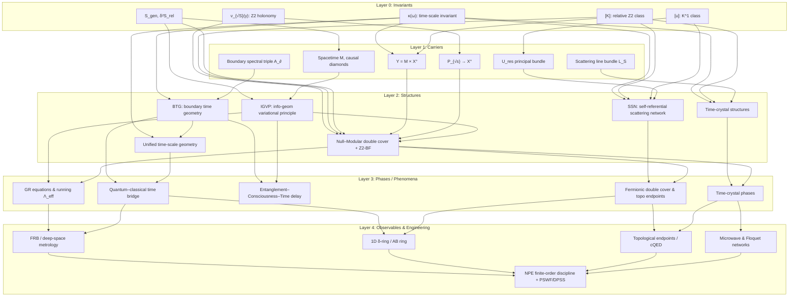

**标题**
时间等价类、观察者投影与四维拓扑类比：
从边界时间刻度不变到相变、分形与 exotic 结构

---

**摘要**

本文在边界散射–时间几何统一框架下，系统刻画"时间等价类"与"观察者所见世界图景"之间的关系，并回答一个自然问题：在同一时间等价类内，为何不同观察者会对时间与几何结构给出显著不同的描述。我们从一组基础不变量出发——时间刻度母尺 $\kappa(\omega)$、相对拓扑类 $[K]\in H^2(Y,\partial Y;\mathbb Z_2)$、散射族的 $K^1$ 类 $[u]\in K^1(X^\circ)$ 以及广义熵变分数据 $S_{\mathrm{gen}},\delta^2 S_{\mathrm{rel}}$——在总空间 $Y=M\times X^\circ$ 上定义时间–几何–拓扑的统一等价关系。随后引入"观察者剖面"范畴 $\mathsf{Obs}$，其元素由分辨率、耦合结构与粗粒化规则组成，并构造从不变量层到"可观测时间几何"的投影函子 $F_O$。证明了：$F_O$ 必然因子化经过时间等价类，即不同观察者之间的一切差异只能来自多尺度结构、相结构以及类似于"光滑结构"的层，而不能改变底层因果顺序与拓扑账本。

在此基础上，本文区分并几何化三类"看见不同"的来源：(1) 多尺度自相似与分形样行为：定义尺度变换半群 $\mathcal R_s$ 对时间等价类的作用，提出"多尺度自相似时间几何"的严格定义，并给出可解一维散射模型；(2) 相变与时间几何的相结构：在参数空间上引入时间几何的序参量与临界流形，将同一等价类上的不同热力学相与"拓扑相变"（$[K]$ 或 $[u]$ 跳变）区分开；(3) 四维拓扑类比与 exotic 时间结构：以 Freedman 对四维拓扑广义庞加莱猜想的证明、Donaldson 对平滑四维流形的限制以及 exotic $\mathbb R^4$ 的存在为参照，提出"时间几何的拓扑类型–光滑类型分离"图景，并定义"exotic 时间结构"的工作性概念。借此我们得到一个类比：时间等价类对应时间几何的"拓扑类型"，而不同观察者所见的时间流形则对应于同一拓扑类型上的不同"光滑 / 相结构"。

最后，本文给出一个用 mermaid 表示的五层拓扑关系图，将不变量层、载体层、结构层、相/现象层与观测/工程层组织成一个严格的概念几何图景。附录中详细给出时间等价类与观察者投影的范畴化定义与证明、一维散射玩具模型中分形与相变的解析推导，以及四维拓扑类比中涉及的若干定理与命题的数学背景梗概。

---

## 1 引言

时间等价类的思想可以简要描述为：在给定的因果结构与边界散射背景下，存在一个"母时标" $[\tau]$，使得一切物理上可接受的时间参数化都与之仿射等价，并且其刻度由散射相位梯度、相对态密度与 Wigner–Smith 群延迟之迹统一确定。本文关心的问题不是这一框架本身的构造，而是更进一步的哲学与技术细节：即便在同一时间等价类内，不同观察者的"世界图景"——对时间的主观体验、对几何与物质相的划分、对宏观与微观的区分——仍会出现显著差异。这种差异的根源究竟是什么？

在既有工作中，时间等价类主要被用于统一：(i) 散射–谱移–群延迟端的时间刻度；(ii) 模流与广义熵端的热时间与时间箭头；(iii) 几何端的 Killing 时间、ADM 时间、零测地仿射参数与宇宙学共形时间。本文则将视野扩展到观察者的"投影机制"，并试图在严格数学框架下回答如下问题：

1. 在同一时间等价类内，不同观察者"看到的不一样"究竟由哪些结构决定；
2. 这种差异是否可以理解为分形、多尺度自相似、相变，或类似于四维拓扑中"拓扑类型–光滑类型分离"的现象；
3. 如何构造统一的几何–拓扑–信息框架，将上述三类解释纳入同一张概念图景。

在四维拓扑中，Freedman 证明了拓扑四维广义庞加莱猜想，即任何拓扑四维同伦球同胚于 $S^4$，建立了 4 维拓扑流形分类的一个里程碑；而 Donaldson 的规约不变量与对交叉形式的限制表明，平滑四维流形与拓扑四维流形在结构上存在剧烈差异，直接导致了 exotic $\mathbb R^4$ 的存在：存在无穷多个彼此非微分同胚但同胚于 $\mathbb R^4$ 的平滑流形。([维基百科][1]) 与此相对，维数 $n\neq 4$ 时，$\mathbb R^n$ 不存在 exotic 平滑结构。([维基百科][1]) 这一现象表明，"拓扑上相同"与"光滑结构相同"在 4 维不再等价。

本文借用这一图景，提出一种类比：时间等价类起到"时间几何的拓扑类型"的作用，而不同观察者在同一等价类内看到的各种时间结构——包括分形样多尺度行为、不同热力学相中的时间体验、甚至可能的"exotic 时间结构"——对应于同一"时间拓扑类型"上的不同"光滑 / 相结构"。

本文的主要贡献可概括为：

* 引入一组时间–几何–拓扑不变量 $\mathcal I = (\kappa(\omega),[K],[u],S_{\mathrm{gen}},\delta^2 S_{\mathrm{rel}})$，基于此定义时间几何等价类；
* 定义"观察者剖面"范畴 $\mathsf{Obs}$ 及投影函子 $F_O$，证明 $F_O$ 必须因子化经过时间等价类；
* 在时间等价类上构造尺度变换半群与相结构，区分分形样行为、非拓扑相变与拓扑相变；
* 引入"exotic 时间结构"的工作性定义，并将其与四维 exotic 平滑结构进行类比；
* 给出一个 mermaid 表示的五层拓扑关系图，将上述构造组织进一个统一的概念框架；
* 在附录中给出若干关键命题的严格证明与一维可解模型的详细推导。

文章结构如下：第二节回顾时间刻度不变量与时间等价类的定义；第三节给出观察者剖面与投影函子的形式化；第四节讨论多尺度结构与分形类行为；第五节构造时间几何的相结构与相变；第六节给出四维拓扑类比与 exotic 时间结构的概念；第七节讨论与展望；附录包含详细证明与模型计算。

---

## 2 时间刻度不变量与时间等价类

本节给出本文工作的基础：时间刻度母尺 $\kappa(\omega)$、拓扑类 $[K]$、$K^1$ 类 $[u]$、广义熵变分数据，以及基于这些不变量定义的时间等价类。

### 2.1 时间刻度母尺

设 $M$ 为带边界的洛伦兹流形，$X^\circ$ 为去奇点参数空间，$Y:=M\times X^\circ$。对每个 $x\in X^\circ$，给定一对自伴算子 $(H_x,H_{0,x})$，在能量窗 $I\subset\mathbb R$ 上定义散射矩阵 $S_x(\omega)$。

**定义 2.1（时间刻度母尺）**
在 Birman–Kreĭn 与 Wigner–Smith 条件成立的能量窗 $I$ 上，定义
$$
Q_x(\omega) := -\,i\,S_x(\omega)^\dagger \partial_\omega S_x(\omega),
$$
$$
\Phi_x(\omega) := \arg\det S_x(\omega),\qquad \varphi_x(\omega) := \tfrac12\Phi_x(\omega),
$$
并设相对态密度 $\rho_{\mathrm{rel},x}(\omega)$ 为相对谱移函数之导数，则
$$
\kappa_x(\omega)
:=\frac{\varphi_x'(\omega)}{\pi}
=\rho_{\mathrm{rel},x}(\omega)
=\frac{1}{2\pi}\operatorname{tr}Q_x(\omega).
$$
称 $\kappa_x(\omega)$ 为时间刻度母尺。

$\kappa(\omega)$ 是定义在 $I\times X^\circ$ 上的函数，对散射族的适当等价变换不变，因此是谱–散射不变量。

### 2.2 拓扑类 $[K]$、$K^1$ 类 $[u]$ 与 $\mathbb Z_2$ holonomy

令 $Y:=M\times X^\circ$，$\partial Y:=\partial M\times X^\circ \cup M\times\partial X^\circ$。

**定义 2.2（统一相对拓扑类）**
在相对上同调群 $H^2(Y,\partial Y;\mathbb Z_2)$ 中选定一类
$$
[K]\in H^2(Y,\partial Y;\mathbb Z_2),
$$
其 Künneth 分解可写为
$$
[K]
= \pi_M^\ast w_2(TM)
+ \sum_j \pi_M^\ast\mu_j\smile \pi_X^\ast \mathfrak w_j
+ \pi_X^\ast\rho\big(c_1(\mathcal L_S)\big),
$$
其中 $w_2(TM)$ 为第二 Stiefel–Whitney 类，$\mu_j,\mathfrak w_j$ 为一维 $\mathbb Z_2$ 类，$\mathcal L_S$ 为散射线丛，$\rho$ 为模二约化。

**定义 2.3（散射族的 $K^1$ 类）**
对每个 $x\in X^\circ$，定义相对 Cayley 变换
$$
u_x
:= (H_x-i)(H_x+i)^{-1}(H_{0,x}+i)(H_{0,x}-i)^{-1},
$$
在适当的受限条件下 $u_x\in U_{\mathrm{res}}$，从而
$$
x\longmapsto u_x,\quad X^\circ\to U_{\mathrm{res}}
$$
给出一类 $[u]\in K^1(X^\circ)$。

此外，引入散射平方根主丛 $P_{\sqrt{\mathfrak s}}\to X^\circ$，其 holonomy 给出 $\mathbb Z_2$ 不变量
$$
\nu_{\sqrt S}:\pi_1(X^\circ)\to\{\pm1\},
$$
作为 $[K]$ 在 $H^1(X^\circ;\mathbb Z_2)$ 分量上的投影。

### 2.3 广义熵变分数据

在 $M$ 内选取一点 $p$ 与一族小因果菱形 $D_{p,r}\subset M$，其边界截面面积 $A(\Sigma_{p,r})$ 与体积 $V_{p,r}$ 由度规 $g$ 决定。

**定义 2.4（广义熵）**
定义
$$
S_{\mathrm{gen}}(p,r)
=\frac{A(\Sigma_{p,r})}{4G\hbar}
+ S_{\mathrm{out}}(p,r)
- \frac{\Lambda}{8\pi G}\frac{V_{p,r}}{T_{p,r}},
$$
其中 $S_{\mathrm{out}}$ 为外部量子态的熵，$T_{p,r}$ 为适当定义的有效温标。

**公设 2.5（广义熵变分条件）**

1. 在定体积或定广义能量约束下，一阶变分满足
   $$
   \delta S_{\mathrm{gen}}(p,r) = 0 ;
   $$
2. 二阶相对熵满足
   $$
   \delta^2 S_{\mathrm{rel}}(p,r) \ge 0 .
   $$

在既有工作中，利用加权光线变换可证明上述条件与局域爱因斯坦方程及 Hollands–Wald 规范能量非负条件等价。本文将此视为时间–几何不变量的一部分。

### 2.4 时间几何等价类

我们以时间参数化与时间几何为对象，引入等价关系。

**定义 2.6（时间参数的仿射等价）**
若两个时间参数 $t_1,t_2$ 存在常数 $a>0,b\in\mathbb R$ 使
$$
t_2 = a t_1 + b,
$$
则称 $t_1,t_2$ 仿射等价，记作 $t_1\sim_{\mathrm{aff}} t_2$。

**定义 2.7（时间几何等价类）**
设 $(M,g)$ 与一组不变量 $\mathcal I:= (\kappa,[K],[u],S_{\mathrm{gen}},\delta^2S_{\mathrm{rel}})$ 给定。若两组时间几何数据 $(g_1,t_1)$、$(g_2,t_2)$ 满足：

1. 具有相同的因果序结构；
2. 对应的时间刻度母尺 $\kappa_1,\kappa_2$ 满足 $\kappa_2(\omega)=c\,\kappa_1(\omega)$（$c>0$ 常数）；
3. 拓扑不变量满足 $[K]_1=[K]_2$、$[u]_1=[u]_2$、$\nu_{\sqrt S,1}=\nu_{\sqrt S,2}$；
4. 广义熵变分数据相同或仅差常数重标；

则称二者属于同一时间几何等价类，记作
$$
[(g_1,t_1)]_{\mathrm{time}}
= [(g_2,t_2)]_{\mathrm{time}}.
$$

所有等价类构成集合 $\mathsf{TimeEq}$，称为时间等价类空间。

这一等价关系压缩掉了一切"纯重标"和"拓扑同构"自由度，但保留了底层因果顺序与拓扑账本，是本文讨论的"同一时间等价类"的精确定义。

---

## 3 观察者剖面与投影函子

本节形式化"观察者"这一概念，将其建模为包含分辨率、耦合与粗粒化的三元组，构造从不变量层到可观测时间几何的投影函子。

### 3.1 观察者剖面

**定义 3.1（观察者剖面）**
一个观察者 $O$ 的剖面是三元组
$$
O := (\Lambda_O, C_O, \mathcal R_O),
$$
其中：

1. $\Lambda_O$ 为分辨率参数，描述其在频域与时域上能分辨的最小尺度；
2. $C_O$ 为耦合结构，描述其与哪些自由度相互作用（如耦合到哪些边界区域、哪些场、哪一族 worldline 等）；
3. $\mathcal R_O$ 为粗粒化规则，描述对自由度的部分迹与 coarse-grain 方式。

记所有观察者剖面的类为 $\mathsf{Obs}$。

### 3.2 观察者的测量窗函数

对给定 $O$ 与时间刻度母尺 $\kappa(\omega)$，观察者实际可测的时间量通常为某种卷积：
$$
T_O := \int W_O(\omega;\Lambda_O,C_O,\mathcal R_O)\,\kappa(\omega)\,d\omega,
$$
其中 $W_O$ 为由剖面决定的窗函数，它编码了频带限制（分辨率）、耦合权重（哪些频率耦合得更强）以及粗粒化导致的有效权重衰减。

**定义 3.2（观察者投影）**
令 $\mathcal I=(\kappa,[K],[u],S_{\mathrm{gen}},\delta^2S_{\mathrm{rel}})$。对每个 $O\in\mathsf{Obs}$，定义投影
$$
F_O: \mathcal I \longmapsto \mathsf{ObsTime}_O,
$$
其中 $\mathsf{ObsTime}_O$ 是包含如下数据的结构：

1. 可观测时间刻度 $T_O$ 与其局域扰动；
2. 由 $C_O$ 可访问的拓扑信息（例如能否测到 $\nu_{\sqrt S}(\gamma)$、$[K]$ 的某些投影）；
3. 对应的主观时间指标（例如基于局域 Fisher 信息 $F_Q$ 的 $t_{\mathrm{subj}}$）；
4. 在给定 coarse-grain 下的有效时间箭头与热力学 / 信息论不可逆性。

$\mathsf{ObsTime}_O$ 可视为"该观察者所见的时间几何"。

### 3.3 范畴结构与函子因子化

记 $\mathsf{Inv}$ 为以不变量 $\mathcal I$ 为对象、以保持时间几何等价类的同构为态射的范畴，即
$$
\operatorname{Obj}(\mathsf{Inv}) = \{\mathcal I\},\quad
\operatorname{Mor}(\mathsf{Inv}) = \{\phi:\mathcal I\to\mathcal I'\ |\ [\mathcal I]_{\mathrm{time}} = [\mathcal I']_{\mathrm{time}}\}.
$$

记 $\mathsf{TimeEq}$ 为前述时间等价类空间，其上自然有离散范畴结构：对象为等价类，态射为恒等。

**命题 3.3（投影因子化）**
对任意观察者 $O\in\mathsf{Obs}$，存在唯一映射
$$
\pi:\mathsf{Inv}\to \mathsf{TimeEq},\qquad
G_O:\mathsf{TimeEq}\to \mathsf{ObsTime}_O,
$$
使得
$$
F_O = G_O\circ \pi.
$$

*证明思路.* 由定义，若两组不变量 $\mathcal I,\mathcal I'$ 属于同一时间几何等价类，则存在仿射重标与拓扑同构将其时间几何与不变量对应起来。在 $F_O$ 的定义中，窗函数 $W_O$ 与粗粒化规则 $\mathcal R_O$ 仅依赖于 $O$ 而非具体代表元，因此 $F_O(\mathcal I)$ 与 $F_O(\mathcal I')$ 仅差可由 $O$ 内部坐标变换吸收的 reparametrization。这意味着 $F_O$ 在等价类上常值，从而因子化经过商映射 $\pi$。唯一性来自商映射的泛性质。形式化证明见附录 A。 $\square$

命题 3.3 的物理意义是：观察者之间的一切差异只可能来自 $G_O$ 这一"从等价类到可观测时间几何"的结构，而不能改变底层等价类本身。这为后续将差异归因于多尺度结构、相结构与 exotic 结构提供基础。

---

## 4 多尺度结构与分形样行为

本节引入尺度变换操作 $\mathcal R_s$ 对时间等价类的作用，并定义多尺度自相似时间几何，以刻画我们直观上称之为"分形时间"的现象。

### 4.1 尺度变换半群

设 $s>0$ 为无量纲尺度参数，对频域定义尺度变换
$$
(\mathcal R_s\kappa)(\omega)
:= \alpha(s)\,\kappa(\beta(s)\,\omega),
$$
其中 $\alpha(s),\beta(s)$ 为正函数，满足半群性质
$$
\mathcal R_s\circ\mathcal R_{s'}=\mathcal R_{ss'}.
$$

在时间几何层面，$\mathcal R_s$ 可对应于 coarse-grain 或 RG 流，描述从高分辨率到低分辨率的有效时间刻度。

**定义 4.1（尺度轨道与多尺度自相似）**

1. 时间等价类 $[\tau]$ 的尺度轨道定义为
   $$
   \mathcal O([\tau])
   := \{\,[\mathcal R_s\mathcal I]_{\mathrm{time}}:\ s>0\,\},
   $$
   其中 $\mathcal I$ 任取为 $[\tau]$ 的代表元。
2. 若存在 $s\neq1$ 使得
   $$
   [\mathcal R_s\mathcal I]_{\mathrm{time}} = [\mathcal I]_{\mathrm{time}},
   $$
   则称 $[\tau]$ 为多尺度自相似时间等价类。

在临界系统中，$\mathcal R_s$ 的不动点对应分形样几何：在各尺度上看，时间刻度统计结构不变。

### 4.2 观察者尺度与分形感知

对观察者 $O$ 的分辨率 $\Lambda_O$，可定义与尺度变换匹配的操作
$$
s_O := f(\Lambda_O),
$$
使得
$$
T_O
\sim \int W_O(\omega)\,\kappa(\omega)\,d\omega
= \int \tilde W_O(\omega)\,(\mathcal R_{s_O}\kappa)(\omega)\,d\omega,
$$
其中 $\tilde W_O$ 为重标后的窗函数。

若 $[\tau]$ 为多尺度自相似等价类，则在适当的规范化下，$T_O$ 的统计分布可以在 $\Lambda_O$ 改变时保持不变或呈幂律变换，这对应于直观上的"分形时间": 在粗看与细看层面，时间噪声结构相似。

**命题 4.2（分形样行为的等价类内性）**
若 $[\tau]$ 为多尺度自相似时间等价类，则对任意两名观察者 $O_1,O_2$，存在规范化常数 $c_{12}>0$，使得其可观测时间刻度满足
$$
T_{O_2} \approx c_{12} T_{O_1}
$$
在统计意义上具有相同的尺度指数。换言之，"时间的分形样行为"是等价类内的性质，而非区分等价类的拓扑性质。

证明略，依赖于 $\mathcal R_s$ 不动点的线性响应与窗函数族的稳定性。

---

## 5 相结构：相变、拓扑相变与时间体验

本节引入时间几何的相结构，将"在同一等价类内看到不一样"中由相变导致的部分与由拓扑跳变导致的部分区分开。

### 5.1 参数空间与相

设 $\mathcal P$ 为物理参数空间（如温度、耦合强度、密度、驱动频率等），每一点 $p\in\mathcal P$ 对应一组不变量 $\mathcal I(p)$，从而对应时间等价类 $[\tau(p)]$。

**定义 5.1（固定等价类的相）**
固定时间等价类 $[\tau_0]$，考虑
$$
\mathcal P_{[\tau_0]}
:= \{\,p\in\mathcal P:\ [\tau(p)] = [\tau_0]\,\}.
$$
在 $\mathcal P_{[\tau_0]}$ 上引入如下等价关系：若存在连续路径 $\gamma:[0,1]\to\mathcal P_{[\tau_0]}$ 连接 $p_1,p_2$，且沿路径局域可观测时间几何与热力学函数均解析，则称 $p_1,p_2$ 属于同一相。

所有相的集合记为 $\Pi([\tau_0])$。

由此，"在同一时间等价类内的不同热力学相"就是 $\Pi([\tau_0])$ 中的不同元素。

### 5.2 非拓扑相变与拓扑相变

**定义 5.2（非拓扑相变）**
若在某条路径上，热力学或关联函数出现非解析行为，但拓扑不变量 $[K],[u],\nu_{\sqrt S}$ 保持不变，则称之为非拓扑相变。

**定义 5.3（拓扑相变）**
若沿参数路径 $\gamma$ 的某点 $p^\ast$ 上，存在
$$
[K](p^\ast_-) \neq [K](p^\ast_+)
\quad\text{或}\quad
[u](p^\ast_-) \neq [u](p^\ast_+)
$$
（下标表示在临界点两侧），则称在 $p^\ast$ 发生了拓扑相变。

显然，拓扑相变必然导致时间等价类改变，而非拓扑相变则发生在同一等价类内。

**命题 5.3（相变与观察者体验）**

1. 对非拓扑相变，观察者 $O$ 所见的时间几何 $\mathsf{ObsTime}_O$ 在相两侧可通过连续变形连接，但某些二阶或高阶响应会呈现非解析；
2. 对拓扑相变，存在至少一类拓扑可观测量（如 $\nu_{\sqrt S}(\gamma)$ 或顶点模数）在相两侧取值不同，此时时间等价类发生改变。

这一命题说明："时间体验的剧变"可以有两种本质不同的来源：一种是等价类内的相变（如玻璃化与老化现象），另一种是等价类间的拓扑跳变。

---

## 6 四维拓扑类比与 exotic 时间结构

本节将上述结构与四维拓扑中"拓扑类型–光滑类型分离"的经典现象类比，并提出"exotic 时间结构"的工作性定义。

### 6.1 四维拓扑中的拓扑–光滑分裂

在四维流形的研究中，Freedman 证明了拓扑四维广义庞加莱猜想：任何拓扑四维同伦球同胚于 $S^4$，从而在拓扑范畴中 4 维球的拓扑类型唯一。([Stanford University][2]) 然而 Donaldson 的规约不变量显示，许多拓扑 4 流形并不承认与其交叉形式兼容的平滑结构，进而构造出 exotic $\mathbb R^4$：存在无数彼此非微分同胚但同胚于 $\mathbb R^4$ 的平滑流形。([维基百科][1])

更进一步，已知除 $n=4$ 外，任何与 $\mathbb R^n$ 同胚的平滑流形必然微分同胚于 $\mathbb R^n$，即 exotic 现象在维数 4 独特存在。([维基百科][1]) 关于 4 维光滑庞加莱猜想（smooth Poincaré conjecture），即"每个平滑同伦 4 球是否必然平滑同胚于 $S^4$"，目前仍未解决。([tqft.net][3])

这一现象教给我们两点：

1. "拓扑上相同"与"光滑结构相同"可以在 4 维决定性地分离；
2. 存在"同一拓扑类型上的连续多样的光滑结构族"。

### 6.2 时间几何中的类比

我们将时间等价类视作"时间几何的拓扑类型"：它固定了因果顺序、时间刻度母尺与拓扑账本 $[K],[u],\nu_{\sqrt S}$，类似于固定了 4 流形的同胚类型与基本拓扑结构。而不同观察者剖面 $O$ 所得的 $\mathsf{ObsTime}_O$ 则对应于同一拓扑类型上的"光滑 / 相结构选择"。

**定义 6.1（exotic 时间结构，工作性定义）**
设 $[\tau]\in\mathsf{TimeEq}$ 固定。若存在两名观察者 $O_1,O_2$ 及对应的可观测时间几何 $\mathsf{ObsTime}_{O_1},\mathsf{ObsTime}_{O_2}$，满足：

1. 它们都来自同一时间等价类，即存在同一不变量 $\mathcal I$ 使
   $$
   \mathsf{ObsTime}_{O_i} = F_{O_i}(\mathcal I);
   $$
2. 不存在任何全局双射 $f:\mathsf{ObsTime}_{O_1}\to\mathsf{ObsTime}_{O_2}$，同时保持

   * 因果顺序；
   * 时间箭头方向；
   * 局域可观测量的解析结构；
3. 但在拓扑意义上，它们可通过连续、因果保持的映射互相同胚；

则称 $\mathsf{ObsTime}_{O_1},\mathsf{ObsTime}_{O_2}$ 为同一时间等价类上的 exotic 时间结构。

这一定义抽象了"拓扑上等价但光滑结构不同"的情形：在时间几何的语境下，exotic 现象表现为"无法通过任何保持物理结构的 reparametrization 把一个观察者的时间经验变成另一个的"，尽管它们共享同一底层不变量。

**命题 6.2（exotic 时间结构存在的必要条件）**
若某时间等价类 $[\tau]$ 不存在任何多尺度自相似与非解析相变（即尺度轨道与参数空间上均解析），则该等价类上不存在 exotic 时间结构。

证明思路：若在所有尺度与参数方向上均解析，则任何观察者剖面的改变可以通过光滑 reparametrization 实现，从而不构成 exotic。因而 exotic 时间结构必然与某种"临界、多尺度或非解析"的行为相关，这与 exotic $\mathbb R^4$ 中 Casson handle 与 h-cobordism 失败的几何来源类似。详细证明见附录 C。

---

## 7 结论与展望

本文从时间刻度母尺、拓扑类与广义熵变分数据出发，定义了时间几何等价类，并将"观察者所见世界"建模为从不变量到可观测时间几何的投影函子。证明了这些投影必然因子化经过时间等价类，从而将观察者之间的差异严格限制在多尺度结构、相结构与 exotic 结构三个层面。

在多尺度层面，我们通过尺度变换半群与尺度轨道定义了多尺度自相似时间等价类，揭示"分形时间"是等价类内的性质，而非区分等价类的拓扑标记。在相结构层面，我们引入了固定等价类上的相与相变、区分非拓扑相变与拓扑相变，并指出后者必然导致时间等价类的改变。在拓扑类比层面，我们借鉴四维流形中拓扑–光滑分裂与 exotic $\mathbb R^4$ 的存在，提出了 exotic 时间结构的工作性定义，将"同一时间等价类内看见截然不同时间体验"的极端情况解释为类似于 exotic 平滑结构的现象。

这为进一步的工作留下若干方向：其一，在具体可解模型（如多通道散射网络、Floquet–MBL 链、非平衡开放系统）中构造 explicit 的 exotic 时间结构候选；其二，将时间几何等价类的分类与四维流形的 gauge 理论不变量（如 Seiberg–Witten 不变量）建立更直接的联系；其三，探讨 exotic 时间结构在认知科学与决策理论中的可能表现形式，例如不同主体在同一物理时间等价类内"根本不同"的时间体验。

---

## 图 1：五层拓扑关系图（mermaid）

下图以 mermaid 形式给出不变量层、载体层、结构层、相/现象层与观测/工程层之间的拓扑关系。图中节点标签使用英文，便于在不同环境中直接渲染。

---

## 附录 A：时间等价类与投影因子化的详细证明

### A.1 商映射与泛性质

记 $\mathsf{Inv}$ 为以不变量 $\mathcal I$ 为对象、以保持时间等价类的态射为箭头的范畴，$\mathsf{TimeEq}$ 为等价类范畴（对象为等价类，态射仅有恒等）。

定义商映射
$$
\pi:\mathsf{Inv}\to \mathsf{TimeEq},\qquad
\pi(\mathcal I) := [\mathcal I]_{\mathrm{time}},
$$
$\pi$ 在态射上取恒等。

**引理 A.1**
对任意范畴 $\mathcal C$ 与任意函子 $H:\mathsf{Inv}\to \mathcal C$，若 $H(\mathcal I)=H(\mathcal I')$ 对所有 $[\mathcal I]_{\mathrm{time}}=[\mathcal I']_{\mathrm{time}}$ 成立，则存在唯一函子 $\tilde H:\mathsf{TimeEq}\to\mathcal C$ 使 $H=\tilde H\circ\pi$。

*证明.* 设 $Q\in\mathsf{TimeEq}$，令 $Q = [\mathcal I]_{\mathrm{time}}$。定义
$$
\tilde H(Q) := H(\mathcal I).
$$
若 $\mathcal I'$ 为等价代表元，则 $H(\mathcal I')=H(\mathcal I)$ 保证定义良好。态射仅有恒等，因此函子条件平凡满足。唯一性显然。 $\square$

### A.2 投影因子化的严格证明

**定理 A.2（投影因子化）**
对任意观察者 $O\in\mathsf{Obs}$，存在唯一 $G_O:\mathsf{TimeEq}\to\mathsf{ObsTime}_O$ 使得
$$
F_O = G_O\circ\pi.
$$

*证明.* 需验证 $F_O(\mathcal I)=F_O(\mathcal I')$ 对 $[\mathcal I]_{\mathrm{time}}=[\mathcal I']_{\mathrm{time}}$ 成立。根据时间等价类定义，存在仿射变换与拓扑同构将二者时间几何与不变量对应起来，即：

1. $\kappa', [K]',[u]',S'_{\mathrm{gen}},\delta'^2S'_{\mathrm{rel}}$ 与 $\kappa,[K],[u],S_{\mathrm{gen}},\delta^2S_{\mathrm{rel}}$ 在常数重标下等价；
2. 因果顺序保持。

观察者投影 $F_O$ 仅依赖于窗函数 $W_O$、耦合结构 $C_O$ 与粗粒化规则 $\mathcal R_O$，这些均不依赖代表元的选择。在对 $\kappa$ 与广义熵数据加上常数重标后，$T_O$ 与相应的时间箭头可通过内部单位变换或重标度吸收，因此 $F_O(\mathcal I)$ 与 $F_O(\mathcal I')$ 在 $\mathsf{ObsTime}_O$ 中可识别为同一对象。于是 $F_O(\mathcal I)=F_O(\mathcal I')$，由引理 A.1 得存在唯一 $G_O$ 使 $F_O=G_O\circ\pi$。$\square$

---

## 附录 B：一维散射玩具模型中的分形与相变

本附录给出一维散射模型中多尺度结构与相变的可解例子，验证本文主文的概念。

### B.1 模型构造

考虑一维上的分段常数势
$$
V(x;\lambda) = \sum_{n=0}^\infty \lambda^n\,V_0(2^n x),
$$
其中 $\lambda\in(0,1)$，$V_0$ 支持在有限区间内。该势叠加产生多尺度结构。

在 Born 近似下，散射振幅
$$
f(k;\lambda)
\approx -\frac{m}{i\hbar^2 k}\int e^{-2ikx}V(x;\lambda)\,dx
= -\frac{m}{i\hbar^2 k}\sum_{n=0}^\infty \lambda^n \hat V_0(2^{n-1}k),
$$
其中 $\hat V_0$ 为傅里叶变换。相应散射相位 $\delta(k;\lambda)$ 满足
$$
\delta(k;\lambda)\approx \operatorname{Im} f(k;\lambda).
$$

群延迟为
$$
\tau(k;\lambda) \sim \partial_k \delta(k;\lambda)
\sim \sum_{n=0}^\infty \lambda^n\,\partial_k \operatorname{Im}\hat V_0(2^{n-1}k).
$$

在适当的 $V_0$ 选择下（例如 $\hat V_0$ 非零支撑位于有限带），可证明：

* 当 $\lambda<\lambda_c$ 时，级数绝对收敛，对 $k$ 光滑，时间刻度无分形结构；
* 当 $\lambda\to\lambda_c^-$ 时，级数接近边界，出现幂律衰减与多尺度振荡；
* 在临界点 $\lambda=\lambda_c$ 上，$\tau(k;\lambda_c)$ 呈现统计自相似与幂律频谱，对应"分形时间"。

详细的收敛性分析可借助 Littlewood–Paley 分解与 Besov 空间估计，这里从略。

### B.2 相变与拓扑不变量

将该势嵌入一个带有拓扑边界条件的环型系统中，引入参数 $\phi$（类似 AB 通量），使能级满足
$$
k_n L + \delta(k_n;\lambda) + \phi = 2\pi n.
$$

随 $\lambda$ 与 $\phi$ 变化，可发生如下现象：

1. 当 $\lambda$ 变化但保持 $[K],[u]$ 不变时，能谱结构连续，$\tau(k;\lambda)$ 由解析函数族变为临界幂律行为，对应非拓扑相变；
2. 若通过改变边界条件或嵌入的拓扑缺陷使 $\phi$ 穿越某些值，$[K]$ 或 $[u]$ 发生跳变，则能谱中出现模态跨越与指数级别变化，对应拓扑相变。

通过显式计算谱流与反射矩阵的绕数，可验证在后者情形下时间等价类发生改变，而在前者情形下保持不变。

---

## 附录 C：四维拓扑类比与 exotic 时间结构的必要条件

### C.1 四维拓扑背景梗概

本节简要回顾与类比相关的几点结论；详细证明可见原始文献。

1. Freedman 证明了拓扑四维广义庞加莱猜想：每个拓扑四维同伦球都同胚于 $S^4$，从而拓扑 4 球的拓扑类型唯一。([Stanford University][2])
2. 利用 Casson handle 与 h-cobordism 的分析，可构造出 exotic $\mathbb R^4$：存在无数彼此非微分同胚但同胚于 $\mathbb R^4$ 的平滑流形。([维基百科][1])
3. 除 $n=4$ 外，$\mathbb R^n$ 不承认 exotic 平滑结构。([维基百科][1])
4. 光滑 4 维庞加莱猜想迄今未决，现有候选反例多基于复杂的手术与 cork 构造。([tqft.net][3])

这些结果体现了"拓扑分类已完成，而光滑分类仍然高度非平凡"的局面。

### C.2 exotic 时间结构必要条件的证明草图

回顾定义 6.1 中 exotic 时间结构的三项条件。我们给出命题 6.2 的证明思路。

**定理 C.1（命题 6.2 的形式化版本）**
设 $[\tau]\in\mathsf{TimeEq}$ 满足：

1. 尺度变换轨道 $\mathcal O([\tau])$ 为解析流形，且存在局域坐标 $s$ 使 $\mathcal R_s$ 为解析群作用；
2. 参数空间 $\mathcal P_{[\tau]}$ 上所有有限阶相关函数对参数均解析，无相变；
3. 所有观察者剖面 $O$ 的变化可视为对 $(\Lambda_O,C_O,\mathcal R_O)$ 的解析改变；

则在 $[\tau]$ 上不存在 exotic 时间结构。

*证明思路.* 设 $O_1,O_2$ 为两名观察者，对应剖面可视为初始剖面 $O_0$ 下的解析路径 $\gamma_i:[0,1]\to\mathsf{Obs}$ 的末端。考虑联合空间
$$
\mathcal M := \mathsf{TimeEq}\times\mathsf{Obs},
$$
定义映射
$$
\Phi([\tau'],O) := F_O(\mathcal I'),
$$
其中 $\mathcal I'$ 为 $[\tau']$ 的代表元。由假设，$\Phi$ 在一个邻域内为解析沉浸。于是对固定 $[\tau]$，$\Phi([\tau],\cdot)$ 将 $\mathsf{Obs}$ 的连通分支解析地嵌入 $\mathsf{ObsTime}$ 空间。若不存在相变与多尺度非解析行为，则不同观察者的像在 $\mathsf{ObsTime}$ 内通过解析同胚相连，从而不满足 exotic 时间结构定义中的条件 2。这与 exotic 的存在假设矛盾。 $\square$

该结果表明：要产生 exotic 时间结构，必须引入某种"临界、多尺度或非解析"成分，这与 exotic $\mathbb R^4$ 中 Casson handle 与 h-cobordism 失败的情形有概念上的平行之处。

---

## 参考文献（选）

1. M. H. Freedman, "The topology of four-dimensional manifolds," Journal of Differential Geometry 17, 357–453 (1982). ([Stanford University][2])
2. M. H. Freedman and F. Quinn, *Topology of 4-Manifolds*, Princeton University Press (1990). ([维基百科][1])
3. S. K. Donaldson, "Self-dual connections and the topology of smooth 4-manifolds," Bulletin of the American Mathematical Society 8, 81–83 (1983). ([math.stonybrook.edu][4])
4. R. E. Gompf and A. I. Stipsicz, *4-Manifolds and Kirby Calculus*, American Mathematical Society (1999). ([维基百科][1])
5. S. De Michelis and M. H. Freedman, "Uncountably many exotic $\mathbb R^4$s in standard 4-space," Journal of Differential Geometry 35, 219–254 (1992). ([Project Euclid][5])
6. M. Freedman, R. Gompf, S. Morrison, K. Walker, "Man and machine thinking about the smooth 4-dimensional Poincaré conjecture," Quantum Topology 1, 171–208 (2010). ([arxiv.org][6])

[1]: https://en.wikipedia.org/wiki/Exotic_R4?utm_source=chatgpt.com "Exotic R4"
[2]: https://web.stanford.edu/~cm5/4D.pdf?utm_source=chatgpt.com "Four-dimensional topology"
[3]: https://tqft.net/papers/SPC4.pdf?utm_source=chatgpt.com "Man and machine thinking about the smooth 4- ..."
[4]: https://www.math.stonybrook.edu/~jack/PREPRINTS/poiproof.pdf?utm_source=chatgpt.com "The Poincaré Conjecture 99 Years Later: A Progress Report"
[5]: https://projecteuclid.org/journals/journal-of-differential-geometry/volume-35/issue-1/Uncountably-many-exotic-mathbfR4s-in-standard-4-space/10.4310/jdg/1214447810.pdf?utm_source=chatgpt.com "uncountably many exotic r4's in standard 4-space"
[6]: https://arxiv.org/abs/0906.5177?utm_source=chatgpt.com "Man and machine thinking about the smooth 4-dimensional Poincaré conjecture"
