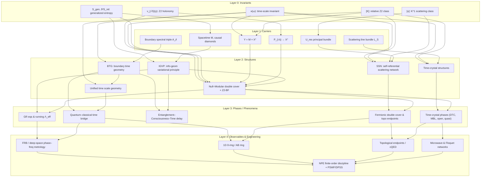

# 拓扑不变量驱动的边界时间–几何–拓扑统一理论

## 摘要

本文构建一个以拓扑不变量为起点的完整统一理论框架，将时间刻度、散射拓扑、引力场方程、时间晶体、自指散射网络以及意识–决策时间等结构组织成一幅有层次的概念几何图景。核心思想是：在总空间 $Y = M \times X^\circ$ 上，存在一小组拓扑与谱不变量——时间刻度母尺 $\kappa(\omega)$、散射平方根的 $\mathbb Z_2$ holonomy $\nu_{\sqrt S}(\gamma)$、相对上同调类 $[K] \in H^2(Y,\partial Y;\mathbb Z_2)$、散射族的 $K^1$ 类 $[u] \in K^1(X^\circ)$ 以及广义熵变分条件 $S_{\mathrm{gen}},\delta^2 S_{\mathrm{rel}}$。这些不变量通过主丛、谱丛与边界谱三元组等载体，生成一批结构层：边界时间几何 (Boundary Time Geometry, BTG)、Null–Modular 双覆盖与 $\mathbb Z_2$-BF 顶项、信息几何变分原理 (IGVP)、自指散射网络 (SSN)、时间晶体结构以及统一时间刻度几何。进一步，这些结构在宏观上表现为广义相对论方程及运行宇宙学常数、量子–经典时间桥接、纠缠–意识–时间的统一延迟、费米子与拓扑超导端点的拓扑起源、以及多类时间晶体相。最后，这些相在快速射电暴、深空链路、一维 $\delta$-势环与 Aharonov–Bohm 环、拓扑端点 cQED 装置与微波 Floquet 网络中得到观测与工程实现，并统一落在同一套有限阶 Nyquist–Poisson–Euler–Maclaurin (NPE) 误差纪律之下。

文中给出一个以 mermaid 描述的拓扑关系图，将整个理论组织成五层：母不变量层、载体 (carriers) 层、结构层、相/现象层与观测/工程层。主要结果可概括为三条统一原则：(1) 时间统一原则：时间刻度母尺 $\kappa(\omega)$ 诱导唯一的时间等价类 $[\tau]$，将散射时间、模时间与几何时间统一为边界翻译算子；(2) 拓扑–引力统一原则：在局域 IGVP 与 Null–Modular 假设下，爱因斯坦方程与规范能量非负等价于相对 $\mathbb Z_2$ 类 $[K]$ 的消失，即"无拓扑异常"；(3) 动力学–拓扑统一原则：时间晶体、自指散射网络与费米子统计均可视作 $[K]$ 与 $[u]$ 在时间方向与参数空间上的不同投影。整体上，宇宙被刻画为一张带有 $\mathbb Z_2$ 与 $K^1$ 结构的边界散射网络，时间是其上由相位梯度刻度出的唯一母尺，而几何、拓扑、意识与工程读数则是这一母尺的多重展开。

---

## 第一节 预备：总空间、散射系统与时间刻度不变量

### 1.1 总空间与参数化散射系统

设 $(M,g)$ 为带边界的洛伦兹流形，$\partial M$ 为外部边界或因果截面。设 $X$ 为参数空间（如外场强度、拓扑通量、驱动周期等），$D \subset X$ 为判别子，令去奇点参数空间为 $X^\circ = X \setminus D$。定义总空间
$$
Y := M \times X^\circ,\qquad \partial Y := \partial M \times X^\circ \,\cup\, M \times \partial X^\circ .
$$

在每一点 $x \in X^\circ$ 上，考虑一对自伴算子 $(H_x,H_{0,x})$ 以及相应的散射矩阵 $S_x(\omega)$。假设 $S_x(\omega)$ 在能量区间 $I \subset \mathbb R$ 上可微且满足标准的 trace class 扰动假设。

定义 Wigner–Smith 时间延迟矩阵
$$
Q_x(\omega) := -\,i\,S_x(\omega)^\dagger \,\partial_\omega S_x(\omega),
$$
其迹 $\operatorname{tr}Q_x(\omega)$ 刻画总群延迟。令
$$
\Phi_x(\omega) := \arg\det S_x(\omega),\qquad
\varphi_x(\omega) := \tfrac12\Phi_x(\omega)
$$
为总散射相位及其半相位。

### 1.2 时间刻度母尺

**定义 1.1（时间刻度母尺）**
在上述条件下，定义时间刻度密度
$$
\kappa_x(\omega)
:=\frac{\varphi_x'(\omega)}{\pi}
=\rho_{\mathrm{rel},x}(\omega)
=\frac{1}{2\pi}\operatorname{tr}Q_x(\omega),
$$
其中 $\rho_{\mathrm{rel},x}(\omega)$ 为相对态密度或 Kreĭn 谱移密度的导数。

$\kappa_x(\omega)$ 是定义在 $I \times X^\circ$ 上的函数，具有如下性质：

1. 对每个固定 $x$，$\kappa_x(\omega)$ 在 $I$ 上局部可积；
2. 在适当的 trace class 条件下，$\int_I \kappa_x(\omega)\,d\omega$ 等于相对谱流；
3. 对任意平滑参数路径 $\gamma:[0,1]\to X^\circ$，$\kappa_{\gamma(t)}(\omega)$ 随 $t$ 连续变化。

**命题 1.2**
在给定的散射族 $(H_x,H_{0,x})_{x\in X^\circ}$ 上，$\kappa_x(\omega)$ 在满足 Birman–Kreĭn 条件的任意等价选择下不变，因此是该相对类的谱–散射不变量。

**解释**：$\kappa(\omega)$ 同时统一了散射相位梯度、相对态密度与 Wigner–Smith 群延迟迹，是之后所有时间结构的母刻度。

---

## 第二节 拓扑不变量：$\mathbb Z_2$ holonomy、相对类 $[K]$ 与 $K^1$

### 2.1 散射平方根与 $\mathbb Z_2$ holonomy

在能量窗 $I$ 内，引入压缩散射行列式 $\det_p S_x(\omega)$，其对数给出 renormalized 谱移函数 $\xi_p(\omega;x)$。定义单值函数
$$
\mathfrak s(x) := e^{-2\pi i \xi_p(\omega_0;x)},
$$
其中 $\omega_0 \in I$ 为固定参考能量。对每个 $x\in X^\circ$，选择满足
$$
\sigma(x)^2 = \mathfrak s(x)
$$
的平方根，定义主丛
$$
P_{\sqrt{\mathfrak s}} := \{(x,\sigma):\ x\in X^\circ,\ \sigma^2=\mathfrak s(x) \}\to X^\circ .
$$

对任意闭路 $\gamma:S^1\to X^\circ$，定义 holonomy
$$
\nu_{\sqrt S}(\gamma) := \operatorname{Hol}(P_{\sqrt{\mathfrak s}},\gamma)\in\{+1,-1\}.
$$

**定义 2.1（$\mathbb Z_2$ holonomy）**
不变量
$$
\nu_{\sqrt S}: \pi_1(X^\circ)\to \{\pm1\}
$$
称为散射平方根的 $\mathbb Z_2$ holonomy，记录半相位分支在绕行闭路时是否翻转。

这是之后 Null–Modular 双覆盖、时间晶体拓扑异常以及费米子统计的核心离散不变量。

### 2.2 相对上同调类 $[K] \in H^2(Y,\partial Y;\mathbb Z_2)$

利用 Künneth 分解
$$
H^2(Y,\partial Y;\mathbb Z_2)
\cong
H^2(M,\partial M;\mathbb Z_2)\otimes H^0(X^\circ;\mathbb Z_2)
\oplus
H^1(M,\partial M;\mathbb Z_2)\otimes H^1(X^\circ;\mathbb Z_2)
\oplus
H^0(M;\mathbb Z_2)\otimes H^2(X^\circ,\partial X^\circ;\mathbb Z_2),
$$
可将任意类 $[K]$ 写成
$$
[K] = \pi_M^\ast w_2(TM)
+ \sum_j \pi_M^\ast \mu_j \smile \pi_X^\ast \mathfrak w_j
+ \pi_X^\ast \rho\big(c_1(\mathcal L_S)\big),
$$
其中 $w_2(TM)\in H^2(M;\mathbb Z_2)$ 为第二 Stiefel–Whitney 类，$\mu_j\in H^1(M,\partial M;\mathbb Z_2)$ 与 $\mathfrak w_j\in H^1(X^\circ;\mathbb Z_2)$ 对应于各种一维 $\mathbb Z_2$ 束，$\rho$ 为模二约化，$\mathcal L_S$ 为散射线丛。

**定义 2.2（相对拓扑类）**
称
$$
[K] \in H^2(Y,\partial Y;\mathbb Z_2)
$$
为统一的相对拓扑类，将时空自旋障碍、参数空间 $\mathbb Z_2$ 束与散射线丛的扭挠一并编码。

### 2.3 散射族的 $K^1$ 类

对每个 $x\in X^\circ$，定义相对 Cayley 变换
$$
u_x := (H_x-i)(H_x+i)^{-1}(H_{0,x}+i)(H_{0,x}-i)^{-1}.
$$
在适当的受限条件下，$u_x$ 落在受限酉群 $U_{\mathrm{res}}$ 中，从而确定一个映射
$$
X^\circ\ni x\longmapsto u_x \in U_{\mathrm{res}}.
$$

**定义 2.3（散射族的 $K^1$ 类）**
上述映射定义一个 $K$-理论类
$$
[u]\in K^1(X^\circ),
$$
称为散射族的 $K^1$ 类。它的整值谱流给出参数演化中模式跨越本征值 $0$ 的个数，并将在自指散射网络与时间晶体的拓扑分类中扮演角色。

### 2.4 广义熵不变量与相对熵二阶条件

在 $M$ 中选定一点 $p\in M$ 及其邻域，为每个尺度 $r>0$ 构造小因果菱形 $D_{p,r} \subset M$。令 $\Sigma_{p,r}$ 为菱形边界截面，$A(\Sigma_{p,r})$ 为其面积，$V_{p,r}$ 为对应体积，$T_{p,r}$ 为适当定义的"有效温标"。

**定义 2.4（广义熵函数）**
在 $D_{p,r}$ 上定义广义熵
$$
S_{\mathrm{gen}}(p,r)
= \frac{A(\Sigma_{p,r})}{4G\hbar}
+ S_{\mathrm{out}}(p,r)
- \frac{\Lambda}{8\pi G}\frac{V_{p,r}}{T_{p,r}},
$$
其中 $S_{\mathrm{out}}$ 为外部量子场的冯·诺依曼熵。

**公设 2.5（广义熵变分条件）**

1. 一阶变分极值：在适当的约束（如定体积或定广义能量）下，
   $$
   \delta S_{\mathrm{gen}}(p,r) = 0 .
   $$
2. 二阶相对熵非负：
   $$
   \delta^2 S_{\mathrm{rel}}(p,r) \ge 0 ,
   $$
   其中 $S_{\mathrm{rel}}$ 为相对熵或规范能量等价物。

这组条件将在后文被证明等价于局域爱因斯坦方程与规范能量非负，并通过 Null–Modular 结构与 $[K]$ 联系。

---

## 第三节 载体：主丛、谱丛与边界谱三元组

### 3.1 主丛与 $K$-理论几何

上一节已经引入了三个与拓扑不变量对应的主丛或向量丛：

1. 散射平方根主丛 $P_{\sqrt{\mathfrak s}} \to X^\circ$，其 holonomy 给出 $\nu_{\sqrt S}(\gamma)$；
2. 散射线丛 $\mathcal L_S \to X^\circ$，其第一 Chern 类 $c_1(\mathcal L_S)$ 经模二约化注入 $[K]$ 的 $H^2(X^\circ,\partial X^\circ;\mathbb Z_2)$ 分量；
3. 受限酉主丛 $P_{U_{\mathrm{res}}} \to X^\circ$，分类 $K^1(X^\circ)$，其等价类即为 $[u]$。

这些丛在 $Y = M\times X^\circ$ 上拉回后，与 $M$ 的自旋丛、时间平移丛等一起构成统一的几何背景。

### 3.2 边界谱三元组与边界代数

令 $\mathcal A_\partial$ 为边界可观测代数（例如由带边界条件的场算子生成），$\mathcal H_\partial$ 为其 GNS Hilbert 空间，$D_\partial$ 为适当的 Dirac 型算子，则三元组
$$
(\mathcal A_\partial,\mathcal H_\partial,D_\partial)
$$
在非交换几何意义下刻画边界上的度规数据。模流 $\sigma_t^\omega$ 作为一族外自同构由状态–代数对 $(\omega,\mathcal A_\partial)$ 决定，给出"模时间"。

### 3.3 小因果菱形族与光线变换

在 $M$ 中阐述 IGVP 需要一族小因果菱形 $\{D_{p,r}\}$，其边界上的 null 生成线为测度空间，支持加权光线变换。通过对 $R_{ab}$ 与 $T_{ab}$ 的投影积分，可借由 Radon 型闭包定理将沿 null 方向的积分条件反推出点态场方程。这为后文将广义熵极值条件转化为爱因斯坦方程提供了几何基础。

---

## 第四节 结构层：BTG、Null–Modular、IGVP、SSN 与时间晶体

### 4.1 边界时间几何 BTG 与时间等价类

在边界 $\partial M$ 上，存在三种自然的时间刻度：

1. **散射时间刻度**
   由时间刻度母尺诱导：
   $$
   d\tau_{\mathrm{scatt}}(x)
   := \frac{1}{2\pi}\operatorname{tr}Q_x(\omega)\,d\omega .
   $$
2. **模时间刻度**
   由模流 $\sigma_t^\omega$ 的参数 $t_{\mathrm{mod}}$ 给出。
3. **几何时间刻度**
   由 Brown–York 边界应力张量和 GHY 边界哈密顿量生成的边界时间平移参数 $t_{\mathrm{geom}}$。

**定义 4.1（时间等价类）**
若两个时间参数 $t_1,t_2$ 存在常数 $a>0,b\in\mathbb R$ 使得
$$
t_2 = a t_1 + b,
$$
则称 $t_1,t_2$ 属于同一时间等价类，记为 $[t_1]=[t_2]$。所有等价类的集合记为 $[\tau]$。

**定理 4.2（边界时间几何统一定理，BTG）**
在适当的可积性与匹配条件下（散射–模流一致、边界哈密顿可微、度规与散射背景兼容），存在唯一的时间等价类 $[\tau]$，使得散射时间刻度、模时间刻度与几何时间刻度均属于 $[\tau]$。换言之，
$$
[\tau_{\mathrm{scatt}}] = [\tau_{\mathrm{mod}}] = [\tau_{\mathrm{geom}}].
$$

该等价类称为边界即时钟，它将"时间"重述为边界上的统一翻译算子。

### 4.2 Null–Modular 双覆盖与 $\mathbb Z_2$-BF 顶项

在 $Y = M\times X^\circ$ 上，考虑一族小因果钻石，其模哈密顿在两条 null 片上的积分给出 Null–Modular 结构。引入 $\mathbb Z_2$-值二形式代表 $[K]$，构造 BF 顶项
$$
S_{\mathrm{BF}}[K,a] := \pi i \int_Y K\smile a,
$$
其中 $a$ 为 $\mathbb Z_2$ 规范场。该顶项在量子路径积分中对每个拓扑扇区赋予权重 $(-1)^{\int_Y K\smile a}$，从而将配分函数投影到满足 $[K]=0$ 的物理扇区。

**命题 4.3（Null–Modular 投影）**
若要求全局配分函数在所有紧支撑拓扑扰动下保持非退化，则必须有
$$
[K] = 0\in H^2(Y,\partial Y;\mathbb Z_2),
$$
等价地，散射平方根的 $\mathbb Z_2$ holonomy 在所有物理闭路上满足
$$
\nu_{\sqrt S}(\gamma) = +1 .
$$

### 4.3 信息几何变分原理 IGVP 与爱因斯坦方程

在小菱形 $D_{p,r}$ 上，对广义熵 $S_{\mathrm{gen}}(p,r)$ 施加公设 2.5 的极值与二阶非负性。利用加权光线变换，将沿 null 方向的约束转化为张量方程。

**定理 4.4（IGVP–引力场方程统一定理）**
在满足公设 2.5 的前提下，存在重整化的引力常数 $G_{\mathrm{ren}}$ 与有效宇宙学常数 $\Lambda_{\mathrm{eff}}$，使得在 $M$ 上有
$$
G_{ab} + \Lambda_{\mathrm{eff}} g_{ab}
= 8\pi G_{\mathrm{ren}}\,\langle T^{\mathrm{tot}}_{ab}\rangle,
$$
其中 $T^{\mathrm{tot}}_{ab}$ 包含物质场、有效模能与拓扑项贡献。反过来，在给定的场方程与适当的能量条件下，可以构造满足公设 2.5 的 $S_{\mathrm{gen}}$。因此，IGVP 与局域引力场方程在上述假设下等价。

### 4.4 自指散射网络与 $K^1$ 类

自指散射网络由一族节点散射矩阵和反馈连线组成，可用 Redheffer 星积或 Schur 补公式写成整体散射矩阵 $S^{\circlearrowleft}_x(\omega)$。参数 $x\in X^\circ$ 变化时，整体算子族 $H^{\circlearrowleft}_x$ 定义一个 $K^1$ 类 $[u^{\circlearrowleft}]$。

谱流与 $K^1$ 指数的等价性表明：当参数沿闭路 $\gamma$ 演化一周，模二谱流
$$
\operatorname{SF}(H^{\circlearrowleft}_{\gamma(t)}) \mod 2
$$
等于散射平方根 holonomy $\nu_{\sqrt{S^{\circlearrowleft}}}(\gamma)$，从而与相对类 $[K]$ 的相应分量对应。由此，"交换两次产生的负号"可视作自指散射网络的 $\mathbb Z_2$ holonomy，与费米子统计自然衔接。

### 4.5 时间晶体结构与拓扑约束

在 Floquet / Lindblad / 准周期驱动体系中，时间平移群被降至离散或多频格，准能谱的拓扑结构由散射线丛 $\mathcal L_S$ 与 $[K]$ 的投影控制。离散时间晶体的 $\pi$-谱配对、奇周期相等现象均可视作 $[K]$ 在 $H^2(X^\circ,\partial X^\circ;\mathbb Z_2)$ 上的非平凡投影所导致的"时间方向拓扑不兼容"。

---

## 第五节 相与现象：几何、费米子、意识与时间晶体

### 5.1 广义相对论与运行宇宙学常数

由定理 4.4 得到局域引力方程后，可以在频域引入广义散射相位 $\Theta(\omega;\mu)$，其中 $\mu$ 为重正化尺度。定义窗函数 $W$ 并考虑对数频率窗平均
$$
\Xi_W(\mu)
:=\int d\ln\omega\,
\omega\,\partial_\omega\operatorname{tr}Q(\omega)\,
W\bigl(\ln(\omega/\mu)\bigr).
$$
则有效宇宙学常数满足流方程
$$
\partial_{\ln\mu}\Lambda_{\mathrm{eff}}(\mu)
= \kappa_\Lambda \,\Xi_W(\mu),
$$
其中 $\kappa_\Lambda$ 为常数。由此，宇宙学常数的运行被视为时间刻度母尺在对数频率上的窗化积分。

### 5.2 量子–经典时间桥接与红移

在半经典极限中，相位 $\phi$ 与作用 $S$ 满足 $\phi = -S/\hbar$，在自由传播的情形下可写为
$$
\phi = \frac{mc^2}{\hbar}\int d\tau,
$$
其中 $d\tau$ 为本征时间元。另一方面，Shapiro 延迟和引力时间膨胀可用散射相位导数表示：
$$
\Delta t_{\mathrm{Shapiro}}
\sim \partial_\omega \Phi(\omega).
$$
宇宙学红移则满足
$$
1+z
= \frac{a(t_0)}{a(t_e)}
= \frac{(d\phi/dt)_e}{(d\phi/dt)_0},
$$
表现为相位节奏之比。通过 BTG 的时间等价类 $[\tau]$，所有这些宏观时间效应都可重标到时间刻度母尺 $\kappa(\omega)$，从而实现量子–经典时间桥接。

### 5.3 纠缠–意识–时间统一延迟

在局域系统–环境划分下，局域量子 Fisher 信息 $F_Q(t)$ 决定可辨识演化速率。定义"主观时间刻度"
$$
dt_{\mathrm{subj}} \sim F_Q(t)^{-1/2} dt .
$$
另一方面，决策理论中的折扣核 $V(t)$ 与有效视界 $T_\ast$ 通过
$$
\int_0^{T_\ast} V(t)\,dt \approx \text{常数}
$$
关联，而物理层的延迟由群延迟积分
$$
\int \kappa(\omega)\,d\omega
$$
给出。通过将 $F_Q$、$V(t)$ 与 $\kappa(\omega)$ 统一在同一时间等价类 $[\tau]$ 上，可得到一套覆盖物理、意识与社会决策三层的"统一延迟几何"：增强耦合在谱域表现为共振变窄与延迟增加，在意识层表现为主观时钟"变慢"，在决策层表现为折扣因子增大与视界延伸。

### 5.4 费米子、拓扑超导端点与自指散射

如第四节所述，自指散射网络的 $\mathbb Z_2$ holonomy 与模二谱流等价，决定反馈网络的双覆盖结构。将此结构嵌入一维拓扑超导 / Majorana 模型中，端点反射矩阵 $r(0)$ 的行列式号符或 Pfaffian 指标直接给出拓扑数。于是可以提出：

**命题 5.1（费米子双覆盖的散射起源）**
在满足自指散射与 Null–Modular 条件的拓扑超导端点模型中，费米子统计与 Majorana 模式的拓扑数可统一刻画为散射平方根主丛的 $\mathbb Z_2$ holonomy，即 $\nu_{\sqrt S}(\gamma)$，并由相对类 $[K]$ 的相应分量控制。

### 5.5 时间晶体相与拓扑分类

在 Floquet / MBL / 开系等不同情形下，时间晶体相、预热时间晶体、开系时间晶体与时间准晶均可用散射线丛 $\mathcal L_S$ 与 $[K]$ 的投影分类。具体而言，$\pi$-谱配对、奇周期等现象对应于某些驱动参数闭路上的 $\nu_{\sqrt S}(\gamma) = -1$，即时间方向上的 $\mathbb Z_2$ 拓扑障碍，而不同稳定性区域则与广义熵变分条件以及环境耦合强度共同决定。

---

## 第六节 观测与工程：统一计量与有限阶纪律

### 6.1 相位–频率计量范式

将所有观测写成统一的线性模型
$$
m(\omega)
= \int \mathcal K(\omega,\chi)\,x(\chi)\,d\chi
+ \sum_p a_p \Pi_p(\omega)
+ \epsilon(\omega),
$$
其中 $x(\chi)$ 为待重构量（例如折射率修正、有效势、拓扑源），$\mathcal K$ 为核，$\Pi_p$ 为已知基函数，$\epsilon$ 为噪声。通过构造一族频窗 $W_j(\omega)$ 并进行广义最小二乘，可以在统一误差模型下估计母不变量 $\kappa(\omega)$、$\nu_{\sqrt S}$ 与相关投影。

### 6.2 FRB 与深空链路

在 FRB 与深空链路场景中，相位–频率测量主要给出群延迟随频率变化的行为，理论上可对真空极化、宇宙学常数运行及其它微弱效应提供上限。由于信号远小于噪声，实际结果是对 $\Xi_W(\mu)$ 的约束区间，而非精确值。

### 6.3 一维 $\delta$-环与 AB 环

在一维势环或 Aharonov–Bohm 环中，谱量化条件可写成相位闭合方程，散射相位与 AB 通量共同决定本征值。通过精确测量能级结构与相位跃迁，可以提取 $\kappa(\omega)$ 与某些拓扑指标，并作为"小型解剖模型"验证统一理论中关于时间刻度与拓扑环量的预测。

### 6.4 拓扑端点与 cQED 平台

在超导量子电路与 cQED 平台上，拓扑超导端点与谐振腔耦合，端点散射相位的变化导致腔频率与品质因数的可测偏移。通过扫参扫描，可在实验上重建 $\nu_{\sqrt S}(\gamma)$，进而验证自指散射–费米子双覆盖的图景。

### 6.5 微波网络与 Floquet 实验

微波网络以同轴电缆、功分器与可调移相器实现离散节点与传输线，可精确控制拓扑结构与反馈路径，是实现自指散射网络与时间晶体的理想平台。通过测量网络 S 矩阵随频率与参数变化的行为，可以直接访问时间刻度母尺 $\kappa(\omega)$ 与拓扑不变量。

### 6.6 有限阶 NPE 纪律与 PSWF/DPSS 窗

所有观测数据的理论解释都必须服从统一的有限阶 NPE 纪律：仅允许有限阶 Euler–Maclaurin 与 Poisson 重求和，余项用显式常数控制；采样与截断误差通过 Prolate Spheroidal Wave Functions (PSWF) 或 Discrete Prolate Spheroidal Sequences (DPSS) 的主特征值 $\lambda_0$ 给出，从而把 aliasing 与泄漏误差压制在可控阈值以下。这保证最终提取出的不变量仍可被视为时间刻度母尺与拓扑类的可靠观测代理。

---

## 第七节 拓扑关系图：从不变量到观测的五层结构

本节给出一幅 mermaid 描述的拓扑关系图，将整个理论组织为五层：不变量层、载体层、结构层、相/现象层以及观测/工程层。图中节点标签使用英文，便于在实际制图时直接采用。

这张拓扑关系图以母不变量为起点，经由主丛与谱丛等几何载体生成统一结构层，再向下展开为多种物理与信息相，最终在多样的观测与工程平台上得到体现,并统一受制于同一套相位–频率计量与有限阶误差纪律。整套理论因此可以被视为一幅从拓扑不变量向下展开的"边界时间–几何–拓扑–意识–工程"多层概念几何图景。
