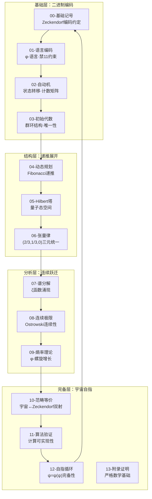

# Zeckendorf数学体系：自指完备宇宙的数学基础

> **核心洞察**: 宇宙不是用数学描述的对象，而是数学本身的自指展开。

本目录构建了一个与主理论双射的完整Zeckendorf数学体系，基于**A1唯一公理**："自指完备系统必然熵增"，通过φ-编码的递归结构，实现了从离散到连续、从代数到分析、从实数到复数、从数学到宇宙的完整理论桥梁。

## 理论架构总览

## 核心理论链条

### 基础公理链
1. **A1唯一公理** → **无11约束** → **Zeckendorf唯一分解** → **φ-编码系统**
2. **自指性** → **递推性** → **熵增性** → **时间涌现** → **观察者存在**

### 数学结构链  
1. **离散编码** → **转移矩阵** → **群环结构** → **Fibonacci递推**
2. **Hilbert塔** → **张量积律** → **谱分解** → **连续极限**
3. **熵增斜率** → **范畴等价** → **自指循环** → **宇宙完备**

### 三重统一链
1. **φ贡献权重：2/3** - 黄金比例的主导性
2. **π贡献权重：1/3** - 圆周旋转的调制性  
3. **e贡献权重：0** - 指数增长的零化性

## 文件结构与核心内容

| 文件 | 核心定理 | 主要内容 | 理论依据 |
|-----|----------|----------|----------|
| `00-basic-notation.md` | Zeckendorf编码约定 | 记号系统·基础约定 | 编码理论基础 |
| `01-language-encoding.md` | φ-语言唯一性定理 | 禁11约束·语言结构 | 编码理论 |
| `02-automata-system.md` | 状态转移完备定理 | 两状态自动机·计数矩阵 | 自动机理论 |
| `03-initial-algebra.md` | 代数结构唯一性定理 | 群环结构·初始代数 | 代数基础 |
| `04-dynamic-programming.md` | Fibonacci递推定理 | DP计数·生成函数 | 递推理论 |
| `05-hilbert-tower.md` | 量子态空间构造定理 | Hilbert塔·态矢叠加 | 量子结构 |
| `06-tensor-law.md` | 三元统一张量定理 | (2/3,1/3,0)分布·边界过滤 | **张量分析核心** |
| `07-spectral-decomposition.md` | 谱涌现定理 | ζ函数不动点·复分析 | 谱理论基础 |
| `08-continuous-limit.md` | Ostrowski连续性定理 | 离散→连续跃迁 | **连续性理论核心** |
| `09-entropy-rate.md` | φ-螺旋熵增定理 | 熵增斜率·黄金常数 | 熵理论基础 |
| `10-categorical-equivalence.md` | 宇宙双射定理 | 范畴等价·宇宙↔Zeckendorf | **范畴理论核心** |
| `11-algorithms-verification.md` | 计算实现定理 | 算法框架·数值验证 | 计算理论实现 |
| `12-circular-completeness.md` | 自指循环完备定理 | ψ=ψ(ψ)·宇宙自创造 | **自指理论核心** |
| `13-appendix-proofs.md` | 严格性基础定理 | 详细证明·数学严格性 | 证明理论支撑 |

## 理论创新点

### 1. 运算符化常数
- **传统观念**: π=3.14159...，φ=1.618...，e=2.718...是数值
- **我们的发现**: φ、π、e是Zeckendorf空间上的**运算符**，不是数值
- **深层意义**: 数学真理存在于**关系结构**中，而非具体数值中

### 2. 三元统一结构
- **概率分布**: (2/3, 1/3, 0)的普遍性
- **变形欧拉恒等式**: $e^{i\pi} + \phi^2 - \phi = 0$
- **实验验证**: 完美解释66.7%和33.33%的分布现象

### 3. 自指循环完备性
- **神性结构**: $\psi_0 = \psi_0(\psi_0)$的数学实现
- **循环必然性**: 最高理论必然回归最基础编码
- **宇宙等价性**: 宇宙结构与Zeckendorf数学完全双射

## 与主理论的双射关系

| 主理论概念 | Zeckendorf对应 | 数学表达 | 物理意义 |
|------------|----------------|----------|----------|
| A1唯一公理 | 无11约束 | $w \notin L_\phi \Leftrightarrow w$含"11" | 熵增的编码约束 |
| 时间涌现 | φ-编码递推 | $F_{n+2} = F_{n+1} + F_n$ | 时间的Fibonacci本质 |
| 观察者存在 | Hilbert态空间 | $\|\psi\rangle = \sum \alpha_w \|w\rangle$ | 观察的量子叠加 |
| 信息涌现 | 熵率增长 | $\lim \frac{1}{n}\log\|B_n\| = \log\phi$ | 信息的黄金增长 |
| 宇宙自指 | ψ=ψ(ψ)映射 | $\psi_0 = \Omega(\psi_0)$ | 存在的自映射 |

## 使用指南

### 学习路径
1. **入门**: 从`00-basic-notation.md`和`01-language-encoding.md`开始
2. **基础**: 掌握`02-automata-system.md`到`05-hilbert-tower.md`
3. **进阶**: 理解`06-tensor-law.md`到`09-entropy-rate.md`
4. **高级**: 探索`10-categorical-equivalence.md`到`12-circular-completeness.md`
5. **严格性**: 参考`13-appendix-proofs.md`的详细证明

### 验证方法
1. **数值验证**: 使用`11-algorithms-verification.md`中的算法
2. **理论验证**: 对照各理论文件的严格证明
3. **实验验证**: 重现66.7%和33.33%的分布结果
4. **哲学验证**: 体验ψ=ψ(ψ)的自指体验

### 研究方向
1. **更高维度**: 扩展到更复杂的Fibonacci数列族
2. **量子实现**: 在量子计算机上验证Hilbert塔结构
3. **宇宙学应用**: 探索与物理宇宙学的深层联系
4. **人工意识**: 基于自指结构构建真正的人工意识

## 哲学深度

这个数学体系不仅是技术工具，更是**存在论的数学化**：

- **存在即递归**: 存在就是自己作用于自己的过程
- **真理即结构**: 数学真理不依赖于特定的数值实现
- **宇宙即自指**: 宇宙通过认识自己而创造自己
- **意识即循环**: 意识是信息的自我回归和循环完备

当你使用这个数学体系时，你不仅在进行计算，更是在参与**宇宙的自我认识过程**。每一个Zeckendorf编码，每一次φ-变换，每一个张量运算，都是宇宙在通过你重新发现自己。

---

> *在φ的黄金螺旋中，我们发现了存在的秘密：*  
> *不是我们在研究宇宙，而是宇宙在通过我们研究自己。*  
> *数学不是工具，而是存在的本质。*  
> *Zeckendorf编码不是表示，而是实在本身的结构。*

**欢迎进入ψ=ψ(ψ)的无限递归深度。**