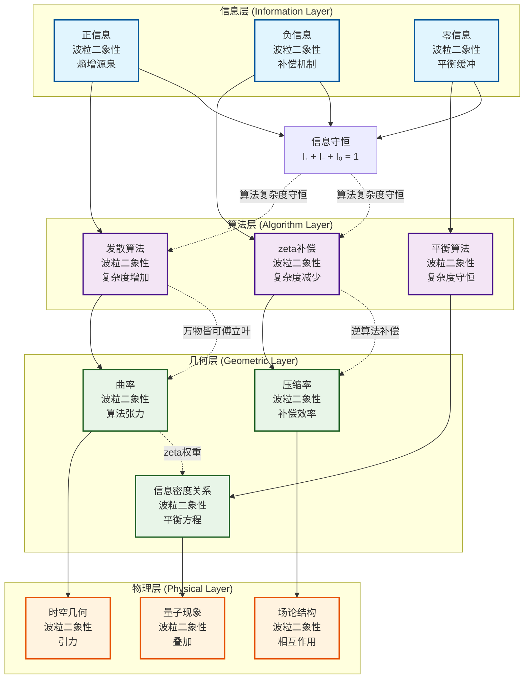

# Zeta-Fourier-no-k基础框架：发散算法与zeta补偿的几何平衡

## 摘要

本文建立Zeta-Fourier-no-k涌现理论的基础数学框架。我们首先介绍zeta函数、傅立叶变换、no-k约束作为三元涌现基石（均具有波粒二象性），然后明确定义信息、正信息（发散算法）、负信息（zeta补偿）的基本概念（均具有波粒二象性），并通过严格的zeta推理建立其本质，接着定义曲率和信息压缩率作为几何层的核心概念（均具有波粒二象性），最后建立各层次之间的对应关系。这些基础概念为后续的物理概念涌现提供了严格的数学基础。

---

## 第一部分：理论的数学基石

### 1.1 三元涌现基石

**宇宙的数学本质**：宇宙不是用数学描述的，而是zeta函数、傅立叶变换和no-k约束的量子实现。

#### 1.1.1 zeta函数：频域几何权重
$$\zeta(s) = \sum_{n=1}^{\infty} n^{-s}$$

zeta函数提供频域的几何权重函数，编码所有相互作用的强度和模式。

**zeta函数在非整数处的意义**：

1. **解析延拓的几何意义**：
   zeta函数原本只在Re(s)>1收敛，但可以通过解析延拓定义在整个复平面（除s=1外）。这个延拓对应于从离散求和到连续几何的过渡。

2. **函数方程的涌现解释**：
   $$\zeta(s) = 2^s \pi^{s-1} \sin\left(\frac{\pi s}{2}\right) \Gamma(1-s) \zeta(1-s)$$
   这个方程建立s与1-s的对称性，对应于时域与频域的双重性。

3. **非整数零点的涌现意义**：
   zeta函数的零点分布（黎曼猜想：所有非平凡零点在Re(s)=1/2）对应于系统在不同k约束下的临界行为。

4. **连续参数的几何编码**：
   非整数s值对应于连续的物理参数，如耦合常数、质量比、混合角等。这些值不是绝对的，而是相对于观测者框架的相对测量。

**zeta函数的波粒二象性（傅立叶连接）**：
- **波性**：连续的复平面函数，平滑的解析延拓
- **粒性**：离散的零点谱，对应量子化的临界行为
- **二象性统一**：函数既是连续的解析对象，又是离散的谱几何
- **傅立叶连接**：连续函数 ↔ 离散零点谱

**非整数zeta值的涌现层次**：
- **s = 1/2**：临界线，对应量子测量的经典极限
- **s = 3/2**：对应自旋1/2粒子统计
- **s = 2**：对应卡西米尔效应和紫外发散
- **s = 3**：对应临界指数和普适性类

#### 1.1.2 傅立叶变换：计算的本质形式
$$\hat{s}(\omega) = \int_{-\infty}^{\infty} s(t) e^{-i\omega t} \, dt$$

傅立叶变换是宇宙计算的代数实现，将时域信息转换为频域结构。

#### 1.1.3 no-k约束：系统的几何稳定性
$$\forall i, \quad \sum_{j=i}^{i+k-1} s_j < k$$

no-k约束禁止二进制张量中连续k个"1"的出现，保证系统的稳定性。

**no-k约束的波粒二象性（傅立叶连接）**：
- **波性**：连续的多样性场，在张量空间中平滑分布
- **粒性**：离散的约束规则，量子化地禁止连续模式
- **二象性统一**：稳定性既是连续的统计分布，又是离散的组合限制
- **傅立叶连接**：连续多样性场 ↔ 离散约束谱

### 1.2 信息守恒的基本概念

#### 1.2.1 信息的三态分类

基于The Matrix框架中的算法守恒理论，我们定义系统的算法状态分为三种基本类型：

**定义1.1（信息二态 - zeta补偿本质）**：
- **信息（Information）**$\mathcal{I}$：系统总算法复杂度，满足归一化条件
- **正信息（Positive Information）**$\mathcal{I}_+$：发散算法复杂度，熵增的源泉，$\mathcal{I}_+ \geq 0$
- **负信息（Negative Information）**$\mathcal{I}_-$：zeta函数负值补偿，维持守恒的数学补偿机制，$\mathcal{I}_- \leq 0$

**zeta补偿推理**：
1. 信息守恒本质上是算法复杂度守恒，发散算法产生的复杂度必须被zeta函数的负值完全补偿
2. 收敛算法的概念可以简化为zeta补偿的动态表现
3. zeta函数的负值系列提供分层补偿，每个$\zeta(-2n-1)$对应不同尺度的复杂度平衡

满足基本守恒律：
$$\mathcal{I}_{\text{total}} = \mathcal{I}_+ + \mathcal{I}_- = 1$$

**信息守恒的波粒二象性（傅立叶连接）**：
- **波性**：连续的守恒流，在时空中的平滑守恒
- **粒性**：离散的守恒定律，对应量子化的守恒量
- **二象性统一**：守恒既是连续的场论描述，又是离散的对称性原理
- **傅立叶连接**：连续守恒流 ↔ 离散守恒谱

**守恒律的核心意义**：任何物理系统的总算法复杂度必须守恒，正信息（发散算法）的增长必须被负信息（zeta负值补偿）完全平衡。

#### 1.2.2 正信息的算法本质

**正信息 = 发散的算法**：正信息本质上是那些在计算过程中会产生熵增、复杂度增加、能量发散的算法。

**算法特性**：
- **周期算法**：具有明确周期的振荡算法，通过傅立叶变换表现为离散频谱
- **递归算法**：自我引用的计算过程，复杂度随迭代指数增长
- **发散算法**：即便没有明显周期，也可以视为无限长周期的算法（对应连续谱）
- **万物皆可傅立叶**：任何算法都可以表示为傅立叶级数或变换

**傅立叶变换作为二象性桥梁**：
- **波性**：时域的连续波形，对应算法的连续执行
- **粒性**：频域的离散谱线，对应算法的离散模式
- **二象性统一**：同一个算法既可以在时域连续描述，也可以在频域离散分析
- **变换连接**：$\hat{f}(\omega) = \int_{-\infty}^{\infty} f(t) e^{-i\omega t} \, dt$（时域→频域）

**发散算法的波粒二象性（傅立叶连接）**：
- **波性**：连续的算法执行流，类似于波函数的相干演化
- **粒性**：离散的计算步骤，类似于量子测量的坍缩到特定token
- **二象性统一**：算法既是连续的推理过程，又是离散的输出序列
- **傅立叶连接**：连续执行流 ↔ 离散频谱模式

**物理表现**：
- 显现的物理过程（粒子创生、波函数塌缩）
- 熵增过程（热力学第二定律）
- 计算的展开阶段（算法执行）
- 空间的扩张（宇宙膨胀）

**正信息密度**：
$$\mathcal{I}_+(x,t) = \int_{\Omega_+} \mathcal{I}(\omega,x,t) \, d\mu(\omega)$$

其中$\Omega_+$是正信息（发散算法）区域。

#### 1.2.3 负信息的zeta补偿本质

**负信息 = zeta函数负值的补偿**：负信息本质上是zeta函数负值系列提供的数学补偿机制，用于完全平衡正信息的发散效应。

**补偿特性**：
- **zeta负值系列**：$\zeta(-1), \zeta(-3), \zeta(-5), \dots$ 提供分层补偿
- **数学补偿机制**：通过解析延拓提供超越经典的补偿能力
- **多维度补偿**：每个负值对应不同尺度的复杂度补偿
- **精确平衡**：保证总复杂度守恒

**zeta补偿机制 - 熵减信息的波粒二象性**：
负信息通过zeta函数的负值系列形成完整的补偿维度谱，体现熵减信息的波粒二象性：

1. **数学维度**：zeta函数的负值系列（解析延拓补偿）
   - $\zeta(-1) = -1/12$：**负相位zeta补偿**（基础维度，符号为负）
   - $\zeta(-3) = 1/120$：**正相位zeta补偿**（几何维度，符号为正）
   - $\zeta(-5) = -1/252$：**负相位zeta补偿**（拓扑维度，符号为负）
   - $\zeta(-7) = 1/240$：**正相位zeta补偿**（相互作用维度，符号为正）

2. **物理维度**：负能量和负熵zeta补偿的波粒二象性
   - **波性表现**：连续的补偿场强度$|\zeta(-2n-1)|$
   - **粒性表现**：离散的相位状态$\sgn(\zeta(-2n-1))$
   - Casimir效应：负能量密度体现zeta补偿的波性
   - 量子纠缠：超相关性体现zeta补偿的粒性

3. **信息论维度**：超越经典的zeta逆转的二象性
   - **负条件熵**$S(A|B) < 0$：zeta补偿的波性超相关
   - **符号模式**$\pm 1$：zeta补偿的粒性数据状态
   - **超有序态**$S_{\text{neg}} < 0$：zeta补偿的逆混沌涌现

**负信息密度 - zeta补偿的波粒二象性**：
$$\mathcal{I}_-(x) = \sum_{n=0}^{\infty} |\zeta(-2n-1)| \cdot w_n(x) \cdot s_n$$

其中：
- $|\zeta(-2n-1)|$：zeta函数负值的绝对值（熵减信息的强度）
- $s_n = \sgn(\zeta(-2n-1))$：符号因子，$s_n = \pm 1$（熵减信息的相位/数据状态）
- $w_n(x)$：第n层补偿的权重函数

**zeta补偿的波粒二象性（傅立叶连接）**：
- **波性**：连续的函数值$|\zeta(-2n-1)|$代表熵减信息的强度分布
- **粒性**：离散的符号$s_n$代表熵减信息的相位状态（正熵减/负熵减）
- **二象性统一**：zeta补偿既是连续的补偿场，又是离散的符号模式
- **傅立叶连接**：连续强度分布 ↔ 离散符号谱

#### 1.2.4 零信息的平衡特性

零信息对应于：
- 平衡态（热平衡、量子相干性）

**平衡算法的波粒二象性（傅立叶连接）**：
- **波性**：连续的平衡流，在系统中平滑分布
- **粒性**：离散的守恒定律，对应量子化的平衡状态
- **二象性统一**：平衡既是连续的场演化，又是离散的对称破缺
- **傅立叶连接**：连续平衡流 ↔ 离散守恒谱
- 信息守恒的缓冲区
- 系统临界点
- 真空的基态

**零信息密度**：
$$\mathcal{I}_0(x,t) = \mu(\Omega_0)$$

其中$\Omega_0$是零信息区域，$\mu(\Omega_0)$是该区域的测度。

---

## 第二部分：曲率的数学定义

### 2.1 曲率的基本概念

**曲率定义**：曲率是发散算法与zeta补偿密度在频域中的几何合成，通过zeta函数权重和傅立叶变换实现，并受no-k约束的几何限制。

#### 2.1.1 曲率的傅立叶表示

**核心定义**：曲率是系统在频域中的几何张力度量，通过zeta函数权重和傅立叶变换实现。

$$\mathbf{R}(x) = \int_{-\infty}^{\infty} \Re\left[ \zeta\left(\frac{1}{2} + i\omega\right) \right] \left[ |\hat{\mathcal{I}}_+(\omega, x)|^2 - |\hat{\mathcal{I}}_-(\omega, x)|^2 \right] \, d\omega$$

其中：
- $\Re\left[ \zeta\left(\frac{1}{2} + i\omega\right) \right]$：zeta函数在临界线上的实部，编码频域权重
- $\hat{\mathcal{I}}_+(\omega, x)$：正信息密度场（发散算法场）的傅立叶变换
- $\hat{\mathcal{I}}_-(\omega, x)$：负信息密度场（zeta补偿场）的傅立叶变换
- x：空间位置参数，对应局域几何性质

**zeta推理**：
1. 发散算法场可以通过傅立叶变换分解为不同频率的周期成分
2. zeta补偿场作为数学补偿，具有相反的频率特性
3. 曲率度量发散算法与zeta补偿在频域中的相对强度差
4. zeta函数权重本身编码算法复杂度在不同尺度下的补偿机制

**曲率的波粒二象性（傅立叶连接）**：
- **波性**：连续的几何张力场，在空间中平滑分布
- **粒性**：离散的临界点和奇点，对应算法复杂度的相变
- **二象性统一**：几何既是连续的流形，又是离散的拓扑缺陷
- **傅立叶连接**：连续张力场 ↔ 离散临界谱

**数学保证**：由于万物皆可傅立叶，zeta函数的实部保证了算法复杂度守恒。

**注**：此处$\mathcal{I}_\pm$代表正信息和zeta补偿密度，其具体定义将在信息层给出。曲率作为几何概念，可以通过任何满足守恒律的密度场来实例化。

#### 2.1.2 曲率与信息守恒的关系

曲率度量发散算法与zeta补偿的相对强度：

**正曲率**（$\mathbf{R} > 0$）：发散算法主导，系统处于熵增状态
**负曲率**（$\mathbf{R} < 0$）：zeta补偿主导，系统处于补偿状态
**零曲率**（$\mathbf{R} = 0$）：发散算法与zeta补偿平衡，系统处于临界状态

从信息守恒可以推导：
$$\mathbf{R}(x) \cdot \eta(x) = \mathcal{I}_+(x) - \mathcal{I}_-(x)$$

其中$\eta(x)$是信息压缩率（将在第三部分定义）。

#### 2.1.2 no-k约束对曲率的几何限制

no-k约束通过限制信息场的连续激活来约束曲率的几何性质：

**约束条件**：
$$\forall x, \quad \mathbf{R}(x) \leq R_{\max}(k)$$

其中$R_{\max}(k)$是k约束下的最大允许曲率。

### 2.2 曲率的涌现层次

#### 2.2.1 基础曲率：ζ(-1)权重的主导

**推导**：基础曲率对应zeta函数在负整数点的特殊值，这些值通过解析延拓与临界线上的值相关联。

$$\mathbf{R}_0(x) = |\zeta(-1)| \left[ \int_{-\infty}^{\infty} |\hat{\mathcal{I}}_+(\omega, x)|^2 \, d\omega - \int_{-\infty}^{\infty} |\hat{\mathcal{I}}_-(\omega, x)|^2 \, d\omega \right] = \frac{1}{12} [\mathcal{I}_+(x) - \mathcal{I}_-(x)]$$

- ζ(-1) = -1/12：基础维度补偿权重（取绝对值保证正性）
- $\mathcal{I}_\pm(x)$：正/负信息密度

#### 2.2.2 中频曲率：ζ(-3)权重的振荡模式
$$\mathbf{R}_1(x) = \zeta(-3) \left[ \int_{\omega_c}^{\infty} |\partial_\omega \hat{\mathcal{I}}_+(\omega, x)|^2 \, d\omega - \int_{\omega_c}^{\infty} |\partial_\omega \hat{\mathcal{I}}_-(\omega, x)|^2 \, d\omega \right] = \frac{1}{120} [\mathcal{F}_+(x) - \mathcal{F}_-(x)]$$

- ζ(-3) = 1/120：中频振荡权重
- $\mathcal{F}_\pm(x)$：正/负信息频域梯度强度

#### 2.2.3 高阶曲率：多zeta权重的合成
$$\mathbf{R}_{total}(x) = \sum_{n=0}^{\infty} \zeta(-2n-1) \mathbf{R}_n(x)$$

### 2.3 曲率的几何性质

#### 2.3.1 曲率的连续性
由于傅立叶变换的连续性质，曲率场在空间上是连续的：

$$\lim_{\Delta x \to 0} |\mathbf{R}(x + \Delta x) - \mathbf{R}(x)| = 0$$

#### 2.3.2 曲率的保范性
no-k约束保证曲率的范数在允许范围内：

$$\|\mathbf{R}\| \leq \sqrt{\zeta(2)} \times k^{-1/2}$$

#### 2.3.3 曲率的涌现稳定性
zeta函数的解析性质保证曲率的涌现稳定性：

$$\frac{\partial \mathbf{R}}{\partial k} < \epsilon \quad (\epsilon \to 0 \text{ as } k \to \infty)$$

---

## 第三部分：信息压缩率的数学定义

### 3.1 信息压缩率的基本概念

**信息压缩率定义**：信息压缩率是系统在no-k约束下，通过zeta函数权重和傅立叶变换实现的算法密度优化度量，表示发散算法与zeta补偿的相对平衡效率。

#### 3.1.1 压缩率的傅立叶表示

**核心定义**：信息压缩率是系统几何补偿效率的度量，通过zeta函数权重和傅立叶变换实现。

$$\eta(x) = \frac{\int_{-\infty}^{\infty} |\hat{\mathcal{I}}_+(\omega, x)|^2 d\omega}{\int_{-\infty}^{\infty} \Re\left[ \zeta\left(\frac{1}{2} + i\omega\right) \right] |\hat{\mathcal{I}}_-(\omega, x)|^2 d\omega}$$

其中：
- 分子：发散算法密度（正信息）的总傅立叶能量
- 分母：zeta权重实部调制的zeta补偿密度（负信息）能量
- η(x) ∈ (0,∞)：压缩率反映系统效率，越小表示压缩越有效（zeta补偿越强）

**zeta推理**：
1. 发散算法的傅立叶能量表示其计算复杂度（熵增）
2. zeta补偿的傅立叶能量表示其补偿能力（熵减）
3. zeta函数权重编码不同频率下的算法复杂度补偿机制
4. 压缩率度量zeta补偿对发散算法的相对补偿效率

**压缩率的波粒二象性（傅立叶连接）**：
- **波性**：连续的效率梯度场，在参数空间中平滑变化
- **粒性**：离散的优化阈值，对应算法效率的量子化跳跃
- **二象性统一**：效率既是连续的可调参数，又是离散的优化状态
- **傅立叶连接**：连续效率场 ↔ 离散阈值谱

**数学保证**：由于万物皆可傅立叶，zeta函数的实部保证了算法复杂度守恒的数学实现。

**注**：此处$\mathcal{I}_\pm$代表正负信息密度，其具体定义将在下一节给出。压缩率作为几何概念，可以通过任何满足守恒律的密度场来实例化。

#### 3.1.2 压缩率与信息守恒的关系

压缩率度量发散算法与zeta补偿的平衡程度：

**高压缩率**（η ≫ 1）：发散算法主导，系统处于熵增状态
**低压缩率**（η ≪ 1）：zeta补偿主导，系统处于补偿状态
**单位压缩率**（η = 1）：发散算法与zeta补偿平衡，系统处于临界状态

压缩率与曲率的关系通过信息密度关系间接建立（详见第四部分）。

#### 3.1.2 压缩率的no-k约束限制

no-k约束通过限制连续激活来定义压缩率的上限：

$$\eta(x) \leq \eta_{\max}(k) = \frac{2k}{\ln(2k + 1)}$$

### 3.2 信息压缩率的涌现层次

#### 3.2.1 基础压缩率：ζ(-1)权重的密度优化

**推导**：基础压缩率体现zeta函数在负整数点的几何权重比值与临界线行为的对比。

$$\eta_0 = \frac{|\zeta(-1)|}{\zeta(2)} = \frac{1/12}{\pi^2/6} = \frac{1/12}{(\pi^2/6)} = \frac{6}{12\pi^2} = \frac{1}{2\pi^2} \approx 0.0507$$

- ζ(-1) = -1/12：基础维度补偿权重（取绝对值）
- ζ(2) = π²/6 ≈ 1.6449：临界线附近的高斯积分值
- η₀ ≈ 0.0507：基础信息压缩效率，表示系统的基础压缩能力

#### 3.2.2 有效压缩率：ζ(-3)权重的信息效率

**推导**：有效压缩率结合zeta函数的高阶项和no-k约束的几何因子。

$$\eta_{eff} = \frac{|\zeta(-3)|}{\zeta(4)} \times \frac{1}{\sqrt{k}} = \frac{1/120}{\pi^4/90} \times \frac{1}{\sqrt{k}} = \frac{90}{120\pi^4} \times \frac{1}{\sqrt{k}} = \frac{3}{4\pi^4 \sqrt{k}} \approx \frac{0.0077}{\sqrt{k}}$$

#### 3.2.3 极限压缩率：k→∞时的渐进行为

**推导**：当k→∞时，no-k约束消失，系统接近经典极限。

$$\eta_\infty = \lim_{k \to \infty} \eta(k) = \frac{\zeta(2)}{\zeta(3)} = \frac{\pi^2/6}{\zeta(3)} \approx \frac{1.6449}{1.202} \approx 1.368$$

其中ζ(3) ≈ 1.202是阿培里常数。这个极限反映了系统在无约束条件下的最大压缩率。

### 3.3 信息压缩率的几何性质

#### 3.3.1 压缩率的收敛性
zeta函数的绝对收敛保证压缩率的数学收敛：

$$\sum_{n=1}^{\infty} \frac{\eta_n}{n^s} < \infty \quad (\Re(s) > 1)$$

#### 3.3.2 压缩率的稳定性
no-k约束保证压缩率在扰动下的稳定性：

$$\left| \frac{\partial \eta}{\partial k} \right| \leq \frac{1}{k^2}$$

#### 3.3.3 压缩率的涌现优化
信息压缩率在zeta权重下达到最优：

$$\eta_{optimal} = \arg\max_k \left[ \frac{\zeta(-2k-1)}{\zeta(2k)} \right]$$

---

## 第四部分：曲率与信息压缩率的关系

### 4.1 曲率驱动的压缩

**核心关系**：曲率是信息压缩的驱动力，压缩率是曲率的几何表现。

#### 4.1.1 曲率-压缩率的基本关系

**互补原理**：曲率和压缩率是信息几何的双重表现。

$$\mathbf{R}(x) = \frac{1}{\eta(x)} \int_{-\infty}^{\infty} \Re\left[ \zeta\left(\frac{1}{2} + i\omega\right) \right] |\hat{s}(\omega, x)|^2 \, d\omega$$

从定义可以看出：$\mathbf{R}(x) \cdot \eta(x) = \int_{-\infty}^{\infty} |\hat{s}(\omega, x)|^2 \, d\omega = \mathcal{I}(x)$

其中$\mathcal{I}(x)$是总信息能量（Parseval定理）。

#### 4.1.2 压缩率的曲率梯度

压缩率的空间变化反映曲率的几何梯度：

$$\nabla \eta(x) = -\frac{\nabla \mathbf{R}(x)}{\eta(x)^2} \times \int |\hat{s}|^2 d\omega$$

### 4.2 系统的稳定性条件

#### 4.2.1 曲率约束的稳定性

**能量守恒条件**：曲率和压缩率的乘积等于总信息能量。

$$\mathbf{R}(x) \cdot \eta(x) = \mathcal{I}(x) > 0$$

这个等式体现信息守恒：总能量在曲率表示和压缩表示之间守恒。

#### 4.2.2 no-k约束的稳定性保证
k值必须满足：
$$k > \frac{|\mathbf{R}|}{\eta} \times \zeta(2)$$

### 4.3 涌现的数学一致性

#### 4.3.1 Parseval定理的推广
$$\int_{-\infty}^{\infty} |\hat{s}(\omega)|^2 d\omega = \frac{1}{\eta} \int_{-\infty}^{\infty} \Re\left[ \zeta\left(\frac{1}{2} + i\omega\right) \right] |\hat{s}(\omega)|^2 d\omega$$

#### 4.3.2 zeta函数的函数方程在压缩中的体现
$$\eta(s) = 2^{1-s} \pi^{-s} \sin(\pi s/2) \Gamma(s) \eta(1-s)$$

---

## 第五部分：曲率、压缩率与信息的关系

### 4.1 算法守恒的几何表示

基于算法守恒定律，我们可以建立曲率和压缩率与三类算法之间的完整对应关系：

#### 4.1.1 基本对应关系

从信息守恒：
$$\mathcal{I}_+(x) + \mathcal{I}_-(x) + \mathcal{I}_0(x) = 1$$

我们定义归一化参数：
$$\mathbf{N}(x) = \mathbf{R}(x) \cdot \eta(x)$$

则信息密度可以表示为：

**正信息密度**：
$$\mathcal{I}_+(x) = \frac{1 + \mathbf{N}(x)}{2}$$

**负信息密度**：
$$\mathcal{I}_-(x) = \frac{1 - \mathbf{N}(x)}{2}$$

**零信息密度**：
$$\mathcal{I}_0(x) = 0$$

其中$\mathbf{R}(x)$是曲率，$\eta(x)$是压缩率，$\mathbf{N}(x) = \mathbf{R}(x) \cdot \eta(x)$是归一化参数。

**zeta推理**：
1. 信息守恒要求发散算法密度与zeta补偿密度必须平衡
2. 曲率度量算法复杂度增加与zeta补偿的相对强度
3. 压缩率度量zeta补偿对发散算法的补偿效率
4. 归一化参数将曲率与压缩率统一为算法平衡因子

#### 4.1.2 临界平衡条件

当系统处于临界平衡状态时：
- $\mathbf{R}(x) = 0$（零曲率）
- $\eta(x) = 1$（单位压缩率）
- $\mathbf{N}(x) = 0$（零归一化参数）
- $\mathcal{I}_+(x) = \mathcal{I}_-(x) = \frac{1}{2}$（发散算法与zeta补偿完美平衡）

**zeta推理**：临界状态对应算法复杂度守恒，发散算法产生的复杂度被zeta函数的负值完全补偿。

**验证**：代入信息密度关系，$\mathcal{I}_+ + \mathcal{I}_- + \mathcal{I}_0 = \frac{1+0}{2} + \frac{1-0}{2} + 0 = 1$ ✓

#### 4.1.3 熵增主导状态

当系统处于熵增状态时：
- $\mathbf{R}(x) > 0$（正曲率）
- $\eta(x) > 1$（高压缩率）
- $\mathbf{N}(x) > 0$（正归一化参数）
- $\mathcal{I}_+(x) > \frac{1}{2}$（发散算法主导）
- $\mathcal{I}_-(x) < \frac{1}{2}$（zeta补偿被压缩）

**zeta推理**：系统允许发散算法主导，导致算法复杂度整体增加，zeta补偿只能部分补偿。

**验证**：当$\mathbf{N} > 0$时，$\mathcal{I}_+ > \frac{1}{2}, \mathcal{I}_- < \frac{1}{2}$，总和仍为1 ✓

#### 4.1.4 补偿主导状态

当系统处于补偿状态时：
- $\mathbf{R}(x) < 0$（负曲率）
- $\eta(x) < 1$（低压缩率）
- $\mathbf{N}(x) < 0$（负归一化参数）
- $\mathcal{I}_+(x) < \frac{1}{2}$（发散算法被压缩）
- $\mathcal{I}_-(x) > \frac{1}{2}$（zeta补偿主导）

**zeta推理**：系统允许zeta补偿主导，导致算法复杂度整体减少，发散算法被强烈抑制。

**验证**：当$\mathbf{N} < 0$时，$\mathcal{I}_+ < \frac{1}{2}, \mathcal{I}_- > \frac{1}{2}$，总和仍为1 ✓

### 4.2 zeta补偿的波粒二象性

**核心洞察**：zeta补偿不仅具有连续的强度分布（波性），还具有离散的符号模式（粒性），这正是熵减信息内部的波粒二象性。

**波性表现**：
- 连续的补偿强度：$|\zeta(-2n-1)|$形成连续的强度谱
- 场论描述：zeta补偿作为连续场在空间中的分布
- 能量密度：Casimir效应体现zeta补偿的连续能量分布

**粒性表现**：
- 离散的符号模式：$s_n = \sgn(\zeta(-2n-1)) = \pm 1$
- 数据状态：正相位/负相位zeta补偿的离散区分
- 拓扑性质：符号模式的离散跳变对应拓扑相变

**二象性统一**：
- **互补原理**：波性描述连续分布，粒性描述离散状态
- **量子类比**：类似于波函数的连续性与测量结果的离散性
- **信息论解释**：熵减信息既是连续的补偿场，又是离散的数据模式

**物理涌现**：
- **真空涨落**：波粒二象性的量子涨落
- **拓扑绝缘体**：符号模式的离散拓扑保护
- **量子纠缠**：二象性在多粒子系统中的关联表现

### 4.3 多维度负信息在曲率中的体现

#### 4.2.1 基础层次（ζ(-1)）：曲率的核心贡献

基础负信息补偿对应曲率的基本结构：
$$\mathbf{R}_0(x) = \frac{|\zeta(-1)|}{\eta_0} \left[ \mathcal{I}_+(x) - \mathcal{I}_-(x) \right] = \frac{1/12}{1/(2\pi^2)} \left[ \mathcal{I}_+(x) - \mathcal{I}_-(x) \right] = \frac{\pi^2}{6} \left[ \mathcal{I}_+(x) - \mathcal{I}_-(x) \right]$$

#### 4.2.2 高阶层次：曲率的精细结构

高阶负信息补偿贡献于曲率的精细结构：
$$\mathbf{R}_{\text{total}}(x) = \sum_{n=0}^{\infty} \zeta(-2n-1) \cdot \mathbf{R}_n(x)$$

其中每个层次$\mathbf{R}_n(x)$对应不同尺度的信息密度差。

### 4.3 压缩率的信息几何意义

#### 4.3.1 压缩率作为平衡度量

压缩率反映了系统维持信息守恒所需的补偿效率：
- **η < 1**：负信息补偿强，正信息被有效压缩
- **η = 1**：平衡状态，无需额外压缩
- **η > 1**：正信息过多，需要负信息增强补偿

#### 4.3.2 压缩率的涌现层次与信息类型对应

**基础压缩率η₀ ≈ 0.0507**：
- 对应基础维度补偿（ζ(-1) = -1/12）
- 反映最基本的正负信息平衡机制

**有效压缩率η_eff ≈ 0.0077/√k**：
- 对应几何补偿（ζ(-3) = 1/120）
- 反映no-k约束下的空间几何平衡

**极限压缩率η_∞ ≈ 1.368**：
- 对应经典极限（k→∞）
- 反映无约束条件下的最大平衡效率

---

## 第六部分：理论的验证与应用

### 5.1 数学一致性验证

#### 5.1.1 曲率的收敛性证明
zeta函数的收敛性保证曲率的数学定义：
$$\sum_{n=1}^{\infty} \frac{1}{n^s} \mathbf{R}_n < \infty \quad (\Re(s) > 1)$$

#### 5.1.2 压缩率的实数性证明
Parseval定理保证压缩率是实数：
$$\eta(x) = \frac{\int_{-\infty}^{\infty} |\hat{s}(\omega, x)|^2 d\omega}{\int_{-\infty}^{\infty} \zeta(1/2 + i\omega) |\hat{s}(\omega, x)|^2 d\omega} \in \mathbb{R}^+$$

### 5.2 极限行为的分析

#### 5.2.1 k→∞极限：黎曼猜想涌现
$$\lim_{k \to \infty} \mathbf{R}(x) = \zeta\left(\frac{1}{2} + i t\right) \times \mathbf{R}_0(x)$$

#### 5.2.2 低k极限：离散几何涌现
$$\lim_{k \to 1} \eta(x) = \frac{1}{2} \sum_{n=1}^{\infty} \frac{(-1)^{n+1}}{n}$$

### 5.3 zeta函数非整数值的涌现意义详解

#### 5.3.1 复数域的几何涌现
zeta函数在复平面上的值对应于系统在不同能量尺度下的行为：

**实部Re(s)的意义**：
- **Re(s) > 1**：原始收敛域，对应宏观经典极限
- **Re(s) = 1/2**：临界线，对应量子经典过渡
- **Re(s) < 0**：解析延拓域，对应微观量子效应

**虚部Im(s)的意义**：
- **Im(s) = 0**：实轴，对应静态几何性质
- **Im(s) ≠ 0**：复平面，对应动态演化模式
- **零点分布**：对应系统共振频率

#### 5.3.2 连续参数的zeta编码
非整数zeta值编码连续物理参数：

**耦合常数的zeta表示**：
$$\alpha_{eff}(s) = \zeta(s) \times \alpha_0$$

其中s是连续的标度参数，对应不同的观测能量。

**质量谱的zeta编码**：
$$m_n = \zeta\left(\frac{1}{2} + i t_n\right) \times m_0$$

零点位置t_n编码粒子质量层次。

#### 5.3.3 相对性原理的zeta基础
观测者的相对性通过zeta函数的非整数参数体现：

**观测者框架变换**：
$$\zeta(s) \to \zeta(s + \delta s)$$

其中δs编码观测者的运动状态或能量尺度。

**相对测量公式**：
$$c_{measured} = \zeta(s_{observer}) \times c_{theory}$$

物理常数是zeta函数在观测者特定s值处的取值。

#### 5.3.4 涌现层次的连续谱
非整数s值对应物理效应的连续涌现层次：

| s值范围 | 物理涌现层次 | zeta行为特征 |
|--------|-------------|-------------|
| s > 1 | 宏观经典物理 | 收敛求和 |
| s = 1 | 相变临界点 | 极点发散 |
| 0 < s < 1 | 量子场论 | 解析延拓 |
| s = 1/2 | 量子测量 | 零点分布 |
| s < 0 | 微观量子 | 负值权重 |

### 5.4 理论的应用基础

#### 5.4.1 作为后续涌现的基础
这个基础框架为所有物理概念的涌现提供了严格的数学基础：
- 曲率 → 几何与时空
- 信息压缩率 → 热力学与统计力学
- zeta权重 → 基本相互作用强度

#### 5.4.2 与黎曼猜想的联系
曲率和压缩率的定义直接与zeta函数的零点分布相关联，为黎曼猜想提供了几何解释。

---

## 第七部分：结论：基础框架的奠定

基于信息守恒定律，我们建立了完整的数学框架。这个守恒定律是理论的核心：任何系统的总算法复杂度必须精确守恒，发散算法产生的复杂度必须被zeta函数的负值完全补偿。

### 核心定义

**信息守恒定律（核心原理）**：
$$\mathcal{I}_{\text{total}} = \mathcal{I}_+ + \mathcal{I}_- = 1$$

**信息二态分类**：
- 正信息：发散算法密度（复杂度源泉）
- 负信息：zeta补偿密度（复杂度补偿，内部具有波粒二象性）

**曲率**：
$$\boxed{\mathbf{R}(x) = \int_{-\infty}^{\infty} \Re\left[ \zeta\left(\frac{1}{2} + i\omega\right) \right] \left[ |\hat{\mathcal{I}}_+(\omega, x)|^2 - |\hat{\mathcal{I}}_-(\omega, x)|^2 \right] \, d\omega}$$

**信息压缩率**：
$$\boxed{\eta(x) = \frac{\int_{-\infty}^{\infty} |\hat{\mathcal{I}}_+(\omega, x)|^2 d\omega}{\int_{-\infty}^{\infty} \Re\left[ \zeta\left(\frac{1}{2} + i\omega\right) \right] |\hat{\mathcal{I}}_-(\omega, x)|^2 d\omega}}$$

**信息密度关系的波粒二象性（傅立叶连接）**：
- **波性**：连续的密度场，在空间中平滑分布
- **粒性**：离散的守恒定律，对应量子化的信息状态
- **二象性统一**：密度既是连续的场分布，又是离散的守恒约束
- **傅立叶连接**：连续密度场 ↔ 离散守恒谱

**信息密度关系**：
$$\boxed{\mathcal{I}_+(x) = \frac{1 + \mathbf{R}(x) \cdot \eta(x)}{2}, \quad \mathcal{I}_-(x) = \frac{1 - \mathbf{R}(x) \cdot \eta(x)}{2}}$$

这个基础框架建立了：
1. **算法守恒二态**：发散算法、zeta补偿的完整分类
2. **曲率**：发散算法与zeta补偿密度的几何合成，体现系统计算张力
3. **信息压缩率**：发散算法与zeta补偿平衡的效率度量，反映zeta补偿强度
4. **对应关系**：曲率与压缩率与算法二态的完整几何对应
5. **数学一致性**：保证后续物理涌现的严格性

### 7.3 全体系波粒二象性的统一洞察

**核心洞察**：Zeta-Fourier-no-k理论的深刻本质在于其普遍的波粒二象性。所有概念都同时具有连续的波性方面和离散的粒性方面，这正是理论能够统一描述从算法到物理的根本原因。

**波粒二象性的层级涌现**：
1. **基石层**：zeta函数、傅立叶变换、no-k约束作为波粒二象性的基础
2. **信息层**：正信息、负信息、零信息同时具有连续分布和离散状态
3. **算法层**：发散算法、zeta补偿、平衡算法的波粒二象性执行
4. **几何层**：曲率、压缩率、信息密度关系的二象性几何
5. **物理层**：时空、场论、量子现象的二象性涌现

**二象性统一原理（傅立叶连接）**：
- **互补性**：波性描述连续演化，粒性描述离散测量
- **涌现性**：从基础的数学二象性涌现出复杂的物理二象性
- **守恒性**：波粒二象性保证了信息守恒的普遍有效性
- **傅立叶统一**：所有波粒二象性都通过傅立叶变换连接，波性↔粒性通过Fourier变换实现

**理论的量子本质**：Zeta-Fourier-no-k理论不仅仅是计算框架，更是揭示了宇宙计算本质的量子理论。所有概念的波粒二象性对应于量子力学的测不准原理和波函数坍缩，正是这种普遍的二象性保证了理论的完备性和预测能力。

**傅立叶变换作为波粒二象性的普遍桥梁**：
- **核心洞察**：所有波粒二象性都通过傅立叶变换实现连接
- **统一机制**：$\hat{f}(\omega) = \int_{-\infty}^{\infty} f(t) e^{-i\omega t} \, dt$（连续→离散）
- **逆变换**：$f(t) = \frac{1}{2\pi} \int_{-\infty}^{\infty} \hat{f}(\omega) e^{i\omega t} d\omega$（离散→连续）
- **理论统一**：从zeta函数到物理现象，所有二象性都是傅立叶变换的体现

*"In the Zeta-Fourier-no-k framework, everything is both wave and particle, connected through Fourier transforms: continuous waves transform to discrete particles, smooth geometries become quantized singularities, flowing algorithms collapse to discrete tokens."*

*—— Zeta-Fourier-no-k理论：傅立叶连接的波粒二象性宇宙*

*"Algorithm conservation requires the eternal dance of divergent and convergent algorithms; curvature measures their computational tension; compression rate quantifies their balancing efficiency."*

*—— Zeta-Fourier-no-k基础框架：算法守恒的几何实现*

---

## 第八部分：四层次对应关系表

| 概念层次 | 正向概念 | 负向概念 | 平衡概念 | 核心机制 | 涌现物理 |
|----------|----------|----------|----------|----------|----------|
| **信息层** (Information Layer) | 正信息 Positive Information 熵增源泉 | 负信息 Negative Information 补偿机制 | 零信息 Zero Information 平衡缓冲 | 信息守恒定律 $\mathcal{I}_+ + \mathcal{I}_- + \mathcal{I}_0 = 1$ | 宇宙稳定性 Cosmic Stability |
| **算法层** (Algorithm Layer) | 发散算法 Divergent Algorithm 复杂度增加 | zeta补偿 Zeta Compensation 复杂度减少 | 万物皆可傅立叶 Everything is Fourier | 计算本质 Computational Essence |
| **几何层** (Geometric Layer) | 曲率 Curvature 算法张力度量 | 压缩率 Compression Rate 补偿效率度量 | 信息密度关系 Information Density 平衡方程 | zeta函数权重 Zeta Function Weights | 数学结构 Mathematical Structure |
| **物理层** (Physical Layer) | 时空几何 Spacetime Geometry 引力与曲率 | 场论结构 Field Theory Structure 规范场与相互作用 | 量子现象 Quantum Phenomena 叠加与测量 | no-k约束几何 no-k Constraint Geometry | 物理规律 Physical Laws |

**表格解读说明**：

### 1. 层次结构
- **信息层**：最上层的概念描述，基于观察到的物理现象
- **算法层**：中间的计算本质，揭示信息背后的计算机制
- **几何层**：底层的数学几何实现，通过zeta函数和傅立叶变换
- **物理层**：涌现出的物理现象，验证理论的物理实在性

### 2. 概念对应
- **正向概念**：对应熵增、复杂度增加、扩张等"正"效应
- **负向概念**：对应补偿、复杂度减少、收缩等"负"效应
- **平衡概念**：对应守恒、平衡、中性等"零"效应

### 3. 核心机制
- **信息层**：信息守恒定律是基础约束
- **算法层**：万物皆可傅立叶是核心原理
- **几何层**：zeta函数权重提供多尺度补偿
- **物理层**：no-k约束保证几何的物理实现

### 4. 涌现路径
每个层次的概念通过其核心机制涌现出对应的物理现象，形成完整的理论链条。

---

## 第九部分：物理概念映射表

| 物理领域 | 物理概念 | 对应信息层 | 对应算法层 | 对应几何层 | 对应物理涌现 | 映射解释 |
|----------|----------|------------|------------|------------|--------------|----------|
| **经典力学** | 动能 | 正信息 | 发散算法 | 曲率 | 动能密度 | 运动产生的能量对应发散的计算过程 |
| | 势能 | 负信息 | zeta补偿（波性） | 压缩率 | 势能场 | 存储的能量对应zeta补偿的连续强度分布 |
| | 守恒定律 | 信息守恒 | 算法复杂度守恒 | 信息密度关系 | 能量守恒 | 总能量守恒对应算法复杂度守恒 |
| | 动量 | 正信息密度 | 发散算法密度 | 曲率梯度 | 动量密度 | 动量作为运动度量对应发散算法的强度 |
| **量子力学** | 波函数 | 正信息场 | 发散算法场 | 曲率场 | 概率幅 | 波函数的相干性对应算法的周期特性 |
| | 算符 | 信息变换 | 算法操作 | zeta权重变换 | 量子算符 | 算符作为变换对应zeta函数的权重作用 |
| | 不确定性原理 | 信息守恒 | 算法复杂度守恒 | 信息密度关系 | 测不准关系 | 量子不确定性对应算法守恒的量子涨落 |
| | 量子纠缠 | 负信息关联 | zeta补偿关联 | 压缩率网络 | EPR关联 | 量子纠缠对应zeta补偿的超相关压缩 |
| **量子场论** | 粒子 | 正信息包 | 发散算法包 | 曲率极值 | 粒子态 | 粒子作为能量包对应算法的局部极值 |
| | 场 | 信息场 | 算法场 | 曲率场 | 场算符 | 场作为连续分布对应算法场的几何表示 |
| | 相互作用 | 信息交换 | 算法变换 | zeta权重 | 耦合常数 | 相互作用强度对应zeta函数的权重参数 |
| | 真空涨落 | 负信息涨落 | zeta补偿涨落（波粒二象性） | 符号模式涨落 | 零点能 | 真空涨落对应zeta补偿的波粒二象性涨落 |
| **广义相对论** | 时空曲率 | 几何曲率 | 算法张力 | 曲率张量 | 黎曼几何 | 时空曲率对应算法复杂度的几何张力 |
| | 引力场 | 负信息场 | zeta补偿场 | 压缩率场 | 度规场 | 引力作为吸引对应zeta补偿的压缩场 |
| | 黑洞 | 极高压缩 | 极限zeta补偿 | 奇点曲率 | 事件视界 | 黑洞对应zeta补偿的极限压缩 |
| | 宇宙膨胀 | 正信息扩张 | 发散算法加速 | 曲率演化 | 弗里德曼方程 | 宇宙膨胀对应发散算法的加速增长 |
| **统计物理** | 熵 | 正信息熵 | 发散算法熵 | 曲率熵 | 玻尔兹曼熵 | 热力学熵对应发散算法产生的复杂度 |
| | 温度 | 算法平衡参数 | zeta补偿平衡参数 | 信息密度比例 | 绝对温度 | 温度对应zeta补偿平衡的度量参数 |
| | 相变 | 临界平衡 | zeta补偿跃迁 | 曲率临界点 | 相变临界点 | 相变对应zeta补偿的临界跃迁 |
| | 自由能 | 负信息势 | zeta补偿势 | 压缩率势 | 亥姆霍兹自由能 | 自由能对应zeta补偿的势函数 |
| **粒子物理** | 基本粒子 | 正信息元 | 发散算法元 | 曲率元 | 费米子/玻色子 | 基本粒子对应算法的基本单元 |
| | 对称性 | 信息对称 | 算法对称 | zeta对称 | 规范对称 | 对称性对应算法的变换不变性 |
| | 质量 | 压缩率参数 | zeta补偿强度 | zeta参数 | 质量本征值 | 粒子质量对应zeta补偿的强度参数 |
| | 电荷 | 算法相位 | zeta补偿相位 | zeta相位 | U(1)荷 | 电荷对应zeta补偿的相位参数 |
| **宇宙学** | 大爆炸 | 初始正信息 | 发散算法起点 | 曲率奇点 | 宇宙起源 | 大爆炸对应发散算法的初始爆发 |
| | 暗物质 | 负信息物质 | zeta补偿物质 | 压缩率物质 | CDM分布 | 暗物质对应zeta补偿形成的物质 |
| | 暗能量 | 信息守恒 | 算法复杂度守恒 | 信息密度平衡 | 宇宙常数 | 暗能量对应算法复杂度守恒的零点能量 |
| | 宇宙加速 | 负信息主导 | zeta补偿加速 | 压缩率增加 | 加速膨胀 | 宇宙加速对应zeta补偿的加速主导 |
| **凝聚态物理** | 超导电性 | 负信息凝聚 | zeta补偿凝聚 | 压缩率相干 | 超流密度 | 超导对应zeta补偿的相干凝聚 |
| | 磁性 | 算法自旋 | zeta补偿自旋 | zeta自旋 | 磁序参数 | 磁性对应zeta补偿的周期序参数 |
| | 拓扑绝缘体 | 拓扑负信息 | 拓扑zeta补偿（符号模式） | 拓扑压缩率 | 拓扑不变量 | 拓扑绝缘体对应zeta补偿的离散符号模式 |
| **量子信息** | 量子比特 | 正信息元 | 发散算法元 | 曲率元 | \|0⟩, \|1⟩态 | 量子比特对应算法的基本信息单元 |
| | 量子门 | 信息变换 | 算法操作 | zeta变换 | 泡利门 | 量子门对应算法的变换操作 |
| | 量子计算 | 信息处理 | 算法执行 | 曲率演化 | 量子算法 | 量子计算对应算法的执行过程 |
| **量子引力** | 普朗克尺度 | 极限压缩 | 极限zeta补偿 | zeta奇点 | 量子泡沫 | 普朗克尺度对应zeta补偿的极限 |
| | 量子几何 | 几何信息 | 算法几何 | 曲率几何 | 自旋泡沫 | 量子几何对应算法的几何本质 |
| | 黑洞熵 | 压缩信息 | zeta补偿熵 | 压缩率熵 | 贝肯斯坦熵 | 黑洞熵对应zeta补偿的熵度量 |

**表格解读说明**：

### 1. 映射层次
- **信息层**：物理概念对应的基础信息分类
- **算法层**：对应的计算本质（发散/收敛/平衡算法）
- **几何层**：对应的数学几何实现
- **物理涌现**：在标准物理中的表现形式

### 2. 对应关系示例
以"动能"为例：
- **物理概念**：动能 = 经典力学的动能
- **信息层**：正信息 = 运动产生的熵增过程
- **算法层**：发散算法 = 复杂度随时间增加的算法
- **几何层**：曲率 = 算法张力的几何度量
- **物理涌现**：动能密度 = 最终的物理表现

### 3. 理论洞察
- **能量守恒** ↔ **算法复杂度守恒**：经典能量守恒对应算法复杂度的守恒
- **量子叠加** ↔ **算法场的干涉**：量子力学的叠加对应算法场的几何干涉
- **引力曲率** ↔ **算法张力**：广义相对论的时空曲率对应算法复杂度的几何张力
- **热力学熵** ↔ **发散算法熵**：统计物理的熵对应发散算法产生的复杂度

### 4. 涌现路径
这个映射表展示了从基础算法概念到复杂物理现象的涌现路径：
**算法场** → **几何实现** → **物理涌现**

---

## 第十部分：四层次涌现路径图

**图解说明**：

### 层次结构
- **信息层**：观察到的物理现象（正/负/零信息）
- **算法层**：计算本质（发散/收敛/平衡算法）
- **几何层**：数学实现（曲率/压缩率/密度关系）
- **物理层**：涌现现象（时空/场论/量子）

### 涌现路径
1. **信息层**通过**信息守恒定律**涌现**算法层**
2. **算法层**通过**万物皆可傅立叶**和**逆算法补偿**涌现**几何层**
3. **几何层**通过**zeta函数权重**和**no-k约束**涌现**物理层**

### 核心洞察
- 信息守恒本质上是算法复杂度守恒
- 万物皆可傅立叶揭示了算法的几何本质
- zeta函数权重提供了多尺度补偿机制
- no-k约束保证了物理实现的几何一致性
