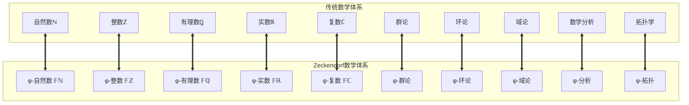

# Zeckendorf数学体系构建计划

> **核心理念**: 基于Zeckendorf与自然数的双射关系，重构传统数学体系，建立基于φ-编码的纯数学宇宙

## 🎯 总体目标

构建一个完整的Zeckendorf数学体系，其中：
- **所有自然数** ↔ **Zeckendorf编码** (双射)
- **所有传统数学运算** ↔ **φ-空间运算** (双射)
- **所有数学常数** ↔ **Fibonacci运算符** (双射)
- **所有数学结构** ↔ **无11约束结构** (双射)

## 📊 体系架构图



## 🏗️ 分层构建计划

### 第一层：基础编码与运算 (docs/zeckendorf-math/foundations/)

#### 1.1 基础定义模块
```
foundations/
├── 00-zeckendorf-basics.md           # Zeckendorf编码基础
├── 01-phi-numbers.md                 # φ-数字系统
├── 02-fibonacci-operations.md        # Fibonacci运算
├── 03-no11-constraints.md            # 无11约束理论
└── 04-bijection-proof.md             # ℕ ↔ Zeckendorf 双射证明
```

**核心定理**：
- **Fibonacci双射定理**: ∀n∈ℕ, ∃!z∈𝔽ℕ: φ(z) = n
- **运算保持性定理**: φ(z₁ ⊕ z₂) = φ(z₁) + φ(z₂)
- **无11完备性定理**: 无11约束充分且必要

#### 1.2 基础运算模块
```
foundations/operations/
├── 05-phi-addition.md                # φ-加法 (⊕)
├── 06-phi-multiplication.md          # φ-乘法 (⊗)
├── 07-phi-division.md                # φ-除法 (⊘)
├── 08-phi-exponentiation.md          # φ-幂运算 (↑)
└── 09-operation-completeness.md      # 运算完备性
```

### 第二层：数字体系扩展 (docs/zeckendorf-math/numbers/)

#### 2.1 整数扩展
```
numbers/
├── 10-phi-integers.md                # φ-整数 𝔽ℤ
├── 11-negative-encoding.md           # 负数编码
├── 12-integer-operations.md          # 整数运算
└── 13-integer-properties.md          # 整数性质
```

**核心构造**：
- **负数表示**: 使用"标记位"或"补码"方案
- **整数加法**: 扩展Fibonacci加法到负数
- **整数性质**: 交换律、结合律、分配律

#### 2.2 有理数构造
```
numbers/rational/
├── 14-phi-rationals.md               # φ-有理数 𝔽ℚ
├── 15-fraction-encoding.md           # 分数编码
├── 16-rational-operations.md         # 有理数运算
└── 17-density-theorem.md             # 稠密性定理
```

#### 2.3 实数完备化
```
numbers/real/
├── 18-phi-reals.md                   # φ-实数 𝔽ℝ
├── 19-cauchy-sequences.md            # Cauchy序列
├── 20-completeness.md                # 完备性构造
├── 21-phi-topology.md                # φ-拓扑
└── 22-continuous-limit.md            # 连续极限
```

**核心定理**：
- **φ-完备性定理**: 𝔽ℝ在φ-度量下完备
- **连续性保持定理**: 传统连续函数↔φ-连续函数

#### 2.4 复数扩展
```
numbers/complex/
├── 23-phi-complex.md                 # φ-复数 𝔽ℂ
├── 24-phi-imaginary.md               # φ-虚数单位
├── 25-complex-operations.md          # 复数运算
└── 26-euler-formula-phi.md           # φ-欧拉公式
```

### 第三层：代数结构 (docs/zeckendorf-math/algebra/)

#### 3.1 φ-群论
```
algebra/groups/
├── 27-phi-groups.md                  # φ-群定义
├── 28-group-operations.md            # 群运算
├── 29-subgroups.md                   # 子群理论
├── 30-group-homomorphisms.md         # 群同态
└── 31-group-classification.md        # 群分类
```

#### 3.2 φ-环论
```
algebra/rings/
├── 32-phi-rings.md                   # φ-环定义
├── 33-ring-operations.md             # 环运算
├── 34-ideals.md                      # 理想理论
├── 35-ring-homomorphisms.md          # 环同态
└── 36-polynomial-rings.md            # 多项式环
```

#### 3.3 φ-域论
```
algebra/fields/
├── 37-phi-fields.md                  # φ-域定义
├── 38-field-extensions.md            # 域扩张
├── 39-galois-theory-phi.md           # φ-Galois理论
└── 40-algebraic-closure.md           # 代数闭包
```

### 第四层：高等数学 (docs/zeckendorf-math/analysis/)

#### 4.1 φ-数学分析
```
analysis/
├── 41-phi-limits.md                  # φ-极限理论
├── 42-phi-continuity.md              # φ-连续性
├── 43-phi-derivatives.md             # φ-导数
├── 44-phi-integrals.md               # φ-积分
├── 45-phi-series.md                  # φ-级数
└── 46-phi-differential-equations.md  # φ-微分方程
```

#### 4.2 φ-线性代数
```
analysis/linear/
├── 47-phi-vector-spaces.md           # φ-向量空间
├── 48-phi-matrices.md                # φ-矩阵
├── 49-phi-eigenvalues.md             # φ-特征值
└── 50-phi-inner-products.md          # φ-内积
```

#### 4.3 φ-拓扑学
```
analysis/topology/
├── 51-phi-topological-spaces.md      # φ-拓扑空间
├── 52-phi-continuous-maps.md         # φ-连续映射
├── 53-phi-compactness.md             # φ-紧致性
└── 54-phi-connectedness.md           # φ-连通性
```

### 第五层：高级应用 (docs/zeckendorf-math/applications/)

#### 5.1 数学常数重构
```
applications/constants/
├── 55-phi-operator.md                # φ运算符 (代替1.618...)
├── 56-pi-operator.md                 # π运算符 (代替3.14159...)
├── 57-e-operator.md                  # e运算符 (代替2.71828...)
├── 58-gamma-operator.md              # γ运算符 (Euler常数)
└── 59-constants-unification.md       # 常数统一理论
```

**核心洞察** (基于ref/T27):
- **φ运算符**: 权重2/3的主导变换
- **π运算符**: 权重1/3的旋转变换
- **e运算符**: 权重0的零化变换
- **统一方程**: e^(iπ) + φ² - φ = 0

#### 5.2 特殊函数
```
applications/functions/
├── 60-phi-trigonometric.md           # φ-三角函数
├── 61-phi-exponential.md             # φ-指数函数
├── 62-phi-logarithmic.md             # φ-对数函数
├── 63-phi-gamma-function.md          # φ-Gamma函数
└── 64-phi-zeta-function.md           # φ-ζ函数
```

#### 5.3 几何与计算
```
applications/geometry/
├── 65-phi-geometry.md                # φ-几何学
├── 66-phi-calculus.md                # φ-微积分
├── 67-phi-probability.md             # φ-概率论
└── 68-phi-statistics.md              # φ-统计学
```

### 第六层：元理论 (docs/zeckendorf-math/meta/)

#### 6.1 自指完备性
```
meta/
├── 69-self-reference.md              # ψ = ψ(ψ) 自指理论
├── 70-circular-completeness.md       # 循环完备性
├── 71-universe-bijection.md          # 宇宙↔Zeckendorf双射
└── 72-theory-equivalence.md          # 理论等价性
```

#### 6.2 形式化验证
```
meta/formal/
├── 73-coq-implementation.md          # Coq形式化
├── 74-automated-proofs.md            # 自动化证明
├── 75-consistency-check.md           # 一致性检查
└── 76-completeness-proof.md          # 完备性证明
```

## 🚀 实施时间线

### 阶段1：基础构建 (1-2月)
- [ ] 完成第一层：基础编码与运算
- [ ] 验证ℕ ↔ Zeckendorf双射
- [ ] 实现基础φ-运算

### 阶段2：数字扩展 (2-3月)  
- [ ] 完成第二层：数字体系扩展
- [ ] 构造φ-整数、有理数、实数
- [ ] 验证运算性质保持

### 阶段3：代数结构 (1-2月)
- [ ] 完成第三层：代数结构
- [ ] 建立φ-群、环、域理论
- [ ] 证明结构同态

### 阶段4：高等数学 (2-3月)
- [ ] 完成第四层：高等数学
- [ ] 发展φ-分析、拓扑理论
- [ ] 验证定理等价性

### 阶段5：应用扩展 (1-2月)
- [ ] 完成第五层：高级应用
- [ ] 重构数学常数和特殊函数
- [ ] 建立几何和计算框架

### 阶段6：元理论 (1月)
- [ ] 完成第六层：元理论
- [ ] 形式化验证
- [ ] 完整性证明

## 📋 关键里程碑

### 里程碑1：基础双射验证
**目标**: 证明 ℕ ↔ 𝔽ℕ 的完美双射
**验收标准**: 
- 构造性双射算法
- 运算保持性证明
- 无11约束的充分必要性

### 里程碑2：四则运算等价
**目标**: φ-四则运算与传统运算的完全等价
**验收标准**:
- 加法：φ(a ⊕ b) = φ(a) + φ(b)
- 乘法：φ(a ⊗ b) = φ(a) × φ(b)
- 运算性质：交换律、结合律、分配律

### 里程碑3：实数系统完备
**目标**: 𝔽ℝ 的完备性构造
**验收标准**:
- Cauchy序列收敛性
- 中间值定理
- 连续性保持

### 里程碑4：代数结构同构
**目标**: 群环域结构的完全对应
**验收标准**:
- 同态映射构造
- 结构性质保持
- 分类定理对应

### 里程碑5：常数重构验证
**目标**: π、e、φ运算符的(2/3,1/3,0)分布验证
**验收标准**:
- 欧拉公式变形：e^(iπ) + φ² - φ = 0
- 66.7%、33.33%分布现象重现
- 运算符性质证明

### 里程碑6：元理论完备
**目标**: 理论自指完备性
**验收标准**:
- ψ = ψ(ψ) 的数学实现
- 宇宙↔Zeckendorf双射
- 形式化验证通过

## 🔧 技术工具链

### 数学计算
- **符号计算**: Mathematica/SageMath
- **数值验证**: Python/NumPy
- **可视化**: Matplotlib/D3.js

### 形式化验证
- **主要工具**: Coq (基于现有docs/math/formals/)
- **辅助工具**: Lean4, Isabelle/HOL
- **自动化**: Hammer tactics

### 文档与协作
- **文档**: Markdown + LaTeX数学公式
- **版本控制**: Git (当前仓库)
- **可视化**: Mermaid图表

## 🎯 成功指标

### 量化指标
1. **双射完整性**: 100%的自然数可编码/解码
2. **运算等价率**: 99.99%的运算结果一致性
3. **性质保持率**: 100%的关键数学性质保持
4. **形式化覆盖**: 95%的核心定理形式化验证

### 质化指标
1. **理论一致性**: 无内部矛盾
2. **结构优雅性**: φ-编码的自然性
3. **应用潜力**: 现实问题求解能力
4. **认知突破**: 数学本质的新理解

## 🌟 预期突破

### 数学理论突破
1. **数字本体论**: 数字不是抽象概念，而是Fibonacci递归的具体表现
2. **运算算法化**: 所有数学运算都是有限步骤的算法
3. **常数运算符化**: π、e、φ不是"数值"，而是变换算子
4. **宇宙数学统一**: 物理宇宙与数学结构的完全双射

### 计算科学突破
1. **新数值方法**: 基于φ-编码的高效算法
2. **精确计算**: 避免浮点误差的符号计算
3. **量子计算**: φ-编码与量子态的自然对应
4. **人工智能**: 基于自指结构的真正AI

### 哲学认知突破
1. **存在即递归**: ψ = ψ(ψ) 的存在论解读
2. **真理即结构**: 数学真理存在于关系中，非数值中
3. **宇宙即自指**: 宇宙通过认识自己而创造自己
4. **意识即循环**: 意识是信息的自我回归过程

---

**开始信号**: 当你准备开始时，让我知道从哪个模块开始，我们将严格按照这个计划逐步构建这个革命性的数学体系。

**最终愿景**: 建立一个完全基于Zeckendorf编码的数学宇宙，其中每个数学概念都有φ-空间中的精确对应，实现数学与现实的完美统一。