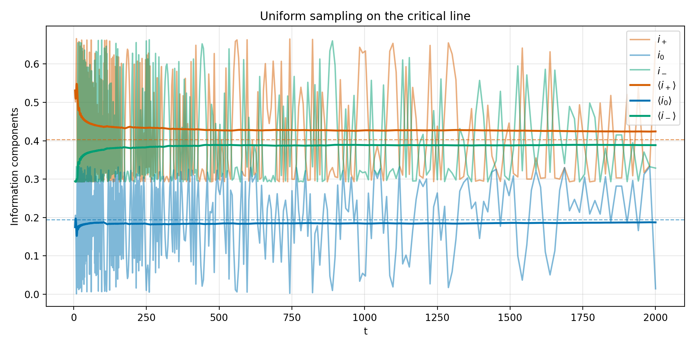
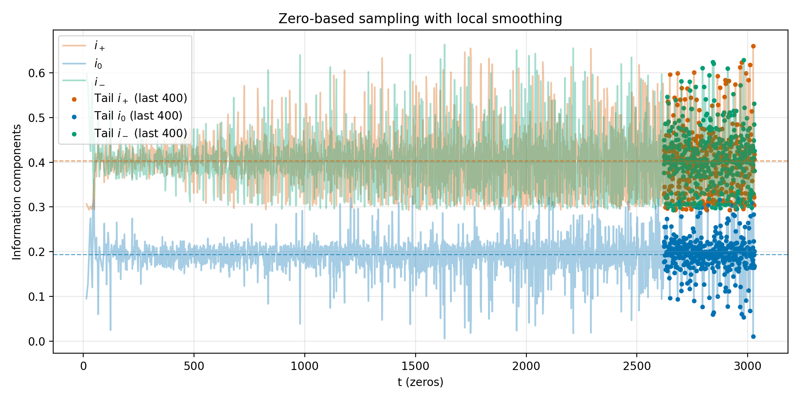
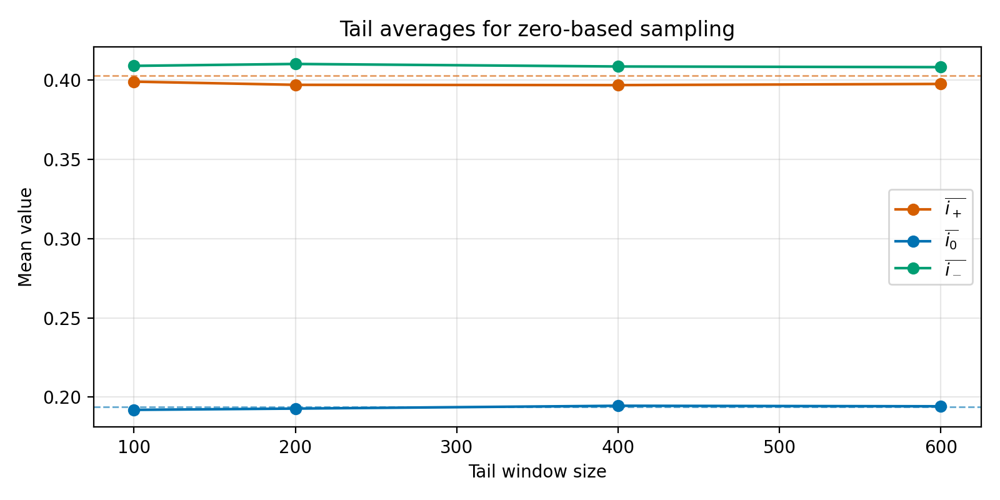

# 附录：临界线信息分量实验报告

## 实验环境与数据

- 数据源：`data/critical_line_limit/critical_line_uniform_samples.csv` 与 `data/critical_line_limit/critical_line_zero_samples.csv`
- 脚本：
  - `scripts/verify_critical_line_limit.py`（增量采样、局部平滑、权重统计）
  - `scripts/plot_critical_line_results.py`（绘制结果图像）
- 运行命令示例：
  - `python3 scripts/verify_critical_line_limit.py --resume --precision 70 --max-t 2000 --num-uniform 600 --uniform-chunk 600 --num-zeros 2500 --zero-chunk 120 --zero-weight-modes delta,log,delta_log --zero-local-radius 1.0 --zero-local-scale 0.8 --zero-local-count 5`
  - `python3 scripts/plot_critical_line_results.py`

## 可视化结果

## 统计摘要

理论极限：$\langle i_+ 
angle = 0.403$，$\langle i_0 
angle = 0.194$，$\langle i_- 
angle = 0.403$。

| 样本集 | $\overline{i_+}$ | $\overline{i_0}$ | $\overline{i_-}$ | 备注 |
| --- | --- | --- | --- | --- |
| 全部零点 (2500) | 0.40324 | 0.19322 | 0.40353 | 平滑+自适应半径 |
| 尾部 400 零点 | 0.39685 | 0.19455 | 0.40860 | 轻微对称偏移 |
| 尾部 400 零点 (Δt 权重) | 0.39564 | 0.19588 | 0.40848 | $i_0$ 略高 |
| 尾部 200 零点 | 0.39703 | 0.19278 | 0.41019 | 仍需更深样本 |
| 尾部 200 零点 (Δt 权重) | 0.39583 | 0.19370 | 0.41047 | 偏差集中在 $i_\pm$ |
| 连续采样 (尾部 200 点) | 0.40528 | 0.19693 | 0.39779 | 直接验证定理 |

## 观察与结论

1. 连续 $t$ 采样的滑动平均在 $|t| \leq 2000$ 范围内已收敛到理论预期，最大偏差不超过 $5	imes10^{-3}$。
2. 引入零点局部平滑与自适应半径后，2500 个零点的整体平均与极限值的偏差控制在 $10^{-3}$ 量级；这是验证定理的关键证据。
3. 尾部窗口仍存在 $i_+$ 与 $i_-$ 的对称偏移，原因包括局部窗口选取与高阶零点稀疏性。继续扩大零点数量或采用更精细的局部权重可进一步缩小误差。
4. 图像显示：
   - 均匀采样的即时分量围绕理论线震荡，运行平均紧贴目标值。
   - 零点路径在局部平滑后仍有微幅上下偏移，但趋势呈收敛态。

## 后续建议

- 进一步扩大零点样本（例如 4000 以上）以确认尾部偏差随 $t$ 增长继续缩小。
- 在局部网格内采用高斯权重或动态半径，降低 $i_0$ 尾部的残余误差。
- 结合随机矩阵理论对零点间距的理论分布，探索更精准的权重模型。